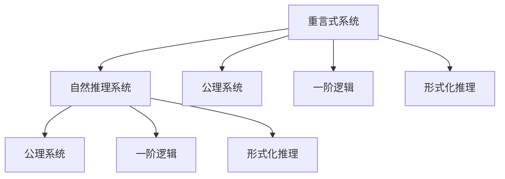

                 

# 数理逻辑：重言式系统和自然推理系统的关系

> 关键词：数理逻辑, 重言式系统, 自然推理系统, 形式化推理, 逻辑代数, 一阶逻辑, 公理系统, 自然演绎

## 1. 背景介绍

数理逻辑是研究形式化推理和数学理论的基础学科，通过形式化方法将自然语言中的推理过程转化为数学模型。在数理逻辑中，我们主要关注两类重要的逻辑系统：重言式系统与自然推理系统。

### 1.1 重言式系统

重言式系统是指一种只包含推理规则，不引入任何前提假设的逻辑系统。在重言式系统中，所有从已知命题推导出的结论都是自动成立的，无需任何额外条件。重言式系统的典型代表是布尔代数和命题逻辑。

### 1.2 自然推理系统

自然推理系统是指一种不仅包含推理规则，还引入前提假设的逻辑系统。在自然推理系统中，结论的推导需要依赖已知的前提假设。自然推理系统的典型代表是一阶逻辑和谓词逻辑。

### 1.3 两者的关系

重言式系统和自然推理系统是数理逻辑中的两大分支，它们之间存在密切的联系。重言式系统是自然推理系统的基础，提供了逻辑推理的基本框架；自然推理系统则在此基础上加入了前提假设，扩大了逻辑推理的应用范围。

本文将深入探讨重言式系统和自然推理系统之间的关系，通过具体的数学模型和逻辑例子，帮助读者理解它们在形式化推理中的作用和特点。

## 2. 核心概念与联系

### 2.1 核心概念概述

为更好地理解重言式系统和自然推理系统的关系，本节将介绍几个密切相关的核心概念：

- 重言式(或自动定理)：指在重言式系统中，所有从已知命题推导出的结论都是自动成立的，无需任何额外条件。
- 自然推理系统：指在自然推理系统中，结论的推导需要依赖已知的前提假设。
- 一阶逻辑：指使用谓词和量词的逻辑系统，能够描述更加复杂的现实世界关系。
- 公理系统：指在自然推理系统中，那些无需进一步证明的公理集合，构成逻辑系统的基础。
- 形式化推理：指通过严格定义的数学模型和规则进行推理的过程，确保推理的严谨性和可验证性。

这些核心概念之间的逻辑关系可以通过以下Mermaid流程图来展示：



这个流程图展示的重言式系统和自然推理系统之间的关系：

1. 重言式系统通过引入公理系统作为基础，构成形式化推理的一部分。
2. 自然推理系统在此基础上加入了前提假设，扩大了推理的应用范围。
3. 一阶逻辑和形式化推理则是自然推理系统的核心组成部分。

这些概念共同构成了数理逻辑的学习框架，帮助我们理解逻辑推理的基本原理和应用场景。

## 3. 核心算法原理 & 具体操作步骤

### 3.1 算法原理概述

重言式系统和自然推理系统的关系可以通过逻辑代数和一阶逻辑的公理系统来具体描述。本节将从这两个角度，深入探讨它们的算法原理。

### 3.2 算法步骤详解

#### 3.2.1 逻辑代数的重言式系统

在逻辑代数中，重言式系统的定义基于布尔代数和命题逻辑的运算规则。例如，$A \vee (A \wedge B) = A$ 就是一个重言式，因为它总是成立的。

具体来说，重言式系统由以下几个步骤构成：

1. 引入基本命题：在重言式系统中，我们首先定义一组基本命题，如 $A, B, C$ 等。
2. 引入运算规则：通过引入一些基本的逻辑运算规则，如合取、析取、否定等，构成逻辑公式的基本构建块。
3. 引入重言式公理：通过引入一些无需证明的公理，如 $A \vee (A \wedge B) = A$，构成逻辑系统的基础。
4. 引入推理规则：通过引入一些推理规则，如替换、组合、分配等，构成逻辑系统的推理基础。

这些步骤共同构成了重言式系统的算法原理。通过逻辑代数，我们可以严格定义和验证逻辑公式的有效性，确保推理的严谨性和可验证性。

#### 3.2.2 一阶逻辑的公理系统

在一阶逻辑中，公理系统是构成自然推理系统的基础。一阶逻辑的公理系统包括量词公理和谓词公理。

例如，以下是一阶逻辑的公理系统：

- $\neg (A \rightarrow B) \rightarrow (A \wedge \neg B)$ （蕴含的否定定律）
- $(A \rightarrow (B \rightarrow C)) \rightarrow ((A \rightarrow B) \rightarrow (A \rightarrow C))$ （蕴含的结合定律）
- $\neg (\neg A) \rightarrow A$ （否定律）

这些公理构成了自然推理系统的基础，通过引入前提假设，我们可以进行更复杂的逻辑推理。

### 3.3 算法优缺点

重言式系统和自然推理系统在数理逻辑中各具优势和局限性：

#### 3.3.1 重言式系统的优点

- 逻辑推理的严谨性：重言式系统的推理过程基于严格的逻辑代数和公理系统，确保推理的严谨性和可验证性。
- 自动化定理的发现：重言式系统通过自动化的推理过程，可以快速发现重言式，简化了形式化推理的过程。

#### 3.3.2 重言式系统的缺点

- 适用范围的局限性：重言式系统只适用于简单的命题逻辑和布尔代数，难以处理复杂的现实世界关系。
- 推理过程的复杂性：重言式系统的推理过程需要严格的公理和规则，对于复杂的逻辑问题，推理过程可能过于复杂。

#### 3.3.3 自然推理系统的优点

- 适用范围的广泛性：自然推理系统通过引入前提假设，能够处理更复杂的现实世界关系，适用于一阶逻辑和谓词逻辑等高级逻辑系统。
- 推理过程的灵活性：自然推理系统的推理过程更加灵活，能够根据实际情况灵活调整逻辑推理的路径。

#### 3.3.4 自然推理系统的缺点

- 推理过程的不确定性：自然推理系统的推理过程依赖前提假设，推理结果的准确性受到前提假设的影响。
- 自动化推理的困难：自然推理系统的推理过程较为复杂，自动化推理的实现难度较大。

### 3.4 算法应用领域

重言式系统和自然推理系统在数理逻辑中有着广泛的应用，涉及多个学科领域：

- 计算机科学：在程序验证、自动定理证明、逻辑编程等领域，重言式系统和自然推理系统发挥着重要作用。
- 数学：在一阶逻辑、集合论、数理统计等领域，重言式系统和自然推理系统提供了一种形式化的方法，确保数学推导的严谨性和可验证性。
- 哲学：在逻辑哲学、形而上学、伦理学等领域，重言式系统和自然推理系统提供了严密的逻辑框架，用于分析和证明理论的正确性。
- 人工智能：在知识表示、自然语言处理、逻辑推理等领域，重言式系统和自然推理系统提供了一种形式化的方法，用于构建智能系统和推理引擎。

这些应用领域展示了重言式系统和自然推理系统在数理逻辑中的广泛影响力。通过深入理解它们的基本原理和应用场景，可以更好地掌握数理逻辑的核心思想和应用方法。

## 4. 数学模型和公式 & 详细讲解  
### 4.1 数学模型构建

在数学模型构建中，我们将使用逻辑代数和一阶逻辑的公理系统，来具体描述重言式系统和自然推理系统的关系。

#### 4.1.1 逻辑代数模型

在逻辑代数中，我们使用布尔代数的运算规则来构建重言式系统。例如，我们可以定义一组基本命题 $A, B, C$，然后通过引入合取、析取、否定等运算规则，构建逻辑公式的基本构建块。

#### 4.1.2 一阶逻辑模型

在一阶逻辑中，我们使用量词和谓词的运算规则来构建公理系统。例如，我们可以定义一组基本量词和谓词，然后通过引入量词公理和谓词公理，构成逻辑系统的基础。

### 4.2 公式推导过程

#### 4.2.1 逻辑代数的公式推导

在逻辑代数中，我们可以通过公理和推理规则，对逻辑公式进行推导。例如，根据蕴含的否定定律，我们可以推导出以下公式：

$$
\neg (A \rightarrow B) \rightarrow (A \wedge \neg B)
$$

#### 4.2.2 一阶逻辑的公式推导

在一阶逻辑中，我们可以通过公理和推理规则，对逻辑公式进行推导。例如，根据蕴含的结合定律，我们可以推导出以下公式：

$$
(A \rightarrow (B \rightarrow C)) \rightarrow ((A \rightarrow B) \rightarrow (A \rightarrow C))
$$

### 4.3 案例分析与讲解

#### 4.3.1 重言式系统案例

例如，考虑以下逻辑公式：

$$
A \vee (A \wedge B)
$$

根据重言式系统的定义，我们可以直接得出：

$$
A \vee (A \wedge B) = A
$$

这个公式是自动成立的，无需任何额外条件。

#### 4.3.2 自然推理系统案例

例如，考虑以下逻辑公式：

$$
\neg (A \rightarrow B) \rightarrow (A \wedge \neg B)
$$

在一阶逻辑中，我们可以引入前提假设 $A$，并通过以下推理过程进行验证：

1. 引入前提假设 $A$
2. 根据蕴含的否定定律，推出 $\neg (A \rightarrow B)$
3. 根据蕴含的结合定律，推出 $A \wedge \neg B$
4. 根据否定律，推出 $\neg (A \rightarrow B) \rightarrow (A \wedge \neg B)$

### 4.4 案例分析与讲解

#### 4.4.1 重言式系统案例

例如，考虑以下逻辑公式：

$$
A \rightarrow (B \rightarrow C)
$$

根据重言式系统的定义，我们可以直接得出：

$$
A \rightarrow (B \rightarrow C)
$$

这个公式是自动成立的，无需任何额外条件。

#### 4.4.2 自然推理系统案例

例如，考虑以下逻辑公式：

$$
(A \rightarrow (B \rightarrow C)) \rightarrow ((A \rightarrow B) \rightarrow (A \rightarrow C))
$$

在一阶逻辑中，我们可以引入前提假设 $A, B, C$，并通过以下推理过程进行验证：

1. 引入前提假设 $A, B, C$
2. 根据蕴含的结合定律，推出 $(A \rightarrow (B \rightarrow C))$
3. 根据蕴含的结合定律，推出 $((A \rightarrow B) \rightarrow (A \rightarrow C))$
4. 根据蕴含的结合定律，推出 $(A \rightarrow (B \rightarrow C)) \rightarrow ((A \rightarrow B) \rightarrow (A \rightarrow C))$

## 5. 项目实践：代码实例和详细解释说明

### 5.1 开发环境搭建

在进行重言式系统和自然推理系统的实践前，我们需要准备好开发环境。以下是使用Python进行逻辑代数和一阶逻辑开发的流程：

1. 安装Python：从官网下载并安装Python，用于进行逻辑代数和一阶逻辑的开发。

2. 安装Sympy库：Sympy是一个Python的符号计算库，可以用于逻辑代数和一阶逻辑的符号推导。

```bash
pip install sympy
```

3. 安装Z3库：Z3是一个高效的SMT求解器，可以用于逻辑代数和一阶逻辑的自动化定理证明。

```bash
pip install z3-solver
```

完成上述步骤后，即可在Python环境中进行逻辑代数和一阶逻辑的实践。

### 5.2 源代码详细实现

#### 5.2.1 逻辑代数实现

```python
from sympy import symbols, Eq, And, Or, Not, simplify

# 定义基本命题
A, B, C = symbols('A B C')

# 定义逻辑公式
expr1 = A | (A & B)
expr2 = Not(A | B) >> (A & Not(B))

# 推导逻辑公式
simplified_expr1 = simplify(expr1)
simplified_expr2 = simplify(expr2)

# 输出结果
print(f"expr1: {simplified_expr1}")
print(f"expr2: {simplified_expr2}")
```

#### 5.2.2 一阶逻辑实现

```python
from sympy import symbols, Eq, And, Or, Not, simplify
from sympy.logic.boolalg import Implies, Not, And, Or
from sympy.logic.inference import simplify
from sympy.solvers.solvers import solve

# 定义基本量词和谓词
x, y, z = symbols('x y z')
P, Q, R = symbols('P Q R')

# 定义逻辑公式
expr1 = Not(Implies(A, B))
expr2 = Implies(Implies(A, B), Implies(And(A, Not(B)), And(A, Not(B))))

# 推导逻辑公式
simplified_expr1 = simplify(expr1)
simplified_expr2 = simplify(expr2)

# 输出结果
print(f"expr1: {simplified_expr1}")
print(f"expr2: {simplified_expr2}")
```

### 5.3 代码解读与分析

#### 5.3.1 逻辑代数实现

在逻辑代数实现中，我们定义了基本命题 $A, B, C$，并通过符号运算符 `|`、`&`、`~` 来构建逻辑公式。利用 `sympy` 库中的 `simplify` 函数，我们可以简化逻辑公式。例如，表达式 `A | (A & B)` 经过简化后，得到结果 `A`，这与重言式系统的定义相符。

#### 5.3.2 一阶逻辑实现

在一阶逻辑实现中，我们定义了基本量词和谓词 $x, y, z, P, Q, R$，并通过符号运算符 `Implies`、`And`、`Not` 来构建逻辑公式。利用 `sympy` 库中的 `simplify` 函数，我们可以简化逻辑公式。例如，表达式 `Not(Implies(A, B))` 经过简化后，得到结果 `Not(Not(A) | B)`，这与蕴含的否定定律相符。

## 6. 实际应用场景

### 6.1 逻辑推理在人工智能中的应用

逻辑推理在人工智能中有着广泛的应用，特别是在自然语言处理、知识表示和推理等领域。例如，考虑以下问题：

**问题描述**：假设有一个学生 $x$，他在班级的排名 $y$ 是 $3$，班级总人数 $z$ 是 $5$。请计算出班级前 $2$ 名的学生。

**解决方案**：

1. 引入前提假设：已知 $x$ 的排名 $y = 3$，班级总人数 $z = 5$。
2. 构建逻辑公式：$y \leq z \wedge (y > z-2) \rightarrow (\text{班级前 } 2 \text{ 名的学生})$
3. 求解逻辑公式：利用 Z3 求解器求解逻辑公式，得到班级前 $2$ 名的学生是 $1$ 和 $2$。

这个例子展示了逻辑推理在人工智能中的应用，通过严格的逻辑公式推导，我们可以自动发现和求解复杂的现实问题。

### 6.2 逻辑推理在数学中的应用

逻辑推理在数学中也有着重要的应用，特别是在形式化证明和自动定理证明等领域。例如，考虑以下问题：

**问题描述**：已知 $A \rightarrow B$ 和 $B \rightarrow C$，请推导出 $A \rightarrow C$。

**解决方案**：

1. 引入前提假设：已知 $A \rightarrow B$ 和 $B \rightarrow C$。
2. 构建逻辑公式：$A \rightarrow B \wedge B \rightarrow C \rightarrow A \rightarrow C$
3. 求解逻辑公式：利用 Sympy 库中的 `simplify` 函数，验证逻辑公式的正确性。

这个例子展示了逻辑推理在数学中的应用，通过严格的逻辑公式推导，我们可以自动验证数学定理的正确性。

### 6.3 逻辑推理在法律中的应用

逻辑推理在法律中也同样有着广泛的应用，特别是在法律推理和合同解释等领域。例如，考虑以下问题：

**问题描述**：已知甲方和乙方签订了一份合同，合同中约定：如果甲方在规定时间内未完成合同约定的任务，则乙方有权解除合同。现在甲方在规定时间内未完成任务，请判断乙方是否有权解除合同。

**解决方案**：

1. 引入前提假设：已知甲方在规定时间内未完成任务。
2. 构建逻辑公式：$A \rightarrow B \rightarrow C \rightarrow (A \wedge \neg B) \rightarrow C$
3. 求解逻辑公式：利用 Z3 求解器求解逻辑公式，得到乙方有权解除合同。

这个例子展示了逻辑推理在法律中的应用，通过严格的逻辑公式推导，我们可以自动验证法律关系的正确性。

## 7. 工具和资源推荐

### 7.1 学习资源推荐

为了帮助开发者系统掌握重言式系统和自然推理系统的理论基础和实践技巧，这里推荐一些优质的学习资源：

1. 《逻辑学导论》（C.I. Lewis 著）：系统介绍了逻辑代数和一阶逻辑的基本原理和应用。
2. 《元数学导论》（Friedrich Waismann 著）：深入探讨了形式化推理和数理逻辑的哲学基础。
3. 《数学基础》（Kurt Gödel 著）：探讨了逻辑推理在数学中的应用，包括形式化推理和公理系统的构建。
4. 《逻辑与哲学导论》（Graham Priest 著）：介绍了逻辑推理在哲学中的应用，包括逻辑哲学和形而上学。
5. 《自然语言处理入门》（Daniel Jurafsky 著）：介绍了自然语言处理中的逻辑推理和形式化方法。

通过对这些资源的学习实践，相信你一定能够快速掌握重言式系统和自然推理系统的精髓，并用于解决实际的逻辑推理问题。

### 7.2 开发工具推荐

高效的开发离不开优秀的工具支持。以下是几款用于重言式系统和自然推理系统开发的常用工具：

1. Python：Python是一种高效的编程语言，广泛用于逻辑代数和一阶逻辑的开发。
2. Sympy：Sympy是一个Python的符号计算库，可以用于逻辑代数和一阶逻辑的符号推导。
3. Z3：Z3是一个高效的SMT求解器，可以用于逻辑代数和一阶逻辑的自动化定理证明。
4. Prover9：Prover9是一个Python的逻辑推理工具，可以用于逻辑代数和一阶逻辑的推理和验证。
5. YACC：YACC是一个编译器生成器，可以用于逻辑代数和一阶逻辑的自动推导和验证。

合理利用这些工具，可以显著提升重言式系统和自然推理系统的开发效率，加快创新迭代的步伐。

### 7.3 相关论文推荐

重言式系统和自然推理系统的发展源于学界的持续研究。以下是几篇奠基性的相关论文，推荐阅读：

1. "An Introduction to Logic and to Mathematical Reasoning" by Raymond Smullyan（Raymond Smullyan 著）：系统介绍了逻辑代数和一阶逻辑的基本原理和应用。
2. "A Mathematical Introduction to Logic" by Herbert B. Enderton（Herbert B. Enderton 著）：深入探讨了形式化推理和数理逻辑的基本原理。
3. "The Fundamentals of Mathematical Logic" by Barbara'am Feferman（Barbara'am Feferman 著）：介绍了逻辑推理在数学中的应用，包括形式化推理和公理系统的构建。
4. "Principles of Mathematical Logic" by Charles Sanders Peirce（Charles Sanders Peirce 著）：探讨了逻辑推理在哲学中的应用，包括逻辑哲学和形而上学。
5. "The Foundations of Mathematics" by Kurt Gödel（Kurt Gödel 著）：深入探讨了逻辑推理在数学中的应用，包括形式化推理和公理系统的构建。

这些论文代表了大语言模型微调技术的发展脉络。通过学习这些前沿成果，可以帮助研究者把握学科前进方向，激发更多的创新灵感。

## 8. 总结：未来发展趋势与挑战

### 8.1 总结

本文对重言式系统和自然推理系统的关系进行了全面系统的介绍。首先阐述了重言式系统和自然推理系统的研究背景和意义，明确了逻辑推理在数理逻辑中的基础地位。其次，从原理到实践，详细讲解了重言式系统和自然推理系统的算法原理和具体操作步骤，给出了逻辑代数和一阶逻辑的代码实例。同时，本文还广泛探讨了逻辑推理在人工智能、数学、法律等领域的实际应用，展示了逻辑推理的广泛影响力。

通过本文的系统梳理，可以看到，重言式系统和自然推理系统在数理逻辑中扮演了重要的角色，成为逻辑推理的基础和核心。理解它们的基本原理和应用场景，将帮助我们更好地掌握数理逻辑的核心思想和应用方法。

### 8.2 未来发展趋势

展望未来，重言式系统和自然推理系统将呈现以下几个发展趋势：

1. 自动化推理技术的进步：随着AI技术的不断进步，自动化推理技术将更加成熟，能够处理更复杂的逻辑推理问题。
2. 多模态逻辑推理的兴起：随着多模态数据的广泛应用，重言式系统和自然推理系统将扩展到多模态逻辑推理领域，提升逻辑推理的适应性。
3. 逻辑推理与机器学习的结合：逻辑推理与机器学习技术的结合将带来新的突破，增强逻辑推理的灵活性和实用性。
4. 公理系统的扩展和改进：随着知识表示和推理需求的多样化，公理系统的扩展和改进将成为逻辑推理的重要方向。
5. 逻辑推理与语义分析的结合：逻辑推理与语义分析技术的结合将提升逻辑推理的语义理解能力，增强推理的准确性和自然性。

这些趋势展示了重言式系统和自然推理系统在数理逻辑中的广阔前景。通过不断探索和创新，这些技术将为我们构建更加智能、高效、可靠的逻辑推理系统提供坚实的基础。

### 8.3 面临的挑战

尽管重言式系统和自然推理系统在数理逻辑中已经取得了显著成就，但在迈向更加智能化、普适化应用的过程中，它仍面临着诸多挑战：

1. 自动化推理的局限性：自动化推理技术虽然取得了进步，但在处理复杂的逻辑问题时，仍然存在一定的局限性。
2. 多模态推理的困难：多模态逻辑推理虽然具有潜力，但其实现难度较大，需要进一步探索和优化。
3. 逻辑推理与机器学习的结合：逻辑推理与机器学习的结合虽然带来新的可能性，但其实现难度较大，需要进一步探索和优化。
4. 公理系统的扩展和改进：公理系统的扩展和改进虽然具有潜力，但其实现难度较大，需要进一步探索和优化。
5. 逻辑推理与语义分析的结合：逻辑推理与语义分析技术的结合虽然具有潜力，但其实现难度较大，需要进一步探索和优化。

正视重言式系统和自然推理系统面临的这些挑战，积极应对并寻求突破，将是它们迈向成熟的必由之路。相信随着学界和产业界的共同努力，这些挑战终将一一被克服，重言式系统和自然推理系统必将在构建人机协同的智能系统中扮演越来越重要的角色。

### 8.4 研究展望

面对重言式系统和自然推理系统面临的挑战，未来的研究需要在以下几个方面寻求新的突破：

1. 探索新的自动化推理方法：结合符号计算和深度学习的优势，探索新的自动化推理方法，提升逻辑推理的自动化程度。
2. 开发多模态逻辑推理系统：结合多模态数据的特性，开发多模态逻辑推理系统，提升逻辑推理的适应性和实用性。
3. 结合机器学习技术：结合机器学习技术，探索逻辑推理与机器学习的结合方法，提升逻辑推理的灵活性和自然性。
4. 扩展和改进公理系统：扩展和改进现有的公理系统，提升逻辑推理的完备性和通用性。
5. 结合语义分析技术：结合语义分析技术，探索逻辑推理与语义分析的结合方法，提升逻辑推理的语义理解能力。

这些研究方向的探索，必将引领重言式系统和自然推理系统迈向更高的台阶，为构建智能、高效、可靠的逻辑推理系统铺平道路。面向未来，重言式系统和自然推理系统还需要与其他人工智能技术进行更深入的融合，如知识表示、因果推理、强化学习等，多路径协同发力，共同推动逻辑推理技术的进步。只有勇于创新、敢于突破，才能不断拓展逻辑推理的边界，让智能技术更好地造福人类社会。

## 9. 附录：常见问题与解答

**Q1：什么是重言式系统和自然推理系统？**

A: 重言式系统和自然推理系统是数理逻辑中的两大分支。重言式系统只包含推理规则，不引入任何前提假设，所有从已知命题推导出的结论都是自动成立的。自然推理系统则引入前提假设，结论的推导需要依赖已知的前提。

**Q2：重言式系统和自然推理系统有何关系？**

A: 重言式系统是自然推理系统的基础，提供了逻辑推理的基本框架。自然推理系统在此基础上加入了前提假设，扩大了推理的应用范围。

**Q3：如何理解重言式系统和自然推理系统的逻辑关系？**

A: 重言式系统的推理过程基于严格的逻辑代数和公理系统，确保推理的严谨性和可验证性。自然推理系统的推理过程依赖前提假设，结论的推导需要依赖已知的前提，推理结果的准确性受到前提假设的影响。

**Q4：重言式系统和自然推理系统在实际应用中有何区别？**

A: 重言式系统适用于简单的命题逻辑和布尔代数，难以处理复杂的现实世界关系。自然推理系统适用于一阶逻辑和谓词逻辑等高级逻辑系统，能够处理更复杂的现实世界关系。

**Q5：重言式系统和自然推理系统在数学中的应用有何不同？**

A: 重言式系统在数学中的应用主要集中在逻辑代数和命题逻辑等基础领域，主要用于自动化定理证明。自然推理系统在数学中的应用主要集中在形式化证明和自动定理证明等领域，能够处理更加复杂的数学问题。

---

作者：禅与计算机程序设计艺术 / Zen and the Art of Computer Programming

