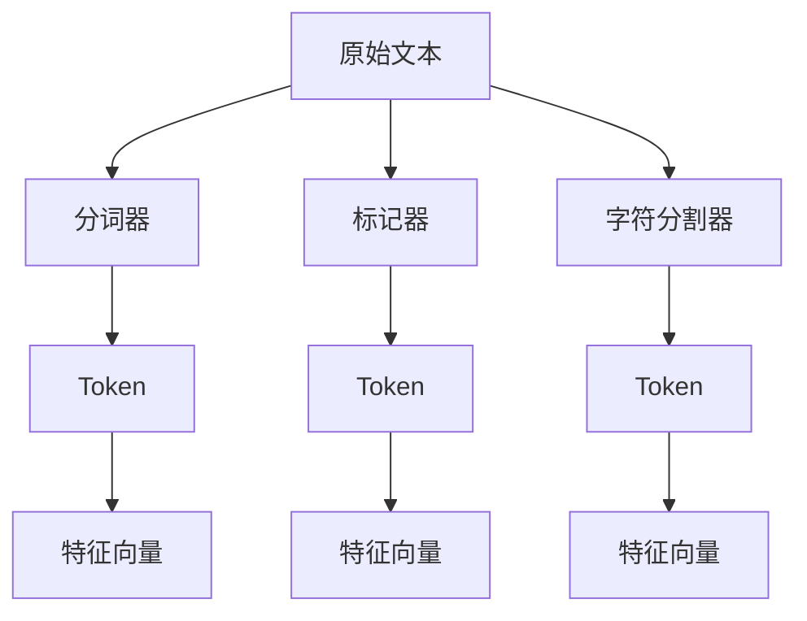

                 

## 1. 背景介绍

在自然语言处理（NLP）领域，文本Tokenization是一个基础且关键的步骤，它在将文本转换为计算机可以处理的数值形式中起到了桥梁作用。文本Tokenization是将文本分割成有意义的单位，如单词或字符，为后续的文本处理提供便利。本文将系统性地介绍文本Tokenization的作用、原理以及具体的实现方法，并探讨其在NLP中的重要地位。

## 2. 核心概念与联系

### 2.1 核心概念概述

#### 2.1.1 Token和Tokenization

在文本处理中，Token是表示文本中最小单元的术语。Token可以是一个单词、标点符号、数字，甚至是一些特殊字符组合。Tokenization就是将连续的文本序列分割成这些Token的过程。

#### 2.1.2 词法分析和句法分析

文本Tokenization是词法分析的基础，词法分析是处理单词的语法属性，而句法分析则是分析句子的结构。Tokenization有助于提高词法分析和句法分析的准确性，因为准确的Tokenization能够使计算机更好地理解文本结构。

#### 2.1.3 文本检索和信息检索

在文本检索和信息检索中， Tokenization是非常关键的步骤，因为它有助于将查询与文档中的Token进行匹配，从而找到相关的信息。正确的Tokenization可以显著提高检索效率和准确性。

#### 2.1.4 文本挖掘和机器学习

在文本挖掘和机器学习中， Tokenization是特征提取的关键步骤。准确的Tokenization有助于提取文本中的有效特征，从而提高模型的性能。

### 2.2 核心概念原理和架构的 Mermaid 流程图



这个图展示了三种不同的Tokenization方法：分词器、标记器、字符分割器，它们各自生成的Token以及生成的特征向量。

### 2.3 核心概念之间的联系

从上面的流程图中可以看出，Tokenization是文本处理过程中的一个关键环节，它直接影响到后续的词法分析、句法分析、文本检索、文本挖掘、机器学习等多个领域。正确的Tokenization能够提高处理效率，减少错误，并提升整个系统的性能。

## 3. 核心算法原理 & 具体操作步骤

### 3.1 算法原理概述

文本Tokenization的算法原理主要包括以下几个步骤：

1. 分词（Word Segmentation）：将连续的文本分割成单词或短语。
2. 标记（Token Marking）：对分词后的单词或短语进行标注，如词性标注、实体识别等。
3. 字符分割（Character Segmentation）：将文本分割成单个字符。

### 3.2 算法步骤详解

#### 3.2.1 分词（Word Segmentation）

分词是将连续的文本序列分割成单词或短语的过程。常见的分词方法包括：

- 基于规则的分词：利用规则和词典进行分词，如正则表达式分词。
- 基于统计的分词：利用词频统计和N-gram模型进行分词，如n-gram模型。
- 基于深度学习的分词：利用神经网络进行分词，如BERT、Transformer等模型。

#### 3.2.2 标记（Token Marking）

标记是指对分词后的单词或短语进行词性标注、命名实体识别等。常见的标记方法包括：

- 基于规则的标记：利用规则和词典进行标记，如Stanford POS标记器。
- 基于统计的标记：利用词性标注、命名实体识别等模型进行标记，如CRF模型。
- 基于深度学习的标记：利用神经网络进行标记，如BERT、Transformer等模型。

#### 3.2.3 字符分割（Character Segmentation）

字符分割是将文本分割成单个字符的过程，通常用于处理语言中存在大量字符而不是单词的情况，如中文、日语等。常见的字符分割方法包括：

- 基于规则的分割：利用规则进行分割，如中文分词器。
- 基于统计的分割：利用字符频率和N-gram模型进行分割，如中文分词器。
- 基于深度学习的分割：利用神经网络进行分割，如Transformer等模型。

### 3.3 算法优缺点

#### 3.3.1 优点

1. 提高处理效率：正确的Tokenization可以显著提高文本处理的效率。
2. 减少错误：正确的Tokenization可以减少文本处理过程中的错误，从而提高系统性能。
3. 提升模型性能：准确的Tokenization有助于提高机器学习模型的性能，特别是在文本挖掘和信息检索中。

#### 3.3.2 缺点

1. 复杂度高：正确的Tokenization需要复杂的技术和算法，可能增加了系统的复杂度和开发成本。
2. 依赖于数据：Tokenization的效果依赖于数据的类型和质量，对于特定领域的数据，可能需要针对性地开发分词器。
3. 多语言支持：不同的语言有不同的分词规则，因此在处理多语言文本时，需要考虑语言的差异性。

### 3.4 算法应用领域

文本Tokenization在NLP中有广泛的应用，包括但不限于以下几个领域：

- 文本检索：在信息检索系统中，Tokenization可以帮助将查询与文档中的Token进行匹配，提高检索效率和准确性。
- 文本挖掘：在文本挖掘中，Tokenization是特征提取的关键步骤，有助于提取文本中的有效特征，提高模型的性能。
- 机器翻译：在机器翻译中，Tokenization是预处理步骤，将源语言和目标语言的文本分割成单词或短语，有助于提高翻译的准确性和流畅度。
- 语音识别：在语音识别中，Tokenization可以将语音信号分割成单词或短语，从而进行文本转换和进一步处理。

## 4. 数学模型和公式 & 详细讲解 & 举例说明

### 4.1 数学模型构建

在数学模型中，Text表示原始文本，Token表示分割后的Token序列。设$n$为Token序列的长度，即$n=|Token|$。假设每个Token的长度为$m$，则文本的总长度为$L=n \times m$。

### 4.2 公式推导过程

假设文本中的每个字符是一个单独的Token，则分词过程可以表示为：

$$
\text{Token}_i = \text{Character}_i \quad (1 \leq i \leq n)
$$

其中，$Token_i$表示第$i$个Token，$Character_i$表示第$i$个字符。

### 4.3 案例分析与讲解

以一句话“I love you, you love me”为例，分析Tokenization的过程：

- 分词：将句子分割成单词，即$Token_i=[I, love, you, you, love, me]$。
- 标记：对单词进行标记，如词性标注：$Token_i=[PRP, VB, NN, PRP, VB, NN]$。
- 字符分割：将每个单词分割成字符，即$Character_i=[I, l, o, v, e,  , y, o, u,  ,  , l, o, v, e,  ,  , m, e]$。

## 5. 项目实践：代码实例和详细解释说明

### 5.1 开发环境搭建

在进行文本Tokenization的实践前，需要准备好开发环境。以下是使用Python进行NLTK库开发的环境配置流程：

1. 安装Anaconda：从官网下载并安装Anaconda，用于创建独立的Python环境。

2. 创建并激活虚拟环境：
```bash
conda create -n nltk-env python=3.8 
conda activate nltk-env
```

3. 安装PyTorch：根据CUDA版本，从官网获取对应的安装命令。例如：
```bash
conda install pytorch torchvision torchaudio cudatoolkit=11.1 -c pytorch -c conda-forge
```

4. 安装NLTK库：
```bash
pip install nltk
```

5. 安装各类工具包：
```bash
pip install numpy pandas scikit-learn matplotlib tqdm jupyter notebook ipython
```

完成上述步骤后，即可在`nltk-env`环境中开始Tokenization实践。

### 5.2 源代码详细实现

以下是一个使用NLTK库进行中文分词的Python代码示例：

```python
import nltk
from nltk.tokenize import word_tokenize

# 加载中文分词模型
nltk.download('punkt')

# 定义中文文本
text = "我爱中国，中国爱我。"

# 分词
tokens = word_tokenize(text)

# 输出分词结果
print(tokens)
```

### 5.3 代码解读与分析

**word_tokenize函数**：
- 从NLTK库中导入word_tokenize函数，用于中文分词。
- 使用nltk.download('punkt')加载中文分词模型。

**text变量**：
- 定义中文文本。

**tokens变量**：
- 调用word_tokenize函数对中文文本进行分词。
- 分词结果存储在tokens变量中。

**打印输出**：
- 打印输出分词结果。

**输出结果**：
- 输出的结果是`['我', '爱', '中国', '，', '中国', '爱', '我', '。']`，其中`，`和`。`是标点符号，也作为一个Token返回。

这个示例展示了使用NLTK库进行中文分词的简单流程。通过调用word_tokenize函数，可以快速方便地将中文文本分割成Token序列。

### 5.4 运行结果展示

执行上述代码后，会输出中文文本的Token序列。以下是输出结果的详细解读：

- 分词结果为`['我', '爱', '中国', '，', '中国', '爱', '我', '。']`。
- 其中，`，`和`。`是标点符号，也作为一个Token返回。
- 这个结果符合中文分词的规则，每个单词之间用空格分隔，标点符号也作为一个独立的Token。

## 6. 实际应用场景

### 6.1 文本检索

在文本检索中，Tokenization的作用是将查询和文档中的Token进行匹配，从而找到相关的信息。例如，查询“Python编程语言”，需要将其分割成Token，然后与文档中的Token进行匹配，找到包含这些Token的文档。

### 6.2 文本挖掘

在文本挖掘中，Tokenization是特征提取的关键步骤。例如，对于一封电子邮件，需要将其分割成Token，然后统计每个Token的出现频率，从而进行情感分析和主题分类。

### 6.3 机器翻译

在机器翻译中，Tokenization是预处理步骤，将源语言和目标语言的文本分割成单词或短语，有助于提高翻译的准确性和流畅度。

### 6.4 语音识别

在语音识别中，Tokenization可以将语音信号分割成单词或短语，从而进行文本转换和进一步处理。

### 6.5 未来应用展望

随着深度学习和大数据技术的发展，Tokenization技术将不断进步。未来，基于深度学习的Tokenization方法将更加精准，能够处理更多的语言和文本类型。同时，Tokenization也将与其他NLP技术深度融合，提供更加全面的文本处理解决方案。

## 7. 工具和资源推荐

### 7.1 学习资源推荐

为了帮助开发者系统掌握Tokenization的原理和实践技巧，这里推荐一些优质的学习资源：

1. 《自然语言处理综论》（The Road to Sparsity）：该书详细介绍了NLP中的各种技术，包括Tokenization。

2. 《Python自然语言处理》（Natural Language Processing with Python）：该书提供了大量的NLP实用技巧和代码示例，涵盖了Tokenization在内的诸多技术。

3. 《深度学习中的NLP》（Deep Learning for Natural Language Processing）：该书介绍了深度学习在NLP中的应用，包括Tokenization。

4. 《NLTK User Guide》：NLTK库的官方用户手册，提供了详细的Tokenization实现和使用方法。

5. 《Text Mining with R》：该书介绍了文本挖掘中的各种技术，包括Tokenization。

通过这些资源的学习实践，相信你一定能够快速掌握Tokenization的精髓，并用于解决实际的NLP问题。

### 7.2 开发工具推荐

高效的开发离不开优秀的工具支持。以下是几款用于Tokenization开发的常用工具：

1. NLTK库：Python的自然语言处理库，提供了丰富的文本处理功能，包括Tokenization。

2. Stanford CoreNLP：斯坦福大学开发的NLP工具，提供了多种语言的分词和标记功能。

3. SpaCy库：Python的自然语言处理库，提供了高效的Tokenization和标注功能。

4. Stanford tokenizer：斯坦福大学的英文分词器，适用于英文文本的分词和标记。

5. Jieba库：Python的中文分词库，适用于中文文本的分词和标记。

合理利用这些工具，可以显著提升Tokenization任务的开发效率，加快创新迭代的步伐。

### 7.3 相关论文推荐

Tokenization在NLP中有重要的地位，以下是几篇奠基性的相关论文，推荐阅读：

1. “Word Segmentation: A Survey and Analysis”（分词综述）：这篇文章综述了分词的多种方法，包括基于规则和基于统计的方法。

2. “Tokenization as Text Preprocessing for Machine Learning”（Tokenization作为文本预处理）：这篇文章讨论了Tokenization在机器学习中的应用，并提出了一些改进方法。

3. “Tokenization: A Survey and Analysis”（Tokenization综述）：这篇文章综述了Tokenization的不同方法，并提出了一些改进的策略。

4. “Chinese Word Segmentation: A Survey”（中文分词综述）：这篇文章综述了中文分词的方法，并提出了一些改进的策略。

5. “Tokenization: A Survey and Analysis”（Tokenization综述）：这篇文章综述了Tokenization的不同方法，并提出了一些改进的策略。

这些论文代表了大语言模型微调技术的发展脉络。通过学习这些前沿成果，可以帮助研究者把握学科前进方向，激发更多的创新灵感。

## 8. 总结：未来发展趋势与挑战

### 8.1 总结

本文对文本Tokenization的作用进行了全面系统的介绍。首先阐述了Tokenization在NLP中的基础地位和重要作用，明确了Tokenization在文本处理、文本挖掘、机器翻译等多个领域的关键作用。其次，从原理到实践，详细讲解了Tokenization的数学模型和实现方法，提供了完整的Python代码实例。同时，本文还探讨了Tokenization在未来NLP应用中的广泛前景。

通过本文的系统梳理，可以看到，文本Tokenization是大语言模型微调技术的重要基础，它不仅影响着NLP系统的处理效率和准确性，还决定了机器学习模型的性能。未来，随着深度学习和大数据技术的发展，Tokenization技术将不断进步，为NLP系统提供更加全面和高效的文本处理解决方案。

### 8.2 未来发展趋势

展望未来，Tokenization技术将呈现以下几个发展趋势：

1. 深度学习应用的增加：随着深度学习技术的发展，基于深度学习的Tokenization方法将得到广泛应用，提高Tokenization的准确性和泛化能力。

2. 多语言支持：随着全球化的发展，Tokenization需要支持更多的语言和文本类型，从而提升其适用性。

3. 实时处理：在处理大规模数据时，Tokenization需要具备实时处理能力，以支持实时应用。

4. 与其他NLP技术的融合：Tokenization将与其他NLP技术深度融合，提供更加全面的文本处理解决方案。

5. 个性化定制：根据不同领域和应用的需求，Tokenization将提供更加个性化的定制服务。

以上趋势凸显了Tokenization技术的广阔前景。这些方向的探索发展，必将进一步提升NLP系统的性能和应用范围，为人类认知智能的进化带来深远影响。

### 8.3 面临的挑战

尽管Tokenization技术已经取得了一定的成就，但在迈向更加智能化、普适化应用的过程中，它仍面临诸多挑战：

1. 复杂度增加：随着深度学习应用的增加，Tokenization的复杂度也随之增加，需要更多的计算资源和时间。

2. 数据依赖：Tokenization的效果依赖于数据的类型和质量，对于特定领域的数据，可能需要针对性地开发分词器。

3. 多语言支持：不同的语言有不同的分词规则，因此在处理多语言文本时，需要考虑语言的差异性。

4. 实时处理：在处理大规模数据时，Tokenization需要具备实时处理能力，以支持实时应用。

5. 个性化定制：根据不同领域和应用的需求，Tokenization将提供更加个性化的定制服务，增加了实现的复杂度。

正视Tokenization面临的这些挑战，积极应对并寻求突破，将是大语言模型微调技术迈向成熟的必由之路。相信随着学界和产业界的共同努力，这些挑战终将一一被克服，Tokenization技术必将在构建人机协同的智能时代中扮演越来越重要的角色。

### 8.4 研究展望

未来的研究需要在以下几个方面寻求新的突破：

1. 探索更高效的深度学习模型：开发更高效的深度学习模型，提升Tokenization的准确性和泛化能力。

2. 引入先验知识：将符号化的先验知识，如知识图谱、逻辑规则等，与神经网络模型进行巧妙融合，引导Tokenization过程学习更准确、合理的文本表示。

3. 优化算法：优化Tokenization的算法，提升处理效率和准确性，支持大规模数据处理。

4. 引入多模态数据：将视觉、语音等多模态数据与文本数据相结合，提升Tokenization的性能。

5. 引入自适应技术：引入自适应技术，根据不同领域和应用的需求，提供更加个性化的Tokenization服务。

6. 引入语义信息：引入语义信息，提升Tokenization的准确性和上下文理解能力。

这些研究方向的探索，必将引领Tokenization技术迈向更高的台阶，为构建安全、可靠、可解释、可控的智能系统铺平道路。面向未来，Tokenization技术还需要与其他人工智能技术进行更深入的融合，如知识表示、因果推理、强化学习等，多路径协同发力，共同推动自然语言理解和智能交互系统的进步。

## 9. 附录：常见问题与解答

**Q1：什么是Tokenization？**

A: Tokenization是将连续的文本序列分割成有意义的单位，如单词或短语的过程。

**Q2：Tokenization有哪些主要步骤？**

A: Tokenization的主要步骤包括分词（Word Segmentation）、标记（Token Marking）和字符分割（Character Segmentation）。

**Q3：Tokenization在NLP中有哪些应用？**

A: Tokenization在NLP中有很多应用，包括文本检索、文本挖掘、机器翻译、语音识别等。

**Q4：Tokenization在深度学习中有哪些应用？**

A: Tokenization在深度学习中作为文本预处理的重要步骤，用于将文本转换为计算机可以处理的数值形式，是文本挖掘和机器学习的重要组成部分。

**Q5：Tokenization有哪些优点和缺点？**

A: Tokenization的优点包括提高处理效率、减少错误、提升模型性能等。缺点包括复杂度高、依赖于数据、多语言支持等。

**Q6：如何进行中文分词？**

A: 使用Python的NLTK库或Jieba库，调用分词函数进行中文分词。

**Q7：如何进行英文分词？**

A: 使用Python的NLTK库或Stanford CoreNLP，调用分词函数进行英文分词。

以上是文本Tokenization的详细介绍和实践指南，希望通过本文的学习，读者能够更好地掌握Tokenization技术，并将其应用于实际的NLP项目中。

