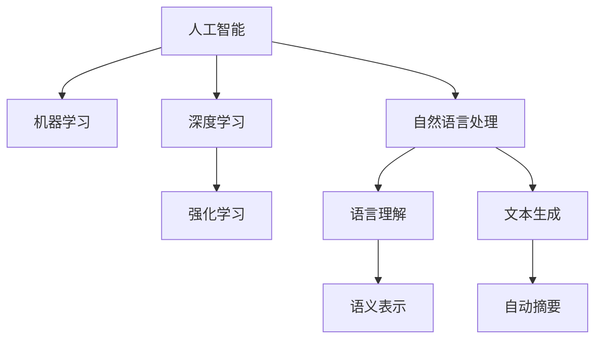

                 

# 新一代AI技术的应用场景与趋势

## 1. 背景介绍

### 1.1 问题由来
随着人工智能技术的飞速发展，新一代AI技术正逐渐渗透到各个领域，推动着各行各业的数字化转型。从自动驾驶、医疗诊断、智能客服到内容生成、教育娱乐，AI技术正重塑着人们的生活方式。然而，随着技术的应用范围和复杂度不断扩大，新一代AI技术也面临许多新的挑战和问题，如何确保技术的安全性、可靠性、可解释性、伦理性成为当前技术界的重要课题。

### 1.2 问题核心关键点
新一代AI技术的发展主要围绕以下几个关键点展开：

- **安全性**：新一代AI技术，特别是深度学习模型，容易受到对抗攻击，且模型决策过程不透明，难以解释，这极大地影响了系统的安全性。
- **可靠性**：尽管AI模型在训练数据上的表现令人印象深刻，但在实际应用中，模型性能会受到数据质量、噪声等因素的影响，如何提升模型的鲁棒性是一个重要问题。
- **可解释性**：AI模型，尤其是深度学习模型，往往是“黑箱”模型，难以解释其内部决策过程，这对需要高度可解释性的应用场景来说是一个重大挑战。
- **伦理性**：AI技术的广泛应用可能带来伦理问题，如数据隐私、决策偏见等，如何构建公平、公正的AI系统是一个亟待解决的问题。

### 1.3 问题研究意义
研究新一代AI技术的应用场景与趋势，对于推动AI技术在各行业的应用，提升AI系统的安全性、可靠性、可解释性和伦理性具有重要意义：

1. **提升应用质量**：深入理解AI技术在不同场景中的应用挑战，有助于设计更加贴合实际需求的解决方案，提升系统性能。
2. **保障系统安全**：通过技术手段提升AI系统的安全性，避免对抗攻击、数据泄露等风险，保障用户数据和隐私。
3. **增强系统可信度**：提高AI系统的可解释性，让用户和监管机构能够理解和信任AI决策，避免决策误解和滥用。
4. **促进公平伦理**：构建公平、公正、透明的AI系统，确保AI技术在不同群体、不同场景中的公平性，避免偏见和歧视。

## 2. 核心概念与联系

### 2.1 核心概念概述

为了更好地理解新一代AI技术的应用场景与趋势，本文将介绍几个密切相关的核心概念：

- **人工智能（AI）**：指通过计算机模拟人类智能过程的技术。新一代AI技术主要指深度学习、强化学习、自然语言处理等领域的最新进展。
- **机器学习（ML）**：指使计算机从数据中学习规律和模式，并用于决策和预测的技术。新一代AI技术依赖大量的数据训练，以实现高效的决策和预测。
- **深度学习（DL）**：指通过多层神经网络构建的模型，用于处理非线性、复杂的数据结构，如图像、语音、文本等。新一代AI技术中，深度学习模型占据核心地位。
- **强化学习（RL）**：指通过试错和反馈调整策略的模型，用于解决决策和控制问题，如游戏、机器人等。新一代AI技术中，强化学习应用广泛，特别是在游戏AI和自动驾驶等领域。
- **自然语言处理（NLP）**：指使计算机理解和处理人类语言的技术。新一代NLP技术，如BERT、GPT-3等模型，具备强大的语义理解和生成能力。

这些核心概念之间的逻辑关系可以通过以下Mermaid流程图来展示：



这个流程图展示了人工智能各分支技术的相互关系：

1. 人工智能涵盖多个分支，包括机器学习、深度学习、强化学习、自然语言处理等。
2. 深度学习是机器学习的重要组成部分，特别擅长处理图像、语音等复杂数据结构。
3. 强化学习主要解决决策和控制问题，在游戏、机器人等领域有广泛应用。
4. 自然语言处理是人工智能的重要分支，专注于语言理解和生成。

## 3. 核心算法原理 & 具体操作步骤
### 3.1 算法原理概述

新一代AI技术主要基于深度学习算法，通过大量数据训练模型，实现高效的决策和预测。深度学习模型的核心思想是通过多层神经网络，捕捉数据中的复杂结构和特征，从而进行高效的信息提取和处理。

### 3.2 算法步骤详解

新一代AI技术的开发通常包括以下几个关键步骤：

**Step 1: 准备数据集**

- 收集领域相关的数据集，进行数据清洗和预处理。数据集需要涵盖足够多的样本，以避免过拟合。

**Step 2: 设计模型架构**

- 选择适合的深度学习模型架构，如卷积神经网络（CNN）、循环神经网络（RNN）、Transformer等，设计模型的输入、输出和隐藏层。

**Step 3: 设置训练参数**

- 选择适当的优化器（如SGD、Adam）和损失函数（如交叉熵损失、均方误差损失）。设置合适的学习率、批大小、迭代轮数等训练参数。

**Step 4: 模型训练**

- 将数据集分为训练集、验证集和测试集，进行模型训练。通过前向传播计算损失函数，反向传播更新模型参数，直至收敛。

**Step 5: 模型评估**

- 在测试集上评估模型性能，比较微调前后的精度提升。分析模型的优势和局限性，调整训练参数或优化模型结构，进一步提升模型性能。

**Step 6: 模型部署**

- 将训练好的模型部署到实际应用环境中，如服务端、手机APP等。需要考虑模型的推理效率、内存占用等因素。

### 3.3 算法优缺点

新一代AI技术具有以下优点：

1. **高性能**：深度学习模型在处理图像、语音、文本等复杂数据上具有显著优势，能够实现高精度的决策和预测。
2. **高泛化能力**：通过大量数据训练，模型具备较强的泛化能力，能够在不同场景下进行高效应用。
3. **自动化**：自动化的数据处理和模型训练流程，减少了人工干预，提高了工作效率。

同时，新一代AI技术也存在以下缺点：

1. **计算资源需求高**：深度学习模型参数量大，需要大量的计算资源和存储空间。
2. **过拟合风险**：模型复杂度高，容易过拟合，需要大量的数据和复杂的正则化技术。
3. **可解释性不足**：深度学习模型通常是“黑箱”模型，难以解释其内部决策过程。
4. **数据依赖性强**：模型性能依赖高质量的数据，数据质量差或数据分布偏差会影响模型性能。

### 3.4 算法应用领域

新一代AI技术在众多领域得到了广泛应用，以下是几个典型应用场景：

- **自动驾驶**：通过深度学习和强化学习，训练自动驾驶模型，实现车辆的自主驾驶和导航。
- **医疗诊断**：利用深度学习模型，对医学影像、电子病历等数据进行分析，辅助医生进行疾病诊断和治疗。
- **智能客服**：使用自然语言处理技术，构建智能客服系统，提高客户服务效率和质量。
- **内容生成**：利用生成对抗网络（GAN）等技术，生成高质量的文本、图像、视频等，应用于娱乐、广告等领域。
- **金融风控**：利用深度学习模型，分析金融数据，进行风险预测和防控。
- **智能制造**：使用深度学习模型，对生产数据进行分析和优化，提升生产效率和质量。

## 4. 数学模型和公式 & 详细讲解  
### 4.1 数学模型构建

新一代AI技术的核心是深度学习模型，其数学模型通常基于多层神经网络，可以通过以下公式来描述：

设 $f_\theta(x)$ 表示深度学习模型的前向传播函数，其中 $\theta$ 为模型参数，$x$ 为输入数据。模型的损失函数为 $L(\theta)$，用于衡量模型预测结果与真实标签之间的差异。训练目标是最小化损失函数 $L(\theta)$，即：

$$
\theta^* = \mathop{\arg\min}_{\theta} L(\theta)
$$

在实践中，我们通常使用基于梯度的优化算法（如SGD、Adam等）来近似求解上述最优化问题。设 $\eta$ 为学习率，$\lambda$ 为正则化系数，则参数的更新公式为：

$$
\theta \leftarrow \theta - \eta \nabla_{\theta} L(\theta) - \eta\lambda\theta
$$

其中 $\nabla_{\theta} L(\theta)$ 为损失函数对参数 $\theta$ 的梯度，可通过反向传播算法高效计算。

### 4.2 公式推导过程

以深度学习模型中的卷积神经网络（CNN）为例，推导其前向传播和反向传播的公式。

设 $x$ 为输入数据，$w$ 和 $b$ 分别为卷积核和偏置项，$n$ 表示卷积层的数量，则CNN的前向传播过程如下：

1. 卷积层：对于每一层卷积核 $w_i$，计算卷积结果 $y_i=\text{Conv}(x,w_i,b_i)$，然后应用激活函数（如ReLU），得到 $h_i=\text{Act}(y_i)$。
2. 池化层：对卷积层的输出 $h_i$ 进行池化操作（如Max Pooling），得到下一层的输入 $z_i$。
3. 全连接层：将池化层的输出 $z_i$ 展开为一维向量，通过全连接层得到输出结果 $y=\text{Act}(Wz+b)$，其中 $W$ 和 $b$ 分别为全连接层的权重和偏置项。

CNN的反向传播过程如下：

1. 对输出层的损失函数 $L$ 对 $W$ 和 $b$ 求导数，得到梯度 $\nabla_{W,b}L$。
2. 对全连接层的梯度 $\nabla_{W,b}L$ 对 $z_i$ 求导数，得到梯度 $\nabla_{z_i}L$。
3. 对池化层的梯度 $\nabla_{z_i}L$ 对 $h_i$ 求导数，得到梯度 $\nabla_{h_i}L$。
4. 对卷积层的梯度 $\nabla_{h_i}L$ 对 $y_i$ 求导数，得到梯度 $\nabla_{y_i}L$。
5. 对卷积核的梯度 $\nabla_{y_i}L$ 对 $x$ 求导数，得到梯度 $\nabla_{x}L$。

通过反向传播算法，我们能够高效计算损失函数对输入数据的梯度，进而更新模型参数。

### 4.3 案例分析与讲解

以图像分类任务为例，展示深度学习模型的训练过程：

假设有一个包含 $n$ 个样本的图像分类数据集，每个样本 $x_i$ 包含 $m$ 个像素值，目标输出 $y_i$ 为类别标签。训练一个具有 $k$ 个卷积层和全连接层的CNN模型，其前向传播和反向传播公式如下：

前向传播：

$$
h_1 = \text{Conv}(x,w_1,b_1), h_2 = \text{Act}(h_1), \ldots, h_k = \text{Act}(h_{k-1}), y=\text{Act}(Wz+b)
$$

反向传播：

$$
\nabla_{W,b}L = \frac{\partial L}{\partial y} \frac{\partial y}{\partial z} \frac{\partial z}{\partial h_k} \frac{\partial h_k}{\partial h_{k-1}} \ldots \frac{\partial h_1}{\partial x}, \nabla_{w,b}L = \frac{\partial L}{\partial y} \frac{\partial y}{\partial z} \frac{\partial z}{\partial h_k} \frac{\partial h_k}{\partial h_{k-1}} \ldots \frac{\partial h_1}{\partial x}
$$

其中，$\text{Conv}$ 和 $\text{Act}$ 分别为卷积和激活函数，$z$ 为池化层的输出，$\nabla_{W,b}L$ 和 $\nabla_{w,b}L$ 分别为全连接层的梯度和卷积核的梯度。

## 5. 项目实践：代码实例和详细解释说明
### 5.1 开发环境搭建

在进行AI项目开发前，需要准备好开发环境。以下是使用Python进行TensorFlow开发的流程：

1. 安装Anaconda：从官网下载并安装Anaconda，用于创建独立的Python环境。

2. 创建并激活虚拟环境：
```bash
conda create -n tf-env python=3.8 
conda activate tf-env
```

3. 安装TensorFlow：根据CUDA版本，从官网获取对应的安装命令。例如：
```bash
conda install tensorflow=2.7 -c conda-forge
```

4. 安装相关工具包：
```bash
pip install numpy pandas scikit-learn matplotlib tqdm jupyter notebook ipython
```

完成上述步骤后，即可在`tf-env`环境中开始AI开发。

### 5.2 源代码详细实现

这里我们以图像分类任务为例，给出使用TensorFlow进行深度学习模型训练的PyTorch代码实现。

首先，定义图像分类任务的数据处理函数：

```python
import tensorflow as tf
from tensorflow.keras import datasets, layers, models

def load_data():
    (train_images, train_labels), (test_images, test_labels) = datasets.cifar10.load_data()
    train_images = train_images / 255.0
    test_images = test_images / 255.0
    return (train_images, train_labels), (test_images, test_labels)
```

然后，定义模型和优化器：

```python
model = models.Sequential([
    layers.Conv2D(32, (3, 3), activation='relu', input_shape=(32, 32, 3)),
    layers.MaxPooling2D((2, 2)),
    layers.Conv2D(64, (3, 3), activation='relu'),
    layers.MaxPooling2D((2, 2)),
    layers.Conv2D(64, (3, 3), activation='relu'),
    layers.Flatten(),
    layers.Dense(64, activation='relu'),
    layers.Dense(10, activation='softmax')
])

optimizer = tf.keras.optimizers.Adam(learning_rate=0.001)
```

接着，定义训练和评估函数：

```python
def train_model(model, train_data, validation_data, epochs):
    history = model.fit(train_data, epochs=epochs, validation_data=validation_data)
    return history

def evaluate_model(model, test_data):
    test_loss, test_acc = model.evaluate(test_data)
    print('Test accuracy:', test_acc)
```

最后，启动训练流程并在测试集上评估：

```python
history = train_model(model, train_data, validation_data, epochs=10)

print('Epoch 10, accuracy:', history.history['accuracy'][-1])

evaluate_model(model, test_data)
```

以上就是使用TensorFlow进行图像分类任务深度学习模型训练的完整代码实现。可以看到，TensorFlow提供了强大的API，使得模型开发和训练变得非常简单。

### 5.3 代码解读与分析

让我们再详细解读一下关键代码的实现细节：

**load_data函数**：
- 定义了CIFAR-10数据集的加载和预处理，将像素值归一化到[0,1]范围内。

**模型定义**：
- 使用Sequential模型定义卷积神经网络，包含多个卷积层和全连接层。
- 使用ReLU和Softmax激活函数，并进行梯度下降优化。

**训练函数**：
- 使用fit方法进行模型训练，指定训练轮数和验证集。
- 使用模型评估函数evaluate，计算模型在测试集上的精度。

**训练流程**：
- 指定训练轮数为10，在训练集上进行模型训练。
- 打印出第10轮的准确率。
- 在测试集上评估模型性能，输出测试精度。

通过上述代码，可以看到，TensorFlow的Keras API可以方便地定义和训练深度学习模型，显著提高了模型的开发效率。

## 6. 实际应用场景
### 6.1 智能制造

在智能制造领域，新一代AI技术可以用于优化生产流程、提高生产效率和质量。例如，通过深度学习模型对生产数据进行分析和优化，可以实现预测性维护、质量检测、自动调参等功能。

具体而言，可以利用深度学习模型对生产设备的状态数据进行实时监测，预测设备故障发生的可能性，并及时进行维护，避免生产中断。同时，利用图像处理和自然语言处理技术，对生产日志进行自动分析和分类，快速定位问题原因，提高问题解决效率。

### 6.2 金融风控

在金融领域，新一代AI技术可以用于风险评估、欺诈检测、信用评分等任务。通过深度学习模型，对交易数据、用户行为数据进行分析，可以识别出潜在的风险和欺诈行为，提高风控效率和准确性。

具体而言，可以利用生成对抗网络（GAN）生成高质量的样本数据，扩充训练集，提高模型的泛化能力。同时，利用强化学习算法进行动态调整策略，实时优化风控模型，提升系统适应性。

### 6.3 智能家居

在智能家居领域，新一代AI技术可以用于智能家居设备的控制、家庭安全、健康监测等。通过深度学习模型，对用户行为数据进行分析和预测，可以实现智能家居设备的自动化控制和智能化推荐。

具体而言，可以利用自然语言处理技术，对用户的语音命令进行理解，控制智能家居设备。同时，利用图像处理技术，对家庭环境进行智能监测，如火灾检测、气体泄露检测等。

### 6.4 未来应用展望

随着新一代AI技术的发展，未来在更多领域将有广泛应用：

1. **自动驾驶**：未来自动驾驶技术将更加成熟，能够实现高度自主驾驶，提升交通安全和效率。
2. **医疗健康**：AI技术在医疗领域的应用将更加广泛，如智能诊断、手术辅助等，提高医疗服务的质量和效率。
3. **智慧城市**：AI技术将应用于智慧城市建设，如智能交通、城市管理等，提升城市治理的智能化水平。
4. **教育培训**：AI技术将应用于个性化教育、智能辅导、学习数据分析等，提升教育培训的效率和效果。

## 7. 工具和资源推荐
### 7.1 学习资源推荐

为了帮助开发者系统掌握新一代AI技术的应用场景与趋势，这里推荐一些优质的学习资源：

1. 《深度学习》（Goodfellow et al.）：经典深度学习教材，系统介绍了深度学习的基本概念和算法。
2. 《TensorFlow官方文档》：TensorFlow的官方文档，提供了丰富的API文档和示例代码，是学习TensorFlow的好资料。
3. 《TensorFlow实战》（Mazidi et al.）：TensorFlow实战教程，通过丰富的案例，展示了TensorFlow在各个领域的应用。
4. 《Keras官方文档》：Keras的官方文档，提供了简单易用的API，是学习深度学习模型的好工具。
5. 《自然语言处理综述》（Jurafsky et al.）：自然语言处理综述教材，介绍了自然语言处理的基本概念和技术。

通过对这些资源的学习实践，相信你一定能够快速掌握新一代AI技术的应用场景与趋势，并用于解决实际的AI问题。

### 7.2 开发工具推荐

新一代AI技术的应用离不开高效的开发工具支持。以下是几款常用的开发工具：

1. TensorFlow：由Google主导开发的开源深度学习框架，支持分布式计算，适合大规模工程应用。
2. PyTorch：由Facebook开发的开源深度学习框架，灵活性强，适合快速迭代研究。
3. Jupyter Notebook：交互式笔记本工具，方便进行数据探索和模型开发。
4. TensorBoard：TensorFlow配套的可视化工具，可实时监测模型训练状态，提供丰富的图表呈现方式。
5. Weights & Biases：模型训练的实验跟踪工具，记录和可视化模型训练过程中的各项指标，方便对比和调优。

合理利用这些工具，可以显著提升新一代AI技术的开发效率，加速创新迭代的步伐。

### 7.3 相关论文推荐

新一代AI技术的发展源于学界的持续研究。以下是几篇奠基性的相关论文，推荐阅读：

1. AlexNet: One Millisecond Image Classification with Deep Convolutional Neural Networks：提出了卷积神经网络（CNN），开创了深度学习在图像分类任务中的应用。
2. ImageNet Classification with Deep Convolutional Neural Networks：对AlexNet进行了改进，提出了更深的卷积神经网络（ResNet），进一步提升了图像分类性能。
3. GANs Trained by a Two Time-Scale Update Rule Generate High-Resolution Natural Images：提出生成对抗网络（GAN），实现了高质量的图像生成和风格迁移。
4. AlphaGo Zero: Mastering the Game of Go without Human Knowledge：利用强化学习算法，训练了AlphaGo Zero，成功击败了人类顶尖高手。
5. Attention is All You Need：提出Transformer模型，推动了深度学习在自然语言处理领域的应用。

这些论文代表了新一代AI技术的发展脉络。通过学习这些前沿成果，可以帮助研究者把握学科前进方向，激发更多的创新灵感。

## 8. 总结：未来发展趋势与挑战

### 8.1 总结

本文对新一代AI技术的应用场景与趋势进行了全面系统的介绍。首先阐述了新一代AI技术的研究背景和意义，明确了AI技术在各行业应用中的重要性。其次，从原理到实践，详细讲解了深度学习模型的数学模型和训练过程，给出了AI项目开发的完整代码实例。同时，本文还广泛探讨了AI技术在不同领域的应用前景，展示了AI技术的广阔前景。此外，本文精选了AI技术的各类学习资源，力求为读者提供全方位的技术指引。

通过本文的系统梳理，可以看到，新一代AI技术正在成为各行业的重要工具，极大地提升了系统性能和应用效率。未来的AI技术将在更多领域得到应用，为人类生产生活方式带来深刻变革。

### 8.2 未来发展趋势

展望未来，新一代AI技术将呈现以下几个发展趋势：

1. **更高效的学习算法**：未来AI技术将引入更多高效的学习算法，如因果学习、自监督学习、对比学习等，提升模型的学习能力和泛化能力。
2. **更强大的模型**：随着计算资源的不断提升，AI模型将变得更大、更复杂，具备更强的表达能力和推理能力。
3. **更广泛的领域应用**：AI技术将拓展到更多领域，如医疗、制造、金融、教育等，推动各行各业的智能化转型。
4. **更高的可解释性**：未来AI技术将更加注重模型的可解释性，确保模型的决策过程透明、可信。
5. **更强的伦理性**：AI技术将考虑伦理和安全因素，确保模型在各种场景下的公平性和公正性。

这些趋势将推动新一代AI技术向更加智能化、普适化、可解释化和伦理性方向发展，带来更加深刻的社会变革。

### 8.3 面临的挑战

尽管新一代AI技术取得了显著进展，但在迈向更广泛应用的过程中，仍面临诸多挑战：

1. **数据质量和多样性**：AI模型的性能依赖高质量的数据，如何获取和处理多样化、复杂的数据是一个重要问题。
2. **计算资源需求**：AI模型往往需要大量的计算资源，如何提升算法的效率和模型的压缩性是一个挑战。
3. **模型复杂度**：AI模型往往较为复杂，如何提升模型的可解释性、鲁棒性和安全性是一个亟待解决的问题。
4. **伦理和安全问题**：AI技术的应用可能带来伦理和安全问题，如何构建公平、公正、安全的AI系统是一个重要课题。

这些挑战需要学术界、产业界和政策制定者共同努力，才能推动AI技术健康发展，造福全人类。

### 8.4 研究展望

未来，新一代AI技术的研究将集中在以下几个方向：

1. **高效学习算法**：开发高效、鲁棒的学习算法，提升模型的泛化能力和适应性。
2. **模型压缩与加速**：研究模型压缩、加速技术，提升模型的推理速度和资源利用效率。
3. **可解释性研究**：提升模型的可解释性，增强模型的透明度和可信度。
4. **伦理性研究**：研究AI技术的伦理和安全问题，构建公平、公正、安全的AI系统。
5. **跨学科融合**：将AI技术与多学科知识进行融合，推动AI技术在更多领域的应用。

这些方向的研究将推动AI技术向更加智能化、普适化和可控化方向发展，为人类社会带来更深远的影响。

## 9. 附录：常见问题与解答

**Q1：AI技术能否完全取代人类？**

A: AI技术在某些领域可以显著提高效率和精度，但无法完全取代人类。AI技术通常处理大量数据，进行复杂计算，但对于需要人类直觉、情感、创造力的任务，AI技术还无法完全替代人类。

**Q2：AI技术的应用是否会带来失业问题？**

A: AI技术的应用可能会带来一定的失业问题，尤其是对一些重复性、低技能的工作。但同时也会创造新的就业机会，如AI系统的开发、维护、监控等。政府和社会需要共同努力，通过教育和培训，帮助工人适应新技术，实现平稳过渡。

**Q3：AI技术是否会带来隐私和安全问题？**

A: AI技术在处理数据时，可能带来隐私和安全问题。政府和企业需要制定严格的隐私保护和安全标准，加强数据保护和隐私管理，确保AI技术在应用过程中不会侵犯用户隐私和数据安全。

**Q4：AI技术的应用是否会带来伦理问题？**

A: AI技术的应用可能会带来伦理问题，如数据偏见、决策不公等。政府和企业需要制定伦理标准，确保AI技术在应用过程中遵守伦理规范，避免偏见和不公现象的发生。

通过这些问题的解答，可以看出，AI技术在带来便利和效率的同时，也需要关注其潜在的风险和挑战。只有在技术、伦理、政策等各个方面进行全面考虑，才能充分发挥AI技术的潜力，推动社会进步。

---

作者：禅与计算机程序设计艺术 / Zen and the Art of Computer Programming

