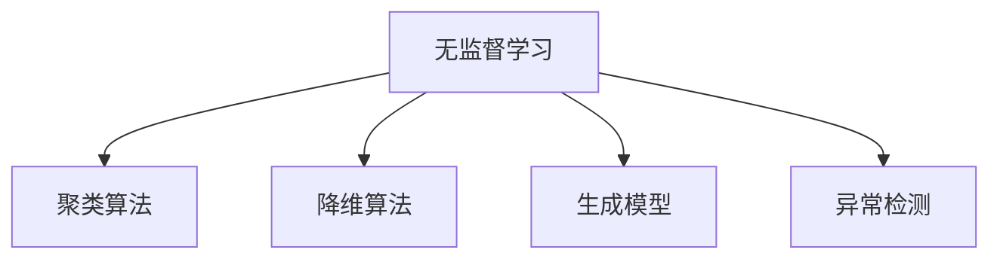

                 

# 无监督学习 (Unsupervised Learning) 原理与代码实例讲解

> 关键词：无监督学习, 自编码器, 聚类算法, 生成对抗网络, 无标签数据, 异常检测, 数据降维, 自然语言处理, 图像处理, 深度学习

## 1. 背景介绍

### 1.1 问题由来
随着数据量的爆炸性增长，无监督学习(unsupervised learning)逐渐成为机器学习领域的热点研究方向。相比于传统有监督学习(supervised learning)，无监督学习无需标注数据，能够直接从原始数据中挖掘出有用的信息，为后续任务提供数据预处理和特征表示。

无监督学习的主要任务包括：数据降维、聚类、生成模型、异常检测、数据增强等，广泛应用于自然语言处理、图像处理、时间序列分析等多个领域。

### 1.2 问题核心关键点
无监督学习与有监督学习的主要区别在于其数据分布的不确定性。在无监督学习中，模型仅从数据中学习到数据的内在结构，而无需了解数据的具体类别和标签信息。常用的无监督学习算法包括：

- 聚类算法：将相似的数据点分为同一类，用于数据分组和描述数据分布。
- 降维算法：将高维数据转化为低维数据，保留关键信息，减少计算复杂度。
- 生成模型：学习数据的概率分布，并生成新的数据样本，用于数据生成和数据增强。
- 异常检测算法：识别数据中的异常点，用于数据清洗和数据噪声过滤。

无监督学习的目标是通过学习数据的分布规律，挖掘数据内在结构，从而辅助后续任务。这些方法不仅能够提升数据处理的效率，还能帮助发现数据的潜在模式和规律，为应用场景提供数据预处理和特征表示的支撑。

### 1.3 问题研究意义
无监督学习的研究对于机器学习和人工智能领域具有重要意义：

1. 数据成本低廉。无监督学习无需标注数据，大大降低了数据收集和标注的成本。
2. 泛化能力强。通过学习数据的固有分布，无监督学习模型对新数据的适应能力更强。
3. 促进有监督学习。无监督学习可以作为有监督学习的预处理步骤，提升后续任务的性能。
4. 新兴应用场景。无监督学习在新兴应用领域，如医疗、金融、安全等，具有广泛的应用前景。

## 2. 核心概念与联系

### 2.1 核心概念概述

为更好地理解无监督学习的方法，本节将介绍几个关键概念及其相互联系：

- 无监督学习(Unsupervised Learning)：使用未标注的数据进行模型训练，挖掘数据内在结构，寻找数据分布规律。

- 聚类算法(Clustering)：将相似的数据点分为同一类，用于数据分组和描述数据分布。

- 降维算法(Dimensionality Reduction)：将高维数据转化为低维数据，保留关键信息，减少计算复杂度。

- 生成模型(Generative Model)：学习数据的概率分布，并生成新的数据样本，用于数据生成和数据增强。

- 异常检测算法(Anomaly Detection)：识别数据中的异常点，用于数据清洗和数据噪声过滤。

这些核心概念之间的逻辑关系可以通过以下Mermaid流程图来展示：



这个流程图展示无监督学习的核心概念及其相互关系：

1. 无监督学习通过学习数据的分布规律，挖掘数据内在结构，用于数据处理和特征表示。
2. 聚类算法用于数据分组，通过相似性度量将数据点分为不同的类别。
3. 降维算法用于数据压缩，将高维数据转化为低维数据，保留关键信息。
4. 生成模型用于数据生成，学习数据分布并生成新数据。
5. 异常检测算法用于数据清洗，识别和过滤数据中的噪声和异常点。

这些概念共同构成了无监督学习的学习框架，使其能够从无标注数据中挖掘出有用的信息，为后续任务提供支持。

## 3. 核心算法原理 & 具体操作步骤

### 3.1 算法原理概述

无监督学习的主要目标是从未标注数据中学习到数据的固有分布，用于数据处理、特征提取、数据增强等任务。其核心思想是：通过学习数据的内在规律，推断数据的生成机制，从而实现对数据的高效处理和分析。

形式化地，假设未标注数据集为 $D=\{(x_i)\}_{i=1}^N, x_i \in \mathcal{X}$，其中 $\mathcal{X}$ 为输入空间。无监督学习的目标是最小化经验风险，即找到最优模型：

$$
\hat{\theta} = \mathop{\arg\min}_{\theta} \mathcal{L}(\theta)
$$

其中 $\mathcal{L}$ 为经验风险，具体可以表示为数据分布的负对数似然、数据散度的度量、数据降维后的重构误差等。

### 3.2 算法步骤详解

无监督学习算法一般包括以下关键步骤：

**Step 1: 数据预处理**
- 清洗数据：去除噪声和异常点。
- 标准化数据：将数据按一定方式标准化，使后续算法处理更加高效。

**Step 2: 选择无监督算法**
- 根据任务需求，选择合适的聚类、降维、生成模型或异常检测算法。

**Step 3: 模型训练**
- 使用未标注数据进行模型训练，最小化经验风险。
- 重复训练多次，避免过拟合。

**Step 4: 结果评估**
- 对训练结果进行评估，判断模型是否符合任务需求。

**Step 5: 结果应用**
- 将训练结果应用于后续任务，如数据分组、特征提取、数据增强等。

### 3.3 算法优缺点

无监督学习的优点：

1. 数据成本低廉：无需标注数据，降低数据收集和标注成本。
2. 泛化能力强：通过学习数据的固有分布，模型对新数据的适应能力更强。
3. 可解释性强：模型结果易于理解，无需解释。
4. 促进有监督学习：无监督学习可以作为有监督学习的预处理步骤，提升后续任务的性能。

无监督学习的缺点：

1. 性能不稳定：模型效果受数据质量和算法选择影响较大。
2. 结果难以解释：无监督学习模型通常难以解释其内部工作机制和推理逻辑。
3. 应用场景有限：对于某些特定任务，无监督学习可能无法有效处理。

尽管存在这些局限性，但无监督学习在处理大量无标注数据和探索数据内在规律方面具有独特优势，应用前景广阔。未来相关研究的方向在于如何进一步提升无监督学习的泛化能力和鲁棒性，以及如何通过无监督学习辅助有监督学习，构建更智能的数据处理系统。

### 3.4 算法应用领域

无监督学习在许多领域都具有广泛的应用：

- 自然语言处理：用于文本聚类、主题建模、语义相似度计算等任务。
- 图像处理：用于图像去噪、图像分割、图像生成等任务。
- 时间序列分析：用于时间序列异常检测、时间序列预测等任务。
- 推荐系统：用于用户行为分析、推荐内容生成等任务。
- 金融分析：用于市场异常检测、投资组合优化等任务。
- 生物信息学：用于基因序列分析、蛋白质结构预测等任务。

以上应用场景展示了无监督学习在各个领域的强大能力，同时也反映了其在数据处理和特征提取方面的重要价值。

## 4. 数学模型和公式 & 详细讲解

### 4.1 数学模型构建

本节将使用数学语言对无监督学习的核心算法进行更加严格的刻画。

假设数据集 $D=\{(x_i)\}_{i=1}^N, x_i \in \mathcal{X}$，其中 $\mathcal{X}$ 为输入空间。无监督学习模型的目标是找到最优参数 $\theta$，使得模型在数据集 $D$ 上的经验风险最小化。常见的无监督学习算法包括聚类算法、降维算法、生成模型等，其数学模型可以分别表示如下：

**聚类算法**：
假设数据 $x_i \in \mathcal{X}$ 属于类别 $y_i \in \{1,2,\cdots,K\}$，其中 $K$ 为类别数。聚类算法的目标是最小化每个数据点与所在类别的距离：

$$
\min_{y_1,\cdots,y_N} \sum_{i=1}^N \ell(y_i,x_i)
$$

其中 $\ell$ 为距离度量函数，如欧氏距离、余弦距离等。

**降维算法**：
假设数据 $x_i \in \mathcal{X} \rightarrow \mathcal{Z}$，其中 $\mathcal{Z}$ 为低维空间。降维算法的目标是最小化数据重构误差：

$$
\min_{\theta} \sum_{i=1}^N \|x_i - \tilde{x}_i\|^2
$$

其中 $\tilde{x}_i$ 为数据降维后的重构结果，$\|.\|$ 为欧式范数。

**生成模型**：
假设数据 $x_i \in \mathcal{X}$ 服从概率分布 $P(x|\theta)$，其中 $\theta$ 为模型参数。生成模型的目标是最小化模型对数据的负对数似然：

$$
\min_{\theta} -\frac{1}{N}\sum_{i=1}^N \log P(x_i|\theta)
$$

其中 $P(x|\theta)$ 为生成模型概率分布，$\log$ 为自然对数。

**异常检测算法**：
假设数据 $x_i \in \mathcal{X}$ 服从概率分布 $P(x|\theta)$，其中 $\theta$ 为模型参数。异常检测算法的目标是最小化异常点检测误差：

$$
\min_{\theta} \frac{1}{N}\sum_{i=1}^N \ell(x_i,y_i)
$$

其中 $\ell$ 为异常点检测损失函数，如距离度量函数、密度函数等。

### 4.2 公式推导过程

以下我们以聚类算法为例，推导K-means算法的核心公式及其优化过程。

K-means算法是一种经典的聚类算法，其目标是最小化每个数据点与其所在聚类的距离。假设聚类数目为 $K$，初始聚类中心为 $\{\mu_1,\cdots,\mu_K\}$，数据 $x_i$ 的归并函数为 $k(x_i)$，则K-means算法的优化目标为：

$$
\min_{\mu_1,\cdots,\mu_K,k} \sum_{i=1}^N \|x_i - \mu_{k(x_i)}\|^2
$$

其中 $\|.\|$ 为欧式范数。K-means算法的优化过程如下：

1. 初始化聚类中心 $\{\mu_1,\cdots,\mu_K\}$。
2. 分配：计算每个数据点 $x_i$ 的归并函数 $k(x_i)$，将 $x_i$ 分配到最近的聚类中心。
3. 更新：对每个聚类 $\mathcal{C}_k$，计算其成员数据点的平均值，更新聚类中心 $\mu_k$。
4. 迭代：重复步骤2和3，直至收敛。

### 4.3 案例分析与讲解

以K-means算法为例，我们分析其在实际应用中的性能和效果。

**案例一：图像聚类**
假设有一批彩色图像，每个像素表示为RGB三元组。使用K-means算法进行图像聚类，可以将相似的像素分为同一类，用于图像去噪、图像分割等任务。通过聚类，可以发现图像中的边缘、纹理等特征，从而进行图像压缩和重建。

**案例二：文本主题建模**
假设有一批新闻文章，每个文章表示为词频向量。使用K-means算法进行文本聚类，可以将相似的文章分为同一类，用于主题建模和新闻分类等任务。通过聚类，可以发现文章中的主题和关键词，从而进行信息提取和摘要生成。

**案例三：异常检测**
假设有一批数据，其中一部分数据包含异常点。使用K-means算法进行异常检测，可以将正常数据分为同一类，将异常数据单独分配到另一类。通过异常检测，可以识别出数据中的噪声和错误，从而进行数据清洗和处理。

以上案例展示了K-means算法在实际应用中的广泛应用，同时也反映了其在数据处理和特征提取方面的强大能力。

## 5. 项目实践：代码实例和详细解释说明

### 5.1 开发环境搭建

在进行无监督学习实践前，我们需要准备好开发环境。以下是使用Python进行scikit-learn开发的环境配置流程：

1. 安装Anaconda：从官网下载并安装Anaconda，用于创建独立的Python环境。

2. 创建并激活虚拟环境：
```bash
conda create -n sklearn-env python=3.8 
conda activate sklearn-env
```

3. 安装scikit-learn：
```bash
conda install scikit-learn
```

4. 安装各类工具包：
```bash
pip install numpy pandas scikit-learn matplotlib tqdm jupyter notebook ipython
```

完成上述步骤后，即可在`sklearn-env`环境中开始无监督学习实践。

### 5.2 源代码详细实现

下面我们以K-means聚类算法为例，给出使用scikit-learn库对K-means模型进行无监督学习的Python代码实现。

首先，导入必要的库和数据集：

```python
import numpy as np
from sklearn import datasets
from sklearn.cluster import KMeans
import matplotlib.pyplot as plt

iris = datasets.load_iris()
X = iris.data
```

然后，定义K-means模型并进行训练：

```python
kmeans = KMeans(n_clusters=3, random_state=0)
kmeans.fit(X)
```

接着，可视化聚类结果：

```python
plt.scatter(X[:, 0], X[:, 1], c=kmeans.labels_)
plt.scatter(kmeans.cluster_centers_[:, 0], kmeans.cluster_centers_[:, 1], s=300, c='red')
plt.show()
```

最终，输出聚类结果：

```python
print(kmeans.labels_)
```

以上就是使用scikit-learn库对K-means模型进行无监督聚类的完整代码实现。可以看到，得益于scikit-learn库的强大封装，我们可以用相对简洁的代码完成K-means算法的训练和可视化。

### 5.3 代码解读与分析

让我们再详细解读一下关键代码的实现细节：

**iris数据集**：
- `datasets.load_iris()`：从scikit-learn库中加载鸢尾花数据集，包含150个样本，每个样本包含4个特征。

**K-means模型训练**：
- `KMeans(n_clusters=3, random_state=0)`：定义K-means模型，指定聚类数目为3，随机种子为0。
- `kmeans.fit(X)`：对数据集进行K-means聚类，返回聚类结果。

**可视化聚类结果**：
- `plt.scatter(X[:, 0], X[:, 1], c=kmeans.labels_)`：绘制数据点的散点图，颜色表示聚类类别。
- `plt.scatter(kmeans.cluster_centers_[:, 0], kmeans.cluster_centers_[:, 1], s=300, c='red')`：绘制聚类中心的散点图，用红色表示。
- `plt.show()`：显示图形界面。

**输出聚类结果**：
- `print(kmeans.labels_)`：输出每个数据点的聚类标签。

可以看到，scikit-learn库使得无监督学习的实现变得简洁高效。开发者可以将更多精力放在数据处理、模型选择等高层逻辑上，而不必过多关注底层的实现细节。

当然，工业级的系统实现还需考虑更多因素，如聚类结果的评估、聚类算法的调参等。但核心的无监督学习过程基本与此类似。

## 6. 实际应用场景
### 6.1 图像处理

无监督学习在图像处理领域有广泛应用。图像去噪、图像分割、图像生成等任务都是基于无监督学习实现的。例如，K-means算法可以用于图像聚类，将相似像素分为同一类，用于图像去噪、图像分割等任务。

**案例一：图像去噪**
假设有一批噪声图像，使用K-means算法进行聚类，可以将相似像素分为同一类，去除噪声点。通过聚类，可以发现图像中的纹理和边缘，从而进行图像去噪和图像重建。

**案例二：图像分割**
假设有一批医学图像，使用K-means算法进行聚类，可以将相似像素分为同一类，用于图像分割。通过聚类，可以发现图像中的不同组织结构，从而进行图像分析和诊断。

### 6.2 自然语言处理

自然语言处理领域也广泛应用无监督学习。文本聚类、主题建模、语义相似度计算等任务都是基于无监督学习实现的。例如，LDA算法可以用于文本主题建模，将相似文本分为同一类，用于文本分类和信息提取等任务。

**案例一：文本聚类**
假设有一批新闻文章，使用LDA算法进行文本聚类，可以将相似文章分为同一类，用于主题建模和新闻分类等任务。通过聚类，可以发现文章中的主题和关键词，从而进行信息提取和摘要生成。

**案例二：语义相似度计算**
假设有一批文本数据，使用LDA算法进行文本聚类，可以将相似文本分为同一类，用于语义相似度计算。通过聚类，可以发现文本中的相似主题和关键词，从而进行文本检索和推荐等任务。

### 6.3 时间序列分析

时间序列分析领域也广泛应用无监督学习。时间序列异常检测、时间序列预测等任务都是基于无监督学习实现的。例如，基于时间序列数据的聚类算法可以用于异常检测，识别出异常点。

**案例一：时间序列异常检测**
假设有一批时间序列数据，使用K-means算法进行聚类，可以将正常数据分为同一类，将异常数据单独分配到另一类。通过异常检测，可以识别出时间序列中的异常点，从而进行数据清洗和处理。

**案例二：时间序列预测**
假设有一批时间序列数据，使用LSTM模型进行时间序列预测，可以通过聚类算法对预测结果进行聚类，识别出异常预测值，进行数据校正和修正。通过聚类，可以发现时间序列中的异常变化趋势，从而进行时间序列预测和风险控制等任务。

### 6.4 未来应用展望

随着无监督学习技术的发展，其在更多领域的应用前景将进一步拓展。未来，无监督学习将逐渐与其他人工智能技术进行深入融合，构建更加智能、高效的数据处理系统。以下是几个无监督学习未来的应用趋势：

1. 跨模态学习：将无监督学习应用于跨模态数据处理，如文本-图像联合表示、语音-图像融合等。
2. 迁移学习：将无监督学习作为迁移学习的前置步骤，提升有监督学习模型的泛化能力。
3. 强化学习：将无监督学习与强化学习结合，构建更加智能的决策系统和优化算法。
4. 深度学习：将无监督学习应用于深度神经网络，提高深度模型的泛化能力和稳定性。
5. 联邦学习：将无监督学习应用于联邦学习，保护数据隐私的同时，提升数据处理和分析效率。

总之，无监督学习的应用前景广阔，未来将与其他人工智能技术深度融合，构建更加智能、高效的数据处理系统，为各行各业提供更强大的技术支撑。

## 7. 工具和资源推荐
### 7.1 学习资源推荐

为了帮助开发者系统掌握无监督学习的理论基础和实践技巧，这里推荐一些优质的学习资源：

1. 《Python机器学习》书籍：涵盖了Python编程语言和机器学习算法的基本知识，详细介绍了无监督学习算法的原理和实现。
2. Coursera《机器学习》课程：斯坦福大学的经典机器学习课程，介绍了机器学习的基本概念和算法，包括无监督学习。
3. Kaggle无监督学习竞赛：Kaggle平台提供的无监督学习竞赛，涵盖多种无监督学习算法和实际应用场景。
4. scikit-learn官方文档：scikit-learn库的官方文档，详细介绍了各种无监督学习算法的实现和应用。
5. 《深度学习》书籍：DeepLearning.ai提供的深度学习课程，详细介绍了深度学习算法及其应用，包括无监督学习。

通过对这些资源的学习实践，相信你一定能够快速掌握无监督学习的精髓，并用于解决实际的机器学习问题。
###  7.2 开发工具推荐

高效的开发离不开优秀的工具支持。以下是几款用于无监督学习开发的常用工具：

1. scikit-learn：基于Python的机器学习库，提供了丰富的无监督学习算法实现。
2. TensorFlow：由Google主导开发的深度学习框架，提供了强大的无监督学习功能。
3. PyTorch：基于Python的深度学习框架，支持无监督学习算法的实现。
4. Weights & Biases：模型训练的实验跟踪工具，可以记录和可视化模型训练过程中的各项指标，方便对比和调优。
5. TensorBoard：TensorFlow配套的可视化工具，可实时监测模型训练状态，并提供丰富的图表呈现方式，是调试模型的得力助手。
6. Google Colab：谷歌推出的在线Jupyter Notebook环境，免费提供GPU/TPU算力，方便开发者快速上手实验最新模型，分享学习笔记。

合理利用这些工具，可以显著提升无监督学习的开发效率，加快创新迭代的步伐。

### 7.3 相关论文推荐

无监督学习的研究源于学界的持续研究。以下是几篇奠基性的相关论文，推荐阅读：

1. K-means: A method for clustering in k space（K-means算法论文）：提出了K-means算法，用于聚类分析。
2. A Review of Document Clustering Algorithms（文本聚类算法综述论文）：综述了多种文本聚类算法及其应用。
3. Generative Adversarial Nets（生成对抗网络论文）：提出了生成对抗网络，用于数据生成和生成模型训练。
4. Self-supervised learning with contrastive predictions（自监督学习论文）：提出了自监督学习范式，用于无标签数据的特征表示和迁移学习。
5. The semi-supervised learning problem and the solution method（半监督学习论文）：提出了半监督学习算法，用于无标注数据的利用和标注数据的辅助。

这些论文代表了大无监督学习的发展脉络。通过学习这些前沿成果，可以帮助研究者把握学科前进方向，激发更多的创新灵感。

## 8. 总结：未来发展趋势与挑战

### 8.1 总结

本文对无监督学习的方法进行了全面系统的介绍。首先阐述了无监督学习的背景和研究意义，明确了无监督学习在数据处理、特征提取、数据增强等任务中的重要价值。其次，从原理到实践，详细讲解了无监督学习的核心算法和关键步骤，给出了无监督学习任务开发的完整代码实例。同时，本文还广泛探讨了无监督学习在图像处理、自然语言处理、时间序列分析等多个领域的应用前景，展示了无监督学习在数据处理和特征提取方面的强大能力。此外，本文精选了无监督学习的各类学习资源，力求为读者提供全方位的技术指引。

通过本文的系统梳理，可以看到，无监督学习在机器学习和人工智能领域具有重要意义。它不仅能够从无标注数据中挖掘出有用的信息，还能够为后续任务提供数据预处理和特征表示的支撑，提升系统的性能和效果。未来，无监督学习将在更多领域得到应用，为机器学习和人工智能技术的发展提供新的突破。

### 8.2 未来发展趋势

展望未来，无监督学习的发展趋势如下：

1. 跨模态学习：将无监督学习应用于跨模态数据处理，如文本-图像联合表示、语音-图像融合等。
2. 迁移学习：将无监督学习作为迁移学习的前置步骤，提升有监督学习模型的泛化能力。
3. 强化学习：将无监督学习与强化学习结合，构建更加智能的决策系统和优化算法。
4. 深度学习：将无监督学习应用于深度神经网络，提高深度模型的泛化能力和稳定性。
5. 联邦学习：将无监督学习应用于联邦学习，保护数据隐私的同时，提升数据处理和分析效率。

这些趋势展示了无监督学习在未来发展的广阔前景，也反映了其在多模态数据处理和智能决策系统构建中的重要价值。

### 8.3 面临的挑战

尽管无监督学习在数据处理和特征提取方面具有强大能力，但在应用过程中仍面临以下挑战：

1. 数据质量问题：无监督学习模型对数据质量和特征选择敏感，数据噪声和错误可能导致模型性能下降。
2. 模型选择问题：不同的无监督学习算法适用于不同的数据类型和任务，选择合适的算法需要大量实验和调参。
3. 模型解释问题：无监督学习模型通常难以解释其内部工作机制和推理逻辑，限制了其应用场景。
4. 应用场景有限：对于一些特定任务，无监督学习可能无法有效处理，需要结合其他技术进行改进。

尽管存在这些挑战，但无监督学习在处理大量无标注数据和探索数据内在规律方面具有独特优势，应用前景广阔。未来研究的方向在于如何进一步提升无监督学习的泛化能力和鲁棒性，以及如何通过无监督学习辅助有监督学习，构建更智能的数据处理系统。

### 8.4 研究展望

面对无监督学习所面临的种种挑战，未来的研究需要在以下几个方面寻求新的突破：

1. 探索无监督学习的跨模态融合方法：将无监督学习应用于跨模态数据处理，如文本-图像联合表示、语音-图像融合等。
2. 研究无监督学习的迁移学习机制：将无监督学习作为迁移学习的前置步骤，提升有监督学习模型的泛化能力。
3. 开发无监督学习的强化学习算法：将无监督学习与强化学习结合，构建更加智能的决策系统和优化算法。
4. 设计无监督学习的深度神经网络模型：将无监督学习应用于深度神经网络，提高深度模型的泛化能力和稳定性。
5. 引入无监督学习的联邦学习算法：将无监督学习应用于联邦学习，保护数据隐私的同时，提升数据处理和分析效率。

这些研究方向的探索，必将引领无监督学习技术迈向更高的台阶，为机器学习和人工智能技术的发展提供新的突破。面向未来，无监督学习还需要与其他人工智能技术进行更深入的融合，如知识表示、因果推理、强化学习等，多路径协同发力，共同推动人工智能技术的发展。

## 9. 附录：常见问题与解答

**Q1：无监督学习和有监督学习的主要区别是什么？**

A: 无监督学习和有监督学习的主要区别在于其数据分布的不确定性。有监督学习需要标注数据，模型学习数据类别和标签之间的映射关系；而无监督学习无需标注数据，模型学习数据的固有分布和内在结构。

**Q2：无监督学习适用于哪些数据类型？**

A: 无监督学习适用于未标注的数据类型，包括文本、图像、时间序列等。对于大规模无标注数据，无监督学习能够从中挖掘出有用的信息，为后续任务提供数据预处理和特征表示的支撑。

**Q3：无监督学习的优势和劣势是什么？**

A: 无监督学习的优势包括：数据成本低廉、泛化能力强、可解释性强。无监督学习无需标注数据，降低数据收集和标注成本；能够学习数据的固有分布，提高模型的泛化能力；模型结果易于理解，无需解释。

无监督学习的劣势包括：性能不稳定、结果难以解释、应用场景有限。无监督学习模型对数据质量和算法选择敏感，数据噪声和错误可能导致模型性能下降；模型通常难以解释其内部工作机制和推理逻辑；对于一些特定任务，无监督学习可能无法有效处理。

尽管存在这些劣势，但无监督学习在处理大量无标注数据和探索数据内在规律方面具有独特优势，应用前景广阔。未来相关研究的方向在于如何进一步提升无监督学习的泛化能力和鲁棒性，以及如何通过无监督学习辅助有监督学习，构建更智能的数据处理系统。

**Q4：无监督学习有哪些典型算法？**

A: 无监督学习的典型算法包括聚类算法、降维算法、生成模型、异常检测算法等。聚类算法用于数据分组，如K-means算法、层次聚类算法等；降维算法用于数据压缩，如主成分分析、线性判别分析等；生成模型用于数据生成，如自编码器、生成对抗网络等；异常检测算法用于数据清洗，如孤立森林算法、One-class SVM等。

这些算法展示了无监督学习在数据处理和特征提取方面的强大能力，适用于各种实际应用场景。

---

作者：禅与计算机程序设计艺术 / Zen and the Art of Computer Programming

