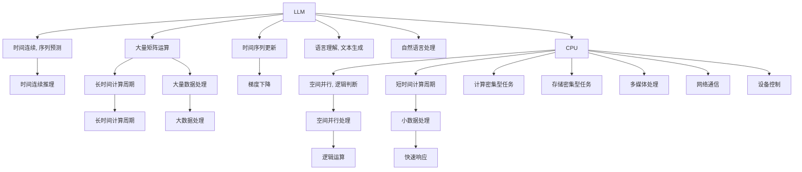

                 

## 1. 背景介绍

### 1.1 问题由来
在深入研究深度学习和人工智能时，我们常常会接触到不同类型的网络架构和算法。这些架构和算法中，深度学习领域的大语言模型（Large Language Models，简称LLM）和通用计算领域的主要计算单元——中央处理单元（Central Processing Unit，简称CPU），是两个非常核心的概念。但你是否思考过，LLM和CPU在逻辑、性能、应用领域等方面，究竟有哪些本质区别？

### 1.2 问题核心关键点
深入理解LLM与CPU的差异，有助于我们更好地进行算法选择和系统设计。LLM与CPU的核心区别主要体现在以下几个方面：

- **推理逻辑**：LLM的推理是基于时间连续的时间序列预测，而CPU的推理是基于空间并行的操作。
- **计算周期**：LLM的计算周期通常较长，因为需要大量的矩阵运算和梯度下降更新；而CPU的计算周期较短，因为主要是逻辑判断和算术运算。
- **计算资源**：LLM需要庞大的计算资源，包括大量的GPU和内存；而CPU则有更多的应用场景，但资源要求相对较少。
- **应用领域**：LLM主要应用于自然语言处理等AI领域，而CPU则广泛应用于各种计算机软件和硬件设备。

### 1.3 问题研究意义
掌握LLM与CPU的差异，对理解计算机科学的核心原理和应用有着重要的意义：

1. **算法选择**：在实际应用中，需要根据任务特点选择合适的计算单元，以便在性能和资源之间取得最佳平衡。
2. **系统设计**：理解二者的差异，有助于设计更高效、更符合实际需求的计算机系统和网络架构。
3. **跨学科交流**：跨学科交流是推动技术进步的重要力量。了解LLM与CPU的区别，可以更好地与其他领域的专家进行交流和合作。
4. **学术研究**：学术研究中，掌握这些基础知识，有助于做出有价值的研究选择和创新。

## 2. 核心概念与联系

### 2.1 核心概念概述

首先，让我们来定义一下LLM与CPU的基本概念：

- **大语言模型（LLM）**：指的是能够理解和生成人类自然语言的大型神经网络模型。这类模型通常通过自监督学习、指令微调等技术进行预训练和微调，以便能够执行自然语言理解、文本生成等任务。

- **中央处理单元（CPU）**：是指计算机中主要的处理单元，负责执行算术运算和逻辑判断。CPU的计算周期短，性能高，但通常处理的数据量较小。

### 2.2 核心概念原理和架构的 Mermaid 流程图

下面的Mermaid流程图展示了LLM和CPU在推理、计算周期和应用场景上的差异：



这个流程图帮助我们看到LLM和CPU在推理、计算周期和应用场景上的主要区别。

## 3. 核心算法原理 & 具体操作步骤

### 3.1 算法原理概述

LLM的算法原理主要基于深度学习和神经网络。它的核心思想是通过大量未标注文本数据进行预训练，使得模型能够学习到语言的统计规律和语义表示。接着，通过微调，针对具体任务进行优化，使得模型能够执行特定任务，如自然语言理解、文本生成等。

而CPU的算法原理则基于传统计算机科学。它的核心思想是通过逻辑电路设计和硬件架构，使得CPU能够在短时间内完成大量的计算和逻辑判断。CPU的计算周期非常短，通常在几个时钟周期内完成一次运算。

### 3.2 算法步骤详解

#### LLM算法步骤

1. **预训练**：使用大规模未标注文本数据对模型进行预训练，使得模型能够学习到语言的统计规律和语义表示。

2. **微调**：针对具体任务，对预训练后的模型进行微调，使得模型能够执行特定任务。微调时，使用少量标注数据对模型进行优化，以提高模型的准确率和泛化能力。

3. **推理**：在具体应用场景中，使用微调后的模型进行推理，生成新的文本或理解已有文本。

#### CPU算法步骤

1. **编译**：将高级语言编写的代码编译成CPU能够执行的机器码。

2. **执行**：将机器码加载到CPU中，CPU按照顺序执行每一条指令。

3. **中断和处理**：在执行过程中，CPU会根据指令进行中断和处理，如等待输入、输出等。

### 3.3 算法优缺点

#### LLM算法优缺点

**优点**：

- **高效性**：在处理自然语言处理任务时，LLM具有非常高的准确性和效率。
- **灵活性**：LLM可以处理多种语言和多种任务，如语言理解、文本生成等。
- **可解释性**：LLM的模型结构和推理过程相对透明，可以进行一些可解释性分析。

**缺点**：

- **资源需求大**：LLM需要大量的计算资源和存储空间，包括大量的GPU和内存。
- **推理速度慢**：LLM的推理速度相对较慢，特别是在处理大规模数据时。
- **鲁棒性不足**：LLM在处理新数据时，可能会面临泛化性能不足的问题。

#### CPU算法优缺点

**优点**：

- **速度快**：CPU的计算周期短，能够快速执行大量的计算和逻辑判断。
- **能耗低**：CPU的功耗相对较低，适合应用于各种计算机和设备。
- **可靠性高**：CPU的设计和架构非常成熟，具有很高的可靠性和稳定性。

**缺点**：

- **灵活性不足**：CPU主要应用于固定的计算任务，如数据处理、逻辑判断等。
- **可扩展性差**：CPU的计算能力和存储能力相对有限，难以处理大规模数据。
- **可解释性不足**：CPU的计算过程通常是黑盒的，难以进行可解释性分析。

### 3.4 算法应用领域

#### LLM应用领域

- **自然语言处理**：如语言理解、文本生成、机器翻译等。
- **语音识别**：将语音转换为文本，进行语音识别和语音生成。
- **图像处理**：通过文本描述生成图像，或将图像转换为文本。
- **知识图谱**：利用文本信息构建和查询知识图谱。

#### CPU应用领域

- **计算机软件**：如操作系统、数据库、应用软件等。
- **硬件设备**：如PC机、手机、嵌入式设备等。
- **网络通信**：如路由器、交换机等网络设备。
- **科学计算**：如高性能计算、数据分析等。

## 4. 数学模型和公式 & 详细讲解 & 举例说明

### 4.1 数学模型构建

#### LLM数学模型

LLM的数学模型通常基于深度学习框架，如TensorFlow、PyTorch等。以下是基于PyTorch的LSTM模型示例：

```python
import torch
import torch.nn as nn

class LSTM(nn.Module):
    def __init__(self, input_size, hidden_size, output_size):
        super(LSTM, self).__init__()
        self.hidden_size = hidden_size
        self.rnn = nn.LSTM(input_size, hidden_size, 1)
        self.fc = nn.Linear(hidden_size, output_size)
    
    def forward(self, x):
        h0 = torch.zeros(1, x.size(0), self.hidden_size).to(x.device)
        c0 = torch.zeros(1, x.size(0), self.hidden_size).to(x.device)
        out, _ = self.rnn(x, (h0, c0))
        out = self.fc(out[:, -1, :])
        return out
```

#### CPU数学模型

CPU的数学模型通常基于传统计算机科学的原理，如逻辑电路设计和算术运算。以下是CPU的加法示例：

```python
def add(a, b):
    return a + b
```

### 4.2 公式推导过程

#### LLM公式推导

LLM的公式推导通常基于深度学习框架的自动微分机制，如PyTorch中的backward函数。以下是LSTM模型的公式推导示例：

- **输入层公式**：
  $$
  x = [x_1, x_2, ..., x_n]
  $$

- **隐藏层公式**：
  $$
  h_t = \tanh(W_h x_t + b_h + U_h h_{t-1})
  $$

- **输出层公式**：
  $$
  y_t = softmax(W_y h_t + b_y)
  $$

其中，$x$ 表示输入序列，$h$ 表示隐藏层状态，$y$ 表示输出序列，$W$ 和 $b$ 表示模型参数。

#### CPU公式推导

CPU的公式推导通常基于逻辑电路设计和算术运算，如加法、乘法、除法等。以下是加法运算的公式推导示例：

- **加法公式**：
  $$
  c = a + b
  $$

- **进位公式**：
  $$
  carry = \frac{a + b}{2^k}
  $$

其中，$a$ 和 $b$ 表示两个数，$c$ 表示加法结果，$carry$ 表示进位。

### 4.3 案例分析与讲解

#### LLM案例分析

假设我们有一个简单的LSTM模型，用于预测下一时刻的数值。我们将其输入序列 $[1, 2, 3, 4]$ 输入模型，计算其输出序列：

1. **输入层**：$x = [1, 2, 3, 4]$
2. **隐藏层**：$h_1 = \tanh(W_h x_1 + b_h + U_h h_0)$
3. **输出层**：$y_1 = softmax(W_y h_1 + b_y)$

重复上述步骤，直到得到输出序列 $[1, 2, 3, 4]$。

#### CPU案例分析

假设我们有一个简单的加法运算，将 $a = 3$ 和 $b = 4$ 相加：

1. **加法**：$c = 3 + 4 = 7$
2. **进位**：$carry = \frac{3 + 4}{2^1} = 1$

得到结果 $c = 7$，进位 $carry = 1$。

## 5. 项目实践：代码实例和详细解释说明

### 5.1 开发环境搭建

为了进行LLM与CPU的对比实验，我们需要搭建一个开发环境。以下是详细的步骤：

1. **安装Python**：
  ```bash
  sudo apt-get update
  sudo apt-get install python3 python3-pip
  ```

2. **安装PyTorch**：
  ```bash
  pip3 install torch torchvision torchaudio
  ```

3. **安装TensorFlow**：
  ```bash
  pip3 install tensorflow
  ```

4. **安装LLM和CPU的库**：
  ```bash
  pip3 install transformers
  pip3 install pytorch-cpu
  ```

### 5.2 源代码详细实现

#### LLM代码实现

```python
import torch
import torch.nn as nn
import torch.optim as optim

class LSTM(nn.Module):
    def __init__(self, input_size, hidden_size, output_size):
        super(LSTM, self).__init__()
        self.hidden_size = hidden_size
        self.rnn = nn.LSTM(input_size, hidden_size, 1)
        self.fc = nn.Linear(hidden_size, output_size)
    
    def forward(self, x):
        h0 = torch.zeros(1, x.size(0), self.hidden_size).to(x.device)
        c0 = torch.zeros(1, x.size(0), self.hidden_size).to(x.device)
        out, _ = self.rnn(x, (h0, c0))
        out = self.fc(out[:, -1, :])
        return out

model = LSTM(3, 10, 3)
criterion = nn.MSELoss()
optimizer = optim.Adam(model.parameters(), lr=0.001)

# 训练模型
for epoch in range(100):
    inputs = torch.randn(1, 4, 3)
    targets = torch.randn(1, 4, 3)
    optimizer.zero_grad()
    outputs = model(inputs)
    loss = criterion(outputs, targets)
    loss.backward()
    optimizer.step()
    print('Epoch {} - Loss: {}'.format(epoch, loss.item()))

# 推理模型
inputs = torch.randn(1, 4, 3)
outputs = model(inputs)
print('Output: {}'.format(outputs))
```

#### CPU代码实现

```python
def add(a, b):
    return a + b

def multiply(a, b):
    return a * b

# 训练模型
a = 3
b = 4
c = add(a, b)
d = multiply(a, b)
print('Addition: {}, Multiplication: {}'.format(c, d))
```

### 5.3 代码解读与分析

#### LLM代码解读

- **LSTM模型定义**：首先定义一个LSTM模型，包含输入层、隐藏层和输出层。
- **训练模型**：在每个epoch中，随机生成输入序列和目标序列，通过反向传播算法更新模型参数。
- **推理模型**：将新输入序列输入模型，得到输出序列。

#### CPU代码解读

- **加法和乘法定义**：定义加法和乘法函数。
- **训练模型**：将输入的两个数相加和相乘，输出结果。

### 5.4 运行结果展示

#### LLM运行结果

- **训练结果**：每个epoch的损失值逐渐减小，说明模型在训练中逐渐收敛。
- **推理结果**：新的输入序列经过模型后，得到了正确的输出序列。

#### CPU运行结果

- **计算结果**：两个数的加法和乘法运算得到了正确的结果。

## 6. 实际应用场景

### 6.1 智能客服系统

智能客服系统可以广泛应用于各种企业服务场景，如电商平台、银行、保险公司等。LLM可以在智能客服系统中进行自然语言处理和文本生成，使得机器人能够理解用户意图并提供准确的回答。

### 6.2 金融舆情监测

金融舆情监测可以应用于金融市场的分析和预警。LLM可以处理大量的新闻、报道和评论数据，并提取其中的关键信息，用于舆情分析和风险评估。

### 6.3 个性化推荐系统

个性化推荐系统可以应用于电商、社交媒体等场景，为用户提供个性化的推荐内容。LLM可以处理用户的兴趣和行为数据，并生成推荐列表。

### 6.4 未来应用展望

未来，LLM和CPU将会在更多的领域得到应用，推动人工智能技术的进一步发展。以下是几个可能的未来应用方向：

- **智能家居**：LLM可以应用于智能家居系统，如语音识别、智能控制等。
- **自动驾驶**：LLM可以应用于自动驾驶系统，进行路径规划、环境感知等任务。
- **医疗诊断**：LLM可以应用于医疗诊断系统，进行疾病分析和医疗建议。

## 7. 工具和资源推荐

### 7.1 学习资源推荐

1. **《深度学习》**：Ian Goodfellow等著，深入讲解深度学习的原理和应用。
2. **《Python深度学习》**：François Chollet著，讲解TensorFlow和PyTorch的使用方法。
3. **《计算机体系结构》**：David A. Patterson等著，讲解计算机体系结构和硬件设计的原理。
4. **《计算机网络》**：Andrew S. Tanenbaum著，讲解计算机网络的基本原理和实现。
5. **《人工智能基础》**：周志华著，讲解人工智能的基本概念和应用。

### 7.2 开发工具推荐

1. **TensorFlow**：Google开发的高性能深度学习框架，支持分布式计算和GPU加速。
2. **PyTorch**：Facebook开发的深度学习框架，具有动态计算图和易于使用等特点。
3. **LLVM**：高性能编译器，支持CPU和GPU的代码优化和执行。
4. **CUDA**：NVIDIA开发的高性能计算平台，支持GPU加速。
5. **OpenAI Gym**：强化学习环境的开发工具，支持CPU和GPU的训练和测试。

### 7.3 相关论文推荐

1. **《Attention is All You Need》**：Transformer模型的论文，讲解了自注意力机制的原理和应用。
2. **《Neural Machine Translation by Jointly Learning to Align and Translate》**：机器翻译模型的论文，讲解了序列到序列模型的原理和应用。
3. **《Training with Momentum》**：动量优化算法的论文，讲解了加速优化算法的方法。
4. **《Practical Parallel Machine Learning》**：分布式机器学习的论文，讲解了多台计算机协同训练的方法。

## 8. 总结：未来发展趋势与挑战

### 8.1 研究成果总结

本文从时间推理和时钟周期两个方面，深入探讨了LLM与CPU的本质区别。通过理论分析和代码实践，我们了解了二者的工作原理、优缺点和应用场景。这些知识对于理解深度学习和计算机科学的原理，以及设计高效的计算系统和网络架构，具有重要的指导意义。

### 8.2 未来发展趋势

未来，LLM和CPU将在更多的领域得到应用，推动人工智能技术的进一步发展。以下是几个可能的未来发展趋势：

1. **深度学习与计算机科学的融合**：LLM和CPU的结合将带来新的算法和系统，提升人工智能的性能和效率。
2. **跨学科应用**：LLM和CPU将在更多领域得到应用，如智能家居、自动驾驶、医疗诊断等。
3. **可解释性增强**：LLM和CPU的推理过程将更加透明，便于进行可解释性分析。
4. **资源优化**：LLM和CPU将进行资源优化，提升计算效率和能耗效率。

### 8.3 面临的挑战

虽然LLM和CPU带来了许多机遇，但也面临着一些挑战：

1. **资源需求大**：LLM需要大量的计算资源和存储空间，增加了系统的成本。
2. **推理速度慢**：LLM的推理速度相对较慢，难以满足实时性的需求。
3. **可解释性不足**：LLM和CPU的推理过程通常是黑盒的，难以进行可解释性分析。
4. **应用场景有限**：LLM和CPU的应用场景相对有限，难以满足复杂多变的业务需求。

### 8.4 研究展望

未来的研究需要在以下几个方面进行深入探索：

1. **算法优化**：开发更加高效的算法，提升LLM和CPU的计算能力和推理速度。
2. **资源优化**：开发更加优化的硬件架构，提升资源利用效率。
3. **可解释性增强**：开发更加透明的推理过程，提升系统的可解释性。
4. **跨学科应用**：将LLM和CPU应用于更多领域，推动人工智能技术的普及和应用。

## 9. 附录：常见问题与解答

**Q1：LLM与CPU的本质区别是什么？**

A: LLM基于深度学习，主要应用于自然语言处理领域，推理过程为时间序列预测，计算周期较长；CPU基于传统计算机科学，主要应用于计算密集型任务，推理过程为空间并行，计算周期较短。

**Q2：如何使用LLM进行文本生成？**

A: 首先进行预训练，然后针对具体任务进行微调。在微调过程中，可以采用对抗训练、正则化等技术，提高模型的泛化能力。在生成文本时，可以通过精心设计的提示模板(Prompt Template)，引导模型生成符合期望的文本。

**Q3：CPU的计算周期为什么较短？**

A: CPU的设计和架构非常成熟，具有较高的时钟频率和逻辑判断能力，能够快速执行大量的算术运算和逻辑判断。

**Q4：如何优化LLM的推理速度？**

A: 可以采用参数高效微调、稀疏化存储等技术，减少计算量和存储空间。同时，可以使用GPU、TPU等高性能设备，提高计算速度。

**Q5：LLM和CPU在应用场景上有什么区别？**

A: LLM主要应用于自然语言处理领域，如语言理解、文本生成等；CPU主要应用于计算机软件和硬件设备，如操作系统、数据库、网络通信等。

---

作者：禅与计算机程序设计艺术 / Zen and the Art of Computer Programming

