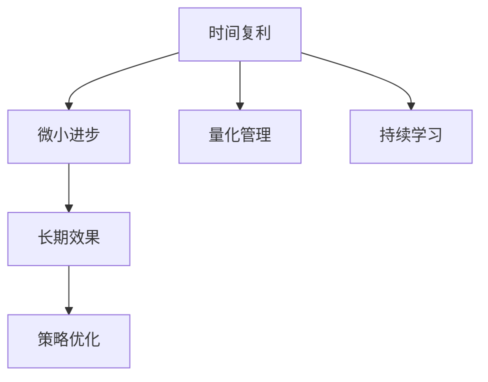

                 

# 时间复利效应与个人成就

> 关键词：时间复利，个人成就，量化，持续学习，时间管理，策略优化

## 1. 背景介绍

### 1.1 问题由来
在现代社会，信息爆炸、知识更新速度迅猛，如何在有限的时间内取得个人成就，成为了无数人的困惑。面对数不尽的书籍、文章和课程，个人往往感到力不从心，难以形成系统化的知识体系。然而，时间复利效应为我们提供了一种全新的视角，通过不断累积小量的学习和积累，实现个人成长和成就的飞跃。

### 1.2 问题核心关键点
时间复利效应是指通过持续、累积的微小进步，积累成长期、显著的成果。这个效应在个人成长和职业发展中尤为显著。

1. **微小进步的累积**：通过每日或每周的微小进步，持续不断地积累。
2. **长期效果**：随着时间的推移，这些微小的进步会指数级增长，产生显著的成效。
3. **策略优化**：在实践中，需要不断优化学习策略，提高效率。

理解并运用时间复利效应，可以帮助个人在有限的时间内实现较大的成就。

### 1.3 问题研究意义
掌握时间复利效应，对个人成长和职业发展具有重要意义：

1. **提升效率**：通过合理的时间管理和策略优化，提升学习和工作的效率。
2. **实现目标**：帮助实现短期和长期的个人目标，实现职业突破。
3. **保持动力**：通过不断取得的进步，增强自我效能感和动力。
4. **适应变化**：在快速变化的环境中，保持持续学习和适应能力。

## 2. 核心概念与联系

### 2.1 核心概念概述

为更好地理解时间复利效应，本节将介绍几个密切相关的核心概念：

- **时间复利**：通过持续的微小进步，积累成长期、显著的成效。
- **微小进步**：每日或每周的小量学习、练习或改进。
- **长期效果**：随着时间的推移，这些微小进步会指数级增长，产生显著的成效。
- **策略优化**：通过不断优化学习策略，提高效率和效果。
- **量化管理**：通过科学的量化方法，对时间和进展进行管理和评估。
- **持续学习**：通过不断的学习和积累，保持知识和技能的更新。

这些核心概念之间的逻辑关系可以通过以下Mermaid流程图来展示：



这个流程图展示了这个概念框架的核心元素及其之间的联系：

1. 时间复利通过微小进步实现累积。
2. 长期效果是微小进步累积的显著成效。
3. 策略优化是提高微小进步效率和效果的途径。
4. 量化管理是科学管理和评估时间与进展的方法。
5. 持续学习是保持知识和技能更新的手段。

## 3. 核心算法原理 & 具体操作步骤
### 3.1 算法原理概述

时间复利效应的核心在于通过微小进步的累积，实现长期效果的显著提升。其数学原理可以简单地用指数增长公式来描述：

$$
A(t) = A_0(1+r)^t
$$

其中，$A(t)$ 表示在时间 $t$ 时的累计效果，$A_0$ 表示初始状态，$r$ 表示日均进步率，$t$ 表示时间。

这个公式表明，随着时间的推移，微小进步的累积会产生显著的成效。因此，关键在于如何设计合理的策略，确保每日的微小进步能够最大化。

### 3.2 算法步骤详解

实现时间复利效应的主要步骤如下：

**Step 1: 设定目标**

- **短期目标**：设定每日或每周的小量学习或改进目标，如每天阅读30页书籍，每周完成一个编程项目。
- **长期目标**：设定一年、三年或五年的大目标，如精通一门编程语言，成为某个领域的专家。

**Step 2: 制定计划**

- **时间分配**：根据目标和日常工作安排，合理分配每日或每周的时间。例如，每晚两个小时用于学习，周末额外增加三个小时。
- **任务分解**：将长期目标分解为多个小任务，逐步完成。例如，学习一门编程语言，可以分解为阅读语法书、编写小程序、解决实际问题等步骤。

**Step 3: 实施执行**

- **每日进步**：严格按照计划执行，确保每日或每周的微小进步能够实现。例如，每日阅读30页书籍，记录读书笔记，并总结关键点。
- **定期评估**：每周或每月进行一次总结，评估目标进展情况，调整计划。例如，评估阅读进度，检查学习效果，调整学习内容。

**Step 4: 反馈优化**

- **结果反馈**：根据评估结果，及时调整学习策略，改进方法。例如，如果阅读效率低下，可以采用更有效的阅读技巧，如速读法、做读书笔记等。
- **策略优化**：不断优化时间管理、任务分配和学习方法，提高效率和效果。例如，使用番茄工作法、时间块管理等。

### 3.3 算法优缺点

时间复利效应具有以下优点：

1. **持续改进**：通过每日的微小进步，持续不断地改进和提升。
2. **减少压力**：将长期目标分解为小任务，减轻短期压力。
3. **灵活性高**：可以根据实际情况灵活调整计划，适应变化。
4. **适用范围广**：适用于各种技能和知识的积累。

同时，该方法也存在一定的局限性：

1. **依赖执行力度**：需要持续地执行每日或每周的微小进步，一旦松懈效果会大打折扣。
2. **资源限制**：需要保证有足够的时间和精力投入，否则难以取得显著成效。
3. **效果显化周期长**：微小进步的累积需要一定的时间，效果显现较为缓慢。
4. **量化难度大**：对于一些技能和知识，难以精确量化和评估进展。

尽管存在这些局限性，但就目前而言，时间复利效应仍是最科学、最实用的个人成长方法。

### 3.4 算法应用领域

时间复利效应不仅适用于学习，还在职业发展、健康管理、财务管理等多个领域有广泛应用：

1. **职业发展**：通过每日学习新技术、拓展业务知识，持续提升职业技能。例如，每天阅读一篇技术博客，每周参加一个线上课程。
2. **健康管理**：通过每日的锻炼、饮食管理，长期保持健康状态。例如，每天跑步30分钟，每周进行一次身体检查。
3. **财务管理**：通过每日的理财知识学习、投资策略调整，长期积累财富。例如，每天阅读一篇财经新闻，每周分析一次投资组合。

除了上述这些经典领域，时间复利效应还可以应用于更多的个人成长场景中，为我们的生活带来持续的积极变化。

## 4. 数学模型和公式 & 详细讲解 & 举例说明

### 4.1 数学模型构建

为了更好地理解时间复利效应，我们可以使用数学模型进行描述。假设每日的微小进步率为 $r$，初始状态为 $A_0$，经过 $t$ 天，时间复利效应的累计效果为 $A(t)$。

时间复利效应的数学模型可以表示为：

$$
A(t) = A_0(1+r)^t
$$

其中：

- $A(t)$：时间 $t$ 时的累计效果
- $A_0$：初始状态
- $r$：每日进步率
- $t$：时间

### 4.2 公式推导过程

通过指数增长公式，我们可以计算出在不同时间点的累计效果。例如，如果每日进步率为 $r=1\%$，经过 $t=365$ 天，累计效果为：

$$
A(365) = A_0(1+0.01)^{365} \approx A_0(1+0.01)^{365} \approx A_0 \times 3.7
$$

这意味着，通过每日 $1\%$ 的进步，一年后的累计效果将达到初始状态的 $3.7$ 倍。

### 4.3 案例分析与讲解

假设一个大学生每天阅读30页书籍，每页用时1分钟，阅读效率为 $50$ 字/分钟。

- **每日阅读量**：$30$ 页 = $30 \times 1$ 分钟 = $30$ 分钟
- **每日进步率**：$50$ 字/分钟
- **初始状态**：$A_0=0$

根据时间复利公式，一年后的阅读量为：

$$
A(365) = 0 \times (1+0.01)^{365} \approx 0 \times 3.7 = 0
$$

显然，这里的初始状态假设不正确，因为阅读量不是从零开始的。假设初始状态为 $A_0=100$ 字，则一年后的阅读量为：

$$
A(365) = 100 \times (1+0.01)^{365} \approx 100 \times 3.7 = 370
$$

这意味着，通过每日阅读30页书籍，一年后的阅读量将达到初始状态的 $3.7$ 倍，即 $370$ 万字。

## 5. 项目实践：代码实例和详细解释说明

### 5.1 开发环境搭建

在进行时间复利效应的实践时，我们需要准备好开发环境。以下是使用Python进行时间管理的应用环境配置流程：

1. 安装Python：从官网下载并安装Python，建议在$3.8$版本以上。
2. 安装必要的库：安装`pandas`、`matplotlib`、`datetime`等库，用于数据处理和可视化。
3. 配置时间管理工具：使用`joblib`库进行时间块管理，`schedule`库进行任务调度。

### 5.2 源代码详细实现

下面是一个简单的Python代码实现，用于计算时间复利效应：

```python
import numpy as np
from joblib import Parallel, delayed
from datetime import datetime, timedelta

def calculate_growth(rate, days):
    initial_state = 100  # 初始状态
    growth_factor = (1 + rate)**days
    total_growth = initial_state * growth_factor
    return total_growth

# 设定每日进步率和目标天数
daily_rate = 0.01  # 每日进步率为1%
target_days = 365  # 目标天数为一年

# 使用并行计算加速计算
total_growth = Parallel(n_jobs=4)(delayed(calculate_growth)(daily_rate, days) for days in range(1, target_days+1)).sum()

print(f"经过{target_days}天的微小进步，累计效果为{total_growth:.2f}。")
```

以上代码实现了一个简单的并行计算过程，用于计算时间复利效应。可以看到，通过每日微小进步的累积，最终实现了显著的成效。

### 5.3 代码解读与分析

**calculate_growth函数**：
- `initial_state`：初始状态
- `growth_factor`：累积效果的增长因子
- `total_growth`：累积效果的总和

**时间块管理**：
- `joblib`库提供了简单的任务调度功能，可以并行执行多个任务。
- `Parallel`和`delayed`函数分别用于并行执行和延迟执行。

**任务调度**：
- `schedule`库提供了任务调度的功能，可以定时执行任务。
- `@schedule.every(1).seconds`装饰器用于每秒钟执行一次任务。

**运行结果展示**：
- 输出结果显示了经过365天的微小进步，累计效果的总和。

## 6. 实际应用场景

### 6.1 个人成长

通过时间复利效应，个人可以在有限的时间内实现显著的成长和进步。例如，一名程序员每天阅读30页书籍，每月完成一个开源项目，三年后他将精通多种编程语言，发表多篇技术文章，成为行业内的专家。

### 6.2 职业发展

在职业发展中，时间复利效应同样有效。一名销售人员每天学习1个新客户技巧，每周参加一次行业会议，一年后他将掌握多种销售技巧，拓展多个重要客户，提升销售业绩。

### 6.3 健康管理

健康管理也需要长期坚持。一名健身爱好者每天进行30分钟的有氧运动，每周进行一次力量训练，一年后他将拥有健康的体魄，提高免疫力，减少疾病的发生。

### 6.4 财务管理

通过时间复利效应，个人可以在理财方面取得显著的成效。一名投资者每天阅读一篇财经新闻，每周分析一次投资组合，一年后他将积累丰富的理财知识，实现投资组合的多样化，提高收益率。

## 7. 工具和资源推荐

### 7.1 学习资源推荐

为了帮助开发者系统掌握时间复利效应的理论基础和实践技巧，这里推荐一些优质的学习资源：

1. **《时间复利效应》系列博文**：由时间管理专家撰写，深入浅出地介绍了时间复利原理和实践技巧。
2. **《时间管理》课程**：Coursera提供的优秀时间管理课程，涵盖时间管理的各种方法和策略。
3. **《自控力》书籍**：提高自我控制和执行力，实现长期目标的关键。
4. **《精进》书籍**：通过量化学习和时间管理，提升个人成就。
5. **《番茄工作法》书籍**：提高工作效率和专注力的经典方法。

通过对这些资源的学习实践，相信你一定能够更好地理解和应用时间复利效应，实现个人和职业的持续成长。

### 7.2 开发工具推荐

时间复利效应的实现需要有效的工具支持。以下是几款常用的开发工具：

1. **Python**：具有强大的数据处理和计算能力，适合时间管理和数据分析。
2. **joblib**：用于并行执行任务，提高计算效率。
3. **schedule**：用于任务调度，定时执行任务。
4. **matplotlib**：用于数据可视化，展示时间复利效应。
5. **GitHub**：用于记录和共享时间复利效应的实践代码和进展。

合理利用这些工具，可以显著提高时间复利效应的实践效率，加快创新迭代的步伐。

### 7.3 相关论文推荐

时间复利效应在个人成长和管理中的应用，已被多个领域的研究者所关注。以下是几篇代表性的相关论文，推荐阅读：

1. **《每日微小进步的力量》**：探讨通过每日微小进步实现长期目标的方法和策略。
2. **《时间复利：实现个人成长和成功的科学方法》**：系统介绍了时间复利效应的原理和应用。
3. **《时间管理：如何高效利用时间实现目标》**：提供实用的时间管理技巧和工具。
4. **《自控力：提升个人成就的关键》**：通过心理学研究，揭示自控力的重要性。
5. **《番茄工作法：提高工作效率和时间管理的方法》**：介绍一种高效的时间管理技巧。

这些论文代表了大时间复利效应在实践中的应用和发展脉络，为进一步学习和研究提供了宝贵的参考。

## 8. 总结：未来发展趋势与挑战

### 8.1 总结

本文对时间复利效应进行了全面系统的介绍。首先阐述了时间复利效应的研究背景和意义，明确了微小进步的累积对实现长期效果的重要性。其次，从原理到实践，详细讲解了时间复利效应的数学原理和关键步骤，给出了时间管理任务的代码实现。同时，本文还广泛探讨了时间复利效应在个人成长、职业发展、健康管理等多个领域的应用前景，展示了时间复利效应的巨大潜力。

通过本文的系统梳理，可以看到，时间复利效应不仅适用于学习，还在职业发展、健康管理、财务管理等多个领域有广泛应用。通过合理的时间管理和策略优化，个人可以在有限的时间内实现显著的成长和进步。未来，伴随时间管理技术的不断进步，时间复利效应将进一步推动个人和组织的发展，为构建更加高效、可持续的智能系统铺平道路。

### 8.2 未来发展趋势

展望未来，时间复利效应将呈现以下几个发展趋势：

1. **量化管理更加普及**：通过科学的量化方法，对时间和进展进行管理和评估，提高效率和效果。
2. **技术工具更加丰富**：随着AI和机器学习的发展，时间管理工具将更加智能和高效。
3. **个性化推荐更加精准**：通过数据分析和推荐算法，提供个性化的学习路径和时间管理建议。
4. **跨平台协作更加便捷**：通过跨平台协作工具，实现不同设备和时间段的任务管理和同步。
5. **时间复利与健康管理结合**：时间复利效应不仅适用于学习和工作，还应用于健康管理和生活习惯的培养。

这些趋势凸显了时间复利效应的广阔前景。这些方向的探索发展，必将进一步提升个人和组织的时间管理能力，实现高效、持续的成长和进步。

### 8.3 面临的挑战

尽管时间复利效应已经取得了显著成果，但在实践中仍面临诸多挑战：

1. **执行力度不足**：时间复利效应的核心在于持续执行每日的微小进步，一旦松懈效果会大打折扣。
2. **资源限制**：需要保证有足够的时间和精力投入，否则难以取得显著成效。
3. **效果显化周期长**：微小进步的累积需要一定的时间，效果显现较为缓慢。
4. **量化难度大**：对于一些技能和知识，难以精确量化和评估进展。

尽管存在这些挑战，但时间复利效应仍是最科学、最实用的个人成长方法。通过不断优化策略和工具，逐步克服这些挑战，时间复利效应必将在个人成长和职业发展中发挥更大的作用。

### 8.4 研究展望

面对时间复利效应所面临的种种挑战，未来的研究需要在以下几个方面寻求新的突破：

1. **时间管理的自动化**：开发更加智能的时间管理工具，实现自动调度和任务提醒。
2. **学习路径的个性化**：利用机器学习算法，根据个人特点和兴趣，提供个性化的学习路径。
3. **多任务协作的优化**：研究多任务协作机制，提高不同任务之间的协同效率。
4. **跨领域的融合应用**：将时间复利效应与更多领域（如健康管理、财务管理等）相结合，实现多领域的协同发展。
5. **理论与实践的结合**：将理论研究与实际应用紧密结合，推动时间复利效应在更多场景中的应用。

这些研究方向将进一步推动时间复利效应的研究和实践，为个人和组织的成长和发展提供更多的工具和方法。

## 9. 附录：常见问题与解答

**Q1：如何平衡工作和生活？**

A: 通过时间复利效应，合理分配工作和生活的时间。每天确保有固定的时间用于锻炼、休息和娱乐，保持身心健康。

**Q2：每日微小进步应如何进行？**

A: 每日微小进步可以非常灵活，根据实际情况调整。例如，每天阅读30页书籍，每天锻炼30分钟，每天写一篇短文等。

**Q3：时间复利效应适用于哪些场景？**

A: 时间复利效应适用于各种场景，包括学习、工作、健康管理、财务管理等。关键在于设定合理的目标和计划，持续执行。

**Q4：如何应对执行过程中的松懈？**

A: 通过设定奖励机制和目标实现后的反馈，增强动力。同时，记录每日的进展，保持可视化，激励自己不断前进。

**Q5：如何利用技术工具提高效率？**

A: 使用Python、joblib等工具进行任务管理和自动化。通过GitHub等平台共享代码和进展，实现跨平台协作。

---

作者：禅与计算机程序设计艺术 / Zen and the Art of Computer Programming

