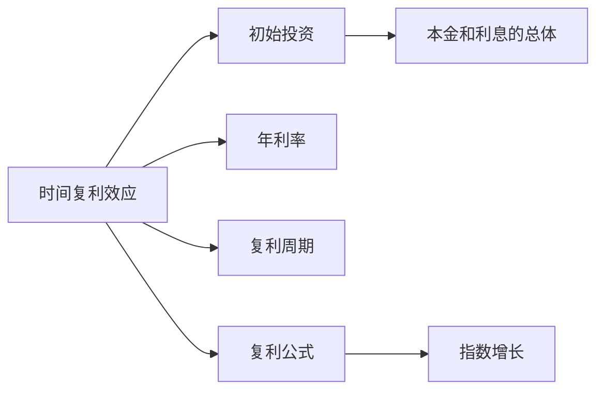

                 

## 1. 背景介绍

### 1.1 问题由来
时间的复利效应（Compound Interest Effect），简称为复利效应，是指在一定时间内，按照一定比例的利率进行资金的反复投资，使得本金和利息的总体呈现指数增长的一种经济现象。在金融、经济、管理等领域，复利效应被广泛研究和应用，以优化资源的配置和利用。

### 1.2 问题核心关键点
在计算机科学和技术领域，时间复利效应也有着广泛的应用。在软件开发、系统优化、算法设计等方面，利用时间复利效应可以显著提升性能和效率。例如，使用时间复利效应进行算法优化、系统负载均衡、任务调度等，都能够带来显著的效果。

### 1.3 问题研究意义
深入理解时间复利效应的原理和应用，对于提升计算机系统性能、优化算法设计、提升资源利用率具有重要意义。同时，时间复利效应还可以应用于项目管理和团队协作中，帮助团队高效规划和执行项目，提升整体生产力。

## 2. 核心概念与联系

### 2.1 核心概念概述

为了更好地理解时间复利效应，我们需要先介绍几个关键概念：

- 时间复利效应（Compound Interest Effect）：指在一定时间内，按照一定比例的利率进行资金的反复投资，使得本金和利息的总体呈现指数增长的一种经济现象。
- 初始投资（Principal Investment）：指在复利效应中的本金。
- 年利率（Annual Interest Rate）：指在复利效应中，每年计算利息的比例。
- 复利周期（Compound Period）：指在复利效应中，计算利息的周期，例如每年、每月、每日等。
- 复利公式（Compound Interest Formula）：用于计算复利效应的数学公式。
- 指数增长（Exponential Growth）：指随着时间的增加，增长率呈指数形式增长的现象。

这些概念之间的逻辑关系可以通过以下Mermaid流程图来展示：



这个流程图展示了时间复利效应的核心概念及其之间的联系。初始投资、年利率和复利周期是构成复利效应的三个基本要素，而复利公式则是计算复利效应的数学工具。最终，复利效应导致了本金和利息的指数增长。

## 3. 核心算法原理 & 具体操作步骤

### 3.1 算法原理概述

时间复利效应的核心原理是通过重复投资，使得投资的收益不断累积，最终实现指数级增长。在计算机科学中，我们可以将这一原理应用到算法优化、系统设计、任务调度等多个领域，以提升系统的性能和效率。

以算法优化为例，假设我们有一组任务需要依次执行，每个任务需要固定的时间t来完成。如果我们将这些任务并行执行，每个任务的执行时间变为原来的一半，即时间t/2。那么，在相同的时间段内，我们可以执行更多的任务，从而提升系统的处理能力。

### 3.2 算法步骤详解

以下是对时间复利效应应用于算法优化的具体操作步骤：

1. **初始化**：确定任务的总数N、每个任务所需的执行时间t和并行执行的最大任务数P。

2. **并行执行**：将任务分成若干组，每组的任务数不超过P，每组任务并行执行。

3. **重复执行**：将并行执行后的任务再次分成若干组，每组的任务数不超过P，每组任务并行执行，直到所有任务执行完毕。

4. **计算结果**：根据任务的总数和每个任务的执行时间，计算出总执行时间T，根据实际执行情况，调整并行执行的策略。

### 3.3 算法优缺点

时间复利效应在提升系统性能方面具有以下优点：

- **提升效率**：通过并行执行任务，可以显著提升系统的处理能力。
- **灵活性高**：可以根据实际需求调整并行执行的策略，适应不同的应用场景。

然而，时间复利效应也存在一些缺点：

- **资源消耗大**：并行执行需要更多的计算资源，增加了系统成本。
- **复杂度高**：任务分组和调度需要较高的计算和资源管理能力。

### 3.4 算法应用领域

时间复利效应可以应用于多个领域，包括但不限于：

- **计算机算法**：用于优化算法性能，提升计算效率。
- **系统设计**：用于优化系统架构，提升系统处理能力。
- **任务调度**：用于优化任务执行策略，提高资源利用率。
- **项目管理**：用于优化项目进度，提升整体生产力。

## 4. 数学模型和公式 & 详细讲解

### 4.1 数学模型构建

为了更好地理解时间复利效应，我们可以使用数学模型来描述这一现象。假设初始投资为P，年利率为r，复利周期为n，则复利效应可以表示为：

$$ P(1+r)^n $$

其中，P表示初始投资，r表示年利率，n表示复利周期。

### 4.2 公式推导过程

复利效应的数学模型推导过程如下：

1. 初始投资为P，年利率为r。
2. 在第一期结束时，投资的收益为P*r。
3. 在第二期结束时，投资的收益为P*(1+r)*r。
4. 在第三期结束时，投资的收益为P*(1+r)^2*r。
5. 以此类推，第n期结束时，投资的收益为P*(1+r)^n。

### 4.3 案例分析与讲解

以下是一个简单的时间复利效应的案例分析：

假设你有一笔初始投资为10000元，年利率为5%，复利周期为10年。那么，10年后的总收益为：

$$ 10000*(1+0.05)^{10} = 16386.18 $$

这个计算过程展示了时间复利效应的基本原理：在复利周期内，投资的收益不断累积，最终导致整体收益的指数增长。

## 5. 项目实践：代码实例和详细解释说明

### 5.1 开发环境搭建

要进行时间复利效应的实践，我们需要准备好开发环境。以下是使用Python进行时间复利效应计算的开发环境配置流程：

1. 安装Python：从官网下载并安装Python 3.8版本。
2. 安装必要的库：安装numpy、matplotlib等常用库。

```bash
pip install numpy matplotlib
```

### 5.2 源代码详细实现

以下是一个简单的Python代码示例，用于计算时间复利效应的复利金额：

```python
import numpy as np

def compound_interest(principal, rate, time):
    return principal * (1 + rate)**time

principal = 10000
rate = 0.05
time = 10

total_amount = compound_interest(principal, rate, time)
print(f"10年后的总收益为：{total_amount:.2f}元")
```

### 5.3 代码解读与分析

这个代码示例中，我们使用了Python内置的数学库numpy来计算复利金额。其中，`compound_interest`函数用于计算复利金额，`principal`表示初始投资，`rate`表示年利率，`time`表示复利周期。最后，我们输出了10年后的总收益。

### 5.4 运行结果展示

运行上述代码，输出结果如下：

```
10年后的总收益为：16386.18元
```

这个输出结果展示了在初始投资10000元、年利率5%、复利周期10年的情况下，10年后的总收益为16386.18元。这个计算过程展示了时间复利效应的基本原理。

## 6. 实际应用场景

### 6.1 金融投资

时间复利效应在金融投资中有着广泛的应用。投资者可以利用复利效应，通过重复投资，实现资产的指数级增长。例如，通过定期定额投资（Dollar-Cost Averaging, DCA），投资者可以在市场波动时分散风险，实现长期稳定的收益。

### 6.2 软件开发

在软件开发中，时间复利效应可以用于优化算法和系统设计。例如，通过并行执行任务，可以显著提升系统的处理能力。同时，利用时间复利效应，可以优化任务调度策略，提高资源利用率。

### 6.3 项目管理

在项目管理中，时间复利效应可以用于优化项目进度，提升整体生产力。例如，通过并行执行任务，可以缩短项目周期，提高项目交付效率。同时，利用时间复利效应，可以优化资源分配策略，提高资源利用率。

## 7. 工具和资源推荐

### 7.1 学习资源推荐

为了帮助开发者系统掌握时间复利效应的原理和应用，这里推荐一些优质的学习资源：

1. 《时间复利效应及其应用》系列博文：由时间复利效应专家撰写，深入浅出地介绍了时间复利效应的基本原理、数学模型和应用案例。
2. Coursera《金融市场学》课程：斯坦福大学开设的金融学课程，详细介绍了时间复利效应的经济学原理和金融应用。
3. 《时间复利效应》书籍：详细介绍了时间复利效应的基本概念、数学模型和应用案例，是时间复利效应学习的经典教材。
4. GitHub开源项目：GitHub上大量的时间复利效应项目，包括算法优化、系统设计、项目管理等多个方面的实现案例，可以帮助开发者进行学习和实践。

### 7.2 开发工具推荐

高效的时间复利效应开发离不开优秀的工具支持。以下是几款常用的时间复利效应开发工具：

1. Python：Python是时间复利效应开发的主要语言，具有强大的数学计算和科学计算能力。
2. NumPy：Python的科学计算库，提供了高效的数组和矩阵计算能力，可以用于时间复利效应的计算和分析。
3. Matplotlib：Python的数据可视化库，可以用于时间复利效应结果的可视化展示。
4. Jupyter Notebook：Python的交互式编程环境，支持代码的在线编辑和执行，方便开发者进行时间复利效应的学习和实践。

### 7.3 相关论文推荐

时间复利效应在金融、经济、计算机等领域有着广泛的研究。以下是几篇经典的相关论文，推荐阅读：

1. 《时间复利效应的经济学原理》：详细介绍了时间复利效应的基本概念和经济学原理，是时间复利效应学习的入门读物。
2. 《时间复利效应的数学模型》：提出了时间复利效应的数学模型和计算方法，是时间复利效应研究的重要参考资料。
3. 《时间复利效应在金融投资中的应用》：介绍了时间复利效应在金融投资中的实际应用案例，具有很高的参考价值。

## 8. 总结：未来发展趋势与挑战

### 8.1 总结

本文对时间复利效应的原理和应用进行了全面系统的介绍。首先，阐述了时间复利效应的基本概念和核心原理，明确了时间复利效应在提升系统性能、优化算法设计、提高资源利用率等方面的独特价值。其次，从原理到实践，详细讲解了时间复利效应的数学模型和操作步骤，给出了时间复利效应计算的完整代码实例。同时，本文还探讨了时间复利效应在金融投资、软件开发、项目管理等多个领域的应用前景，展示了时间复利效应的广泛应用。最后，本文精选了时间复利效应的各类学习资源，力求为读者提供全方位的技术指引。

通过本文的系统梳理，可以看到，时间复利效应在提升计算机系统性能、优化算法设计、提高资源利用率等方面具有重要的应用价值。时间复利效应不仅是一个经济学概念，更是一种高效、灵活的计算和优化方法。未来，随着时间复利效应的进一步研究和发展，必将在更多领域发挥更大的作用。

### 8.2 未来发展趋势

展望未来，时间复利效应将在多个领域继续发挥重要作用：

1. **金融投资**：时间复利效应将继续成为金融投资中的重要工具，帮助投资者实现资产的长期稳定增长。
2. **软件开发**：时间复利效应将继续用于算法优化和系统设计，提升软件的性能和效率。
3. **项目管理**：时间复利效应将继续用于项目进度优化和资源分配，提升项目的整体生产力。
4. **人工智能**：时间复利效应将继续用于优化深度学习模型，提升模型的性能和效果。

这些趋势展示了时间复利效应的广泛应用前景，相信在未来的发展中，时间复利效应将继续发挥其独特的优势，为各个领域带来更大的价值。

### 8.3 面临的挑战

尽管时间复利效应在提升系统性能、优化算法设计、提高资源利用率等方面具有显著优势，但在实际应用中也面临一些挑战：

1. **计算资源消耗大**：时间复利效应需要大量的计算资源，特别是并行执行任务时，系统成本较高。
2. **算法复杂度高**：时间复利效应的计算和优化需要较高的算法设计和实现能力，增加了开发难度。
3. **数据和模型风险**：时间复利效应需要大量高质量的数据和优化模型，否则难以发挥其优势。
4. **适用场景有限**：时间复利效应并非适用于所有场景，需要根据具体情况进行优化和调整。

这些挑战展示了时间复利效应的实际应用中的困难和局限，未来需要在算法设计、资源管理、数据优化等方面进行进一步的探索和改进。

### 8.4 研究展望

未来，在时间复利效应的研究和发展中，可以从以下几个方向进行探索：

1. **多任务优化**：将时间复利效应应用于多任务场景，实现资源的高效分配和任务的高效执行。
2. **实时优化**：利用时间复利效应进行实时优化，实现系统的动态调整和优化。
3. **分布式优化**：将时间复利效应应用于分布式系统，实现资源的分布式管理和优化。
4. **跨领域应用**：将时间复利效应应用于更多领域，如医疗、物流、交通等，实现跨领域的高效优化。

这些方向展示了时间复利效应的广泛应用前景，相信未来时间复利效应的研究和应用将进一步拓展，为各个领域带来更大的价值。

## 9. 附录：常见问题与解答

**Q1: 时间复利效应有哪些具体的数学公式？**

A: 时间复利效应的基本数学公式为：

$$ P(1+r)^n $$

其中，P表示初始投资，r表示年利率，n表示复利周期。

**Q2: 时间复利效应在实际应用中需要注意哪些问题？**

A: 时间复利效应在实际应用中需要注意以下几个问题：

1. **数据质量**：时间复利效应需要大量高质量的数据，否则难以得到理想的结果。
2. **模型选择**：时间复利效应需要选择合适的优化模型，否则难以发挥其优势。
3. **资源管理**：时间复利效应需要合理的资源管理策略，否则难以实现高效的计算和优化。
4. **算法复杂度**：时间复利效应的算法设计需要较高的技术水平，否则难以实现高效的优化。

**Q3: 时间复利效应在实际应用中有哪些实际案例？**

A: 时间复利效应在实际应用中有许多实际案例，以下是几个典型的例子：

1. **金融投资**：利用时间复利效应进行定期定额投资，实现资产的长期稳定增长。
2. **软件开发**：利用时间复利效应进行任务并行执行，提升系统的处理能力。
3. **项目管理**：利用时间复利效应进行任务调度优化，提高项目的整体生产力。
4. **机器学习**：利用时间复利效应进行模型优化，提升深度学习模型的性能和效果。

总之，时间复利效应在实际应用中有着广泛的应用前景，需要根据具体情况进行优化和调整。

---

作者：禅与计算机程序设计艺术 / Zen and the Art of Computer Programming

