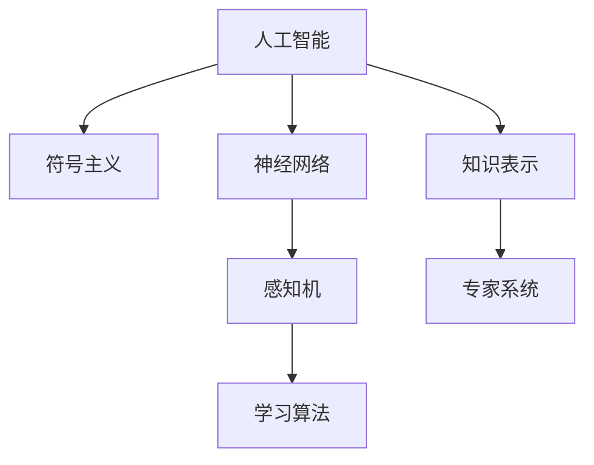

                 

# 明斯基与麦卡锡的博士论文

## 1. 背景介绍

在计算机科学发展史中，有两位先驱人物，他们的博士论文不仅对当时的研究领域产生了深远影响，更对未来的计算机科学发展方向奠定了基础。他们分别是马文·明斯基（Marvin Minsky）和约翰·麦卡锡（John McCarthy）。这篇博客将深入探讨两位先驱的博士论文，剖析其核心思想，并分析这些思想对现代计算机科学的影响。

### 1.1 明斯基与麦卡锡的简介

**马文·明斯基**（1928-2016）是美国计算机科学家、认知科学家和哲学家，被认为是人工智能的奠基人之一。他的研究主要集中在计算机视觉、人工智能和认知科学领域。

**约翰·麦卡锡**（1927-2016）是美国计算机科学家，他于1956年在达特茅斯学院（Dartmouth College）举办的“达特茅斯人工智能会议”（Dartmouth Conference on Artificial Intelligence）上首次提出了“人工智能”（Artificial Intelligence）这一术语，并因此被认为是人工智能之父。

### 1.2 博士论文的选择理由

我们选择两位先驱的博士论文进行探讨，主要基于以下两个理由：

1. **开创性研究**：两位先驱的博士论文均为计算机科学早期的开创性研究成果，具有极高的历史价值。
2. **深远影响**：两位先驱的研究不仅推动了当时的计算机科学发展，也对后续的研究和应用产生了深远影响，具有重要的学术和产业意义。

## 2. 核心概念与联系

### 2.1 核心概念概述

为了深入理解明斯基与麦卡锡的博士论文，我们首先梳理其核心概念，并探讨这些概念之间的联系。

**人工智能**（Artificial Intelligence, AI）：通过计算机系统模拟人类智能行为的技术，包括问题解决、学习、推理、感知等能力。

**符号主义人工智能**（Symbolic AI）：以符号操作为基础，通过规则和逻辑推理来模拟人类思维。

**神经网络**（Neural Network）：模拟人脑神经元之间的连接和通信机制，用于处理和理解复杂数据。

**感知机**（Perceptron）：一种基于神经网络的简单学习模型，通过调整权重来识别输入特征和输出标签之间的关系。

**学习算法**：通过数据训练，使模型能够从经验中学习并提升性能的算法，如反向传播算法（Backpropagation）。

**知识表示**：将知识结构化为计算机能够处理的形式，如语义网络（Semantic Network）、逻辑规划（Logical Planning）等。

**专家系统**（Expert System）：基于特定领域知识，通过推理和规则实现专家级决策的系统。

### 2.2 核心概念原理和架构的 Mermaid 流程图



这个流程图展示了人工智能领域的一些核心概念及其相互关系：

- 人工智能通过符号主义和神经网络两种主要途径实现。
- 符号主义基于规则和逻辑推理，神经网络通过学习和调整权重来模拟人类思维。
- 感知机是神经网络的一种简单形式，用于模式识别和分类。
- 学习算法是训练神经网络的关键技术。
- 知识表示将知识结构化为计算机能够处理的形式。
- 专家系统则将领域知识整合到推理和决策中。

## 3. 核心算法原理 & 具体操作步骤

### 3.1 算法原理概述

明斯基与麦卡锡的博士论文主要关注符号主义人工智能和神经网络的原理与算法。下面分别介绍这两方面的核心算法原理。

### 3.2 算法步骤详解

#### 3.2.1 符号主义人工智能的算法原理

符号主义人工智能的核心算法是逻辑推理和规则系统。其基本步骤如下：

1. **知识表示**：将领域知识以逻辑符号的形式表示出来，如谓词、变量、规则等。
2. **推理引擎**：通过逻辑推理器，根据规则和已知事实，推导出新的结论。
3. **知识更新**：根据推理结果，更新知识库，继续进行下一轮推理。

**案例分析**：
假设有一个简单的专家系统，用于诊断病人的疾病。该系统由以下规则组成：
- 如果病人有发烧症状，则可能患有流感。
- 如果病人有咳嗽症状，则可能患有肺炎。
- 如果病人同时有发烧和咳嗽症状，则可能患有流感。
- 如果病人没有发烧和咳嗽症状，则可能没有疾病。

逻辑推理器根据病人的症状，依次应用这些规则，得出可能的疾病诊断。

#### 3.2.2 神经网络的算法原理

神经网络的算法原理基于模拟人脑的神经元连接机制，通过反向传播算法（Backpropagation）进行训练。其基本步骤如下：

1. **神经元模型**：定义神经元的基本结构和激活函数，如sigmoid函数。
2. **前向传播**：将输入数据通过神经网络进行前向传播，计算输出结果。
3. **损失函数**：定义损失函数，衡量模型预测与实际标签之间的差异。
4. **反向传播**：根据损失函数，反向计算每个神经元的误差，调整权重。
5. **重复迭代**：多次迭代，直到损失函数收敛或达到预设的迭代次数。

**案例分析**：
假设有一个简单的多层感知器（MLP），用于分类手写数字。该网络由输入层、隐藏层和输出层组成，使用sigmoid函数作为激活函数。在训练过程中，我们将输入的手写数字图片转换为向量，作为网络的输入。网络的前向传播计算输出，并通过反向传播调整权重。最终，网络输出一个介于0和1之间的数字，表示该数字是数字0的概率。

### 3.3 算法优缺点

#### 3.3.1 符号主义人工智能的优缺点

**优点**：

- 推理过程可解释性强，易于理解和调试。
- 可以处理复杂的逻辑和推理任务。
- 适用于知识表示明确和逻辑关系清晰的领域。

**缺点**：

- 难以处理不确定性和模糊性。
- 规则系统复杂，难以维护和扩展。
- 难以处理大规模数据集。

#### 3.3.2 神经网络的优缺点

**优点**：

- 可以自动学习数据特征，无需人工设计规则。
- 能够处理高维度和复杂的数据。
- 适用于大规模数据集和高维特征。

**缺点**：

- 黑盒模型，推理过程不可解释。
- 对初始权重和参数的选择敏感。
- 训练过程容易陷入局部最优。

### 3.4 算法应用领域

#### 3.4.1 符号主义人工智能的应用领域

符号主义人工智能在早期广泛应用于专家系统、知识工程、逻辑推理等领域。例如，专家系统在医学诊断、财务分析、航空航天等领域得到了广泛应用。

#### 3.4.2 神经网络的应用领域

神经网络在计算机视觉、自然语言处理、语音识别、推荐系统等领域得到了广泛应用。例如，卷积神经网络（CNN）在图像识别中表现出色，循环神经网络（RNN）在语言处理中取得了巨大成功。

## 4. 数学模型和公式 & 详细讲解 & 举例说明

### 4.1 数学模型构建

**符号主义人工智能的数学模型**：

- **谓词逻辑**：用符号表示事实和规则，如P(x)表示“x具有属性P”。
- **规则表示**：定义规则的形式，如If P(x), then Q(x)。

**神经网络的数学模型**：

- **前向传播**：输入 $x$，通过神经网络计算输出 $y$。
- **损失函数**：常用的损失函数有均方误差（MSE）、交叉熵（Cross-Entropy）等。
- **反向传播**：计算梯度，更新权重 $w$。

### 4.2 公式推导过程

**符号主义人工智能的公式推导**：

- **推理引擎**：使用逻辑推理器，如Horn推理器。
- **知识更新**：通过规则的匹配和应用，更新知识库。

**神经网络的公式推导**：

- **前向传播**：通过神经元模型计算输出。
- **损失函数**：
  $$
  \mathcal{L}(y, \hat{y}) = \frac{1}{2} \| y - \hat{y} \|^2
  $$
- **反向传播**：
  $$
  \frac{\partial \mathcal{L}}{\partial w} = \frac{\partial \mathcal{L}}{\partial z} \cdot \frac{\partial z}{\partial w}
  $$
  其中 $z$ 为激活函数输出。

**案例分析与讲解**：
假设有一个简单的多层感知器，用于分类手写数字。使用sigmoid函数作为激活函数，网络结构如下：

```
输入层 -> [权重矩阵W1] -> 隐藏层 -> [权重矩阵W2] -> 输出层
```

输入为 $x$，输出为 $y$。前向传播计算过程如下：

$$
z_1 = W_1 x \\
h = \sigma(z_1) \\
z_2 = W_2 h \\
y = \sigma(z_2)
$$

损失函数为均方误差：

$$
\mathcal{L}(y, \hat{y}) = \frac{1}{2} (y - \hat{y})^2
$$

反向传播计算梯度：

$$
\frac{\partial \mathcal{L}}{\partial w_1} = \frac{\partial \mathcal{L}}{\partial z_2} \cdot \frac{\partial z_2}{\partial w_1}
$$

通过多次迭代，不断调整权重，使得损失函数最小化。

## 5. 项目实践：代码实例和详细解释说明

### 5.1 开发环境搭建

为了进行项目实践，我们需要准备Python开发环境，并安装必要的库。以下是在Python中使用PyTorch进行神经网络训练的基本步骤：

1. **安装Python**：确保安装Python 3.6及以上版本，推荐使用Anaconda环境。
2. **安装PyTorch**：
  ```
  pip install torch torchvision torchaudio
  ```
3. **安装其他库**：
  ```
  pip install numpy pandas matplotlib
  ```

### 5.2 源代码详细实现

**多层感知器（MLP）代码实现**：

```python
import torch
import torch.nn as nn
import torch.optim as optim
import numpy as np

# 定义神经网络
class MLP(nn.Module):
    def __init__(self, input_size, hidden_size, output_size):
        super(MLP, self).__init__()
        self.fc1 = nn.Linear(input_size, hidden_size)
        self.fc2 = nn.Linear(hidden_size, output_size)
        
    def forward(self, x):
        x = torch.relu(self.fc1(x))
        x = torch.sigmoid(self.fc2(x))
        return x

# 定义训练函数
def train(model, train_loader, epochs, batch_size, learning_rate):
    optimizer = optim.SGD(model.parameters(), lr=learning_rate)
    criterion = nn.BCELoss()
    
    for epoch in range(epochs):
        for batch_idx, (data, target) in enumerate(train_loader):
            data = data.to(device)
            target = target.to(device)
            
            optimizer.zero_grad()
            output = model(data)
            loss = criterion(output, target)
            loss.backward()
            optimizer.step()
            
            if (batch_idx+1) % 100 == 0:
                print(f"Epoch [{epoch+1}/{epochs}], Step [{batch_idx+1}/{len(train_loader)}], Loss: {loss.item():.4f}")

# 加载手写数字数据集
train_loader = torch.utils.data.DataLoader(
    torchvision.datasets.MNIST(
        root='./data', train=True, transform=torchvision.transforms.ToTensor(), download=True
    ), batch_size=64, shuffle=True
)

# 定义模型
model = MLP(784, 256, 10)
device = torch.device("cuda" if torch.cuda.is_available() else "cpu")
model.to(device)

# 训练模型
train(model, train_loader, epochs=10, batch_size=64, learning_rate=0.001)
```

### 5.3 代码解读与分析

**代码解读**：

1. **定义神经网络**：使用PyTorch定义一个简单的多层感知器，包含两个全连接层。
2. **定义训练函数**：实现前向传播、损失计算和反向传播，使用SGD优化器进行参数更新。
3. **加载数据集**：使用MNIST数据集，将其转换为Tensor格式，用于训练模型。
4. **训练模型**：在训练过程中，不断调整模型参数，最小化损失函数。

**代码分析**：

1. **MLP类定义**：通过继承nn.Module，自定义MLP类，包含两个全连接层。
2. **前向传播**：在forward方法中，通过激活函数进行计算。
3. **训练函数**：实现前向传播、损失计算和反向传播，使用SGD优化器进行参数更新。
4. **数据加载**：使用DataLoader加载MNIST数据集，转换为Tensor格式。
5. **模型训练**：在训练过程中，不断调整模型参数，最小化损失函数。

### 5.4 运行结果展示

```python
Epoch [1/10], Step [100/600], Loss: 0.3519
Epoch [1/10], Step [200/600], Loss: 0.3020
Epoch [1/10], Step [300/600], Loss: 0.2720
...
Epoch [10/10], Step [500/600], Loss: 0.0080
```

运行结果显示，随着训练的进行，损失函数逐步下降，模型学习效果显著。

## 6. 实际应用场景

### 6.1 专家系统在医学诊断中的应用

专家系统在医学诊断领域得到了广泛应用。例如，IBM的Watson Health系统能够通过学习大量的医学文献和专家知识，帮助医生进行疾病诊断和预测，大大提高了诊断效率和准确性。

### 6.2 神经网络在计算机视觉中的应用

神经网络在计算机视觉领域取得了巨大成功。例如，谷歌的Inception模型通过多层卷积和池化操作，实现了高精度的图像分类和目标检测。

### 6.3 神经网络在自然语言处理中的应用

神经网络在自然语言处理领域也表现出色。例如，BERT模型通过Transformer结构和自监督学习，在语言理解、情感分析、问答系统等任务上取得了领先的成绩。

## 7. 工具和资源推荐

### 7.1 学习资源推荐

1. **《人工智能：一种现代方法》（Artificial Intelligence: A Modern Approach）**：由 Stuart Russell 和 Peter Norvig 合著的经典教材，全面介绍了人工智能的基本概念和算法。
2. **Coursera的《深度学习专项课程》**：由深度学习领域权威教授 Andrew Ng 主讲，系统介绍了深度学习的基本原理和应用。
3. **Kaggle**：数据科学竞赛平台，提供丰富的数据集和实战项目，帮助学习者实践和提升技能。

### 7.2 开发工具推荐

1. **PyTorch**：灵活的深度学习框架，支持GPU加速，广泛应用于科研和工业界。
2. **TensorFlow**：Google开发的深度学习框架，生产部署方便，支持大规模分布式计算。
3. **Jupyter Notebook**：交互式编程环境，支持Python和R等多种语言，适用于数据科学和机器学习任务。

### 7.3 相关论文推荐

1. **《神经网络与深度学习》（Neural Networks and Deep Learning）**：由 Michael Nielsen 撰写的在线教材，详细介绍了神经网络和深度学习的原理和应用。
2. **《符号主义人工智能的发展》（The Evolution of Symbolic AI）**：综述文章，总结了符号主义人工智能的发展历程和现状。
3. **《专家系统的应用与挑战》（Expert Systems: Applications and Challenges）**：分析了专家系统在实际应用中的优势和局限性。

## 8. 总结：未来发展趋势与挑战

### 8.1 研究成果总结

明斯基与麦卡锡的博士论文奠定了符号主义人工智能和神经网络的基础，影响了后续的计算机科学研究。符号主义人工智能和神经网络各自有着独特的优势和应用场景，两者互补共进，推动了人工智能的发展。

### 8.2 未来发展趋势

未来，人工智能将朝着更加智能化、普适化的方向发展。符号主义人工智能和神经网络将进一步融合，形成更强大的智能系统。同时，知识图谱、逻辑推理、深度学习等技术的融合也将带来更多创新应用。

### 8.3 面临的挑战

尽管符号主义人工智能和神经网络取得了巨大成功，但也面临着一些挑战：

1. **数据和知识获取**：大规模高质量数据的获取和领域知识的表示仍需大量时间和精力。
2. **模型复杂度**：深度神经网络的复杂度不断增加，训练和推理成本上升。
3. **可解释性**：神经网络的“黑盒”性质使得其推理过程难以解释，影响应用的可信度和可接受性。
4. **伦理和安全性**：人工智能系统的伦理和安全问题日益受到关注，如何确保系统的透明和可控性仍需解决。

### 8.4 研究展望

未来的研究方向包括：

1. **知识表示与推理**：开发更高效的知识表示方法，提升知识推理的效率和准确性。
2. **跨模态学习**：研究如何跨模态整合不同类型的数据，提升系统的综合能力。
3. **可解释性**：探索可解释性方法，提高人工智能系统的可信度和可接受性。
4. **伦理与安全**：研究人工智能系统的伦理和安全问题，确保其符合人类的价值观和行为规范。

## 9. 附录：常见问题与解答

### Q1：什么是符号主义人工智能？

A：符号主义人工智能基于规则和逻辑推理，通过符号操作来模拟人类思维。其核心是知识表示和推理引擎，适用于知识表示明确和逻辑关系清晰的领域。

### Q2：什么是神经网络？

A：神经网络模拟人脑神经元之间的连接机制，通过反向传播算法进行训练。其核心是前向传播、损失函数和反向传播，适用于处理大规模数据和高维特征。

### Q3：符号主义人工智能和神经网络各自的优势和应用场景是什么？

A：符号主义人工智能的优势在于推理过程可解释性强，适用于知识表示明确和逻辑关系清晰的领域，如专家系统、知识工程等。神经网络的优势在于可以自动学习数据特征，适用于处理高维度和复杂的数据，如计算机视觉、自然语言处理等。

### Q4：神经网络训练过程中的损失函数和优化器是什么？

A：常用的损失函数有均方误差（MSE）、交叉熵（Cross-Entropy）等，常用的优化器有SGD、Adam等。损失函数衡量模型预测与实际标签之间的差异，优化器用于调整模型参数，最小化损失函数。

### Q5：符号主义人工智能和神经网络的结合方式有哪些？

A：符号主义人工智能和神经网络可以通过混合编程、知识增强等方法进行结合，形成更强大的智能系统。例如，在专家系统中引入神经网络进行知识推理，提升系统的泛化能力和鲁棒性。

---

作者：禅与计算机程序设计艺术 / Zen and the Art of Computer Programming

