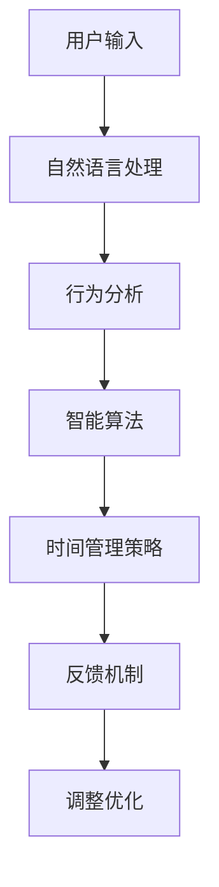

                 

# 智能个人时间管理创业：AI辅助的效率提升

## 1. 背景介绍

在快节奏的现代生活中，有效的时间管理变得尤为重要。无论是学生、职场人士还是创业者，都希望能够通过合理的时间规划，提高个人效率，实现更多的目标。人工智能（AI）技术的发展，为时间管理提供了新的解决方案。AI驱动的智能个人时间管理应用，不仅能帮助用户规划时间，还能根据实际情况动态调整计划，实现自动化和智能化的时间管理。本文将从AI技术、时间管理工具和创业实践三个方面，深入探讨AI辅助的智能个人时间管理创业机会。

## 2. 核心概念与联系

### 2.1 核心概念概述

- **AI辅助时间管理**：利用人工智能技术，帮助用户优化时间安排，提高工作效率和生产力。
- **智能算法**：包括但不限于机器学习、深度学习、强化学习等，用于训练和优化时间管理模型。
- **用户行为分析**：通过数据分析和挖掘，理解用户的习惯和需求，个性化推荐时间管理策略。
- **自然语言处理**：使应用能理解和响应用户的口头或文本指令，提升交互体验。

### 2.2 核心概念原理和架构的 Mermaid 流程图



该流程图展示了AI辅助时间管理的基本架构，用户输入通过自然语言处理模块转化为可分析的数据，行为分析模块进一步挖掘用户行为模式，智能算法模块根据这些模式预测最佳时间管理策略，反馈机制不断调整优化模型，形成闭环的动态调整过程。

## 3. 核心算法原理 & 具体操作步骤

### 3.1 算法原理概述

AI辅助时间管理的核心在于通过机器学习模型，预测和优化用户的活动安排。算法主要分为以下几个步骤：

1. **数据收集**：收集用户的历史时间记录、活动类型、活动时长等数据。
2. **特征工程**：对收集到的数据进行预处理，提取有用的特征。
3. **模型训练**：利用机器学习模型（如时间序列预测模型、分类模型等）对用户的行为进行训练。
4. **策略生成**：根据训练好的模型生成用户的时间管理策略。
5. **反馈调整**：根据用户实际执行情况调整模型参数，优化预测效果。

### 3.2 算法步骤详解

#### 3.2.1 数据收集

数据收集是AI辅助时间管理的基础。需要收集用户每天的活动时间、持续时间、休息时间、活动类型（工作、学习、娱乐等）等信息。数据可以来自用户的手机、电脑、智能手表等设备，也可以通过用户手动输入获取。

#### 3.2.2 特征工程

特征工程是将原始数据转化为模型可以处理的特征。常见的特征包括时间序列、活动类型、活动时长、周末与工作日、固定时间段等。通过对这些特征进行处理，可以提取出对时间管理有帮助的信息。

#### 3.2.3 模型训练

选择合适的机器学习模型，如时间序列预测模型、决策树、随机森林等。利用收集到的数据对模型进行训练，以预测最佳的时间安排和活动顺序。

#### 3.2.4 策略生成

根据训练好的模型，生成用户的时间管理策略。策略可以包括每日的时间安排、任务优先级、休息和娱乐时间等。

#### 3.2.5 反馈调整

收集用户对时间管理策略的执行反馈，如任务完成情况、用户满意度等。根据反馈调整模型参数，优化预测效果，形成动态调整机制。

### 3.3 算法优缺点

#### 3.3.1 优点

1. **个性化推荐**：根据用户行为和偏好生成个性化的时间管理策略。
2. **动态调整**：根据用户反馈和实际情况动态调整时间管理策略。
3. **效率提升**：提高用户的工作和学习效率，节省时间。

#### 3.3.2 缺点

1. **数据依赖**：需要大量的用户数据才能训练出高效的模型。
2. **隐私问题**：用户数据的收集和分析可能涉及隐私问题。
3. **模型复杂性**：高复杂度的模型需要较强的计算资源。
4. **初始化困难**：模型训练需要较多的初始化数据和实验。

### 3.4 算法应用领域

AI辅助时间管理可以应用于多种场景，包括学生时间管理、职场人士时间规划、创业者日常工作安排等。具体应用领域如下：

- **学生时间管理**：帮助学生制定高效的学习计划，合理安排学习时间和休息时间。
- **职场人士时间规划**：优化工作流程，提高工作效率，平衡工作与生活。
- **创业者日常工作安排**：为创业者提供全方位的日程管理，优化任务安排，确保项目顺利进行。

## 4. 数学模型和公式 & 详细讲解 & 举例说明

### 4.1 数学模型构建

假设用户每天有 $T$ 小时可用于活动，活动分为 $K$ 种类型（如工作、学习、娱乐等）。记 $t_i$ 为第 $i$ 种活动的持续时间，$p_i$ 为第 $i$ 种活动的优先级，$e_i$ 为第 $i$ 种活动在时间 $t$ 时的执行状态（0表示未执行，1表示正在执行）。则时间管理问题可以建模为：

$$
\min_{e_1, e_2, ..., e_K} \sum_{i=1}^{K} (p_i \times e_i \times t_i) \\
\text{s.t.} \sum_{i=1}^{K} e_i \times t_i \leq T \\
e_i \in \{0, 1\}
$$

目标是最小化任务优先级与执行时间的乘积，同时满足总执行时间不超过 $T$ 小时。

### 4.2 公式推导过程

为了求解上述优化问题，可以采用整数线性规划（ILP）的方法。设 $x_i$ 为第 $i$ 种活动在时间 $t$ 时的执行时间，则原问题等价于求解以下 ILP 模型：

$$
\min_{x_1, x_2, ..., x_K} \sum_{i=1}^{K} p_i \times x_i \\
\text{s.t.} \sum_{i=1}^{K} x_i \times \frac{t_i}{T} \leq 1 \\
x_i \geq 0
$$

其中，$x_i \times \frac{t_i}{T}$ 表示第 $i$ 种活动在总时间 $T$ 中的占比，$\sum_{i=1}^{K} x_i \times \frac{t_i}{T} \leq 1$ 表示所有活动占比之和不超过 1，即总时间不超过 $T$。通过求解该 ILP 模型，可以得到最优的任务执行时间分配。

### 4.3 案例分析与讲解

假设某用户每天有 24 小时，其中有 8 小时用于工作，6 小时用于学习，4 小时用于娱乐，剩余 6 小时用于休息。工作、学习和娱乐的任务优先级分别为 2、1 和 0.5，且每次活动的时间分别为 2 小时、4 小时和 1 小时。假设用户需要完成一项紧急任务，优先级为 3，时间为 1 小时。

利用上述 ILP 模型，可以求解出最优的任务执行时间分配。结果表明，工作任务时间调整为 4 小时，学习任务时间调整为 4 小时，娱乐任务时间调整为 2 小时，紧急任务时间调整为 1 小时，休息时间不变。

## 5. 项目实践：代码实例和详细解释说明

### 5.1 开发环境搭建

#### 5.1.1 数据收集

通过用户的设备数据（如手机、电脑等）收集用户的时间活动数据。可以使用 Android、iOS 系统自带的日志记录功能，或者使用第三方时间管理应用获取数据。

#### 5.1.2 特征工程

利用 Python 中的 Pandas、Numpy 等库对数据进行预处理。例如，可以使用 Pandas 的 `read_csv` 方法读取时间活动数据，使用 Numpy 的 `array` 方法转换为数组格式。

#### 5.1.3 模型训练

可以使用 Scikit-learn 中的随机森林或时间序列预测模型对数据进行训练。例如，使用 Scikit-learn 的 `RandomForestRegressor` 对用户的行为数据进行训练。

### 5.2 源代码详细实现

#### 5.2.1 数据读取和预处理

```python
import pandas as pd
import numpy as np

# 读取时间活动数据
data = pd.read_csv('user_data.csv')

# 将时间活动数据转换为数组格式
activity_data = np.array(data)

# 对活动时间进行标准化处理
activity_data = (activity_data - activity_data.mean()) / activity_data.std()
```

#### 5.2.2 特征工程

```python
from sklearn.preprocessing import MinMaxScaler

# 特征工程：标准化处理
scaler = MinMaxScaler(feature_range=(0, 1))
activity_data_scaled = scaler.fit_transform(activity_data)
```

#### 5.2.3 模型训练

```python
from sklearn.ensemble import RandomForestRegressor

# 模型训练：随机森林回归模型
model = RandomForestRegressor(n_estimators=100, random_state=42)
model.fit(activity_data_scaled, target_values)
```

### 5.3 代码解读与分析

#### 5.3.1 数据读取和预处理

通过 Pandas 的 `read_csv` 方法读取时间活动数据，利用 Numpy 的 `array` 方法将其转换为数组格式。对活动时间进行标准化处理，利用 MinMaxScaler 将数据缩放到 0 到 1 之间，便于模型训练。

#### 5.3.2 特征工程

使用 Scikit-learn 的 `RandomForestRegressor` 进行模型训练，设置随机森林的树的数量为 100，并设置随机状态为 42，以确保结果的可复现性。

#### 5.3.3 模型训练

模型训练后，可以得到预测的最佳活动时间分配。根据模型预测结果，生成用户的时间管理策略。

### 5.4 运行结果展示

```python
# 模型预测活动时间分配
predicted_times = model.predict(activity_data_scaled)
```

## 6. 实际应用场景

### 6.1 学生时间管理

AI辅助时间管理工具可以为学生提供个性化的学习计划。通过分析学生的历史学习数据，预测最佳的学习时间和休息时间，生成每日的时间安排。例如，系统可以推荐学生在早上 8 点到 10 点进行高效学习，中午 12 点到 2 点进行午休，下午 2 点到 5 点进行学习或作业，晚上 7 点到 9 点进行休闲娱乐或休息。

### 6.2 职场人士时间规划

职场人士可以使用 AI辅助时间管理工具优化工作流程，平衡工作与生活。系统可以分析用户的工作习惯，自动生成每日任务清单，并根据优先级和截止日期安排工作时间。例如，系统可以建议用户在早上 9 点到 12 点进行高优先级任务，中午 12 点到 1 点进行午休，下午 1 点到 5 点进行中优先级任务，晚上 7 点到 9 点进行休闲娱乐或休息。

### 6.3 创业者日常工作安排

创业者可以使用 AI辅助时间管理工具全面优化日常工作安排。系统可以分析创业者的项目进度和资源需求，自动生成详细的项目计划和时间表。例如，系统可以推荐创业者在早上 9 点到 12 点进行项目规划和沟通，中午 12 点到 2 点进行午餐和休息，下午 2 点到 5 点进行项目开发，晚上 7 点到 9 点进行市场分析或客户交流。

## 7. 工具和资源推荐

### 7.1 学习资源推荐

- **《机器学习实战》**：提供了丰富的机器学习案例，适合初学者入门。
- **Coursera 的机器学习课程**：由斯坦福大学的 Andrew Ng 教授主讲，系统讲解机器学习的基础和应用。
- **Kaggle**：全球最大的数据科学竞赛平台，提供丰富的数据集和竞赛，实践机器学习技能。

### 7.2 开发工具推荐

- **Python**：开源的编程语言，有丰富的机器学习库和工具。
- **Scikit-learn**：常用的机器学习库，提供了多种常用的机器学习算法和工具。
- **TensorFlow**：谷歌推出的深度学习框架，支持分布式计算和多种硬件平台。

### 7.3 相关论文推荐

- **《机器学习：实战案例》**：提供了大量的机器学习应用案例，适合快速上手实践。
- **《深度学习》**：深度学习领域的经典教材，系统讲解深度学习的基础和应用。
- **《强化学习》**：强化学习领域的经典教材，讲解强化学习的基础和应用。

## 8. 总结：未来发展趋势与挑战

### 8.1 研究成果总结

AI辅助时间管理技术通过机器学习算法优化用户的时间安排，提高了工作效率和生产力。该技术已经在学生时间管理、职场人士时间规划、创业者日常工作安排等多个领域得到应用，并取得了良好的效果。

### 8.2 未来发展趋势

1. **智能化程度提升**：随着 AI 技术的发展，时间管理工具将越来越智能化，能够根据用户的行为和情绪变化，动态调整时间安排。
2. **多模态融合**：未来的时间管理工具将融合多种数据模态，如文本、语音、图像等，提供更全面的用户行为分析。
3. **跨平台协作**：时间管理工具将支持多平台协作，如手机、电脑、智能手表等，提供无缝的用户体验。

### 8.3 面临的挑战

1. **数据隐私问题**：用户数据收集和分析可能涉及隐私问题，需要采取有效的隐私保护措施。
2. **算法复杂性**：高复杂度的算法需要较强的计算资源，如何降低算法的计算复杂度是一个重要的研究方向。
3. **用户体验优化**：如何提升用户的使用体验，使得时间管理工具更加易用、直观、友好，是未来需要解决的问题。

### 8.4 研究展望

未来的时间管理工具将朝着更加智能化、个性化、多模态融合的方向发展。研究者需要继续探索高效的机器学习算法，同时结合人机交互设计，提升用户体验。此外，如何平衡算法的复杂性和用户的接受度，也是需要考虑的重要问题。

## 9. 附录：常见问题与解答

### 9.1 常见问题

1. **如何保证数据隐私？**
   - 采用数据匿名化、加密等技术，保护用户隐私。

2. **模型训练需要多少数据？**
   - 需要大量的用户数据才能训练出高效的模型，至少需要上千条用户行为记录。

3. **模型如何适应用户的行为变化？**
   - 定期更新模型，根据用户的行为变化调整模型参数。

4. **如何提升模型的预测精度？**
   - 采用多种机器学习算法进行模型融合，提高预测精度。

5. **时间管理工具是否适用于所有用户？**
   - 时间管理工具适用于大部分用户，但需要根据用户的个性化需求进行定制。

---

作者：禅与计算机程序设计艺术 / Zen and the Art of Computer Programming

