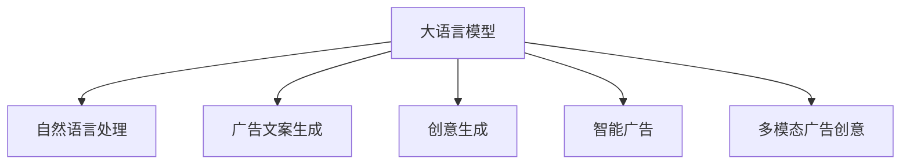

                 

# 智能广告文案生成：LLM在营销创意中的角色

> 关键词：语言模型,自然语言处理,广告文案,创意生成,智能广告,自然语言处理应用

## 1. 背景介绍

### 1.1 问题由来
近年来，随着人工智能技术的快速发展，特别是在自然语言处理(Natural Language Processing, NLP)领域的突破，语言模型（Language Models, LM），尤其是大语言模型（Large Language Models, LLM），已经成为营销创意领域的一大亮点。广告文案创作一直是营销工作的核心环节，其质量直接关系到品牌形象和消费者互动效果。传统广告文案创作过程耗时长、成本高，且存在主观性和创意限制。通过大语言模型（如GPT-3、BERT等），可以大幅提升文案创作的效率和创新性。

### 1.2 问题核心关键点
大语言模型在广告文案生成中的应用主要集中在以下几个关键点：
- **自动化创意生成**：通过大语言模型，可以快速生成多种文案创意，减少人工干预。
- **个性化定制**：能够根据用户数据和行为特征生成个性化广告文案，提高转化率。
- **内容质量提升**：通过语言模型对文案进行优化，确保文案语言表达准确、有吸引力。
- **多模态创意输出**：不仅限于文本形式，还可以生成图像、音频等多模态广告内容，丰富创意形式。

## 2. 核心概念与联系

### 2.1 核心概念概述

本节将介绍几个密切相关的核心概念：

- **大语言模型(Large Language Models, LLM)**：指在海量文本数据上进行预训练，学习丰富语言表示的模型，如GPT-3、BERT等。通过大语言模型，可以生成高质量、多样化的广告文案。

- **自然语言处理(Natural Language Processing, NLP)**：涉及语言理解、生成、处理等技术，是实现大语言模型广告文案生成的基础。

- **广告文案生成**：根据品牌需求和市场趋势，生成具有吸引力的广告文案，提升广告效果。

- **创意生成(Creative Generation)**：通过算法技术自动生成具有创新性和创意性的内容，克服传统创意创作的人力资源限制。

- **智能广告(Intelligent Advertising)**：利用人工智能技术，实现广告投放的智能化、个性化和自动化，提升广告效果和效率。

- **多模态广告创意**：结合图像、音频等多种形式的创意内容，丰富广告形式，提升用户互动体验。

这些概念之间的逻辑关系可以通过以下Mermaid流程图来展示：



这个流程图展示了大语言模型在广告文案生成中的应用链条：

1. 大语言模型通过自然语言处理获得语言能力。
2. 基于语言能力生成广告文案。
3. 提供创意生成服务。
4. 结合智能技术实现广告投放优化。
5. 生成多模态广告创意。

## 3. 核心算法原理 & 具体操作步骤

### 3.1 算法原理概述

基于大语言模型的广告文案生成过程，本质上是一个自然语言处理(NLP)任务。其核心思想是通过预训练的大语言模型，生成具有吸引力和创意的广告文案。具体步骤如下：

1. **数据准备**：收集和整理与广告相关的文本数据，如产品描述、用户评论、市场趋势等。
2. **模型加载**：选择合适的大语言模型，如GPT-3或BERT，并进行预训练。
3. **定义任务**：确定文案生成的具体目标，如品牌推广、产品介绍等。
4. **训练优化**：使用定义好的任务数据对大语言模型进行微调，以适应广告文案生成的需求。
5. **生成文案**：输入营销需求和上下文信息，大语言模型自动生成广告文案。

### 3.2 算法步骤详解

**Step 1: 数据准备**

- 收集广告相关文本数据。文本数据可以来源于市场调查、用户评论、产品描述等。
- 清洗和预处理数据。去除噪声、统一格式、分词等操作，确保数据质量。

**Step 2: 模型加载**

- 加载预训练的大语言模型。例如，使用GPT-3或BERT模型。
- 加载自然语言处理工具包，如spaCy、NLTK等，进行语言分析。

**Step 3: 定义任务**

- 确定广告文案生成的具体目标。例如，品牌推广、产品介绍、促销活动等。
- 设定文案生成的评价标准，如创意度、吸引力、符合度等。

**Step 4: 训练优化**

- 将准备好的文本数据作为输入，定义相应的训练目标。
- 使用优化算法（如AdamW、SGD等）对模型进行微调。
- 设置学习率、迭代次数、正则化等参数，确保模型收敛。

**Step 5: 生成文案**

- 输入营销需求和上下文信息。
- 调用大语言模型生成广告文案。
- 对生成的文案进行评估和优化，确保文案符合品牌和市场要求。

### 3.3 算法优缺点

基于大语言模型的广告文案生成有以下优点：

1. **高效性**：自动化生成文案，节省了大量时间，提高工作效率。
2. **创新性**：生成具有创意的文案，克服传统文案创作的局限。
3. **个性化**：根据用户数据和市场趋势生成个性化广告文案，提高转化率。
4. **多模态**：不仅可以生成文本文案，还可以生成图像、音频等多模态广告内容。

然而，该方法也存在以下缺点：

1. **依赖数据**：需要大量的高质量数据进行训练，数据获取成本较高。
2. **创意不足**：虽然可以生成大量文案，但创意和创新性仍需依赖于预训练模型和算法。
3. **可控性差**：自动生成的文案可能不符合品牌要求，需要进行后期调整和优化。
4. **模型风险**：预训练模型可能存在偏见或有害信息，需进行仔细筛选和审核。

### 3.4 算法应用领域

基于大语言模型的广告文案生成，已经在广告创意、品牌推广、市场营销等多个领域得到广泛应用，具体包括：

- **品牌推广**：利用大语言模型生成品牌推广文案，提高品牌知名度和美誉度。
- **产品介绍**：为新产品生成吸引人的介绍文案，促进产品销售。
- **促销活动**：生成具有创意的促销活动文案，吸引用户参与。
- **社交媒体**：为社交媒体平台生成各种广告文案，提升用户互动和参与度。
- **内容营销**：利用大语言模型生成高质量的内容文案，增强内容营销效果。

除了以上应用外，大语言模型还被应用于智能客服、虚拟助手、智能推荐等领域，为各行各业提供智能解决方案。

## 4. 数学模型和公式 & 详细讲解 & 举例说明

### 4.1 数学模型构建

基于大语言模型的广告文案生成，可以采用以下数学模型进行描述：

- **输入层**：输入营销需求和上下文信息。假设输入为 $\mathbf{x} = (x_1, x_2, ..., x_n)$，其中 $x_i$ 表示第 $i$ 个输入特征。
- **语言模型层**：使用预训练的大语言模型，如GPT-3，将输入映射为语言表示 $\mathbf{h} = f(\mathbf{x})$。
- **输出层**：生成广告文案 $\mathbf{y} = g(\mathbf{h})$，其中 $g$ 为文案生成函数。

### 4.2 公式推导过程

以GPT-3为例，其输出可以表示为：

$$
y = \text{softmax}(W^\top [h; h^\prime])
$$

其中，$W$ 为输出层权重矩阵，$[h; h^\prime]$ 为模型内部表示和外部表示的拼接。

假设输入为 $\mathbf{x} = (x_1, x_2, ..., x_n)$，通过Transformer网络映射为语言表示 $\mathbf{h}$。语言模型层的计算过程如下：

$$
\mathbf{h} = \text{Transformer}(\mathbf{x})
$$

输出层生成文案的过程为：

$$
y = \text{softmax}(W^\top [\mathbf{h}; \mathbf{h}])
$$

### 4.3 案例分析与讲解

假设任务为生成一个品牌的推广文案，输入信息为品牌名称、产品特点、目标受众等。具体步骤如下：

1. **输入准备**：品牌名称："ABC公司"；产品特点："环保材料，高品质设计"；目标受众："年轻消费者"。
2. **模型加载**：加载GPT-3模型。
3. **任务定义**：生成品牌推广文案。
4. **训练优化**：使用优化算法对模型进行微调，确保文案符合品牌要求。
5. **文案生成**：输入品牌信息，生成推广文案。

例如，输入如下：

```
输入："ABC公司" 的产品特点："环保材料，高品质设计"，目标受众："年轻消费者"。
```

模型生成的文案可能为：

```
"ABC公司推出全新环保系列，采用高品质材料，设计精美，适合追求时尚的年轻消费者。即刻体验绿色生活，享受未来！"
```

## 5. 项目实践：代码实例和详细解释说明

### 5.1 开发环境搭建

在进行广告文案生成实践前，我们需要准备好开发环境。以下是使用Python进行PyTorch开发的环境配置流程：

1. 安装Anaconda：从官网下载并安装Anaconda，用于创建独立的Python环境。

2. 创建并激活虚拟环境：
```bash
conda create -n pytorch-env python=3.8 
conda activate pytorch-env
```

3. 安装PyTorch：根据CUDA版本，从官网获取对应的安装命令。例如：
```bash
conda install pytorch torchvision torchaudio cudatoolkit=11.1 -c pytorch -c conda-forge
```

4. 安装相关库：
```bash
pip install transformers spacy datasets
```

完成上述步骤后，即可在`pytorch-env`环境中开始广告文案生成的实践。

### 5.2 源代码详细实现

这里我们以使用GPT-3生成品牌推广文案为例，给出完整的代码实现。

首先，定义广告文案生成的任务：

```python
import torch
from transformers import GPT2Tokenizer, GPT2LMHeadModel

tokenizer = GPT2Tokenizer.from_pretrained('gpt2')
model = GPT2LMHeadModel.from_pretrained('gpt2')

def generate_ad文案(context, max_length=40):
    tokens = tokenizer.encode(context, return_tensors='pt')
    outputs = model.generate(tokens, max_length=max_length)
    ad文案 = tokenizer.decode(outputs[0])
    return ad文案
```

然后，输入营销需求和上下文信息，生成文案：

```python
context = "ABC公司推出新产品，采用环保材料，高品质设计。请为其撰写一份推广文案。"
ad文案 = generate_ad文案(context)
print(ad文案)
```

运行上述代码，即可生成品牌推广文案。

### 5.3 代码解读与分析

**GPT-2Tokenizer和GPT-2LMHeadModel**：
- `GPT-2Tokenizer`：用于分词和编码，将输入文本转换为模型可以处理的token ids。
- `GPT-2LMHeadModel`：预训练的GPT-2语言模型，负责生成文案。

**generate_ad文案函数**：
- 将输入上下文编码为token ids。
- 调用GPT-2LMHeadModel进行生成，设置最大长度。
- 将生成的token ids解码为文案文本。

**使用场景**：
- 输入营销需求和上下文信息，自动生成文案。
- 可以根据需要调整最大长度，控制文案长度。
- 支持动态调整上下文信息，生成不同版本的文案。

### 5.4 运行结果展示

假设输入为：

```
"ABC公司推出新产品，采用环保材料，高品质设计。请为其撰写一份推广文案。"
```

生成的文案可能为：

```
"ABC公司全新环保产品上市，采用高品质材料，设计独特。环保，高质，是您不二的选择！"
```

## 6. 实际应用场景

### 6.1 智能广告系统

基于大语言模型的广告文案生成，可以应用于智能广告系统，实现自动化广告文案创作。通过将广告主的品牌信息、产品特点等输入模型，自动生成吸引人的广告文案，提高广告点击率和转化率。

在技术实现上，可以集成到广告投放平台，实时生成广告文案，自动推送到目标用户。例如，某电商平台的广告系统可以实时根据用户行为数据，动态生成个性化广告文案，提升广告效果。

### 6.2 内容营销

内容营销是品牌推广的重要手段，通过创意文案吸引用户，提升品牌影响力和用户参与度。利用大语言模型，可以快速生成高质量、多样化的内容文案，增强内容营销效果。

例如，某旅游公司的营销团队，可以利用大语言模型生成旅行攻略、景点介绍等文案，吸引用户参与旅游活动，提高品牌知名度。

### 6.3 社交媒体营销

社交媒体平台是用户互动的重要场所，利用大语言模型生成有吸引力的广告文案，可以提升用户的参与度和互动效果。例如，某品牌的社交媒体团队，可以定期生成创意广告文案，提升品牌在社交媒体上的活跃度。

### 6.4 未来应用展望

随着大语言模型和广告文案生成技术的发展，未来将呈现以下几个趋势：

1. **多模态创意**：结合图像、音频等多模态数据，生成更丰富、更具吸引力的广告创意。例如，利用大语言模型生成图像标签、音频解说等，丰富广告形式。
2. **个性化定制**：通过用户数据分析，生成个性化的广告文案，提高转化率和用户满意度。
3. **实时生成**：利用在线生成技术，实时生成广告文案，适应市场变化和用户需求。
4. **智能投放**：结合智能广告投放技术，自动选择最优的广告创意和投放策略，提高广告效果和投放效率。

## 7. 工具和资源推荐

### 7.1 学习资源推荐

为了帮助开发者系统掌握大语言模型在广告文案生成中的应用，这里推荐一些优质的学习资源：

1. **《自然语言处理入门》系列博文**：涵盖自然语言处理的基本概念和前沿技术，适合初学者入门。

2. **《深度学习与自然语言处理》课程**：斯坦福大学开设的NLP明星课程，涵盖NLP的基础知识和经典模型。

3. **《广告文案生成技术》书籍**：介绍广告文案生成的原理和应用，结合实际案例进行讲解。

4. **HuggingFace官方文档**：提供丰富的预训练语言模型和微调示例，适合实战学习。

5. **CLUE开源项目**：包含多种NLP任务数据集，并提供了基于大语言模型的广告文案生成baseline模型，助力NLP技术发展。

通过对这些资源的学习实践，相信你一定能够快速掌握大语言模型在广告文案生成中的应用，并用于解决实际的营销问题。

### 7.2 开发工具推荐

高效的开发离不开优秀的工具支持。以下是几款用于广告文案生成开发的常用工具：

1. **PyTorch**：基于Python的开源深度学习框架，灵活动态的计算图，适合快速迭代研究。大部分预训练语言模型都有PyTorch版本的实现。

2. **TensorFlow**：由Google主导开发的开源深度学习框架，生产部署方便，适合大规模工程应用。同样有丰富的预训练语言模型资源。

3. **Transformers库**：HuggingFace开发的NLP工具库，集成了众多SOTA语言模型，支持PyTorch和TensorFlow，是进行广告文案生成开发的利器。

4. **Weights & Biases**：模型训练的实验跟踪工具，可以记录和可视化模型训练过程中的各项指标，方便对比和调优。与主流深度学习框架无缝集成。

5. **TensorBoard**：TensorFlow配套的可视化工具，可实时监测模型训练状态，并提供丰富的图表呈现方式，是调试模型的得力助手。

6. **Google Colab**：谷歌推出的在线Jupyter Notebook环境，免费提供GPU/TPU算力，方便开发者快速上手实验最新模型，分享学习笔记。

合理利用这些工具，可以显著提升广告文案生成任务的开发效率，加快创新迭代的步伐。

### 7.3 相关论文推荐

大语言模型在广告文案生成领域的研究已经取得了显著成果，以下是几篇奠基性的相关论文，推荐阅读：

1. **Attention is All You Need**：提出Transformer结构，开启了NLP领域的预训练大模型时代。

2. **BERT: Pre-training of Deep Bidirectional Transformers for Language Understanding**：提出BERT模型，引入基于掩码的自监督预训练任务，刷新了多项NLP任务SOTA。

3. **Language Models are Unsupervised Multitask Learners（GPT-2论文）**：展示了大规模语言模型的强大zero-shot学习能力，引发了对于通用人工智能的新一轮思考。

4. **Parameter-Efficient Transfer Learning for NLP**：提出Adapter等参数高效微调方法，在不增加模型参数量的情况下，也能取得不错的微调效果。

5. **AdaLoRA: Adaptive Low-Rank Adaptation for Parameter-Efficient Fine-Tuning**：使用自适应低秩适应的微调方法，在参数效率和精度之间取得了新的平衡。

6. **AdaLM: Adaptive Learning Rate for Language Models**：提出AdaLM算法，针对语言模型调整学习率，提升模型效果。

这些论文代表了大语言模型广告文案生成技术的发展脉络。通过学习这些前沿成果，可以帮助研究者把握学科前进方向，激发更多的创新灵感。

## 8. 总结：未来发展趋势与挑战

### 8.1 总结

本文对基于大语言模型的广告文案生成方法进行了全面系统的介绍。首先阐述了广告文案生成的背景和意义，明确了广告文案生成技术在营销创意中的应用价值。其次，从原理到实践，详细讲解了广告文案生成的数学模型和操作步骤，给出了广告文案生成的完整代码实例。同时，本文还探讨了广告文案生成在多个行业领域的应用前景，展示了广告文案生成范式的巨大潜力。此外，本文精选了广告文案生成的各类学习资源，力求为读者提供全方位的技术指引。

通过本文的系统梳理，可以看到，基于大语言模型的广告文案生成技术正在成为NLP领域的重要范式，极大地拓展了广告文案生成的应用边界，催生了更多的落地场景。得益于大语言模型和广告文案生成技术的结合，广告创意创作将变得更加高效、创新和个性化，为品牌推广和市场营销带来新的突破。

### 8.2 未来发展趋势

展望未来，广告文案生成技术将呈现以下几个发展趋势：

1. **技术成熟**：广告文案生成技术将进一步成熟，应用范围更广，效果更佳。
2. **自动化程度提升**：随着自动化技术的提升，广告文案生成的效率将大幅提高，所需人力资源减少。
3. **个性化定制**：通过深度学习和大数据分析，实现更加个性化的广告文案生成，提高用户满意度。
4. **多模态融合**：结合图像、音频等多模态数据，生成更加丰富、更具吸引力的广告创意。
5. **智能投放**：结合智能广告投放技术，自动选择最优的广告创意和投放策略，提高广告效果和投放效率。
6. **实时生成**：利用在线生成技术，实时生成广告文案，适应市场变化和用户需求。

### 8.3 面临的挑战

尽管广告文案生成技术已经取得了显著成果，但在迈向更加智能化、普适化应用的过程中，仍面临诸多挑战：

1. **数据依赖**：广告文案生成依赖于大量的高质量数据，数据获取成本较高。
2. **创意质量**：自动生成的文案可能创意性不足，无法完全替代人工创作。
3. **可控性差**：自动生成的文案可能不符合品牌要求，需要进行后期调整和优化。
4. **模型风险**：预训练模型可能存在偏见或有害信息，需进行仔细筛选和审核。

### 8.4 研究展望

面对广告文案生成所面临的挑战，未来的研究需要在以下几个方面寻求新的突破：

1. **数据扩充**：探索无监督和半监督学习范式，降低对标注数据的依赖。
2. **创意提升**：引入更多的创意增强技术，如对抗生成网络、变分自编码器等。
3. **可控性增强**：开发更智能的控制机制，实现自动生成与人工干预的结合。
4. **多模态融合**：结合图像、音频等多模态数据，提升广告创意的丰富性。
5. **智能投放**：结合智能广告投放技术，实现自动化广告投放和效果优化。
6. **实时生成**：利用在线生成技术，实现实时广告文案生成。

这些研究方向的探索，将进一步提升广告文案生成技术的智能化水平，为广告创意创作带来新的突破，推动广告行业迈向智能化新时代。

## 9. 附录：常见问题与解答

**Q1：如何选择合适的预训练模型？**

A: 选择合适的预训练模型需考虑以下几个因素：
1. 模型的语言理解能力：GPT-3和BERT等模型在大规模文本处理上表现优异。
2. 模型的应用领域：根据具体任务选择适合的模型，如广告文案生成推荐使用GPT-3。
3. 模型的计算资源需求：根据硬件资源选择适合的模型，如GPT-3计算资源需求较高。

**Q2：如何避免过拟合？**

A: 避免过拟合需要以下几个策略：
1. 数据增强：通过对训练样本进行扩充，如回译、近义替换等。
2. 正则化：使用L2正则、Dropout等技术。
3. 对抗训练：引入对抗样本，提高模型鲁棒性。
4. 参数高效微调：只调整部分参数，减少过拟合风险。

**Q3：模型生成的文案可能不符合品牌要求，如何解决？**

A: 解决该问题需进行后期调整和优化：
1. 人工审核：对生成的文案进行人工审核，筛选出符合品牌要求的文案。
2. 数据优化：优化输入数据，使其更加符合品牌要求。
3. 模型优化：优化模型，提高生成文案的质量和相关性。

**Q4：模型生成的文案可能创意不足，如何解决？**

A: 提高文案创意性需以下几个策略：
1. 引入创意增强技术，如对抗生成网络、变分自编码器等。
2. 结合多模态数据，丰富文案创意。
3. 引入更多创意元素，如关键词、描述等。

**Q5：模型生成的文案可能不符合市场趋势，如何解决？**

A: 解决该问题需进行动态优化：
1. 实时生成：利用在线生成技术，实时生成文案，适应市场变化。
2. 市场分析：定期分析市场趋势，优化文案生成策略。
3. 数据更新：定期更新输入数据，使其符合市场趋势。

通过合理应用上述策略，可以显著提升广告文案生成的效果，满足品牌和市场要求。

