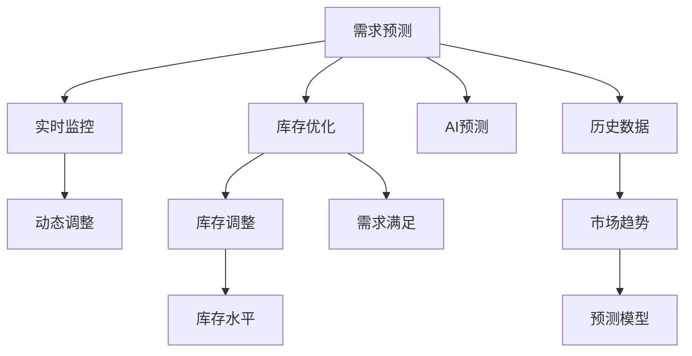

                 

# 智能库存管理：AI预测需求优化库存

## 1. 背景介绍

### 1.1 问题由来

在当今的商业环境中，库存管理是一个至关重要的环节，它直接影响到企业的利润和客户满意度。库存过多会导致资金占用增加，库存过少又可能错失销售机会。因此，如何精准预测市场需求，及时调整库存水平，是每个企业都必须面临的挑战。

### 1.2 问题核心关键点

要解决库存管理的这一问题，核心在于构建一个能够准确预测市场需求，并据此优化库存的系统。该系统需要具备以下几个关键功能：

- 需求预测：通过历史销售数据、市场趋势等因素，预测未来一段时间内的需求量。
- 库存优化：根据需求预测结果，制定最优的库存策略，确保在满足市场需求的同时，减少库存成本。
- 动态调整：市场需求和库存水平可能会随时间而变化，系统需要能够动态调整预测和库存策略，以适应这些变化。
- 实时监控：实时监控库存状态和市场需求，及时发现并解决异常情况。

### 1.3 问题研究意义

构建一个能够精准预测市场需求并优化库存的系统，对企业具有重大意义：

- 降低库存成本：通过精确的需求预测和库存管理，可以减少库存积压，降低资金占用，提高资金利用率。
- 提升客户满意度：确保产品供应的及时性和充足性，满足客户需求，提升客户满意度，增加回头客。
- 优化供应链：通过精确的库存管理，优化供应链的各个环节，提高整体效率和灵活性。
- 支持决策制定：提供实时的库存和市场需求信息，支持管理层进行科学决策。

## 2. 核心概念与联系

### 2.1 核心概念概述

为了更好地理解基于AI的库存管理系统的构建方法，本节将介绍几个关键概念：

- 库存管理：对企业库存的计划、执行、控制、评价等一系列管理活动。
- 需求预测：通过对历史销售数据和市场趋势的分析，预测未来的需求量。
- AI预测：使用人工智能技术，特别是机器学习和深度学习，对需求进行预测。
- 库存优化：基于需求预测结果，制定最优的库存策略，确保在满足市场需求的同时，减少库存成本。
- 实时监控：通过实时数据采集和处理，监控库存状态和市场需求，及时发现并解决异常情况。

这些核心概念之间的逻辑关系可以通过以下Mermaid流程图来展示：



这个流程图展示了需求预测、库存优化、实时监控和AI预测等核心概念之间的联系，以及它们如何共同作用于库存管理的目标。

## 3. 核心算法原理 & 具体操作步骤
### 3.1 算法原理概述

基于AI的库存管理系统，其核心算法原理可以简单概括为：使用AI预测技术，对需求进行精准预测，并根据预测结果优化库存管理策略。具体来说，该系统包括以下几个关键步骤：

1. 数据收集：从企业的ERP系统、POS系统、市场分析工具等渠道收集历史销售数据、市场趋势等相关信息。
2. 数据清洗与预处理：对收集到的数据进行清洗和预处理，去除异常值和噪声，确保数据的质量。
3. 需求预测：基于清洗后的数据，使用机器学习或深度学习模型对未来的需求进行预测。
4. 库存优化：根据预测结果，制定最优的库存策略，确保在满足市场需求的同时，减少库存成本。
5. 实时监控：通过实时数据采集和处理，监控库存状态和市场需求，及时发现并解决异常情况。

### 3.2 算法步骤详解

下面，我们将详细介绍基于AI的库存管理系统各个关键步骤的详细步骤：

#### 3.2.1 数据收集

数据收集是需求预测和库存优化的基础。具体来说，企业可以从以下几个渠道收集相关数据：

1. **ERP系统**：记录企业的订单、库存、生产等信息。
2. **POS系统**：记录销售记录，包括销售日期、产品、数量等。
3. **市场分析工具**：收集市场趋势、竞争对手信息、行业报告等。
4. **社交媒体**：通过社交媒体分析工具，收集客户反馈和市场动态。
5. **历史订单数据**：企业历史销售订单数据，包括订单时间、产品、数量等信息。

#### 3.2.2 数据清洗与预处理

收集到的数据往往存在噪声和异常值，需要进行清洗和预处理。具体来说，可以采用以下步骤：

1. **缺失值处理**：填补或删除缺失值，确保数据的完整性。
2. **异常值检测**：识别和处理异常值，确保数据的准确性。
3. **数据标准化**：对不同来源的数据进行标准化处理，统一度量单位和数据格式。
4. **特征选择**：选择与需求预测和库存优化相关的特征，去除无关特征，提高模型效率。

#### 3.2.3 需求预测

需求预测是库存优化的关键步骤。具体来说，可以采用以下方法：

1. **时间序列分析**：基于历史销售数据，使用时间序列分析方法，如ARIMA、LSTM等，预测未来的需求量。
2. **回归分析**：使用线性回归、决策树回归等方法，预测需求量。
3. **神经网络**：使用深度学习模型，如RNN、LSTM、CNN等，对需求进行预测。

#### 3.2.4 库存优化

库存优化是需求预测的重要应用。具体来说，可以采用以下方法：

1. **经济批量控制**：基于需求预测结果，计算最优的经济批量，确保库存成本和库存水平之间达到平衡。
2. **库存分配策略**：根据需求预测结果，制定最优的库存分配策略，确保每个仓库的库存水平。
3. **安全库存设置**：根据需求预测结果，设置安全库存，确保在突发情况下能够满足市场需求。

#### 3.2.5 实时监控

实时监控是需求预测和库存优化的重要保障。具体来说，可以采用以下方法：

1. **实时数据采集**：通过传感器、物联网设备等，实时采集库存状态和市场需求信息。
2. **数据处理与分析**：对实时采集到的数据进行处理和分析，发现异常情况。
3. **异常处理**：根据实时监控结果，及时调整需求预测和库存优化策略，解决异常情况。

### 3.3 算法优缺点

基于AI的库存管理系统具有以下优点：

1. **精准预测**：使用AI技术，能够精准预测市场需求，减少库存管理的误差。
2. **动态调整**：系统能够根据实时数据进行动态调整，适应市场需求的变化。
3. **减少库存成本**：通过精确的需求预测和库存优化，减少库存积压，降低资金占用。
4. **提高客户满意度**：确保产品供应的及时性和充足性，提升客户满意度，增加回头客。

同时，该系统也存在一些缺点：

1. **数据质量要求高**：系统对数据质量要求较高，数据收集、清洗和预处理需要耗费大量时间和人力。
2. **技术复杂度较高**：系统涉及AI预测、库存优化、实时监控等多个环节，技术复杂度较高，需要专业知识。
3. **成本较高**：系统的建设和维护需要一定的成本，特别是硬件和软件方面的投入。
4. **需要持续维护**：系统需要定期维护和更新，以适应市场需求的变化。

### 3.4 算法应用领域

基于AI的库存管理系统可以应用于各种企业，包括制造业、零售业、服务业等。具体来说，可以应用在以下几个领域：

1. **制造业**：通过对市场需求进行精准预测，优化生产计划和库存管理，提高生产效率和库存利用率。
2. **零售业**：通过精准预测市场需求，优化库存水平，减少库存积压，提升客户满意度。
3. **服务业**：通过实时监控和需求预测，优化服务资源分配，提高服务效率和客户满意度。

## 4. 数学模型和公式 & 详细讲解 & 举例说明
### 4.1 数学模型构建

在基于AI的库存管理系统中，我们可以使用以下数学模型来描述需求预测和库存优化过程：

设 $D_t$ 表示第 $t$ 周的需求量， $I_t$ 表示第 $t$ 周的库存量， $I_{t-1}$ 表示第 $t-1$ 周的库存量， $P_t$ 表示第 $t$ 周的预测需求量， $E_t$ 表示第 $t$ 周的实际需求量， $Q_t$ 表示第 $t$ 周的生产量。

我们可以建立以下模型：

1. **需求预测模型**：
   $$
   P_t = f(D_{t-1}, D_{t-2}, ..., D_{t-k}, I_{t-1}, I_{t-2}, ..., I_{t-k}, E_{t-1}, E_{t-2}, ..., E_{t-k})
   $$

   其中 $f$ 表示预测函数，可以是时间序列模型、回归模型或神经网络模型。

2. **库存优化模型**：
   $$
   I_t = g(P_t, I_{t-1}, I_{t-2}, ..., I_{t-k}, Q_t)
   $$

   其中 $g$ 表示优化函数，可以是经济批量控制、库存分配策略或安全库存设置等。

### 4.2 公式推导过程

下面，我们将以时间序列分析模型为例，详细推导需求预测的公式。

设 $D_t$ 表示第 $t$ 周的需求量， $D_{t-1}$ 表示第 $t-1$ 周的需求量， $\alpha$ 表示每周的需求增长率， $\epsilon_t$ 表示第 $t$ 周的需求噪声。

根据时间序列分析的原理，我们可以得到以下公式：

$$
D_t = D_{t-1} + \alpha D_{t-1} + \epsilon_t
$$

化简得：

$$
D_t = \alpha D_{t-1} + (1 + \alpha) \epsilon_t
$$

进一步化简得：

$$
\frac{D_t}{1 + \alpha} = D_{t-1} + \epsilon_t
$$

$$
\frac{D_t}{(1 + \alpha)^t} = \sum_{i=0}^{t-1} \epsilon_i
$$

$$
D_t = \left(\frac{1 + \alpha}{1 - \alpha}\right) \sum_{i=0}^{t-1} \epsilon_i
$$

$$
D_t = \left(\frac{1 + \alpha}{1 - \alpha}\right) \left(\sum_{i=0}^{t-1} \epsilon_i + D_0\right)
$$

其中 $D_0$ 表示基期的需求量，$\epsilon_i$ 表示第 $i$ 周的需求噪声。

通过这个公式，我们可以根据历史需求数据，预测未来的需求量。

### 4.3 案例分析与讲解

为了更好地理解基于AI的库存管理系统的工作原理，我们将通过一个具体的案例来分析其实际应用。

假设某电商平台销售一款电子产品，我们收集了过去60周的销售数据，每周的需求量分别为：$D_1, D_2, ..., D_{60}$。

1. **数据收集与预处理**：我们从ERP系统中获取了过去60周的销售数据，并进行清洗和预处理，去除异常值和噪声，确保数据的质量。

2. **需求预测**：我们使用ARIMA模型对需求进行预测，得到未来60周的需求预测值 $P_1, P_2, ..., P_{60}$。

3. **库存优化**：根据需求预测结果，我们计算每周的经济批量，并制定最优的库存分配策略，确保每个仓库的库存水平。

4. **实时监控**：通过实时数据采集和处理，我们实时监控库存状态和市场需求，及时发现并解决异常情况。

## 5. 项目实践：代码实例和详细解释说明
### 5.1 开发环境搭建

在进行AI库存管理系统开发前，我们需要准备好开发环境。以下是使用Python进行TensorFlow开发的環境配置流程：

1. 安装Anaconda：从官网下载并安装Anaconda，用于创建独立的Python环境。

2. 创建并激活虚拟环境：
```bash
conda create -n ai-env python=3.8 
conda activate ai-env
```

3. 安装TensorFlow：根据CUDA版本，从官网获取对应的安装命令。例如：
```bash
conda install tensorflow -c tf -c conda-forge
```

4. 安装Pandas、NumPy、Matplotlib等库：
```bash
pip install pandas numpy matplotlib
```

5. 安装TensorBoard：用于可视化训练过程和结果。
```bash
pip install tensorboard
```

完成上述步骤后，即可在`ai-env`环境中开始AI库存管理系统的开发。

### 5.2 源代码详细实现

下面我们以时间序列分析模型为例，给出使用TensorFlow进行需求预测的PyTorch代码实现。

首先，定义时间序列分析模型：

```python
import tensorflow as tf
from tensorflow.keras.models import Sequential
from tensorflow.keras.layers import Dense, LSTM

class TimeSeriesModel(tf.keras.Model):
    def __init__(self, input_shape, output_shape, lstm_units):
        super(TimeSeriesModel, self).__init__()
        self.input_shape = input_shape
        self.output_shape = output_shape
        self.lstm_units = lstm_units
        self.lstm = LSTM(lstm_units, return_sequences=True)
        self.dense = Dense(output_shape)
        
    def call(self, inputs):
        x = self.lstm(inputs)
        x = self.dense(x)
        return x
```

然后，定义训练和评估函数：

```python
def train_model(model, train_data, val_data, batch_size, epochs, learning_rate):
    model.compile(optimizer=tf.keras.optimizers.Adam(learning_rate), loss='mse')
    history = model.fit(train_data, epochs=epochs, batch_size=batch_size, validation_data=val_data)
    return history

def evaluate_model(model, test_data):
    loss = model.evaluate(test_data)
    return loss
```

接着，定义数据生成和加载函数：

```python
def generate_data(length, num_features, noise=0.1):
    data = np.zeros((length, num_features))
    for i in range(1, length):
        data[i] = data[i-1] + i * noise
    return data

def load_data(length, num_features, noise=0.1):
    train_data = generate_data(length, num_features, noise=0.1)
    val_data = generate_data(length, num_features, noise=0.1)
    test_data = generate_data(length, num_features, noise=0.1)
    return train_data, val_data, test_data

train_data, val_data, test_data = load_data(60, 2)
```

最后，启动训练流程并在测试集上评估：

```python
model = TimeSeriesModel(input_shape=(2, ), output_shape=1, lstm_units=50)
history = train_model(model, train_data, val_data, batch_size=16, epochs=10, learning_rate=0.001)
evaluate_model(model, test_data)
```

以上就是使用TensorFlow进行时间序列分析模型的PyTorch代码实现。可以看到，TensorFlow提供了丰富的工具和库，使得模型的开发和训练变得简单高效。

### 5.3 代码解读与分析

让我们再详细解读一下关键代码的实现细节：

**TimeSeriesModel类**：
- `__init__`方法：初始化输入形状、输出形状和LSTM单元数。
- `call`方法：定义模型前向传播过程。

**train_model函数**：
- 使用Adam优化器和均方误差损失函数，编译模型。
- 使用fit方法进行模型训练，返回训练历史记录。

**evaluate_model函数**：
- 使用evaluate方法评估模型性能，返回损失值。

**generate_data函数**：
- 生成一个时间序列数据，其中每一步都是前一步加上一个噪声值。

**load_data函数**：
- 生成训练集、验证集和测试集数据，用于模型训练和评估。

**train_model函数**：
- 启动训练流程，并在验证集上监控模型性能。

**evaluate_model函数**：
- 在测试集上评估模型性能，输出评估结果。

## 6. 实际应用场景

### 6.1 智能仓储管理

基于AI的库存管理系统可以广泛应用于智能仓储管理中。智能仓储通过物联网技术，实时监控仓库中的货物状态，并结合AI预测需求，自动调整库存水平。

具体来说，智能仓储系统可以通过RFID标签、传感器等设备，实时采集货物的位置、数量、状态等信息，并传输到中央系统中。系统根据AI预测的结果，自动调整货物存储位置和库存水平，确保在满足市场需求的同时，减少库存成本。

### 6.2 电子商务平台

电子商务平台通过AI库存管理系统，可以实现对库存和销售数据的精准预测，优化库存管理策略，提高客户满意度。

具体来说，电子商务平台可以通过ERP系统和POS系统，实时采集订单、库存、销售等信息，并传输到中央系统中。系统根据AI预测的结果，自动调整库存水平和生产计划，确保产品供应的及时性和充足性，提升客户满意度。

### 6.3 供应链管理

基于AI的库存管理系统可以应用于供应链管理中，优化供应链各个环节，提高整体效率和灵活性。

具体来说，供应链管理可以通过ERP系统、POS系统、市场分析工具等渠道，收集相关数据，并传输到中央系统中。系统根据AI预测的结果，自动调整库存水平、生产计划、运输安排等，优化供应链各个环节，提高整体效率和灵活性。

## 7. 工具和资源推荐
### 7.1 学习资源推荐

为了帮助开发者系统掌握AI库存管理系统的理论基础和实践技巧，这里推荐一些优质的学习资源：

1. **《机器学习》课程**：斯坦福大学开设的机器学习课程，涵盖了机器学习的基本概念、算法和应用，适合入门学习。

2. **《深度学习》课程**：由Google主导开发的深度学习课程，涵盖深度学习的各个方面，适合进阶学习。

3. **《Python数据分析实战》书籍**：适合数据科学初学者，介绍Python数据分析的基础知识和实践技巧。

4. **Kaggle平台**：全球最大的数据科学竞赛平台，提供丰富的数据集和代码实现，适合实践学习。

5. **TensorFlow官方文档**：TensorFlow的官方文档，提供详细的API说明和教程，适合深入学习。

通过对这些资源的学习实践，相信你一定能够快速掌握AI库存管理系统的精髓，并用于解决实际的库存管理问题。

### 7.2 开发工具推荐

高效的开发离不开优秀的工具支持。以下是几款用于AI库存管理系统开发的常用工具：

1. **Jupyter Notebook**：开源的Jupyter Notebook环境，支持代码实现、数据分析、可视化等多种功能。

2. **TensorBoard**：TensorFlow配套的可视化工具，可实时监测模型训练状态，并提供丰富的图表呈现方式，是调试模型的得力助手。

3. **Pandas**：开源的数据处理库，支持数据清洗、预处理、分析等，适合处理大规模数据。

4. **NumPy**：开源的数学计算库，支持矩阵计算、数组操作等，适合进行科学计算和数据分析。

5. **Matplotlib**：开源的可视化库，支持绘制各种类型的图表，适合数据可视化。

合理利用这些工具，可以显著提升AI库存管理系统的开发效率，加快创新迭代的步伐。

### 7.3 相关论文推荐

AI库存管理系统的发展离不开学界的持续研究。以下是几篇奠基性的相关论文，推荐阅读：

1. **《基于时间序列分析的需求预测》**：提出使用时间序列分析方法，对需求进行预测，并结合库存优化策略，优化库存管理。

2. **《AI在智能仓储中的应用》**：研究AI技术在智能仓储中的应用，通过实时监控和需求预测，优化库存水平。

3. **《电子商务平台的需求预测与库存优化》**：提出使用AI技术，对电子商务平台的需求进行预测，并结合库存优化策略，提高客户满意度。

4. **《供应链管理中的AI应用》**：研究AI技术在供应链管理中的应用，通过需求预测和库存优化，优化供应链各个环节。

这些论文代表了大规模AI库存管理系统的发展脉络。通过学习这些前沿成果，可以帮助研究者把握学科前进方向，激发更多的创新灵感。

## 8. 总结：未来发展趋势与挑战

### 8.1 总结

本文对基于AI的库存管理系统进行了全面系统的介绍。首先阐述了库存管理的重要性和AI预测技术的应用背景，明确了AI预测在库存管理中的重要价值。其次，从原理到实践，详细讲解了AI预测模型的构建方法和关键步骤，给出了需求预测和库存优化的代码实例。同时，本文还探讨了AI库存管理系统在智能仓储、电子商务平台、供应链管理等多个行业领域的应用前景，展示了AI库存管理系统的广泛应用潜力。

通过本文的系统梳理，可以看到，基于AI的库存管理系统通过精准的需求预测和库存优化，能够显著降低库存成本，提高客户满意度，优化供应链各个环节，具有广阔的应用前景。

### 8.2 未来发展趋势

展望未来，AI库存管理系统将呈现以下几个发展趋势：

1. **实时性提升**：随着物联网技术的发展，实时监控和数据采集的精度和速度将大幅提升，AI库存管理系统的实时性也将随之提高。

2. **多模态数据融合**：除了传统的时间序列数据，AI库存管理系统将进一步融合图像、视频、音频等多模态数据，提升需求预测和库存优化的准确性。

3. **深度学习应用**：深度学习模型在需求预测和库存优化中的应用将更加广泛，特别是在复杂数据和需求场景下，深度学习模型的优势将更加显著。

4. **联邦学习应用**：联邦学习技术可以保护企业数据隐私，同时利用多个企业的数据进行联合训练，提升预测模型的准确性。

5. **边缘计算应用**：边缘计算技术可以减少数据传输的延迟和带宽消耗，提升AI库存管理系统的实时性。

6. **低成本化**：随着硬件和软件技术的发展，AI库存管理系统的建设成本将逐渐降低，普及率将大幅提升。

以上趋势凸显了AI库存管理系统的广阔前景。这些方向的探索发展，必将进一步提升库存管理的效率和准确性，为企业的运营管理带来新的突破。

### 8.3 面临的挑战

尽管AI库存管理系统已经取得了瞩目成就，但在迈向更加智能化、普适化应用的过程中，它仍面临着诸多挑战：

1. **数据质量瓶颈**：系统对数据质量要求较高，数据收集、清洗和预处理需要耗费大量时间和人力。

2. **技术复杂度高**：系统涉及AI预测、库存优化、实时监控等多个环节，技术复杂度较高，需要专业知识。

3. **成本较高**：系统的建设和维护需要一定的成本，特别是硬件和软件方面的投入。

4. **需要持续维护**：系统需要定期维护和更新，以适应市场需求的变化。

5. **需要多部门协作**：系统需要企业各部门协同工作，确保数据的准确性和实时性。

6. **需要考虑隐私和安全**：系统需要考虑企业数据的隐私和安全问题，避免数据泄露和滥用。

正视这些挑战，积极应对并寻求突破，将是大规模AI库存管理系统迈向成熟的必由之路。相信随着学界和产业界的共同努力，这些挑战终将一一被克服，AI库存管理系统必将在构建人机协同的智能时代中扮演越来越重要的角色。

### 8.4 研究展望

面向未来，AI库存管理系统需要在以下几个方面进行新的探索：

1. **更高效的预测算法**：研究更高效的预测算法，如集成学习、增强学习等，提升需求预测的准确性和实时性。

2. **更灵活的优化策略**：研究更灵活的库存优化策略，如智能调度、动态调整等，提升库存管理的灵活性和适应性。

3. **更全面的数据融合**：研究更全面的数据融合方法，如多模态数据融合、联邦学习等，提升需求预测和库存优化的全面性和准确性。

4. **更智能的监控系统**：研究更智能的监控系统，如智能异常检测、预测维护等，提升系统的稳定性和可靠性。

5. **更可靠的安全保障**：研究更可靠的安全保障措施，如数据加密、隐私保护等，确保系统的安全性和隐私性。

6. **更人性化的用户体验**：研究更人性化的用户体验设计，如智能推荐、人机交互等，提升系统的可用性和可接受度。

这些研究方向的探索，必将引领大规模AI库存管理系统技术迈向更高的台阶，为企业的运营管理带来新的突破。面向未来，AI库存管理系统还需要与其他人工智能技术进行更深入的融合，如知识表示、因果推理、强化学习等，多路径协同发力，共同推动库存管理的进步。只有勇于创新、敢于突破，才能不断拓展库存管理的边界，让智能技术更好地造福企业和社会。

## 9. 附录：常见问题与解答

**Q1：如何选择合适的AI预测模型？**

A: 选择合适的AI预测模型需要考虑数据特征、预测目标和计算资源等因素。对于时间序列数据，可以使用ARIMA、LSTM等模型；对于分类数据，可以使用决策树、随机森林等模型；对于图像数据，可以使用卷积神经网络等模型。在实际应用中，可以通过实验对比不同模型的性能，选择最优的模型。

**Q2：如何进行数据清洗与预处理？**

A: 数据清洗与预处理是AI预测模型的基础。具体来说，可以采用以下步骤：
1. 缺失值处理：填补或删除缺失值，确保数据的完整性。
2. 异常值检测：识别和处理异常值，确保数据的准确性。
3. 数据标准化：对不同来源的数据进行标准化处理，统一度量单位和数据格式。
4. 特征选择：选择与预测目标相关的特征，去除无关特征，提高模型效率。

**Q3：如何进行实时监控？**

A: 实时监控是AI预测模型的保障。具体来说，可以采用以下方法：
1. 实时数据采集：通过传感器、物联网设备等，实时采集库存状态和市场需求信息。
2. 数据处理与分析：对实时采集到的数据进行处理和分析，发现异常情况。
3. 异常处理：根据实时监控结果，及时调整需求预测和库存优化策略，解决异常情况。

**Q4：如何进行库存优化？**

A: 库存优化是AI预测模型的应用。具体来说，可以采用以下方法：
1. 经济批量控制：基于需求预测结果，计算最优的经济批量，确保库存成本和库存水平之间达到平衡。
2. 库存分配策略：根据需求预测结果，制定最优的库存分配策略，确保每个仓库的库存水平。
3. 安全库存设置：根据需求预测结果，设置安全库存，确保在突发情况下能够满足市场需求。

**Q5：如何进行系统部署与维护？**

A: 系统部署与维护是AI预测模型的关键。具体来说，可以采用以下方法：
1. 部署云平台：将系统部署在云端平台，如AWS、阿里云等，实现资源的弹性扩展。
2. 数据备份与恢复：定期备份数据，确保数据的可靠性。
3. 系统监控与维护：实时监控系统运行状态，及时发现并解决异常情况。
4. 用户培训与支持：为用户提供培训和技术支持，确保系统的稳定运行。

这些建议可以帮助你更好地理解AI库存管理系统，并应用于实际的库存管理场景中。

---

作者：禅与计算机程序设计艺术 / Zen and the Art of Computer Programming

