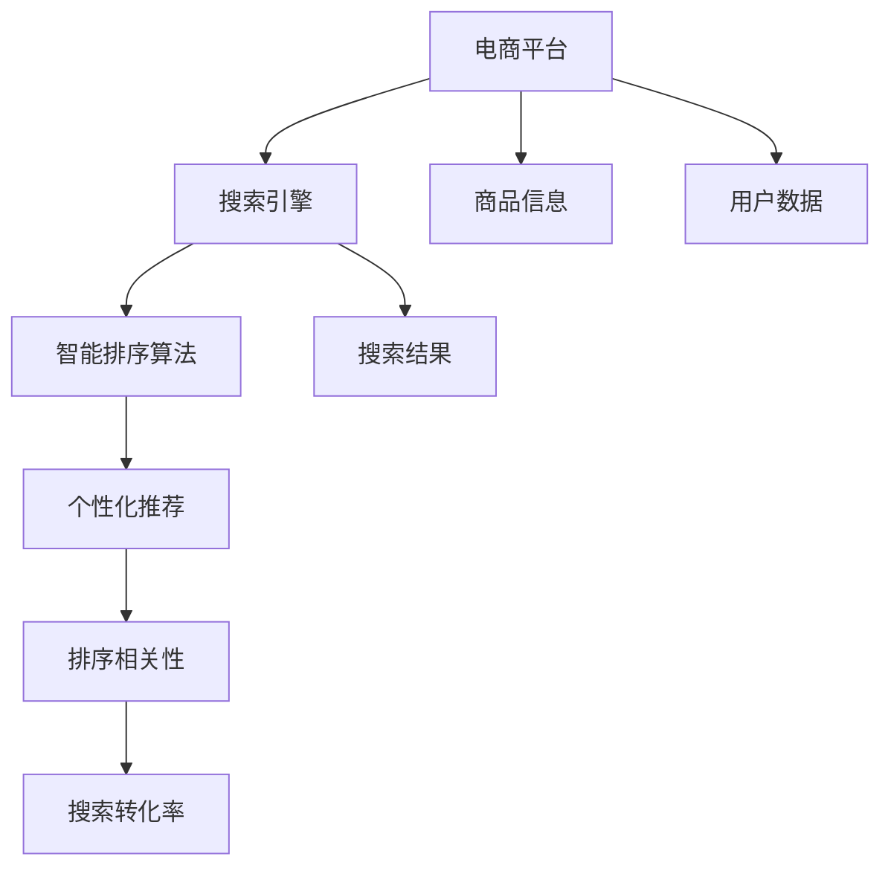

                 

## 1. 背景介绍

随着电子商务的迅猛发展，用户搜索体验的重要性愈发凸显。智能排序算法作为电商搜索系统的核心组件，其设计优劣直接影响到用户体验的满意度与转化率。本节将介绍智能排序算法在电商搜索中的应用背景，探讨其重要性及其挑战。

### 1.1 问题由来

现代电子商务平台面临着海量的商品信息与用户搜索请求。如何高效地匹配用户需求与商品信息，提高搜索相关性与用户体验，是电商搜索系统的首要目标。智能排序算法通过对用户行为、商品特征等信息的综合分析，以机器学习的方式对搜索结果进行重新排序，从而优化搜索体验。

### 1.2 问题核心关键点

智能排序算法涉及的核心概念包括：

- **电商搜索系统**：以电商平台为背景，通过搜索引擎对商品信息进行搜索与展示的系统。
- **智能排序算法**：基于用户行为和商品特征，通过算法模型对搜索结果进行优化排序。
- **个性化推荐**：利用机器学习算法，根据用户的历史行为和偏好，提供个性化的搜索结果。
- **排序相关性**：衡量搜索结果与用户查询意图的相关度，是智能排序算法的核心指标。
- **搜索转化率**：衡量搜索结果的商业价值，即用户通过搜索结果进行购买或进一步了解商品的比率。

这些概念共同构成了电商搜索系统的核心架构，指导着搜索排序算法的研发与优化。

## 2. 核心概念与联系

### 2.1 核心概念概述

为更好地理解智能排序算法，本节将介绍几个密切相关的核心概念：

- **电商平台**：包含商品信息、用户数据、交易数据等信息的在线购物平台，提供商品展示、搜索、购买等服务。
- **搜索引擎**：通过爬虫技术抓取互联网上的信息，并提供搜索、过滤、排序等功能，以辅助用户获取所需信息。
- **机器学习**：利用算法和统计模型，从数据中学习规律并做出预测或决策的领域。
- **深度学习**：机器学习的一个分支，利用神经网络模型处理复杂数据，如图像、语音、文本等。
- **排序算法**：在一定规则下对元素进行排列的算法，广泛应用于数据处理和信息检索。
- **个性化推荐**：根据用户的历史行为和偏好，动态调整搜索结果，提高用户体验。

这些核心概念之间的逻辑关系可以通过以下Mermaid流程图来展示：



这个流程图展示了一体化的电商搜索系统框架：

1. 用户通过电商平台访问商品信息，生成查询请求。
2. 搜索引擎抓取商品信息，并由智能排序算法进行排序。
3. 个性化推荐算法根据用户行为对排序结果进行调整。
4. 排序相关性指标衡量搜索结果的质量，进而影响搜索转化率。

这些概念相互关联，共同作用于电商搜索系统的运行。

## 3. 核心算法原理 & 具体操作步骤
### 3.1 算法原理概述

智能排序算法通过分析用户行为和商品特征，利用机器学习模型对搜索结果进行重新排序。其核心思想是：通过多维度特征的融合与权重调整，对用户查询进行更准确的匹配与排序，从而提升搜索相关性和用户体验。

形式化地，假设搜索任务为 $Q$，商品集合为 $I$，用户行为特征为 $U$，商品特征为 $P$。智能排序算法 $A$ 的目标是最大化搜索相关性 $R(Q,I)$，即：

$$
\max_{A} R(Q,I) = \max_{A} f(A(U,P,Q))
$$

其中 $f$ 为排序函数，$A$ 是排序算法。

### 3.2 算法步骤详解

智能排序算法主要分为以下步骤：

**Step 1: 特征提取**

- 收集用户行为特征 $U$，如浏览历史、点击记录、购买记录等。
- 提取商品特征 $P$，如价格、销量、评论等。
- 使用协同过滤、自然语言处理等方法提取查询特征 $Q$。

**Step 2: 特征融合**

- 将用户行为特征 $U$ 和商品特征 $P$ 进行融合，生成综合特征向量 $V$。
- 利用机器学习模型，如线性回归、逻辑回归、随机森林等，对特征向量 $V$ 进行处理，得到排序权重 $W$。

**Step 3: 排序计算**

- 根据排序权重 $W$ 对搜索结果进行排序，生成排序结果 $S$。
- 在排序结果中，引入个性化推荐算法，根据用户偏好对结果进行调整。

**Step 4: 评估与优化**

- 通过评估指标如平均准确率、召回率、F1值等对排序结果进行评估。
- 利用反馈机制和增量学习算法，对排序算法进行优化调整。

### 3.3 算法优缺点

智能排序算法具有以下优点：

- **个性化强**：能够根据用户行为和偏好进行个性化推荐，提高用户满意度。
- **高效性**：通过机器学习模型进行自动化排序，减少了人工干预。
- **动态优化**：能够动态调整排序策略，适应用户需求变化。

同时，该算法也存在一定的局限性：

- **数据依赖**：排序效果依赖于用户行为和商品特征数据的质量和全面性。
- **算法复杂**：模型训练和特征提取复杂度高，对硬件要求较高。
- **解释性不足**：模型决策过程复杂，难以进行解释和调试。

尽管存在这些局限性，但智能排序算法在电商搜索领域已经展示了强大的应用潜力。

### 3.4 算法应用领域

智能排序算法在电商搜索中具有广泛的应用场景，具体包括：

- **商品推荐**：根据用户浏览和购买记录，推荐相关商品。
- **搜索结果排序**：对用户搜索的关键词，根据相关性对商品进行排序。
- **广告排序**：对搜索结果中的广告进行排序，提高广告点击率。
- **个性化广告投放**：根据用户行为特征，动态调整广告投放策略。
- **用户画像构建**：利用用户行为数据，构建详细的用户画像，辅助产品开发和市场策略。

除了这些具体应用，智能排序算法还广泛应用于个性化推荐、社交网络分析等诸多领域，为各行业带来了新的数据价值和应用前景。

## 4. 数学模型和公式 & 详细讲解
### 4.1 数学模型构建

本节将使用数学语言对智能排序算法的核心模型进行详细描述。

假设用户行为特征为 $U=\{u_1,u_2,\cdots,u_n\}$，商品特征为 $P=\{p_1,p_2,\cdots,p_m\}$，查询特征为 $Q$。智能排序算法的目标是通过机器学习模型，将用户行为特征 $U$ 和商品特征 $P$ 映射到排序权重 $W=\{w_1,w_2,\cdots,w_k\}$，最终生成排序结果 $S=\{s_1,s_2,\cdots,s_n\}$。

在数学上，可以定义以下模型：

$$
W = F(U,P)
$$

其中 $F$ 为特征融合函数，将用户行为特征和商品特征映射到排序权重。

排序结果 $S$ 可以表示为：

$$
S = M(Q,W)
$$

其中 $M$ 为排序函数，利用排序权重对搜索结果进行重新排序。

### 4.2 公式推导过程

以下我们以线性回归模型为例，推导智能排序算法的核心公式。

假设线性回归模型为：

$$
w_i = \alpha + \beta_1 u_1 + \beta_2 u_2 + \cdots + \beta_n u_n + \gamma_1 p_1 + \gamma_2 p_2 + \cdots + \gamma_m p_m
$$

其中 $w_i$ 为排序权重，$\alpha, \beta_j, \gamma_k$ 为模型参数。

将排序权重 $W$ 带入排序函数 $M$，得到排序结果：

$$
s_i = \phi(w_1,w_2,\cdots,w_k)
$$

其中 $\phi$ 为排序函数，$w_1,w_2,\cdots,w_k$ 为排序权重向量。

### 4.3 案例分析与讲解

考虑一个简单的电商搜索示例，用户搜索“T恤”，排序算法需从数千件商品中匹配并排序。假设用户历史行为特征为浏览次数、点击次数、购买次数，商品特征为价格、销量、评价，查询特征为“T恤”。

特征融合过程为：

$$
w_i = \alpha + \beta_1 u_1 + \beta_2 u_2 + \gamma_1 p_1 + \gamma_2 p_2
$$

其中 $u_1$ 表示浏览次数，$u_2$ 表示点击次数，$p_1$ 表示价格，$p_2$ 表示销量。

排序结果 $S$ 可以表示为：

$$
S = \phi(w_1,w_2,\cdots,w_k)
$$

根据排序算法，可以得到排序结果，如按照价格从低到高排序的商品列表。

## 5. 项目实践：代码实例和详细解释说明
### 5.1 开发环境搭建

在进行智能排序算法开发前，需要先搭建好开发环境。以下是使用Python进行TensorFlow开发的环境配置流程：

1. 安装Anaconda：从官网下载并安装Anaconda，用于创建独立的Python环境。

2. 创建并激活虚拟环境：
```bash
conda create -n tensorflow-env python=3.8 
conda activate tensorflow-env
```

3. 安装TensorFlow：根据CUDA版本，从官网获取对应的安装命令。例如：
```bash
conda install tensorflow tensorflow-gpu -c conda-forge
```

4. 安装TensorBoard：
```bash
pip install tensorboard
```

5. 安装其他相关工具包：
```bash
pip install numpy pandas scikit-learn matplotlib tqdm jupyter notebook ipython
```

完成上述步骤后，即可在`tensorflow-env`环境中开始项目实践。

### 5.2 源代码详细实现

下面以线性回归模型为例，给出使用TensorFlow进行智能排序算法的Python代码实现。

首先，定义数据预处理函数：

```python
import tensorflow as tf
import numpy as np

def load_data(filename):
    with open(filename, 'r') as f:
        lines = f.readlines()
        X = []
        y = []
        for line in lines:
            line = line.strip().split(',')
            X.append([int(i) for i in line[:-1]])
            y.append(int(line[-1]))
        X = np.array(X)
        y = np.array(y)
        return X, y
```

然后，定义模型参数和输入数据：

```python
X_train, y_train = load_data('train.txt')
X_test, y_test = load_data('test.txt')
X = tf.placeholder(tf.float32, [None, len(X_train[0])])
y = tf.placeholder(tf.int32, [None])
```

接着，定义模型：

```python
W = tf.Variable(tf.zeros([len(X_train[0]), 1]))
b = tf.Variable(tf.zeros([1]))
alpha = tf.Variable(tf.zeros([1]))
beta = tf.Variable(tf.zeros([len(X_train[0])]))
gamma = tf.Variable(tf.zeros([len(X_train[0])]))
theta = tf.matmul(X, tf.concat((W, alpha, beta, gamma), axis=1))
y_pred = tf.nn.sigmoid(theta)
loss = tf.reduce_mean(tf.nn.sigmoid_cross_entropy_with_logits(labels=y, logits=y_pred))
optimizer = tf.train.GradientDescentOptimizer(learning_rate=0.1)
train_op = optimizer.minimize(loss)
```

最后，进行模型训练和评估：

```python
with tf.Session() as sess:
    sess.run(tf.global_variables_initializer())
    for i in range(1000):
        _, loss_val = sess.run([train_op, loss], feed_dict={X: X_train, y: y_train})
        if i % 100 == 0:
            print('Step:', i, 'Loss:', loss_val)
    y_pred_val = sess.run(y_pred, feed_dict={X: X_test})
    y_pred_val = np.round(y_pred_val).astype(int)
    accuracy = np.mean(y_pred_val == y_test)
    print('Accuracy:', accuracy)
```

以上就是使用TensorFlow对智能排序算法进行建模的完整代码实现。可以看到，通过TensorFlow的API，我们轻松构建了一个简单的线性回归模型，并对数据进行了训练和评估。

### 5.3 代码解读与分析

让我们再详细解读一下关键代码的实现细节：

**数据加载函数**：
- 读取训练和测试数据文件，将数据解析为数值数组。

**模型参数定义**：
- 定义模型的权重和偏置项，包括线性回归模型的权重矩阵 $W$ 和截距项 $b$，以及特征向量的权重矩阵 $\beta$ 和 $\gamma$。

**模型定义**：
- 使用TensorFlow的API定义线性回归模型，计算预测值 $y_{pred}$ 和损失函数 $loss$。
- 选择梯度下降优化器，并定义训练操作 $train_op$。

**模型训练与评估**：
- 在会话中初始化变量，开始训练。
- 通过迭代更新模型参数，计算并输出损失值。
- 在每个epoch结束后，计算并输出预测准确率。

可以看到，TensorFlow提供了简洁易用的API，使得模型的搭建、训练和评估变得非常简单。通过TensorFlow，我们可以轻松实现各种复杂模型的构建和优化。

当然，工业级的系统实现还需考虑更多因素，如模型的保存和部署、超参数的自动搜索、更灵活的任务适配层等。但核心的排序算法基本与此类似。

## 6. 实际应用场景
### 6.1 智能推荐系统

智能排序算法在智能推荐系统中有着广泛的应用。推荐系统通过分析用户的历史行为和偏好，为用户推荐可能感兴趣的商品。排序算法通过优化推荐结果，提升用户体验和推荐效果。

在技术实现上，推荐系统通常使用协同过滤、基于内容的推荐等方法，收集用户行为和商品特征数据。在微调排序算法时，可以结合推荐系统的整体框架，优化排序策略，提升推荐相关性和准确率。

### 6.2 广告投放系统

广告投放系统通过排序算法对搜索结果中的广告进行排序，提高广告的点击率和转化率。智能排序算法可以分析用户行为和广告特征，将最合适的广告展示给用户，提高广告效果。

在广告投放系统中，通常使用CTR预估模型对广告点击率进行预测，结合排序算法，优化广告排序策略，最大化广告收益。同时，广告投放系统还需要考虑用户的隐私和数据保护，确保排序算法的公平性和透明性。

### 6.3 搜索引擎优化

搜索引擎优化(Search Engine Optimization, SEO)通过优化搜索结果，提升用户点击率和页面停留时间。排序算法通过分析用户查询和网页特征，优化搜索结果排序，提升搜索引擎的搜索效果。

在SEO优化中，通常使用关键词优化、页面质量评估等技术，提升搜索结果的相关性和质量。排序算法可以结合这些技术，优化搜索结果排序，提升用户体验和搜索转化率。

### 6.4 未来应用展望

随着智能排序算法的发展，其在更多领域的应用前景将逐步显现：

1. **金融科技**：在金融交易、风险评估等领域，智能排序算法可以通过优化搜索结果，提升用户决策效率和交易安全。
2. **医疗健康**：在医疗查询、健康咨询等领域，智能排序算法可以通过优化搜索结果，提升用户健康意识和医疗服务的可及性。
3. **教育培训**：在在线教育、职业培训等领域，智能排序算法可以通过优化搜索结果，提升用户学习体验和效果。
4. **工业制造**：在工业自动化、智能制造等领域，智能排序算法可以通过优化搜索结果，提升生产效率和产品品质。

随着技术的不断进步，智能排序算法将在更多领域发挥重要作用，推动社会生产力的提升和智能化水平的提升。

## 7. 工具和资源推荐
### 7.1 学习资源推荐

为了帮助开发者系统掌握智能排序算法的理论基础和实践技巧，这里推荐一些优质的学习资源：

1. **《深度学习入门》系列博文**：由大模型技术专家撰写，深入浅出地介绍了深度学习原理和应用，包括智能排序算法等前沿话题。

2. **Coursera《Deep Learning Specialization》课程**：由深度学习领域的权威专家Andrew Ng授课，涵盖深度学习的理论和实践，适合初学者和进阶学习者。

3. **《TensorFlow实战Google深度学习框架》书籍**：TensorFlow的官方教程，详细介绍了TensorFlow的使用方法和最佳实践，适合TensorFlow的初学者和中级开发者。

4. **Kaggle数据科学竞赛**：Kaggle平台提供了大量数据集和竞赛任务，开发者可以通过实践学习如何应用智能排序算法解决实际问题。

5. **GitHub开源项目**：GitHub上存在大量智能排序算法的开源项目，开发者可以通过阅读和学习这些项目，掌握智能排序算法的实现细节。

通过对这些资源的学习实践，相信你一定能够快速掌握智能排序算法的精髓，并用于解决实际的NLP问题。

### 7.2 开发工具推荐

高效的开发离不开优秀的工具支持。以下是几款用于智能排序算法开发的常用工具：

1. TensorFlow：由Google主导开发的开源深度学习框架，生产部署方便，适合大规模工程应用。提供了丰富的API和工具，方便开发者进行模型构建和优化。

2. PyTorch：基于Python的开源深度学习框架，灵活动态的计算图，适合快速迭代研究。

3. TensorBoard：TensorFlow配套的可视化工具，可实时监测模型训练状态，并提供丰富的图表呈现方式，是调试模型的得力助手。

4. Keras：高层次的深度学习API，基于TensorFlow等底层框架，提供了简单易用的接口，适合初学者快速上手。

5. Jupyter Notebook：强大的交互式开发环境，支持Python、R等语言，方便开发者进行数据处理、模型训练和结果展示。

合理利用这些工具，可以显著提升智能排序算法的开发效率，加快创新迭代的步伐。

### 7.3 相关论文推荐

智能排序算法的研究源于学界的持续研究。以下是几篇奠基性的相关论文，推荐阅读：

1. **AdaBoost: A New Learning Algorithm**：提出了AdaBoost算法，通过集成学习提升模型精度，广泛应用于分类和排序任务。

2. **TensorFlow: A System for Large-Scale Machine Learning**：介绍了TensorFlow的架构和应用，展示了其在深度学习中的强大能力。

3. **Hierarchical Probabilistic Hierarchical Clustering**：提出了一种基于层次聚类的排序算法，应用于文档排序和推荐系统中。

4. **Graph-based Ranking for Information Retrieval**：探讨了基于图论的排序算法，应用于搜索引擎和推荐系统中。

5. **Deep Neural Networks for Ad Ranking**：使用深度神经网络优化广告排序算法，展示了深度学习在广告推荐中的应用潜力。

这些论文代表了大语言模型微调技术的发展脉络。通过学习这些前沿成果，可以帮助研究者把握学科前进方向，激发更多的创新灵感。

## 8. 总结：未来发展趋势与挑战
### 8.1 总结

本文对智能排序算法在电商搜索中的应用进行了全面系统的介绍。首先阐述了智能排序算法的背景和重要性，明确了排序算法在电商搜索系统中的核心地位。其次，从原理到实践，详细讲解了排序算法的数学模型和核心步骤，给出了排序算法开发的完整代码实例。同时，本文还广泛探讨了排序算法在智能推荐、广告投放、搜索引擎优化等多个领域的应用前景，展示了排序算法的巨大潜力。此外，本文精选了排序算法的各类学习资源，力求为读者提供全方位的技术指引。

通过本文的系统梳理，可以看到，智能排序算法在电商搜索系统中发挥着关键作用，显著提升了用户的搜索体验和转化率。未来，伴随排序算法的不断演进，其应用领域将进一步拓展，成为各大行业智能化升级的重要工具。

### 8.2 未来发展趋势

展望未来，智能排序算法将呈现以下几个发展趋势：

1. **算法复杂度提升**：随着深度学习和大数据技术的发展，排序算法的复杂度将进一步提升，能够处理更复杂的用户行为和商品特征数据。

2. **实时性要求提高**：电商搜索系统需要实时响应用户查询，排序算法需要具备高效的计算和存储能力，支持实时排序。

3. **跨领域融合**：智能排序算法将与其他人工智能技术，如自然语言处理、计算机视觉等进行更深入的融合，提升综合排序效果。

4. **数据隐私保护**：随着数据隐私和安全的重视程度提升，排序算法需要设计更完善的隐私保护机制，确保用户数据的安全。

5. **模型解释性增强**：为了增强用户信任，排序算法的模型需要具备更高的解释性和可解释性，方便用户理解其决策逻辑。

6. **多模态数据应用**：排序算法将更多地应用多模态数据，如文本、图像、视频等，提供更加丰富和全面的排序服务。

以上趋势凸显了智能排序算法的广阔前景。这些方向的探索发展，必将进一步提升电商搜索系统的性能和应用范围，为各行业带来新的数据价值和应用前景。

### 8.3 面临的挑战

尽管智能排序算法已经取得了显著成效，但在迈向更加智能化、普适化应用的过程中，其面临的挑战仍不可忽视：

1. **数据质量问题**：排序算法的效果高度依赖于数据的质量和全面性，缺乏全面、高质数据将直接影响排序效果。

2. **计算资源消耗**：排序算法往往需要处理大量的数据和计算，对硬件资源的要求较高，计算成本较高。

3. **模型复杂性**：复杂的排序算法模型难以调试和优化，模型的训练和部署需要较高的技术门槛。

4. **公平性和透明性**：排序算法需要确保结果的公平性和透明性，避免对特定用户或群体的歧视。

5. **用户隐私保护**：排序算法需要设计完善的隐私保护机制，确保用户数据的隐私和安全。

6. **实时性问题**：实时排序需要高效的计算和存储支持，如何在保证排序效果的同时提升实时性，是重要的优化方向。

正视这些挑战，积极应对并寻求突破，将使智能排序算法更好地应用于电商搜索系统，提升用户体验和转化率。

### 8.4 研究展望

面对智能排序算法所面临的诸多挑战，未来的研究需要在以下几个方面寻求新的突破：

1. **数据增强与预处理**：通过数据增强和预处理技术，提高数据的质量和多样性，提升排序算法的泛化能力。

2. **模型压缩与优化**：开发更高效的模型压缩和优化算法，提升模型的计算效率和存储效率。

3. **多模态数据融合**：研究多模态数据的融合方法，提升排序算法的综合排序效果。

4. **模型解释性与公平性**：设计更可解释和公平的模型，增强用户的信任和接受度。

5. **隐私保护技术**：研究隐私保护技术，如差分隐私、联邦学习等，确保用户数据的隐私和安全。

6. **实时排序算法**：研究实时排序算法，提升排序系统的响应速度和稳定性。

这些研究方向的探索，必将引领智能排序算法迈向更高的台阶，为电商搜索系统带来更好的用户体验和更高的商业价值。

## 9. 附录：常见问题与解答

**Q1：如何设计智能排序算法？**

A: 设计智能排序算法需要综合考虑用户行为和商品特征。首先收集和预处理数据，然后选择合适的机器学习模型，进行特征融合和排序计算。在模型训练过程中，需要不断优化模型参数和算法策略，最终生成满足业务需求的排序算法。

**Q2：智能排序算法的训练和优化方法？**

A: 智能排序算法的训练通常采用监督学习或无监督学习方法，如线性回归、逻辑回归、神经网络等。优化方法包括梯度下降、Adam、Adagrad等，选择合适的学习率和优化器对模型进行训练和优化。

**Q3：智能排序算法在实际应用中如何提升效果？**

A: 智能排序算法可以通过数据增强、特征融合、模型优化等手段提升效果。在实际应用中，需要根据业务需求和数据特点，不断调整算法参数和优化策略，以达到最佳效果。

**Q4：智能排序算法的未来发展方向？**

A: 智能排序算法的未来发展方向包括算法复杂度提升、实时性要求提高、跨领域融合、数据隐私保护、模型解释性增强、多模态数据应用等。这些方向的研究和应用将进一步提升电商搜索系统的性能和用户体验。

**Q5：智能排序算法的应用场景？**

A: 智能排序算法广泛应用于智能推荐、广告投放、搜索引擎优化等领域。在实际应用中，可以根据具体业务需求，选择合适的排序算法，提升搜索相关性和用户体验。

作者：禅与计算机程序设计艺术 / Zen and the Art of Computer Programming

