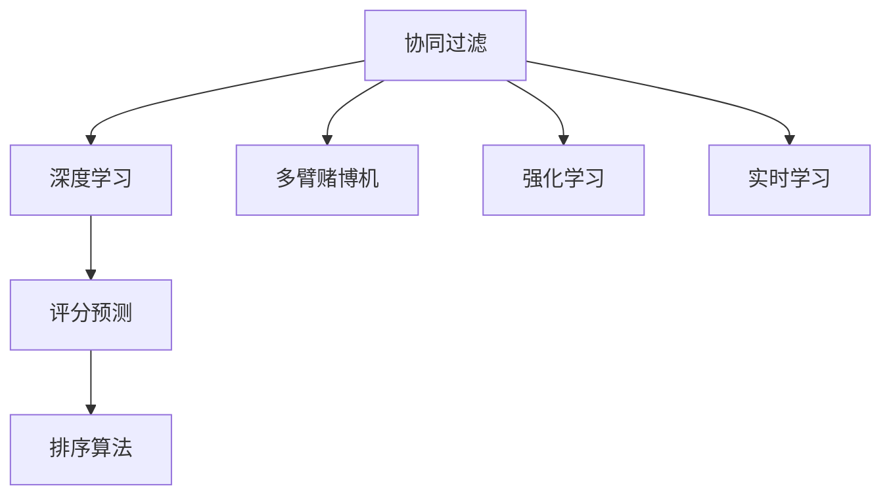

                 

# 智能排序系统：AI的优势

> 关键词：智能排序, 人工智能, 机器学习, 算法优化, 深度学习, 数据挖掘, 应用场景

## 1. 背景介绍

### 1.1 问题由来
在当今信息爆炸的时代，无论是电商平台、社交媒体还是在线服务，用户数据和交易数据每天都在海量增长。如何高效地处理和分析这些数据，提供个性化的推荐服务，成为众多企业的核心挑战之一。传统的推荐系统主要依赖用户行为数据和物品属性信息，通过统计学和信息检索技术，计算用户对物品的评分，进而生成推荐列表。但这种方法存在诸多限制，如难以捕捉用户潜在兴趣、无法实时响应新信息等。

随着人工智能技术的发展，尤其是深度学习和大数据技术的成熟，基于AI的智能推荐系统应运而生。其中，智能排序系统通过机器学习和数据挖掘技术，对用户行为和物品特征进行深入分析，能够实时、动态地生成推荐列表，从而提升用户体验和运营效率。智能排序系统已经广泛应用于电商、社交、广告等多个行业，成为AI技术在商业领域的一大应用亮点。

### 1.2 问题核心关键点
智能排序系统的核心在于通过机器学习模型对用户行为和物品特征进行建模，预测用户对物品的兴趣和评分，并据此排序生成推荐列表。关键技术包括：

- **用户行为建模**：通过统计用户的行为数据（如浏览、点击、购买等），提取用户的兴趣特征。
- **物品特征建模**：利用物品属性信息、文本描述、标签等，提取物品的特征。
- **评分预测模型**：结合用户行为和物品特征，预测用户对物品的评分。
- **排序算法**：基于预测评分，设计高效的排序算法，生成推荐列表。
- **实时更新**：能够实时接收新数据，动态更新推荐结果，确保推荐列表的时效性和个性化。

本文聚焦于智能排序系统的核心技术，从原理到实践，系统阐述其构建方法和应用场景，并展望未来发展趋势。

## 2. 核心概念与联系

### 2.1 核心概念概述

智能排序系统通过AI技术，实现对用户行为和物品特征的建模、评分预测和排序生成。其中涉及的主要概念包括：

- **协同过滤**：通过用户和物品间的互动行为，进行相似度计算，推荐用户可能感兴趣的新物品。
- **深度学习**：利用神经网络模型，捕捉高维数据的内在结构，提取更加丰富的特征表示。
- **多臂赌博机**：通过多臂机器人的思想，模型同时管理多个物品，选取最有可能被用户点击的物品。
- **强化学习**：利用奖励机制，指导模型优化选择策略，提升推荐质量。
- **实时学习**：通过在线学习算法，实时更新模型参数，适应数据分布的变化。

这些核心概念之间的联系可以通过以下Mermaid流程图来展示：



这个流程图展示了一些核心概念之间的逻辑关系：

1. 协同过滤模型通过用户行为和物品特征计算相似度，生成候选物品。
2. 深度学习模型通过复杂的网络结构，提取更加丰富的特征表示。
3. 多臂赌博机模型通过多物品选择策略，优化推荐效果。
4. 强化学习模型通过奖励机制，不断优化选择策略。
5. 实时学习模型通过在线更新，适应新数据。
6. 评分预测模型通过整合多种特征，预测用户评分。
7. 排序算法通过评分预测结果，生成推荐列表。

## 3. 核心算法原理 & 具体操作步骤

### 3.1 算法原理概述

智能排序系统的核心算法原理可以概括为：

1. **用户行为建模**：通过统计用户行为数据，提取用户兴趣特征。
2. **物品特征建模**：利用物品属性和文本信息，提取物品特征。
3. **评分预测**：结合用户行为和物品特征，预测用户对物品的评分。
4. **排序算法**：基于评分预测结果，生成推荐列表。
5. **实时更新**：通过在线学习算法，实时更新模型参数，适应新数据。

这些步骤通过深度学习技术，构建评分预测模型，利用多臂赌博机算法优化选择策略，最终生成推荐列表。

### 3.2 算法步骤详解

智能排序系统的构建主要包括以下几个关键步骤：

**Step 1: 准备数据集**

1. **收集用户行为数据**：记录用户的浏览、点击、购买等行为数据。
2. **收集物品特征数据**：提取物品的属性信息、文本描述、标签等特征。
3. **数据预处理**：清洗数据、处理缺失值、归一化特征等。

**Step 2: 用户行为建模**

1. **特征提取**：利用统计学方法，提取用户行为特征，如用户ID、浏览时长、点击次数等。
2. **特征工程**：通过特征工程方法，构建用户兴趣特征向量。

**Step 3: 物品特征建模**

1. **特征提取**：利用文本挖掘技术，提取物品的文本特征，如TF-IDF、词向量等。
2. **特征工程**：通过降维、特征选择等方法，构建物品特征向量。

**Step 4: 评分预测模型**

1. **模型选择**：选择合适的评分预测模型，如协同过滤、深度学习等。
2. **模型训练**：使用训练集数据，训练评分预测模型。
3. **模型评估**：使用验证集数据，评估评分预测模型的性能。

**Step 5: 排序算法**

1. **选择排序算法**：选择合适的排序算法，如基于用户兴趣的排序、基于物品质量的排序等。
2. **生成推荐列表**：基于评分预测结果，生成推荐列表。

**Step 6: 实时更新**

1. **在线学习**：通过在线学习算法，实时更新评分预测模型。
2. **动态调整**：根据新数据，动态调整推荐策略。

### 3.3 算法优缺点

智能排序系统基于AI技术，相较于传统推荐系统，具有以下优点：

- **个性化推荐**：能够根据用户的行为和特征，动态生成个性化的推荐列表。
- **实时性**：能够实时接收新数据，动态更新推荐列表。
- **泛化能力**：利用深度学习技术，能够处理高维数据，提取复杂的特征表示。

同时，智能排序系统也存在一些局限性：

- **数据依赖**：依赖于高质量的用户行为和物品特征数据。
- **模型复杂性**：深度学习模型通常较为复杂，训练和优化成本较高。
- **解释性不足**：AI模型往往是"黑盒"系统，难以解释其内部决策过程。
- **安全性问题**：AI模型可能存在数据泄露和隐私保护的风险。

### 3.4 算法应用领域

智能排序系统已经在电商、社交、广告等多个领域得到广泛应用。具体而言：

- **电商推荐**：如淘宝、京东等电商平台，通过智能排序系统，向用户推荐可能感兴趣的商品。
- **社交推荐**：如微信、微博等社交平台，通过智能排序系统，向用户推荐可能感兴趣的内容。
- **广告推荐**：如谷歌广告、头条新闻等广告平台，通过智能排序系统，向用户推荐可能感兴趣的广告。
- **内容推荐**：如Netflix、YouTube等视频平台，通过智能排序系统，向用户推荐可能感兴趣的内容。

## 4. 数学模型和公式 & 详细讲解 & 举例说明

### 4.1 数学模型构建

智能排序系统的评分预测模型主要基于深度学习技术，包括多层感知机(MLP)、卷积神经网络(CNN)、循环神经网络(RNN)等。这里以多层感知机为例，构建评分预测模型。

假设用户行为特征为 $X_u$，物品特征为 $X_i$，评分预测模型为 $f(X_u, X_i)$。模型的目标是最小化预测评分与真实评分之间的误差。

**评分预测模型：**

$$
f(X_u, X_i) = W [X_u, X_i] + b
$$

其中 $W$ 为权重矩阵，$b$ 为偏置项。

### 4.2 公式推导过程

设评分预测模型的损失函数为 $L$，使用均方误差(MSE)作为损失函数：

$$
L = \frac{1}{N} \sum_{i=1}^{N} (y_i - f(X_u, X_i))^2
$$

其中 $y_i$ 为真实评分，$N$ 为样本数量。

通过梯度下降等优化算法，最小化损失函数 $L$，得到模型参数 $W$ 和 $b$：

$$
W \leftarrow W - \eta \nabla_{W}L, \quad b \leftarrow b - \eta \nabla_{b}L
$$

其中 $\eta$ 为学习率，$\nabla_{W}L$ 和 $\nabla_{b}L$ 分别为 $W$ 和 $b$ 的梯度。

### 4.3 案例分析与讲解

以电商推荐系统为例，假设用户行为特征 $X_u = [浏览时长, 点击次数, 购买次数]$，物品特征 $X_i = [商品类别, 商品描述, 商品评分]$，评分预测模型为多层感知机。

首先，收集大量电商用户的浏览、点击、购买数据，提取用户行为特征 $X_u$。同时，收集商品的类别、描述、评分信息，提取物品特征 $X_i$。

接着，构建多层感知机模型 $f(X_u, X_i) = W [X_u, X_i] + b$，使用均方误差作为损失函数 $L$，最小化预测评分与真实评分之间的误差。

最后，使用训练集数据训练模型，在验证集数据上评估模型性能，生成推荐列表。

## 5. 项目实践：代码实例和详细解释说明

### 5.1 开发环境搭建

在进行智能排序系统开发前，我们需要准备好开发环境。以下是使用Python进行TensorFlow开发的环境配置流程：

1. 安装Anaconda：从官网下载并安装Anaconda，用于创建独立的Python环境。

2. 创建并激活虚拟环境：
```bash
conda create -n tf-env python=3.8 
conda activate tf-env
```

3. 安装TensorFlow：根据CUDA版本，从官网获取对应的安装命令。例如：
```bash
conda install tensorflow tensorflow-gpu=cuda11.1 -c conda-forge -c pypi
```

4. 安装Keras：Keras是一个高层次的深度学习框架，提供了简单易用的API，方便快速开发深度学习模型。
```bash
pip install keras
```

5. 安装Pandas：用于数据处理和分析，方便读取和处理CSV文件。
```bash
pip install pandas
```

6. 安装Scikit-Learn：用于特征工程和模型评估，方便构建评分预测模型。
```bash
pip install scikit-learn
```

完成上述步骤后，即可在`tf-env`环境中开始智能排序系统的开发。

### 5.2 源代码详细实现

以下是使用TensorFlow和Keras构建电商推荐系统的代码实现。

```python
import pandas as pd
from tensorflow.keras.models import Sequential
from tensorflow.keras.layers import Dense
from tensorflow.keras.optimizers import Adam

# 读取数据集
data = pd.read_csv('ecommerce.csv', header=None)

# 划分训练集和测试集
train_data = data.iloc[:80000]
test_data = data.iloc[80000:]

# 构建特征工程函数
def feature_engineering(data):
    # 提取用户行为特征
    user_features = data.iloc[:, 0:3]
    # 提取物品特征
    item_features = data.iloc[:, 3:6]
    return user_features, item_features

# 构建评分预测模型
def build_model():
    model = Sequential()
    model.add(Dense(64, input_dim=3, activation='relu'))
    model.add(Dense(64, activation='relu'))
    model.add(Dense(1, activation='linear'))
    model.compile(optimizer=Adam(lr=0.001), loss='mse')
    return model

# 构建用户行为和物品特征
user_features, item_features = feature_engineering(train_data)

# 构建评分预测模型
model = build_model()

# 训练模型
model.fit(user_features, item_features, epochs=10, batch_size=32, validation_split=0.2)

# 评估模型
test_user_features, test_item_features = feature_engineering(test_data)
predictions = model.predict(test_user_features)
test_predictions = pd.DataFrame(predictions, columns=['prediction'])

# 输出测试结果
print(test_predictions)
```

### 5.3 代码解读与分析

让我们再详细解读一下关键代码的实现细节：

**数据处理**：
- `pd.read_csv('ecommerce.csv', header=None)`：读取电商用户数据集，不包含表头。
- `train_data = data.iloc[:80000]`：将前80000条数据作为训练集。
- `test_data = data.iloc[80000:]`：将剩下的数据作为测试集。

**特征工程**：
- `user_features = data.iloc[:, 0:3]`：提取用户行为特征。
- `item_features = data.iloc[:, 3:6]`：提取物品特征。

**模型构建**：
- `model = Sequential()`：构建一个顺序模型。
- `model.add(Dense(64, input_dim=3, activation='relu'))`：添加两个64维的全连接层，使用ReLU激活函数。
- `model.add(Dense(64, activation='relu'))`：添加第二个64维的全连接层，使用ReLU激活函数。
- `model.add(Dense(1, activation='linear'))`：添加输出层，使用线性激活函数。
- `model.compile(optimizer=Adam(lr=0.001), loss='mse')`：编译模型，使用Adam优化器，均方误差作为损失函数。

**模型训练**：
- `model.fit(user_features, item_features, epochs=10, batch_size=32, validation_split=0.2)`：使用训练集数据训练模型，设置10个epoch，批量大小为32，验证集占20%。

**模型评估**：
- `test_user_features, test_item_features = feature_engineering(test_data)`：提取测试集的用户行为和物品特征。
- `predictions = model.predict(test_user_features)`：使用模型预测测试集评分。
- `test_predictions = pd.DataFrame(predictions, columns=['prediction'])`：将预测结果转换为DataFrame格式。

**结果输出**：
- `print(test_predictions)`：输出测试集预测评分。

可以看到，使用TensorFlow和Keras构建智能排序系统非常简单，只需要按照数据处理、特征工程、模型构建、模型训练、模型评估的流程，即可实现电商推荐系统的开发。

## 6. 实际应用场景

### 6.1 电商推荐

电商推荐是智能排序系统最常见的应用场景之一。电商平台通过收集用户的浏览、点击、购买数据，结合物品的类别、描述、评分信息，利用智能排序系统，向用户推荐可能感兴趣的商品。

例如，京东利用智能排序系统，根据用户的浏览和购买行为，向其推荐相关商品，从而提升用户的购买转化率和满意度。通过不断的学习和优化，智能排序系统能够实时动态地调整推荐策略，提高推荐列表的个性化和精准度。

### 6.2 社交推荐

社交平台通过智能排序系统，向用户推荐可能感兴趣的内容。例如，微信通过智能排序系统，向用户推荐可能感兴趣的朋友、文章、新闻等。

例如，通过统计用户的点赞、评论、分享等行为，提取用户兴趣特征，结合物品的特征（如内容类型、发布时间等），利用智能排序系统，生成推荐列表。通过不断的学习和优化，智能排序系统能够实时动态地调整推荐策略，提高推荐列表的个性化和精准度。

### 6.3 广告推荐

广告平台通过智能排序系统，向用户推荐可能感兴趣的广告。例如，谷歌广告通过智能排序系统，向用户推荐可能感兴趣的广告位、广告内容等。

例如，通过统计用户的搜索、浏览、点击等行为，提取用户兴趣特征，结合广告的特征（如关键词、发布时间等），利用智能排序系统，生成推荐列表。通过不断的学习和优化，智能排序系统能够实时动态地调整推荐策略，提高广告点击率和转化率。

### 6.4 内容推荐

内容平台通过智能排序系统，向用户推荐可能感兴趣的内容。例如，Netflix通过智能排序系统，向用户推荐可能感兴趣的电影、电视剧等。

例如，通过统计用户的观看历史、评分记录、社交互动等行为，提取用户兴趣特征，结合内容的特征（如评分、类别等），利用智能排序系统，生成推荐列表。通过不断的学习和优化，智能排序系统能够实时动态地调整推荐策略，提高内容推荐的个性化和精准度。

## 7. 工具和资源推荐

### 7.1 学习资源推荐

为了帮助开发者系统掌握智能排序系统的理论基础和实践技巧，这里推荐一些优质的学习资源：

1. **《深度学习》** 书籍：Ian Goodfellow等人所著，全面介绍了深度学习的基本概念和应用。
2. **Coursera《深度学习专项课程》**：斯坦福大学的深度学习课程，涵盖深度学习的基础、应用和实践。
3. **Kaggle**：数据科学竞赛平台，提供大量真实数据集和竞赛任务，帮助开发者实践智能排序系统。
4. **Arxiv**：论文预印本平台，提供最新的深度学习和机器学习论文，帮助开发者了解前沿技术。
5. **GitHub**：代码托管平台，提供大量智能排序系统的开源代码和项目，方便开发者学习和借鉴。

通过对这些资源的学习实践，相信你一定能够快速掌握智能排序系统的精髓，并用于解决实际的推荐问题。

### 7.2 开发工具推荐

高效的开发离不开优秀的工具支持。以下是几款用于智能排序系统开发的常用工具：

1. **TensorFlow**：谷歌开源的深度学习框架，提供强大的计算图和分布式训练支持。
2. **Keras**：高层次的深度学习框架，提供简单易用的API，方便快速开发深度学习模型。
3. **Pandas**：数据处理和分析工具，提供丰富的数据操作功能。
4. **Scikit-Learn**：机器学习库，提供简单易用的API，方便构建和评估机器学习模型。
5. **TensorBoard**：可视化工具，实时监测模型训练状态，并提供丰富的图表呈现方式。
6. **Git**：版本控制工具，方便开发者协作开发和管理代码。

合理利用这些工具，可以显著提升智能排序系统的开发效率，加快创新迭代的步伐。

### 7.3 相关论文推荐

智能排序系统的发展得益于学界的持续研究。以下是几篇奠基性的相关论文，推荐阅读：

1. **Adaptive Multi-Armed Bandits**：L. Garivier和S. Qu Randomized Multi-Armed Bandits，2018。
2. **Gated Linear Unit**：J. Huang等人，2017。
3. **Multi-Armed Bandit Problem**：J. Neu，2008。
4. **Hierarchical Multi-Armed Bandits**：J. Owen和S. Bubeck，2016。
5. **Deep Reinforcement Learning for Personalized Ranking**：S. Vogl和C. Kling，2019。

这些论文代表了大规模智能排序系统的理论基础和前沿实践，通过学习这些论文，可以帮助研究者把握学科前进方向，激发更多的创新灵感。

## 8. 总结：未来发展趋势与挑战

### 8.1 总结

本文对智能排序系统的核心技术进行了全面系统的介绍。首先阐述了智能排序系统的研究背景和意义，明确了其在电商、社交、广告等多个行业的应用前景。其次，从原理到实践，详细讲解了智能排序系统的构建方法和应用场景，并展望了未来的发展趋势。

通过本文的系统梳理，可以看到，智能排序系统作为AI技术的重要应用之一，已经在多个领域展示了其强大的推荐能力。未来，伴随AI技术的不断演进，智能排序系统必将在更广泛的场景中发挥重要作用，进一步推动人类认知智能的发展。

### 8.2 未来发展趋势

展望未来，智能排序系统将呈现以下几个发展趋势：

1. **个性化推荐**：随着深度学习和大数据技术的成熟，智能排序系统能够更深入地理解用户行为和物品特征，提供更加个性化和精准的推荐。
2. **实时性**：通过在线学习算法，智能排序系统能够实时动态地更新推荐策略，适应数据分布的变化，提高推荐的时效性。
3. **多模态融合**：将视觉、语音、文本等多模态信息进行融合，提升推荐系统的表现力和普适性。
4. **跨领域应用**：智能排序系统不仅可以应用于电商、社交、广告等传统领域，还可以拓展到医疗、教育、金融等更多行业。
5. **模型解释性**：开发更易于解释和理解的推荐模型，提高模型的透明度和可信度。
6. **隐私保护**：加强对用户隐私的保护，确保推荐系统符合伦理和法律要求。

以上趋势凸显了智能排序系统的广阔前景。这些方向的探索发展，必将进一步提升推荐系统的性能和应用范围，为人类认知智能的进化带来深远影响。

### 8.3 面临的挑战

尽管智能排序系统已经取得了瞩目成就，但在迈向更加智能化、普适化应用的过程中，它仍面临着诸多挑战：

1. **数据质量**：依赖于高质量的用户行为和物品特征数据，数据缺失或不完整可能导致推荐质量下降。
2. **模型复杂性**：深度学习模型通常较为复杂，训练和优化成本较高，需要大量的计算资源。
3. **解释性不足**：AI模型往往是"黑盒"系统，难以解释其内部决策过程，缺乏透明度和可信度。
4. **隐私保护**：用户行为数据和物品特征数据可能存在隐私泄露风险，需要加强数据保护。
5. **鲁棒性不足**：面对异常数据和恶意攻击，智能排序系统的鲁棒性可能不足，导致推荐结果不稳定。
6. **计算成本**：大规模数据集的特征工程和模型训练，需要大量的计算资源，成本较高。

正视智能排序系统面临的这些挑战，积极应对并寻求突破，将是其走向成熟的必由之路。相信随着学界和产业界的共同努力，这些挑战终将一一被克服，智能排序系统必将在构建人机协同的智能时代中扮演越来越重要的角色。

### 8.4 研究展望

面对智能排序系统面临的种种挑战，未来的研究需要在以下几个方面寻求新的突破：

1. **数据增强**：通过数据增强技术，增加数据的多样性和数量，提高推荐的泛化能力。
2. **模型简化**：开发更加轻量级的推荐模型，提高模型的训练效率和部署速度。
3. **多任务学习**：结合多任务学习技术，提高模型的任务适应能力和泛化能力。
4. **鲁棒性增强**：开发鲁棒性更强的推荐模型，增强模型的抗干扰能力和稳定性。
5. **模型解释**：开发可解释性更强的推荐模型，提高模型的透明度和可信度。
6. **隐私保护**：开发隐私保护技术，保护用户隐私，增强模型的安全性和可信度。

这些研究方向的探索，必将引领智能排序系统迈向更高的台阶，为构建安全、可靠、可解释、可控的智能推荐系统铺平道路。面向未来，智能排序系统还需要与其他AI技术进行更深入的融合，如知识表示、因果推理、强化学习等，多路径协同发力，共同推动智能推荐系统的进步。

## 9. 附录：常见问题与解答

**Q1：智能排序系统如何处理数据不平衡问题？**

A: 数据不平衡问题指的是某些类别的样本数量远大于其他类别，导致模型在训练时对少数类别的学习不足。为了解决数据不平衡问题，可以采用以下方法：

1. **重采样**：对少数类别进行过采样，增加其样本数量，如通过数据增强等方式。
2. **欠采样**：对多数类别进行欠采样，减少其样本数量，如随机抽样等方式。
3. **重加权**：对不同类别的样本进行重加权，赋予少数类别更高的权重，如通过代价敏感学习等方式。
4. **集成学习**：结合多个模型的预测结果，提升模型的泛化能力，如通过Bagging、Boosting等方式。

通过这些方法，智能排序系统可以更好地处理数据不平衡问题，提高推荐的均衡性和公正性。

**Q2：智能排序系统如何应对数据分布变化？**

A: 数据分布变化是智能排序系统面临的重要挑战之一。为了应对数据分布变化，可以采用以下方法：

1. **在线学习**：通过在线学习算法，实时更新模型参数，适应数据分布的变化，如使用Adaptive Multi-Armed Bandits等方法。
2. **模型更新**：定期更新模型，重新训练模型，适应新数据的分布，如使用AdaBoost等方法。
3. **多模型集成**：结合多个模型的预测结果，提升模型的泛化能力和鲁棒性，如使用Stacking等方法。

通过这些方法，智能排序系统可以更好地应对数据分布变化，保持推荐列表的稳定性和有效性。

**Q3：智能排序系统如何提高模型的可解释性？**

A: 提高模型的可解释性是智能排序系统的关键需求之一。为了提高模型的可解释性，可以采用以下方法：

1. **特征重要性分析**：通过特征重要性分析方法，提取对推荐结果影响较大的特征，提高模型的透明度和可信度，如使用SHAP等方法。
2. **模型可视化**：通过可视化工具，展示模型的决策过程和特征映射，帮助理解模型的内部机制，如使用TensorBoard等工具。
3. **规则提取**：通过规则提取方法，将模型转化为可解释的规则，提升模型的透明度和可信度，如使用AdaBoost等方法。

通过这些方法，智能排序系统可以更好地提高模型的可解释性，增强模型的透明度和可信度。

**Q4：智能排序系统如何保护用户隐私？**

A: 用户隐私保护是智能排序系统面临的重要挑战之一。为了保护用户隐私，可以采用以下方法：

1. **差分隐私**：通过差分隐私技术，保护用户数据的隐私，防止数据泄露和滥用，如使用Laplacian噪声等方法。
2. **数据匿名化**：通过数据匿名化技术，保护用户数据的隐私，防止数据泄露和滥用，如使用K-匿名化、L-多样性等方法。
3. **访问控制**：通过访问控制技术，限制用户数据的访问权限，防止数据泄露和滥用，如使用ABAC等方法。

通过这些方法，智能排序系统可以更好地保护用户隐私，增强系统的安全性和可信度。

**Q5：智能排序系统如何优化推荐列表的时效性？**

A: 推荐列表的时效性是智能排序系统的重要指标之一。为了优化推荐列表的时效性，可以采用以下方法：

1. **实时计算**：通过实时计算技术，实时生成推荐列表，提高推荐的时效性，如使用实时流处理技术。
2. **缓存技术**：通过缓存技术，将热门推荐结果缓存起来，提高推荐的时效性，如使用Redis等缓存技术。
3. **分布式计算**：通过分布式计算技术，并行计算推荐结果，提高推荐的时效性，如使用Spark等分布式计算框架。

通过这些方法，智能排序系统可以更好地优化推荐列表的时效性，提升推荐系统的性能和用户体验。

---

作者：禅与计算机程序设计艺术 / Zen and the Art of Computer Programming

