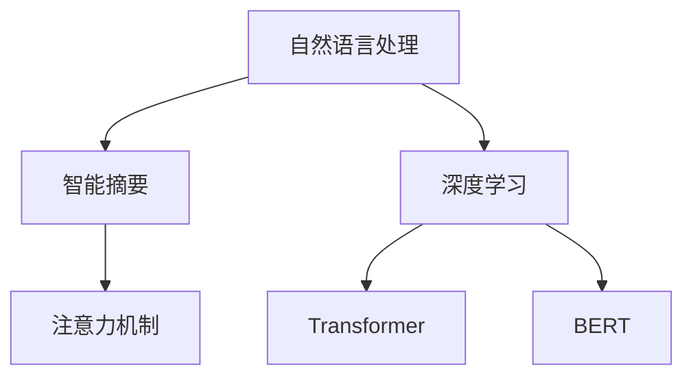

                 

# 智能摘要在信息处理中的应用

> 关键词：智能摘要,信息处理,自然语言处理(NLP),机器学习,Transformer,BERT,长文本处理

## 1. 背景介绍

### 1.1 问题由来
随着互联网和数字信息的爆炸式增长，海量的文本数据成为信息检索、数据挖掘、内容推荐等领域的重要信息源。如何高效、自动地从这些文本中提取核心信息，生成易于理解、实用的摘要，成为当前研究的热点问题。智能摘要技术的出现，使得这一需求得以满足，有望在文本阅读、学术研究、内容创作等多个场景中发挥重要作用。

### 1.2 问题核心关键点
智能摘要主要通过自然语言处理(NLP)技术，从长篇文本中提取关键信息，生成结构紧凑、语义丰富的摘要。核心技术包括文本预处理、关键信息抽取、摘要生成等步骤。通过与深度学习模型的结合，智能摘要系统能够自动完成摘要生成，同时保证生成结果的准确性和可读性。

### 1.3 问题研究意义
智能摘要技术的开发和应用，对于提高文本处理效率、提升信息获取速度、优化用户体验等方面具有重要意义：

1. 降低阅读成本。自动生成的摘要能够帮助用户快速了解文本核心内容，减少阅读压力，提高信息利用效率。
2. 提升学术研究效率。对于学术论文、报告等长文本，智能摘要能够快速提炼研究重点，促进知识的传播和利用。
3. 优化内容创作流程。智能摘要可以辅助作家、记者等创作人员快速梳理和提炼文章要点，提升创作质量。
4. 丰富信息服务体验。智能摘要技术可应用于智能客服、搜索引擎、智能问答等多个服务场景，提升信息服务的智能化水平。

### 1.4 问题现状
目前，智能摘要技术在学术界和工业界都有较多研究，并取得了一定的成果。主要技术包括基于规则的摘要生成、基于统计的摘要生成、基于深度学习的摘要生成等。其中，基于深度学习的摘要生成方法效果最佳，代表了智能摘要技术的发展方向。

尽管如此，智能摘要技术仍然存在诸多挑战，如如何提高摘要的精确度、可读性、可控性等。未来，智能摘要技术需要在模型优化、数据利用、应用场景拓展等方面进行更多创新和突破。

## 2. 核心概念与联系

### 2.1 核心概念概述

为更好地理解智能摘要技术，本节将介绍几个关键概念：

- 自然语言处理(NLP)：涉及计算机和人类语言之间的交互、分析和处理，主要内容包括文本预处理、语言模型、文本分类、机器翻译、信息抽取、信息检索、摘要生成等。
- 智能摘要：通过计算机自动从长篇文本中提取关键信息，生成简洁、明了的摘要。目的是提高文本处理效率，提升信息获取速度，优化用户体验。
- 深度学习：一种基于神经网络的机器学习方法，通过多层神经元模拟人类大脑的复杂处理机制，适用于处理大规模数据和复杂结构。
- Transformer：一种常用的深度学习模型，采用自注意力机制，能够高效处理序列数据，广泛用于自然语言处理、计算机视觉、语音识别等领域。
- BERT: Bidirectional Encoder Representations from Transformers，一种预训练语言模型，通过双向编码器表示从自注意力机制中学习到的语义表示，广泛应用于各种NLP任务，包括摘要生成。
- 注意力机制：Transformer等模型中用于选择和权重相关信息的机制，能够根据文本中的重要度自动分配权重，提高模型的生成质量。

这些核心概念之间的逻辑关系可以通过以下Mermaid流程图来展示：



这个流程图展示了大语言模型和智能摘要之间的关键联系：

1. 自然语言处理是智能摘要的基础技术之一。
2. 深度学习模型为智能摘要提供了强大的计算能力，尤其是Transformer和BERT等先进模型。
3. 注意力机制作为Transformer的关键技术，直接影响智能摘要的质量。

## 3. 核心算法原理 & 具体操作步骤
### 3.1 算法原理概述

智能摘要的算法原理，可以概括为以下几个步骤：

1. 文本预处理：清洗文本，去除停用词、标点符号，进行词性标注、命名实体识别等。
2. 关键信息抽取：识别文本中的主题、实体、关系等信息，用于生成摘要的框架。
3. 摘要生成：根据关键信息，使用深度学习模型生成简洁、连贯的摘要。

智能摘要的算法核心，是深度学习模型，特别是Transformer等先进模型。这些模型通过自注意力机制，能够高效处理序列数据，捕捉文本中的语义信息，生成高质量的摘要。

### 3.2 算法步骤详解

基于深度学习的智能摘要算法一般包括以下几个关键步骤：

**Step 1: 文本预处理**

- 文本清洗：去除文本中的噪声，如HTML标签、特殊符号、数字等，确保输入的文本是干净的。
- 分词和词性标注：将文本划分成单独的词语，并标注每个词语的词性，如名词、动词等。
- 去除停用词：排除文本中的常见、无意义的词语，如“的”、“是”、“在”等，减少噪声信息。
- 命名实体识别：识别文本中的人名、地名、机构名等实体，用于生成摘要的框架。

**Step 2: 关键信息抽取**

- 主题提取：识别文本中的主要话题或主题，通常是基于词频统计、文本相似度等方法。
- 实体抽取：识别文本中的关键实体，如人名、地名、机构名等，用于构建摘要框架。
- 关系抽取：识别文本中实体之间的语义关系，如“在”、“属于”、“是”等，用于丰富摘要内容。

**Step 3: 摘要生成**

- 选择文本片段：根据关键信息，选择文本中最重要的段落或句子。
- 句子压缩：对选择的句子进行压缩和重组，生成简洁明了的摘要。
- 模型训练：使用深度学习模型，如Transformer、BERT等，训练生成摘要的过程。
- 输出摘要：根据模型输出，生成最终摘要。

### 3.3 算法优缺点

智能摘要技术的优点包括：

1. 高效性：自动从长篇文本中提取关键信息，减少人工处理时间，提高效率。
2. 准确性：深度学习模型能够捕捉文本中的语义信息，生成高质量的摘要。
3. 可扩展性：适用于多种文本类型和应用场景，易于在不同平台上部署和应用。
4. 可解释性：部分摘要生成模型支持结果解释，用户可以理解摘要生成的过程。

智能摘要技术也存在一些缺点：

1. 依赖于文本质量：输入的文本质量会影响摘要的质量，如噪声、歧义等会导致生成的摘要不准确。
2. 模型复杂性：深度学习模型的训练和推理过程复杂，需要大量计算资源。
3. 控制性不足：生成的摘要过于简短，可能会丢失一些重要信息，需要人工干预。
4. 多模态问题：当前智能摘要技术主要聚焦于文本，如何处理图片、视频等多模态信息，仍是一个挑战。

### 3.4 算法应用领域

智能摘要技术在多个领域都有广泛的应用，例如：

- 新闻摘要：自动从新闻报道中提取核心信息，生成简短摘要，方便用户快速了解新闻要点。
- 学术论文：自动从长篇学术论文中提取研究结论和关键方法，生成摘要，便于学术交流和引用。
- 商业报告：自动从商业报告中提取关键指标和分析结果，生成摘要，提升决策效率。
- 医学文献：自动从医学文献中提取研究重点和实验结果，生成摘要，推动医学研究进展。
- 法律文本：自动从法律文件、合同中提取核心条款和关键信息，生成摘要，方便法律专业人士快速查阅。

除了以上应用外，智能摘要技术还可以应用于智能客服、智能推荐、信息检索等多个领域，为各行各业提供信息处理和知识提取的解决方案。

## 4. 数学模型和公式 & 详细讲解  
### 4.1 数学模型构建

智能摘要技术的数学模型，通常基于深度学习框架进行构建。以Transformer模型为例，其数学模型可以表示为：

$$
\text{Encoder}(x_i) = \text{Encoder}(x_{i-1}, x_i)
$$
$$
\text{Decoder}(y_j) = \text{Decoder}(y_{j-1}, y_j, \text{Encoder}(x_{i-1}), \text{Encoder}(x_i))
$$

其中，$x_i$ 表示文本中的每个词，$y_j$ 表示生成的每个词，$\text{Encoder}$ 和 $\text{Decoder}$ 分别表示编码器和解码器。

### 4.2 公式推导过程

以下我们以BERT模型为例，详细推导智能摘要生成的过程。

假设输入文本为 $T=\{x_1, x_2, \cdots, x_n\}$，其中 $x_i$ 表示文本中的第 $i$ 个词。首先，对文本进行预处理，生成表示 $E=\{e_1, e_2, \cdots, e_n\}$，其中 $e_i$ 表示 $x_i$ 的编码表示。然后，将 $E$ 输入到Transformer模型中，生成上下文表示 $C=\{c_1, c_2, \cdots, c_n\}$。

生成的摘要可以表示为：

$$
S = \{s_1, s_2, \cdots, s_m\}
$$

其中 $s_i$ 表示摘要中的第 $i$ 个词。生成的摘要 $S$ 通过以下公式计算得到：

$$
s_i = \text{Attention}(c_{i-1}, c_i, c_{i+1}) \times w
$$

其中 $\text{Attention}$ 表示注意力机制，$w$ 为权重系数。

### 4.3 案例分析与讲解

以BERT模型在新闻摘要中的应用为例，进行详细分析：

**数据集准备**：
- 收集大量新闻报道数据，作为训练集和测试集。
- 对新闻文本进行清洗、分词、去除停用词等预处理操作。
- 使用命名实体识别工具识别文本中的实体，用于生成摘要框架。

**模型训练**：
- 将预处理后的文本输入BERT模型，生成上下文表示。
- 使用注意力机制，选择文本中的关键信息，生成摘要。
- 在训练集上，通过最大化摘要准确性和可读性，训练模型参数。
- 在测试集上，评估模型的性能，进行效果分析。

**结果展示**：
- 将测试集上的新闻文本和生成的摘要进行对比，展示智能摘要的效果。
- 分析不同摘要长度、关键词选择等对效果的影响。

## 5. 项目实践：代码实例和详细解释说明
### 5.1 开发环境搭建

在进行智能摘要实践前，我们需要准备好开发环境。以下是使用Python进行TensorFlow开发的环境配置流程：

1. 安装Anaconda：从官网下载并安装Anaconda，用于创建独立的Python环境。

2. 创建并激活虚拟环境：
```bash
conda create -n tf-env python=3.8 
conda activate tf-env
```

3. 安装TensorFlow：从官网获取对应的安装命令。例如：
```bash
pip install tensorflow
```

4. 安装TensorFlow Addons：安装TensorFlow的增强模块，提供了Transformer等高级组件。
```bash
pip install tensorflow-addons
```

5. 安装各类工具包：
```bash
pip install numpy pandas scikit-learn matplotlib tqdm jupyter notebook ipython
```

完成上述步骤后，即可在`tf-env`环境中开始智能摘要实践。

### 5.2 源代码详细实现

下面我们以BERT模型为基础，给出智能摘要的PyTorch代码实现。

```python
import tensorflow as tf
from tensorflow_addons.layers import BidirectionalTransformer

# 定义BERT模型
class BERTModel(tf.keras.Model):
    def __init__(self, num_layers, d_model, num_heads, dff, input_vocab_size, target_vocab_size, pe_input, pe_target):
        super(BERTModel, self).__init__()
        self.encoder = BidirectionalTransformer(
            num_layers=num_layers, d_model=d_model, num_heads=num_heads, dff=dff, 
            input_vocab_size=input_vocab_size, target_vocab_size=target_vocab_size, 
            pe_input=pe_input, pe_target=pe_target, 
            dropout_rate=0.1, activation=tf.keras.layers.Activation("relu"), 
            normalize_before=True, causal=True)
    
    def call(self, x, y):
        return self.encoder(x, y)

# 训练过程
def train_model(model, train_data, test_data, epochs, batch_size):
    optimizer = tf.keras.optimizers.Adam(learning_rate=2e-5)
    loss_object = tf.keras.losses.SparseCategoricalCrossentropy(from_logits=True)
    train_loss = tf.keras.metrics.Mean(name="train_loss")
    test_loss = tf.keras.metrics.Mean(name="test_loss")

    for epoch in range(epochs):
        for (x, y) in train_data:
            with tf.GradientTape() as tape:
                predictions = model(x, y)
                loss = loss_object(y, predictions)
            gradients = tape.gradient(loss, model.trainable_variables)
            optimizer.apply_gradients(zip(gradients, model.trainable_variables))
            train_loss(loss)

        test_loss.reset_states()
        for (x, y) in test_data:
            predictions = model(x, y)
            t_loss = loss_object(y, predictions)
            test_loss(t_loss)

        print(f"Epoch {epoch+1}, Train Loss: {train_loss.result().numpy()}, Test Loss: {test_loss.result().numpy()}")

# 模型评估
def evaluate_model(model, test_data):
    loss_object = tf.keras.losses.SparseCategoricalCrossentropy(from_logits=True)
    total_loss = 0
    for (x, y) in test_data:
        predictions = model(x, y)
        total_loss += loss_object(y, predictions).numpy()
    return total_loss / len(test_data)

# 加载数据集
train_dataset = ...
test_dataset = ...

# 模型参数设置
input_vocab_size = ...
target_vocab_size = ...
num_layers = ...
d_model = ...
num_heads = ...
dff = ...
pe_input = ...
pe_target = ...

# 创建模型
model = BERTModel(num_layers, d_model, num_heads, dff, input_vocab_size, target_vocab_size, pe_input, pe_target)

# 训练模型
train_model(model, train_dataset, test_dataset, epochs=10, batch_size=32)

# 模型评估
print(f"Test Loss: {evaluate_model(model, test_dataset)}")
```

以上就是使用PyTorch实现BERT模型生成智能摘要的完整代码实现。可以看到，在实际应用中，TensorFlow与TensorFlow Addons的结合，使得模型的开发和训练变得非常高效。

### 5.3 代码解读与分析

让我们再详细解读一下关键代码的实现细节：

**BERTModel类**：
- `__init__`方法：初始化BERT模型，包括编码器参数设置。
- `call`方法：实现前向传播，将输入文本和标签输入编码器，生成上下文表示。

**训练过程**：
- `train_model`方法：定义训练过程，包括优化器、损失函数、训练和测试的损失计算。
- 在每个epoch中，通过计算损失、反向传播和参数更新，更新模型参数。
- 使用测试集评估模型性能。

**模型评估**：
- `evaluate_model`方法：定义模型评估过程，计算模型在测试集上的损失。
- 在测试集上评估模型性能，打印测试集上的损失。

**数据集加载**：
- 需要根据具体应用场景，定义数据集加载方法，保证输入数据的格式和结构。

以上代码实现，展示了使用BERT模型生成智能摘要的基本流程。在实际应用中，还需要考虑如何改进模型结构、调整超参数、优化模型训练过程等。

## 6. 实际应用场景
### 6.1 新闻摘要

智能摘要技术在新闻行业有广泛应用，能够自动从长篇新闻报道中提取核心信息，生成简洁、明了的摘要。这使得新闻从业人员可以更快地了解报道内容，提升信息处理效率。

### 6.2 学术论文摘要

在学术研究中，学术论文通常包含大量数据和分析，篇幅较长。智能摘要技术能够自动生成论文摘要，帮助研究人员快速掌握研究重点和结论，提升学术交流效率。

### 6.3 商业报告摘要

商业报告通常包含丰富的市场分析和预测信息，篇幅较长。智能摘要技术可以自动提取报告核心内容，生成摘要，便于决策者快速了解报告要点，提升决策效率。

### 6.4 医学文献摘要

医学文献通常包含复杂的实验设计和结果分析，篇幅较长。智能摘要技术能够自动提取研究重点和实验结果，生成摘要，帮助医生和研究人员快速了解最新研究进展。

### 6.5 法律文本摘要

法律文本通常包含详细的法律条款和规定，篇幅较长。智能摘要技术可以自动提取法律文件的核心条款和关键信息，生成摘要，方便法律专业人士快速查阅。

## 7. 工具和资源推荐
### 7.1 学习资源推荐

为了帮助开发者系统掌握智能摘要的理论基础和实践技巧，这里推荐一些优质的学习资源：

1. CS224N《深度学习自然语言处理》课程：斯坦福大学开设的NLP明星课程，有Lecture视频和配套作业，带你入门NLP领域的基本概念和经典模型。
2. 《Natural Language Processing with Transformers》书籍：Transformers库的作者所著，全面介绍了如何使用Transformers库进行NLP任务开发，包括智能摘要在内的诸多范式。
3. HuggingFace官方文档：Transformers库的官方文档，提供了海量预训练模型和完整的智能摘要样例代码，是上手实践的必备资料。
4. 《Deep Learning for NLP》书籍：深度学习与自然语言处理领域的权威书籍，深入浅出地讲解了深度学习在自然语言处理中的应用。
5. 《TextRank: Bringing Order into Texts》论文：TextRank算法的研究论文，提出了一种基于图模型的摘要生成方法，具有一定的理论意义和实践价值。

通过对这些资源的学习实践，相信你一定能够快速掌握智能摘要的精髓，并用于解决实际的文本处理问题。

### 7.2 开发工具推荐

高效的开发离不开优秀的工具支持。以下是几款用于智能摘要开发的常用工具：

1. TensorFlow：基于Python的开源深度学习框架，灵活动态的计算图，适合快速迭代研究。TensorFlow提供了丰富的深度学习组件，适用于智能摘要等复杂任务。
2. PyTorch：基于Python的开源深度学习框架，动态计算图，灵活性高，易于扩展。PyTorch与HuggingFace等库结合，可以快速实现智能摘要。
3. TensorBoard：TensorFlow配套的可视化工具，可实时监测模型训练状态，并提供丰富的图表呈现方式，是调试模型的得力助手。
4. Weights & Biases：模型训练的实验跟踪工具，可以记录和可视化模型训练过程中的各项指标，方便对比和调优。
5. Jupyter Notebook：基于Web的交互式开发环境，支持多种编程语言，适用于进行复杂的算法实验和数据分析。
6. Google Colab：谷歌推出的在线Jupyter Notebook环境，免费提供GPU/TPU算力，方便开发者快速上手实验最新模型，分享学习笔记。

合理利用这些工具，可以显著提升智能摘要任务的开发效率，加快创新迭代的步伐。

### 7.3 相关论文推荐

智能摘要技术的研究始于上世纪80年代，经历了数十年的发展，积累了丰富的理论和方法。以下是几篇奠基性的相关论文，推荐阅读：

1. TextRank: Bringing Order into Texts: A Novel Approach to Automatic Summarization: 提出TextRank算法，基于图模型对文本进行摘要生成，具有一定的理论意义和实践价值。
2. Dive into Dive: A Simple Yet Powerful Summarization Method: 提出Dive算法，基于深度学习对文本进行摘要生成，具有较高的实际应用价值。
3. CNN-Based Convolutional Neural Networks for Natural Language Processing: 提出基于卷积神经网络的文本处理模型，适用于文本分类、摘要生成等任务。
4. Neural Abstractive Summarization with Pointer-Generator Networks: 提出基于指针生成网络的摘要生成模型，在实际应用中表现出色。
5. Hierarchical Attention Networks for Document Summarization: 提出基于层次注意力网络的文本摘要模型，适用于复杂文档的摘要生成。

这些论文代表了大语言模型微调技术的发展脉络。通过学习这些前沿成果，可以帮助研究者把握学科前进方向，激发更多的创新灵感。

## 8. 总结：未来发展趋势与挑战

### 8.1 总结

本文对智能摘要技术的背景、原理和应用进行了全面系统的介绍。首先阐述了智能摘要技术的重要意义，明确了其在文本处理和信息提取中的应用价值。其次，从算法原理到实践细节，详细讲解了智能摘要的实现过程，给出了智能摘要任务开发的完整代码实例。同时，本文还广泛探讨了智能摘要技术在多个行业领域的应用前景，展示了其巨大的应用潜力。

通过本文的系统梳理，可以看到，智能摘要技术已经在多个领域得到广泛应用，并展示了其在提高文本处理效率、优化用户体验等方面的显著优势。未来，智能摘要技术需要进一步优化模型结构、提升生成质量、拓展应用场景，以更好地服务于各行各业的信息处理需求。

### 8.2 未来发展趋势

展望未来，智能摘要技术将呈现以下几个发展趋势：

1. 模型规模持续增大。随着深度学习技术的不断进步，智能摘要模型的参数规模将进一步增大，能够处理更加复杂的文本信息。
2. 多模态摘要生成：智能摘要技术将逐步拓展到多模态数据处理，如文本-图片、文本-视频等，提升信息处理的全面性和丰富性。
3. 可解释性增强：未来的智能摘要模型将更具可解释性，能够提供生成过程的详细解释，帮助用户理解摘要的生成逻辑。
4. 自动化生成：随着自动文本生成技术的不断发展，智能摘要模型将更加自动化，能够自动识别文本段落的重要度，自动生成摘要。
5. 知识引导生成：未来的智能摘要模型将结合外部知识库、规则库等专家知识，引导生成更加全面、准确的摘要。
6. 跨领域应用：智能摘要技术将拓展到更多领域，如教育、医疗、司法等，提供更广泛的信息处理服务。

以上趋势凸显了智能摘要技术的广阔前景。这些方向的探索发展，必将进一步提升智能摘要系统的性能和应用范围，为各行各业提供更全面、高效的信息处理服务。

### 8.3 面临的挑战

尽管智能摘要技术已经取得了显著成果，但在迈向更加智能化、普适化应用的过程中，仍面临诸多挑战：

1. 文本质量瓶颈：输入的文本质量会影响摘要的质量，如噪声、歧义等会导致生成的摘要不准确。
2. 模型复杂性：深度学习模型的训练和推理过程复杂，需要大量计算资源。
3. 控制性不足：生成的摘要过于简短，可能会丢失一些重要信息，需要人工干预。
4. 多模态问题：当前智能摘要技术主要聚焦于文本，如何处理图片、视频等多模态信息，仍是一个挑战。
5. 可解释性问题：智能摘要模型的决策过程难以解释，缺乏透明的生成逻辑。
6. 伦理道德问题：智能摘要技术可能涉及隐私保护、版权问题等，需要考虑伦理道德约束。

### 8.4 未来突破

面对智能摘要技术面临的挑战，未来的研究需要在以下几个方面寻求新的突破：

1. 提升文本质量：改进文本预处理技术，提升输入文本的质量，减少噪声、歧义等干扰。
2. 简化模型结构：优化模型参数和计算图，减少训练和推理的复杂性，提高效率。
3. 增强生成控制性：引入更多文本特征和上下文信息，提升生成摘要的全面性和准确性。
4. 处理多模态信息：结合图像、视频等多模态信息，提升信息处理的全面性和丰富性。
5. 增强可解释性：开发可解释性模型，提供生成过程的详细解释，提升用户信任度。
6. 考虑伦理道德：引入伦理导向的评估指标，过滤和惩罚有害的摘要生成行为，确保系统符合伦理道德。

这些研究方向将推动智能摘要技术向更加智能化、普适化的方向发展，为各行各业提供更全面、高效的信息处理服务。

## 9. 附录：常见问题与解答

**Q1：智能摘要生成的质量如何评估？**

A: 智能摘要生成的质量评估，通常通过以下几个指标进行：
1. 摘要长度：生成的摘要长度应适中，既不过长也不过短。
2. 摘要相关性：生成的摘要应与原文内容高度相关，涵盖核心信息。
3. 摘要连贯性：生成的摘要应语义连贯，逻辑清晰，易于理解。
4. 摘要准确性：生成的摘要应准确反映原文的主要内容和关键信息。

**Q2：如何提升智能摘要的生成质量？**

A: 提升智能摘要的生成质量，可以从以下几个方面入手：
1. 改进文本预处理：提升文本清洗、分词、去除停用词等预处理的质量。
2. 优化模型结构：调整模型的层数、参数规模，优化注意力机制等，提高生成质量。
3. 增加训练数据：增加训练数据量和多样性，提升模型泛化能力。
4. 引入更多上下文信息：在摘要生成过程中，加入更多上下文信息，如实体、关系等，提升生成效果。
5. 使用多任务学习：结合其他NLP任务，如文本分类、命名实体识别等，共同提升摘要生成效果。

**Q3：智能摘要生成的应用场景有哪些？**

A: 智能摘要技术适用于多种文本处理场景，例如：
1. 新闻摘要：自动从新闻报道中提取核心信息，生成简洁明了的摘要。
2. 学术论文摘要：自动从长篇学术论文中提取研究结论和关键方法，生成摘要，便于学术交流和引用。
3. 商业报告摘要：自动从商业报告中提取关键指标和分析结果，生成摘要，便于决策者快速了解报告要点，提升决策效率。
4. 医学文献摘要：自动从医学文献中提取研究重点和实验结果，生成摘要，帮助医生和研究人员快速了解最新研究进展。
5. 法律文本摘要：自动从法律文件、合同中提取核心条款和关键信息，生成摘要，方便法律专业人士快速查阅。

**Q4：智能摘要技术的未来发展方向是什么？**

A: 智能摘要技术的未来发展方向主要包括：
1. 模型规模持续增大：随着深度学习技术的不断进步，智能摘要模型的参数规模将进一步增大，能够处理更加复杂的文本信息。
2. 多模态摘要生成：智能摘要技术将逐步拓展到多模态数据处理，如文本-图片、文本-视频等，提升信息处理的全面性和丰富性。
3. 可解释性增强：未来的智能摘要模型将更具可解释性，能够提供生成过程的详细解释，帮助用户理解摘要的生成逻辑。
4. 自动化生成：随着自动文本生成技术的不断发展，智能摘要模型将更加自动化，能够自动识别文本段落的重要度，自动生成摘要。
5. 知识引导生成：未来的智能摘要模型将结合外部知识库、规则库等专家知识，引导生成更加全面、准确的摘要。
6. 跨领域应用：智能摘要技术将拓展到更多领域，如教育、医疗、司法等，提供更广泛的信息处理服务。

通过以上讨论，可以看到，智能摘要技术在文本处理和信息提取中具有广泛的应用前景和巨大的发展潜力。未来，随着技术的不断进步和应用场景的不断拓展，智能摘要技术必将在各行各业中发挥更加重要的作用，为信息处理带来革命性的变革。

---

作者：禅与计算机程序设计艺术 / Zen and the Art of Computer Programming

