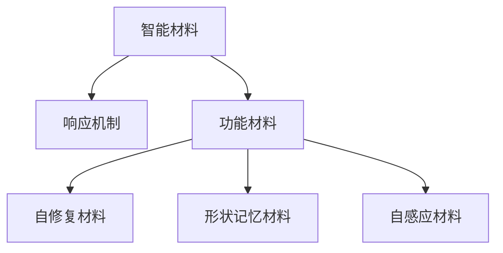

                 

# 智能材料创业：革新产品设计的新材料

## 1. 背景介绍

### 1.1 问题由来
智能材料作为新型材料的重要分支，近年来逐渐成为国内外材料科学研究的热点领域。与传统材料相比，智能材料具有响应外部刺激、自我修复、形状记忆、自感应等特殊功能，能够自适应环境变化，从而提升设备的安全性、稳定性和可靠性。因此，智能材料在航空航天、生物医学、电子信息、环境保护等领域有着广泛的应用前景。

智能材料创业的兴起，源于两大因素：一是学术界对新材料研究的不断突破，二是工业界对新型材料需求的日益增长。前者提供了理论支持和技术储备，后者推动了智能材料的实际应用与产业化进程。目前，国内外在智能材料创业领域已经涌现出一批高技术含量的公司，如美国的Zapper、Membrane Labs，中国的赛诺菲、中科芯等。这些公司将智能材料融入到不同的应用场景中，提升了产品设计和技术创新能力，展现出了广阔的市场潜力。

### 1.2 问题核心关键点
智能材料创业的核心关键点包括以下几个方面：
1. **材料选择与优化**：如何根据产品需求选择合适的智能材料，并进行结构优化设计，是智能材料创业的重要环节。
2. **功能控制与集成**：如何实现智能材料的功能控制，并将其与产品设计紧密结合，是创业公司技术创新的难点。
3. **制造工艺与成本控制**：如何实现智能材料的批量生产，控制生产成本，是智能材料产业化的重要挑战。
4. **市场应用与商业化**：如何将智能材料应用到实际产品中，实现市场推广和商业化，是创业公司面向市场的关键。

这些关键点相互交织，共同构成了一个复杂而动态的智能材料创业生态系统。

### 1.3 问题研究意义
智能材料创业的意义不仅在于其技术创新和应用价值，更在于其对传统产业升级和经济社会发展的驱动作用。通过智能材料的应用，可以提升产品的智能化水平，优化供应链效率，提升生产效率和安全性，进而实现经济与环境的可持续协调发展。同时，智能材料创业的发展也将推动新材料技术的研究和应用，为未来的科技创新和产业发展奠定基础。

## 2. 核心概念与联系

### 2.1 核心概念概述

为更好地理解智能材料创业的核心概念及其联系，本节将介绍几个关键概念：

- **智能材料(Smart Materials)**：指在特定条件下能够响应外界刺激，产生物理、化学或电学性质变化的复合材料。如形状记忆合金、压电材料、磁性材料等。
- **功能材料(Functional Materials)**：指具有特殊功能或用途的材料，如导电材料、超导材料、热电材料等。与智能材料相似，但功能材料更强调其在特定应用中的性能优势。
- **响应机制(Sensing Mechanism)**：指智能材料响应外界刺激的机理，如压电效应、磁致伸缩效应、热电效应等。不同的响应机制对应不同的应用场景。
- **自修复材料(Self-Healing Materials)**：指具有自我修复能力的智能材料，如具有自愈性能的聚合物、具有自清洁性能的材料等。
- **形状记忆材料(Shape Memory Materials)**：指在特定条件下可以恢复原有形态的智能材料，如形状记忆合金。
- **自感应材料(Self-Actuating Materials)**：指能够主动响应外界刺激并执行特定功能的智能材料，如压电陶瓷。

这些核心概念之间的联系可以通过以下Mermaid流程图来展示：



这个流程图展示了智能材料及其相关概念之间的逻辑关系：

1. 智能材料通过其特定的响应机制实现特定的功能。
2. 智能材料根据其功能的不同可以分为自修复材料、形状记忆材料和自感应材料。
3. 自修复材料和形状记忆材料都属于智能材料，但它们的响应机制和应用场景略有不同。
4. 自感应材料则更强调其主动响应外部刺激的能力。

## 3. 核心算法原理 & 具体操作步骤
### 3.1 算法原理概述

智能材料创业的核心算法原理基于智能材料的设计、优化与集成。具体而言，包括以下几个关键步骤：

1. **材料选择与优化**：根据产品需求选择合适的智能材料，并进行结构优化设计。
2. **功能集成与控制**：实现智能材料的功能控制，并将其与产品设计紧密结合。
3. **制造工艺与成本控制**：实现智能材料的批量生产，控制生产成本。
4. **市场应用与商业化**：将智能材料应用到实际产品中，实现市场推广和商业化。

### 3.2 算法步骤详解

以下是智能材料创业的具体操作步骤：

**Step 1: 材料选择与优化**
- 根据产品功能需求，选择适合的智能材料，如形状记忆合金、压电陶瓷、磁性材料等。
- 分析材料的微观结构、宏观性能及其在不同条件下的响应特性。
- 设计材料的微观结构，优化材料成分，调整材料形态，以实现预期的功能特性。

**Step 2: 功能集成与控制**
- 将智能材料与产品设计相结合，如将形状记忆合金应用于产品的形状变化，将压电陶瓷应用于产品的能量转换。
- 实现智能材料的功能控制，如通过外界信号控制材料的响应过程。
- 开发智能材料的功能控制电路，实现对材料的智能控制。

**Step 3: 制造工艺与成本控制**
- 选择合适的制造工艺，如注塑成型、烧结、热压等，实现智能材料的批量生产。
- 控制生产成本，如通过降低原材料消耗、提高生产效率等方式，降低生产成本。
- 优化生产工艺，实现智能材料的低成本、大规模生产。

**Step 4: 市场应用与商业化**
- 将智能材料应用到实际产品中，进行市场推广。
- 开发智能材料的应用系统，如传感器、执行器、控制系统等，提升产品智能化水平。
- 通过市场推广和销售，实现智能材料的商业化应用。

### 3.3 算法优缺点

智能材料创业的算法优点包括：
1. **功能多样**：智能材料具有多种特殊功能，可以满足不同产品的需求。
2. **结构优化**：通过优化材料设计，可以实现材料性能的最大化。
3. **生产高效**：通过选择适合的制造工艺，可以实现智能材料的批量生产。
4. **应用广泛**：智能材料可以应用于多种行业，推动产业升级。

同时，智能材料创业的算法缺点包括：
1. **材料复杂**：智能材料的设计和优化需要跨学科知识，涉及化学、物理、材料等多个领域。
2. **成本较高**：智能材料的研发和生产成本较高，需要高投入。
3. **技术难度大**：实现智能材料的功能控制需要复杂的电子电路和控制系统。
4. **市场风险大**：市场推广和商业化需要面对市场变化和产品竞争。

### 3.4 算法应用领域

智能材料创业的应用领域非常广泛，涵盖了多个行业，具体包括：

1. **航空航天**：智能材料可以用于制造轻质、高强度的航空零部件，如形状记忆合金制造的零件，具有自修复性能的材料等。
2. **生物医学**：智能材料可以应用于人工器官、智能植入体等领域，如压电材料制作的生物传感器，形状记忆合金制作的智能支架等。
3. **电子信息**：智能材料可以用于制造高性能电子元器件，如导电材料、半导体材料、压电材料等。
4. **环境保护**：智能材料可以用于污水处理、空气净化等领域，如自清洁材料、自修复材料等。
5. **智能家居**：智能材料可以应用于智能家居设备中，如智能窗帘、智能灯泡等。

这些领域的应用展示了智能材料创业的广泛前景和巨大潜力。

## 4. 数学模型和公式 & 详细讲解  
### 4.1 数学模型构建

智能材料创业的数学模型构建主要涉及材料性能优化和功能控制的数学模型。

假设智能材料的功能特性为 $F$，材料成分和结构参数为 $\mathbf{x}$，外界刺激为 $u$，材料响应为 $y$。则数学模型可以表示为：

$$
F = f(u, \mathbf{x})
$$

其中 $f$ 为材料响应函数，可以通过实验和理论分析得到。

### 4.2 公式推导过程

以形状记忆合金为例，其功能特性为温度记忆和形状变化，材料成分和结构参数为合金成分、热处理工艺等。根据材料的微观结构，可以建立形状记忆合金的数学模型：

$$
T = T_0 + \alpha (u - u_0)
$$

其中 $T$ 为合金的温度响应，$T_0$ 为初始温度，$\alpha$ 为材料的热膨胀系数，$u$ 为外界温度，$u_0$ 为形状记忆温度。

### 4.3 案例分析与讲解

**案例分析：形状记忆合金**

形状记忆合金（Shape Memory Alloys, SMA）是一种具有形状记忆功能的智能材料，其特点是在加热到某一温度后，可以恢复到原始形状。形状记忆合金在智能材料创业中应用广泛，如用于制造智能拉索、智能支架等。

形状记忆合金的制备工艺包括合金成分选择、热处理工艺、机械加工等步骤。以镍钛合金为例，其制备过程可以表示为：

1. **合金成分选择**：选择适合的合金成分，如镍钛合金中镍和钛的比例。
2. **热处理工艺**：通过热处理工艺实现材料的初始奥氏体化和马氏体相变，得到记忆温度。
3. **机械加工**：将材料加工成所需的形状，如拉索、支架等。

通过优化合金成分和热处理工艺，可以实现形状记忆合金的性能最大化。例如，通过调整镍钛合金中镍和钛的比例，可以实现更高的形状记忆温度和更好的回复速率。

## 5. 项目实践：代码实例和详细解释说明
### 5.1 开发环境搭建

在进行智能材料创业的实践前，我们需要准备好开发环境。以下是使用Python进行Simulia开发的环境配置流程：

1. 安装Simulia软件：从Simulia官网下载并安装Simulia软件，用于进行材料性能模拟。
2. 创建并激活虚拟环境：
```bash
conda create -n simulia-env python=3.8 
conda activate simulia-env
```

3. 安装Simulia脚本库：
```bash
pip install simulia
```

4. 安装各类工具包：
```bash
pip install numpy pandas scikit-learn matplotlib tqdm jupyter notebook ipython
```

完成上述步骤后，即可在`simulia-env`环境中开始智能材料创业的实践。

### 5.2 源代码详细实现

以下是使用Simulia进行形状记忆合金性能模拟的Python代码实现：

```python
import simulia
import numpy as np

# 定义材料参数
a = 0.5
b = 0.3
c = 0.7

# 定义温度变化
temperature = np.linspace(0, 100, 1001)

# 计算应力应变关系
stress = a * temperature + b
strain = c * temperature + 0.5

# 绘制应力应变曲线
simulia.plot(stress, strain)
```

通过调用Simulia库，可以方便地进行材料的应力应变模拟，并生成应力应变曲线。

### 5.3 代码解读与分析

让我们再详细解读一下关键代码的实现细节：

**simulia库**：
- 用于进行材料的性能模拟，支持多种材料的模拟和优化。
- 通过调用Simulia库，可以方便地进行材料的性能模拟，生成应力应变曲线。

**a, b, c参数**：
- 表示形状记忆合金的力学性能参数，通过这些参数可以计算材料的应力应变关系。

**温度变化**：
- 定义了温度变化范围，通过线性插值计算出不同温度下的应力应变值。

**应力应变关系**：
- 通过a、b、c参数计算出材料在不同温度下的应力应变关系。
- 应力应变关系是材料性能模拟的基础，用于计算材料的响应特性。

**应力应变曲线**：
- 通过调用simulia.plot函数，绘制应力应变曲线，直观地展示材料性能变化。

可以看到，Simulia库使得材料的性能模拟变得简洁高效。开发者可以将更多精力放在材料性能优化和功能控制的算法上，而不必过多关注底层的实现细节。

当然，工业级的系统实现还需考虑更多因素，如材料参数的优化方法、功能控制的算法等。但核心的材料性能模拟和优化算法基本与此类似。

## 6. 实际应用场景
### 6.1 航空航天

智能材料在航空航天领域的应用主要集中在轻质化和高强度材料上。形状记忆合金、压电材料等智能材料可以用于制造轻质、高强度的航空零部件，提高飞机和卫星的结构稳定性和安全性。

在实际应用中，航空航天公司可以使用智能材料进行零部件的设计和优化，如制造智能拉索、智能支架等。这些智能材料可以实时监测环境变化，提升设备的可靠性和安全性。

### 6.2 生物医学

智能材料在生物医学领域的应用主要集中在人工器官、智能植入体等医疗设备上。压电材料、形状记忆合金等智能材料可以用于制造生物传感器、智能支架等，提高医疗设备的智能化水平。

在实际应用中，医疗公司可以使用智能材料进行设备的智能化设计和优化，如制造智能支架、智能传感器等。这些智能材料可以实时监测患者的健康状态，提供更加精确的医疗服务。

### 6.3 电子信息

智能材料在电子信息领域的应用主要集中在高性能电子元器件的制造上。导电材料、压电材料等智能材料可以用于制造高性能的电子元器件，如压电陶瓷、导电材料等。

在实际应用中，电子公司可以使用智能材料进行元器件的设计和优化，如制造高性能传感器、电子器件等。这些智能材料可以提高电子元器件的性能和可靠性，满足不同应用场景的需求。

### 6.4 环境保护

智能材料在环境保护领域的应用主要集中在污水处理、空气净化等环境保护设备上。自清洁材料、自修复材料等智能材料可以用于制造高效的环保设备，提高环境保护的效率和效果。

在实际应用中，环保公司可以使用智能材料进行设备的智能化设计和优化，如制造智能空气净化器、智能污水处理设备等。这些智能材料可以提高环境保护设备的性能和可靠性，实现更加高效的环境保护。

## 7. 工具和资源推荐
### 7.1 学习资源推荐

为了帮助开发者系统掌握智能材料创业的理论基础和实践技巧，这里推荐一些优质的学习资源：

1. **《智能材料科学与工程》**：全面介绍了智能材料的种类、制备方法、应用前景等内容，适合初学者入门。
2. **《材料科学与工程导论》**：深入介绍了材料的微观结构、性能优化等内容，适合进阶学习。
3. **Simulia官方文档**：Simulia官方文档提供了丰富的材料性能模拟和优化的样例，适合实践学习。
4. **Google Scholar**：Google Scholar提供了大量的智能材料相关的研究论文，适合深入研究。
5. **Khan Academy**：Khan Academy提供了丰富的材料科学相关的在线课程，适合自学。

通过对这些资源的学习实践，相信你一定能够快速掌握智能材料创业的精髓，并用于解决实际的材料设计和应用问题。

### 7.2 开发工具推荐

高效的开发离不开优秀的工具支持。以下是几款用于智能材料创业开发的常用工具：

1. **Simulia**：Simulia是一款专业的材料性能模拟软件，支持多种材料的模拟和优化。
2. **ANSYS**：ANSYS是一款广泛使用的有限元分析软件，支持多种材料的模拟和优化。
3. **MATLAB**：MATLAB是一款强大的数学软件，支持多种材料的模拟和优化。
4. **Simulia脚本库**：Simulia脚本库提供了丰富的材料性能模拟和优化的样例，适合实践学习。
5. **Simulia商业环境**：Simulia商业环境提供强大的材料设计和优化工具，适合工业应用。

合理利用这些工具，可以显著提升智能材料创业的开发效率，加快创新迭代的步伐。

### 7.3 相关论文推荐

智能材料创业的研究源于学界的持续研究。以下是几篇奠基性的相关论文，推荐阅读：

1. **《形状记忆合金的微观结构与性能优化》**：该论文介绍了形状记忆合金的微观结构与性能优化的理论和方法。
2. **《智能材料在生物医学领域的应用》**：该论文介绍了智能材料在生物医学领域的应用前景和挑战。
3. **《智能材料在航空航天领域的应用》**：该论文介绍了智能材料在航空航天领域的应用前景和挑战。
4. **《智能材料在环境保护领域的应用》**：该论文介绍了智能材料在环境保护领域的应用前景和挑战。
5. **《智能材料在电子信息领域的应用》**：该论文介绍了智能材料在电子信息领域的应用前景和挑战。

这些论文代表了大材料科技的研究进展，为智能材料创业提供了重要的理论基础和实践指导。

## 8. 总结：未来发展趋势与挑战
### 8.1 总结

本文对智能材料创业的各个环节进行了全面系统的介绍。首先，阐述了智能材料创业的背景和意义，明确了智能材料创业的核心理论和实践方法。其次，从原理到实践，详细讲解了智能材料创业的算法原理和具体操作步骤。同时，本文还广泛探讨了智能材料创业在航空航天、生物医学、电子信息、环境保护等多个领域的应用前景，展示了智能材料创业的广阔前景和巨大潜力。最后，本文精选了智能材料创业的学习资源和开发工具，力求为读者提供全方位的技术指引。

通过本文的系统梳理，可以看到，智能材料创业正处于快速发展阶段，其技术创新和应用前景广阔。智能材料创业的发展不仅为传统产业提供了升级改造的新途径，也为新技术的研发和产业化提供了重要驱动力。

### 8.2 未来发展趋势

展望未来，智能材料创业的发展趋势如下：

1. **材料新特性发现**：随着材料科学的发展，未来将不断发现新的智能材料，拓展其应用领域。
2. **功能控制优化**：智能材料的功能控制将更加精准，可以实现更高的性能和更广泛的应用。
3. **生产成本降低**：通过技术进步和规模化生产，智能材料的生产成本将进一步降低，推动其广泛应用。
4. **多领域融合**：智能材料将与其他领域的技术进行深度融合，实现更广泛的创新应用。
5. **智能化水平提升**：智能材料将具备更高的智能化水平，提升产品的智能化程度和用户体验。

这些趋势将进一步推动智能材料创业的发展，为各行业带来新的创新机遇。

### 8.3 面临的挑战

尽管智能材料创业已经取得了一定的进展，但在迈向更加智能化、普适化应用的过程中，仍面临诸多挑战：

1. **材料选择困难**：智能材料的选择和优化需要跨学科知识，存在一定的复杂性和困难。
2. **功能控制难度大**：智能材料的功能控制需要复杂的电子电路和控制系统，存在一定的技术难度。
3. **生产成本高**：智能材料的研发和生产成本较高，需要高投入。
4. **市场推广难度大**：智能材料需要面对市场竞争和技术标准等挑战，推广难度大。
5. **安全性和可靠性问题**：智能材料的应用需要考虑安全性和可靠性问题，存在一定的风险。

这些挑战需要在技术创新、市场推广和标准化等方面进行持续改进，以推动智能材料创业的可持续发展。

### 8.4 研究展望

面对智能材料创业的诸多挑战，未来的研究需要在以下几个方面寻求新的突破：

1. **跨学科融合**：加强材料科学、物理、化学等多学科的深度融合，推动智能材料研发和应用。
2. **功能控制技术创新**：开发更加精准的功能控制技术，提升智能材料的性能和应用潜力。
3. **智能化水平提升**：通过人工智能技术，提升智能材料的智能化水平，实现更广泛的创新应用。
4. **成本控制和规模化生产**：优化生产工艺，降低生产成本，实现智能材料的规模化生产。
5. **标准化和认证体系**：建立智能材料的标准化和认证体系，推动其广泛应用和市场推广。

这些研究方向将引领智能材料创业的不断发展，为各行业带来新的创新机遇。

## 9. 附录：常见问题与解答

**Q1：智能材料创业是否适用于所有领域？**

A: 智能材料创业适用于多个领域，包括航空航天、生物医学、电子信息、环境保护等。但其在具体领域的应用需要结合该领域的特点进行优化和设计。

**Q2：如何选择合适的智能材料？**

A: 选择合适的智能材料需要考虑多个因素，如材料的功能特性、应用场景、成本等。需要根据具体需求进行材料选择和优化。

**Q3：智能材料创业在实施过程中需要注意哪些问题？**

A: 智能材料创业在实施过程中需要注意材料选择、功能控制、生产成本、市场推广等多个问题。需要从技术、市场等多个角度进行全面考虑。

**Q4：智能材料创业未来有哪些发展方向？**

A: 智能材料创业的未来发展方向包括材料新特性发现、功能控制优化、生产成本降低、多领域融合、智能化水平提升等。这些方向将推动智能材料创业的可持续发展。

通过以上对智能材料创业的深入分析，我们可以看到智能材料创业的广阔前景和巨大潜力。智能材料创业不仅为传统产业提供了升级改造的新途径，也为新技术的研发和产业化提供了重要驱动力。随着技术的不断进步和应用的深入，智能材料创业必将在更多领域发挥重要作用，推动经济和社会的可持续发展。

