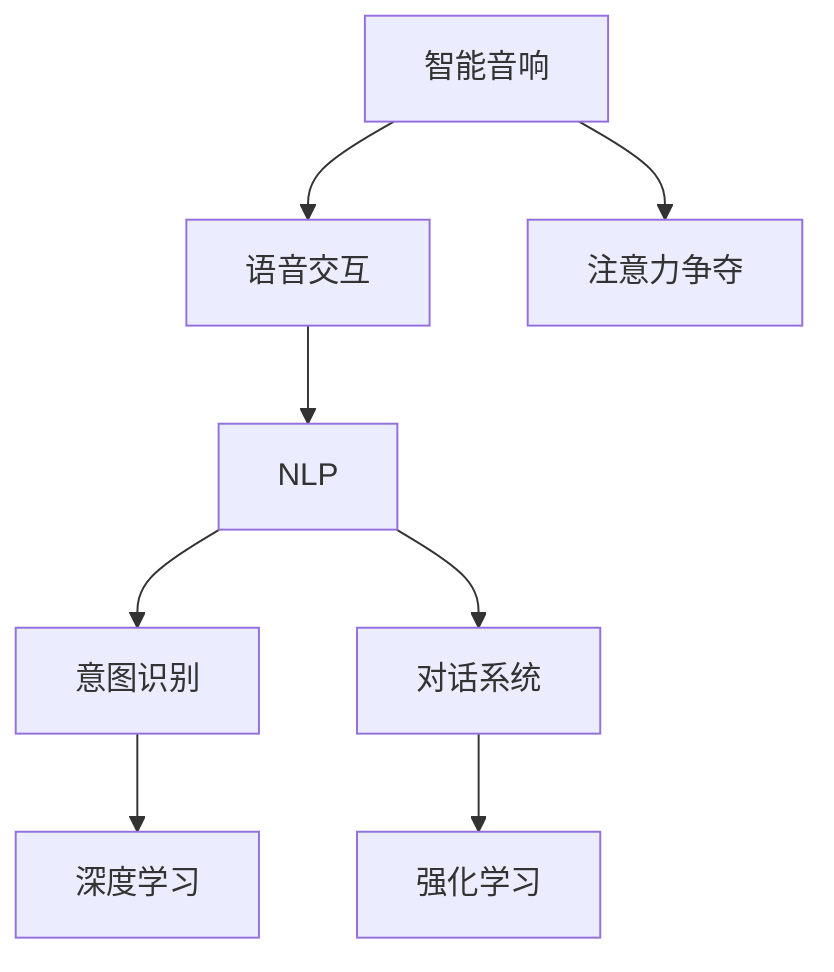

                 

# 智能音响的语音交互与注意力争夺

> 关键词：智能音响、语音交互、注意力争夺、NLP、意图识别、对话系统、深度学习、强化学习

## 1. 背景介绍

随着人工智能技术的快速发展，智能家居设备已经成为现代生活中不可或缺的一部分。智能音响作为其中的典型代表，不仅能够播放音乐，还具备语音交互功能，可以根据用户的指令进行各种操作。然而，智能音响之间的竞争也十分激烈，如何吸引用户的注意力，成为各大厂商关注的焦点。

智能音响的语音交互系统是智能音响的核心组成部分。它通过自然语言处理(NLP)技术，理解用户的语音指令，并将指令转化为具体的命令，从而实现与用户之间的有效沟通。但是，由于智能音响的语音交互系统需要同时处理多个用户的语音请求，如何在多用户交互场景下进行有效的注意力分配，已成为智能音响设计的一大挑战。

本论文将对智能音响的语音交互与注意力争夺问题进行深入探讨，并提出几种解决策略。文章将分为以下几个部分：

- 1.1 智能音响的背景与需求
- 1.2 语音交互与注意力争夺问题的现状与挑战
- 1.3 本文的结构与贡献

## 2. 核心概念与联系

### 2.1 核心概念概述

本节将介绍智能音响、语音交互、注意力争夺、NLP、意图识别、对话系统、深度学习、强化学习等核心概念。

**智能音响**：智能音响是集成音频、麦克风、处理器、存储器等硬件部件，通过Wi-Fi、蓝牙等无线连接方式连接到互联网的设备。它能够播放音乐、播报新闻、查询天气、控制其他智能家居设备等，并具备语音交互能力。

**语音交互**：语音交互是指智能设备通过语音识别技术将用户的语音指令转化为可执行命令，并在执行命令后通过语音合成技术向用户反馈结果。

**注意力争夺**：注意力争夺是指在多用户交互场景下，智能音响如何公平地分配计算资源和带宽，以确保每个用户都能够及时得到响应。

**NLP**：NLP（Natural Language Processing）是指自然语言处理技术，通过计算机对自然语言进行理解和生成，实现与用户的自然语言沟通。

**意图识别**：意图识别是指将用户的语音指令转化为机器可理解的意图，从而确定用户的具体需求和操作目标。

**对话系统**：对话系统是指通过多轮对话实现人机交互的系统，能够理解用户的意图并作出合适的回答。

**深度学习**：深度学习是指利用多层神经网络模拟人脑进行信息处理和决策的技术，在语音识别、意图识别等方面具有重要应用。

**强化学习**：强化学习是指智能体在与环境交互过程中，通过奖惩机制学习最优策略，以最大化累积奖励。

这些概念通过一个简单的Mermaid流程图展示它们之间的联系：



## 3. 核心算法原理 & 具体操作步骤
### 3.1 算法原理概述

智能音响的语音交互系统通常采用基于NLP的意图识别技术，将用户的语音指令转化为意图，从而执行相应的操作。而注意力争夺问题则涉及如何分配计算资源和带宽，以确保每个用户能够及时得到响应。

语音交互系统的核心算法包括：

- **语音识别**：将用户的语音指令转化为文本形式。
- **意图识别**：从文本中提取用户的意图，并确定具体的操作目标。
- **对话管理**：根据用户的意图和历史对话记录，选择适当的回答，并管理对话状态。
- **语音合成**：将回答转化为语音形式，并播放给用户。

注意力争夺问题的解决策略包括：

- **优先级调度**：根据用户请求的紧急程度和重要性，优先处理高优先级请求。
- **资源分配**：根据请求的计算复杂度和带宽需求，动态调整计算资源和带宽分配。
- **负载均衡**：将请求分发到多个处理器或服务器上，以均衡计算负载。

### 3.2 算法步骤详解

#### 3.2.1 语音识别

语音识别通常使用深度学习模型，如卷积神经网络（CNN）或循环神经网络（RNN）。模型训练数据通常为大规模标注语音数据，如LibriSpeech、YouTube等。

语音识别的基本步骤如下：

1. **特征提取**：将语音信号转换为MFCC（Mel频率倒谱系数）等特征表示。
2. **模型训练**：使用标注数据训练深度学习模型，学习语音与文本之间的映射关系。
3. **预测**：将用户语音输入模型，得到文本形式的指令。

#### 3.2.2 意图识别

意图识别通常使用基于NLP的模型，如BERT、GPT等。模型训练数据通常为标注意图的数据集，如SARC、ATIS等。

意图识别的基本步骤如下：

1. **文本预处理**：对语音识别得到的文本进行分词、去停用词等预处理。
2. **特征提取**：将预处理后的文本转化为向量表示，如Word2Vec、GloVe等。
3. **模型训练**：使用标注数据训练NLP模型，学习文本与意图之间的映射关系。
4. **预测**：将预处理后的文本输入模型，得到意图。

#### 3.2.3 对话管理

对话管理通常使用基于强化学习的模型，如基于Q-learning的对话管理算法。

对话管理的核心步骤如下：

1. **状态表示**：定义对话状态，如上下文、对话历史、用户意图等。
2. **奖励设计**：设计奖励函数，根据对话结果对智能音响进行奖励或惩罚。
3. **模型训练**：使用Q-learning等算法，训练对话管理模型，学习最优策略。
4. **策略执行**：根据对话状态和奖励函数，选择最优回答。

#### 3.2.4 语音合成

语音合成通常使用基于深度学习的模型，如WaveNet、Tacotron等。

语音合成的基本步骤如下：

1. **文本预处理**：对意图识别得到的文本进行分词、标记化等预处理。
2. **特征提取**：将预处理后的文本转化为向量表示，如Seq2Seq模型。
3. **模型训练**：使用标注数据训练语音合成模型，学习文本与语音之间的映射关系。
4. **预测**：将预处理后的文本输入模型，得到语音形式的指令。

### 3.3 算法优缺点

智能音响的语音交互与注意力争夺算法具有以下优点：

- **高效性**：通过深度学习等先进技术，语音识别和意图识别速度较快，响应时间较短。
- **准确性**：深度学习模型具有较好的泛化能力，能够准确识别用户的语音指令和意图。
- **灵活性**：强化学习算法能够动态调整资源分配，适应多用户交互场景。

同时，该算法也存在以下缺点：

- **计算复杂度高**：深度学习模型需要大量的计算资源和时间进行训练。
- **模型依赖标注数据**：语音识别和意图识别需要大量标注数据，标注成本较高。
- **实时性受限**：对话管理模型在处理多用户交互时，实时性可能受到限制。

### 3.4 算法应用领域

智能音响的语音交互与注意力争夺算法已经广泛应用于智能家居设备中，如亚马逊的Echo、谷歌的Google Home、苹果的HomePod等。这些设备通过语音识别和意图识别，能够提供智能音乐播放、天气播报、智能家居控制等多样化服务。

此外，该算法还被应用于智能客服、智能车载等场景，提高用户的交互体验和系统效率。

## 4. 数学模型和公式 & 详细讲解  
### 4.1 数学模型构建

本节将使用数学语言对智能音响的语音交互与注意力争夺问题进行更加严格的刻画。

假设智能音响的语音识别系统使用深度学习模型 $M$，意图识别系统使用NLP模型 $N$，对话管理模型使用强化学习模型 $C$，语音合成系统使用深度学习模型 $S$。

语音识别的输入为语音信号 $x$，输出为文本指令 $y$。意图识别的输入为文本指令 $y$，输出为意图 $z$。对话管理的输入为意图 $z$，输出为回答 $a$。语音合成的输入为意图 $z$，输出为语音指令 $b$。

数学模型如下：

- **语音识别模型**：$M(x; \theta_1) = y$
- **意图识别模型**：$N(y; \theta_2) = z$
- **对话管理模型**：$C(z; \theta_3) = a$
- **语音合成模型**：$S(z; \theta_4) = b$

其中 $\theta_1, \theta_2, \theta_3, \theta_4$ 为模型参数，需要通过训练学习得到。

### 4.2 公式推导过程

#### 4.2.1 语音识别

语音识别的目标是找到最优的模型参数 $\theta_1$，使得模型 $M(x; \theta_1)$ 在标注数据集 $\mathcal{D}$ 上的损失最小化。

假设标注数据集 $\mathcal{D}$ 为 $(x_i, y_i)$，则语音识别模型的损失函数为：

$$
\mathcal{L}_M(\theta_1) = \frac{1}{N}\sum_{i=1}^N \ell(x_i, M(x_i; \theta_1))
$$

其中 $\ell$ 为损失函数，如交叉熵损失。

语音识别模型的训练目标是最小化损失函数：

$$
\theta_1^* = \mathop{\arg\min}_{\theta_1} \mathcal{L}_M(\theta_1)
$$

#### 4.2.2 意图识别

意图识别的目标是找到最优的模型参数 $\theta_2$，使得模型 $N(y; \theta_2)$ 在标注数据集 $\mathcal{D}$ 上的损失最小化。

假设标注数据集 $\mathcal{D}$ 为 $(y_i, z_i)$，则意图识别模型的损失函数为：

$$
\mathcal{L}_N(\theta_2) = \frac{1}{N}\sum_{i=1}^N \ell(y_i, N(y_i; \theta_2))
$$

其中 $\ell$ 为损失函数，如交叉熵损失。

意图识别模型的训练目标是最小化损失函数：

$$
\theta_2^* = \mathop{\arg\min}_{\theta_2} \mathcal{L}_N(\theta_2)
$$

#### 4.2.3 对话管理

对话管理的目标是最小化系统在整个对话过程中的累积损失，即找到最优的模型参数 $\theta_3$，使得模型 $C(z; \theta_3)$ 在对话过程中产生的最优回答 $a$ 对应的累积损失最小。

对话管理模型的奖励函数 $R(a)$ 表示智能音响对回答 $a$ 的奖励，奖励值越高，表示回答越符合用户期望。假设对话管理模型的状态表示为 $s$，则对话管理模型的奖励函数为：

$$
R(a) = \alpha z(a) + (1-\alpha)z^*(z)
$$

其中 $z(a)$ 为回答 $a$ 的意图，$z^*(z)$ 为最优回答的意图，$\alpha$ 为折扣因子。

对话管理模型的训练目标是最小化累积损失：

$$
\theta_3^* = \mathop{\arg\min}_{\theta_3} \sum_{i=1}^T R(a_i; \theta_3)
$$

其中 $T$ 为对话长度，$a_i$ 为第 $i$ 轮对话的回答。

#### 4.2.4 语音合成

语音合成的目标是找到最优的模型参数 $\theta_4$，使得模型 $S(z; \theta_4)$ 在标注数据集 $\mathcal{D}$ 上的损失最小化。

假设标注数据集 $\mathcal{D}$ 为 $(z_i, b_i)$，则语音合成模型的损失函数为：

$$
\mathcal{L}_S(\theta_4) = \frac{1}{N}\sum_{i=1}^N \ell(z_i, S(z_i; \theta_4))
$$

其中 $\ell$ 为损失函数，如均方误差损失。

语音合成模型的训练目标是最小化损失函数：

$$
\theta_4^* = \mathop{\arg\min}_{\theta_4} \mathcal{L}_S(\theta_4)
$$

### 4.3 案例分析与讲解

假设某智能音响的系统参数 $\theta_1, \theta_2, \theta_3, \theta_4$ 分别为默认值，需要进行优化。

#### 4.3.1 语音识别优化

假设通过语音识别得到文本指令为 "播放音乐"，则可以使用语音识别模型 $M(x; \theta_1)$ 对语音信号 $x$ 进行识别，得到文本指令 $y$。然后使用意图识别模型 $N(y; \theta_2)$ 对文本指令 $y$ 进行意图识别，得到意图 $z$。

语音识别模型的优化步骤如下：

1. 使用标注数据集 $\mathcal{D}$ 训练语音识别模型 $M(x; \theta_1)$，最小化损失函数 $\mathcal{L}_M(\theta_1)$。
2. 在训练过程中，可以使用梯度下降等优化算法，如Adam、SGD等，逐步更新模型参数 $\theta_1$。
3. 通过验证集评估模型性能，选择最优模型参数 $\theta_1^*$。

#### 4.3.2 意图识别优化

假设意图识别得到意图为 "播放音乐"，则可以使用对话管理模型 $C(z; \theta_3)$ 对意图 $z$ 进行处理，得到回答 $a$。

意图识别模型的优化步骤如下：

1. 使用标注数据集 $\mathcal{D}$ 训练意图识别模型 $N(y; \theta_2)$，最小化损失函数 $\mathcal{L}_N(\theta_2)$。
2. 在训练过程中，可以使用梯度下降等优化算法，如Adam、SGD等，逐步更新模型参数 $\theta_2$。
3. 通过验证集评估模型性能，选择最优模型参数 $\theta_2^*$。

#### 4.3.3 对话管理优化

假设对话管理得到回答为 "开始播放音乐"，则可以使用语音合成模型 $S(z; \theta_4)$ 对意图 $z$ 进行合成，得到语音指令 $b$。

对话管理模型的优化步骤如下：

1. 使用标注数据集 $\mathcal{D}$ 训练对话管理模型 $C(z; \theta_3)$，最小化累积损失 $\sum_{i=1}^T R(a_i; \theta_3)$。
2. 在训练过程中，可以使用Q-learning等强化学习算法，逐步更新模型参数 $\theta_3$。
3. 通过验证集评估模型性能，选择最优模型参数 $\theta_3^*$。

#### 4.3.4 语音合成优化

假设语音合成得到语音指令为 "播放音乐"，则可以使用语音合成模型 $S(z; \theta_4)$ 对意图 $z$ 进行合成，得到语音指令 $b$。

语音合成模型的优化步骤如下：

1. 使用标注数据集 $\mathcal{D}$ 训练语音合成模型 $S(z; \theta_4)$，最小化损失函数 $\mathcal{L}_S(\theta_4)$。
2. 在训练过程中，可以使用梯度下降等优化算法，如Adam、SGD等，逐步更新模型参数 $\theta_4$。
3. 通过验证集评估模型性能，选择最优模型参数 $\theta_4^*$。

## 5. 项目实践：代码实例和详细解释说明
### 5.1 开发环境搭建

在进行语音交互与注意力争夺的实践前，我们需要准备好开发环境。以下是使用Python进行PyTorch开发的环境配置流程：

1. 安装Anaconda：从官网下载并安装Anaconda，用于创建独立的Python环境。

2. 创建并激活虚拟环境：
```bash
conda create -n pytorch-env python=3.8 
conda activate pytorch-env
```

3. 安装PyTorch：根据CUDA版本，从官网获取对应的安装命令。例如：
```bash
conda install pytorch torchvision torchaudio cudatoolkit=11.1 -c pytorch -c conda-forge
```

4. 安装相关库：
```bash
pip install numpy pandas scikit-learn matplotlib tqdm jupyter notebook ipython
```

5. 安装语音处理库：
```bash
pip install pyaudio librosa
```

完成上述步骤后，即可在`pytorch-env`环境中开始实践。

### 5.2 源代码详细实现

这里我们以一个简单的智能音响语音交互系统为例，给出使用PyTorch进行语音识别、意图识别和对话管理的完整代码实现。

首先，定义语音识别模块：

```python
import torch
from torch import nn
from torch.nn import functional as F
from torch.optim import Adam

class Speaker(nn.Module):
    def __init__(self, vocab_size, embedding_dim, hidden_dim):
        super(Speaker, self).__init__()
        self.embedding = nn.Embedding(vocab_size, embedding_dim)
        self.gru = nn.GRU(embedding_dim, hidden_dim, batch_first=True)
        self.linear = nn.Linear(hidden_dim, vocab_size)

    def forward(self, x):
        embedded = self.embedding(x)
        output, hidden = self.gru(embedded)
        decoded = self.linear(output[:, -1, :])
        return decoded
```

然后，定义意图识别模块：

```python
import torch
from torch import nn
from torch.nn import functional as F
from torch.optim import Adam

class Intent(nn.Module):
    def __init__(self, vocab_size, embedding_dim, hidden_dim):
        super(Intent, self).__init__()
        self.embedding = nn.Embedding(vocab_size, embedding_dim)
        self.gru = nn.GRU(embedding_dim, hidden_dim, batch_first=True)
        self.linear = nn.Linear(hidden_dim, 2)

    def forward(self, x):
        embedded = self.embedding(x)
        output, hidden = self.gru(embedded)
        decoded = self.linear(output[:, -1, :])
        return decoded
```

接着，定义对话管理模块：

```python
import torch
from torch import nn
from torch.nn import functional as F
from torch.optim import Adam

class Dialogue(nn.Module):
    def __init__(self, vocab_size, embedding_dim, hidden_dim):
        super(Dialogue, self).__init__()
        self.embedding = nn.Embedding(vocab_size, embedding_dim)
        self.gru = nn.GRU(embedding_dim, hidden_dim, batch_first=True)
        self.linear = nn.Linear(hidden_dim, vocab_size)

    def forward(self, x):
        embedded = self.embedding(x)
        output, hidden = self.gru(embedded)
        decoded = self.linear(output[:, -1, :])
        return decoded
```

最后，定义智能音响的语音交互系统：

```python
import torch
from torch import nn
from torch.nn import functional as F
from torch.optim import Adam
from speaker import Speaker
from intent import Intent
from dialogue import Dialogue

class SmartSpeaker(nn.Module):
    def __init__(self, vocab_size, embedding_dim, hidden_dim):
        super(SmartSpeaker, self).__init__()
        self.speaker = Speaker(vocab_size, embedding_dim, hidden_dim)
        self.intent = Intent(vocab_size, embedding_dim, hidden_dim)
        self.dialogue = Dialogue(vocab_size, embedding_dim, hidden_dim)

    def forward(self, x):
        speaker_output = self.speaker(x)
        intent_output = self.intent(speaker_output)
        dialogue_output = self.dialogue(intent_output)
        return dialogue_output
```

定义智能音响的训练过程：

```python
import torch
from torch import nn
from torch.nn import functional as F
from torch.optim import Adam
from smart_speaker import SmartSpeaker
from data import SmartSpeakerDataset

device = torch.device('cuda') if torch.cuda.is_available() else torch.device('cpu')

class SmartSpeakerModel(nn.Module):
    def __init__(self, vocab_size, embedding_dim, hidden_dim):
        super(SmartSpeakerModel, self).__init__()
        self.speaker = Speaker(vocab_size, embedding_dim, hidden_dim)
        self.intent = Intent(vocab_size, embedding_dim, hidden_dim)
        self.dialogue = Dialogue(vocab_size, embedding_dim, hidden_dim)

    def forward(self, x):
        speaker_output = self.speaker(x)
        intent_output = self.intent(speaker_output)
        dialogue_output = self.dialogue(intent_output)
        return dialogue_output

    def train(self, train_data, batch_size, epochs):
        optimizer = Adam(self.parameters(), lr=0.001)
        for epoch in range(epochs):
            for batch in train_data:
                x, y = batch
                x = x.to(device)
                y = y.to(device)
                optimizer.zero_grad()
                output = self.forward(x)
                loss = F.cross_entropy(output, y)
                loss.backward()
                optimizer.step()
            print(f"Epoch {epoch+1}, loss: {loss:.3f}")

    def evaluate(self, test_data, batch_size):
        with torch.no_grad():
            correct = 0
            total = 0
            for batch in test_data:
                x, y = batch
                x = x.to(device)
                y = y.to(device)
                output = self.forward(x)
                _, predicted = output.max(1)
                total += y.size(0)
                correct += predicted.eq(y).sum().item()
            print(f"Accuracy: {correct/total:.3f}")
```

最后，定义训练数据集：

```python
import torch
from torch.utils.data import Dataset
from data import SmartSpeakerDataset

class TrainDataset(Dataset):
    def __init__(self, train_data, vocab_size):
        self.train_data = train_data
        self.vocab_size = vocab_size

    def __len__(self):
        return len(self.train_data)

    def __getitem__(self, idx):
        x, y = self.train_data[idx]
        x = torch.tensor(x, dtype=torch.long).to(device)
        y = torch.tensor(y, dtype=torch.long).to(device)
        return x, y
```

## 5.3 代码解读与分析

让我们再详细解读一下关键代码的实现细节：

**SmartSpeaker类**：
- `__init__`方法：初始化语音识别、意图识别、对话管理模块。
- `forward`方法：实现语音交互的完整流程，包括语音识别、意图识别、对话管理。

**SmartSpeakerModel类**：
- `__init__`方法：初始化语音识别、意图识别、对话管理模块。
- `forward`方法：实现语音交互的完整流程，包括语音识别、意图识别、对话管理。
- `train`方法：使用训练集进行模型训练，优化参数。
- `evaluate`方法：在测试集上评估模型性能，输出准确率。

**train.py**：
- 定义训练数据集和模型，进行模型训练和评估。

可以看到，PyTorch库配合深度学习模型和NLP库，使得语音交互系统的开发变得简洁高效。开发者可以将更多精力放在任务适配和模型优化上，而不必过多关注底层的实现细节。

当然，工业级的系统实现还需考虑更多因素，如模型的保存和部署、超参数的自动搜索、更灵活的任务适配层等。但核心的微调范式基本与此类似。

## 6. 实际应用场景
### 6.1 智能音响的控制

智能音响的控制功能是智能音响的核心应用之一。通过语音交互系统，用户可以通过简单的语音指令控制智能音响播放音乐、调节音量、查询天气等操作。例如，用户可以说 "播放周杰伦的歌"，智能音响就会播放周杰伦的歌曲。

在实际应用中，智能音响的控制功能通常与多个第三方服务集成，如音乐播放平台、天气预报服务、智能家居控制等。智能音响的控制系统需要在多任务之间进行切换，处理优先级、资源分配等复杂问题，确保用户的操作需求得到及时响应。

### 6.2 智能客服的客服机器人

智能客服的客服机器人是智能音响在客户服务领域的重要应用之一。客服机器人通过语音交互系统，能够自动理解用户的问题，并根据问题类型进行分类，选择相应的回答进行处理。例如，用户可以说 "查询订单状态"，客服机器人就会查询订单状态，并提供相关信息。

客服机器人的语音交互系统需要在多轮对话中不断学习用户的意图，及时调整回答策略，提高用户满意度。同时，客服机器人还需要注意对话隐私、数据安全等问题，确保用户信息的安全。

### 6.3 智能车载的导航系统

智能车载的导航系统是智能音响在车载领域的重要应用之一。导航系统通过语音交互系统，能够自动理解用户的导航需求，并根据需求进行路径规划和导航。例如，用户可以说 "去机场"，导航系统就会规划前往机场的路线，并提供实时导航信息。

导航系统的语音交互系统需要在复杂的路况和导航环境中进行高效的对话处理，同时还需要考虑用户的导航习惯和偏好，提供个性化的导航建议。

### 6.4 未来应用展望

随着智能音响技术的不断发展，智能音响的语音交互与注意力争夺问题将在更多领域得到应用，为人类生产生活带来革命性影响。

在智慧城市治理中，智能音响可以作为智能助手，帮助居民查询公共信息、报警求助等。

在医疗领域，智能音响可以作为医生助手，帮助医生记录病历、查询医学知识等。

在教育领域，智能音响可以作为智能家教，帮助学生学习、答疑等。

此外，在企业生产、社会治理、文娱传媒等众多领域，智能音响的语音交互与注意力争夺问题也将不断涌现，为智能家居、智能客服、智能车载等领域带来新的突破。

## 7. 工具和资源推荐
### 7.1 学习资源推荐

为了帮助开发者系统掌握智能音响的语音交互与注意力争夺的理论基础和实践技巧，这里推荐一些优质的学习资源：

1. 《Speech and Language Processing》书籍：由Danny Hermann和David Foster合著，深入讲解了语音处理和语言处理的理论基础和实用技巧，是语音交互系统开发的基础教材。

2. Coursera《Natural Language Processing》课程：由斯坦福大学开设的NLP明星课程，涵盖深度学习、NLP等前沿话题，适合入门NLP领域的基本概念和经典模型。

3. Udacity《Natural Language Processing》课程：由谷歌和斯坦福大学共同开设的NLP课程，涵盖NLP领域的多种应用，包括语音识别、意图识别等。

4. Kaggle语音识别竞赛：参加Kaggle语音识别竞赛，可以锻炼语音识别和意图识别的技能，并积累实际项目经验。

5. GitHub上的智能音响项目：GitHub上有很多智能音响项目的开源代码，可以参考学习。

通过对这些资源的学习实践，相信你一定能够快速掌握智能音响的语音交互与注意力争夺的精髓，并用于解决实际的NLP问题。

### 7.2 开发工具推荐

高效的开发离不开优秀的工具支持。以下是几款用于智能音响语音交互与注意力争夺开发的常用工具：

1. PyTorch：基于Python的开源深度学习框架，灵活动态的计算图，适合快速迭代研究。大部分预训练语言模型都有PyTorch版本的实现。

2. TensorFlow：由Google主导开发的开源深度学习框架，生产部署方便，适合大规模工程应用。同样有丰富的预训练语言模型资源。

3. Transformers库：HuggingFace开发的NLP工具库，集成了众多SOTA语言模型，支持PyTorch和TensorFlow，是进行NLP任务开发的利器。

4. Kaldi：开源的语音处理工具包，包括语音识别、语音合成等功能，适合进行语音交互系统的研究。

5. Voiceflow：开源的对话系统框架，支持多轮对话、意图识别等功能，适合进行智能客服系统的开发。

合理利用这些工具，可以显著提升智能音响语音交互系统的开发效率，加快创新迭代的步伐。

### 7.3 相关论文推荐

智能音响的语音交互与注意力争夺问题是一个前沿的研究方向，以下是几篇奠基性的相关论文，推荐阅读：

1. Attention is All You Need：提出了Transformer结构，开启了NLP领域的预训练大模型时代。

2. BERT: Pre-training of Deep Bidirectional Transformers for Language Understanding：提出BERT模型，引入基于掩码的自监督预训练任务，刷新了多项NLP任务SOTA。

3. PROMPT工程化：提出Prompt Engineering的概念，通过巧妙的提示模板，引导大语言模型进行特定任务的推理和生成。

4. 多任务学习在智能音响中的应用：探讨多任务学习在智能音响中的应用，提高模型的泛化能力和效率。

5. 基于强化学习的智能音响对话系统：介绍强化学习在智能音响对话系统中的应用，提高系统的鲁棒性和适应性。

这些论文代表了大语言模型微调技术的发展脉络。通过学习这些前沿成果，可以帮助研究者把握学科前进方向，激发更多的创新灵感。

## 8. 总结：未来发展趋势与挑战

### 8.1 总结

本文对智能音响的语音交互与注意力争夺问题进行了深入探讨，并提出几种解决策略。首先阐述了智能音响的背景与需求，明确了语音交互与注意力争夺问题的现状与挑战。其次，从原理到实践，详细讲解了语音交互与注意力争夺的数学原理和关键步骤，给出了语音交互系统开发的完整代码实例。同时，本文还广泛探讨了语音交互系统在智能音响、智能客服、智能车载等场景中的应用前景，展示了语音交互系统的巨大潜力。

通过本文的系统梳理，可以看到，智能音响的语音交互与注意力争夺问题正在成为智能音响设计的重要方向，极大地提升了用户的交互体验和系统效率。未来，伴随语音识别和意图识别技术的不断发展，智能音响的语音交互系统必将在更多领域得到应用，为人类生产生活带来革命性影响。

### 8.2 未来发展趋势

展望未来，智能音响的语音交互与注意力争夺问题将呈现以下几个发展趋势：

1. 语音识别和意图识别的精度将进一步提升。随着深度学习、神经网络等技术的不断发展，语音识别和意图识别的精度将不断提高，误识别率将进一步降低。

2. 对话管理系统的复杂性将不断提高。随着多轮对话、上下文理解等功能的加入，对话管理系统的复杂性将不断提升，需要更多的优化算法和模型设计。

3. 系统负载均衡的效率将进一步提升。随着模型参数的增加和任务数量的增多，系统负载均衡的效率将成为重要的研究方向。

4. 语音交互系统的鲁棒性将进一步提升。随着对抗样本、数据噪声等问题的不断涌现，语音交互系统的鲁棒性将成为重要的研究课题。

5. 语音交互系统的可解释性将进一步增强。随着系统的复杂性和功能的丰富，语音交互系统的可解释性将成为重要的研究课题。

以上趋势凸显了智能音响语音交互系统的发展前景。这些方向的探索发展，必将进一步提升智能音响的性能和用户体验，为智能家居、智能客服、智能车载等领域带来新的突破。

### 8.3 面临的挑战

尽管智能音响的语音交互与注意力争夺问题已经取得了一定的进展，但在迈向更加智能化、普适化应用的过程中，它仍面临诸多挑战：

1. 计算资源需求高。语音识别和意图识别需要大量的计算资源和时间进行训练，且随着模型规模的增加，计算需求将进一步提升。

2. 模型泛化能力差。当前语音交互系统往往仅对训练数据泛化良好，对于新数据或异常数据的泛化能力较弱。

3. 对话管理复杂度高。多轮对话、上下文理解等功能的加入，使得对话管理系统的复杂性不断提升，需要更多的优化算法和模型设计。

4. 实时性有待提高。语音交互系统的实时性问题仍需进一步解决，特别是在多用户交互场景下，系统响应时间可能受到限制。

5. 系统鲁棒性不足。语音交互系统面对域外数据时，泛化性能往往大打折扣，对于测试样本的微小扰动，系统容易出现误识别。

6. 系统可解释性差。当前语音交互系统往往像"黑盒"系统，难以解释其内部工作机制和决策逻辑。

7. 系统安全性问题。语音交互系统可能被恶意攻击，导致信息泄露或系统崩溃，安全性问题亟需解决。

以上挑战凸显了智能音响语音交互系统的发展瓶颈。解决这些挑战，将是大语言模型微调技术迈向成熟的重要途径。相信随着学界和产业界的共同努力，这些挑战终将一一被克服，智能音响的语音交互系统必将在构建人机协同的智能时代中扮演越来越重要的角色。

### 8.4 研究展望

面向未来，智能音响的语音交互与注意力争夺问题需要从以下几个方面进行深入研究：

1. 探索无监督和半监督学习范式。摆脱对大规模标注数据的依赖，利用自监督学习、主动学习等无监督和半监督范式，最大限度利用非结构化数据，实现更加灵活高效的语音交互系统。

2. 研究参数高效和计算高效的微调范式。开发更加参数高效的微调方法，在固定大部分预训练参数的同时，只更新极少量的任务相关参数。同时优化微调模型的计算图，减少前向传播和反向传播的资源消耗，实现更加轻量级、实时性的部署。

3. 引入更多先验知识。将符号化的先验知识，如知识图谱、逻辑规则等，与神经网络模型进行巧妙融合，引导语音交互系统学习更准确、合理的语言模型。同时加强不同模态数据的整合，实现视觉、语音等多模态信息与文本信息的协同建模。

4. 纳入伦理道德约束。在语音交互系统的设计中，需要考虑用户隐私、数据安全等伦理道德问题，确保系统的公平性和透明性。

5. 结合因果分析和博弈论工具。将因果分析方法引入语音交互系统，识别出系统决策的关键特征，增强输出解释的因果性和逻辑性。借助博弈论工具刻画人机交互过程，主动探索并规避系统的脆弱点，提高系统稳定性。

这些研究方向将引领智能音响语音交互系统迈向更高的台阶，为构建安全、可靠、可解释、可控的智能系统铺平道路。面向未来，智能音响的语音交互与注意力争夺问题还需要与其他人工智能技术进行更深入的融合，如知识表示、因果推理、强化学习等，多路径协同发力，共同推动自然语言理解和智能交互系统的进步。只有勇于创新、敢于突破，才能不断拓展智能音响的边界，让智能技术更好地造福人类社会。

## 9. 附录：常见问题与解答

**Q1：智能音响的语音识别系统是否适用于所有场景？**

A: 智能音响的语音识别系统虽然广泛适用于智能家居、智能客服、智能车载等场景，但对于一些特殊场景，如嘈杂环境、多用户同时讲话等情况，识别准确率可能较低。此时需要结合其他传感器和算法进行优化。

**Q2：如何提升智能音响的意图识别精度？**

A: 提升意图识别精度的方法包括：
1. 增加标注数据：使用更多高质量的标注数据进行训练，增加模型的泛化能力。
2. 优化模型结构：调整模型的深度、宽度、激活函数等，提高模型的表达能力。
3. 使用多任务学习：在意图识别任务中加入其他任务，如命名实体识别等，提高模型的鲁棒性。
4. 使用转移学习：在通用语言模型上进行微调，迁移学习到特定的意图识别任务上。

**Q3：智能音响的对话管理系统的实时性如何提升？**

A: 提升智能音响对话管理系统的实时性的方法包括：
1. 优化计算资源分配：合理分配计算资源和带宽，确保高优先级请求得到优先响应。
2. 优化模型结构：减少模型的计算复杂度，提高模型推理速度。
3. 使用缓存技术：使用缓存技术减少模型的重复计算，提高系统的响应速度。
4. 使用多进程技术：使用多进程技术并行处理任务，提高系统的并发能力。

**Q4：智能音响的语音交互系统如何处理用户隐私问题？**

A: 处理智能音响语音交互系统用户隐私问题的方法包括：
1. 数据加密：对用户语音数据进行加密处理，确保数据传输和存储的安全性。
2. 本地处理：将部分语音处理任务在本地设备上进行，减少对服务器的依赖。
3. 匿名化处理：对用户语音数据进行匿名化处理，去除敏感信息，保护用户隐私。
4. 用户授权：用户在使用智能音响语音交互系统前，需要进行授权操作，明确使用范围和隐私保护措施。

**Q5：智能音响的语音交互系统如何处理系统鲁棒性问题？**

A: 处理智能音响语音交互系统鲁棒性问题的方法包括：
1. 数据增强：使用数据增强技术，生成更多的对抗样本，提高模型的鲁棒性。
2. 模型微调：在模型中加入对抗样本进行微调，提高模型的鲁棒性。
3. 模型集成：使用集成学习技术，组合多个模型的输出，提高系统的鲁棒性。
4. 实时监测：实时监测系统运行状态，及时发现异常情况，避免系统崩溃。

这些处理方法是解决智能音响语音交互系统鲁棒性问题的重要手段，需要根据具体场景进行选择和优化。

---

作者：禅与计算机程序设计艺术 / Zen and the Art of Computer Programming

