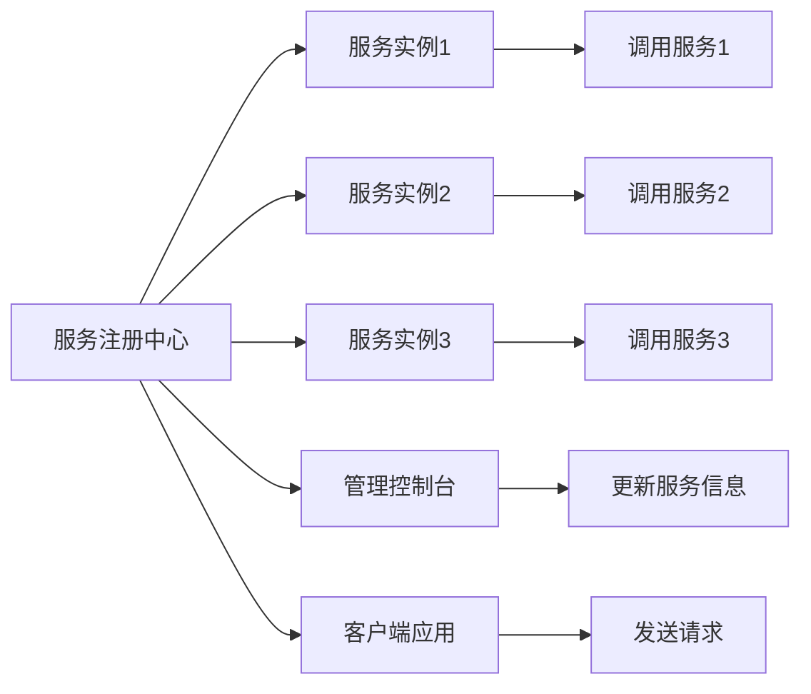

                 

# 服务注册和负载平衡器的作用

## 1. 背景介绍

在现代分布式系统中，微服务架构作为一种敏捷、高效的开发方式，得到了广泛的应用。微服务架构通过将应用程序拆分成多个独立的服务单元，实现了服务的模块化和自治化，大大提高了系统的扩展性、灵活性和稳定性。然而，随着服务数量的不断增加，如何管理这些服务之间的交互，确保服务的可靠性和高效性，成为了一个严峻的挑战。为此，服务注册和负载平衡器作为微服务架构的核心组件，扮演了至关重要的角色。

## 2. 核心概念与联系

### 2.1 核心概念概述

服务注册和负载平衡器是微服务架构中两个至关重要的组件。服务注册器负责将服务实例的信息（如服务名称、地址、端口等）动态注册到中心化注册中心，以便其他服务能够发现并调用这些服务。负载平衡器则根据当前服务的状态和负载情况，智能地分配请求到合适的服务实例上，以确保服务的可用性和性能。

### 2.2 核心概念原理和架构的 Mermaid 流程图



## 3. 核心算法原理 & 具体操作步骤

### 3.1 算法原理概述

服务注册和负载平衡器的基本原理可以概括为以下几点：

1. **服务注册**：服务实例在启动时向注册中心注册自己的信息，包括服务名称、地址、端口等。注册中心将服务信息存储在中心化的数据库中，供其他服务查询和使用。
2. **服务发现**：其他服务在需要调用某个服务时，通过注册中心查询该服务的信息，获取服务实例的地址和端口。
3. **负载平衡**：根据当前的负载情况和策略，负载平衡器将请求分配到合适的服务实例上，以确保服务的可用性和性能。

### 3.2 算法步骤详解

以下是服务注册和负载平衡器的主要步骤：

1. **服务注册**：
   - 服务实例在启动时，通过网络协议（如HTTP、gRPC）向注册中心发送注册请求，包含服务名称、地址、端口等关键信息。
   - 注册中心收到注册请求后，将服务信息存储到中心化的数据库中，如Redis、Eureka、Consul等。
   - 注册请求处理完成后，注册中心返回确认信息，通知服务实例注册成功。

2. **服务发现**：
   - 其他服务在需要调用某个服务时，通过注册中心查询该服务的信息。注册中心返回所有可用的服务实例地址和端口。
   - 调用方根据返回的信息，选择合适的服务实例进行调用。

3. **负载平衡**：
   - 负载平衡器收到请求后，根据当前服务的状态和负载情况，选择一个合适的服务实例进行调用。
   - 负载平衡器可以使用不同的负载均衡算法，如轮询、随机、最小连接数等，确保请求的均衡分配。
   - 调用完成后，负载平衡器更新服务实例的状态，以便下次调用时能够更好地分配请求。

### 3.3 算法优缺点

**优点**：

1. **服务自治**：每个服务都是独立运行的，不受其他服务的限制，提高了系统的灵活性和可扩展性。
2. **故障隔离**：服务之间的隔离性，使得某个服务的故障不会影响其他服务，提高了系统的稳定性。
3. **高可用性**：通过负载平衡和故障转移机制，确保服务的可用性和高可靠性。

**缺点**：

1. **系统复杂度**：服务注册和负载平衡器的引入，增加了系统的复杂度和维护成本。
2. **性能损失**：服务注册和负载平衡器会带来一定的性能损失，尤其是在高并发环境下。
3. **网络开销**：服务注册和负载平衡器需要在网络中进行数据交换，增加了网络开销。

### 3.4 算法应用领域

服务注册和负载平衡器在各种分布式系统中都有广泛应用，包括但不限于以下领域：

1. **微服务架构**：微服务架构的核心组件，负责服务发现和负载平衡。
2. **云计算平台**：如AWS、Google Cloud、阿里云等，提供了内置的服务注册和负载平衡服务。
3. **中间件**：如Netflix的Eureka、Hystrix等，提供基于Java的服务治理能力。
4. **DevOps自动化工具**：如Jenkins、Kubernetes等，集成服务注册和负载平衡功能，实现自动化的服务部署和监控。

## 4. 数学模型和公式 & 详细讲解 & 举例说明

### 4.1 数学模型构建

在服务注册和负载平衡过程中，可以通过数学模型来描述服务实例的状态和行为。以下是一个简单的数学模型：

1. **服务实例状态**：
   - 可用（Up）：服务实例可以正常处理请求。
   - 不可用（Down）：服务实例无法处理请求。

2. **请求负载**：
   - 当前请求数（Current Request）：当前正在处理请求的数量。
   - 最大请求数（Max Request）：服务实例的最大请求数。

### 4.2 公式推导过程

1. **可用服务数量计算**：
   $$
   Available = Up - Down
   $$

2. **请求负载计算**：
   $$
   Request Load = \frac{Current Request}{Max Request}
   $$

3. **负载均衡策略**：
   - **轮询（Round Robin）**：将请求依次分配给服务实例，不考虑实例的负载情况。
   - **随机（Random）**：随机选择一个服务实例进行请求分配。
   - **最小连接数（Least Connections）**：选择连接数最少的服务实例进行请求分配。

### 4.3 案例分析与讲解

假设有一个包含三个服务实例的服务集群，服务实例的状态如下：

- 服务实例1：可用，请求负载为30%
- 服务实例2：可用，请求负载为50%
- 服务实例3：不可用，请求负载为0%

根据轮询算法，请求依次分配给服务实例1、2、1、2、1、2……，能够实现请求的均衡分配，但服务实例3的不可用状态会影响到整个负载均衡的效果。

## 5. 项目实践：代码实例和详细解释说明

### 5.1 开发环境搭建

在搭建服务注册和负载平衡器的开发环境时，需要安装和配置以下工具和组件：

1. **编程语言**：推荐使用Java、Python、Go等主流编程语言。
2. **数据库**：推荐使用Redis、MySQL、MongoDB等关系型或非关系型数据库。
3. **网络协议**：支持HTTP、gRPC、Thrift等常用的网络通信协议。
4. **容器化工具**：推荐使用Docker、Kubernetes等容器化工具，实现服务的自动化部署和扩展。

### 5.2 源代码详细实现

以下是一个基于Spring Boot的Java服务注册和负载平衡器的示例代码：

```java
@RestController
public class ServiceRegistrationController {
    @Autowired
    private ServiceRegistry registry;

    @PostMapping("/register")
    public ResponseEntity<String> register(@RequestBody ServiceInfo info) {
        registry.register(info);
        return ResponseEntity.ok("Service registered successfully");
    }

    @GetMapping("/lookup")
    public List<ServiceInfo> lookup(@RequestParam String serviceName) {
        return registry.lookup(serviceName);
    }
}

@Service
public class ServiceRegistry {
    private Map<String, List<ServiceInstance>> registryMap = new ConcurrentHashMap<>();

    public void register(ServiceInfo info) {
        registryMap.computeIfAbsent(info.getServiceName(), key -> new ArrayList<>()).add(info);
    }

    public List<ServiceInfo> lookup(String serviceName) {
        return registryMap.getOrDefault(serviceName, new ArrayList<>());
    }
}

@AllArgsConstructor
@Data
public class ServiceInfo {
    private String serviceName;
    private String host;
    private int port;
    private List<ServiceInstance> instances;
}

@AllArgsConstructor
@Data
public class ServiceInstance {
    private String host;
    private int port;
    private int currentRequest;
    private int maxRequest;
    private boolean up;
}
```

### 5.3 代码解读与分析

**ServiceRegistrationController类**：
- `register`方法：接收服务信息，调用`ServiceRegistry`进行注册。
- `lookup`方法：接收服务名称，调用`ServiceRegistry`进行服务实例的查找。

**ServiceRegistry类**：
- `registryMap`：使用ConcurrentHashMap存储服务实例的映射关系。
- `register`方法：根据服务名称将服务实例添加到registryMap中。
- `lookup`方法：根据服务名称获取所有可用的服务实例。

**ServiceInfo和ServiceInstance类**：
- `ServiceInfo`：服务信息类，包含服务名称、地址、端口等。
- `ServiceInstance`：服务实例类，包含服务实例的地址、端口、当前请求数、最大请求数和状态。

### 5.4 运行结果展示

运行上述示例代码，可以完成服务注册和查询功能。使用类似`curl`的命令向`/register`路径发送POST请求，注册服务实例。然后，通过`/lookup`路径发送GET请求，获取所有可用的服务实例。

## 6. 实际应用场景

### 6.1 服务注册和负载平衡器的应用场景

服务注册和负载平衡器在实际应用中具有广泛的应用场景，例如：

1. **Web应用**：如Apache Tomcat、Nginx等，提供服务注册和负载平衡功能，支持动态服务部署和负载均衡。
2. **容器化应用**：如Kubernetes、Docker Swarm等，提供服务注册和负载平衡能力，支持自动化的服务管理。
3. **大数据处理**：如Hadoop、Spark等，提供服务注册和负载平衡功能，支持大规模数据处理任务的调度。
4. **云平台**：如AWS、Google Cloud等，提供内置的服务治理能力，支持微服务的动态管理和负载均衡。

### 6.2 未来应用展望

随着微服务架构和分布式系统的进一步发展，服务注册和负载平衡器将在以下几个方面发挥更大的作用：

1. **自动化部署和监控**：通过服务注册和负载平衡器的集成，实现服务的自动化部署、监控和故障自动恢复。
2. **多云服务治理**：支持跨云平台的多云服务治理，实现服务的高可用性和灵活性。
3. **边缘计算支持**：支持边缘计算中的服务注册和负载平衡，提供更近的访问和服务响应。
4. **安全性和隐私保护**：通过服务注册和负载平衡器，实现服务的认证和授权，保障服务的安全性和隐私性。

## 7. 工具和资源推荐

### 7.1 学习资源推荐

为了帮助开发者系统掌握服务注册和负载平衡器的原理和实践，这里推荐一些优质的学习资源：

1. **《Spring Cloud Microservice Architecture》**：Spring Cloud官方文档，介绍了微服务架构的实现和最佳实践，包括服务注册和负载平衡器的应用。
2. **《Kubernetes Essentials》**：Kubernetes官方文档，介绍了Kubernetes的架构和应用，包括服务注册和负载平衡器的配置和部署。
3. **《Docker Deep Dive》**：Docker官方文档，介绍了Docker的架构和应用，包括服务注册和负载平衡器的集成和优化。
4. **《微服务架构设计模式》**：讲解了微服务架构的设计模式和最佳实践，包括服务注册和负载平衡器的应用。
5. **《服务治理框架：ZooKeeper》**：介绍ZooKeeper作为服务注册和负载平衡中心的使用方法，支持高可用和分布式服务治理。

### 7.2 开发工具推荐

高效的服务注册和负载平衡器开发离不开优秀的工具支持。以下是几款用于服务注册和负载平衡器开发的常用工具：

1. **Spring Cloud**：基于Spring Boot的微服务框架，提供服务注册和负载平衡器的集成和支持。
2. **Kubernetes**：支持微服务的自动化部署和扩展，提供服务注册和负载平衡的功能。
3. **Docker**：支持服务的容器化部署和扩展，提供服务注册和负载平衡的支持。
4. **Nginx**：支持HTTP负载平衡和缓存功能，提供服务注册和负载平衡的能力。
5. **Apache Tomcat**：支持Java服务的部署和负载平衡，提供服务注册和负载平衡的支持。

### 7.3 相关论文推荐

服务注册和负载平衡器的发展得益于学界的持续研究。以下是几篇奠基性的相关论文，推荐阅读：

1. **"Dynamic Configuration of Application Components"**：Kay和Gilpin在1986年提出了动态配置的概念，为现代服务注册和配置提供了理论基础。
2. **"Load Balancing Algorithms for Stateful and Stateless Services"**：Brendan McGough在2003年提出了基于最小连接数和轮询的负载平衡算法，为负载平衡器提供了理论依据。
3. **"Service Discovery in the Cloud"**：Bryan Konieczny等人在2015年讨论了云平台的服务发现和负载平衡，探讨了服务注册和负载平衡的实现。
4. **"Efficient Load Balancing for High-Performance Cloud Computing Clusters"**：Gerasimos Orfanos和Juriy Perloff在2007年提出了基于遗传算法和模拟退火的负载平衡算法，为负载平衡器的优化提供了新的思路。
5. **"Microservice Architectures: A Survey"**：Scott Blau在2019年讨论了微服务架构的现状和未来，探讨了服务注册和负载平衡器的应用。

## 8. 总结：未来发展趋势与挑战

### 8.1 总结

本文对服务注册和负载平衡器的原理和实践进行了全面系统的介绍。首先阐述了服务注册和负载平衡器的背景和重要性，明确了它们在微服务架构中的核心作用。其次，从原理到实践，详细讲解了服务注册和负载平衡的数学模型、算法步骤和实现细节。同时，本文还广泛探讨了服务注册和负载平衡器在实际应用中的多种场景，展示了它们的应用潜力。最后，本文精选了服务注册和负载平衡器的学习资源、开发工具和相关论文，力求为读者提供全方位的技术指引。

通过本文的系统梳理，可以看到，服务注册和负载平衡器作为微服务架构的核心组件，在提升系统的可扩展性、灵活性和稳定性方面发挥了至关重要的作用。服务注册和负载平衡器的应用，使得微服务架构能够更好地支持分布式系统的构建和运营，确保服务的高可用性和高效性。未来，伴随服务注册和负载平衡技术的不断演进，微服务架构必将在各个行业得到更广泛的应用，为系统建设和业务发展注入新的动力。

### 8.2 未来发展趋势

展望未来，服务注册和负载平衡器将在以下几个方向继续发展：

1. **自动化部署和配置**：进一步完善自动化部署和配置功能，支持服务的快速扩展和故障自动恢复。
2. **多云和边缘计算支持**：支持多云和边缘计算中的服务注册和负载平衡，提供更灵活的服务治理能力。
3. **可伸缩性和性能优化**：通过引入缓存、分布式锁等技术，提高服务的可伸缩性和性能，支持大规模数据的处理和存储。
4. **安全性和隐私保护**：引入认证和授权机制，保障服务的安全性和隐私性，支持合规性和标准化的应用。
5. **用户体验和响应速度**：通过智能路由和负载平衡算法，提升服务的响应速度和用户体验，支持更高效的服务处理。

### 8.3 面临的挑战

尽管服务注册和负载平衡器在微服务架构中扮演了重要角色，但在其发展过程中仍然面临诸多挑战：

1. **性能瓶颈**：在大规模高并发环境下，服务注册和负载平衡器可能会面临性能瓶颈，需要优化算法和架构设计。
2. **系统复杂度**：服务注册和负载平衡器的引入，增加了系统的复杂度和维护成本，需要设计合理的接口和架构。
3. **安全性和隐私保护**：服务注册和负载平衡器需要保障服务的安全性和隐私性，防止恶意攻击和数据泄露。
4. **兼容性问题**：不同厂商和平台的服务注册和负载平衡器可能存在兼容性问题，需要进行标准的统一和兼容性测试。

### 8.4 研究展望

面对服务注册和负载平衡器所面临的挑战，未来的研究需要在以下几个方面寻求新的突破：

1. **分布式一致性**：在分布式系统中，服务注册和负载平衡器需要保证数据的一致性和可用性，需要引入分布式事务和一致性协议。
2. **多维度负载评估**：除了服务实例的连接数，还需要考虑其他维度（如请求延迟、响应时间等）的负载评估，引入综合评估算法。
3. **资源优化和利用**：优化资源的使用和调度，引入资源竞争和优化算法，提高系统的利用率和性能。
4. **高可用性和故障恢复**：引入容错和故障恢复机制，支持服务的自动恢复和重试，提高系统的可靠性。
5. **智能路由和调度**：引入智能路由和调度算法，支持动态负载平衡和自动化服务部署，提高系统的灵活性和可扩展性。

这些研究方向将推动服务注册和负载平衡器技术的发展，为构建更高效、可靠、灵活的微服务架构奠定基础。相信随着技术的不懈探索和实践的不断积累，服务注册和负载平衡器必将在分布式系统中发挥更大的作用，引领微服务架构迈向更高的台阶。

## 9. 附录：常见问题与解答

**Q1：什么是服务注册和负载平衡器？**

A: 服务注册和负载平衡器是微服务架构中两个至关重要的组件。服务注册器负责将服务实例的信息动态注册到中心化注册中心，以便其他服务能够发现并调用这些服务。负载平衡器则根据当前服务的状态和负载情况，智能地分配请求到合适的服务实例上，以确保服务的可用性和性能。

**Q2：服务注册和负载平衡器有哪些优缺点？**

A: 服务注册和负载平衡器的优点包括：服务自治、故障隔离、高可用性等。缺点包括：系统复杂度、性能损失、网络开销等。

**Q3：服务注册和负载平衡器在实际应用中如何优化性能？**

A: 服务注册和负载平衡器可以通过优化算法和架构设计来提高性能。例如，采用缓存技术、分布式锁、智能路由和调度算法等手段，提高系统的利用率和响应速度。

**Q4：服务注册和负载平衡器在多云环境中的挑战是什么？**

A: 服务注册和负载平衡器在多云环境中的挑战包括：兼容性和一致性问题、跨云资源管理、数据同步等。需要引入跨云服务治理和资源调度的解决方案，确保服务的统一管理和高效运行。

**Q5：服务注册和负载平衡器如何保障服务的安全性和隐私性？**

A: 服务注册和负载平衡器可以通过引入认证和授权机制，保障服务的安全性和隐私性。例如，采用TLS加密、OAuth2认证、权限管理等手段，防止恶意攻击和数据泄露。

---

作者：禅与计算机程序设计艺术 / Zen and the Art of Computer Programming

