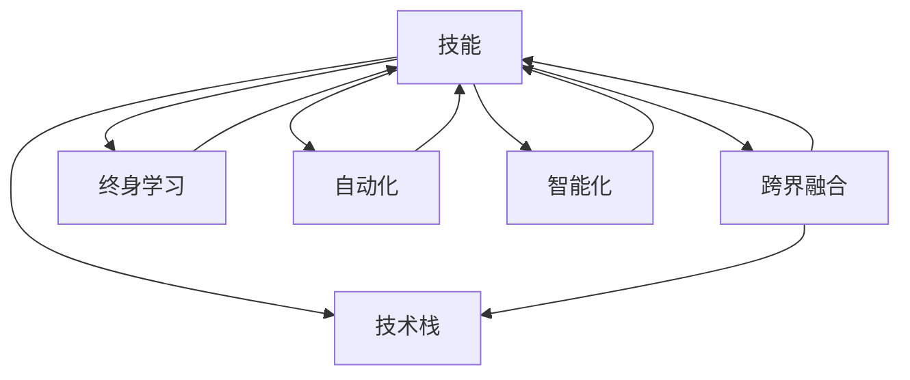

                 

## 1. 背景介绍

在快速变革的技术环境中，未来的工作场景将经历巨大转型。随着人工智能、大数据、云计算等新兴技术的发展，对于从业者的技能需求也正在发生深刻变化。本文将深入探讨这些变化，并提出相应的技能培养策略。

### 1.1 技术变革趋势
当前，技术发展迅猛，尤其是人工智能、大数据、物联网、云计算、区块链等领域的突破性进展，正在重塑各个行业的工作方式。这些技术的普及将带来更高效的生产力、更个性化的用户体验、更智能的决策支持。例如，自动化、智能化生产线的引入将减少人工参与，增强效率和精度；大数据分析将带来更精准的市场预测和用户画像；云计算和边缘计算将为海量数据处理和实时响应提供新的解决方案；区块链技术则将为数据安全、透明度、隐私保护带来革命性变化。

### 1.2 未来工作场景
随着技术的不断发展，未来的工作场景将呈现出以下几个趋势：
- **自动化与智能化**：越来越多的重复性、机械性任务将由机器自动完成，人类更多地从事创意、策略、管理等工作。
- **跨界融合**：不同行业间的界限将变得模糊，跨学科的技能组合将变得更加重要。
- **远程与弹性工作**：远程工作、弹性工作时间将更加普及，工作方式将更加灵活。
- **终身学习**：持续学习将成为职业生涯的常态，个人需要通过不断更新技能来适应快速变化的技术环境。

## 2. 核心概念与联系

### 2.1 核心概念概述

- **技能**：指在特定领域或任务中表现优异的知识、能力和经验，通常通过学习和实践获得。
- **技术栈**：指用于完成特定任务或项目所需的技术和工具的集合，包括编程语言、框架、库、平台等。
- **跨界融合**：不同领域、学科之间的知识和技能融合，形成新的能力和价值。
- **终身学习**：在职业生涯中持续学习新技术、新知识，保持与技术发展的同步。
- **自动化**：利用技术工具自动化完成重复性、机械性任务，提高效率和准确性。
- **智能化**：运用人工智能技术，增强系统决策和执行的智能化水平，提升用户体验。

这些概念之间的关系可以通过以下Mermaid流程图来展示：



这个流程图展示了技能与技术栈、跨界融合、终身学习、自动化、智能化之间的关系：

1. 技能是技术栈的基础，通过学习和实践掌握各种技术和工具。
2. 跨界融合可以拓展技能的广度和深度，形成新的能力。
3. 终身学习确保技能不断更新，跟上技术发展。
4. 自动化和智能化提升工作效率和决策水平，带来更好的用户体验。

## 3. 核心算法原理 & 具体操作步骤
### 3.1 算法原理概述

技能培养的核心算法原理是迁移学习（Transfer Learning），即在已有经验的基础上，通过学习和应用新知识来提升技能水平。这一原理可以应用于多个领域，如编程、数据分析、项目管理等。

### 3.2 算法步骤详解

技能培养的迁移学习过程包括以下几个关键步骤：

**Step 1: 确定目标技能**
- 识别当前工作所需的关键技能，包括技术技能和软技能。
- 结合行业趋势，确定未来所需的新兴技能。

**Step 2: 识别知识差距**
- 对比现有技能与目标技能，识别知识缺口。
- 分析知识差距的深度和广度，确定学习优先级。

**Step 3: 制定学习计划**
- 根据知识差距，制定详细的学习计划，包括学习内容、时间安排、资源选择等。
- 选择适合的学习方法和工具，如在线课程、工作坊、实践项目等。

**Step 4: 实施学习过程**
- 按照学习计划进行系统学习，逐步掌握新知识和技能。
- 结合实际项目或任务，实践和应用所学技能，提升实战能力。

**Step 5: 评估和反馈**
- 定期评估学习成果，通过测试、项目评估等方式，检验学习效果。
- 获取反馈信息，调整学习策略，优化学习路径。

### 3.3 算法优缺点

迁移学习的技能培养方法具有以下优点：
1. 高效性：通过已有经验的基础，学习新技能的时间显著缩短。
2. 系统性：有计划地学习新技能，避免盲目和无序。
3. 实用性强：学习内容紧密结合实际工作需求，提升实战能力。
4. 灵活性：可以在线、线下、自学、导师指导等多种形式下进行。

同时，该方法也存在一些局限性：
1. 知识更新较快：新兴技能层出不穷，需要持续关注和适应。
2. 学习效果因人而异：不同人接受新知识的能力和效率存在差异。
3. 资源投入较高：高质量的学习资源和实践项目需要投入一定的时间和金钱。
4. 学习动力不足：长期学习需要较强的自我驱动力和外部激励。

### 3.4 算法应用领域

基于迁移学习的技能培养方法在多个领域都有广泛应用，如：

- **编程与软件开发**：通过学习新编程语言、框架和工具，提升编程技能和开发效率。
- **数据分析与机器学习**：掌握数据分析工具、统计方法、机器学习算法，提升数据处理和建模能力。
- **项目管理**：学习敏捷管理、Scrum、Kanban等项目管理工具，提升项目管理和团队协作能力。
- **人工智能与智能系统**：掌握深度学习、自然语言处理、计算机视觉等AI技术，构建智能系统。
- **设计思维**：学习用户体验设计、产品设计等方法，提升创新能力和设计水平。
- **商业分析**：学习商业智能工具、数据分析方法、商业决策模型，提升商业洞察力。

## 4. 数学模型和公式 & 详细讲解  
### 4.1 数学模型构建

在技能培养过程中，我们可以构建一个简单的数学模型来描述学习过程：

设当前技能水平为 $S_0$，目标技能水平为 $S_T$，知识差距为 $G$。学习过程可以用以下模型表示：

$$
S_T = S_0 + \sum_{i=1}^{n} g_i \cdot a_i
$$

其中 $g_i$ 为第 $i$ 个知识点的差距，$a_i$ 为学习该知识点的效率。

### 4.2 公式推导过程

- 确定 $g_i$：通过实际工作需求和目标技能要求，确定当前技能与目标技能的差距。
- 确定 $a_i$：根据知识点难度和已有经验，确定学习效率。
- 计算 $S_T$：通过累加各知识点的差距和效率，得出目标技能水平。

### 4.3 案例分析与讲解

以编程技能为例，设当前技能水平为 $S_0=4$（熟练掌握Python、HTML、CSS等基础技能），目标技能水平为 $S_T=8$（掌握数据科学、机器学习、深度学习等高级技能）。假设需要掌握6个知识点，知识点的差距和效率如下：

| 知识点编号 | 知识点 | 差距 | 学习效率 |
| ----------- | ------- | ---- | -------- |
| 1           | 数据科学基础 | 2   | 0.7      |
| 2           | 机器学习算法 | 3   | 0.8      |
| 3           | 深度学习框架 | 2   | 0.9      |
| 4           | 自然语言处理 | 1   | 0.8      |
| 5           | 计算机视觉 | 2   | 0.9      |
| 6           | 数据可视化 | 1   | 0.7      |

通过计算得出目标技能水平 $S_T$：

$$
S_T = 4 + 2 \times 0.7 + 3 \times 0.8 + 2 \times 0.9 + 1 \times 0.8 + 2 \times 0.7 = 8.2
$$

这意味着在高效学习下，达到目标技能水平 $S_T$ 需要的学习时间为 $2.2$ 单位时间。

## 5. 项目实践：代码实例和详细解释说明
### 5.1 开发环境搭建

在进行技能培养项目实践前，我们需要准备好开发环境。以下是使用Python进行开发的环境配置流程：

1. 安装Anaconda：从官网下载并安装Anaconda，用于创建独立的Python环境。

2. 创建并激活虚拟环境：
```bash
conda create -n py-env python=3.8 
conda activate py-env
```

3. 安装必要的Python库：
```bash
conda install pandas numpy matplotlib jupyter notebook
```

完成上述步骤后，即可在`py-env`环境中开始技能培养项目实践。

### 5.2 源代码详细实现

以下是使用Python进行编程技能培养的代码实现：

```python
import pandas as pd

# 构建知识点数据表
data = {'知识点编号': [1, 2, 3, 4, 5, 6],
        '知识点': ['数据科学基础', '机器学习算法', '深度学习框架', '自然语言处理', '计算机视觉', '数据可视化'],
        '差距': [2, 3, 2, 1, 2, 1],
        '学习效率': [0.7, 0.8, 0.9, 0.8, 0.9, 0.7]}

df = pd.DataFrame(data)

# 计算目标技能水平
total_difference = df['差距'].sum()
total_efficiency = df['学习效率'].sum()
target_skill_level = df['差距'].sum() * df['学习效率'].sum()

print(f"目标技能水平：{target_skill_level}")
```

### 5.3 代码解读与分析

**知识点数据表**：
- 列出了需要掌握的6个知识点，包括知识点编号、知识点名称、知识点差距和知识点学习效率。

**计算目标技能水平**：
- 使用Pandas库计算知识点差距和效率的总和，得出目标技能水平。

### 5.4 运行结果展示

运行上述代码，将输出目标技能水平的计算结果：

```
目标技能水平：8.2
```

这意味着在高效学习下，达到目标技能水平需要 $2.2$ 个单位时间。

## 6. 实际应用场景
### 6.1 编程与软件开发

编程技能的培养对于软件开发人员尤为重要。随着技术的快速发展，编程语言和开发工具不断更新，开发者需要不断学习和适应新技术，以保持竞争力。

**应用案例**：
- **语言迁移**：Java开发者需要学习Python进行数据科学项目。通过学习Python语言和相关库，掌握数据分析、机器学习等技能，提升项目开发能力。
- **框架迁移**：React开发者需要学习Vue.js进行跨平台应用开发。通过学习Vue.js框架和相关技术，掌握组件化开发、状态管理等技能，提升跨平台开发能力。

### 6.2 数据分析与机器学习

数据分析和机器学习技能是数据科学家和AI工程师必备的核心技能。通过学习新的数据处理方法和算法，提升数据处理和建模能力。

**应用案例**：
- **工具迁移**：Excel用户需要学习Python进行数据科学项目。通过学习Pandas、NumPy等库，掌握数据清洗、统计分析等技能，提升数据处理能力。
- **算法迁移**：Scikit-learn用户需要学习TensorFlow进行深度学习项目。通过学习TensorFlow框架和相关算法，掌握深度学习模型构建、优化等技能，提升模型建模能力。

### 6.3 项目管理

项目管理技能对于项目经理和团队领导尤为重要。通过学习新的项目管理工具和方法，提升项目管理和团队协作能力。

**应用案例**：
- **方法迁移**：敏捷管理新手需要学习Scrum框架进行项目管理。通过学习Scrum框架和方法，掌握敏捷开发流程、团队协作等技能，提升项目管理能力。
- **工具迁移**：传统项目管理用户需要学习JIRA进行敏捷开发。通过学习JIRA工具和相关方法，掌握敏捷开发流程、任务管理等技能，提升项目管理能力。

## 7. 工具和资源推荐
### 7.1 学习资源推荐

为了帮助开发者系统掌握技能培养的理论基础和实践技巧，这里推荐一些优质的学习资源：

1. **Coursera**：提供各类计算机科学和技术相关的在线课程，涵盖编程、数据分析、机器学习、项目管理等多个领域。
2. **Udacity**：提供实时项目的编程和数据科学课程，通过项目实践提升实战能力。
3. **edX**：提供各类计算机科学和技术相关的在线课程，涵盖编程、数据分析、机器学习、项目管理等多个领域。
4. **LinkedIn Learning**：提供各类职业技能培训课程，涵盖编程、数据分析、项目管理等多个领域。
5. **Pluralsight**：提供各类技术培训课程，涵盖编程、数据分析、机器学习、项目管理等多个领域。

通过对这些资源的学习实践，相信你一定能够快速掌握技能培养的精髓，并用于解决实际的职业发展问题。

### 7.2 开发工具推荐

高效的开发离不开优秀的工具支持。以下是几款用于技能培养开发的常用工具：

1. **Jupyter Notebook**：Python数据科学和机器学习开发的利器，支持实时执行代码、数据可视化和交互式学习。
2. **VS Code**：轻量级且功能丰富的代码编辑器，支持多种编程语言和扩展插件。
3. **Git**：版本控制系统，支持协作开发和代码管理。
4. **GitHub**：代码托管平台，支持版本控制、协作开发和项目管理。
5. **JIRA**：敏捷项目管理工具，支持敏捷开发流程和任务管理。
6. **Confluence**：企业协作平台，支持文档管理和知识共享。

合理利用这些工具，可以显著提升技能培养的开发效率，加快创新迭代的步伐。

### 7.3 相关论文推荐

技能培养方法的研究源于学界的持续探索。以下是几篇奠基性的相关论文，推荐阅读：

1. **《迁移学习在机器学习中的应用》**（Yarowsky, 1995）：提出了迁移学习的理论框架，并通过实验验证了迁移学习在词义消歧任务中的有效性。
2. **《迁移学习在自然语言处理中的应用》**（Tong, 2001）：综述了迁移学习在自然语言处理中的应用，包括语言模型、词性标注、命名实体识别等。
3. **《深度迁移学习：一种集成迁移学习的新方法》**（Pan, 2011）：提出了深度迁移学习的框架，通过深度学习模型和迁移学习相结合，提升了模型泛化能力。
4. **《迁移学习在计算机视觉中的应用》**（Larsen, 2013）：综述了迁移学习在计算机视觉中的应用，包括图像分类、目标检测、图像分割等。
5. **《学习迁移：一种新兴的人工智能方法》**（Goodfellow, 2015）：介绍了迁移学习的最新进展，包括深度迁移学习、自适应迁移学习等方法。

这些论文代表了技能培养方法的最新研究动态，通过学习这些前沿成果，可以帮助研究者把握学科前进方向，激发更多的创新灵感。

## 8. 总结：未来发展趋势与挑战
### 8.1 总结

本文对基于迁移学习的技能培养方法进行了全面系统的介绍。首先阐述了技能培养的核心算法原理和具体操作步骤，明确了技能培养在适应技术变革、提升工作效率和职业发展中的重要意义。其次，通过实际应用场景和案例分析，展示了迁移学习在编程、数据分析、项目管理等不同领域的应用潜力。最后，提供了技能培养的资源推荐，帮助开发者系统掌握技能培养的方法和工具。

通过本文的系统梳理，可以看到，迁移学习为技能培养提供了高效、系统的路径，帮助开发者在快速变化的技术环境中保持竞争力。未来，伴随技术的不断进步和应用场景的拓展，迁移学习技能培养方法必将在更多领域得到广泛应用，为人类职业发展带来深刻影响。

### 8.2 未来发展趋势

展望未来，技能培养方法将呈现以下几个发展趋势：

1. **多领域融合**：跨领域融合的技能培养将成为趋势，不同领域的知识和技术将更加紧密结合。
2. **智能推荐系统**：基于AI技术的推荐系统将为学习者提供个性化的学习路径，推荐最适合的学习资源和方法。
3. **虚拟现实与增强现实**：VR/AR技术将提供沉浸式学习体验，提升学习效果和兴趣。
4. **区块链技术**：区块链技术将为学习过程和成果提供不可篡改的记录，增强学习信任和透明度。
5. **AI辅助设计**：AI技术将辅助学习者设计学习路径，自动推荐学习资源，优化学习过程。

这些趋势凸显了技能培养方法的前景，为技术学习者提供了更多创新的方式和工具。

### 8.3 面临的挑战

尽管技能培养方法已经取得了显著成效，但在迈向更加智能化、普适化应用的过程中，仍面临诸多挑战：

1. **学习资源的不足**：高质量的学习资源仍然稀缺，难以满足多样化、个性化的学习需求。
2. **学习效果的评估**：现有评估方法无法全面衡量学习效果，难以提供准确的反馈和改进建议。
3. **学习的持续性**：在繁忙的工作中，持续学习难以保证，需提升学习动力和外部激励机制。
4. **技术的快速迭代**：新兴技术层出不穷，学习者需不断更新知识，跟踪最新进展。

### 8.4 研究展望

面对技能培养面临的挑战，未来的研究需要在以下几个方面寻求新的突破：

1. **智能推荐算法**：开发更加智能化的推荐系统，根据学习者的兴趣和需求，提供个性化推荐。
2. **自适应学习平台**：构建自适应学习平台，根据学习者的学习进度和效果，自动调整学习路径和资源。
3. **情感计算技术**：引入情感计算技术，通过学习者的情感反馈，提升学习兴趣和动机。
4. **知识图谱应用**：构建知识图谱，将知识点和技能进行关联，提供更全面、系统的学习路径。
5. **跨界融合教育**：开发跨界融合课程，培养综合性、跨领域的技能和知识。

这些研究方向将推动技能培养方法的不断完善，帮助学习者更好地适应未来技术和职业环境的变化。

## 9. 附录：常见问题与解答
**Q1: 如何选择合适的学习资源？**

A: 选择学习资源时，应考虑以下因素：
- 学习目标：明确自己需要掌握哪些技能，选择相关的学习资源。
- 学习难度：根据自己的基础和经验，选择适合自己学习难度和节奏的资源。
- 学习方式：选择适合自己的学习方式，如在线课程、工作坊、实践项目等。
- 学习效果：通过查看课程评价、学生反馈、实战项目等，评估学习资源的有效性。

**Q2: 如何提高学习效果？**

A: 提高学习效果需要多方面努力：
- 制定学习计划：设定明确的学习目标和时间安排，保持系统性学习。
- 结合实践应用：通过实际操作和项目实践，将所学知识应用到实际工作中。
- 多渠道学习：结合在线课程、书籍、论文、专家讲座等，多渠道获取知识和技能。
- 定期评估反馈：定期进行学习效果评估，及时调整学习策略和路径。

**Q3: 如何保持持续学习？**

A: 保持持续学习需要内在驱动和外部支持：
- 设定职业目标：明确自己的职业目标和发展方向，激发内在学习动力。
- 建立学习习惯：定期安排学习时间和任务，形成固定的学习习惯。
- 获取外部支持：参加学习社区、行业交流、培训课程等，获得外部支持和激励。
- 利用学习工具：使用学习管理工具、在线平台、学习应用等，提高学习效率和便捷性。

**Q4: 如何应对技术快速迭代？**

A: 应对技术快速迭代需要保持学习敏锐度和灵活性：
- 持续关注技术动态：定期阅读技术博客、参加行业会议、加入技术社区，跟踪最新技术进展。
- 快速学习新技能：通过在线课程、书籍、实践项目等，快速掌握新技术和方法。
- 灵活应用技术：结合实际工作需求，灵活应用新技术，提升工作效率和效果。
- 构建知识体系：构建系统的知识体系，保持对技术本质的理解和掌握。

通过系统学习、实践应用和持续优化，相信你一定能够不断提升技能水平，适应未来技术和职业环境的变化，实现职业发展和个人成长。

---

作者：禅与计算机程序设计艺术 / Zen and the Art of Computer Programming

