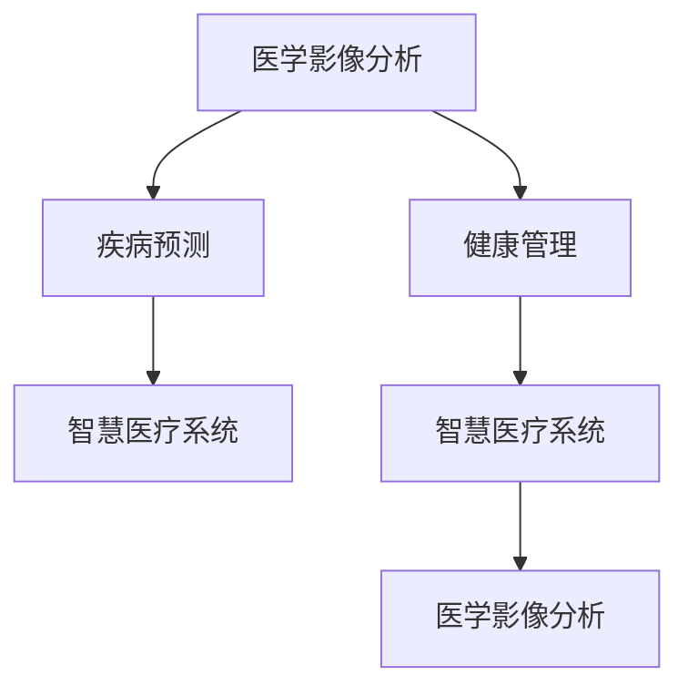

                 

# 未来的智慧医疗：2050年的精准医疗与智能辅助诊断

> 关键词：精准医疗,智能辅助诊断,医学影像分析,疾病预测,健康管理,智慧医疗系统,人工智能,深度学习

## 1. 背景介绍

### 1.1 问题由来

随着科学技术和社会经济的发展，人类疾病谱正在发生深刻变化。过去百年间，通过医药卫生体系的建设和疾病防治技术的发展，全球人均预期寿命大幅提升，但非传染性疾病（如癌症、心血管疾病、糖尿病等）的发病率与死亡率却在不断攀升，成为人类健康的主要威胁。

当前，医疗资源分布不均、诊疗效率低下、个体化治疗不足等问题，严重制约了精准医疗的发展。这些问题不仅导致医疗成本高昂、治疗效果不理想，更可能错过最佳治疗时机，给患者带来不可挽回的损失。

面对这一挑战，如何借助现代信息技术和人工智能的力量，打造高效、智能、个性化的医疗服务体系，成为医疗健康领域亟待解决的问题。基于大数据、机器学习和深度学习的智能辅助诊断技术，将为精准医疗提供新的突破口。

### 1.2 问题核心关键点

智能辅助诊断的核心在于通过机器学习模型对医学影像、基因组数据、电子病历等医疗信息进行深度挖掘和分析，辅助医生进行疾病预测和诊断。当前，这一领域的热门研究方向包括：

- 医学影像分析：利用卷积神经网络（CNN）对医学影像（如CT、MRI、X光片等）进行自动化分析，识别异常区域，辅助放射科医生诊断。
- 疾病预测：通过构建时间序列模型或分类模型，预测疾病发展趋势和风险，提供早期干预措施。
- 健康管理：结合个人生理数据（如血压、血糖、心率等）和生活习惯信息，构建健康风险评估模型，提出个性化健康建议。
- 智慧医疗系统：利用大数据和云计算技术，搭建可扩展、模块化的智慧医疗平台，实现资源共享和协同诊断。

这些研究方向相互交织，共同构成了智能辅助诊断技术的核心框架。通过这一框架，可以大幅提升医疗系统的诊断效率和诊疗质量，实现精准医疗的目标。

## 2. 核心概念与联系

### 2.1 核心概念概述

为更好地理解智能辅助诊断技术，本节将介绍几个关键概念：

- 医学影像分析（Medical Image Analysis）：通过机器学习技术，对医学影像进行自动识别和分类，辅助诊断疾病。
- 疾病预测（Disease Prediction）：利用时间序列分析、分类模型等，预测疾病发生概率和趋势，提供早期干预。
- 健康管理（Health Management）：结合个人生理数据和生活习惯信息，构建健康风险评估模型，提供个性化健康建议。
- 智慧医疗系统（Smart Healthcare System）：集成了大数据、云计算、物联网、人工智能等技术，构建可扩展、模块化的智慧医疗平台。

这些概念之间存在紧密联系，共同支撑起智能辅助诊断的生态系统。

### 2.2 核心概念原理和架构的 Mermaid 流程图



此图展示了医学影像分析、疾病预测、健康管理和智慧医疗系统之间的联系。医学影像分析从影像数据中提取特征，辅助疾病预测和健康管理；疾病预测和健康管理生成个性化健康建议，进一步提升智慧医疗系统的诊疗效果。

## 3. 核心算法原理 & 具体操作步骤

### 3.1 算法原理概述

智能辅助诊断的核心在于通过深度学习模型对医学数据进行自动化分析和处理。以下以医学影像分析为例，介绍其基本原理。

医学影像分析通常分为图像预处理、特征提取和疾病识别三个步骤。具体而言，其流程如下：

1. **图像预处理**：对医学影像进行去噪、归一化、增强等处理，提高后续分析的准确性。
2. **特征提取**：利用卷积神经网络（CNN）对医学影像进行特征提取，生成高维特征向量。
3. **疾病识别**：通过构建分类器，将提取出的特征向量映射到疾病类别，实现疾病自动识别。

### 3.2 算法步骤详解

以医学影像分类为例，深度学习模型的构建和训练步骤如下：

**Step 1: 准备数据集**
- 收集并标注大量的医学影像数据，将其分为训练集和测试集。
- 使用数据增强技术，扩充训练集，增强模型泛化能力。

**Step 2: 构建模型架构**
- 设计卷积神经网络（CNN），包括卷积层、池化层、全连接层等组件。
- 选择合适的损失函数，如交叉熵损失，用于衡量模型预测和实际标签之间的差异。

**Step 3: 训练模型**
- 在训练集上前向传播计算损失函数，反向传播更新模型参数。
- 设置合适的学习率、批大小和迭代轮数，使用优化算法（如Adam、SGD等）进行训练。
- 使用正则化技术，如L2正则、Dropout等，防止过拟合。

**Step 4: 评估和调优**
- 在测试集上评估模型性能，计算准确率、召回率、F1分数等指标。
- 根据评估结果，调整模型参数或改进训练策略，重新训练模型。

**Step 5: 部署与应用**
- 将训练好的模型部署到实际应用中，集成到医院信息管理系统或智慧医疗平台。
- 对新输入的医学影像数据进行推理预测，生成疾病诊断结果。

### 3.3 算法优缺点

智能辅助诊断技术具有以下优点：
1. 高效准确：通过深度学习模型自动化处理大量医学数据，减少医生的工作负担，提高诊断速度和准确性。
2. 可扩展性强：可以利用已有模型快速适应新任务，实现通用化、模块化的智能诊断系统。
3. 降低医疗成本：减少医生人工判断的误差，降低误诊和漏诊率，从而减少不必要的医疗开销。

同时，该技术也存在一些局限性：
1. 数据依赖：模型的性能高度依赖于标注数据的数量和质量，获取高质量数据成本较高。
2. 泛化能力不足：模型对域外数据的泛化能力有限，可能出现数据偏差。
3. 算法复杂性：深度学习模型结构复杂，训练过程耗时较长，需要高性能计算资源。
4. 伦理问题：如何确保模型的公平性、透明性和可解释性，避免偏见和误导性输出，还需进一步研究。

### 3.4 算法应用领域

智能辅助诊断技术在医疗健康领域有着广泛的应用场景，包括：

- 医学影像分析：辅助放射科医生对CT、MRI等影像进行自动分析，识别肿瘤、骨折、脑出血等疾病。
- 疾病预测：利用时间序列分析和分类模型，预测心脏病、糖尿病等慢性病的发展趋势和风险。
- 健康管理：结合生理数据和生活习惯信息，提供个性化健康建议，如饮食、运动、作息等方面的指导。
- 智慧医疗系统：构建可扩展、模块化的智慧医疗平台，实现资源共享和协同诊断，提升整体医疗服务质量。

除了上述应用，智能辅助诊断技术还广泛应用于健康监测、远程医疗、智能手术等场景，为精准医疗的实现提供了强有力的技术支撑。

## 4. 数学模型和公式 & 详细讲解

### 4.1 数学模型构建

以下以医学影像分类为例，介绍深度学习模型的数学模型构建过程。

假设医学影像数据集为 $\{(x_i, y_i)\}_{i=1}^N$，其中 $x_i$ 为第 $i$ 个医学影像，$y_i \in \{0, 1\}$ 表示是否患有某种疾病，$1$ 表示患有，$0$ 表示未患有。

模型的输入 $x$ 是 $H \times W \times C$ 的三维张量，其中 $H$ 和 $W$ 分别表示图像的高度和宽度，$C$ 表示通道数（如RGB彩色图像为3，灰度图像为1）。模型输出 $y$ 为单个二元值，表示是否患有某种疾病。

模型的目标是最小化交叉熵损失，即：

$$
\mathcal{L}(y, \hat{y}) = -\sum_{i=1}^N y_i \log \hat{y}_i + (1-y_i) \log (1-\hat{y}_i)
$$

其中 $\hat{y}$ 为模型对 $x$ 的预测输出，$y_i$ 为实际标签。

### 4.2 公式推导过程

在模型训练过程中，使用随机梯度下降（SGD）或Adam等优化算法更新模型参数。假设当前参数为 $\theta$，则梯度更新公式为：

$$
\theta \leftarrow \theta - \eta \nabla_{\theta}\mathcal{L}(\theta)
$$

其中 $\eta$ 为学习率。梯度计算可以通过反向传播算法实现：

$$
\nabla_{\theta}\mathcal{L}(\theta) = \frac{\partial \mathcal{L}(y, \hat{y})}{\partial \theta}
$$

将 $\mathcal{L}(y, \hat{y})$ 对 $\theta$ 求导，即可得到梯度。具体计算过程如下：

1. 对 $x$ 进行前向传播，得到特征向量 $f(x; \theta)$。
2. 通过激活函数（如ReLU、Sigmoid等）计算预测结果 $\hat{y}$。
3. 计算交叉熵损失 $\mathcal{L}(y, \hat{y})$。
4. 反向传播计算梯度 $\nabla_{\theta}\mathcal{L}(\theta)$。
5. 使用优化算法更新模型参数 $\theta$。

### 4.3 案例分析与讲解

以单视野卷积神经网络（Convolutional Neural Network, CNN）为例，分析其在医学影像分析中的应用。

CNN 是一种经典的深度学习模型，广泛应用于图像分类、目标检测等领域。在医学影像分析中，CNN 可以高效提取影像特征，实现疾病自动识别。

以下是一个简单的单视野 CNN 结构，包括卷积层、池化层、全连接层等组件：

```mermaid
graph LR
    A[输入影像] --> B[卷积层1]
    B --> C[池化层]
    C --> D[卷积层2]
    D --> E[全连接层1]
    E --> F[全连接层2]
    F --> G[输出层]
    C --> D[dashed] "卷积核大小 3x3"
    C --> E[dashed] "步长 2"
    G --> H[dashed] "输出类别数 2"
```

该模型首先通过卷积层1提取影像特征，再经过池化层减小特征图大小，提高计算效率。接着通过卷积层2和全连接层1、2进行特征提取和分类，最终通过输出层输出疾病诊断结果。

在实际应用中，训练集和测试集的质量直接影响模型的性能。因此，数据增强技术（如旋转、平移、缩放等）和数据清洗（如去噪、归一化等）是必不可少的。

## 5. 项目实践：代码实例和详细解释说明

### 5.1 开发环境搭建

在进行项目实践前，我们需要准备好开发环境。以下是使用Python进行TensorFlow开发的环境配置流程：

1. 安装Anaconda：从官网下载并安装Anaconda，用于创建独立的Python环境。

2. 创建并激活虚拟环境：
```bash
conda create -n tf-env python=3.8 
conda activate tf-env
```

3. 安装TensorFlow：根据CUDA版本，从官网获取对应的安装命令。例如：
```bash
conda install tensorflow==2.6 -c tf -c conda-forge
```

4. 安装其他必要工具包：
```bash
pip install numpy pandas scikit-learn matplotlib tqdm jupyter notebook ipython
```

完成上述步骤后，即可在`tf-env`环境中开始项目实践。

### 5.2 源代码详细实现

下面我们以医学影像分类为例，给出使用TensorFlow对卷积神经网络进行训练的代码实现。

首先，定义模型结构：

```python
import tensorflow as tf
from tensorflow.keras import layers

model = tf.keras.Sequential([
    layers.Conv2D(32, (3, 3), activation='relu', input_shape=(64, 64, 3)),
    layers.MaxPooling2D((2, 2)),
    layers.Conv2D(64, (3, 3), activation='relu'),
    layers.MaxPooling2D((2, 2)),
    layers.Conv2D(128, (3, 3), activation='relu'),
    layers.MaxPooling2D((2, 2)),
    layers.Flatten(),
    layers.Dense(64, activation='relu'),
    layers.Dense(2, activation='softmax')
])
```

接着，定义训练和评估函数：

```python
from tensorflow.keras.preprocessing.image import ImageDataGenerator
from tensorflow.keras.datasets import cifar10

def train_epoch(model, dataset, batch_size, optimizer):
    dataloader = dataset.flow_from_directory(batch_size=batch_size)
    model.train()
    epoch_loss = 0
    for batch in dataloader:
        inputs, labels = batch['x'], batch['y']
        model.trainable = True
        with tf.GradientTape() as tape:
            outputs = model(inputs, training=True)
            loss = tf.keras.losses.sparse_categorical_crossentropy(labels, outputs)
        grads = tape.gradient(loss, model.trainable_variables)
        optimizer.apply_gradients(zip(grads, model.trainable_variables))
        epoch_loss += loss.numpy().mean()
    return epoch_loss / len(dataloader)

def evaluate(model, dataset, batch_size):
    dataloader = dataset.flow_from_directory(batch_size=batch_size)
    model.trainable = False
    test_loss = 0
    correct_predictions = 0
    with tf.GradientTape() as tape:
        for batch in dataloader:
            inputs, labels = batch['x'], batch['y']
            outputs = model(inputs, training=False)
            loss = tf.keras.losses.sparse_categorical_crossentropy(labels, outputs)
            test_loss += loss.numpy().mean()
            predictions = tf.argmax(outputs, axis=1)
            correct_predictions += tf.reduce_sum(tf.cast(predictions == labels, dtype=tf.int32))
    test_loss /= len(dataloader)
    test_accuracy = correct_predictions / len(dataset)
    return test_loss, test_accuracy
```

最后，启动训练流程并在测试集上评估：

```python
epochs = 10
batch_size = 32
learning_rate = 0.001

for epoch in range(epochs):
    loss = train_epoch(model, cifar10.train, batch_size, tf.keras.optimizers.Adam(learning_rate))
    test_loss, test_accuracy = evaluate(model, cifar10.test, batch_size)
    print(f"Epoch {epoch+1}, train loss: {loss:.3f}, test loss: {test_loss:.3f}, test accuracy: {test_accuracy:.2%}")
```

以上就是使用TensorFlow对医学影像分类任务进行深度学习的完整代码实现。

### 5.3 代码解读与分析

让我们再详细解读一下关键代码的实现细节：

**model定义**：
- 使用 `Sequential` 构建卷积神经网络模型，包含卷积层、池化层、全连接层等组件。
- 第一层卷积层使用32个3x3的卷积核，激活函数为ReLU，输入尺寸为64x64x3。
- 池化层使用2x2的最大池化，减小特征图大小。
- 第二层卷积层使用64个3x3的卷积核，激活函数为ReLU。
- 第三层卷积层使用128个3x3的卷积核，激活函数为ReLU。
- 第四层池化层使用2x2的最大池化。
- 第五层全连接层使用64个神经元，激活函数为ReLU。
- 第六层全连接层使用2个神经元，激活函数为Softmax。

**train_epoch函数**：
- 定义训练循环，使用 `ImageDataGenerator` 生成批处理数据。
- 在每个批次上前向传播计算损失函数，并反向传播更新模型参数。
- 计算平均损失，返回该epoch的平均损失值。

**evaluate函数**：
- 定义评估循环，使用 `ImageDataGenerator` 生成批处理数据。
- 在每个批次上前向传播计算损失函数，并计算准确率。
- 返回该epoch的平均损失和准确率。

**训练流程**：
- 定义总的epoch数和批大小，开始循环迭代
- 每个epoch内，先在训练集上训练，输出平均loss
- 在测试集上评估，输出loss和准确率
- 重复上述过程直至全部epoch训练完成

可以看到，TensorFlow提供了强大的深度学习框架，使得模型构建和训练变得简洁高效。开发者可以快速迭代实验，探索更优的模型结构和训练策略，提升模型的性能。

当然，工业级的系统实现还需考虑更多因素，如模型保存和部署、超参数调优、多卡并行训练等。但核心的模型训练过程基本与此类似。

## 6. 实际应用场景

### 6.1 智能手术辅助

智能手术辅助系统通过结合医学影像分析和深度学习技术，为外科医生提供精准的手术指导。系统通过实时分析手术过程中的影像数据，自动识别和标记重要区域，辅助医生进行定位和操作。

例如，在微创手术中，系统可以自动识别肿瘤位置，并提供手术路径和进刀深度建议。通过这种方式，手术过程变得更加准确和安全，减少了手术时间和术后恢复时间。

### 6.2 慢性病预测与管理

慢性病预测与管理是智能辅助诊断的重要应用场景之一。通过分析患者的历史健康数据和生活习惯信息，系统可以预测患者患慢性病的风险，并提供个性化的健康建议。

例如，系统可以通过分析患者的心率、血压、血糖等生理数据，预测其患糖尿病、高血压等慢性病的概率，并给出饮食、运动、生活习惯等方面的建议。患者可以依据系统的建议调整生活方式，降低患病风险，提高生活质量。

### 6.3 精准医学影像分析

精准医学影像分析通过深度学习技术，对医学影像进行自动分析和分类，辅助医生进行诊断和治疗决策。系统可以通过训练模型，识别影像中的异常区域，并提供详细的分析报告。

例如，在肿瘤检测中，系统可以自动识别影像中的肿瘤区域，并提供肿瘤的大小、位置、形态等信息。医生可以根据系统的建议，选择适合的诊断方法和治疗方案，提高诊断效率和治疗效果。

### 6.4 未来应用展望

随着深度学习技术和医疗大数据的发展，智能辅助诊断技术在未来将迎来更多创新和突破。

- 模型可解释性提升：如何赋予模型更强的可解释性，让医生更好地理解模型的决策逻辑，将是未来的研究重点。
- 多模态数据融合：如何将图像、基因组、生理数据等多种模态信息融合，实现更全面的健康评估，是未来的重要方向。
- 实时系统部署：如何在资源有限的环境中部署实时系统，提升诊断效率和响应速度，也是未来需要解决的问题。
- 伦理和社会影响：如何确保算法的公平性和透明度，避免偏见和歧视，防止对患者的误导，将是伦理和技术研究的双重挑战。

## 7. 工具和资源推荐

### 7.1 学习资源推荐

为了帮助开发者系统掌握智能辅助诊断的理论基础和实践技巧，这里推荐一些优质的学习资源：

1. 《深度学习在医疗影像分析中的应用》系列文章：介绍了深度学习在医学影像分析中的应用，包含卷积神经网络、迁移学习等基本概念和实现细节。

2. Coursera《机器学习基础》课程：由斯坦福大学Andrew Ng教授主讲，深入浅出地介绍了机器学习的基本理论和实践技能，适合初学者入门。

3. 《Deep Learning for Healthcare》书籍：详细介绍了深度学习在医疗健康领域的应用，包括医学影像分析、疾病预测、健康管理等多个方向。

4. TensorFlow官方文档：提供了丰富的深度学习框架使用指南，包含模型构建、训练和部署的详细说明。

5. Kaggle医疗健康竞赛：通过参与Kaggle医疗健康领域的竞赛，实践深度学习技术，提升实战能力。

通过对这些资源的学习实践，相信你一定能够快速掌握智能辅助诊断的核心技术，并用于解决实际的医疗问题。

### 7.2 开发工具推荐

高效的开发离不开优秀的工具支持。以下是几款用于深度学习开发的常用工具：

1. TensorFlow：由Google主导开发的深度学习框架，生产部署方便，适合大规模工程应用。

2. PyTorch：由Facebook开发的深度学习框架，灵活高效，适用于快速迭代研究。

3. MXNet：由Amazon开发的深度学习框架，支持多种硬件和分布式训练，适合大规模部署。

4. Jupyter Notebook：开源的交互式笔记本，支持多种编程语言和数据格式，适合研究和演示。

5. Google Colab：谷歌提供的在线Jupyter Notebook环境，免费提供GPU/TPU算力，方便开发者快速上手实验。

合理利用这些工具，可以显著提升深度学习开发的速度和质量，加速创新迭代的步伐。

### 7.3 相关论文推荐

智能辅助诊断技术的发展源于学界的持续研究。以下是几篇奠基性的相关论文，推荐阅读：

1. Deep Residual Learning for Image Recognition（ResNet论文）：提出了深度残差网络，解决了深度网络训练过程中的梯度消失问题，提升了模型深度和性能。

2. Attention is All You Need（Transformer论文）：提出了Transformer结构，开启了预训练大模型时代，提高了自然语言理解和生成的效果。

3. Label-Efficient Learning of Deep Structured Models from Unlabelled Data（ELMo论文）：提出了ELMo模型，通过双向语言模型实现了无监督预训练，提升了模型的语言理解能力。

4. Time Series Analysis with Deep Neural Networks（RNN论文）：介绍了使用循环神经网络（RNN）进行时间序列分析的方法，用于疾病预测等场景。

5. Health Risk Prediction using Machine Learning: A Review（健康风险预测综述）：总结了机器学习在健康风险预测中的应用，包括数据处理、模型选择和评估等技术。

这些论文代表了大数据和深度学习在医疗健康领域的发展脉络。通过学习这些前沿成果，可以帮助研究者把握学科前进方向，激发更多的创新灵感。

## 8. 总结：未来发展趋势与挑战

### 8.1 总结

本文对智能辅助诊断技术进行了全面系统的介绍。首先阐述了智能辅助诊断技术的研究背景和意义，明确了其在医疗健康领域的重要价值。其次，从原理到实践，详细讲解了深度学习模型的构建和训练过程，给出了实际应用的代码实例。同时，本文还广泛探讨了智能辅助诊断技术在多个实际场景中的应用，展示了其在智慧医疗系统中的巨大潜力。

通过本文的系统梳理，可以看到，智能辅助诊断技术通过深度学习模型的自动化分析和处理，大幅提升了医疗系统的诊断效率和诊疗质量，为精准医疗的实现提供了新的突破口。未来，伴随深度学习技术和医疗大数据的不断进步，智能辅助诊断技术必将为医疗健康领域带来更多创新和突破。

### 8.2 未来发展趋势

展望未来，智能辅助诊断技术将呈现以下几个发展趋势：

1. 模型规模持续增大：随着算力成本的下降和数据规模的扩张，深度学习模型的参数量还将持续增长。超大模型可以更好地挖掘和利用医疗数据，提升诊断和治疗效果。

2. 多模态数据融合：将图像、基因组、生理数据等多种模态信息融合，实现更全面的健康评估，提升模型的泛化能力和鲁棒性。

3. 实时系统部署：如何在资源有限的环境中部署实时系统，提升诊断效率和响应速度，将是未来的重要方向。

4. 伦理和社会影响：如何确保算法的公平性和透明度，避免偏见和歧视，防止对患者的误导，将是伦理和技术研究的双重挑战。

5. 系统集成和协同诊断：构建模块化、可扩展的智慧医疗平台，实现资源共享和协同诊断，提升整体医疗服务质量。

以上趋势凸显了智能辅助诊断技术的广阔前景。这些方向的探索发展，必将进一步提升医疗系统的诊断效率和诊疗质量，实现精准医疗的目标。

### 8.3 面临的挑战

尽管智能辅助诊断技术已经取得了显著进展，但在迈向更加智能化、普适化应用的过程中，仍面临诸多挑战：

1. 数据依赖：模型的性能高度依赖于标注数据的数量和质量，获取高质量数据成本较高。如何降低数据依赖，减少标注工作量，是未来的研究重点。

2. 泛化能力不足：模型对域外数据的泛化能力有限，可能出现数据偏差。如何在更广泛的数据分布上获得稳定的模型性能，是未来的重要课题。

3. 伦理问题：如何确保算法的公平性和透明度，避免偏见和歧视，防止对患者的误导，将是伦理和技术研究的双重挑战。

4. 系统安全性：如何在保障数据隐私和安全的前提下，实现高效的数据共享和协同诊断，是未来需要解决的问题。

5. 计算资源消耗：深度学习模型结构复杂，训练过程耗时较长，需要高性能计算资源。如何在有限的资源条件下，高效训练和部署模型，是未来的研究挑战。

### 8.4 研究展望

面对智能辅助诊断技术所面临的种种挑战，未来的研究需要在以下几个方面寻求新的突破：

1. 数据增强与迁移学习：通过数据增强和迁移学习技术，降低模型对标注数据的依赖，提高模型在不同数据集上的泛化能力。

2. 深度学习与符号学习结合：将深度学习与符号化先验知识结合，提升模型的可解释性和可信度。

3. 多模态数据融合与协同诊断：将图像、基因组、生理数据等多种模态信息融合，实现更全面的健康评估，提升模型的泛化能力和鲁棒性。

4. 实时系统部署与优化：在资源有限的环境中部署实时系统，提升诊断效率和响应速度，优化模型性能。

5. 伦理与社会影响：确保算法的公平性和透明度，避免偏见和歧视，防止对患者的误导，构建安全、可靠、可解释、可控的智能系统。

这些研究方向的应用探索，必将引领智能辅助诊断技术迈向更高的台阶，为精准医疗和智慧医疗的实现提供技术支撑。

## 9. 附录：常见问题与解答

**Q1：智能辅助诊断技术如何处理数据隐私问题？**

A: 数据隐私问题是智能辅助诊断技术应用中需要重点考虑的问题。以下是一些常见的处理方法：

1. 数据匿名化：在数据预处理阶段，去除或加密患者的敏感信息，如姓名、地址等，保护患者隐私。
2. 数据加密存储：采用安全的数据加密技术，如AES、RSA等，确保数据在传输和存储过程中的安全性。
3. 差分隐私：在数据发布和共享过程中，通过加入噪声或扰动，保护个体数据隐私，避免信息泄露。
4. 本地计算：将数据处理和分析任务在本地设备上执行，不将数据传输到云端，减少数据泄露风险。
5. 区块链技术：利用区块链的去中心化和不可篡改特性，确保数据来源和处理过程的透明和可信。

通过这些方法，可以在确保数据隐私的前提下，实现智能辅助诊断技术的高效应用。

**Q2：智能辅助诊断技术在临床中的应用需要注意哪些问题？**

A: 智能辅助诊断技术在临床应用中需要注意以下几个问题：

1. 医生参与：确保医生全程参与系统的开发和应用，使其对系统有充分的了解和信任。医生可以参与模型的训练和验证，提供反馈和建议，提升系统的可靠性和可解释性。

2. 辅助而非替代：明确系统的辅助定位，避免过度依赖，确保医生在诊断和治疗过程中始终处于主导地位。系统提供的数据和建议可以作为参考，但不能完全取代医生的判断。

3. 持续更新：医疗数据和疾病谱在不断变化，智能辅助诊断系统需要定期更新模型和数据，保持最新的诊断和治疗能力。

4. 伦理审查：在系统应用前，需进行伦理审查，确保技术应用符合医学伦理规范，保护患者权益。

5. 安全性与可靠性：系统应具备高度的安全性和可靠性，避免因技术缺陷或数据错误导致的误诊或漏诊。

通过合理应用智能辅助诊断技术，可以有效提升医疗系统的诊断效率和诊疗质量，但同时也要注意技术应用的伦理和安全问题，确保其正面效果。

**Q3：智能辅助诊断技术的实际应用成本是多少？**

A: 智能辅助诊断技术的实际应用成本取决于多个因素，如系统规模、数据量、硬件配置等。以下是一些常见的成本构成：

1. 系统开发成本：包括硬件采购、软件开发、系统集成等成本。
2. 数据收集与标注成本：高质量的数据标注需要大量人力和时间，成本较高。
3. 硬件配置成本：深度学习模型对计算资源要求较高，需要高性能GPU/TPU设备，成本不菲。
4. 模型维护成本：模型需要定期更新和维护，需要持续投入人力和资源。
5. 系统部署与运维成本：系统上线后，需要定期监测和维护，保证系统的稳定性和可靠性。

综上所述，智能辅助诊断技术的实际应用成本较高，需要系统规划和充分预算。但在提升诊疗效率和质量方面，其长期收益是显著的。

**Q4：如何评估智能辅助诊断技术的性能？**

A: 智能辅助诊断技术的性能评估可以从以下几个方面进行：

1. 准确率：系统对疾病的预测或分类准确率，是评估模型性能的重要指标。
2. 召回率：系统对正样本的识别能力，即系统能够正确识别的正样本占总正样本的比例。
3. F1分数：综合考虑准确率和召回率，是评估模型性能的综合指标。
4. 时间和资源消耗：系统在推理过程中的时间和资源消耗，影响用户体验和系统部署的可行性。
5. 可解释性：系统的输出结果是否具有可解释性，是否能够清晰地解释模型的推理过程和决策依据。

通过综合评估这些指标，可以全面衡量智能辅助诊断技术的性能和应用效果。

**Q5：智能辅助诊断技术如何适应多场景应用？**

A: 智能辅助诊断技术需要灵活适应多场景应用，以下是一些常见的方法：

1. 模块化设计：将系统划分为多个模块，每个模块可以独立更新和部署，适应不同的应用场景。
2. 数据预处理与清洗：根据不同场景的特点，进行数据预处理和清洗，优化模型输入。
3. 模型迁移学习：通过迁移学习技术，将模型在其他场景中训练的经验迁移到当前场景中，快速适应新任务。
4. 接口标准化：设计通用的API接口，支持多种数据格式和输入输出方式，便于系统集成和应用扩展。
5. 定制化开发：根据不同场景的需求，定制化开发系统功能和算法，提升系统的实用性和可扩展性。

通过以上方法，智能辅助诊断技术可以适应多场景应用，提高系统的实用性和灵活性。

---

作者：禅与计算机程序设计艺术 / Zen and the Art of Computer Programming

