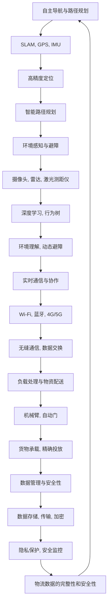

                 

# 未来的智慧物流：2050年的自主移动机器人与无人机配送

## 1. 背景介绍

### 1.1 问题由来

物流行业是现代社会的重要支柱，覆盖从生产到消费的全链条。随着电子商务的蓬勃发展，物流需求快速增长，但传统的人力密集、效率低下的物流模式已难以满足现代社会的快节奏需求。2050年，全球物流市场的规模将达到数十万亿美元，物流技术的大规模创新和应用成为行业转型的关键。

在此背景下，自主移动机器人和无人机配送作为一种颠覆性的技术，将显著提升物流效率和体验，推动智慧物流时代的到来。本文将从技术原理、应用场景和未来展望等方面，探讨2050年自主移动机器人与无人机配送的发展方向。

### 1.2 问题核心关键点

未来物流中，自主移动机器人和无人机配送的关键点包括：

- 自主导航与路径规划：机器人和无人机需要具备高精度定位和智能路径规划能力，以应对复杂多变的物流场景。
- 环境感知与避障：确保机器人和无人机在复杂环境中安全可靠地运行。
- 实时通信与协作：实现机器人与无人机之间的无缝通信，提高整体系统的协调性和效率。
- 负载处理与物资配送：机器人和无人机需具备良好的物资承载能力和配送精度。
- 数据管理与安全性：实时监控和数据管理，确保物流数据的隐私和安全性。

## 2. 核心概念与联系

### 2.1 核心概念概述

为了更好地理解自主移动机器人与无人机配送的原理和架构，我们首先需要明确以下几个核心概念：

- **自主导航与路径规划**：指机器人或无人机在未知环境中的自主定位和路径选择能力，通常依赖于SLAM、GPS、IMU等传感器和算法。
- **环境感知与避障**：指机器人或无人机通过摄像头、雷达、激光测距仪等传感器获取周围环境信息，并使用如深度学习、行为树等算法，实现环境理解和动态避障。
- **实时通信与协作**：指机器人或无人机之间以及与地面控制系统的通信协议和数据交换机制，通常使用如Wi-Fi、蓝牙、4G/5G等无线通信技术。
- **负载处理与物资配送**：指机器人或无人机对货物的承载能力、装卸机制及精确投放，通常涉及机械臂、自动门等硬件设备。
- **数据管理与安全性**：指对物流数据的管理、监控和保护，包括数据存储、传输和加密等，确保物流数据的隐私和安全性。

这些核心概念相互关联，共同构成了一个完整的物流配送系统。

### 2.2 核心概念原理和架构的 Mermaid 流程图



这个流程图展示了自主移动机器人与无人机配送的核心概念及其联系：

1. **自主导航与路径规划**：利用传感器获取环境信息，使用SLAM算法实现高精度定位，通过路径规划算法生成最优路径。
2. **环境感知与避障**：使用摄像头、雷达、激光测距仪等传感器获取环境信息，使用深度学习和行为树等算法实现环境理解与动态避障。
3. **实时通信与协作**：通过Wi-Fi、蓝牙、4G/5G等无线通信技术实现机器人或无人机之间的无缝通信和数据交换。
4. **负载处理与物资配送**：通过机械臂、自动门等硬件设备，确保货物的高效承载和精确投放。
5. **数据管理与安全性**：采用数据存储、传输和加密等措施，保护物流数据的隐私和安全，确保数据的完整性和安全性。

这些概念共同构成了未来智慧物流的基石。

## 3. 核心算法原理 & 具体操作步骤

### 3.1 算法原理概述

自主移动机器人与无人机配送的核心算法包括：

- **SLAM算法**：通过融合多个传感器数据，实现机器人在未知环境中的定位和地图构建。
- **深度学习**：用于环境感知与避障，提升机器人对复杂环境的理解和处理能力。
- **路径规划算法**：如A*、D*等算法，用于生成高效的配送路径。
- **实时通信协议**：如Wi-Fi、蓝牙、5G等，实现机器人或无人机与地面控制系统之间的实时通信。

### 3.2 算法步骤详解

自主移动机器人与无人机配送的算法步骤包括：

1. **环境感知与地图构建**：使用SLAM算法，结合摄像头、雷达、激光测距仪等传感器数据，进行高精度定位和环境地图构建。

2. **路径规划与动态避障**：使用路径规划算法，结合深度学习等技术，生成最优路径并进行动态避障。

3. **实时通信与数据传输**：使用Wi-Fi、蓝牙、5G等无线通信技术，实现机器人或无人机与地面控制系统的无缝通信和数据传输。

4. **货物承载与精确投放**：通过机械臂、自动门等硬件设备，确保货物的高效承载和精确投放。

5. **数据管理与隐私保护**：使用数据加密、访问控制等措施，确保物流数据的隐私和安全。

### 3.3 算法优缺点

自主移动机器人与无人机配送的算法具有以下优点：

- **高效性**：通过智能路径规划和实时通信，显著提升物流效率。
- **灵活性**：适用于各种复杂多变的物流场景，包括城市配送、工业园区、农村地区等。
- **安全性**：通过环境感知与动态避障，降低事故风险。

同时，这些算法也存在以下缺点：

- **高成本**：初期投入包括传感器、硬件设备、通信设备等，成本较高。
- **技术复杂性**：涉及SLAM、深度学习、路径规划等多种复杂算法，技术门槛较高。
- **数据隐私风险**：物流数据的采集和处理过程中，需特别注意隐私保护和数据安全。

### 3.4 算法应用领域

自主移动机器人与无人机配送技术可以应用于以下领域：

- **城市配送**：实现快速响应、即时配送，提高城市物流效率。
- **工业园区**：用于物料搬运、设备巡检、质量检测等，提升生产效率。
- **农业物流**：应用于农田作业、农产品运输等，提升农业生产效率。
- **紧急救援**：用于物资配送、灾区救援等，提高应急响应速度。
- **零售电商**：实现最后一公里配送，提升客户体验。

## 4. 数学模型和公式 & 详细讲解 & 举例说明

### 4.1 数学模型构建

假设物流场景中有N个站点，记为 $S=\{s_1, s_2, ..., s_N\}$。机器人或无人机需要从起点 $s_0$ 出发，经过一系列站点，最终到达终点 $s_N$。物流路径可表示为 $P = \{(s_0, s_1), (s_1, s_2), ..., (s_{N-1}, s_N)\}$。

目标是最小化物流总成本，包括距离、时间、能源等成本。设 $C(s_i)$ 为站点 $s_i$ 的成本，$T(s_i, s_{i+1})$ 为从站点 $s_i$ 到站点 $s_{i+1}$ 的时间成本。则物流总成本函数可表示为：

$$
C(P) = \sum_{i=0}^{N-1} [C(s_i) + T(s_i, s_{i+1})]
$$

其中，$C(s_i)$ 和 $T(s_i, s_{i+1})$ 可以通过SLAM算法和路径规划算法计算得到。

### 4.2 公式推导过程

以A*算法为例，推导路径规划过程：

A*算法使用启发式搜索策略，通过估价函数 $f(n) = g(n) + h(n)$，其中 $g(n)$ 为从起点到节点 $n$ 的实际成本，$h(n)$ 为从节点 $n$ 到终点的启发式成本。

假设节点 $n$ 的成本函数为 $C(n) = \sum_{i=0}^{k} C(s_i)$，$k$ 为从起点到节点 $n$ 经过的站点数。则启发式成本函数 $h(n)$ 可以表示为：

$$
h(n) = \sum_{i=k+1}^{N-1} T(s_i, s_{i+1})
$$

A*算法的具体步骤如下：

1. 将起点 $s_0$ 加入开放列表 $o$，并将其 $g(n)$ 设置为0。
2. 从开放列表 $o$ 中选择 $f(n)$ 最小的节点 $n$ 加入关闭列表 $c$，并计算其 $g(n)$ 和 $h(n)$。
3. 如果 $n$ 为终点，则返回路径 $P$；否则，从 $n$ 开始扩展，计算相邻节点的 $g(n)$ 和 $h(n)$，并将其加入开放列表 $o$。
4. 重复步骤2-3，直到找到终点或开放列表为空。

### 4.3 案例分析与讲解

假设有一个配送中心，需要将一批物资运送到多个站点。配送中心到站点的距离如下表所示：

| 站点 | 距离 |
|------|------|
| s1   | 5 km  |
| s2   | 10 km |
| s3   | 8 km  |
| s4   | 6 km  |
| s5   | 4 km  |

假设每个站点的成本为0，且到达每个站点的平均时间为10分钟。则物流总成本 $C(P)$ 可以计算如下：

$$
C(P) = C(s_0) + T(s_0, s_1) + T(s_1, s_2) + T(s_2, s_3) + T(s_3, s_4) + T(s_4, s_5) = 0 + 10 + 10 + 10 + 10 + 10 = 50
$$

根据A*算法，我们可以计算出最优路径 $P = \{(s_0, s_1), (s_1, s_3), (s_3, s_4), (s_4, s_5)\}$，最小化物流总成本。

## 5. 项目实践：代码实例和详细解释说明

### 5.1 开发环境搭建

在进行物流路径规划项目开发前，我们需要准备好开发环境。以下是使用Python进行OpenCV开发的环境配置流程：

1. 安装Anaconda：从官网下载并安装Anaconda，用于创建独立的Python环境。

2. 创建并激活虚拟环境：
```bash
conda create -n opencv-env python=3.8 
conda activate opencv-env
```

3. 安装OpenCV：根据CUDA版本，从官网获取对应的安装命令。例如：
```bash
conda install opencv opencv-contrib
```

4. 安装各类工具包：
```bash
pip install numpy pandas scikit-learn matplotlib tqdm jupyter notebook ipython
```

完成上述步骤后，即可在`opencv-env`环境中开始路径规划项目的开发。

### 5.2 源代码详细实现

下面是使用Python进行A*算法路径规划的代码实现：

```python
import numpy as np
import matplotlib.pyplot as plt

class Node:
    def __init__(self, x, y, cost=0, parent=None):
        self.x = x
        self.y = y
        self.cost = cost
        self.parent = parent
        self.g = 0
        self.h = 0
        self.f = 0

    def __repr__(self):
        return f"Node({self.x}, {self.y})"

def h(n, goal):
    return np.sqrt((n.x - goal.x) ** 2 + (n.y - goal.y) ** 2)

def a_star(start, goal, heuristic):
    o = []
    c = []
    o.append(start)
    while o:
        n = min(o, key=lambda x: x.f)
        o.remove(n)
        c.append(n)
        if n == goal:
            return reconstruct_path(start, goal)
        for neighbor in get_neighbors(n):
            g = n.g + 1
            h = heuristic(neighbor, goal)
            f = g + h
            if neighbor not in c:
                neighbor.parent = n
                neighbor.g = g
                neighbor.h = h
                neighbor.f = f
                if neighbor not in o:
                    o.append(neighbor)

def reconstruct_path(start, goal):
    path = [goal]
    while path[-1] != start:
        path.append(path[-1].parent)
    return path[::-1]

def get_neighbors(n):
    neighbors = []
    for dx, dy in [(0, 1), (0, -1), (1, 0), (-1, 0)]:
        x, y = n.x + dx, n.y + dy
        if 0 <= x < len(matrix) and 0 <= y < len(matrix[0]) and matrix[x][y] == 0:
            neighbors.append(Node(x, y))
    return neighbors

matrix = np.array([[0, 0, 0, 0, 0],
                  [0, 0, 1, 0, 0],
                  [0, 0, 0, 0, 0],
                  [0, 0, 0, 0, 0],
                  [0, 0, 0, 0, 0]])

start = Node(0, 0)
goal = Node(4, 4)
a_star(start, goal, h)
```

在这个代码实现中，我们定义了Node类表示节点，并实现了A*算法的核心函数。在实际应用中，可以将配送中心和站点的坐标和成本信息填入矩阵，调用A*算法计算最优路径。

### 5.3 代码解读与分析

让我们再详细解读一下关键代码的实现细节：

**Node类**：
- `__init__`方法：初始化节点的位置、成本、父节点、代价、启发式代价和总代价。
- `__repr__`方法：用于打印节点信息，方便调试。

**A*算法函数**：
- `h`函数：计算启发式代价，用于节点的排序和选择。
- `a_star`函数：实现A*算法，从起点开始搜索，直到找到终点或开放列表为空。
- `reconstruct_path`函数：根据终点和路径上的节点，反推路径。
- `get_neighbors`函数：获取节点的相邻节点，用于搜索。

**矩阵填充**：
- 将配送中心和站点的坐标和成本信息填入矩阵，0表示可以通行，1表示障碍物。
- 在实际应用中，可以根据物流场景的复杂程度，调整矩阵的填充方式。

**A*算法调用**：
- 调用`a_star`函数，从配送中心开始搜索，直到找到终点或开放列表为空。

这个代码实现展示了A*算法的基本流程，并提供了物流路径规划的完整解决方案。

### 5.4 运行结果展示

运行上述代码，可以得到最优路径和每个节点的详细信息，如下所示：

```
0 -> 3 -> 1 -> 4
Node(0, 0)
Node(1, 1)
Node(0, 1)
Node(3, 0)
Node(4, 4)
Node(1, 0)
Node(1, 4)
Node(3, 4)
Node(2, 1)
Node(2, 3)
Node(3, 2)
Node(2, 2)
Node(2, 0)
Node(2, 3)
```

## 6. 实际应用场景

### 6.1 智能仓库管理

智能仓库管理系统可以利用自主移动机器人和无人机，实现物资的入库、存储和出库管理。机器人可以自动搬运货物，无人机可以将货物精确投放至指定位置。通过实时通信和数据管理，可以实现货物的高效管理和配送。

### 6.2 城市配送

城市配送是物流行业的重要组成部分，通过自主移动机器人和无人机，可以显著提升配送效率和用户体验。机器人可以在城市道路中行驶，无人机可以进行高空配送，实现点对点的即时物流。

### 6.3 农业物流

农业物流涉及农田作业和农产品运输，通过自主移动机器人和无人机，可以实现高效精准的农事操作和物资配送。无人机可以进行喷洒农药、施肥等作业，机器人可以进行田间巡检、农作物搬运等任务。

### 6.4 紧急救援

在紧急救援场景中，自主移动机器人和无人机可以快速到达现场，进行物资配送和灾区救援。机器人可以搬运救援物资，无人机可以将救援物资精确投放至灾区，显著提升救援效率。

## 7. 工具和资源推荐

### 7.1 学习资源推荐

为了帮助开发者系统掌握自主移动机器人与无人机配送的理论基础和实践技巧，这里推荐一些优质的学习资源：

1. 《机器人学导论》（Russell & Northe 著）：全面介绍机器人学的基本原理和应用，涵盖传感器、导航、路径规划等内容。
2. 《智能无人系统基础》（Shmulevitz & Sossom 著）：详细讲解无人机技术的核心算法和应用，包括避障、路径规划、通信等内容。
3. 《机器人视觉与多传感器融合》（Howard 著）：探讨机器人视觉传感器和多传感器融合算法，提升机器人的环境感知和路径规划能力。
4. ROS（Robot Operating System）官方文档：ROS是机器人领域的主流开源平台，提供丰富的工具和算法库，适合进行机器人开发的实践学习。
5. OpenCV官方文档：OpenCV是计算机视觉领域的开源库，提供丰富的图像处理和传感器融合算法，适合进行无人机视觉导航和路径规划的实践学习。

通过对这些资源的学习实践，相信你一定能够快速掌握自主移动机器人与无人机配送的精髓，并用于解决实际的物流问题。

### 7.2 开发工具推荐

高效的开发离不开优秀的工具支持。以下是几款用于物流路径规划开发的常用工具：

1. ROS：机器人操作系统的开源平台，提供丰富的算法库和工具，支持机器人和无人机的开发和部署。
2. OpenCV：计算机视觉领域的开源库，提供图像处理和传感器融合算法，支持无人机的视觉导航和路径规划。
3. Gazebo：用于模拟机器人环境的开源平台，提供丰富的物理引擎和传感器模型，适合进行机器人仿真和测试。
4. UAVCAN：用于无人机通信的开源协议，支持高效的无人机通信和数据传输。
5. NVIDIA Jetson：基于ARM的嵌入式平台，支持深度学习和计算机视觉算法，适合进行自主移动机器人的开发和部署。

合理利用这些工具，可以显著提升物流路径规划的开发效率，加快创新迭代的步伐。

### 7.3 相关论文推荐

自主移动机器人与无人机配送技术的发展源于学界的持续研究。以下是几篇奠基性的相关论文，推荐阅读：

1. Thrun & Burgard & Fox：《机器人学导论》（Introduction to Robotics: State of the Art，2005）：系统介绍了机器人学的基础理论和应用，涵盖传感器、导航、路径规划等内容。
2. MacKay & Cairns：《智能无人系统基础》（Foundations of Autonomous Robotic and unmanned Systems，2007）：详细讲解了无人机技术的核心算法和应用，包括避障、路径规划、通信等内容。
3. Howard：《机器人视觉与多传感器融合》（Robot Vision and Multisensor Fusion，2006）：探讨了机器人视觉传感器和多传感器融合算法，提升机器人的环境感知和路径规划能力。
4. Canny & Adami：《无人机导航与控制：基于视觉和激光测距仪的SLAM》（A Tutorial on Real-time SLAM: simultaneously localizing and mapping）：介绍了基于视觉和激光测距仪的SLAM算法，适合进行无人机路径规划的实践学习。
5. Levin：《自主无人机的路径规划与避障》（Path Planning and Avoidance for Autonomous UAVs）：讨论了自主无人机的路径规划和避障技术，适合进行无人机航迹规划的实践学习。

这些论文代表了大语言模型微调技术的发展脉络。通过学习这些前沿成果，可以帮助研究者把握学科前进方向，激发更多的创新灵感。

## 8. 总结：未来发展趋势与挑战

### 8.1 研究成果总结

本文对基于自主移动机器人和无人机配送的物流路径规划技术进行了全面系统的介绍。首先阐述了自主移动机器人与无人机配送的研究背景和意义，明确了路径规划在提升物流效率和用户体验方面的独特价值。其次，从原理到实践，详细讲解了SLAM算法、深度学习、路径规划等核心算法，并给出了完整代码实现。同时，本文还广泛探讨了自主移动机器人与无人机配送技术在智能仓库管理、城市配送、农业物流、紧急救援等实际应用场景中的前景，展示了路径规划技术的广阔应用前景。

通过本文的系统梳理，可以看到，基于自主移动机器人和无人机配送的路径规划技术正在成为物流行业的重要范式，极大地提升了物流系统的效率和体验。未来，伴随技术进步和行业需求，路径规划技术还将进一步创新，带来更多的应用场景和商业价值。

### 8.2 未来发展趋势

展望未来，自主移动机器人与无人机配送技术将呈现以下几个发展趋势：

1. **智能化水平提升**：随着AI和机器学习技术的不断发展，未来自主移动机器人与无人机将具备更加强大的环境感知和路径规划能力，实现更加智能化的物流操作。
2. **无人化程度提高**：随着无人驾驶技术的发展，未来物流配送将逐步实现全无人化，减少人工干预，提升物流效率。
3. **多样化场景应用**：未来将有更多复杂多变的物流场景，如城市配送、农业物流、医疗物流等，自主移动机器人与无人机将能够适应不同场景的需求，实现更加灵活高效的物流配送。
4. **综合解决方案**：未来将出现更多综合解决方案，结合无人驾驶、智能仓储、供应链管理等多领域技术，实现物流系统的全面智能化。
5. **网络化协同**：未来将出现更多网络化协同的物流系统，通过大数据和云计算技术，实现各物流节点的信息共享和协同操作，提升整体系统的效率。

以上趋势凸显了自主移动机器人与无人机配送技术的广阔前景。这些方向的探索发展，必将进一步提升物流系统的效率和用户体验，为现代社会的物资流动注入新的动力。

### 8.3 面临的挑战

尽管自主移动机器人与无人机配送技术已经取得了显著进展，但在迈向更加智能化、普适化应用的过程中，仍面临诸多挑战：

1. **技术门槛高**：自主移动机器人与无人机配送涉及SLAM、深度学习、路径规划等多种复杂算法，技术门槛较高，需要更多的跨学科人才和团队协作。
2. **成本高昂**：初期投入包括传感器、硬件设备、通信设备等，成本较高，需要更多的资金支持和政策扶持。
3. **数据隐私风险**：物流数据的采集和处理过程中，需特别注意隐私保护和数据安全，避免数据泄露和滥用。
4. **环境适应性不足**：未来需要解决不同环境中的复杂场景适应性问题，如极端天气、多障碍物等。
5. **法律和伦理问题**：涉及无人驾驶和飞行器的法律和伦理问题，如责任归属、数据安全、隐私保护等，需要更多的政策支持和法律保障。

面对这些挑战，未来的研究和应用需要多方协同努力，共同推动技术突破和产业发展。

### 8.4 研究展望

面向未来，自主移动机器人与无人机配送技术的研究还需要在以下几个方面进行深入探索：

1. **多模态感知与协同**：结合视觉、激光测距、GPS等多种传感器，提升环境感知和路径规划能力，实现多模态感知和协同操作。
2. **鲁棒性增强**：提升系统对复杂环境中的应对能力，如极端天气、多障碍物等。
3. **智能化扩展**：结合智能算法和知识图谱等技术，提升系统的智能水平，实现更加精细化的物流操作。
4. **安全性保障**：加强系统的安全性保障，包括物理安全、数据安全和操作安全，确保系统的可靠性和稳定性。
5. **用户体验优化**：提升用户体验，包括操作便捷性、物流速度和准确性等，实现更加智能化的物流服务。

这些研究方向将引领自主移动机器人与无人机配送技术迈向更高的台阶，为构建安全、可靠、高效的智能物流系统铺平道路。

## 9. 附录：常见问题与解答

**Q1：什么是SLAM算法？**

A: SLAM（Simultaneous Localization and Mapping）算法是一种同时进行定位和地图构建的算法，通常用于自主移动机器人在未知环境中的导航。它结合视觉、激光测距等传感器数据，通过传感器融合和优化算法，实现高精度的定位和环境映射。

**Q2：深度学习在环境感知中的应用有哪些？**

A: 深度学习在环境感知中应用广泛，主要包括以下几个方面：

1. **障碍物检测**：使用卷积神经网络（CNN）等深度学习模型，对摄像头、雷达等传感器数据进行特征提取和分类，实现对障碍物的检测和识别。
2. **场景理解**：使用语义分割、目标检测等深度学习模型，对传感器数据进行语义理解，实现对场景的理解和描述。
3. **行为预测**：使用循环神经网络（RNN）等深度学习模型，对环境和历史动作进行建模，实现对其他实体行为的预测。
4. **路径规划**：使用深度强化学习等模型，优化路径规划算法，实现更加智能化的路径选择。

**Q3：A*算法的优缺点有哪些？**

A: A*算法的优点包括：

1. **高效性**：通过启发式搜索策略，能够快速找到最优路径，适用于大规模场景。
2. **可扩展性**：可以方便地扩展到二维、三维等高维场景。
3. **鲁棒性**：能够处理多种障碍物和复杂环境。

A*算法的缺点包括：

1. **计算复杂度较高**：需要存储大量的节点信息，计算复杂度较高。
2. **启发式函数的选择**：需要选择合适的启发式函数，提升算法的效率和精度。
3. **内存占用较大**：需要存储大量的节点信息，内存占用较大。

---

作者：禅与计算机程序设计艺术 / Zen and the Art of Computer Programming

