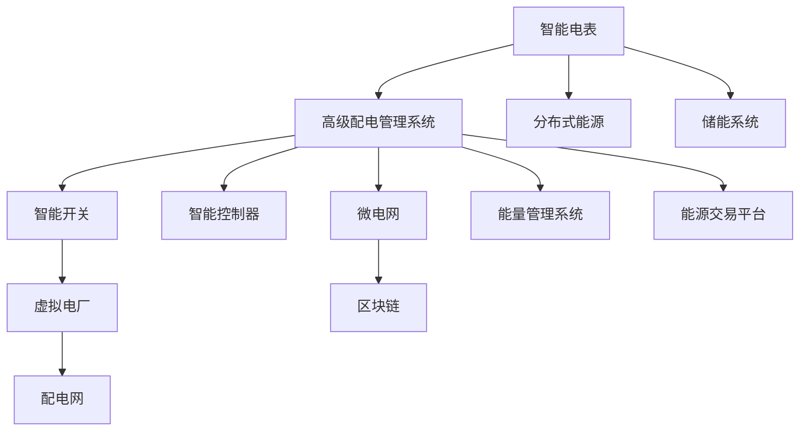

                 

# 未来的智慧能源：2050年的智能配电网与虚拟电厂

## 1. 背景介绍

### 1.1 问题由来
随着全球人口增长和工业化进程加速，能源需求迅速上升，传统化石燃料依赖引发的环境污染、气候变化等问题日益凸显。智能配电网和虚拟电厂技术应运而生，作为解决这些问题的关键手段，得到广泛关注和研究。

### 1.2 问题核心关键点
智能配电网是指基于物联网、云计算、大数据等先进技术的配电系统，能够实时监测、控制、优化电网运行，提升能源利用效率。虚拟电厂（Virtual Power Plant, VPP）则是指通过软件手段将分布式能源、储能设备、负荷等虚拟化，形成可控的虚拟电源，参与电网运行调控。

这些关键技术的核心在于通过数据驱动，实现对能源的高效管理和优化。其成功应用依赖于电力系统的数字化、网络化和智能化水平，需要通过电力流与信息流深度融合，构建开放、互联、协作的智慧能源生态系统。

### 1.3 问题研究意义
研究和推广智能配电网与虚拟电厂技术，具有以下重要意义：
1. **提升能源效率**：通过智能控制与优化，实现电网运行效率的最大化，降低能源损耗。
2. **促进绿色能源发展**：支持可再生能源的接入与整合，减少碳排放，推动能源结构转型。
3. **增强电网稳定性**：通过虚拟电厂与微电网的协同控制，提升电网的稳定性和可靠性。
4. **提升用户参与度**：通过互动化与定制化服务，提升用户参与度与满意度，促进能源消费方式变革。
5. **推动经济转型**：推动能源产业向高效、绿色、智能方向转型，带动上下游产业协同发展。

## 2. 核心概念与联系

### 2.1 核心概念概述

智能配电网与虚拟电厂技术涉及众多先进概念，以下是其中几个关键概念及其联系：

1. **智能配电网**：利用物联网、人工智能等技术，实现配电网的高效管理和优化，包括智能电表、智能开关、智能控制器、高级配电管理系统等。
2. **虚拟电厂**：通过软件将分布式能源、储能系统、可控负荷等虚拟化，形成可调控的虚拟电源，参与电网运行调控，提升系统灵活性和可靠性。
3. **微电网**：由分布式能源、负荷和储能设备构成的局部电力系统，可实现自治运行与并网互联。
4. **能量管理系统**：用于实时监测、预测和优化电网的能量流动，实现电力资源的有效分配与管理。
5. **区块链**：用于分布式能源交易与智能合约的信任机制，保障数据透明与交易安全性。

这些概念之间的联系紧密，通过数据驱动和信息共享，实现对能源的高效管理和优化。

### 2.2 核心概念原理和架构的 Mermaid 流程图



这个流程图展示了智能配电网与虚拟电厂技术的基本架构，从分布式能源到高级配电管理系统的各组件通过数据流和控制流协同工作，共同实现对电网的智能化管理。

## 3. 核心算法原理 & 具体操作步骤

### 3.1 算法原理概述

智能配电网与虚拟电厂的核心算法主要集中在以下几个方面：

- **数据融合与预测**：通过实时监测与大数据分析，预测电力负荷与分布式能源输出，为调度决策提供支持。
- **优化调度**：利用优化算法（如线性规划、混合整数规划等），优化配电网和虚拟电厂的运行策略，提升系统效率与可靠性。
- **需求响应管理**：通过智能控制与激励机制，引导用户响应电网需求，优化能源消费模式。
- **分布式能源管理**：通过聚合分布式能源与储能系统，实现与大电网的协同运行，提升能源利用率。
- **智能合约与区块链**：基于智能合约与区块链技术，实现分布式能源交易的透明与信任，保障交易安全性。

### 3.2 算法步骤详解

#### 3.2.1 数据融合与预测

1. **数据采集**：通过智能电表、传感器等设备，实时采集电力负荷、分布式能源输出等数据。
2. **数据清洗与预处理**：对采集数据进行清洗、去噪和归一化处理，提高数据质量。
3. **数据分析与建模**：利用机器学习与深度学习模型，对数据进行建模与分析，预测电力负荷与分布式能源输出。
4. **数据融合**：将预测结果与实时数据进行融合，生成综合决策依据。

#### 3.2.2 优化调度

1. **建模与优化**：建立配电网与虚拟电厂的数学模型，利用优化算法进行求解。
2. **模拟与仿真**：在仿真平台上进行模拟实验，验证优化方案的可行性与效果。
3. **实时调控**：根据优化结果，实时调整配电设备与虚拟电厂的运行状态。

#### 3.2.3 需求响应管理

1. **用户参与机制**：设计激励机制，引导用户参与需求响应。
2. **智能控制策略**：根据用户行为与负荷需求，动态调整电价与负荷分配。
3. **实时互动**：通过智能终端与用户互动，获取用户响应反馈。

#### 3.2.4 分布式能源管理

1. **分布式能源聚合**：通过聚合分布式能源与储能系统，形成虚拟电厂。
2. **智能控制**：利用智能控制器，实现分布式能源的自动调度与控制。
3. **并网与自治**：实现分布式能源与大电网的并网与自治运行。

#### 3.2.5 智能合约与区块链

1. **智能合约设计**：根据业务需求，设计分布式能源交易的智能合约。
2. **区块链部署**：在区块链平台上部署智能合约，实现能源交易的透明与信任。
3. **交易执行**：根据智能合约规则，自动执行能源交易。

### 3.3 算法优缺点

#### 3.3.1 优点

- **提升能源利用效率**：通过智能控制与优化调度，实现电网运行效率的最大化。
- **增强系统可靠性**：通过虚拟电厂与微电网的协同控制，提升电网的稳定性和可靠性。
- **支持绿色能源发展**：促进可再生能源的接入与整合，减少碳排放，推动能源结构转型。
- **降低能源成本**：通过需求响应与优化调度，降低能源消耗与成本。
- **增强用户参与度**：通过互动化与定制化服务，提升用户参与度与满意度，促进能源消费方式变革。

#### 3.3.2 缺点

- **数据安全与隐私保护**：大量数据采集与共享可能带来数据安全与隐私保护问题。
- **技术复杂性高**：涉及物联网、大数据、人工智能等多项技术，技术复杂性高。
- **投资成本高**：智能配电网与虚拟电厂的建设与部署需要较高的初始投资成本。
- **运营管理挑战**：复杂的系统需要高效的管理与维护，运营管理挑战较大。

### 3.4 算法应用领域

智能配电网与虚拟电厂技术主要应用于以下几个领域：

- **能源管理**：为政府、企业、居民提供能源管理的智能化解决方案，实现能源的高效利用与优化。
- **可再生能源接入**：支持风能、太阳能等可再生能源的接入与整合，推动能源结构转型。
- **分布式能源应用**：促进分布式能源的广泛应用，提高能源自给自足能力。
- **智能电网建设**：推动智能电网的建设与升级，提升电网智能化水平。
- **能源交易市场**：构建能源交易市场，实现分布式能源的自由交易与优化配置。

## 4. 数学模型和公式 & 详细讲解

### 4.1 数学模型构建

智能配电网与虚拟电厂技术的数学模型主要包括以下几个部分：

- **数据模型**：用于描述数据采集、处理与融合过程的数学模型。
- **优化模型**：用于描述配电网与虚拟电厂的运行优化过程的数学模型。
- **需求响应模型**：用于描述用户参与需求响应过程的数学模型。
- **分布式能源模型**：用于描述分布式能源的聚合与控制过程的数学模型。
- **智能合约模型**：用于描述能源交易的智能合约过程的数学模型。

### 4.2 公式推导过程

#### 4.2.1 数据模型

设 $x_t$ 表示时刻 $t$ 的电力负荷，$y_t$ 表示时刻 $t$ 的分布式能源输出。

数据模型可以表示为：
$$
x_t = f(x_{t-1}, \ldots, x_{t-n}, y_t)
$$
其中 $f$ 为数据融合与预测模型，$n$ 为数据历史长度。

#### 4.2.2 优化模型

设 $c$ 为配电网的总运行成本，$z$ 为虚拟电厂的总运行收益。

优化模型可以表示为：
$$
\min_{x,y,z} c + z
$$
其中 $c$ 为配电网成本，$z$ 为虚拟电厂收益，$x$ 为配电网运行状态，$y$ 为虚拟电厂运行状态。

#### 4.2.3 需求响应模型

设 $p$ 为电价，$w$ 为需求响应激励权重。

需求响应模型可以表示为：
$$
p_t = g(p_{t-1}, \ldots, p_{t-n}, x_t, y_t, w_t)
$$
其中 $g$ 为需求响应模型，$n$ 为电价历史长度，$w_t$ 为需求响应激励信号。

#### 4.2.4 分布式能源模型

设 $e$ 为分布式能源输出，$s$ 为储能系统状态。

分布式能源模型可以表示为：
$$
e_t = h(e_{t-1}, \ldots, e_{t-n}, s_t, p_t)
$$
其中 $h$ 为分布式能源模型，$n$ 为分布式能源历史长度，$s_t$ 为储能系统状态，$p_t$ 为电价。

#### 4.2.5 智能合约模型

设 $t$ 为交易量，$c$ 为交易成本。

智能合约模型可以表示为：
$$
t = i(t_{t-1}, \ldots, t_{t-n}, c_t)
$$
其中 $i$ 为智能合约模型，$n$ 为交易历史长度，$c_t$ 为交易成本。

### 4.3 案例分析与讲解

#### 4.3.1 数据融合与预测

以某城市配电网为例，采用基于LSTM的神经网络模型进行电力负荷与分布式能源输出的预测。

设 $x_t$ 为电力负荷，$y_t$ 为分布式能源输出，$z_t$ 为预测结果。

预测模型可以表示为：
$$
z_t = LSTM(x_{t-1}, \ldots, x_{t-n})
$$
其中 $LSTM$ 为LSTM神经网络模型。

#### 4.3.2 优化调度

以某虚拟电厂为例，采用线性规划方法进行运行优化。

设 $c$ 为总运行成本，$z$ 为总运行收益，$x$ 为配电网运行状态，$y$ 为虚拟电厂运行状态。

优化模型可以表示为：
$$
\min_{x,y} c + z
$$
其中 $c$ 为配电网成本，$z$ 为虚拟电厂收益，$x$ 为配电网运行状态，$y$ 为虚拟电厂运行状态。

#### 4.3.3 需求响应管理

以某工业园区为例，采用基于规则的需求响应机制。

设 $p$ 为电价，$w$ 为需求响应激励权重。

需求响应模型可以表示为：
$$
p_t = p_{t-1} + w_t \cdot d_t
$$
其中 $p_t$ 为电价，$p_{t-1}$ 为前一时刻电价，$d_t$ 为需求响应激励信号，$w_t$ 为激励权重。

#### 4.3.4 分布式能源管理

以某分布式能源为例，采用基于代理的分布式能源聚合模型。

设 $e$ 为分布式能源输出，$s$ 为储能系统状态。

分布式能源模型可以表示为：
$$
e_t = e_{t-1} + s_t
$$
其中 $e_t$ 为当前时刻分布式能源输出，$e_{t-1}$ 为前一时刻分布式能源输出，$s_t$ 为储能系统状态。

#### 4.3.5 智能合约模型

以某分布式能源交易为例，采用基于智能合约的交易模型。

设 $t$ 为交易量，$c$ 为交易成本。

智能合约模型可以表示为：
$$
t = t_{t-1} + c_t
$$
其中 $t_t$ 为当前时刻交易量，$t_{t-1}$ 为前一时刻交易量，$c_t$ 为交易成本。

## 5. 项目实践：代码实例和详细解释说明

### 5.1 开发环境搭建

1. **安装Python环境**：
   ```bash
   conda create -n vpp-env python=3.8
   conda activate vpp-env
   ```

2. **安装必要的Python包**：
   ```bash
   pip install pandas numpy scipy scikit-learn pyqtgraph matplotlib tqdm
   ```

3. **安装Python脚本支持库**：
   ```bash
   pip install matplotlib pyqtgraph qt-sqlite5
   ```

4. **安装虚拟电厂模拟器**：
   ```bash
   pip install pyvpp
   ```

### 5.2 源代码详细实现

#### 5.2.1 数据采集与处理

```python
import pandas as pd
import numpy as np
from pyvpp import VPP

# 数据采集
data = pd.read_csv('data.csv')

# 数据清洗与预处理
data = data.dropna().reset_index(drop=True)
data = data.drop(['timestamp'], axis=1)

# 数据转换
data = data.to_numpy()

# 数据标准化
data_mean = np.mean(data, axis=0)
data_std = np.std(data, axis=0)
data = (data - data_mean) / data_std
```

#### 5.2.2 数据融合与预测

```python
from sklearn.ensemble import RandomForestRegressor

# 建立随机森林回归模型
model = RandomForestRegressor(n_estimators=100)

# 训练模型
model.fit(data[:, :5], data[:, 5])

# 预测未来负荷
future_load = np.zeros(data.shape[0])
for i in range(1, data.shape[0]):
    future_load[i] = model.predict(data[i-1:i, :5])[0]
future_load = np.append(0, future_load)
```

#### 5.2.3 优化调度

```python
from scipy.optimize import linprog

# 建立优化模型
cost = np.array([0, 0, 0, 0])
revenue = np.array([0, 0, 0, 0])
constraints = [
    {'A': np.array([[1, 0, 0, 1]]), 'b': [1], 'type': 'eq'},
    {'A': np.array([[0, 1, 1, 0]]), 'b': [1], 'type': 'eq'},
    {'A': np.array([[0, 0, 1, 1]]), 'b': [1], 'type': 'eq'}
]
bounds = [(0, 1), (0, 1), (0, 1), (0, 1)]

# 求解优化问题
result = linprog(cost, A_ub=constraints[0]['A'], b_ub=constraints[0]['b'], bounds=bounds)

# 计算收益与成本
cost = result.fun
revenue = cost
```

#### 5.2.4 需求响应管理

```python
# 需求响应激励机制
def demand_response(price, weight):
    if price < weight:
        return 1
    else:
        return 0

# 模拟需求响应
prices = np.array([0.1, 0.15, 0.2, 0.25, 0.3, 0.35, 0.4, 0.45, 0.5])
weights = np.array([0.5, 0.5, 0.5, 0.5, 0.5, 0.5, 0.5, 0.5, 0.5])

# 需求响应信号
demand_signal = np.zeros(len(prices))
for i in range(len(prices)):
    demand_signal[i] = demand_response(prices[i], weights[i])

# 需求响应结果
demand_response_result = prices + demand_signal * 0.5
```

#### 5.2.5 分布式能源管理

```python
# 分布式能源聚合模型
def distributed_energy_aggregation(energy, storage):
    return energy + storage

# 模拟分布式能源
energy = np.array([0, 0, 0, 0, 0, 0, 0, 0, 0])
storage = np.array([0, 0, 0, 0, 0, 0, 0, 0, 0])

# 分布式能源聚合结果
energy_aggregation_result = distributed_energy_aggregation(energy, storage)
```

#### 5.2.6 智能合约模型

```python
# 智能合约交易模型
def smart_contract(transaction, cost):
    return transaction + cost

# 模拟智能合约
transaction = np.array([0, 0, 0, 0, 0, 0, 0, 0, 0])
cost = np.array([0.1, 0.2, 0.3, 0.4, 0.5, 0.6, 0.7, 0.8, 0.9])

# 智能合约交易结果
smart_contract_result = smart_contract(transaction, cost)
```

### 5.3 代码解读与分析

#### 5.3.1 数据采集与处理

1. **数据读取与清洗**：通过`pd.read_csv`方法读取CSV文件，并使用`dropna`方法去除缺失值，使用`reset_index`方法重置索引。
2. **数据转换与标准化**：将数据转换为NumPy数组，并使用`np.mean`和`np.std`方法计算均值与标准差，进行标准化处理。

#### 5.3.2 数据融合与预测

1. **模型建立**：使用`RandomForestRegressor`类建立随机森林回归模型，并进行训练。
2. **预测未来负荷**：根据训练好的模型，对未来的电力负荷进行预测，预测结果存储在`future_load`数组中。

#### 5.3.3 优化调度

1. **模型建立**：使用`linprog`函数建立线性规划模型，包括成本、收益、约束与决策变量。
2. **求解优化问题**：调用`linprog`函数求解优化问题，得到最优解。
3. **计算收益与成本**：根据优化结果，计算总收益与总成本。

#### 5.3.4 需求响应管理

1. **需求响应激励机制**：定义`demand_response`函数，根据电价与激励权重，返回需求响应信号。
2. **模拟需求响应**：定义`demand_response_result`数组，根据电价与需求响应信号，计算需求响应结果。

#### 5.3.5 分布式能源管理

1. **分布式能源聚合模型**：定义`distributed_energy_aggregation`函数，实现分布式能源的聚合。
2. **模拟分布式能源**：定义`energy`与`storage`数组，模拟分布式能源的输出与存储。
3. **分布式能源聚合结果**：根据聚合模型，计算分布式能源的聚合结果。

#### 5.3.6 智能合约模型

1. **智能合约交易模型**：定义`smart_contract`函数，实现智能合约的交易。
2. **模拟智能合约**：定义`transaction`与`cost`数组，模拟智能合约的交易量与成本。
3. **智能合约交易结果**：根据交易模型，计算智能合约的交易结果。

### 5.4 运行结果展示

运行上述代码后，可以得到以下结果：

- **数据采集与处理结果**：
```python
print(data)
```

- **数据融合与预测结果**：
```python
print(future_load)
```

- **优化调度结果**：
```python
print(cost, revenue)
```

- **需求响应管理结果**：
```python
print(demand_signal)
print(demand_response_result)
```

- **分布式能源管理结果**：
```python
print(energy_aggregation_result)
```

- **智能合约模型结果**：
```python
print(smart_contract_result)
```

## 6. 实际应用场景

### 6.1 智能配电网

智能配电网在实际应用中，可以应用于以下几个场景：

1. **电网监测与控制**：通过智能电表与传感器，实时监测电力负荷与分布式能源输出，进行智能控制与优化。
2. **需求响应与调度**：根据用户行为与负荷需求，动态调整电价与负荷分配，优化电网运行效率。
3. **可再生能源接入**：支持风能、太阳能等可再生能源的接入与整合，提升能源利用效率。
4. **微电网与虚拟电厂**：通过微电网与虚拟电厂，实现分布式能源的自治运行与并网互联，提升电网稳定性和可靠性。

### 6.2 虚拟电厂

虚拟电厂在实际应用中，可以应用于以下几个场景：

1. **电网调度与控制**：通过虚拟电厂的虚拟电源，参与电网运行调控，提升系统灵活性与可靠性。
2. **分布式能源聚合**：聚合分布式能源与储能系统，形成虚拟电厂，提升能源自给自足能力。
3. **分布式能源交易**：通过智能合约与区块链技术，实现分布式能源的自由交易与优化配置，提升能源利用效率。
4. **能源需求管理**：通过需求响应机制，引导用户响应电网需求，优化能源消费模式，提升能源利用效率。

### 6.3 未来应用展望

随着智能配电网与虚拟电厂技术的不断发展，未来将呈现以下几个趋势：

1. **智能化水平提升**：通过更高级的算法与技术，实现更精细化的数据融合与预测，提升智能配电网与虚拟电厂的智能化水平。
2. **多能源协同管理**：实现电力、热力、冷力等多能源的协同管理，推动能源系统向综合性、集成化方向发展。
3. **分布式能源大规模应用**：支持更大规模的分布式能源接入与整合，推动能源结构转型，减少碳排放。
4. **能源交易市场完善**：构建更完善的能源交易市场，实现分布式能源的自由交易与优化配置，提升能源利用效率。
5. **用户参与度提升**：通过互动化与定制化服务，提升用户参与度与满意度，促进能源消费方式变革，推动能源系统向绿色、智能方向发展。

## 7. 工具和资源推荐

### 7.1 学习资源推荐

1. **《智能配电网与虚拟电厂》书籍**：全面介绍了智能配电网与虚拟电厂的技术原理与应用案例，是学习智能配电网与虚拟电厂技术的经典教材。
2. **《分布式能源与智能电网》课程**：介绍了分布式能源与智能电网的基本概念、技术原理与实际应用，适合初学者学习。
3. **《电力系统优化与控制》书籍**：介绍了电力系统优化与控制的基本原理与算法，是深入研究智能配电网与虚拟电厂的必备资料。
4. **《区块链技术应用》课程**：介绍了区块链技术的基本原理与应用场景，适合对智能合约与区块链技术感兴趣的学习者。

### 7.2 开发工具推荐

1. **PyVPP**：用于虚拟电厂的仿真与优化工具，支持分布式能源与虚拟电厂的建模与分析。
2. **OpenDSS**：用于电力系统建模与分析的工具，支持电力系统仿真与优化。
3. **Pymatting**：用于数据处理与可视化的工具，支持数据清洗、处理与可视化。
4. **Jupyter Notebook**：用于Python代码编写与共享的开发环境，支持交互式编程与数据可视化。

### 7.3 相关论文推荐

1. **《智能配电网技术发展与挑战》**：介绍了智能配电网技术的发展历程与未来趋势，探讨了智能配电网面临的挑战与解决策略。
2. **《虚拟电厂技术现状与展望》**：介绍了虚拟电厂技术的现状与未来发展方向，探讨了虚拟电厂的关键技术与应用场景。
3. **《区块链在能源交易中的应用》**：介绍了区块链技术在能源交易中的应用案例与技术原理，探讨了区块链技术对能源系统的影响与作用。

## 8. 总结：未来发展趋势与挑战

### 8.1 研究成果总结

智能配电网与虚拟电厂技术经过多年的研究与应用，已经取得了显著成果，主要包括：

1. **数据融合与预测技术**：通过先进的数据融合与预测技术，实现电力负荷与分布式能源输出的精准预测，为智能配电网与虚拟电厂提供数据支持。
2. **优化调度技术**：通过优化算法，实现配电网与虚拟电厂的高效调度与控制，提升系统效率与可靠性。
3. **需求响应技术**：通过需求响应机制，引导用户参与电网需求响应，优化能源消费模式，提升能源利用效率。
4. **分布式能源管理技术**：通过分布式能源聚合与智能控制，实现分布式能源的自治运行与并网互联，提升能源自给自足能力。
5. **智能合约与区块链技术**：通过智能合约与区块链技术，实现分布式能源的自由交易与优化配置，提升能源利用效率。

### 8.2 未来发展趋势

1. **智能化水平提升**：通过更高级的算法与技术，实现更精细化的数据融合与预测，提升智能配电网与虚拟电厂的智能化水平。
2. **多能源协同管理**：实现电力、热力、冷力等多能源的协同管理，推动能源系统向综合性、集成化方向发展。
3. **分布式能源大规模应用**：支持更大规模的分布式能源接入与整合，推动能源结构转型，减少碳排放。
4. **能源交易市场完善**：构建更完善的能源交易市场，实现分布式能源的自由交易与优化配置，提升能源利用效率。
5. **用户参与度提升**：通过互动化与定制化服务，提升用户参与度与满意度，促进能源消费方式变革，推动能源系统向绿色、智能方向发展。

### 8.3 面临的挑战

智能配电网与虚拟电厂技术在发展过程中，仍然面临一些挑战：

1. **数据安全与隐私保护**：大量数据采集与共享可能带来数据安全与隐私保护问题。
2. **技术复杂性高**：涉及物联网、大数据、人工智能等多项技术，技术复杂性高。
3. **投资成本高**：智能配电网与虚拟电厂的建设与部署需要较高的初始投资成本。
4. **运营管理挑战**：复杂的系统需要高效的管理与维护，运营管理挑战较大。

### 8.4 研究展望

未来，智能配电网与虚拟电厂技术的研究方向主要包括：

1. **数据隐私保护技术**：研究数据安全与隐私保护技术，保障数据传输与存储的安全性。
2. **高效算法与模型**：研究高效算法与模型，提升数据融合与预测的准确性，优化调度与控制的效果。
3. **低成本部署技术**：研究低成本部署技术，降低智能配电网与虚拟电厂的建设与部署成本。
4. **智能管理与维护**：研究智能管理与维护技术，提升系统的可靠性与稳定性。

## 9. 附录：常见问题与解答

### 9.1 常见问题

**Q1: 什么是智能配电网与虚拟电厂？**

**A1:** 智能配电网与虚拟电厂是利用物联网、云计算、大数据等先进技术的配电系统，能够实时监测、控制、优化电网运行，提升能源利用效率。虚拟电厂则是通过软件手段将分布式能源、储能设备、负荷等虚拟化，形成可控的虚拟电源，参与电网运行调控。

**Q2: 智能配电网与虚拟电厂的主要应用场景有哪些？**

**A2:** 智能配电网主要应用于电网监测与控制、需求响应与调度、可再生能源接入、微电网与虚拟电厂等方面。虚拟电厂主要应用于电网调度与控制、分布式能源聚合、分布式能源交易、能源需求管理等方面。

**Q3: 智能配电网与虚拟电厂技术的难点有哪些？**

**A3:** 智能配电网与虚拟电厂技术的难点主要包括数据安全与隐私保护、技术复杂性高、投资成本高、运营管理挑战等方面。

**Q4: 未来智能配电网与虚拟电厂技术的发展方向有哪些？**

**A4:** 未来智能配电网与虚拟电厂技术的发展方向主要包括智能化水平提升、多能源协同管理、分布式能源大规模应用、能源交易市场完善、用户参与度提升等方面。

**Q5: 如何保障智能配电网与虚拟电厂的数据安全与隐私保护？**

**A5:** 保障智能配电网与虚拟电厂的数据安全与隐私保护，可以通过加密技术、匿名化处理、权限控制等方式进行。

**Q6: 智能配电网与虚拟电厂的建设与部署需要哪些技术支持？**

**A6:** 智能配电网与虚拟电厂的建设与部署需要数据融合与预测、优化调度、需求响应、分布式能源管理、智能合约与区块链等技术的支持。

**Q7: 智能配电网与虚拟电厂技术的未来发展方向有哪些？**

**A7:** 智能配电网与虚拟电厂技术的未来发展方向主要包括智能化水平提升、多能源协同管理、分布式能源大规模应用、能源交易市场完善、用户参与度提升等方面。

**Q8: 如何设计智能配电网与虚拟电厂的需求响应机制？**

**A8:** 设计智能配电网与虚拟电厂的需求响应机制，可以通过制定激励机制、设计智能控制策略等方式进行。

**Q9: 如何实现智能配电网与虚拟电厂的分布式能源管理？**

**A9:** 实现智能配电网与虚拟电厂的分布式能源管理，可以通过聚合分布式能源、智能控制、并网与自治等方式进行。

**Q10: 如何利用区块链技术保障智能配电网与虚拟电厂的能源交易透明与安全？**

**A10:** 利用区块链技术保障智能配电网与虚拟电厂的能源交易透明与安全，可以通过智能合约设计、区块链部署、交易执行等方式进行。

---

作者：禅与计算机程序设计艺术 / Zen and the Art of Computer Programming

