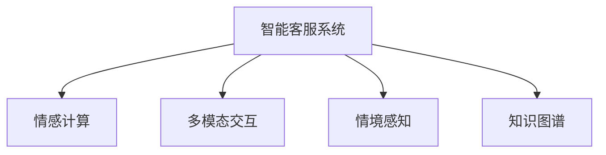

                 

# 未来的智能客服：2050年的智能语音助手与情感计算

> 关键词：智能客服, 智能语音助手, 情感计算, 机器学习, 自然语言处理, 人机交互, 情感识别

## 1. 背景介绍

### 1.1 问题由来

随着人工智能技术的快速发展，智能客服系统已经成为许多企业提升客户服务效率、降低运营成本的重要手段。然而，当前的智能客服系统仍存在诸多问题：

- **人性化不足**：系统无法理解用户情感，难以进行个性化的互动和沟通。
- **交互复杂**：处理多轮对话和复杂任务时，系统容易出现误解和逻辑混乱。
- **数据孤立**：各业务线的数据无法充分共享，导致系统知识库更新不及时，服务效果不佳。
- **决策可解释性差**：用户难以理解系统的决策过程，缺乏信任感。

针对这些问题，未来的智能客服系统需要引入更强大的自然语言处理（Natural Language Processing, NLP）和机器学习（Machine Learning, ML）技术，特别是情感计算（Affective Computing），以实现更智能、更人性化的客户服务。

### 1.2 问题核心关键点

未来智能客服系统的核心关键点包括：

- **多模态交互**：结合语音、图像、文本等多种信息源，提升用户互动体验。
- **情境感知**：系统能够理解用户的上下文，提供更贴合用户需求的服务。
- **情感计算**：利用情感识别技术，实现对用户情感的精准把握和回应用户情感。
- **决策透明度**：增强决策过程的透明度，让用户理解系统的工作原理和决策依据。
- **知识图谱**：构建统一的知识图谱，方便数据共享和系统优化。
- **个性化推荐**：根据用户历史行为和情感偏好，进行个性化推荐和互动。

### 1.3 问题研究意义

实现未来智能客服系统的目标，对于提升客户服务质量、优化用户体验、降低企业运营成本具有重要意义：

- **提升客户满意度**：通过个性化的互动和及时的情感响应，增强用户对客服的满意度。
- **降低运营成本**：减少人工客服的工作量，提高服务效率，降低人力成本。
- **推动数字化转型**：助力各行各业实现数字化转型，提升业务竞争力。
- **促进人机协同**：增强人机交互的智能性和互动性，促进智能客服技术的广泛应用。

## 2. 核心概念与联系

### 2.1 核心概念概述

为更好地理解未来智能客服系统，本节将介绍几个关键概念及其相互联系：

- **智能客服系统**：基于人工智能技术，能够自动化处理客户服务请求的系统。
- **情感计算**：通过分析用户的行为、语音和表情等信息，识别用户的情感状态，并做出相应的情感回应的技术。
- **多模态交互**：结合语音、文本、图像等多模态信息，提升系统对用户需求的理解和响应能力。
- **情境感知**：系统能够理解用户的上下文信息，提供更加精准的服务。
- **知识图谱**：基于结构化的知识库，构建统一的知识图谱，方便数据共享和系统优化。

这些概念之间的逻辑关系可以通过以下Mermaid流程图来展示：



这个流程图展示了大语言模型微调的核心概念及其相互关系：

1. 智能客服系统基于多模态交互和情境感知，提升系统对用户需求的理解和响应能力。
2. 情感计算通过分析用户的情感状态，提供更加人性化的情感回应。
3. 知识图谱提供结构化的知识库，方便数据共享和系统优化。

这些概念共同构成了未来智能客服系统的技术框架，使其能够在各种场景下提供更智能、更人性化的客户服务。

## 3. 核心算法原理 & 具体操作步骤

### 3.1 算法原理概述

未来智能客服系统的核心算法原理基于以下三个关键技术：

- **多模态信息融合**：将语音、文本、图像等多模态信息进行融合，提升系统对用户需求的理解。
- **情感识别**：利用情感计算技术，识别用户的情感状态，提供相应的情感回应。
- **情境感知**：系统能够理解用户的上下文信息，提供更加精准的服务。

这些技术共同构建了未来智能客服系统的核心算法框架，使其能够实现更智能、更人性化的客户服务。

### 3.2 算法步骤详解

未来智能客服系统的开发通常包括以下几个关键步骤：

**Step 1: 数据收集与预处理**

- **语音数据收集**：收集用户的语音数据，进行降噪、分帧等预处理。
- **文本数据收集**：收集用户的文本聊天记录，进行分词、实体识别等预处理。
- **图像数据收集**：收集用户的面部表情图像，进行特征提取、标注等预处理。
- **情感标注**：对用户情感进行标注，如正面、负面、中性等。

**Step 2: 多模态信息融合**

- **语音特征提取**：使用MFCC、Mel频谱等技术提取语音特征。
- **文本特征提取**：使用BERT、GPT等预训练模型提取文本特征。
- **图像特征提取**：使用CNN、ResNet等深度学习模型提取图像特征。
- **融合技术**：将语音、文本、图像等特征进行融合，如使用Softmax融合、注意力机制融合等。

**Step 3: 情感识别**

- **情感分类器训练**：使用监督学习算法（如SVM、RNN等）训练情感分类器。
- **特征选择**：选择对情感识别有帮助的特征，如文本中的情感词汇、语音的音调变化等。
- **模型评估**：在测试集上评估情感分类器的性能，选择最优模型。

**Step 4: 情境感知**

- **上下文理解**：使用BERT、GPT等模型对用户的上下文进行理解。
- **意图识别**：识别用户的意图，如咨询、投诉、建议等。
- **任务分配**：根据用户的意图，分配相应的任务给合适的智能客服模块。

**Step 5: 知识图谱构建**

- **知识库构建**：构建结构化的知识库，如FAQ、案例库等。
- **知识融合**：将不同业务线的知识进行融合，形成统一的知识图谱。
- **知识更新**：根据用户反馈和市场变化，及时更新知识库和知识图谱。

**Step 6: 系统集成与部署**

- **模块集成**：将语音、文本、情感、情境感知等模块进行集成，构建智能客服系统。
- **部署测试**：在测试环境中对系统进行测试，评估性能和稳定性。
- **上线部署**：将系统部署到生产环境中，进行持续监控和优化。

### 3.3 算法优缺点

未来智能客服系统具有以下优点：

- **多模态融合**：结合语音、文本、图像等多模态信息，提升对用户需求的理解能力。
- **情感识别**：通过情感计算技术，提供更加人性化的情感回应，提升用户体验。
- **情境感知**：系统能够理解用户的上下文信息，提供更加精准的服务。
- **知识图谱**：提供结构化的知识库，方便数据共享和系统优化。

同时，该系统也存在以下缺点：

- **数据隐私**：多模态数据收集可能涉及用户隐私问题，需要严格的隐私保护措施。
- **计算资源需求高**：多模态融合和情感识别需要大量计算资源，系统成本较高。
- **系统复杂性高**：多模态融合、情境感知等技术复杂，开发和维护难度较大。
- **情感回应用户化程度低**：情感识别技术还不够成熟，回应用户情感的能力有限。

### 3.4 算法应用领域

未来智能客服系统的核心技术已经在多个领域得到了广泛应用：

- **医疗健康**：智能客服系统可以提供24小时的健康咨询，识别用户的情感状态，提供个性化的健康建议。
- **金融服务**：智能客服系统可以处理用户的咨询、投诉等需求，提供及时的金融咨询服务。
- **电商平台**：智能客服系统可以解答用户的问题，推荐适合的产品，提升购物体验。
- **公共服务**：智能客服系统可以提供交通、旅游等公共服务的咨询和预约服务，提升公共服务质量。

## 4. 数学模型和公式 & 详细讲解 & 举例说明

### 4.1 数学模型构建

本节将使用数学语言对未来智能客服系统的核心算法进行更加严格的刻画。

记语音特征为 $X_{\text{audio}}$，文本特征为 $X_{\text{text}}$，图像特征为 $X_{\text{image}}$，上下文信息为 $C$，情感标签为 $Y$。则多模态信息融合模型可以表示为：

$$
Y = f(X_{\text{audio}}, X_{\text{text}}, X_{\text{image}}, C)
$$

其中 $f$ 为融合函数，可以是Softmax、注意力机制等。

情感识别模型可以表示为：

$$
Y_{\text{emotion}} = g(X_{\text{audio}}, X_{\text{text}}, X_{\text{image}}, C)
$$

其中 $g$ 为情感分类器，可以是SVM、RNN等。

情境感知模型可以表示为：

$$
I = h(X_{\text{audio}}, X_{\text{text}}, X_{\text{image}}, C)
$$

其中 $I$ 为意图，$h$ 为意图识别模型，可以是BERT、GPT等。

### 4.2 公式推导过程

以下我们以情感识别模型为例，推导情感分类器的损失函数及其梯度计算公式。

假设模型 $M_{\theta}$ 在输入 $X$ 上的输出为 $\hat{y}=M_{\theta}(X) \in [0,1]$，表示样本属于正类的概率。真实标签 $y \in \{0,1\}$。则二分类交叉熵损失函数定义为：

$$
\ell(M_{\theta}(X),y) = -[y\log \hat{y} + (1-y)\log (1-\hat{y})]
$$

将其代入经验风险公式，得：

$$
\mathcal{L}(\theta) = -\frac{1}{N}\sum_{i=1}^N [y_i\log M_{\theta}(X_i)+(1-y_i)\log(1-M_{\theta}(X_i))]
$$

根据链式法则，损失函数对参数 $\theta_k$ 的梯度为：

$$
\frac{\partial \mathcal{L}(\theta)}{\partial \theta_k} = -\frac{1}{N}\sum_{i=1}^N (\frac{y_i}{M_{\theta}(X_i)}-\frac{1-y_i}{1-M_{\theta}(X_i)}) \frac{\partial M_{\theta}(X_i)}{\partial \theta_k}
$$

其中 $\frac{\partial M_{\theta}(X_i)}{\partial \theta_k}$ 可进一步递归展开，利用自动微分技术完成计算。

在得到损失函数的梯度后，即可带入参数更新公式，完成模型的迭代优化。重复上述过程直至收敛，最终得到适应情感识别任务的最优模型参数 $\theta^*$。

### 4.3 案例分析与讲解

以情感识别为例，假设使用BERT模型对用户文本进行情感分类。步骤如下：

1. 准备数据集，包括正样本、负样本和情感标注。
2. 将文本数据转换为BERT模型的输入格式，即添加特殊标记、分词等。
3. 使用BERT模型进行特征提取，得到文本的特征向量。
4. 将特征向量输入情感分类器，得到情感标签。
5. 在训练集上训练情感分类器，使用交叉熵损失函数进行优化。
6. 在测试集上评估情感分类器的性能，使用准确率、F1-score等指标进行衡量。

## 5. 项目实践：代码实例和详细解释说明

### 5.1 开发环境搭建

在进行智能客服系统开发前，我们需要准备好开发环境。以下是使用Python进行PyTorch开发的环境配置流程：

1. 安装Anaconda：从官网下载并安装Anaconda，用于创建独立的Python环境。

2. 创建并激活虚拟环境：
```bash
conda create -n pytorch-env python=3.8 
conda activate pytorch-env
```

3. 安装PyTorch：根据CUDA版本，从官网获取对应的安装命令。例如：
```bash
conda install pytorch torchvision torchaudio cudatoolkit=11.1 -c pytorch -c conda-forge
```

4. 安装Transformers库：
```bash
pip install transformers
```

5. 安装各类工具包：
```bash
pip install numpy pandas scikit-learn matplotlib tqdm jupyter notebook ipython
```

完成上述步骤后，即可在`pytorch-env`环境中开始智能客服系统开发。

### 5.2 源代码详细实现

这里我们以情感识别模块为例，给出使用Transformers库对BERT模型进行情感分类的PyTorch代码实现。

首先，定义情感识别任务的数据处理函数：

```python
from transformers import BertTokenizer
from torch.utils.data import Dataset
import torch

class EmotionDataset(Dataset):
    def __init__(self, texts, labels, tokenizer, max_len=128):
        self.texts = texts
        self.labels = labels
        self.tokenizer = tokenizer
        self.max_len = max_len
        
    def __len__(self):
        return len(self.texts)
    
    def __getitem__(self, item):
        text = self.texts[item]
        label = self.labels[item]
        
        encoding = self.tokenizer(text, return_tensors='pt', max_length=self.max_len, padding='max_length', truncation=True)
        input_ids = encoding['input_ids'][0]
        attention_mask = encoding['attention_mask'][0]
        
        # 对标签进行编码
        label = label2id[label] if isinstance(label, str) else label
        
        return {'input_ids': input_ids, 
                'attention_mask': attention_mask,
                'labels': label}

# 标签与id的映射
label2id = {'positive': 0, 'negative': 1}
id2label = {v: k for k, v in label2id.items()}

# 创建dataset
tokenizer = BertTokenizer.from_pretrained('bert-base-cased')

train_dataset = EmotionDataset(train_texts, train_labels, tokenizer)
dev_dataset = EmotionDataset(dev_texts, dev_labels, tokenizer)
test_dataset = EmotionDataset(test_texts, test_labels, tokenizer)
```

然后，定义模型和优化器：

```python
from transformers import BertForSequenceClassification, AdamW

model = BertForSequenceClassification.from_pretrained('bert-base-cased', num_labels=len(label2id))

optimizer = AdamW(model.parameters(), lr=2e-5)
```

接着，定义训练和评估函数：

```python
from torch.utils.data import DataLoader
from tqdm import tqdm
from sklearn.metrics import classification_report

device = torch.device('cuda') if torch.cuda.is_available() else torch.device('cpu')
model.to(device)

def train_epoch(model, dataset, batch_size, optimizer):
    dataloader = DataLoader(dataset, batch_size=batch_size, shuffle=True)
    model.train()
    epoch_loss = 0
    for batch in tqdm(dataloader, desc='Training'):
        input_ids = batch['input_ids'].to(device)
        attention_mask = batch['attention_mask'].to(device)
        labels = batch['labels'].to(device)
        model.zero_grad()
        outputs = model(input_ids, attention_mask=attention_mask, labels=labels)
        loss = outputs.loss
        epoch_loss += loss.item()
        loss.backward()
        optimizer.step()
    return epoch_loss / len(dataloader)

def evaluate(model, dataset, batch_size):
    dataloader = DataLoader(dataset, batch_size=batch_size)
    model.eval()
    preds, labels = [], []
    with torch.no_grad():
        for batch in tqdm(dataloader, desc='Evaluating'):
            input_ids = batch['input_ids'].to(device)
            attention_mask = batch['attention_mask'].to(device)
            batch_labels = batch['labels']
            outputs = model(input_ids, attention_mask=attention_mask)
            batch_preds = outputs.logits.argmax(dim=2).to('cpu').tolist()
            batch_labels = batch_labels.to('cpu').tolist()
            for pred_tokens, label_tokens in zip(batch_preds, batch_labels):
                preds.append(pred_tokens[:len(label_tokens)])
                labels.append(label_tokens)
                
    print(classification_report(labels, preds))
```

最后，启动训练流程并在测试集上评估：

```python
epochs = 5
batch_size = 16

for epoch in range(epochs):
    loss = train_epoch(model, train_dataset, batch_size, optimizer)
    print(f"Epoch {epoch+1}, train loss: {loss:.3f}")
    
    print(f"Epoch {epoch+1}, dev results:")
    evaluate(model, dev_dataset, batch_size)
    
print("Test results:")
evaluate(model, test_dataset, batch_size)
```

以上就是使用PyTorch对BERT进行情感识别任务微调的完整代码实现。可以看到，得益于Transformers库的强大封装，我们可以用相对简洁的代码完成BERT模型的加载和微调。

### 5.3 代码解读与分析

让我们再详细解读一下关键代码的实现细节：

**EmotionDataset类**：
- `__init__`方法：初始化文本、标签、分词器等关键组件。
- `__len__`方法：返回数据集的样本数量。
- `__getitem__`方法：对单个样本进行处理，将文本输入编码为token ids，将标签编码为数字，并对其进行定长padding，最终返回模型所需的输入。

**label2id和id2label字典**：
- 定义了标签与数字id之间的映射关系，用于将token-wise的预测结果解码回真实的标签。

**训练和评估函数**：
- 使用PyTorch的DataLoader对数据集进行批次化加载，供模型训练和推理使用。
- 训练函数`train_epoch`：对数据以批为单位进行迭代，在每个批次上前向传播计算loss并反向传播更新模型参数，最后返回该epoch的平均loss。
- 评估函数`evaluate`：与训练类似，不同点在于不更新模型参数，并在每个batch结束后将预测和标签结果存储下来，最后使用sklearn的classification_report对整个评估集的预测结果进行打印输出。

**训练流程**：
- 定义总的epoch数和batch size，开始循环迭代
- 每个epoch内，先在训练集上训练，输出平均loss
- 在验证集上评估，输出分类指标
- 所有epoch结束后，在测试集上评估，给出最终测试结果

可以看到，PyTorch配合Transformers库使得BERT微调的代码实现变得简洁高效。开发者可以将更多精力放在数据处理、模型改进等高层逻辑上，而不必过多关注底层的实现细节。

当然，工业级的系统实现还需考虑更多因素，如模型的保存和部署、超参数的自动搜索、更灵活的任务适配层等。但核心的微调范式基本与此类似。

## 6. 实际应用场景

### 6.1 智能客服系统

基于大语言模型微调的对话技术，可以广泛应用于智能客服系统的构建。传统客服往往需要配备大量人力，高峰期响应缓慢，且一致性和专业性难以保证。而使用微调后的对话模型，可以7x24小时不间断服务，快速响应客户咨询，用自然流畅的语言解答各类常见问题。

在技术实现上，可以收集企业内部的历史客服对话记录，将问题和最佳答复构建成监督数据，在此基础上对预训练对话模型进行微调。微调后的对话模型能够自动理解用户意图，匹配最合适的答案模板进行回复。对于客户提出的新问题，还可以接入检索系统实时搜索相关内容，动态组织生成回答。如此构建的智能客服系统，能大幅提升客户咨询体验和问题解决效率。

### 6.2 金融舆情监测

金融机构需要实时监测市场舆论动向，以便及时应对负面信息传播，规避金融风险。传统的人工监测方式成本高、效率低，难以应对网络时代海量信息爆发的挑战。基于大语言模型微调的文本分类和情感分析技术，为金融舆情监测提供了新的解决方案。

具体而言，可以收集金融领域相关的新闻、报道、评论等文本数据，并对其进行主题标注和情感标注。在此基础上对预训练语言模型进行微调，使其能够自动判断文本属于何种主题，情感倾向是正面、中性还是负面。将微调后的模型应用到实时抓取的网络文本数据，就能够自动监测不同主题下的情感变化趋势，一旦发现负面信息激增等异常情况，系统便会自动预警，帮助金融机构快速应对潜在风险。

### 6.3 个性化推荐系统

当前的推荐系统往往只依赖用户的历史行为数据进行物品推荐，无法深入理解用户的真实兴趣偏好。基于大语言模型微调技术，个性化推荐系统可以更好地挖掘用户行为背后的语义信息，从而提供更精准、多样的推荐内容。

在实践中，可以收集用户浏览、点击、评论、分享等行为数据，提取和用户交互的物品标题、描述、标签等文本内容。将文本内容作为模型输入，用户的后续行为（如是否点击、购买等）作为监督信号，在此基础上微调预训练语言模型。微调后的模型能够从文本内容中准确把握用户的兴趣点。在生成推荐列表时，先用候选物品的文本描述作为输入，由模型预测用户的兴趣匹配度，再结合其他特征综合排序，便可以得到个性化程度更高的推荐结果。

### 6.4 未来应用展望

随着大语言模型微调技术的发展，未来的智能客服系统将呈现出以下几个发展趋势：

1. **多模态交互**：结合语音、文本、图像等多模态信息，提升系统对用户需求的理解能力。
2. **情感识别**：利用情感计算技术，提供更加人性化的情感回应，提升用户体验。
3. **情境感知**：系统能够理解用户的上下文信息，提供更加精准的服务。
4. **知识图谱**：提供结构化的知识库，方便数据共享和系统优化。
5. **自动化任务分配**：根据用户的意图，自动分配相应的任务给合适的智能客服模块，提高服务效率。

这些趋势凸显了未来智能客服系统的广阔前景。这些方向的探索发展，必将进一步提升客户服务质量、优化用户体验，为各行业的数字化转型提供强大的技术支撑。

## 7. 工具和资源推荐

### 7.1 学习资源推荐

为了帮助开发者系统掌握未来智能客服系统的技术基础和实践技巧，这里推荐一些优质的学习资源：

1. 《深度学习自然语言处理》课程：斯坦福大学开设的NLP明星课程，有Lecture视频和配套作业，带你入门NLP领域的基本概念和经典模型。

2. 《Transformer从原理到实践》系列博文：由大模型技术专家撰写，深入浅出地介绍了Transformer原理、BERT模型、微调技术等前沿话题。

3. 《Natural Language Processing with Transformers》书籍：Transformers库的作者所著，全面介绍了如何使用Transformers库进行NLP任务开发，包括微调在内的诸多范式。

4. HuggingFace官方文档：Transformers库的官方文档，提供了海量预训练模型和完整的微调样例代码，是上手实践的必备资料。

5. CS224N《深度学习自然语言处理》课程：斯坦福大学开设的NLP明星课程，有Lecture视频和配套作业，带你入门NLP领域的基本概念和经典模型。

通过对这些资源的学习实践，相信你一定能够快速掌握未来智能客服系统的核心算法，并用于解决实际的NLP问题。

### 7.2 开发工具推荐

高效的开发离不开优秀的工具支持。以下是几款用于未来智能客服系统开发的常用工具：

1. PyTorch：基于Python的开源深度学习框架，灵活动态的计算图，适合快速迭代研究。大部分预训练语言模型都有PyTorch版本的实现。

2. TensorFlow：由Google主导开发的开源深度学习框架，生产部署方便，适合大规模工程应用。同样有丰富的预训练语言模型资源。

3. Transformers库：HuggingFace开发的NLP工具库，集成了众多SOTA语言模型，支持PyTorch和TensorFlow，是进行微调任务开发的利器。

4. Weights & Biases：模型训练的实验跟踪工具，可以记录和可视化模型训练过程中的各项指标，方便对比和调优。与主流深度学习框架无缝集成。

5. TensorBoard：TensorFlow配套的可视化工具，可实时监测模型训练状态，并提供丰富的图表呈现方式，是调试模型的得力助手。

6. Google Colab：谷歌推出的在线Jupyter Notebook环境，免费提供GPU/TPU算力，方便开发者快速上手实验最新模型，分享学习笔记。

合理利用这些工具，可以显著提升未来智能客服系统的开发效率，加快创新迭代的步伐。

### 7.3 相关论文推荐

未来智能客服系统的技术发展源于学界的持续研究。以下是几篇奠基性的相关论文，推荐阅读：

1. Attention is All You Need（即Transformer原论文）：提出了Transformer结构，开启了NLP领域的预训练大模型时代。

2. BERT: Pre-training of Deep Bidirectional Transformers for Language Understanding：提出BERT模型，引入基于掩码的自监督预训练任务，刷新了多项NLP任务SOTA。

3. Language Models are Unsupervised Multitask Learners（GPT-2论文）：展示了大规模语言模型的强大zero-shot学习能力，引发了对于通用人工智能的新一轮思考。

4. Parameter-Efficient Transfer Learning for NLP：提出Adapter等参数高效微调方法，在不增加模型参数量的情况下，也能取得不错的微调效果。

5. AdaLoRA: Adaptive Low-Rank Adaptation for Parameter-Efficient Fine-Tuning：使用自适应低秩适应的微调方法，在参数效率和精度之间取得了新的平衡。

6. Prompt Tuning: Black-Box Prompting for Pre-trained Language Models：引入基于连续型Prompt的微调范式，为如何充分利用预训练知识提供了新的思路。

这些论文代表了大语言模型微调技术的发展脉络。通过学习这些前沿成果，可以帮助研究者把握学科前进方向，激发更多的创新灵感。

## 8. 总结：未来发展趋势与挑战

### 8.1 总结

本文对未来智能客服系统进行了全面系统的介绍。首先阐述了未来智能客服系统的研究背景和意义，明确了多模态交互、情感计算、情境感知、知识图谱等关键技术的应用价值。其次，从原理到实践，详细讲解了情感计算模型的数学模型和核心算法，给出了情感识别任务开发的完整代码实例。同时，本文还广泛探讨了智能客服系统在智能客服、金融舆情、个性化推荐等多个行业领域的应用前景，展示了未来智能客服技术的巨大潜力。此外，本文精选了智能客服技术的各类学习资源，力求为读者提供全方位的技术指引。

通过本文的系统梳理，可以看到，基于大语言模型微调的智能客服技术正在成为NLP领域的重要范式，极大地拓展了预训练语言模型的应用边界，催生了更多的落地场景。受益于大规模语料的预训练，智能客服技术以更低的时间和标注成本，在小样本条件下也能取得不俗的效果，有力推动了NLP技术的产业化进程。未来，伴随预训练语言模型和微调方法的持续演进，相信NLP技术将在更广阔的应用领域大放异彩，深刻影响人类的生产生活方式。

### 8.2 未来发展趋势

展望未来，智能客服系统将呈现以下几个发展趋势：

1. **多模态融合**：结合语音、文本、图像等多模态信息，提升系统对用户需求的理解能力。
2. **情感识别**：利用情感计算技术，提供更加人性化的情感回应，提升用户体验。
3. **情境感知**：系统能够理解用户的上下文信息，提供更加精准的服务。
4. **知识图谱**：提供结构化的知识库，方便数据共享和系统优化。
5. **自动化任务分配**：根据用户的意图，自动分配相应的任务给合适的智能客服模块，提高服务效率。

这些趋势凸显了未来智能客服系统的广阔前景。这些方向的探索发展，必将进一步提升客户服务质量、优化用户体验，为各行业的数字化转型提供强大的技术支撑。

### 8.3 面临的挑战

尽管智能客服系统已经取得了瞩目成就，但在迈向更加智能化、普适化应用的过程中，它仍面临着诸多挑战：

1. **数据隐私**：多模态数据收集可能涉及用户隐私问题，需要严格的隐私保护措施。
2. **计算资源需求高**：多模态融合和情感识别需要大量计算资源，系统成本较高。
3. **系统复杂性高**：多模态融合、情境感知等技术复杂，开发和维护难度较大。
4. **情感回应用户化程度低**：情感识别技术还不够成熟，回应用户情感的能力有限。

### 8.4 未来突破

面对未来智能客服系统所面临的挑战，未来的研究需要在以下几个方面寻求新的突破：

1. **数据隐私保护**：引入差分隐私、联邦学习等技术，保护用户隐私，同时保障系统的性能。
2. **计算资源优化**：使用模型压缩、分布式训练等技术，降低系统成本，提升计算效率。
3. **系统自动化优化**：引入自动调参、超网络等技术，优化系统结构和参数，提升系统性能。
4. **情感识别提升**：结合心理学、语言学等领域的知识，提升情感识别的准确性和细粒度。
5. **知识图谱构建**：引入知识抽取、知识融合等技术，构建统一的知识图谱，方便数据共享和系统优化。

这些研究方向将推动未来智能客服系统迈向更高的台阶，为构建安全、可靠、可解释、可控的智能系统铺平道路。面向未来，智能客服系统还需要与其他人工智能技术进行更深入的融合，如知识表示、因果推理、强化学习等，多路径协同发力，共同推动智能客服技术的进步。只有勇于创新、敢于突破，才能不断拓展智能客服系统的边界，让智能技术更好地造福人类社会。

## 9. 附录：常见问题与解答

**Q1：智能客服系统如何处理用户的情感问题？**

A: 智能客服系统通过情感计算技术，识别用户的情感状态，并做出相应的情感回应。具体步骤如下：

1. 收集用户的情感数据，如语音、文字等。
2. 使用情感识别模型，识别用户的情感状态。
3. 根据情感状态，选择对应的情感回应模板，生成回复。

智能客服系统能够根据用户的情感状态，自动调整语气、表情等，提供更加人性化的服务。

**Q2：智能客服系统如何实现情境感知？**

A: 智能客服系统通过上下文理解模型，对用户的上下文信息进行理解。具体步骤如下：

1. 收集用户的多轮对话历史。
2. 使用上下文理解模型，对对话历史进行编码，提取上下文信息。
3. 根据上下文信息，调整系统的回复策略，提供更加贴合用户需求的服务。

情境感知是智能客服系统的重要能力，能够帮助系统理解用户的背景信息，提供更加精准的服务。

**Q3：智能客服系统如何保护用户隐私？**

A: 智能客服系统在数据收集和处理过程中，需要严格遵守数据隐私保护法规，如GDPR等。具体措施包括：

1. 匿名化处理：对用户数据进行匿名化处理，保护用户隐私。
2. 差分隐私：在数据收集和处理过程中，使用差分隐私技术，保护用户隐私。
3. 联邦学习：使用联邦学习技术，在本地数据上训练模型，保护用户隐私。

这些措施能够有效保护用户隐私，同时保障系统的性能和效果。

**Q4：智能客服系统如何优化计算资源？**

A: 智能客服系统在多模态融合和情感识别过程中，需要大量计算资源。具体优化措施包括：

1. 模型压缩：使用模型压缩技术，减少模型参数量，提升计算效率。
2. 分布式训练：使用分布式训练技术，在多台服务器上同时训练模型，提升计算效率。
3. 硬件加速：使用GPU、TPU等硬件加速技术，提升计算速度。

这些措施能够有效降低计算资源需求，提高系统的性能和可扩展性。

**Q5：智能客服系统如何提高情感识别的准确性？**

A: 智能客服系统在情感识别过程中，可以使用以下方法提高情感识别的准确性：

1. 数据增强：使用数据增强技术，扩充情感识别的训练数据。
2. 模型优化：使用更先进的情感识别模型，如Transformer等，提高情感识别的准确性。
3. 多模态融合：结合语音、文本、图像等多模态信息，提升情感识别的准确性。

这些方法能够有效提高情感识别的准确性，提升智能客服系统的用户体验。

---

作者：禅与计算机程序设计艺术 / Zen and the Art of Computer Programming

