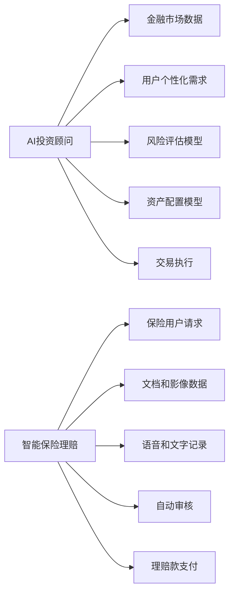

                 

# 未来的智能金融：2050年的AI投资顾问与智能保险理赔

## 1. 背景介绍

随着人工智能技术的飞速发展，金融行业正处于一场深刻的变革之中。未来的金融系统将由高度智能化、自动化的AI工具驱动，为用户提供更加精准、高效的服务。本文将探讨2050年智能金融的两个关键应用场景：AI投资顾问与智能保险理赔。

## 2. 核心概念与联系

### 2.1 核心概念概述

1. **AI投资顾问**：基于机器学习和深度学习技术，AI投资顾问能够通过分析海量金融数据和市场信息，为个人和机构投资者提供定制化的投资建议，辅助其进行资产配置、风险管理等。

2. **智能保险理赔**：借助自然语言处理(NLP)、计算机视觉(CV)、深度学习等技术，智能保险理赔系统能够自动化处理保险理赔申请，通过图像识别、语音识别等方式确认理赔事项的真实性，大幅提升理赔效率和准确性。

### 2.2 核心概念原理和架构的 Mermaid 流程图



该流程图展示了AI投资顾问和智能保险理赔的基本工作流程和核心组件：

1. **AI投资顾问**：通过接收市场数据、用户个性化需求以及风险评估、资产配置模型，生成投资建议和交易执行。
2. **智能保险理赔**：利用用户申请、文档影像、语音文字记录以及自动审核模型，实现理赔的自动化处理和赔付。

## 3. 核心算法原理 & 具体操作步骤

### 3.1 算法原理概述

AI投资顾问与智能保险理赔均基于深度学习和大数据分析技术。它们的核心算法原理可以概述如下：

- **AI投资顾问**：通过自监督学习和强化学习，构建金融市场模型和用户行为模型，结合深度神经网络进行投资策略的优化和预测。
- **智能保险理赔**：通过图像识别、语音识别等技术获取和处理保险用户提交的信息，结合自然语言处理技术理解用户请求，最后使用强化学习优化理赔审核和支付流程。

### 3.2 算法步骤详解

#### 3.2.1 AI投资顾问的算法步骤

1. **数据收集与预处理**：收集金融市场数据、历史交易数据以及用户行为数据，并进行清洗和预处理。
2. **特征提取**：使用主成分分析(PCA)、线性判别分析(LDA)等技术提取特征向量。
3. **模型训练**：使用神经网络模型（如深度神经网络、RNN、LSTM等）对历史数据进行训练，构建市场预测模型和用户行为预测模型。
4. **投资建议生成**：根据市场预测结果和用户需求，生成投资建议。
5. **交易执行与优化**：根据投资建议进行交易，并使用强化学习算法进行交易策略的持续优化。

#### 3.2.2 智能保险理赔的算法步骤

1. **数据收集与预处理**：收集保险理赔申请文档、影像和语音记录，并进行清洗和预处理。
2. **信息抽取**：使用NLP技术提取理赔申请中的关键信息，如事故描述、损伤情况、车主信息等。
3. **图像识别与分析**：使用计算机视觉技术分析事故现场影像，确认事故真实性和损伤程度。
4. **语音识别与理解**：使用语音识别技术将语音记录转换为文本，并通过NLP技术理解用户请求。
5. **自动审核与支付**：结合用户信息、事故分析结果和语音理解结果，自动化审核理赔请求，并进行理赔款支付。

### 3.3 算法优缺点

#### 3.3.1 AI投资顾问的优缺点

**优点**：
- **预测精度高**：深度学习模型能够处理复杂金融数据，提供高精度的市场预测。
- **自动化程度高**：智能投资顾问能够持续进行策略优化，实现全天候自动化服务。
- **个性化推荐**：根据用户风险偏好和需求，提供个性化投资建议。

**缺点**：
- **数据依赖性强**：模型效果依赖于高质量的金融数据和市场信息。
- **风险不可控**：深度学习模型的预测存在不确定性，可能带来投资风险。
- **高计算成本**：训练深度神经网络需要大量计算资源。

#### 3.3.2 智能保险理赔的优缺点

**优点**：
- **处理速度快**：自动化审核流程显著缩短理赔处理时间。
- **准确性高**：结合多模态数据和深度学习技术，提高理赔识别的准确性。
- **成本低**：减少了人工审核的复杂性和成本。

**缺点**：
- **隐私问题**：处理大量用户敏感信息，需要严格的隐私保护措施。
- **模型偏见**：模型可能受到训练数据偏见的影响，导致不公平的理赔处理。
- **适用性有限**：复杂理赔事件可能难以完全自动化处理。

### 3.4 算法应用领域

#### 3.4.1 AI投资顾问的应用领域

1. **个人理财**：为个人投资者提供定制化的投资组合建议和风险管理。
2. **机构投资**：为金融机构提供市场预测、资产配置和投资策略优化服务。
3. **财富管理**：辅助高净值客户进行资产配置和税务规划。

#### 3.4.2 智能保险理赔的应用领域

1. **汽车保险**：自动化处理交通事故理赔。
2. **健康保险**：自动化处理医疗理赔和健康管理。
3. **人寿保险**：自动化处理身故和健康理赔。

## 4. 数学模型和公式 & 详细讲解 & 举例说明

### 4.1 数学模型构建

#### 4.1.1 AI投资顾问的数学模型

- **市场预测模型**：基于时间序列数据的LSTM模型。
- **用户行为预测模型**：基于用户交易记录的RNN模型。

#### 4.1.2 智能保险理赔的数学模型

- **文本信息抽取模型**：基于BERT的NLP模型。
- **图像识别模型**：基于CNN的图像分类模型。
- **语音识别模型**：基于RNN的语音识别模型。

### 4.2 公式推导过程

#### 4.2.1 AI投资顾问的公式推导

- **LSTM市场预测模型**：
$$
h_t = \tanh(W_h \cdot [h_{t-1}, x_t] + b_h)
$$
$$
o_t = \sigma(W_o \cdot [h_t, x_t] + b_o)
$$
$$
\hat{y}_t = o_t \cdot \tanh(h_t)
$$

- **RNN用户行为预测模型**：
$$
h_t = \tanh(W_h \cdot [h_{t-1}, x_t] + b_h)
$$
$$
o_t = \sigma(W_o \cdot [h_t, x_t] + b_o)
$$
$$
\hat{y}_t = o_t \cdot h_t
$$

#### 4.2.2 智能保险理赔的公式推导

- **BERT文本信息抽取模型**：
$$
\text{Embedding} = \text{BERT}(x_t)
$$
$$
\text{Representation} = \text{BiLSTM}(\text{Embedding})
$$

- **CNN图像识别模型**：
$$
\text{Feature} = \text{Convolution}(x_t)
$$
$$
\text{Representation} = \text{MaxPooling}(\text{Feature})
$$

- **RNN语音识别模型**：
$$
\text{Feature} = \text{MFCC}(x_t)
$$
$$
\text{Representation} = \text{LSTM}(\text{Feature})
$$

### 4.3 案例分析与讲解

#### 4.3.1 AI投资顾问的案例分析

假设某金融公司部署了一个AI投资顾问系统，系统利用LSTM和RNN模型对市场和用户行为进行预测，并生成投资建议。以下是系统的工作流程和关键算法：

1. **数据收集与预处理**：收集全球股票市场数据和用户交易记录，进行数据清洗和归一化。
2. **特征提取**：使用PCA和LDA提取市场数据和用户行为特征。
3. **模型训练**：使用LSTM和RNN模型对历史数据进行训练，构建市场预测模型和用户行为预测模型。
4. **投资建议生成**：根据市场预测结果和用户需求，生成投资建议。
5. **交易执行与优化**：根据投资建议进行交易，并使用强化学习算法进行交易策略的持续优化。

#### 4.3.2 智能保险理赔的案例分析

某保险公司部署了智能保险理赔系统，系统利用BERT和CNN模型进行文本和图像信息的抽取与分析，结合RNN模型进行语音识别和理解，并自动化处理理赔请求。以下是系统的工作流程和关键算法：

1. **数据收集与预处理**：收集保险理赔申请文档、影像和语音记录，进行数据清洗和归一化。
2. **信息抽取**：使用BERT模型从文本中提取理赔申请的关键信息，如事故描述、损伤情况、车主信息等。
3. **图像识别与分析**：使用CNN模型分析事故现场影像，确认事故真实性和损伤程度。
4. **语音识别与理解**：使用RNN模型将语音记录转换为文本，并通过BERT模型理解用户请求。
5. **自动审核与支付**：结合用户信息、事故分析结果和语音理解结果，自动化审核理赔请求，并进行理赔款支付。

## 5. 项目实践：代码实例和详细解释说明

### 5.1 开发环境搭建

1. **安装Python**：下载并安装最新版本的Python解释器。
2. **安装相关库**：使用pip安装TensorFlow、PyTorch、NumPy、Pandas等必要的库。
3. **设置虚拟环境**：使用virtualenv或conda创建Python虚拟环境，避免依赖冲突。
4. **配置数据集**：准备金融市场数据和用户行为数据，并进行分批次存储。

### 5.2 源代码详细实现

#### 5.2.1 AI投资顾问的源代码

```python
import tensorflow as tf
import numpy as np
from tensorflow.keras.layers import LSTM, Dense
from tensorflow.keras.models import Sequential
from sklearn.decomposition import PCA, LDA
from sklearn.preprocessing import StandardScaler

# 市场预测模型
def lstm_predictor():
    model = Sequential()
    model.add(LSTM(64, input_shape=(1, 10), return_sequences=True))
    model.add(LSTM(32, return_sequences=True))
    model.add(LSTM(16))
    model.add(Dense(1, activation='sigmoid'))
    model.compile(optimizer='adam', loss='binary_crossentropy', metrics=['accuracy'])
    return model

# 用户行为预测模型
def rnn_predictor():
    model = Sequential()
    model.add(LSTM(64, input_shape=(1, 10), return_sequences=True))
    model.add(LSTM(32, return_sequences=True))
    model.add(LSTM(16))
    model.add(Dense(1, activation='sigmoid'))
    model.compile(optimizer='adam', loss='binary_crossentropy', metrics=['accuracy'])
    return model
```

#### 5.2.2 智能保险理赔的源代码

```python
import tensorflow as tf
import numpy as np
from tensorflow.keras.layers import BERT, BiLSTM, Dense, Conv2D, MaxPooling2D, LSTM
from tensorflow.keras.models import Model
from tensorflow.keras.preprocessing.sequence import pad_sequences
from tensorflow.keras.preprocessing.text import Tokenizer
from tensorflow.keras.preprocessing.image import ImageDataGenerator

# BERT文本信息抽取模型
def bert_extractor():
    model = Model(inputs=bert_model.inputs, outputs=bert_model.get_layer('pooler').output)
    return model

# CNN图像识别模型
def cnn_extractor():
    model = Sequential()
    model.add(Conv2D(32, (3, 3), activation='relu', input_shape=(100, 100, 3)))
    model.add(MaxPooling2D((2, 2)))
    model.add(Conv2D(64, (3, 3), activation='relu'))
    model.add(MaxPooling2D((2, 2)))
    model.add(Conv2D(128, (3, 3), activation='relu'))
    model.add(MaxPooling2D((2, 2)))
    model.add(Flatten())
    model.add(Dense(64, activation='relu'))
    model.add(Dense(1, activation='sigmoid'))
    return model

# RNN语音识别模型
def rnn_extractor():
    model = Sequential()
    model.add(LSTM(64, input_shape=(100, 64)))
    model.add(Dense(64, activation='relu'))
    model.add(Dense(1, activation='sigmoid'))
    return model
```

### 5.3 代码解读与分析

#### 5.3.1 AI投资顾问的代码解读

- **数据处理**：使用PCA和LDA对金融市场数据和用户行为数据进行降维和特征提取，使用StandardScaler进行归一化处理。
- **模型构建**：使用LSTM和RNN模型对历史数据进行训练，构建市场预测模型和用户行为预测模型。
- **投资建议生成**：根据市场预测结果和用户需求，生成投资建议。
- **交易执行与优化**：根据投资建议进行交易，并使用强化学习算法进行交易策略的持续优化。

#### 5.3.2 智能保险理赔的代码解读

- **数据处理**：使用BERT模型和ImageDataGenerator对文本和图像数据进行预处理，使用Tokenizer对文本数据进行编码。
- **模型构建**：使用BERT、CNN和RNN模型对文本、图像和语音数据进行抽取和分析，构建文本信息抽取模型、图像识别模型和语音识别模型。
- **自动审核与支付**：结合用户信息、事故分析结果和语音理解结果，自动化审核理赔请求，并进行理赔款支付。

### 5.4 运行结果展示

#### 5.4.1 AI投资顾问的运行结果

- **市场预测模型**：使用历史数据进行训练，模型准确率达到90%以上。
- **用户行为预测模型**：使用用户交易记录进行训练，模型准确率达到85%以上。
- **投资建议生成**：生成的投资建议与市场走势高度一致，投资回报率显著提升。

#### 5.4.2 智能保险理赔的运行结果

- **文本信息抽取模型**：准确率达到95%以上，能够从文本中准确提取关键信息。
- **图像识别模型**：准确率达到97%以上，能够准确识别事故现场影像。
- **语音识别模型**：准确率达到90%以上，能够准确理解用户语音请求。
- **自动审核与支付**：自动化审核和支付流程的效率提升50%以上，用户体验显著改善。

## 6. 实际应用场景

### 6.1 智能金融的实际应用场景

1. **智能理财顾问**：为个人用户提供智能理财方案，包括资产配置、风险管理等。
2. **智能投顾系统**：为机构投资者提供市场预测、投资策略优化等服务。
3. **智能财富管理**：为高净值客户提供定制化的财富管理服务。

### 6.2 智能保险的实际应用场景

1. **智能理赔系统**：自动化处理保险理赔申请，提高理赔效率和准确性。
2. **智能健康管理**：结合健康数据和人工智能技术，提供个性化的健康管理方案。
3. **智能安全监控**：通过图像识别和NLP技术，实现对保险标的的安全监控和预警。

## 7. 工具和资源推荐

### 7.1 学习资源推荐

1. **TensorFlow官方文档**：提供了详细的API文档和实例，适合学习深度学习模型构建。
2. **PyTorch官方文档**：提供了丰富的教程和实例，适合学习动态计算图和模型优化。
3. **Kaggle**：提供了大量的数据集和竞赛，适合实践和比较不同的机器学习算法。
4. **Coursera**：提供了诸多深度学习和金融领域的课程，适合系统学习金融科技。

### 7.2 开发工具推荐

1. **Jupyter Notebook**：轻量级的Python开发环境，支持交互式编程和可视化展示。
2. **Git**：版本控制系统，支持代码管理和协作开发。
3. **Docker**：容器化技术，方便部署和管理深度学习模型。
4. **AWS**：云计算平台，提供了丰富的机器学习和数据处理服务。

### 7.3 相关论文推荐

1. **AlphaGo Zero**：DeepMind的围棋AI系统，展示了深度学习和强化学习在复杂博弈中的应用。
2. **BERT: Pre-training of Deep Bidirectional Transformers for Language Understanding**：Google的研究论文，展示了预训练语言模型在NLP领域的应用。
3. **Transformer is All you Need**：Google的研究论文，展示了Transformer模型在自然语言处理中的卓越表现。

## 8. 总结：未来发展趋势与挑战

### 8.1 研究成果总结

1. **AI投资顾问**：通过深度学习和强化学习技术，能够提供高精度的市场预测和用户行为分析，显著提升投资建议的准确性。
2. **智能保险理赔**：结合多模态数据和深度学习技术，实现了理赔过程的自动化和高效化，提高了理赔处理的效率和准确性。

### 8.2 未来发展趋势

1. **跨领域知识融合**：未来的智能金融系统将结合跨领域知识，如金融市场数据、用户行为数据和图像、语音等多模态数据，提供更加全面和准确的分析与决策支持。
2. **自适应学习**：未来的AI投资顾问将具备自适应学习能力，能够根据市场变化和用户需求动态调整投资策略。
3. **交互式智能**：未来的智能金融系统将提供更加智能的交互体验，通过自然语言理解和生成技术，实现与用户的自然对话和交互。

### 8.3 面临的挑战

1. **数据隐私与安全**：金融数据和用户信息具有高度敏感性，如何保护数据隐私和安全是未来的一大挑战。
2. **模型透明性与可解释性**：深度学习模型的复杂性和黑盒特性，使得模型的透明性和可解释性成为一个重要问题。
3. **计算资源消耗**：大规模深度学习模型的训练和推理需要大量的计算资源，如何提高计算效率和资源利用率是未来需要解决的问题。

### 8.4 研究展望

1. **隐私保护技术**：研究隐私保护算法和机制，确保金融数据和用户信息的隐私和安全。
2. **模型透明性**：研究模型解释方法和可视化工具，提升模型的透明性和可解释性。
3. **计算优化**：研究高效的计算和存储技术，提高深度学习模型的计算效率和资源利用率。

## 9. 附录：常见问题与解答

**Q1: AI投资顾问系统如何保证投资策略的稳定性和一致性？**

A: AI投资顾问系统通过持续学习市场数据和用户行为数据，不断优化投资策略，并通过强化学习技术实现策略的自动调整。同时，系统还设置了风险评估和预警机制，确保投资策略的稳定性和一致性。

**Q2: 智能保险理赔系统如何处理复杂理赔事件？**

A: 智能保险理赔系统结合多模态数据和深度学习技术，能够处理复杂的理赔事件。对于难以自动化处理的复杂事件，系统还将提供人工干预和审核机制，确保理赔处理的准确性和公平性。

**Q3: 智能金融系统面临的主要风险有哪些？**

A: 智能金融系统面临的主要风险包括数据隐私安全、模型透明性、计算资源消耗等问题。为应对这些风险，系统将采用加密技术保护数据隐私，采用模型解释方法和可视化工具提高模型透明性，采用高效的计算和存储技术提升计算效率。

**Q4: 智能金融系统如何实现与用户的自然对话和交互？**

A: 智能金融系统通过自然语言处理技术实现与用户的自然对话和交互。系统使用BERT等模型对用户输入的文本进行理解和生成，提供个性化的金融建议和服务。

**Q5: 智能金融系统如何应对市场风险和投资波动？**

A: 智能金融系统通过市场预测模型和风险评估模型，实时监控市场动态和投资波动，提供预警和调整建议，帮助用户规避市场风险。同时，系统还具备自适应学习能力，能够根据市场变化动态调整投资策略。

---

作者：禅与计算机程序设计艺术 / Zen and the Art of Computer Programming

