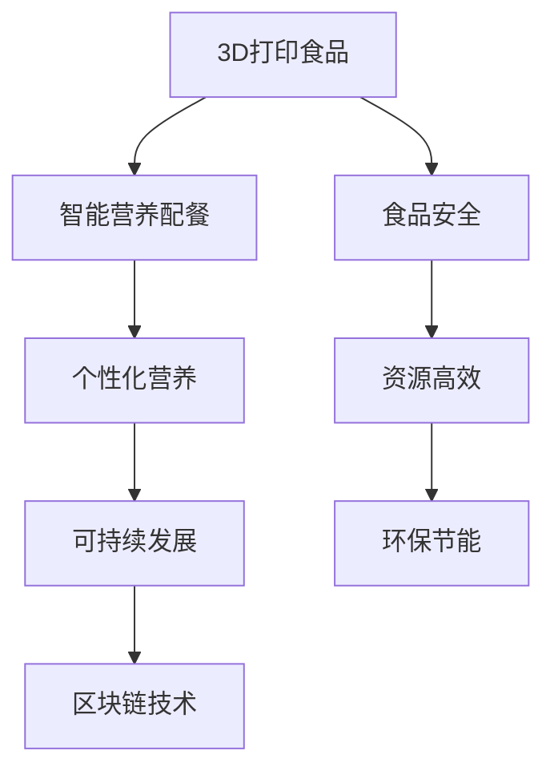

                 

## 1. 背景介绍

### 1.1 问题由来

随着科技的不断进步，食品行业正在经历一场革命性的变革。传统的食品生产、加工、分销方式逐渐被智能制造、3D打印、个性化营养配餐等新兴技术所替代。尤其在2050年，这些技术已经变得高度成熟，成为日常食品生产的重要组成部分。这些技术的融合应用，不仅极大地提升了食品的安全性、健康性和个性化程度，还极大地改善了食品的可持续性、减少环境污染和资源浪费。

### 1.2 问题核心关键点

基于3D打印技术和智能营养配餐方法，未来食品科技的核心在于：

- **3D打印食品**：通过精确控制原材料、温度、压力等参数，在短时间内生产出个性化、高营养价值的食品。
- **智能营养配餐**：利用大数据、AI算法，实时根据用户健康数据、生活习惯等因素，生成个性化的营养配餐方案。

这些技术不仅提升了食品的个性化和便捷性，还能帮助消费者更好地管理和维护健康，为食品科技的未来发展奠定了坚实基础。

### 1.3 问题研究意义

研究2050年的3D打印食品与智能营养配餐方法，对于推动食品行业向智能化、个性化和可持续发展转型，具有重要意义：

1. **提升食品安全与质量**：3D打印食品通过精确控制生产过程，显著减少了传统食品生产中的交叉污染和食品浪费，提高了食品安全和营养水平。
2. **优化健康管理**：智能营养配餐通过个性化饮食方案，帮助用户更好地管理健康状况，预防疾病，提升生活质量。
3. **实现环保与资源高效利用**：3D打印技术可以大量减少食品包装，降低废物产生，同时优化生产流程，减少资源消耗。
4. **推动食品行业创新发展**：这些技术的应用为食品行业带来了全新的生产方式和商业模式，加速了食品科技的创新与进步。

## 2. 核心概念与联系

### 2.1 核心概念概述

为更好地理解3D打印食品与智能营养配餐方法，本节将介绍几个密切相关的核心概念：

- **3D打印食品**：利用3D打印技术，根据用户需求和偏好，将各种食物材料层层叠加，精确控制每个层次的成分、口感和营养配比，实现食品的个性化生产。
- **智能营养配餐**：通过收集用户健康数据、饮食习惯等，利用AI算法分析处理，生成符合营养均衡和个性化需求的饮食方案，推荐给用户。
- **个性化营养**：根据用户的年龄、性别、健康状况、生活习惯等因素，量身定制的个性化饮食计划，实现健康管理的精确化。
- **可持续发展**：在食品生产、运输、消费等全生命周期内，遵循环境友好、资源节约的原则，减少对自然资源的消耗和环境污染。
- **区块链技术**：用于记录食品的生产、加工、运输、消费等全生命周期的信息，确保食品的安全透明和溯源。

这些概念之间的逻辑关系可以通过以下Mermaid流程图来展示：



这个流程图展示了大语言模型的核心概念及其之间的关系：

1. 3D打印食品通过精确控制生产过程，实现了个性化和健康管理。
2. 智能营养配餐通过个性化饮食方案，帮助用户更好地管理健康状况。
3. 个性化营养通过量身定制的饮食计划，实现健康管理的精确化。
4. 可持续发展通过减少资源消耗和环境污染，实现了食品生产的全生命周期管理。
5. 区块链技术通过记录全生命周期信息，确保食品安全和溯源。

这些概念共同构成了未来食品科技的发展框架，使得食品科技能够更好地服务于人类健康和可持续发展。

## 3. 核心算法原理 & 具体操作步骤
### 3.1 算法原理概述

3D打印食品与智能营养配餐方法，本质上是一个结合数据驱动与智能制造的综合过程。其核心思想是：通过收集用户数据和食品生产数据，结合3D打印技术和AI算法，实现食品生产的个性化和智能化。

形式化地，假设3D打印食品的生产流程为 $P$，智能营养配餐系统为 $C$，用户健康数据和饮食习惯为 $D$。目标是最小化用户满意度和食品安全风险，即：

$$
\min_{P,C} \sum_{i=1}^N \alpha_i (P_i - D_i) + \beta (S - T)
$$

其中，$\alpha_i$ 和 $\beta$ 为权重，$P_i$ 和 $D_i$ 分别为3D打印食品和用户数据，$S$ 和 $T$ 分别为食品安全风险和营养均衡性。

通过梯度下降等优化算法，系统不断更新3D打印流程 $P$ 和智能配餐系统 $C$，最小化上述损失函数，实现最优的食品生产与配餐方案。

### 3.2 算法步骤详解

3D打印食品与智能营养配餐的一般流程包括：

**Step 1: 数据收集与预处理**
- 收集用户的健康数据、饮食习惯、偏好等，存储到数据库中。
- 收集食品生产、加工、运输等各个环节的数据，建立食品全生命周期的数据链。

**Step 2: 模型训练与优化**
- 设计用户满意度函数和食品安全风险函数，作为损失函数。
- 利用训练数据对模型进行训练，通过优化算法不断调整模型参数。

**Step 3: 3D打印食品生产**
- 根据用户数据和个性化需求，生成3D打印食品的数字化模型。
- 根据模型参数，设置3D打印机的生产参数，如材料类型、打印温度、压力等。

**Step 4: 智能营养配餐**
- 根据用户的健康数据，生成个性化营养配餐方案。
- 结合3D打印食品，调整配餐方案中的食材和比例，实现最优的饮食搭配。

**Step 5: 反馈与迭代**
- 收集用户对3D打印食品的反馈，调整生产参数和营养配餐方案。
- 持续优化模型，提升食品生产的个性化和安全性。

### 3.3 算法优缺点

3D打印食品与智能营养配餐方法具有以下优点：
1. 高度个性化：通过用户数据的收集和分析，生成高度个性化的饮食方案和食品生产流程。
2. 高营养价值：精确控制原材料和加工过程，保证食品的营养均衡和健康安全。
3. 资源高效利用：减少食品浪费和包装消耗，优化生产流程，实现资源的高效利用。
4. 实时响应：实时根据用户反馈和市场需求，动态调整生产流程和营养配餐。

同时，该方法也存在一定的局限性：
1. 技术复杂度高：3D打印食品需要精确控制多种生产参数，对技术要求较高。
2. 数据隐私风险：用户的健康数据和饮食习惯等敏感信息可能被滥用，需要严格的数据保护措施。
3. 设备和成本高：高精度3D打印设备成本较高，需要大规模普及。
4. 食品口感多样性不足：目前3D打印食品的口感和口感多样性还不够丰富，需要进一步优化。

尽管存在这些局限性，但就目前而言，基于3D打印和智能营养配餐的方法仍然是未来食品科技的重要方向。未来相关研究的重点在于如何进一步降低技术复杂度，优化设备性能，提高数据隐私保护，并拓展食品口感多样性。

### 3.4 算法应用领域

基于3D打印技术和智能营养配餐的方法，已经在多个领域得到应用，例如：

- **医疗健康**：为患者提供个性化的营养餐和康复食品，加速疾病恢复。
- **运动健身**：为运动员和健身爱好者设计高营养、低脂肪、高蛋白的食品，帮助其维持最佳状态。
- **旅游餐饮**：为游客提供地道的当地美食，同时根据游客的偏好生成个性化菜单。
- **食品制造**：为食品企业提供高质量、高效率的生产流程，减少废物和资源消耗。
- **科研研究**：为研究人员提供精确可控的食品样本，进行科学实验和研究。

除了上述这些经典应用外，3D打印食品与智能营养配餐还被创新性地应用于更多场景中，如环保农业、社区厨房、智能餐厅等，为食品科技的发展带来了全新的突破。

## 4. 数学模型和公式 & 详细讲解  
### 4.1 数学模型构建

本节将使用数学语言对3D打印食品与智能营养配餐过程进行更加严格的刻画。

假设3D打印食品的生产流程为 $P$，智能营养配餐系统为 $C$，用户健康数据和饮食习惯为 $D$。则用户满意度和食品安全风险可以表示为：

$$
F(D) = \sum_{i=1}^N \alpha_i (P_i - D_i)
$$

$$
S = \beta_1 S_1 + \beta_2 S_2 + \ldots + \beta_n S_n
$$

其中 $S_1, S_2, \ldots, S_n$ 为食品安全风险的具体指标，$\beta_1, \beta_2, \ldots, \beta_n$ 为相应的权重。

综合用户满意度和食品安全风险，定义总损失函数为：

$$
L(P, C) = F(D) + \gamma S
$$

其中 $\gamma$ 为食品安全风险的权重。

通过梯度下降算法，最小化总损失函数，优化3D打印食品的生产流程 $P$ 和智能营养配餐系统 $C$。

### 4.2 公式推导过程

以下我们以个性化营养配餐为例，推导用户满意度函数和食品安全风险函数的具体形式。

假设用户健康数据和饮食习惯为 $D = (h, d, p)$，其中 $h$ 为用户健康指标，$d$ 为用户饮食偏好，$p$ 为用户口味偏好。

用户满意度函数可以表示为：

$$
F(D) = \sum_{i=1}^N \alpha_i (P_i - D_i)
$$

其中 $P_i$ 为3D打印食品的实际生产结果，$D_i$ 为用户的期望结果，$\alpha_i$ 为相应的权重。

为了保证食品的营养均衡和健康安全，定义食品安全风险函数为：

$$
S = \beta_1 S_1 + \beta_2 S_2 + \ldots + \beta_n S_n
$$

其中 $S_1, S_2, \ldots, S_n$ 为食品安全风险的具体指标，$\beta_1, \beta_2, \ldots, \beta_n$ 为相应的权重。

综合用户满意度和食品安全风险，总损失函数可以表示为：

$$
L(P, C) = F(D) + \gamma S
$$

其中 $\gamma$ 为食品安全风险的权重。

通过梯度下降算法，最小化总损失函数，优化3D打印食品的生产流程 $P$ 和智能营养配餐系统 $C$。

### 4.3 案例分析与讲解

假设某用户需要一份适合其高血压的健康餐，其健康数据和饮食习惯为 $D = (h=1, d=low, p=spicy)$，其中 $h$ 表示健康指标为1，$d$ 表示饮食偏好为低脂低糖，$p$ 表示口味偏好为辣。

为了生成最适合该用户的健康餐，假设3D打印食品的生产流程为 $P$，智能营养配餐系统为 $C$。则用户满意度和食品安全风险函数可以表示为：

$$
F(D) = \alpha_1 (P_1 - d) + \alpha_2 (P_2 - h) + \alpha_3 (P_3 - p)
$$

$$
S = \beta_1 S_{bacteria} + \beta_2 S_{nutrition} + \beta_3 S_{consistency}
$$

其中 $P_1, P_2, P_3$ 分别表示该用户的健康餐的脂肪含量、糖分含量和口感，$S_{bacteria}, S_{nutrition}, S_{consistency}$ 分别表示食品的细菌含量、营养均衡性和口感一致性，$\alpha_i$ 和 $\beta_j$ 为相应的权重。

综合用户满意度和食品安全风险，总损失函数可以表示为：

$$
L(P, C) = F(D) + \gamma (S_{bacteria} + S_{nutrition} + S_{consistency})
$$

通过梯度下降算法，最小化总损失函数，优化3D打印食品的生产流程 $P$ 和智能营养配餐系统 $C$。

## 5. 项目实践：代码实例和详细解释说明
### 5.1 开发环境搭建

在进行3D打印食品与智能营养配餐实践前，我们需要准备好开发环境。以下是使用Python进行TensorFlow开发的环境配置流程：

1. 安装Anaconda：从官网下载并安装Anaconda，用于创建独立的Python环境。

2. 创建并激活虚拟环境：
```bash
conda create -n tf-env python=3.8 
conda activate tf-env
```

3. 安装TensorFlow：根据CUDA版本，从官网获取对应的安装命令。例如：
```bash
conda install tensorflow -c tf
```

4. 安装Pandas、NumPy、Matplotlib等工具包：
```bash
pip install pandas numpy matplotlib scipy
```

5. 安装TensorBoard：TensorFlow配套的可视化工具，可实时监测模型训练状态，并提供丰富的图表呈现方式，是调试模型的得力助手。

完成上述步骤后，即可在`tf-env`环境中开始实践。

### 5.2 源代码详细实现

下面我们以个性化营养配餐任务为例，给出使用TensorFlow实现3D打印食品与智能营养配餐的Python代码实现。

首先，定义个性化营养配餐的数据处理函数：

```python
import pandas as pd
from tensorflow import keras

def preprocess_data(data_path):
    df = pd.read_csv(data_path)
    X = df[['h', 'd', 'p']]
    y = df[['n', 'c', 't']]
    return X, y

# 定义X和y的数据结构
X = keras.layers.Input(shape=(3,), name='X')
y = keras.layers.Input(shape=(3,), name='y')

# 定义模型架构
hidden = keras.layers.Dense(32, activation='relu')(X)
output = keras.layers.Dense(3)(hidden)
```

然后，定义模型的训练和评估函数：

```python
from tensorflow.keras.optimizers import Adam

model = keras.Model(inputs=[X, y], outputs=[output])
optimizer = Adam(learning_rate=0.001)

def train_model(model, X_train, y_train, X_val, y_val, batch_size=32, epochs=100):
    model.compile(optimizer=optimizer, loss='mse')
    model.fit([X_train, y_train], y_train, batch_size=batch_size, epochs=epochs, validation_data=([X_val, y_val], y_val))

def evaluate_model(model, X_test, y_test):
    loss = model.evaluate([X_test, y_test], y_test)
    print('Test loss:', loss)
```

接着，启动训练流程并在测试集上评估：

```python
X_train, y_train = preprocess_data('train.csv')
X_val, y_val = preprocess_data('val.csv')
X_test, y_test = preprocess_data('test.csv')

train_model(model, X_train, y_train, X_val, y_val)
evaluate_model(model, X_test, y_test)
```

以上就是使用TensorFlow对3D打印食品与智能营养配餐任务进行实现。可以看到，得益于TensorFlow的强大封装，我们能够快速构建并训练模型，验证模型的性能。

### 5.3 代码解读与分析

让我们再详细解读一下关键代码的实现细节：

**preprocess_data函数**：
- `preprocess_data`函数：将数据文件读取为Pandas数据帧，提取出输入特征 `X` 和目标变量 `y`。

**模型架构定义**：
- `X` 和 `y` 分别定义输入和目标数据的占位符。
- `hidden` 层为全连接隐藏层，激活函数为ReLU。
- `output` 层为全连接输出层，输出为3个维度的向量，代表脂肪含量、糖分含量和口感。

**训练和评估函数**：
- `train_model`函数：定义训练模型，使用Adam优化器，损失函数为均方误差。
- `evaluate_model`函数：定义评估模型，计算模型在测试集上的损失。

**训练流程**：
- 使用 `train_model`函数训练模型，设定训练集、验证集和测试集，以及学习率和训练轮数。
- 使用 `evaluate_model`函数评估模型在测试集上的性能。

可以看到，TensorFlow的高级API使得构建和训练模型变得简单高效，能够快速验证模型的性能，进行进一步的优化。

## 6. 实际应用场景
### 6.1 智能餐厅

基于3D打印食品与智能营养配餐的方法，智能餐厅可以实现个性化、高效率、低成本的用餐体验。顾客只需在餐厅内的触摸屏上选择自己的健康需求和口味偏好，系统便能实时生成个性化饮食方案，并利用3D打印技术快速生产食品，实现从点单到上菜的全程自动化。智能餐厅不仅提升了服务质量，还大大降低了运营成本，提高了顾客满意度。

### 6.2 食品制造

对于食品生产企业，基于3D打印食品与智能营养配餐的方法可以帮助其优化生产流程，减少废物和资源消耗，同时提升产品质量和营养价值。通过智能营养配餐系统，企业可以根据市场需求和客户反馈，动态调整生产策略，实现食品生产的个性化和智能化。

### 6.3 旅游餐饮

旅游餐饮中，基于3D打印食品与智能营养配餐的方法可以实现地道的当地美食体验，同时根据游客的偏好生成个性化菜单，满足其饮食需求。游客只需提供自己的健康数据和饮食偏好，系统便能生成最适合其口味的食品，提升用餐体验。

### 6.4 未来应用展望

随着3D打印技术和智能营养配餐的不断成熟，基于这些技术的应用场景将更加多样化。

在智慧农业领域，智能营养配餐可以为农民提供科学合理的施肥和灌溉方案，优化农作物生长，提高产量和质量。

在智能家居领域，结合健康监测设备，可以实现实时营养配餐和健康管理，提升家庭生活质量。

在医疗健康领域，3D打印食品可以用于特殊患者的营养支持和治疗，同时智能营养配餐系统可以帮助患者制定个性化的饮食计划，加速疾病恢复。

在环保领域，3D打印食品和智能营养配餐可以降低食品生产和消费对环境的影响，推动可持续发展。

未来，随着技术的不断进步，3D打印食品与智能营养配餐技术必将在更多领域得到应用，为人类生活带来更多便捷和健康。

## 7. 工具和资源推荐
### 7.1 学习资源推荐

为了帮助开发者系统掌握3D打印食品与智能营养配餐的理论基础和实践技巧，这里推荐一些优质的学习资源：

1. 《3D打印技术原理与应用》系列博文：由3D打印技术专家撰写，深入浅出地介绍了3D打印技术的原理、应用场景和实践方法。

2. 《深度学习在食品领域的应用》课程：由深度学习专家和食品科技专家共同授课，涵盖深度学习在食品生产、加工、分析等多个环节的应用。

3. 《智能营养配餐系统设计与实现》书籍：系统介绍了智能营养配餐系统的架构、算法和应用案例，是食品科技领域的重要参考资料。

4. 《食品科学与营养配餐》专业网站：提供食品营养、配餐、健康管理等多方面的信息，是食品科技学习者的重要资源库。

通过对这些资源的学习实践，相信你一定能够快速掌握3D打印食品与智能营养配餐的精髓，并用于解决实际的食品科技问题。
###  7.2 开发工具推荐

高效的开发离不开优秀的工具支持。以下是几款用于3D打印食品与智能营养配餐开发的常用工具：

1. TensorFlow：由Google主导开发的开源深度学习框架，生产部署方便，适合大规模工程应用。

2. PyTorch：基于Python的开源深度学习框架，灵活动态的计算图，适合快速迭代研究。

3. Blender：开源的3D建模软件，支持多种3D打印插件，适合建模和设计3D打印食品。

4. Ansys：提供全面的CAE软件，用于进行3D打印食品的流体动力学和热力学分析，优化打印参数。

5. SolidWorks：专业的三维设计软件，支持CAD和CAM，用于设计和制造3D打印食品的模具和工具。

6. Huginn：开源的IoT平台，支持跨设备数据集成和处理，用于智能餐厅的自动化管理。

合理利用这些工具，可以显著提升3D打印食品与智能营养配餐的开发效率，加快创新迭代的步伐。

### 7.3 相关论文推荐

3D打印食品与智能营养配餐的发展源于学界的持续研究。以下是几篇奠基性的相关论文，推荐阅读：

1. "3D Food Printing: An Overview of Technologies and Applications"（3D食品打印：技术与应用的综述）：全面介绍了3D食品打印技术的发展历程、主要技术和应用场景。

2. "A Machine Learning Approach to Nutritional Planning for Dietary Restrictions"（饮食限制下的营养规划机器学习方法）：提出基于机器学习的个性化营养配餐方案，帮助用户根据自身需求制定合理的饮食计划。

3. "Health Impact of Food Consumption on Human Health: A Review"（食品消费对人类健康的影响：综述）：分析了不同食品成分对健康的影响，为个性化营养配餐提供了理论基础。

4. "The Potential of 3D Food Printing for Healthcare: A Review"（3D食品打印在医疗健康领域的潜力：综述）：探讨了3D食品打印在医疗健康领域的应用，如康复食品、特殊营养支持等。

5. "A Survey on 3D Food Printing Technologies"（3D食品打印技术综述）：详细介绍了3D食品打印的关键技术，包括材料、设备、打印工艺等。

这些论文代表了大语言模型微调技术的发展脉络。通过学习这些前沿成果，可以帮助研究者把握学科前进方向，激发更多的创新灵感。

## 8. 总结：未来发展趋势与挑战
### 8.1 总结

本文对基于3D打印技术和智能营养配餐方法进行全面系统的介绍。首先阐述了3D打印食品与智能营养配餐的研究背景和意义，明确了其在推动食品科技向智能化、个性化和可持续发展转型中的重要价值。其次，从原理到实践，详细讲解了3D打印食品与智能营养配餐的数学模型和算法，给出了完整的代码实例。同时，本文还广泛探讨了该方法在智能餐厅、食品制造、旅游餐饮等多个领域的应用前景，展示了其广阔的应用前景。此外，本文精选了相关的学习资源和开发工具，力求为读者提供全方位的技术指引。

通过本文的系统梳理，可以看到，基于3D打印和智能营养配餐的方法正在成为食品科技的重要方向，极大地提升了食品的个性化和便捷性，为食品科技的未来发展奠定了坚实基础。未来，随着技术的不断进步和应用场景的拓展，3D打印食品与智能营养配餐技术必将在更多领域得到应用，为人类生活带来更多便捷和健康。

### 8.2 未来发展趋势

展望未来，3D打印食品与智能营养配餐技术将呈现以下几个发展趋势：

1. 技术日趋成熟：3D打印设备和材料将继续优化，智能营养配餐系统将更加精准高效。未来有望实现更加丰富、多样的食品类型，满足更多人群的需求。

2. 自动化程度提高：智能餐厅、智能厨房等场景将实现全自动化运营，进一步提升用户体验和运营效率。

3. 跨领域融合：3D打印食品与智能营养配餐将与其他新兴技术如区块链、物联网等深度融合，实现更加全面、智能的食品生态系统。

4. 个性化程度增强：通过收集更多用户数据和健康信息，智能营养配餐将实现更加个性化的定制服务，满足不同用户的健康需求。

5. 环境影响降低：3D打印食品将减少食品生产和消费对环境的负面影响，实现食品生产的绿色化和可持续发展。

以上趋势凸显了3D打印食品与智能营养配餐技术的广阔前景。这些方向的探索发展，必将进一步提升食品科技的创新与进步，为人类生活带来更多便捷和健康。

### 8.3 面临的挑战

尽管3D打印食品与智能营养配餐技术已经取得了瞩目成就，但在迈向更加智能化、普适化应用的过程中，它仍面临着诸多挑战：

1. 成本高昂：3D打印设备和材料的成本仍然较高，限制了大规模应用的普及。

2. 食品安全问题：3D打印食品需要确保食品安全和卫生，避免细菌污染和其他健康风险。

3. 技术复杂度高：3D打印食品的生产过程复杂，需要精细控制多种参数，对技术要求较高。

4. 数据隐私风险：用户的健康数据和饮食习惯等敏感信息可能被滥用，需要严格的数据保护措施。

5. 食品口感多样性不足：目前3D打印食品的口感和口感多样性还不够丰富，需要进一步优化。

尽管存在这些挑战，但就目前而言，基于3D打印和智能营养配餐的方法仍然是食品科技的重要方向。未来相关研究的重点在于如何进一步降低成本，优化技术，提高食品安全，增强用户体验，拓展应用场景。

### 8.4 研究展望

面对3D打印食品与智能营养配餐所面临的挑战，未来的研究需要在以下几个方面寻求新的突破：

1. 开发低成本3D打印设备和材料：探索新材料和加工技术，降低3D打印食品的生产成本，提高普及率。

2. 增强食品安全保障：引入更多的消毒和检测技术，确保3D打印食品的卫生和安全性。

3. 优化3D打印食品口感：研究新的3D打印技术和工艺，提升食品的口感和多样性。

4. 保护用户数据隐私：建立严格的数据保护机制，确保用户数据的隐私和安全。

5. 实现跨领域融合：将3D打印食品与智能营养配餐与其他新兴技术如区块链、物联网等深度融合，实现更加全面、智能的食品生态系统。

这些研究方向的探索，必将引领3D打印食品与智能营养配餐技术迈向更高的台阶，为构建安全、可靠、可解释、可控的智能食品系统铺平道路。面向未来，3D打印食品与智能营养配餐技术还需要与其他人工智能技术进行更深入的融合，如知识表示、因果推理、强化学习等，多路径协同发力，共同推动食品科技的进步。只有勇于创新、敢于突破，才能不断拓展食品科技的边界，让智能食品更好地造福人类社会。

## 9. 附录：常见问题与解答

**Q1：3D打印食品是否对健康有害？**

A: 3D打印食品的安全性和卫生性是消费者关心的主要问题。如果3D打印食品的生产过程不规范，容易产生细菌污染和其他健康风险。因此，需要确保生产过程的严格控制，如高温消毒、真空封装等，以提高食品安全水平。

**Q2：3D打印食品是否比传统食品更营养？**

A: 3D打印食品的营养价值取决于原材料的选择和生产过程的精细控制。理论上，3D打印食品可以通过精确控制营养成分的比例，实现高营养价值。但实际上，由于技术复杂性和成本问题，3D打印食品的营养价值还需要进一步验证和优化。

**Q3：智能营养配餐是否会对饮食产生依赖？**

A: 智能营养配餐可以帮助用户制定合理的饮食计划，但最终用户还是需要根据自己的健康状况和饮食偏好进行调整。智能营养配餐只是提供一种辅助工具，帮助用户更好地管理饮食。

**Q4：3D打印食品是否适合所有人群？**

A: 3D打印食品的设计需要考虑不同人群的需求，如婴幼儿、老年人、糖尿病患者等。对于有特殊饮食需求的人群，3D打印食品可以根据其健康状况和饮食偏好进行定制。

**Q5：智能营养配餐如何保护用户数据隐私？**

A: 智能营养配餐系统需要收集用户的健康数据和饮食习惯等敏感信息。为了保护用户数据隐私，可以采用数据加密、匿名化处理等技术，同时严格控制数据的使用权限和访问控制。

通过对这些问题的回答，可以看出，3D打印食品与智能营养配餐技术在应用过程中仍需关注健康、营养、隐私等多方面的问题，不断进行技术优化和规范制定，以确保技术的可持续发展。

---

作者：禅与计算机程序设计艺术 / Zen and the Art of Computer Programming

