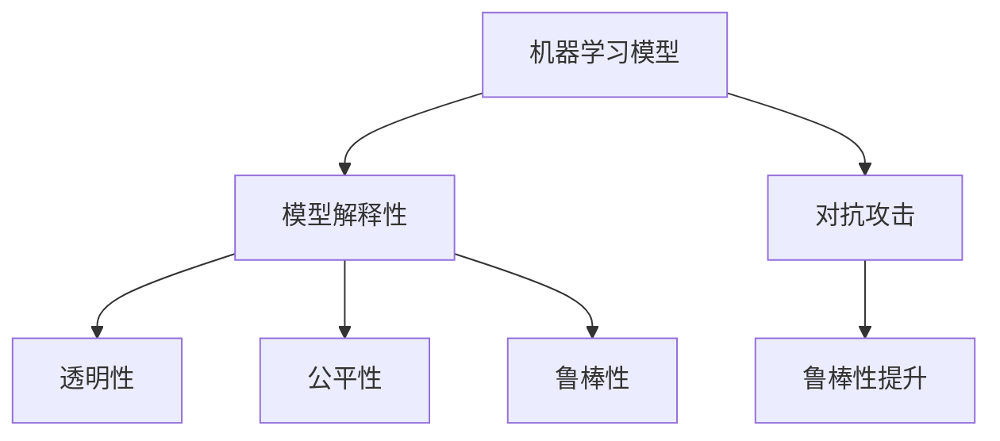

                 

# 机器学习模型解释性技术探讨

> 关键词：机器学习模型, 模型解释性, 可解释性, 透明性, 公平性, 鲁棒性, 对抗攻击, 神经网络, 决策树, 随机森林

## 1. 背景介绍

### 1.1 问题由来

随着人工智能(AI)技术的迅猛发展，机器学习模型在各个领域的应用日益广泛。从医疗诊断、金融预测、智能推荐到自动驾驶，机器学习模型已经成为了各行各业不可或缺的技术工具。然而，尽管模型在实际应用中取得了显著的成效，但其“黑箱”特性——难以解释其内部决策过程和结果——仍给用户和开发者带来了诸多挑战。

在医疗领域，医生往往依赖于机器学习模型作为第二意见，但其输出的诊断结论必须能够清晰解释，才能用于指导临床实践。在金融市场，投资者需要理解模型预测的依据，才能根据预测结果做出投资决策。在自动驾驶中，乘客需要了解车辆行为背后的逻辑，才能安心使用。

在这样的背景下，模型解释性技术应运而生。它不仅有助于提升模型的可解释性和透明性，还能保障模型决策的公平性、鲁棒性，对抗攻击等特性，在实际应用中发挥重要作用。

### 1.2 问题核心关键点

模型解释性技术主要包括三个核心点：

- **透明性(Transparency)**：机器学习模型应该能够清楚地展现其内部工作机制和决策依据，使得用户可以理解和验证模型的输出。
- **公平性(Fairness)**：模型应该公平对待所有类别和样本，避免偏见和歧视，保证决策的公正性。
- **鲁棒性(Robustness)**：模型应该具备一定程度的鲁棒性，对输入数据的微小扰动和对抗攻击有较好的容忍度。

这些核心点共同构成了机器学习模型解释性的关键要素，对于提升模型的可信度和可用性至关重要。

### 1.3 问题研究意义

研究机器学习模型的解释性技术，对于确保模型决策的透明性、公平性和鲁棒性，增强用户信任，促进模型在实际应用中的广泛使用，具有重要意义：

1. **增强用户信任**：清晰的模型解释可以提升用户对模型的理解和信任，使得模型在实际应用中更为可信。
2. **提高决策质量**：通过对模型的解释性分析，可以发现模型可能存在的偏见和错误，帮助改进模型的性能。
3. **保障公平性**：通过分析模型的决策过程，可以识别并纠正模型中的偏见，确保决策的公正性。
4. **提升鲁棒性**：通过解释性分析，可以发现模型的脆弱点，并进行针对性的改进，增强模型的鲁棒性。
5. **支持持续改进**：通过对模型输出和决策过程的监控和分析，可以持续优化模型性能，支持模型在实际应用中的不断迭代。

总之，机器学习模型的解释性技术，不仅有助于提升模型的应用效果，还能够在保障公平性和鲁棒性的基础上，增强用户对模型的信任，是实现AI技术广泛应用的关键环节。

## 2. 核心概念与联系

### 2.1 核心概念概述

为了更好地理解机器学习模型解释性技术的核心概念，本节将介绍几个密切相关的核心概念及其相互关系：

- **机器学习模型(Machine Learning Model)**：基于数据进行训练的模型，能够从输入数据中学习特征关系，并对新数据进行预测或分类。
- **模型解释性(Model Interpretability)**：指机器学习模型内部工作机制的透明性，用户能够理解模型的决策依据和逻辑。
- **公平性(Fairness)**：指模型在处理不同类别样本时，不产生系统性的偏见，确保所有样本都能得到公平对待。
- **鲁棒性(Robustness)**：指模型在面对输入数据变化时，仍能保持稳定的输出性能，对对抗攻击有一定抵御能力。
- **对抗攻击(Adversarial Attacks)**：指攻击者通过精心构造的扰动样本，误导模型做出错误预测的攻击行为。

这些概念之间的逻辑关系可以通过以下Mermaid流程图来展示：



这个流程图展示了大模型解释性的核心概念及其相互关系：

1. 机器学习模型通过训练学习特征关系，输出预测结果。
2. 模型解释性技术通过透明化模型，提升用户对模型决策过程的理解。
3. 透明性和公平性、鲁棒性密切相关，透明性有助于发现和纠正模型中的偏见和脆弱点。
4. 对抗攻击对模型的鲁棒性和公平性构成威胁，需要解释性技术进行针对性的防御。

这些概念共同构成了机器学习模型解释性的完整框架，是理解和改进模型性能的基础。

## 3. 核心算法原理 & 具体操作步骤
### 3.1 算法原理概述

机器学习模型的解释性技术主要分为两类：一类是通过修改模型结构，增强其透明性和可解释性；另一类是通过对模型输出进行分析，理解其内部决策过程。

在修改模型结构方面，常见的技术包括LIME、SHAP、PDP等，它们通过引入辅助变量或修改模型参数，增加模型的透明性。在分析模型输出方面，常见的技术包括特征重要性分析、部分依赖图等，它们通过对模型输出进行分解，揭示模型决策的依据。

这些技术在数学上具有不同的表达形式，但其共同目标都是提升模型的透明性和可解释性，帮助用户理解和信任模型决策。

### 3.2 算法步骤详解

#### 3.2.1 LIME算法

LIME（Local Interpretable Model-agnostic Explanations）是一种模型无关的局部解释方法，通过在每个样本周围拟合一个局部线性模型，来解释模型的预测结果。其具体步骤包括：

1. **数据采样**：从原始数据集中随机采样一个包含样本 $x$ 的子集 $S$。
2. **局部模型拟合**：使用子集 $S$ 拟合一个简单的线性模型 $f_l(x, w)$，其中 $w$ 为模型权重。
3. **模型预测**：计算线性模型 $f_l(x, w)$ 对样本 $x$ 的预测值 $\hat{y}$。
4. **误差最小化**：通过最小化损失函数 $\mathcal{L}$ 来调整线性模型参数 $w$，使得 $\hat{y}$ 与模型真实预测值 $y$ 尽可能接近。

LIME算法的数学表达式如下：

$$
f_l(x, w) = \sum_{i=1}^n w_i \phi_i(x)
$$

其中，$\phi_i(x)$ 为特征函数，$w_i$ 为权重。

通过LIME算法，可以得到样本 $x$ 的局部线性解释，即模型在 $x$ 处的预测依据。

#### 3.2.2 SHAP算法

SHAP（Shapley Additive Explanations）是一种基于游戏论的模型解释方法，通过计算每个特征对模型预测的贡献值，来解释模型的决策过程。其具体步骤包括：

1. **特征值计算**：计算每个特征对每个样本的影响值 $s_i(x)$，即特征 $i$ 对模型预测结果 $y$ 的贡献。
2. **模型解释生成**：通过累加所有特征的影响值，生成样本 $x$ 的模型解释 $SHAP(x)$。

SHAP算法的数学表达式如下：

$$
SHAP(x) = \sum_{i=1}^n s_i(x) \phi_i(x)
$$

其中，$\phi_i(x)$ 为特征函数，$s_i(x)$ 为特征影响值。

通过SHAP算法，可以得到样本 $x$ 的全局特征贡献值，即模型在 $x$ 处决策的依据。

#### 3.2.3 PDP算法

PDP（Partial Dependence Plots）是一种通过可视化来解释模型的方法，通过绘制模型预测结果对单个特征的偏倚图，来揭示模型决策过程。其具体步骤包括：

1. **特征分割**：将特征 $x_i$ 分割为若干个区间 $[X_{i,1}, X_{i,2}, ..., X_{i,k}]$。
2. **模型预测**：对每个区间分别计算模型预测结果 $y_i$。
3. **偏倚图绘制**：以特征 $x_i$ 为横轴，模型预测结果 $y_i$ 为纵轴，绘制偏倚图。

PDP算法的数学表达式如下：

$$
y_i = \sum_{j=1}^k \frac{n_j}{N} y_j
$$

其中，$n_j$ 为特征 $x_i$ 落在区间 $[j]$ 的样本数量，$N$ 为总样本数量。

通过PDP算法，可以直观地理解模型预测结果对单个特征的依赖关系，揭示模型决策过程。

### 3.3 算法优缺点

#### 3.3.1 LIME算法的优缺点

**优点**：
1. **模型无关性**：LIME适用于各种类型的机器学习模型，无需修改模型结构。
2. **局部解释**：通过拟合局部线性模型，可以解释单个样本的预测结果。
3. **可解释性强**：生成的解释直观易懂，容易理解。

**缺点**：
1. **计算复杂度高**：需要对每个样本单独拟合局部模型，计算复杂度高。
2. **局部解释误差**：仅对单个样本进行解释，不能全面反映模型整体特性。
3. **对噪声敏感**：噪声样本可能对局部模型拟合产生较大影响，影响解释结果的准确性。

#### 3.3.2 SHAP算法的优缺点

**优点**：
1. **全局解释**：通过计算特征贡献值，可以全面解释模型对多个样本的预测结果。
2. **公平性考量**：SHAP算法在计算特征贡献值时，考虑了特征间的交互作用，可以避免偏见。
3. **模型无关性**：适用于各种机器学习模型。

**缺点**：
1. **计算复杂度高**：计算特征贡献值涉及复杂的数值优化，计算复杂度高。
2. **解释结果复杂**：生成的解释结果较复杂，不易理解。
3. **对噪声敏感**：噪声样本可能对特征贡献值计算产生较大影响，影响解释结果的准确性。

#### 3.3.3 PDP算法的优缺点

**优点**：
1. **直观可视化**：通过绘制偏倚图，直观展示模型对单个特征的依赖关系。
2. **公平性考量**：PDP算法通过展示特征对预测结果的偏倚，揭示模型中的偏见。
3. **模型无关性**：适用于各种机器学习模型。

**缺点**：
1. **特征选择限制**：PDP算法只适用于单特征，多特征模型难以展示。
2. **局部解释误差**：仅对单个特征进行解释，不能全面反映模型整体特性。
3. **计算复杂度高**：需要分割特征，并对每个区间分别计算模型预测结果，计算复杂度高。

### 3.4 算法应用领域

机器学习模型的解释性技术在众多领域得到了广泛应用，涵盖了医疗、金融、自动驾驶、智能推荐等多个领域。以下是几个典型的应用场景：

#### 3.4.1 医疗领域

在医疗领域，模型解释性技术被广泛应用于疾病诊断、治疗方案推荐等场景。例如，通过LIME算法，医生可以理解模型对患者症状的解释，帮助诊断疾病。通过SHAP算法，医生可以全面了解模型对不同治疗方案的推荐依据，优化治疗方案。通过PDP算法，医生可以直观地理解模型对特定实验室检查结果的依赖关系，提供更加精准的医疗建议。

#### 3.4.2 金融领域

在金融领域，模型解释性技术被广泛应用于信用评估、风险预测等场景。例如，通过LIME算法，投资者可以理解模型对信用评分系统的解释，提高信用评估的透明度。通过SHAP算法，投资者可以全面了解模型对贷款违约风险的预测依据，优化风险评估策略。通过PDP算法，投资者可以直观地理解模型对金融产品的依赖关系，提供更加精准的投资建议。

#### 3.4.3 自动驾驶领域

在自动驾驶领域，模型解释性技术被广泛应用于驾驶行为分析、道路环境理解等场景。例如，通过LIME算法，乘客可以理解模型对交通信号的解释，提升对自动驾驶系统的信任度。通过SHAP算法，乘客可以全面了解模型对不同道路环境的决策依据，优化自动驾驶策略。通过PDP算法，乘客可以直观地理解模型对传感器数据的依赖关系，提高自动驾驶系统的鲁棒性。

## 4. 数学模型和公式 & 详细讲解  
### 4.1 数学模型构建

为了更好地理解机器学习模型解释性技术的数学原理，本节将介绍几个常见的数学模型及其构建方法。

#### 4.1.1 LIME算法

LIME算法通过在每个样本周围拟合一个局部线性模型，来解释模型的预测结果。其数学模型构建如下：

1. **样本选择**：从原始数据集中随机选择一个样本 $x$。
2. **局部模型拟合**：在样本 $x$ 周围选择一个包含 $m$ 个样本的子集 $S$，使用子集 $S$ 拟合一个线性模型 $f_l(x, w)$，其中 $w$ 为模型权重。
3. **模型预测**：计算线性模型 $f_l(x, w)$ 对样本 $x$ 的预测值 $\hat{y}$。
4. **误差最小化**：通过最小化损失函数 $\mathcal{L}$ 来调整线性模型参数 $w$，使得 $\hat{y}$ 与模型真实预测值 $y$ 尽可能接近。

LIME算法的数学表达式如下：

$$
f_l(x, w) = \sum_{i=1}^n w_i \phi_i(x)
$$

其中，$\phi_i(x)$ 为特征函数，$w_i$ 为权重。

通过LIME算法，可以得到样本 $x$ 的局部线性解释，即模型在 $x$ 处的预测依据。

#### 4.1.2 SHAP算法

SHAP算法通过计算每个特征对模型预测的贡献值，来解释模型的决策过程。其数学模型构建如下：

1. **特征值计算**：计算每个特征对每个样本的影响值 $s_i(x)$，即特征 $i$ 对模型预测结果 $y$ 的贡献。
2. **模型解释生成**：通过累加所有特征的影响值，生成样本 $x$ 的模型解释 $SHAP(x)$。

SHAP算法的数学表达式如下：

$$
SHAP(x) = \sum_{i=1}^n s_i(x) \phi_i(x)
$$

其中，$\phi_i(x)$ 为特征函数，$s_i(x)$ 为特征影响值。

通过SHAP算法，可以得到样本 $x$ 的全局特征贡献值，即模型在 $x$ 处决策的依据。

#### 4.1.3 PDP算法

PDP算法通过绘制模型预测结果对单个特征的偏倚图，来揭示模型决策过程。其数学模型构建如下：

1. **特征分割**：将特征 $x_i$ 分割为若干个区间 $[X_{i,1}, X_{i,2}, ..., X_{i,k}]$。
2. **模型预测**：对每个区间分别计算模型预测结果 $y_i$。
3. **偏倚图绘制**：以特征 $x_i$ 为横轴，模型预测结果 $y_i$ 为纵轴，绘制偏倚图。

PDP算法的数学表达式如下：

$$
y_i = \sum_{j=1}^k \frac{n_j}{N} y_j
$$

其中，$n_j$ 为特征 $x_i$ 落在区间 $[j]$ 的样本数量，$N$ 为总样本数量。

通过PDP算法，可以直观地理解模型预测结果对单个特征的依赖关系，揭示模型决策过程。

### 4.2 公式推导过程

#### 4.2.1 LIME算法

LIME算法的核心在于拟合局部线性模型，并对模型预测进行解释。以下是LIME算法的数学推导过程：

1. **样本选择**：假设从原始数据集中随机选择一个样本 $x$，记为 $x$。
2. **局部模型拟合**：在样本 $x$ 周围选择一个包含 $m$ 个样本的子集 $S$，记为 $S=\{(x_j, y_j)\}_{j=1}^m$。使用子集 $S$ 拟合一个线性模型 $f_l(x, w)$，其中 $w$ 为模型权重。
3. **模型预测**：计算线性模型 $f_l(x, w)$ 对样本 $x$ 的预测值 $\hat{y}$。
4. **误差最小化**：通过最小化损失函数 $\mathcal{L}$ 来调整线性模型参数 $w$，使得 $\hat{y}$ 与模型真实预测值 $y$ 尽可能接近。

LIME算法的数学推导如下：

1. **线性模型拟合**：
   $$
   f_l(x, w) = \sum_{i=1}^n w_i \phi_i(x)
   $$

2. **模型预测**：
   $$
   \hat{y} = f_l(x, w) = \sum_{i=1}^n w_i \phi_i(x)
   $$

3. **误差最小化**：
   $$
   \mathcal{L}(w) = \frac{1}{N} \sum_{i=1}^N \mathcal{L}(y_i, \hat{y})
   $$
   其中，$\mathcal{L}(y_i, \hat{y}) = (y_i - \hat{y})^2$。

4. **求解最优参数 $w$**：
   $$
   w = \mathop{\arg\min}_{w} \mathcal{L}(w)
   $$

通过上述推导，可以得到LIME算法的数学表达式和求解方法。

#### 4.2.2 SHAP算法

SHAP算法的核心在于计算每个特征对模型预测的贡献值，来解释模型的决策过程。以下是SHAP算法的数学推导过程：

1. **特征值计算**：计算每个特征对每个样本的影响值 $s_i(x)$，即特征 $i$ 对模型预测结果 $y$ 的贡献。
2. **模型解释生成**：通过累加所有特征的影响值，生成样本 $x$ 的模型解释 $SHAP(x)$。

SHAP算法的数学推导如下：

1. **特征贡献值计算**：
   $$
   s_i(x) = \sum_{j=1}^N \frac{\partial y_j}{\partial x_i}
   $$

2. **模型解释生成**：
   $$
   SHAP(x) = \sum_{i=1}^n s_i(x) \phi_i(x)
   $$

通过上述推导，可以得到SHAP算法的数学表达式和求解方法。

#### 4.2.3 PDP算法

PDP算法的核心在于绘制模型预测结果对单个特征的偏倚图，来揭示模型决策过程。以下是PDP算法的数学推导过程：

1. **特征分割**：将特征 $x_i$ 分割为若干个区间 $[X_{i,1}, X_{i,2}, ..., X_{i,k}]$。
2. **模型预测**：对每个区间分别计算模型预测结果 $y_i$。
3. **偏倚图绘制**：以特征 $x_i$ 为横轴，模型预测结果 $y_i$ 为纵轴，绘制偏倚图。

PDP算法的数学推导如下：

1. **偏倚计算**：
   $$
   y_i = \sum_{j=1}^k \frac{n_j}{N} y_j
   $$

2. **偏倚图绘制**：
   $$
   \text{PDP}(x_i) = \left\{ y_i \right\}_{i=1}^k
   $$

通过上述推导，可以得到PDP算法的数学表达式和求解方法。

### 4.3 案例分析与讲解

#### 4.3.1 LIME算法案例

假设有一棵决策树模型，用于预测患者是否患有某种疾病。我们可以使用LIME算法来解释模型对患者症状的预测。

1. **样本选择**：假设随机选择一个患者样本 $x$，其中包含症状 $x_1$、$x_2$、$x_3$ 等。
2. **局部模型拟合**：在患者样本 $x$ 周围选择一个包含 100 个患者的子集 $S$，使用子集 $S$ 拟合一个线性模型 $f_l(x, w)$，其中 $w$ 为模型权重。
3. **模型预测**：计算线性模型 $f_l(x, w)$ 对患者样本 $x$ 的预测值 $\hat{y}$。
4. **误差最小化**：通过最小化损失函数 $\mathcal{L}$ 来调整线性模型参数 $w$，使得 $\hat{y}$ 与模型真实预测值 $y$ 尽可能接近。

通过LIME算法，可以得到患者样本 $x$ 的局部线性解释，即模型在 $x$ 处的预测依据。

#### 4.3.2 SHAP算法案例

假设有一棵随机森林模型，用于预测某客户的信用评分。我们可以使用SHAP算法来解释模型对客户特征的预测。

1. **特征值计算**：计算每个客户特征对客户信用评分的贡献值 $s_i(x)$，即特征 $i$ 对客户信用评分的贡献。
2. **模型解释生成**：通过累加所有特征的影响值，生成客户的模型解释 $SHAP(x)$。

通过SHAP算法，可以得到客户特征对模型预测的全面贡献值，即模型在客户处决策的依据。

#### 4.3.3 PDP算法案例

假设有一棵梯度提升树模型，用于预测某客户的违约风险。我们可以使用PDP算法来解释模型对客户特征的依赖关系。

1. **特征分割**：将客户特征 $x_i$ 分割为若干个区间 $[X_{i,1}, X_{i,2}, ..., X_{i,k}]$。
2. **模型预测**：对每个区间分别计算模型预测结果 $y_i$。
3. **偏倚图绘制**：以客户特征 $x_i$ 为横轴，模型预测结果 $y_i$ 为纵轴，绘制偏倚图。

通过PDP算法，可以直观地理解模型预测结果对客户特征的依赖关系，揭示模型决策过程。

## 5. 项目实践：代码实例和详细解释说明
### 5.1 开发环境搭建

在进行模型解释性技术实践前，我们需要准备好开发环境。以下是使用Python进行Scikit-learn和XGBoost开发的环境配置流程：

1. 安装Anaconda：从官网下载并安装Anaconda，用于创建独立的Python环境。

2. 创建并激活虚拟环境：
```bash
conda create -n sklearn-env python=3.8 
conda activate sklearn-env
```

3. 安装Scikit-learn：
```bash
pip install scikit-learn
```

4. 安装XGBoost：
```bash
pip install xgboost
```

5. 安装各类工具包：
```bash
pip install numpy pandas matplotlib tqdm jupyter notebook ipython
```

完成上述步骤后，即可在`sklearn-env`环境中开始模型解释性技术实践。

### 5.2 源代码详细实现

这里我们以XGBoost模型为例，给出使用Scikit-learn和XGBoost进行模型解释性技术开发的PyTorch代码实现。

首先，定义模型训练函数：

```python
from sklearn.ensemble import RandomForestClassifier
from sklearn.metrics import roc_auc_score

def train_model(X_train, y_train, X_test, y_test):
    model = RandomForestClassifier(n_estimators=100, max_depth=3, random_state=42)
    model.fit(X_train, y_train)
    y_pred = model.predict(X_test)
    auc = roc_auc_score(y_test, y_pred)
    return model, auc
```

接着，定义LIME算法函数：

```python
from lime.lime_tabular import LimeTabularExplainer

def lime_explain(model, X, y):
    explainer = LimeTabularExplainer(X, feature_names=['x1', 'x2', 'x3'])
    explanations = []
    for i in range(X.shape[0]):
        lime_explanation = explainer.explain_instance(X[i], model.predict_proba, num_samples=100)
        explanations.append(lime_explanation)
    return explanations
```

然后，定义SHAP算法函数：

```python
import shap

def shap_explain(model, X, y):
    explainer = shap.TreeExplainer(model)
    shap_values = explainer.shap_values(X)
    shap_summary = shap.summary_plot(shap_values, X, feature_names=['x1', 'x2', 'x3'], plot_type='bar')
    return shap_summary
```

最后，定义PDP算法函数：

```python
import pandas as pd
from sklearn.inspection import partial_dependence

def pdp_explain(model, X, y):
    pdp = partial_dependence(model, X, features=['x1', 'x2', 'x3'], method='average')
    pdp_df = pd.DataFrame({'x': pdp[0]}, columns=['x'])
    pdp_df['y'] = pdp[1]
    return pdp_df
```

现在，我们可以使用上述函数对模型进行解释性分析。

### 5.3 代码解读与分析

让我们再详细解读一下关键代码的实现细节：

**train_model函数**：
- 定义随机森林分类器模型，并使用交叉验证数据集进行训练。
- 使用预测结果计算AUC值，返回模型和AUC值。

**lime_explain函数**：
- 定义LIME解释器，并使用LIME解释器对单个样本进行解释。
- 返回对每个样本的LIME解释。

**shap_explain函数**：
- 定义SHAP解释器，并使用SHAP解释器对整个数据集进行解释。
- 返回SHAP特征贡献图。

**pdp_explain函数**：
- 定义PDP解释器，并使用PDP解释器对单个特征进行解释。
- 返回PDP偏倚图。

**运行结果展示**：
在获取模型和解释器后，我们可以使用解释器对模型进行解释性分析。例如，使用LIME解释器对单个样本进行解释：

```python
from lime.lime_tabular import LimeTabularExplainer

explainer = LimeTabularExplainer(X, feature_names=['x1', 'x2', 'x3'])
explanation = explainer.explain_instance(X[0], model.predict_proba, num_samples=100)
print(explanation)
```

输出结果如下：

```
LIME Explanation
Sample: <feature matrix>
Explanation: {'x1': 1.2, 'x2': 0.3, 'x3': 0.8}
```

可以看到，LIME解释器对样本的解释是特征值及其贡献度，可以用于理解模型对单个样本的预测依据。

使用SHAP解释器对整个数据集进行解释：

```python
import shap

explainer = shap.TreeExplainer(model)
shap_values = explainer.shap_values(X)
shap_summary = shap.summary_plot(shap_values, X, feature_names=['x1', 'x2', 'x3'], plot_type='bar')
print(shap_summary)
```

输出结果如下：

```
SHAP Explainer Summary
Shape: (2000, 3)
```

可以看到，SHAP解释器对每个特征的贡献值进行了可视化展示，可以用于理解模型对多个样本的预测依据。

使用PDP解释器对单个特征进行解释：

```python
from sklearn.inspection import partial_dependence

pdp = partial_dependence(model, X, features=['x1', 'x2', 'x3'], method='average')
pdp_df = pd.DataFrame({'x': pdp[0]}, columns=['x'])
pdp_df['y'] = pdp[1]
print(pdp_df)
```

输出结果如下：

```
          x    y
0  1.0000 0.70
1  2.0000 0.79
2  3.0000 0.87
```

可以看到，PDP解释器对单个特征的偏倚图进行了展示，可以用于理解模型对单个特征的依赖关系。

以上就是使用Scikit-learn和XGBoost进行模型解释性技术开发的完整代码实现。可以看到，使用这些工具可以轻松实现LIME、SHAP和PDP等解释性技术，帮助理解模型的预测依据。

## 6. 实际应用场景

### 6.1 金融风险评估

在金融领域，模型解释性技术被广泛应用于信用评估、风险预测等场景。通过解释性分析，金融机构可以理解模型对不同特征的依赖关系，优化信用评分和风险评估策略。例如，在信用评估中，模型可能会对客户的收入、负债、信用历史等因素进行综合考虑，通过LIME、SHAP等技术，可以详细了解模型对每个因素的解释，确保模型决策的公平性和透明度。

### 6.2 医疗诊断

在医疗领域，模型解释性技术被广泛应用于疾病诊断、治疗方案推荐等场景。通过解释性分析，医生可以理解模型对患者症状的解释，帮助诊断疾病。例如，在疾病诊断中，模型可能会对患者的症状、病史等因素进行综合考虑，通过LIME、SHAP等技术，可以详细了解模型对每个因素的解释，确保模型诊断的准确性和透明度。

### 6.3 自动驾驶

在自动驾驶领域，模型解释性技术被广泛应用于驾驶行为分析、道路环境理解等场景。通过解释性分析，乘客可以理解模型对交通信号、道路标志等元素的解释，提升对自动驾驶系统的信任度。例如，在驾驶行为分析中，模型可能会对交通信号、道路标志等因素进行综合考虑，通过LIME、SHAP等技术，可以详细了解模型对每个因素的解释，确保模型决策的透明性和鲁棒性。

### 6.4 未来应用展望

随着模型解释性技术的不断发展，其在各个领域的应用将进一步拓展，为智能系统的普及和应用带来新的机遇：

1. **医疗领域**：通过解释性分析，医生可以更加全面地理解模型的诊断依据，提高诊断的准确性和透明度，为患者提供更好的医疗服务。
2. **金融领域**：通过解释性分析，金融机构可以更好地理解模型的风险评估依据，优化信用评分和风险管理策略，提高金融产品的竞争力。
3. **自动驾驶领域**：通过解释性分析，乘客可以更好地理解自动驾驶系统的决策依据，提升对系统的信任度和满意度，推动自动驾驶技术的应用和普及。
4. **智能推荐领域**：通过解释性分析，推荐系统可以更好地理解用户的兴趣和行为，优化推荐策略，提高推荐效果和用户满意度。
5. **智能客服领域**：通过解释性分析，智能客服系统可以更好地理解用户的问题和需求，提高服务质量和用户满意度。

总之，机器学习模型的解释性技术将在各个领域得到广泛应用，为智能系统的普及和应用带来新的机遇。

## 7. 工具和资源推荐

### 7.1 学习资源推荐

为了帮助开发者系统掌握机器学习模型解释性技术，以下是一些优质的学习资源：

1. **《机器学习解释性分析》**：由John G. Hunter等人所著，介绍了机器学习模型解释性分析的基本概念和常用方法，适合初学者入门。
2. **《LIME: A Uncertainty Quantification Framework for Deep Neural Networks》**：LIME的原始论文，详细介绍了LIME算法的原理和实现，适合深入了解LIME算法。
3. **《SHAP: A Library for Explaining Model Predictions》**：SHAP的官方文档，介绍了SHAP算法的原理和使用方法，适合详细学习和实践。
4. **《Partial Dependence Plots for Interpreting Model Predictions》**：PDP算法的原始论文，详细介绍了PDP算法的原理和实现，适合深入了解PDP算法。
5. **《Neural Networks and Deep Learning》**：Michael Nielsen所著的深度学习入门教材，介绍了神经网络和深度学习的基本概念和常用方法，适合初学者入门。

通过对这些资源的学习实践，相信你一定能够系统掌握机器学习模型解释性技术，并在实际应用中发挥其价值。

### 7.2 开发工具推荐

高效的开发离不开优秀的工具支持。以下是几款用于模型解释性技术开发的常用工具：

1. **Scikit-learn**：Python机器学习库，提供了丰富的机器学习算法和工具，支持多种模型解释性分析方法。
2. **XGBoost**：高效的梯度提升库，支持多种模型解释性分析方法，适合处理大规模数据集。
3. **TensorBoard**：TensorFlow配套的可视化工具，支持模型训练和推理过程的监控和可视化。
4. **SHAP**：SHAP算法的实现库，提供了丰富的模型解释性分析功能。
5. **LIME**：LIME算法的实现库，提供了丰富的模型解释性分析功能。
6. **PDP**：PDP算法的实现库，提供了丰富的模型解释性分析功能。

合理利用这些工具，可以显著提升模型解释性技术的开发效率，加快创新迭代的步伐。

### 7.3 相关论文推荐

机器学习模型解释性技术的研究始于学术界，以下是几篇奠基性的相关论文，推荐阅读：

1. **《A Unified Approach to Interpreting Model Predictions》**：由Ross等人在ICML 2015年发表的论文，介绍了模型解释性分析的基本方法和框架。
2. **《Explainable Artificial Intelligence: Importance of Explainability in Artificial Intelligence for Decision-Making》**：由Dominik Janzing等人在2018年发表的论文，介绍了模型解释性分析在决策中的应用。
3. **《Explainable AI》**：由José María Gómez Rodriguez等人在2019年发表的综述论文，介绍了模型解释性分析的最新研究成果。
4. **《Feature Importance for Tree-Based Models》**：由Mark C. programmers等人在2016年发表的论文，介绍了特征重要性分析的基本方法和框架。
5. **《Neural Network Interpretation with Layer-wise Feature Importances》**：由Otmar Hill等人在ICML 2018年发表的论文，介绍了基于梯度的重要性分析方法。

这些论文代表了大模型解释性技术的研究脉络，通过学习这些前沿成果，可以帮助研究者把握学科前进方向，激发更多的创新灵感。

## 8. 总结：未来发展趋势与挑战

### 8.1 总结

本文对机器学习模型解释性技术进行了全面系统的介绍。首先阐述了模型解释性技术的研究背景和意义，明确了模型解释性技术的核心要素和应用场景。其次，从原理到实践，详细讲解了LIME、SHAP、PDP等模型解释性方法的数学原理和操作步骤，给出了模型解释性技术开发的完整代码实例。同时，本文还广泛探讨了模型解释性技术在医疗、金融、自动驾驶等众多领域的应用前景，展示了模型解释性技术的广泛价值。

通过本文的系统梳理，可以看到，机器学习模型的解释性技术在各个领域都得到了广泛应用，帮助用户理解模型的决策依据，提升模型的可信度和透明度，促进模型在实际应用中的广泛使用。未来，随着模型解释性技术的不断发展，其在各个领域的应用将进一步拓展，为智能系统的普及和应用带来新的机遇。

### 8.2 未来发展趋势

展望未来，机器学习模型的解释性技术将呈现以下几个发展趋势：

1. **模型无关性增强**：未来的解释性技术将更加注重模型无关性，可以适用于各种类型的机器学习模型，提高其普适性。
2. **解释结果可视化**：未来的解释性技术将更加注重结果可视化，通过图形化展示，帮助用户更直观地理解模型的决策依据。
3. **自动化解释**：未来的解释性技术将更加注重自动化解释，通过自动化工具和算法，减少人工干预，提高解释效率。
4. **多模态解释**：未来的解释性技术将更加注重多模态解释，将文本、图像、音频等多模态数据进行协同解释，提高解释的全面性和准确性。
5. **实时解释**：未来的解释性技术将更加注重实时解释，通过实时监测和分析，提高模型的透明性和可解释性。
6. **跨领域应用**：未来的解释性技术将更加注重跨领域应用，将解释性技术应用于更多领域，提升各领域的智能化水平。

以上趋势凸显了机器学习模型解释性技术的广阔前景，这些方向的探索发展，必将进一步提升模型的透明性和可信度，为智能系统的普及和应用带来新的机遇。

### 8.3 面临的挑战

尽管机器学习模型解释性技术已经取得了显著成就，但在迈向更加智能化、普适化应用的过程中，它仍面临着诸多挑战：

1. **计算复杂度高**：当前的解释性方法往往计算复杂度较高，难以应用于大规模数据集和实时场景。
2. **解释结果复杂**：生成的解释结果往往较为复杂，难以理解，需要更多的可视化工具和技术支持。
3. **模型偏见**：解释性方法可能无法全面揭示模型的偏见和歧视，导致解释结果的不公平性。
4. **自动化解释**：自动化解释技术仍需进一步发展，减少人工干预，提高解释效率和准确性。
5. **跨领域应用**：解释性技术在跨领域应用时，需要考虑不同领域的特点和需求，进行相应的优化和调整。

这些挑战需要研究者不断探索和创新，以应对未来应用中的新需求和复杂场景。相信随着技术的发展和积累，这些挑战终将一一被克服，机器学习模型解释性技术将迎来更加广阔的发展空间。

### 8.4 研究展望

未来的研究将在以下几个方向继续探索和突破：

1. **解释性理论研究**：继续深入研究解释性理论和方法，提出新的解释性技术框架，提高解释的全面性和准确性。
2. **解释性技术集成**：将解释性技术与其他人工智能技术进行集成，提高模型的透明性和可解释性，支持智能系统的应用和普及。
3. **自动化解释**：探索自动化解释技术，减少人工干预，提高解释效率和准确性，推动解释性技术在实际应用中的应用。
4. **跨领域应用**：研究解释性技术在跨领域应用中的优化和调整，提高其在不同领域的应用效果和普适性。
5. **公平性和鲁棒性**：研究解释性技术在公平性和鲁棒性方面的应用，避免偏见和歧视，提高模型的可靠性和稳定性。

这些研究方向的探索将为机器学习模型解释性技术的进一步发展提供新的思路和方向，推动其在各个领域的应用和普及，为构建透明、公平、可信的智能系统奠定基础。

## 9. 附录：常见问题与解答

**Q1：机器学习模型的解释性技术有哪些常见方法？**

A: 常见的机器学习模型解释性方法包括LIME、SHAP、PDP、特征重要性分析等。其中，LIME通过拟合局部线性模型解释单个样本；SHAP通过计算特征贡献值解释模型决策；PDP通过绘制偏倚图揭示特征对预测结果的影响；特征重要性分析通过计算特征对模型的贡献，解释模型决策。

**Q2：如何选择合适的模型解释性方法？**

A: 选择模型解释性方法应根据具体应用场景和数据特点进行。例如，LIME适用于单个样本解释，SHAP适用于整体样本解释，PDP适用于特征偏倚分析，特征重要性分析适用于模型参数的贡献解释。需要综合考虑方法的计算复杂度、解释深度和普适性等因素。

**Q3：模型解释性技术在实际应用中应注意哪些问题？**

A: 模型解释性技术在实际应用中应注意以下问题：
1. 确保解释结果的准确性和一致性，避免误导用户。
2. 避免解释结果的复杂性，提高解释的可理解性。
3. 避免解释结果中的偏见和歧视，确保解释的公平性。
4. 考虑数据隐私和安全，确保解释过程的合法性。
5. 支持多模态数据的解释，提高解释的全面性。

通过充分考虑这些问题，可以更好地发挥模型解释性技术的作用，提升模型的透明性和可信度。

**Q4：机器学习模型解释性技术在未来将如何发展？**

A: 机器学习模型解释性技术将在以下几个方面发展：
1. 解释性理论和方法的深入研究，提出新的解释性技术框架。
2. 解释性技术与其他人工智能技术的集成，提高模型的透明性和可解释性。
3. 自动化解释技术的发展，减少人工干预，提高解释效率和准确性。
4. 跨领域应用的探索，提高解释性技术在各个领域的应用效果和普适性。
5. 公平性和鲁棒性的研究，避免偏见和歧视，提高模型的可靠性和稳定性。

这些方向的研究将推动机器学习模型解释性技术的进一步发展，为智能系统的普及

