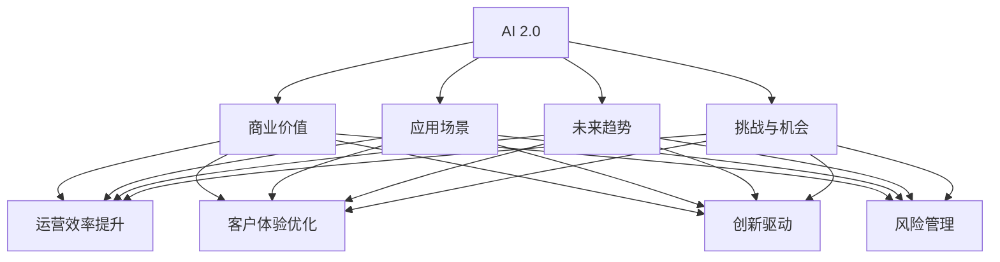

                 

# 李开复：AI 2.0 时代的商业价值

> 关键词：人工智能,商业价值,AI 2.0,应用场景,未来趋势,挑战,机会

## 1. 背景介绍

### 1.1 问题由来

在过去的十年间，人工智能(AI)技术取得了令人瞩目的进展。从深度学习的崛起，到生成对抗网络(GANs)的突破，再到增强学习的爆发，AI正以前所未有的速度改变着我们的世界。然而，尽管AI技术日新月异，但人们对其在商业世界中的应用价值仍然存在诸多疑问。

在李开复看来，AI 2.0时代即将到来，他将为读者深入解析AI 2.0的商业价值，探讨AI如何改变企业运营、产品设计、市场策略等各个方面，为企业家们揭示AI背后的机会与挑战。

### 1.2 问题核心关键点

AI 2.0时代的商业价值主要体现在以下几个方面：

- **运营效率提升**：AI能够自动化完成许多重复性任务，如数据分析、客户服务、库存管理等，从而大幅提高企业的运营效率。
- **客户体验优化**：通过个性化推荐、情感分析等技术，AI能够提供更精准、更符合用户需求的产品和服务，提升客户满意度。
- **创新驱动**：AI能够辅助企业发现新的商业机会，加速产品迭代和创新，保持市场竞争力。
- **风险管理**：AI可以帮助企业识别潜在的风险点，提供更科学的风险评估和管理手段，降低运营风险。

本文将深入探讨AI 2.0时代如何通过上述方式提升企业的商业价值，同时也会提及企业在采用AI技术时可能遇到的挑战和机会。

## 2. 核心概念与联系

### 2.1 核心概念概述

为更好地理解AI 2.0时代的商业价值，本节将介绍几个核心概念：

- **AI 2.0**：指新一代AI技术，包括深度学习、生成对抗网络、增强学习等，相较于AI 1.0的统计模型和专家系统，AI 2.0在处理非结构化数据、解决复杂问题上具备更强能力。
- **商业价值**：指AI技术在企业运营、产品设计、市场策略等方面的实际应用效果，包括降低成本、提升效率、增加收益等。
- **应用场景**：指AI技术在不同行业中的应用实例，如金融、医疗、零售、制造等。
- **未来趋势**：指AI技术未来发展的方向和趋势，包括技术演进、行业应用、伦理与法律等。
- **挑战与机会**：指企业在采用AI技术时可能遇到的技术、法律、伦理等挑战，以及由此带来的商业机会。

这些概念之间的逻辑关系可以通过以下Mermaid流程图来展示：



这个流程图展示了几组核心概念及其之间的联系：

1. AI 2.0技术通过不同的应用场景提升企业的商业价值。
2. 商业价值包括运营效率、客户体验、创新驱动和风险管理四个方面。
3. 未来趋势和挑战与机会对商业价值的实现起着重要的辅助作用。

这些概念共同构成了AI 2.0时代的商业价值框架，帮助我们理解AI如何在企业中发挥作用，并识别可能面临的挑战与机会。

## 3. 核心算法原理 & 具体操作步骤

### 3.1 算法原理概述

AI 2.0时代的商业价值实现，依赖于一系列核心算法原理，包括但不限于：

- **深度学习**：通过多层神经网络模拟人脑的抽象思维，处理非结构化数据，如图像、文本、声音等。
- **生成对抗网络**：通过两个神经网络的对抗训练，生成高质量的假数据，提高模型的泛化能力。
- **增强学习**：通过智能体与环境交互，通过奖励和惩罚机制优化策略，解决复杂优化问题。
- **自然语言处理**：使计算机能够理解、生成自然语言，处理文本数据，进行情感分析、智能客服等。
- **计算机视觉**：使计算机能够识别和处理图像、视频等视觉数据，进行目标检测、图像生成等。

这些算法原理在AI 2.0时代得到了广泛应用，为企业提供了强大的技术支持。

### 3.2 算法步骤详解

AI 2.0时代的商业价值实现，通常包括以下几个关键步骤：

**Step 1: 数据收集与预处理**
- 收集与业务相关的数据，包括客户行为数据、交易记录、社交媒体数据等。
- 对数据进行清洗、去重、标准化等预处理，确保数据质量。

**Step 2: 模型选择与训练**
- 根据业务需求选择合适的AI算法，如深度学习、生成对抗网络、增强学习等。
- 使用训练数据对模型进行训练，调整超参数，优化模型性能。

**Step 3: 模型部署与集成**
- 将训练好的模型部署到生产环境，进行实时预测。
- 将AI模型集成到企业现有的IT系统中，如CRM、ERP、BI等。

**Step 4: 效果评估与迭代优化**
- 使用测试数据对AI模型进行效果评估，监测关键性能指标。
- 根据评估结果，对模型进行迭代优化，提升其准确性和鲁棒性。

### 3.3 算法优缺点

AI 2.0时代的商业价值实现，具有以下优点：

- **高效**：AI算法能够自动化处理大量数据，大幅提升工作效率。
- **精准**：通过深度学习和增强学习等技术，AI模型在预测和决策上具备高精度。
- **灵活**：AI技术能够适应各种不同的业务场景，提供定制化解决方案。

同时，这些算法也存在一些缺点：

- **数据依赖**：AI模型依赖高质量的数据，数据的偏差可能导致模型的偏差。
- **计算资源需求高**：深度学习和生成对抗网络等算法需要大量的计算资源。
- **复杂性高**：AI模型需要专业的知识和技能进行设计和优化，门槛较高。

### 3.4 算法应用领域

AI 2.0时代的商业价值实现，涵盖了多个应用领域：

- **金融行业**：通过风险评估、信用评分、欺诈检测等技术，提高金融机构的运营效率和风险控制能力。
- **医疗行业**：通过影像诊断、基因分析、个性化医疗等技术，提升医疗服务的质量和可及性。
- **零售行业**：通过智能推荐、库存管理、供应链优化等技术，提升零售企业的销售效率和客户满意度。
- **制造行业**：通过预测维护、质量控制、生产优化等技术，提高制造业的生产效率和产品质量。
- **教育行业**：通过个性化教学、智能评估、智能客服等技术，提升教育服务的个性化和互动性。

这些应用领域展示了AI 2.0技术的广泛应用前景，为企业提供了丰富的商业价值实现路径。

## 4. 数学模型和公式 & 详细讲解 & 举例说明

### 4.1 数学模型构建

AI 2.0时代的商业价值实现，通常使用以下数学模型：

- **深度神经网络**：通过多层非线性变换，处理非结构化数据，如图像、文本等。
- **卷积神经网络**：用于图像识别、视频分析等任务，提取局部特征。
- **循环神经网络**：用于时间序列数据处理，如自然语言处理、股票预测等。
- **生成对抗网络**：通过两个神经网络的对抗训练，生成高质量的假数据。
- **增强学习**：通过智能体与环境交互，优化策略，如Q-learning、SARSA等。

### 4.2 公式推导过程

以卷积神经网络为例，其基本架构如图1所示：

```
      layer 1                      layer 2                      layer 3
       |                      *                   *                   * 
      |                    \                  /                   /
      |                   \                 /                   /
      |                   |                |                   |
     conv -> relu -> pool -> conv -> relu -> pool -> conv -> relu -> pool
       |                \               /
       |                 \             /
       |                  *           *
      |                      |        | 
      |                     *         *
       |                      |        |
       |                     *         |
       |                      |        |
       |                     *         |
       |                      |        |
       |                      *         |
       |                       |         |
      input  ->  conv -> relu -> max pool -> flatten -> FC -> softmax
```

其中，conv表示卷积操作，relu表示激活函数，pool表示池化操作，FC表示全连接层，softmax表示输出层。

假设输入数据为 $X$，卷积层参数为 $W$，激活函数为 $f$，池化层参数为 $P$，全连接层参数为 $F$，输出层参数为 $S$。则卷积神经网络的前向传播公式为：

$$
Y = f(W_1 * X_1 + b_1) \quad f = relu
$$

$$
Y = f(W_2 * Y + b_2) \quad f = relu
$$

$$
Y = max(Y_1) \quad pool = max
$$

$$
Y = F * Y + b_3 \quad FC = linear
$$

$$
Y = S * Y + b_4 \quad softmax
$$

其中，$*$ 表示卷积操作，$+$ 表示加法操作，$*$ 表示矩阵乘法操作，$.$ 表示取平均操作，$+$ 表示加权求和操作。

### 4.3 案例分析与讲解

以图像识别为例，假设有一个包含100张猫和狗的图片数据集，通过卷积神经网络进行训练。训练数据集为 $D$，标签为 $y$，模型为 $M$，损失函数为 $L$，优化器为 $O$。

**Step 1: 数据准备**
- 收集100张猫和狗的图像，并标注其类别。
- 将图像标准化，归一化到 $[0,1]$ 范围内。

**Step 2: 模型构建**
- 构建一个包含3个卷积层和2个全连接层的卷积神经网络。
- 使用交叉熵损失函数，Adam优化器。

**Step 3: 模型训练**
- 将训练数据分成训练集和验证集，比例为70%和30%。
- 使用训练集进行模型训练，迭代100轮。
- 在验证集上评估模型性能，调整学习率等超参数。

**Step 4: 模型测试**
- 使用测试集对模型进行测试，计算准确率、召回率等性能指标。
- 根据测试结果，进一步优化模型结构。

通过以上步骤，模型可以识别并分类新的猫和狗图像，展示了AI 2.0在图像识别方面的应用效果。

## 5. 项目实践：代码实例和详细解释说明

### 5.1 开发环境搭建

在进行AI 2.0项目实践前，我们需要准备好开发环境。以下是使用Python进行TensorFlow开发的环境配置流程：

1. 安装Anaconda：从官网下载并安装Anaconda，用于创建独立的Python环境。

2. 创建并激活虚拟环境：
```bash
conda create -n tf-env python=3.8 
conda activate tf-env
```

3. 安装TensorFlow：根据CUDA版本，从官网获取对应的安装命令。例如：
```bash
conda install tensorflow -c conda-forge -c pypi
```

4. 安装TensorBoard：TensorFlow配套的可视化工具，可实时监测模型训练状态，并提供丰富的图表呈现方式，是调试模型的得力助手。
```bash
conda install tensorboard
```

5. 安装PyTorch：虽然TensorFlow和PyTorch是竞争对手，但可以使用PyTorch进行一些辅助开发，如TensorBoard与PyTorch的集成。
```bash
conda install pytorch torchvision torchaudio cudatoolkit=11.1 -c pytorch -c conda-forge
```

完成上述步骤后，即可在`tf-env`环境中开始AI 2.0项目实践。

### 5.2 源代码详细实现

下面我们以图像分类任务为例，给出使用TensorFlow对卷积神经网络进行图像分类的Python代码实现。

首先，定义图像分类任务的数据处理函数：

```python
import tensorflow as tf
from tensorflow.keras import layers

class ImageClassifier(tf.keras.Model):
    def __init__(self):
        super(ImageClassifier, self).__init__()
        self.conv1 = layers.Conv2D(32, (3, 3), activation='relu', padding='same')
        self.pool1 = layers.MaxPooling2D((2, 2))
        self.conv2 = layers.Conv2D(64, (3, 3), activation='relu', padding='same')
        self.pool2 = layers.MaxPooling2D((2, 2))
        self.flatten = layers.Flatten()
        self.dense1 = layers.Dense(64, activation='relu')
        self.dense2 = layers.Dense(10, activation='softmax')
        
    def call(self, x):
        x = self.conv1(x)
        x = self.pool1(x)
        x = self.conv2(x)
        x = self.pool2(x)
        x = self.flatten(x)
        x = self.dense1(x)
        x = self.dense2(x)
        return x
```

然后，定义训练和评估函数：

```python
from tensorflow.keras.preprocessing.image import ImageDataGenerator
from tensorflow.keras.optimizers import Adam
from tensorflow.keras.metrics import Accuracy

def train_epoch(model, dataset, batch_size, optimizer):
    model.train()
    for x, y in dataset:
        with tf.GradientTape() as tape:
            logits = model(x)
            loss = tf.losses.SparseCategoricalCrossentropy()(y, logits)
        grads = tape.gradient(loss, model.trainable_variables)
        optimizer.apply_gradients(zip(grads, model.trainable_variables))
        
def evaluate(model, dataset, batch_size):
    model.eval()
    acc = tf.keras.metrics.Accuracy()
    for x, y in dataset:
        logits = model(x)
        acc.update_state(y, tf.argmax(logits, axis=1))
    return acc.result().numpy()
```

最后，启动训练流程并在测试集上评估：

```python
batch_size = 32
epochs = 10

model = ImageClassifier()
optimizer = Adam(learning_rate=0.001)
model.compile(optimizer=optimizer, loss='sparse_categorical_crossentropy', metrics=['accuracy'])

train_datagen = ImageDataGenerator(rescale=1./255)
test_datagen = ImageDataGenerator(rescale=1./255)

train_generator = train_datagen.flow_from_directory('train', target_size=(64, 64), batch_size=batch_size, class_mode='categorical')
test_generator = test_datagen.flow_from_directory('test', target_size=(64, 64), batch_size=batch_size, class_mode='categorical')

for epoch in range(epochs):
    train_epoch(model, train_generator, batch_size, optimizer)
    train_loss = model.evaluate(train_generator, verbose=0)
    test_loss = model.evaluate(test_generator, verbose=0)
    print(f'Epoch {epoch+1}, train loss: {train_loss}, test loss: {test_loss}')
    
test_acc = evaluate(model, test_generator, batch_size)
print(f'Test accuracy: {test_acc}')
```

以上就是使用TensorFlow进行图像分类的完整代码实现。可以看到，通过TensorFlow的高级API，我们可以快速构建卷积神经网络，并进行图像分类任务。

### 5.3 代码解读与分析

让我们再详细解读一下关键代码的实现细节：

**ImageClassifier类**：
- `__init__`方法：初始化模型，定义卷积层、池化层、全连接层等组件。
- `call`方法：定义模型的前向传播过程。

**train_epoch函数**：
- 在训练模式下，循环迭代训练数据，使用梯度下降算法更新模型参数。
- 计算损失函数，并通过backward()求导得到梯度，然后通过apply_gradients()更新模型参数。

**evaluate函数**：
- 在评估模式下，计算模型的准确率，并返回测试集上的评估结果。

**训练流程**：
- 定义批量大小和迭代轮数。
- 构建模型，编译优化器、损失函数和评价指标。
- 使用ImageDataGenerator预处理训练和测试数据集。
- 训练模型，并在每个epoch结束后输出损失函数。
- 在测试集上评估模型，并输出测试准确率。

可以看到，TensorFlow提供的高阶API使得图像分类的实现过程变得简洁高效。开发者只需关注算法逻辑，而不必深入底层实现细节。

当然，工业级的系统实现还需考虑更多因素，如模型的保存和部署、超参数的自动搜索、更灵活的任务适配层等。但核心的AI 2.0项目实践流程基本与此类似。

## 6. 实际应用场景

### 6.1 智能客服系统

AI 2.0技术在智能客服系统中的应用，可以显著提升客户服务质量。传统客服系统依赖人力，高峰期响应缓慢，且无法处理复杂问题。而基于AI 2.0技术的智能客服系统，可以24/7不间断服务，快速响应客户咨询，并提供个性化推荐和智能对话。

在技术实现上，可以构建基于语言模型的智能客服系统，对客户的问题进行自然语言处理，提取关键信息，并匹配最合适的答案。同时，可以引入知识图谱和规则库，增强系统的准确性和鲁棒性。

### 6.2 金融风险管理

AI 2.0技术在金融行业中的应用，可以大幅提升风险管理能力。传统金融风险管理依赖人工审核，效率低且容易出错。而基于AI 2.0技术的风险管理系统，可以通过大数据分析、机器学习等技术，自动化评估客户信用风险，及时预警潜在的金融风险。

在技术实现上，可以构建基于深度学习的信用评分模型，对客户的信用记录、行为数据等进行分析，预测其未来的还款能力。同时，可以引入生成对抗网络等技术，生成高质量的假数据，提高模型的泛化能力。

### 6.3 智能制造

AI 2.0技术在智能制造中的应用，可以提升生产效率和产品质量。传统制造系统依赖人工监控和维护，效率低且容易出错。而基于AI 2.0技术的智能制造系统，可以通过预测维护、质量控制等技术，实时监测设备状态，预测设备故障，提升生产效率。

在技术实现上，可以构建基于深度学习的预测维护系统，对设备的运行数据进行分析，预测设备故障的概率和发生时间。同时，可以引入增强学习等技术，优化生产流程，提高生产效率。

### 6.4 未来应用展望

随着AI 2.0技术的不断发展，未来在更多领域的应用前景将更加广阔。以下是几个具有代表性的应用场景：

- **医疗诊断**：通过自然语言处理和深度学习技术，辅助医生进行疾病诊断和治疗方案推荐，提高医疗服务的质量和效率。
- **自动驾驶**：通过计算机视觉和增强学习技术，实现自动驾驶汽车的安全行驶，提升交通安全性。
- **智能家居**：通过自然语言处理和物联网技术，实现智能家居的自动化控制和环境优化，提升居民的生活品质。
- **智能推荐**：通过深度学习和增强学习技术，实现个性化推荐系统的精准推荐，提升用户的购物体验和满意度。

这些应用场景展示了AI 2.0技术的广泛应用前景，为企业提供了丰富的商业价值实现路径。

## 7. 工具和资源推荐

### 7.1 学习资源推荐

为了帮助开发者系统掌握AI 2.0的理论基础和实践技巧，这里推荐一些优质的学习资源：

1. **Deep Learning Specialization**：由斯坦福大学教授Andrew Ng主讲的Coursera课程，涵盖深度学习、卷积神经网络、生成对抗网络等核心内容。
2. **TensorFlow官方文档**：详细介绍了TensorFlow的API、数据流图、优化器等，是TensorFlow开发的必备资料。
3. **PyTorch官方文档**：介绍了PyTorch的API、模型构建、优化器等，是PyTorch开发的必备资料。
4. **GitHub上的TensorFlow和PyTorch代码库**：提供了大量的AI 2.0项目和代码示例，是学习的良好资源。
5. **Arxiv和Google Scholar**：收录了大量AI 2.0领域的最新论文，是学术研究的宝贵资源。

通过对这些资源的学习实践，相信你一定能够快速掌握AI 2.0技术的精髓，并用于解决实际的AI应用问题。

### 7.2 开发工具推荐

高效的开发离不开优秀的工具支持。以下是几款用于AI 2.0开发的工具：

1. **TensorFlow**：由Google主导开发的深度学习框架，生产部署方便，适合大规模工程应用。
2. **PyTorch**：由Facebook主导开发的深度学习框架，灵活动态的计算图，适合快速迭代研究。
3. **Keras**：基于TensorFlow和Theano等深度学习框架的高层API，提供了简洁易用的API接口，适合初学者和快速原型开发。
4. **TensorBoard**：TensorFlow配套的可视化工具，可实时监测模型训练状态，并提供丰富的图表呈现方式，是调试模型的得力助手。
5. **Weights & Biases**：模型训练的实验跟踪工具，可以记录和可视化模型训练过程中的各项指标，方便对比和调优。

合理利用这些工具，可以显著提升AI 2.0开发效率，加快创新迭代的步伐。

### 7.3 相关论文推荐

AI 2.0领域的研究成果丰硕，以下是几篇奠基性的相关论文，推荐阅读：

1. **ImageNet Classification with Deep Convolutional Neural Networks**：AlexNet模型，首次展示了深度卷积神经网络在图像分类任务上的优越性能。
2. **LeNet-5: A Convolutional Neural Network for Handwritten Digit Recognition**：LeNet模型，展示了卷积神经网络在手写数字识别任务上的应用效果。
3. **Convolutional Neural Networks for Scalable Image Recognition**：Google Inception模型，展示了深度卷积神经网络在图像分类和物体检测任务上的应用效果。
4. **Generative Adversarial Nets**：提出生成对抗网络，通过两个神经网络的对抗训练，生成高质量的假数据。
5. **Playing Atari with Deep Reinforcement Learning**：展示了深度增强学习技术在电子游戏任务上的应用效果，推动了强化学习的研究。

这些论文代表了大数据、深度学习、增强学习等AI 2.0技术的发展脉络。通过学习这些前沿成果，可以帮助研究者把握学科前进方向，激发更多的创新灵感。

## 8. 总结：未来发展趋势与挑战

### 8.1 总结

本文对AI 2.0时代的商业价值进行了全面系统的介绍。首先阐述了AI 2.0技术的兴起背景，明确了其在提升企业运营效率、优化客户体验、驱动创新和风险管理等方面的独特价值。其次，从原理到实践，详细讲解了AI 2.0的算法原理和具体操作步骤，给出了完整的代码实例。同时，本文还广泛探讨了AI 2.0在智能客服、金融风险管理、智能制造等多个行业领域的应用前景，展示了AI 2.0技术的广阔前景。最后，本文精选了AI 2.0技术的各类学习资源，力求为读者提供全方位的技术指引。

通过本文的系统梳理，可以看到，AI 2.0技术正在成为各行各业的重要工具，极大地提升了企业的效率和竞争力。面向未来，AI 2.0技术将继续推动各行业的数字化转型，成为推动经济社会发展的重要力量。

### 8.2 未来发展趋势

展望未来，AI 2.0技术的发展将呈现以下几个趋势：

1. **自动化和智能化水平提升**：AI 2.0技术将进一步提升企业的自动化和智能化水平，实现更高效的运营和生产。
2. **数据驱动决策**：AI 2.0技术将帮助企业更好地利用数据，进行精准的决策分析和预测。
3. **跨领域应用拓展**：AI 2.0技术将拓展到更多领域，如医疗、教育、能源等，带来新的商业模式和机遇。
4. **伦理与法律问题**：AI 2.0技术的发展将带来一系列伦理与法律问题，如隐私保护、算法偏见等，需要得到充分关注和解决。
5. **人机协作**：AI 2.0技术将与人类智能进行更深层次的协作，提升人机交互体验。

这些趋势展示了AI 2.0技术的未来方向，为我们提供了广阔的想象空间。

### 8.3 面临的挑战

尽管AI 2.0技术已经取得了显著进展，但在迈向更加智能化、普适化应用的过程中，它仍面临着诸多挑战：

1. **数据隐私与安全**：AI 2.0技术需要大量的数据进行训练，如何保护用户隐私、确保数据安全，是一个重要问题。
2. **模型解释性与透明性**：AI 2.0模型往往被视为"黑盒"系统，难以解释其内部工作机制和决策逻辑，需要开发更透明的AI系统。
3. **计算资源需求高**：深度学习等AI 2.0技术需要大量的计算资源，如何高效利用计算资源，是一个重要的研究方向。
4. **技术标准化**：AI 2.0技术的快速发展和应用需要相应的标准化和规范，确保技术的互操作性和可靠性。
5. **伦理与法律问题**：AI 2.0技术的发展将带来一系列伦理与法律问题，如算法偏见、歧视性输出等，需要得到充分关注和解决。

这些挑战需要我们在技术、伦理、法律等多个方面进行全面探索和解决，以确保AI 2.0技术的健康发展。

### 8.4 研究展望

面对AI 2.0技术所面临的挑战，未来的研究需要在以下几个方面寻求新的突破：

1. **联邦学习**：通过分布式计算和数据加密技术，实现在保护用户隐私的前提下进行模型训练。
2. **可解释AI**：开发更透明的AI系统，提供可解释的模型输出和决策过程，增强用户信任和接受度。
3. **模型压缩与优化**：通过模型压缩、稀疏化存储等技术，优化模型结构，提高计算效率和部署灵活性。
4. **AI标准化**：推动AI技术的标准化和规范化，确保技术的互操作性和可靠性。
5. **伦理与法律框架**：建立完善的伦理与法律框架，保障AI技术的公正性、透明性和安全性。

这些研究方向的探索，必将引领AI 2.0技术迈向更高的台阶，为构建安全、可靠、可解释、可控的智能系统铺平道路。面向未来，AI 2.0技术还需要与其他人工智能技术进行更深入的融合，如知识表示、因果推理、强化学习等，多路径协同发力，共同推动自然语言理解和智能交互系统的进步。只有勇于创新、敢于突破，才能不断拓展AI 2.0技术的边界，让智能技术更好地造福人类社会。

## 9. 附录：常见问题与解答

**Q1：AI 2.0技术与AI 1.0技术有何不同？**

A: AI 2.0技术与AI 1.0技术的主要区别在于其处理非结构化数据的能力。AI 1.0技术主要依赖统计模型和专家系统，处理结构化数据，如图表、表格等。而AI 2.0技术则依赖深度学习、生成对抗网络、增强学习等算法，处理非结构化数据，如图像、文本、语音等。AI 2.0技术在处理复杂、大规模数据时，具有更强的能力和更广泛的应用前景。

**Q2：AI 2.0技术在实际应用中，如何确保模型的泛化能力？**

A: 在AI 2.0技术的实际应用中，确保模型的泛化能力是至关重要的。以下是一些方法：

1. **数据增强**：通过增加数据样本的多样性，减少模型的过拟合风险。
2. **正则化**：使用L2正则、Dropout等方法，防止模型过度适应训练数据。
3. **对抗训练**：引入对抗样本，提高模型的鲁棒性和泛化能力。
4. **模型集成**：通过模型集成技术，将多个模型的输出进行综合，提升泛化能力。
5. **迁移学习**：将在大规模数据集上训练的模型，迁移到特定任务上，利用其通用性提升泛化能力。

**Q3：AI 2.0技术在企业运营中的应用场景有哪些？**

A: AI 2.0技术在企业运营中的应用场景非常广泛，以下是一些典型的应用场景：

1. **客户服务**：构建智能客服系统，提供24/7不间断服务，提升客户满意度。
2. **生产管理**：通过预测维护、质量控制等技术，提升生产效率和产品质量。
3. **供应链优化**：通过大数据分析和机器学习，优化供应链管理，降低运营成本。
4. **市场营销**：通过个性化推荐和情感分析技术，提升市场营销效果，提高客户转化率。
5. **财务分析**：通过深度学习和自然语言处理技术，自动化完成财务报表生成和分析，提升财务工作的效率。

**Q4：AI 2.0技术在数据隐私与安全方面的挑战有哪些？**

A: AI 2.0技术在数据隐私与安全方面面临以下挑战：

1. **数据隐私保护**：AI 2.0技术需要大量的数据进行训练，如何保护用户隐私，防止数据泄露，是一个重要问题。
2. **数据安全**：在数据传输和存储过程中，如何防止数据被篡改、泄漏，是一个重要问题。
3. **隐私计算**：在保护用户隐私的前提下，如何进行数据共享和协作，是一个重要问题。

**Q5：AI 2.0技术在商业应用中的未来趋势是什么？**

A: AI 2.0技术在商业应用中的未来趋势包括：

1. **自动化与智能化水平提升**：AI 2.0技术将进一步提升企业的自动化和智能化水平，实现更高效的运营和生产。
2. **数据驱动决策**：AI 2.0技术将帮助企业更好地利用数据，进行精准的决策分析和预测。
3. **跨领域应用拓展**：AI 2.0技术将拓展到更多领域，如医疗、教育、能源等，带来新的商业模式和机遇。
4. **伦理与法律问题**：AI 2.0技术的发展将带来一系列伦理与法律问题，如隐私保护、算法偏见等，需要得到充分关注和解决。
5. **人机协作**：AI 2.0技术将与人类智能进行更深层次的协作，提升人机交互体验。

**Q6：AI 2.0技术的局限性有哪些？**

A: AI 2.0技术在实际应用中也存在一些局限性：

1. **数据依赖**：AI 2.0技术依赖高质量的数据，数据的偏差可能导致模型的偏差。
2. **计算资源需求高**：深度学习和生成对抗网络等算法需要大量的计算资源。
3. **技术复杂性高**：AI 2.0技术需要专业的知识和技能进行设计和优化，门槛较高。
4. **模型解释性不足**：AI 2.0模型往往被视为"黑盒"系统，难以解释其内部工作机制和决策逻辑。
5. **伦理与法律问题**：AI 2.0技术的发展将带来一系列伦理与法律问题，如算法偏见、歧视性输出等。

**Q7：如何评价AI 2.0技术的商业价值？**

A: 评价AI 2.0技术的商业价值，主要从以下几个方面进行考虑：

1. **效率提升**：AI 2.0技术在提升企业运营效率、降低成本、提高生产力等方面的效果。
2. **客户体验**：AI 2.0技术在提升客户满意度、个性化推荐、智能客服等方面的效果。
3. **创新能力**：AI 2.0技术在推动产品创新、市场策略优化等方面的效果。
4. **风险管理**：AI 2.0技术在提升风险管理能力、预警潜在风险等方面的效果。
5. **收益增长**：AI 2.0技术在增加收入、扩大市场份额等方面的效果。

通过综合评价以上因素，可以全面了解AI 2.0技术的商业价值。

---

作者：禅与计算机程序设计艺术 / Zen and the Art of Computer Programming

