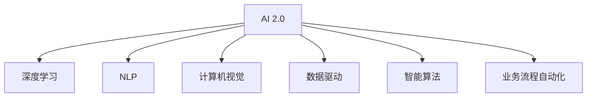

                 

# 李开复：AI 2.0 时代的市场

## 1. 背景介绍

### 1.1 问题由来

随着人工智能技术的迅猛发展，AI 2.0 时代已经到来。AI 2.0 不仅仅是一个技术的演进，更是一场深刻的市场革命。这一变革将重塑各个行业的业务模式，改变人们的生活方式。因此，了解 AI 2.0 时代的市场变化，对于企业家、投资者、研究人员及广大技术从业者都具有重要意义。

### 1.2 问题核心关键点

AI 2.0 时代的市场变革主要围绕以下几个关键点展开：

1. **技术突破**：AI 2.0 带来的技术突破，如深度学习、自然语言处理、计算机视觉等，将大幅提升企业的智能化水平。
2. **数据驱动**：大数据、云计算等技术的进步，使企业能够更高效地处理和分析海量数据，驱动 AI 技术的应用和创新。
3. **行业渗透**：AI 技术将广泛渗透到各行各业，从制造业到金融业，从医疗健康到教育，AI 的应用场景日益增多。
4. **商业模式创新**：AI 技术的应用，催生了新的商业模式和价值创造方式，如自动化流程、个性化推荐、智能客服等。
5. **人才竞争**：AI 人才的短缺成为制约企业发展的瓶颈，人才的竞争将日益激烈。

## 2. 核心概念与联系

### 2.1 核心概念概述

为更好地理解 AI 2.0 时代的市场变革，本节将介绍几个关键概念：

- **AI 2.0**：AI 2.0 指的是基于深度学习、自然语言处理、计算机视觉等技术，实现全面智能化的时代。与 AI 1.0（基于规则的专家系统）相比，AI 2.0 更加注重从数据中学习，并具有更强的自适应和泛化能力。

- **深度学习**：一种基于人工神经网络的机器学习方法，通过多层非线性映射，实现对复杂数据的有效建模。深度学习在图像识别、语音识别、自然语言处理等领域展现了卓越的性能。

- **自然语言处理（NLP）**：AI 2.0 的核心技术之一，旨在让机器理解和处理人类语言。NLP 包括文本分类、机器翻译、问答系统、情感分析等任务。

- **计算机视觉**：使计算机能够"看"并理解图像和视频内容的学科。计算机视觉技术广泛应用于自动驾驶、安防监控、医疗影像等领域。

- **数据驱动**：在 AI 2.0 时代，数据成为企业智能化决策的关键。大数据技术、云计算平台为 AI 模型的训练和应用提供了强有力的支持。

- **智能算法**：包括强化学习、推荐系统、自动生成等，这些算法能够在数据中挖掘出模式和规则，驱动 AI 技术的应用。

- **业务流程自动化**：AI 技术能够自动化执行大量重复性、耗时的任务，从而提升企业的运营效率和盈利能力。

### 2.2 核心概念原理和架构的 Mermaid 流程图



## 3. 核心算法原理 & 具体操作步骤

### 3.1 算法原理概述

AI 2.0 时代的核心算法原理主要基于以下三个方面：

1. **深度学习**：通过多层神经网络对数据进行非线性映射，实现对复杂模式的识别和分类。
2. **自然语言处理**：将人类语言转化为计算机可理解的格式，并实现语义理解和生成。
3. **计算机视觉**：通过图像识别、分割、分类等技术，使计算机理解图像内容。

### 3.2 算法步骤详解

AI 2.0 的算法步骤通常包括以下几个环节：

1. **数据准备**：收集和预处理训练数据，包括数据清洗、特征提取、数据增强等。
2. **模型训练**：选择适当的深度学习模型或 NLP 模型，使用训练数据进行模型训练。
3. **模型评估**：在验证集或测试集上评估模型的性能，并进行调优。
4. **模型部署**：将训练好的模型部署到实际应用环境中，进行推理和预测。

### 3.3 算法优缺点

AI 2.0 的算法具有以下优点：

1. **高精度**：深度学习和 NLP 模型通常能够达到高精度的预测效果。
2. **泛化能力强**：AI 2.0 模型在处理复杂、多样化的数据时，表现出良好的泛化能力。
3. **自适应能力**：模型能够在不断更新的数据上自适应学习，提升性能。

同时，AI 2.0 算法也存在以下缺点：

1. **高计算成本**：深度学习模型通常需要大量计算资源进行训练，成本较高。
2. **数据依赖性强**：模型依赖高质量的数据进行训练，数据不足可能导致性能下降。
3. **解释性不足**：AI 2.0 模型的决策过程往往难以解释，缺乏可解释性。
4. **模型复杂度高**：深度学习模型通常具有高维度、复杂结构，难以理解和调试。

### 3.4 算法应用领域

AI 2.0 的算法广泛应用在各个领域，包括但不限于：

- **金融科技**：AI 在金融风险评估、信用评分、自动化交易等场景中应用广泛。
- **医疗健康**：AI 在疾病诊断、影像分析、个性化医疗等领域展现出巨大潜力。
- **零售电商**：通过 AI 技术，实现客户行为分析、推荐系统、智能客服等。
- **制造业**：AI 在质量检测、设备维护、生产调度等方面具有重要作用。
- **自动驾驶**：计算机视觉和深度学习技术在自动驾驶中实现图像识别、路径规划等。

## 4. 数学模型和公式 & 详细讲解 & 举例说明

### 4.1 数学模型构建

AI 2.0 的核心数学模型包括深度学习模型、NLP 模型和计算机视觉模型。下面以深度学习模型为例，介绍其基本数学模型构建。

深度学习模型通常包括输入层、隐藏层和输出层。输入层接收原始数据，隐藏层进行特征提取和特征映射，输出层输出最终的预测结果。其中，隐藏层的非线性变换是深度学习模型的关键。

### 4.2 公式推导过程

以简单的全连接神经网络为例，其前向传播过程的数学公式如下：

$$
y = \sigma(Wx + b)
$$

其中，$x$ 为输入向量，$W$ 和 $b$ 为模型参数，$\sigma$ 为激活函数。

反向传播过程中，损失函数 $L$ 对 $W$ 和 $b$ 的梯度公式为：

$$
\frac{\partial L}{\partial W} = \frac{\partial L}{\partial y} \cdot \frac{\partial y}{\partial x} \cdot \frac{\partial x}{\partial W}
$$

通过梯度下降算法，不断调整模型参数，使损失函数最小化。

### 4.3 案例分析与讲解

假设我们要构建一个简单的手写数字识别模型。首先，收集大量手写数字图片，并进行预处理。然后，使用卷积神经网络（CNN）作为模型，进行特征提取和分类。最后，在测试集上评估模型的性能，并调整模型参数，以达到最佳的识别效果。

## 5. 项目实践：代码实例和详细解释说明

### 5.1 开发环境搭建

1. **安装 Python 和相关库**：
   ```bash
   sudo apt-get install python3 python3-pip
   pip3 install numpy scikit-learn matplotlib
   ```

2. **安装 TensorFlow 和 Keras**：
   ```bash
   pip3 install tensorflow==2.3
   pip3 install keras
   ```

3. **安装 OpenCV 进行计算机视觉应用**：
   ```bash
   pip3 install opencv-python
   ```

### 5.2 源代码详细实现

下面以手写数字识别为例，展示如何使用 TensorFlow 和 Keras 实现一个简单的深度学习模型。

```python
from tensorflow.keras import layers, models

# 定义模型
model = models.Sequential([
    # 输入层
    layers.Flatten(input_shape=(28, 28)),
    # 隐藏层
    layers.Dense(128, activation='relu'),
    # 输出层
    layers.Dense(10, activation='softmax')
])

# 编译模型
model.compile(optimizer='adam',
              loss='categorical_crossentropy',
              metrics=['accuracy'])

# 训练模型
model.fit(x_train, y_train, epochs=10, validation_data=(x_test, y_test))
```

### 5.3 代码解读与分析

**Flatten 层**：将输入的二维图像数据展平为一维向量。

**Dense 层**：全连接层，实现数据的非线性变换。

**softmax 激活函数**：输出概率分布，表示每个类别的预测概率。

**categorical_crossentropy 损失函数**：适用于多分类问题，计算预测与真实标签之间的交叉熵损失。

## 6. 实际应用场景

### 6.1 智能客服系统

AI 2.0 在智能客服系统中的应用，可以显著提升客户体验和企业效率。智能客服系统通过 NLP 技术，理解客户提出的问题和意图，自动回复常见问题和引导复杂问题。AI 2.0 系统可以处理大量并发请求，减少人工客服的工作量，提升响应速度。

### 6.2 金融风控

在金融领域，AI 2.0 可以应用于信用评分、欺诈检测、交易风险控制等场景。通过深度学习模型和 NLP 技术，AI 系统能够分析客户的财务数据、行为数据，预测其信用风险和欺诈行为，从而提升风控决策的准确性和效率。

### 6.3 医疗影像分析

AI 2.0 在医疗影像分析中的应用，可以大幅提升医疗诊断的准确性和效率。AI 系统通过深度学习和计算机视觉技术，自动识别和分类医学影像中的病变区域，辅助医生进行诊断和治疗决策。

### 6.4 未来应用展望

AI 2.0 的未来应用前景广阔，以下列举几个典型场景：

1. **智能家居**：AI 2.0 技术可以实现智能语音交互、环境感知、自动控制等，提升居住体验。
2. **智能交通**：AI 2.0 应用于交通管理、自动驾驶、智能导航等领域，提升交通系统的安全性和效率。
3. **个性化推荐**：AI 2.0 推荐系统能够基于用户行为数据，提供个性化的商品推荐，提升用户体验和销售额。
4. **智能制造**：AI 2.0 在制造业中实现设备维护、生产调度、质量检测等，提升生产效率和产品质量。
5. **智慧城市**：AI 2.0 应用于智慧城市管理、公共安全、环保监测等领域，提升城市治理水平。

## 7. 工具和资源推荐

### 7.1 学习资源推荐

1. **《深度学习》（Ian Goodfellow 著）**：该书详细介绍了深度学习的基本原理和算法，是深度学习领域的经典教材。
2. **《自然语言处理综论》（Daniel Jurafsky, James H. Martin 著）**：该书涵盖了自然语言处理的基础理论和实际应用，是 NLP 领域的经典教材。
3. **Coursera 深度学习课程**：由 Andrew Ng 教授主讲，内容涵盖深度学习的基本概念和算法。
4. **Kaggle 数据科学竞赛平台**：提供大量数据集和实际应用案例，适合实战学习。
5. **ArXiv 论文库**：最新的人工智能研究成果，为 AI 研究和应用提供参考。

### 7.2 开发工具推荐

1. **TensorFlow**：Google 开源的深度学习框架，支持多种硬件平台，广泛应用于 AI 开发。
2. **Keras**：基于 TensorFlow 的高层 API，易于使用，适合快速开发原型。
3. **PyTorch**：Facebook 开源的深度学习框架，支持动态图和静态图模式，灵活性高。
4. **Jupyter Notebook**：交互式开发环境，适合快速实验和共享代码。
5. **GitHub**：版本控制和协作开发平台，便于团队合作和代码共享。

### 7.3 相关论文推荐

1. **《ImageNet Classification with Deep Convolutional Neural Networks》（Alex Krizhevsky 等，2012 年）**：提出卷积神经网络（CNN），并在 ImageNet 数据集上取得了优异成绩。
2. **《Attention is All You Need》（Ashish Vaswani 等，2017 年）**：提出 Transformer 模型，实现了自然语言处理领域的突破。
3. **《A Few Useful Things to Know About Deep Learning》（Andrej Karpathy，2015 年）**：深度学习领域的技术博客，内容涵盖深度学习的基本原理和应用。
4. **《Deep Learning with Python》（Francois Chollet 著）**：该书详细介绍了 Keras 的使用和深度学习模型的构建。

## 8. 总结：未来发展趋势与挑战

### 8.1 研究成果总结

AI 2.0 时代的技术突破，带来了许多创新应用，但也面临诸多挑战。以下是一些主要的总结：

1. **技术突破**：AI 2.0 技术在深度学习、自然语言处理、计算机视觉等领域取得了显著进展。
2. **数据驱动**：大数据、云计算等技术为 AI 模型的训练和应用提供了坚实的基础。
3. **行业渗透**：AI 2.0 技术在金融、医疗、零售、制造等领域的应用日益广泛。
4. **商业模式创新**：AI 技术催生了新的商业模式，如自动化流程、推荐系统等。
5. **人才竞争**：AI 人才短缺成为制约企业发展的瓶颈，人才竞争日益激烈。

### 8.2 未来发展趋势

AI 2.0 的未来发展趋势主要围绕以下几个方面：

1. **技术演进**：深度学习、NLP、计算机视觉等技术将进一步演进，推动 AI 技术的应用。
2. **数据质量**：高质量的数据将成为 AI 技术发展的关键，数据采集、清洗、标注等环节将得到重视。
3. **跨领域融合**：AI 技术将与其他技术融合，实现更广泛的应用场景。
4. **伦理与安全**：AI 技术的发展需要重视伦理与安全问题，避免技术滥用和潜在风险。
5. **智能生态**：AI 技术将构建智能生态，推动各行业协同创新。

### 8.3 面临的挑战

AI 2.0 的发展仍面临诸多挑战：

1. **数据依赖**：高质量数据的获取和处理是 AI 技术发展的瓶颈。
2. **模型复杂性**：AI 模型通常具有高维度、复杂结构，难以调试和解释。
3. **计算资源**：深度学习模型需要大量的计算资源进行训练和推理。
4. **伦理与安全**：AI 技术的应用可能带来伦理和安全问题，需要规范和监管。
5. **人才短缺**：AI 人才的短缺将制约 AI 技术的发展和应用。

### 8.4 研究展望

未来，AI 2.0 技术需要在以下几个方面进行深入研究：

1. **无监督学习**：通过无监督学习方法，减少对标注数据的依赖，提升 AI 模型的泛化能力。
2. **模型压缩与优化**：通过模型压缩、剪枝等技术，降低 AI 模型的计算资源消耗。
3. **跨领域融合**：将 AI 技术与其他领域的技术进行融合，实现更广泛的应用场景。
4. **智能生态**：构建 AI 技术的智能生态，推动各行业协同创新。
5. **伦理与安全**：重视 AI 技术的伦理与安全问题，确保技术应用的安全性。

## 9. 附录：常见问题与解答

**Q1：AI 2.0 技术的发展现状如何？**

A: AI 2.0 技术在深度学习、自然语言处理、计算机视觉等领域取得了显著进展，已经在诸多实际应用中展现出了强大的潜力。

**Q2：AI 2.0 技术的主要应用场景有哪些？**

A: AI 2.0 技术在智能客服、金融风控、医疗影像、智能制造等领域具有广泛的应用前景。

**Q3：AI 2.0 技术的未来发展方向是什么？**

A: AI 2.0 技术的未来发展方向包括技术演进、数据质量、跨领域融合、伦理与安全、智能生态等。

**Q4：AI 2.0 技术面临的主要挑战是什么？**

A: AI 2.0 技术面临的主要挑战包括数据依赖、模型复杂性、计算资源、伦理与安全、人才短缺等。

---

作者：禅与计算机程序设计艺术 / Zen and the Art of Computer Programming

