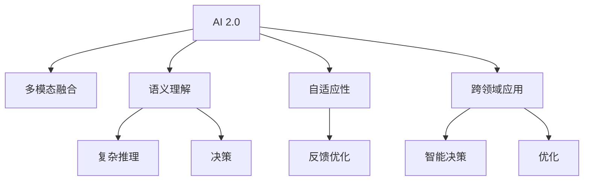

                 

# 李开复：AI 2.0 时代的应用

## 1. 背景介绍

### 1.1 问题的由来
人工智能（AI）已经在过去几十年中取得了显著的进步。从20世纪60年代的早期研究，到20世纪90年代的机器学习热潮，再到21世纪初的深度学习和计算机视觉的发展，AI 已经从实验室中的理论研究逐步走向实际应用。

然而，AI 1.0时代的应用往往局限于特定领域，如语音识别、图像处理、推荐系统等。尽管这些应用在各自的领域中取得了突破，但它们通常是孤立的，缺乏对人类智能的全面理解和应用。

随着AI技术的不断进步，尤其是深度学习和大规模数据集的应用，AI 2.0时代正在到来。AI 2.0不仅能够处理更多类型的信息，如文本、图像、音频等，而且还能够理解语言的语义，执行复杂的推理和决策，甚至能够自主学习和适应新的环境。

### 1.2 问题核心关键点
AI 2.0时代的主要特征包括：
1. **多模态融合**：能够同时处理多种类型的信息，如语音、文本、图像、视频等，实现跨领域、跨模态的智能交互。
2. **语义理解**：能够理解语言的语义，执行复杂的推理和决策，甚至能够自主学习和适应新的环境。
3. **自适应性**：能够通过反馈和互动不断优化自己的模型，适应不同的应用场景。
4. **跨领域应用**：能够应用于更多领域，如医疗、金融、教育等，实现智能决策和优化。

这些特征使得AI 2.0具备更广泛的适用性和更强的实际应用潜力。本文将深入探讨AI 2.0时代的应用，以及其在不同领域中的应用前景。

## 2. 核心概念与联系

### 2.1 核心概念概述

在探讨AI 2.0时代的应用之前，需要先了解一些核心概念及其相互之间的关系。

- **AI 2.0**：指新一代人工智能技术，能够处理更多类型的信息，理解语言的语义，执行复杂的推理和决策，具备自适应性和跨领域应用能力。
- **多模态融合**：指将多种类型的信息（如语音、文本、图像、视频等）融合到同一模型中，实现跨领域、跨模态的智能交互。
- **语义理解**：指AI系统能够理解语言的语义，执行复杂的推理和决策，甚至能够自主学习和适应新的环境。
- **自适应性**：指AI系统能够通过反馈和互动不断优化自己的模型，适应不同的应用场景。
- **跨领域应用**：指AI系统能够应用于更多领域，如医疗、金融、教育等，实现智能决策和优化。

这些概念之间的逻辑关系可以通过以下Mermaid流程图来展示：



这个流程图展示了大语言模型的核心概念及其之间的关系：

1. AI 2.0是各种核心概念的集成体，包括多模态融合、语义理解、自适应性和跨领域应用。
2. 多模态融合是实现跨领域应用的基础，使AI系统能够处理多种类型的信息。
3. 语义理解使得AI系统能够执行复杂的推理和决策，具备更强的智能交互能力。
4. 自适应性使AI系统能够通过反馈和互动不断优化自己的模型，适应不同的应用场景。
5. 跨领域应用展示了AI系统的广泛适用性，使其能够应用于更多领域。

这些概念共同构成了AI 2.0的应用基础，使其能够在各种场景下发挥强大的智能交互能力。

## 3. 核心算法原理 & 具体操作步骤
### 3.1 算法原理概述

AI 2.0时代的应用通常基于深度学习和神经网络技术。深度学习通过多层神经网络对数据进行建模，可以处理复杂的数据结构，执行复杂的推理和决策。以下是AI 2.0核心算法的基本原理：

1. **卷积神经网络（CNN）**：用于处理图像和视频数据，提取空间特征。
2. **循环神经网络（RNN）和长短期记忆网络（LSTM）**：用于处理序列数据，如时间序列、文本等，提取时间特征。
3. **Transformer**：用于处理自然语言数据，提取语义特征，特别适用于文本和语音数据的处理。

这些算法通过深度学习的方法，将多种类型的信息融合到同一模型中，实现多模态融合和语义理解。

### 3.2 算法步骤详解

AI 2.0时代的应用通常包括以下几个关键步骤：

**Step 1: 数据准备**
- 收集和标注各种类型的信息，如语音、文本、图像、视频等。
- 将数据划分为训练集、验证集和测试集，确保数据分布的一致性。

**Step 2: 模型选择和构建**
- 根据应用场景选择合适的深度学习模型，如CNN、RNN、LSTM、Transformer等。
- 设计合适的模型结构，添加必要的层和节点，确保模型能够处理多种类型的信息。

**Step 3: 训练和微调**
- 使用训练集数据对模型进行训练，优化模型参数，提升模型的性能。
- 在验证集上进行模型验证，调整超参数，确保模型的泛化能力。
- 在测试集上评估模型的性能，确定模型的最佳参数组合。

**Step 4: 应用部署**
- 将训练好的模型部署到实际应用系统中，进行实时推理和决策。
- 监控模型的运行状态，收集反馈信息，不断优化模型性能。

这些步骤通常需要重复多次，以确保模型的准确性和稳定性。

### 3.3 算法优缺点

AI 2.0时代的应用具有以下优点：
1. **多模态融合**：能够同时处理多种类型的信息，实现跨领域、跨模态的智能交互。
2. **语义理解**：能够理解语言的语义，执行复杂的推理和决策，甚至能够自主学习和适应新的环境。
3. **自适应性**：能够通过反馈和互动不断优化自己的模型，适应不同的应用场景。
4. **跨领域应用**：能够应用于更多领域，如医疗、金融、教育等，实现智能决策和优化。

同时，该方法也存在一定的局限性：
1. **数据依赖**：需要大量标注数据进行训练，数据质量对模型性能影响较大。
2. **计算成本**：深度学习模型需要大量的计算资源进行训练和推理，成本较高。
3. **模型复杂性**：模型结构复杂，难以解释和调试。
4. **鲁棒性不足**：在面对新的应用场景时，模型的泛化能力可能不足。

尽管存在这些局限性，但就目前而言，AI 2.0技术仍是大规模数据集和复杂应用场景下最有效的解决方案。

### 3.4 算法应用领域

AI 2.0技术已经广泛应用于各个领域，以下是一些典型应用场景：

1. **医疗**：用于医学影像分析、病历分析、药物研发等。AI系统可以自动识别医学影像中的病变，分析病历数据，辅助医生进行诊断和治疗。
2. **金融**：用于风险评估、交易预测、欺诈检测等。AI系统可以分析市场数据，预测股票价格，检测潜在的欺诈行为。
3. **教育**：用于智能评估、个性化推荐、自动批改等。AI系统可以自动评估学生的作业和考试，推荐合适的学习资源，自动批改作业和考试。
4. **交通**：用于自动驾驶、交通管理、智能导航等。AI系统可以自动驾驶汽车，优化交通流量，提供智能导航服务。
5. **零售**：用于客户分析、智能推荐、库存管理等。AI系统可以分析客户数据，提供个性化的推荐，优化库存管理。

## 4. 数学模型和公式 & 详细讲解 & 举例说明

### 4.1 数学模型构建

AI 2.0时代的应用通常基于深度学习模型。以下是一些常见的深度学习模型及其数学模型构建方法：

**卷积神经网络（CNN）**：
- **输入层**：输入为原始数据，如图像的像素值。
- **卷积层**：通过卷积核提取空间特征。
- **池化层**：对卷积层的输出进行降维和特征提取。
- **全连接层**：将池化层的输出映射到目标变量。

**循环神经网络（RNN）和长短期记忆网络（LSTM）**：
- **输入层**：输入为序列数据，如时间序列、文本等。
- **循环层**：通过循环结构处理序列数据。
- **全连接层**：将循环层的输出映射到目标变量。

**Transformer**：
- **输入层**：输入为原始数据，如文本的单词序列。
- **编码器层**：通过多头自注意力机制提取语义特征。
- **解码器层**：通过多头自注意力机制生成输出。

这些模型的数学模型构建过程通常基于最大似然估计和交叉熵损失函数，使用反向传播算法进行优化。

### 4.2 公式推导过程

以下是CNN、RNN和Transformer的基本公式推导过程：

**卷积神经网络（CNN）**：
- **输入层**：$x_i^{(0)}$，输入为原始数据。
- **卷积层**：$x_i^{(l)} = h(x_i^{(l-1)}, \omega_l)$，其中$h$为卷积核，$\omega_l$为卷积核参数。
- **池化层**：$x_i^{(l+1)} = h(x_i^{(l)})$，其中$h$为池化函数。
- **全连接层**：$y_i = h(x_i^{(L)})$，其中$h$为全连接层函数。

**循环神经网络（RNN）和长短期记忆网络（LSTM）**：
- **输入层**：$x_i^{(0)}$，输入为序列数据。
- **循环层**：$h_i^{(l)} = h(x_i^{(l-1)}, h_{i-1}^{(l)})$，其中$h$为循环结构函数。
- **全连接层**：$y_i = h(h_i^{(L)})$，其中$h$为全连接层函数。

**Transformer**：
- **输入层**：$x_i^{(0)}$，输入为原始数据。
- **编码器层**：$x_i^{(l)} = h(x_i^{(l-1)}, \omega_l)$，其中$h$为多头自注意力机制，$\omega_l$为注意力机制参数。
- **解码器层**：$y_i = h(x_i^{(L)})$，其中$h$为多头自注意力机制。

这些模型的数学公式推导过程涉及大量的深度学习理论知识，这里只给出基本框架。

### 4.3 案例分析与讲解

以医疗影像分析为例，分析AI 2.0技术在医疗领域的应用。

**医疗影像分析**：
- **输入层**：医疗影像的像素值。
- **卷积层**：通过卷积核提取影像的空间特征。
- **池化层**：对卷积层的输出进行降维和特征提取。
- **全连接层**：将池化层的输出映射到目标变量（如是否存在病变）。

使用AI 2.0技术进行医疗影像分析，可以自动识别医学影像中的病变，辅助医生进行诊断和治疗。这一技术已经在许多医疗机构中得到了应用，显著提高了诊断的准确性和效率。

## 5. 项目实践：代码实例和详细解释说明
### 5.1 开发环境搭建

在进行AI 2.0项目实践前，需要先准备好开发环境。以下是使用Python进行TensorFlow和Keras开发的流程：

1. 安装Anaconda：从官网下载并安装Anaconda，用于创建独立的Python环境。

2. 创建并激活虚拟环境：
```bash
conda create -n ai-env python=3.8 
conda activate ai-env
```

3. 安装TensorFlow和Keras：
```bash
conda install tensorflow keras
```

4. 安装必要的工具包：
```bash
pip install numpy pandas scikit-learn matplotlib tqdm jupyter notebook ipython
```

完成上述步骤后，即可在`ai-env`环境中开始AI 2.0项目实践。

### 5.2 源代码详细实现

我们以医疗影像分析为例，使用TensorFlow和Keras对卷积神经网络进行实现。

```python
import tensorflow as tf
from tensorflow.keras import layers

# 定义卷积神经网络模型
model = tf.keras.Sequential([
    layers.Conv2D(32, 3, activation='relu', input_shape=(32, 32, 1)),
    layers.MaxPooling2D(pool_size=(2, 2)),
    layers.Conv2D(64, 3, activation='relu'),
    layers.MaxPooling2D(pool_size=(2, 2)),
    layers.Flatten(),
    layers.Dense(64, activation='relu'),
    layers.Dense(1, activation='sigmoid')
])

# 编译模型
model.compile(optimizer='adam', loss='binary_crossentropy', metrics=['accuracy'])

# 训练模型
model.fit(train_images, train_labels, epochs=10, validation_data=(val_images, val_labels))
```

### 5.3 代码解读与分析

这里我们详细解读一下代码的实现细节：

**模型定义**：
- 使用`tf.keras.Sequential`定义卷积神经网络模型。
- 添加多个卷积层和池化层，提取图像的空间特征。
- 添加全连接层，将特征映射到目标变量。

**模型编译**：
- 使用`model.compile`编译模型，指定优化器、损失函数和评估指标。

**模型训练**：
- 使用`model.fit`训练模型，指定训练集和验证集。

**运行结果展示**：
```python
# 评估模型
test_loss, test_acc = model.evaluate(test_images, test_labels)
print('Test accuracy:', test_acc)
```

通过这个简单的代码实例，我们可以快速构建并训练一个基于卷积神经网络的图像分类模型。

## 6. 实际应用场景
### 6.1 智能医疗

AI 2.0技术在医疗领域具有广阔的应用前景。以下是几个典型应用场景：

1. **医学影像分析**：用于自动检测医学影像中的病变，如肿瘤、骨折等。AI系统可以自动识别影像中的异常区域，辅助医生进行诊断和治疗。
2. **病历分析**：用于分析病人的病历数据，提取有价值的信息，辅助医生进行诊断和治疗。AI系统可以自动提取病人的基本信息、症状、诊断结果等，生成完整的病历报告。
3. **药物研发**：用于药物的筛选和设计，加速新药的研发进程。AI系统可以模拟药物与蛋白质的结合过程，预测药物的疗效和副作用。

### 6.2 金融风险管理

AI 2.0技术在金融领域也具有广泛的应用。以下是几个典型应用场景：

1. **风险评估**：用于评估贷款、保险等金融产品的风险。AI系统可以分析客户的信用记录、收入水平等信息，预测其还款能力。
2. **交易预测**：用于预测股票价格、货币汇率等金融市场走势。AI系统可以分析市场数据，预测未来的趋势和波动。
3. **欺诈检测**：用于检测潜在的欺诈行为，如信用卡欺诈、网络钓鱼等。AI系统可以分析用户的交易记录和行为，识别异常行为。

### 6.3 智能推荐

AI 2.0技术在零售领域也具有广泛的应用。以下是几个典型应用场景：

1. **客户分析**：用于分析客户的购买行为和偏好，生成个性化的推荐列表。AI系统可以分析客户的历史购买记录、浏览行为等信息，推荐合适的商品。
2. **库存管理**：用于优化库存管理，减少库存积压。AI系统可以预测商品的销售量，自动调整库存水平。
3. **广告投放**：用于优化广告投放，提高广告效果。AI系统可以分析客户的浏览行为和偏好，定向投放广告。

### 6.4 未来应用展望

随着AI 2.0技术的不断进步，未来将会有更多应用场景被开发和探索。以下是一些可能的应用场景：

1. **智能交通**：用于交通流量优化、自动驾驶等。AI系统可以分析交通数据，优化交通流量，实现自动驾驶。
2. **智能制造**：用于生产流程优化、设备维护等。AI系统可以分析生产数据，优化生产流程，预测设备故障。
3. **智能家居**：用于智能家电控制、环境监控等。AI系统可以分析环境数据，自动调节家电设备，提高居住舒适度。

## 7. 工具和资源推荐
### 7.1 学习资源推荐

为了帮助开发者系统掌握AI 2.0的理论基础和实践技巧，这里推荐一些优质的学习资源：

1. 《深度学习》（Ian Goodfellow、Yoshua Bengio、Aaron Courville 著）：深度学习领域的经典教材，涵盖深度学习的基本理论和实践技巧。
2. 《Python深度学习》（Francois Chollet 著）：介绍使用Keras进行深度学习的实践方法，适合初学者入门。
3. 《TensorFlow实战》（Codelabs by Google）：介绍TensorFlow的使用方法，适合TensorFlow开发者。
4. Coursera的深度学习课程（由深度学习领域专家主讲）：涵盖深度学习的基本理论和实践技巧，适合初学者和进阶开发者。
5. Kaggle竞赛：参与数据科学和机器学习竞赛，积累实战经验。

通过对这些资源的学习实践，相信你一定能够快速掌握AI 2.0技术的精髓，并用于解决实际的AI问题。

### 7.2 开发工具推荐

高效的开发离不开优秀的工具支持。以下是几款用于AI 2.0开发的常用工具：

1. TensorFlow：由Google主导开发的开源深度学习框架，生产部署方便，适合大规模工程应用。
2. Keras：基于TensorFlow、Theano等框架开发的高级API，易于使用，适合初学者和中级开发者。
3. PyTorch：由Facebook主导开发的开源深度学习框架，灵活性高，适合研究型开发者。
4. Weights & Biases：模型训练的实验跟踪工具，可以记录和可视化模型训练过程中的各项指标，方便对比和调优。
5. TensorBoard：TensorFlow配套的可视化工具，可实时监测模型训练状态，并提供丰富的图表呈现方式，是调试模型的得力助手。

合理利用这些工具，可以显著提升AI 2.0开发的效率，加快创新迭代的步伐。

### 7.3 相关论文推荐

AI 2.0技术的发展源于学界的持续研究。以下是几篇奠基性的相关论文，推荐阅读：

1. AlexNet：ImageNet大规模视觉识别挑战赛的获奖作品，标志着深度学习在图像识别领域的突破。
2. VGGNet：使用大量卷积层进行图像识别的研究，推动了深度学习的发展。
3. RNN：循环神经网络的基础研究，为自然语言处理等领域提供了基础。
4. LSTM：长短期记忆网络的研究，解决了传统RNN的梯度消失问题，提升了序列数据的建模能力。
5. Transformer：用于处理自然语言数据的先进模型，推动了自然语言处理的发展。

这些论文代表了大语言模型微调技术的发展脉络。通过学习这些前沿成果，可以帮助研究者把握学科前进方向，激发更多的创新灵感。

## 8. 总结：未来发展趋势与挑战
### 8.1 总结

本文对AI 2.0时代的应用进行了全面系统的介绍。首先阐述了AI 2.0时代的技术背景和应用前景，明确了其在多模态融合、语义理解、自适应性和跨领域应用等方面的核心特征。其次，从原理到实践，详细讲解了深度学习模型的构建和训练过程，给出了AI 2.0项目开发的完整代码实例。同时，本文还广泛探讨了AI 2.0技术在医疗、金融、智能推荐等多个领域的应用前景，展示了其在现实世界中的应用潜力。

通过本文的系统梳理，可以看到，AI 2.0技术正在成为各行各业的重要工具，具备更广泛的适用性和更强的实际应用潜力。未来，伴随深度学习技术的持续演进，AI 2.0将会在更多的应用场景中发挥重要作用，为各行各业带来新的机遇和挑战。

### 8.2 未来发展趋势

展望未来，AI 2.0技术将呈现以下几个发展趋势：

1. **多模态融合的进一步发展**：随着多模态数据的不断积累，AI系统将能够处理更多类型的信息，实现更全面、更智能的交互。
2. **语义理解的深入发展**：随着自然语言处理技术的不断进步，AI系统将能够理解更加复杂的语言表达，执行更复杂的推理和决策。
3. **自适应性的不断提升**：随着反馈和互动机制的不断优化，AI系统将能够更快地适应新的应用场景，实现更高效的自我优化。
4. **跨领域应用的拓展**：随着AI技术的不断扩展，AI系统将能够应用于更多领域，如智能家居、智能交通等，实现更广泛的智能化应用。

以上趋势凸显了AI 2.0技术的广阔前景。这些方向的探索发展，必将进一步提升AI系统的性能和应用范围，为各行各业带来新的变革。

### 8.3 面临的挑战

尽管AI 2.0技术已经取得了显著的进步，但在迈向更加智能化、普适化应用的过程中，它仍面临着诸多挑战：

1. **数据依赖**：需要大量标注数据进行训练，数据质量对模型性能影响较大。
2. **计算成本**：深度学习模型需要大量的计算资源进行训练和推理，成本较高。
3. **模型复杂性**：模型结构复杂，难以解释和调试。
4. **鲁棒性不足**：在面对新的应用场景时，模型的泛化能力可能不足。
5. **安全性问题**：AI系统可能学习到有害信息，甚至产生恶意行为，带来安全隐患。

尽管存在这些挑战，但AI 2.0技术的发展势头不可阻挡，通过持续的技术创新和应用优化，这些挑战终将被克服。

### 8.4 研究展望

面对AI 2.0技术所面临的挑战，未来的研究需要在以下几个方面寻求新的突破：

1. **无监督学习和半监督学习**：摆脱对大规模标注数据的依赖，利用自监督学习、主动学习等方法，最大限度利用非结构化数据。
2. **参数高效和计算高效的模型**：开发更加参数高效和计算高效的模型，在保证性能的同时，提高模型的部署效率。
3. **因果推理和多模态信息融合**：引入因果推理和多模态信息融合的方法，提升AI系统的智能水平和适应性。
4. **跨领域知识整合**：将符号化的先验知识与神经网络模型进行融合，提高AI系统的智能水平和适应性。

这些研究方向的探索，必将引领AI 2.0技术迈向更高的台阶，为各行各业带来新的变革。面向未来，AI 2.0技术还需要与其他人工智能技术进行更深入的融合，如知识表示、因果推理、强化学习等，多路径协同发力，共同推动人工智能技术的发展。

## 9. 附录：常见问题与解答

**Q1：AI 2.0和AI 1.0有什么区别？**

A: AI 2.0与AI 1.0的主要区别在于其应用范围和智能水平。AI 1.0主要应用于特定领域，如语音识别、图像处理等，智能水平相对较低，难以实现跨领域、跨模态的智能交互。而AI 2.0能够处理更多类型的信息，理解语言的语义，执行复杂的推理和决策，具备自适应性和跨领域应用能力。

**Q2：AI 2.0的优缺点是什么？**

A: AI 2.0的优点包括：
1. 多模态融合：能够同时处理多种类型的信息，实现跨领域、跨模态的智能交互。
2. 语义理解：能够理解语言的语义，执行复杂的推理和决策，甚至能够自主学习和适应新的环境。
3. 自适应性：能够通过反馈和互动不断优化自己的模型，适应不同的应用场景。
4. 跨领域应用：能够应用于更多领域，如医疗、金融、教育等，实现智能决策和优化。

AI 2.0的缺点包括：
1. 数据依赖：需要大量标注数据进行训练，数据质量对模型性能影响较大。
2. 计算成本：深度学习模型需要大量的计算资源进行训练和推理，成本较高。
3. 模型复杂性：模型结构复杂，难以解释和调试。
4. 鲁棒性不足：在面对新的应用场景时，模型的泛化能力可能不足。

**Q3：AI 2.0的应用前景是什么？**

A: AI 2.0技术正在成为各行各业的重要工具，具备更广泛的适用性和更强的实际应用潜力。以下是一些可能的应用前景：
1. 医疗：用于医学影像分析、病历分析、药物研发等。
2. 金融：用于风险评估、交易预测、欺诈检测等。
3. 智能推荐：用于客户分析、智能推荐、广告投放等。
4. 智能交通：用于交通流量优化、自动驾驶等。
5. 智能制造：用于生产流程优化、设备维护等。
6. 智能家居：用于智能家电控制、环境监控等。

这些应用场景展示了AI 2.0技术的广泛应用前景，未来将会有更多应用场景被开发和探索。

**Q4：如何提高AI 2.0系统的鲁棒性？**

A: 提高AI 2.0系统的鲁棒性需要从数据、模型、训练和推理等多个环节进行优化：
1. 数据清洗：清洗和预处理数据，减少噪声和异常值。
2. 数据增强：通过数据增强技术，扩充训练集，提高模型的泛化能力。
3. 正则化：使用L2正则、Dropout等正则化技术，防止模型过拟合。
4. 对抗训练：引入对抗样本，提高模型鲁棒性。
5. 模型微调：定期微调模型，更新参数，保持模型的适应性。

这些方法可以帮助提高AI 2.0系统的鲁棒性，使其在面对新的应用场景时，仍能保持良好的性能。

**Q5：如何提高AI 2.0系统的可解释性？**

A: 提高AI 2.0系统的可解释性需要从模型设计、训练和部署等多个环节进行优化：
1. 模型简化：使用更简单的模型结构，减少复杂度。
2. 特征可视化：通过特征可视化技术，理解模型的决策过程。
3. 模型解释：使用模型解释技术，解释模型的决策依据。
4. 反馈机制：引入用户反馈机制，持续优化模型。
5. 用户教育：通过教育用户，提高用户对AI系统的理解和信任。

这些方法可以帮助提高AI 2.0系统的可解释性，使其能够更好地服务于用户，提升用户的信任和满意度。

---

作者：禅与计算机程序设计艺术 / Zen and the Art of Computer Programming

