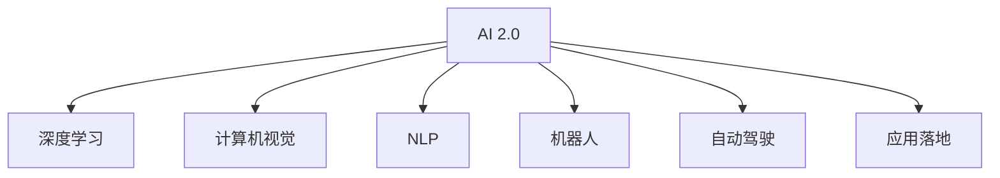

                 

# 李开复：AI 2.0 时代的意义

> 关键词：人工智能,AI 2.0,计算机视觉,自然语言处理,机器人,自动驾驶,应用落地

## 1. 背景介绍

### 1.1 问题由来

随着科技的迅猛发展，人工智能（AI）已经成为全球科技创新的热点。当前，AI 的发展已经进入一个全新的阶段——AI 2.0。这一阶段，AI 不仅仅是一个技术工具，更是一种赋能各行业、改变社会经济结构的力量。AI 2.0 以深度学习为基础，能够自主学习和推理，广泛应用于计算机视觉、自然语言处理、机器人、自动驾驶等领域，推动了各个行业的数字化转型。

AI 2.0 的核心是数据和算法。通过大规模的标注数据和先进的深度学习算法，AI 模型能够不断学习和进化，解决复杂的现实问题，提升人类的生活和工作质量。然而，AI 2.0 的发展也面临着诸多挑战，如数据隐私、伦理道德、安全性等问题，需要全社会共同关注和解决。

## 2. 核心概念与联系

### 2.1 核心概念概述

为更好地理解 AI 2.0 时代的意义，本节将介绍几个密切相关的核心概念：

- AI 2.0：人工智能发展的第二阶段，以深度学习和神经网络为基础，能够自主学习和推理，广泛应用于计算机视觉、自然语言处理、机器人、自动驾驶等领域。
- 深度学习：一种通过多层神经网络结构进行特征提取和分类的机器学习方法，能够自动提取输入数据的高级特征。
- 计算机视觉：利用计算机和图像处理技术，实现对图像、视频、场景的自动识别和理解，广泛应用于自动驾驶、医疗影像、安防监控等场景。
- 自然语言处理（NLP）：利用计算机和语言处理技术，实现对自然语言的理解和生成，广泛应用于机器翻译、文本摘要、情感分析等场景。
- 机器人：能够执行复杂的物理任务，具备感知、决策、控制等能力，广泛应用于工业制造、家庭服务、医疗护理等领域。
- 自动驾驶：通过传感器和AI 技术，实现车辆自主导航和决策，广泛应用于智能交通、物流配送等场景。
- 应用落地：将 AI 技术应用于实际业务场景，解决具体问题，提升业务效率和用户体验。

这些核心概念之间的逻辑关系可以通过以下 Mermaid 流程图来展示：



这个流程图展示了一个 AI 2.0 系统的主要组件及其关系：

1. AI 2.0 系统以深度学习为核心，通过多层神经网络进行特征提取和分类。
2. 计算机视觉和自然语言处理分别针对图像和文本数据，提供深度学习模型。
3. 机器人利用 AI 技术进行自主决策和控制，具备复杂的物理操作能力。
4. 自动驾驶结合计算机视觉和 NLP 技术，实现车辆自主导航和决策。
5. 应用落地将 AI 技术应用于具体业务场景，解决实际问题。

这些核心概念共同构成了 AI 2.0 系统的整体框架，使得 AI 技术能够广泛应用于各个领域，带来深远的社会和经济影响。

## 3. 核心算法原理 & 具体操作步骤

### 3.1 算法原理概述

AI 2.0 的核心算法是深度学习和神经网络。以计算机视觉为例，深度学习模型通过多层卷积神经网络（CNN）结构，自动提取输入图像的高级特征，进而实现图像分类、目标检测、图像生成等任务。以下是深度学习在计算机视觉中的基本原理：

1. 卷积层：通过卷积核对输入图像进行特征提取，实现局部感知和特征重用。
2. 池化层：通过最大池化或平均池化等操作，降低特征图尺寸，提高模型计算效率。
3. 全连接层：通过多层神经网络结构，实现对输入特征的分类和回归任务。
4. 激活函数：通过非线性激活函数，增加模型的非线性表达能力。

以自然语言处理为例，深度学习模型通过多层循环神经网络（RNN）或Transformer结构，自动提取输入文本的高级特征，进而实现文本分类、语言生成、机器翻译等任务。以下是深度学习在自然语言处理中的基本原理：

1. 编码器：通过多层RNN或Transformer结构，自动提取输入文本的高级语义特征。
2. 解码器：通过多层RNN或Transformer结构，将编码器的输出转化为目标文本。
3 注意力机制：通过自注意力机制，提高模型对重要信息的关注度，增强模型对长文本的理解能力。
4 词向量表示：通过嵌入层将输入文本转化为向量表示，便于模型进行特征提取和分类。

### 3.2 算法步骤详解

AI 2.0 的算法步骤主要包括数据预处理、模型训练、模型评估和模型部署。以下以计算机视觉中的图像分类任务为例，详细介绍深度学习模型的训练步骤：

1. 数据预处理：包括数据清洗、数据增强、归一化等操作，将原始数据转化为模型可以处理的格式。
2. 模型训练：通过反向传播算法更新模型参数，最小化损失函数，提高模型准确率。
3. 模型评估：通过验证集对模型进行评估，判断模型泛化能力。
4. 模型部署：将训练好的模型应用于实际业务场景，进行推理预测。

### 3.3 算法优缺点

AI 2.0 的深度学习算法具有以下优点：

- 自动提取特征：通过深度学习模型，自动提取输入数据的高级特征，减少手动特征工程的复杂度。
- 高效泛化能力：通过大规模数据和深度学习模型，能够高效泛化到新的数据集，提升模型准确率。
- 可解释性强：深度学习模型可以通过可视化工具进行特征提取，帮助理解模型决策过程。

但深度学习算法也存在一些缺点：

- 数据依赖性强：深度学习模型对数据质量、数量要求高，数据不足时容易过拟合。
- 计算资源消耗大：深度学习模型参数量大，计算复杂度高，需要大量的计算资源支持。
- 可解释性差：深度学习模型通常是"黑盒"系统，难以解释其内部工作机制。

### 3.4 算法应用领域

AI 2.0 的深度学习算法已经广泛应用于计算机视觉、自然语言处理、机器人、自动驾驶等领域，具体应用场景如下：

- 计算机视觉：图像分类、目标检测、图像生成、人脸识别等。
- 自然语言处理：机器翻译、文本摘要、情感分析、语音识别等。
- 机器人：工业自动化、家庭服务、医疗护理等。
- 自动驾驶：自动导航、车道保持、障碍物识别等。

AI 2.0 的深度学习算法在各个领域都取得了显著成果，推动了产业的数字化转型，提升了人类生活的便捷性。

## 4. 数学模型和公式 & 详细讲解 & 举例说明

### 4.1 数学模型构建

以计算机视觉中的图像分类任务为例，构建深度学习模型的数学模型。

设输入图像为 $x \in \mathbb{R}^{h\times w\times c}$，其中 $h$、$w$ 和 $c$ 分别为图像的高、宽和通道数。输出为 $y \in \{1,2,\dots,K\}$，其中 $K$ 为分类类别数。定义损失函数为交叉熵损失函数：

$$
\mathcal{L} = -\frac{1}{N}\sum_{i=1}^{N}\sum_{k=1}^{K}y_k\log p_k
$$

其中 $y_k$ 表示第 $k$ 个类别的真实标签，$p_k$ 表示模型预测第 $k$ 个类别的概率。定义优化目标为最小化损失函数：

$$
\min_{\theta}\mathcal{L} = -\frac{1}{N}\sum_{i=1}^{N}\sum_{k=1}^{K}y_k\log p_k
$$

其中 $\theta$ 表示模型参数，包括卷积核、全连接层等。

### 4.2 公式推导过程

以卷积神经网络（CNN）为例，推导其前向传播和反向传播过程。

前向传播过程包括卷积、池化、激活函数等操作。设输入为 $x$，卷积核为 $w$，卷积操作可以表示为：

$$
y=f(\star)(x,w)
$$

其中 $f(\star)$ 表示卷积操作。经过多层的卷积和池化操作后，得到特征图 $z$。全连接层将特征图转化为类别概率，可以表示为：

$$
p = \sigma(Wz+b)
$$

其中 $\sigma$ 表示激活函数，$W$ 和 $b$ 分别为全连接层的权重和偏置。

反向传播过程包括计算梯度和更新参数。设损失函数为 $\mathcal{L}$，定义梯度为 $\frac{\partial \mathcal{L}}{\partial z}$ 和 $\frac{\partial \mathcal{L}}{\partial x}$。通过链式法则，可以计算出各层的梯度：

$$
\frac{\partial \mathcal{L}}{\partial z} = \frac{\partial \mathcal{L}}{\partial p}\frac{\partial p}{\partial z}
$$

$$
\frac{\partial \mathcal{L}}{\partial x} = \frac{\partial \mathcal{L}}{\partial z}\frac{\partial z}{\partial x}
$$

通过上述公式，可以计算出每个参数的梯度，进而更新模型参数，最小化损失函数。

### 4.3 案例分析与讲解

以自然语言处理中的机器翻译任务为例，分析Transformer模型的训练过程。

Transformer模型由编码器（Encoder）和解码器（Decoder）两部分组成。编码器通过多层自注意力机制，提取输入序列的高级语义特征。解码器通过多层自注意力机制和多头注意力机制，生成目标序列。

以机器翻译任务为例，设输入序列为 $x=\{x_1,x_2,\dots,x_n\}$，目标序列为 $y=\{y_1,y_2,\dots,y_m\}$。编码器通过自注意力机制提取输入序列的特征 $z_1$，解码器通过自注意力机制和多头注意力机制生成目标序列 $z_2$。设损失函数为交叉熵损失函数，可以表示为：

$$
\mathcal{L} = -\frac{1}{N}\sum_{i=1}^{N}\sum_{k=1}^{K}y_k\log p_k
$$

其中 $y_k$ 表示第 $k$ 个类别的真实标签，$p_k$ 表示模型预测第 $k$ 个类别的概率。定义优化目标为最小化损失函数：

$$
\min_{\theta}\mathcal{L} = -\frac{1}{N}\sum_{i=1}^{N}\sum_{k=1}^{K}y_k\log p_k
$$

其中 $\theta$ 表示模型参数，包括卷积核、全连接层等。

## 5. 项目实践：代码实例和详细解释说明

### 5.1 开发环境搭建

在进行AI 2.0项目实践前，我们需要准备好开发环境。以下是使用Python进行TensorFlow开发的环境配置流程：

1. 安装Anaconda：从官网下载并安装Anaconda，用于创建独立的Python环境。

2. 创建并激活虚拟环境：
```bash
conda create -n tf-env python=3.8 
conda activate tf-env
```

3. 安装TensorFlow：根据CUDA版本，从官网获取对应的安装命令。例如：
```bash
conda install tensorflow tensorflow-gpu=cuda110 -c conda-forge
```

4. 安装TensorBoard：用于监控和可视化训练过程。

5. 安装其他依赖包：
```bash
pip install numpy scipy scikit-learn matplotlib tqdm jupyter notebook ipython
```

完成上述步骤后，即可在`tf-env`环境中开始AI 2.0项目的实践。

### 5.2 源代码详细实现

下面我们以图像分类任务为例，给出使用TensorFlow构建CNN模型的PyTorch代码实现。

首先，定义CNN模型的结构：

```python
import tensorflow as tf
from tensorflow.keras import layers

def create_model(input_shape, num_classes):
    model = tf.keras.Sequential([
        layers.Conv2D(32, (3, 3), activation='relu', input_shape=input_shape),
        layers.MaxPooling2D((2, 2)),
        layers.Conv2D(64, (3, 3), activation='relu'),
        layers.MaxPooling2D((2, 2)),
        layers.Flatten(),
        layers.Dense(64, activation='relu'),
        layers.Dense(num_classes, activation='softmax')
    ])
    return model

# 定义超参数
input_shape = (224, 224, 3)
num_classes = 10
batch_size = 32
epochs = 20
```

然后，加载数据集并进行预处理：

```python
from tensorflow.keras.datasets import cifar10
from tensorflow.keras.preprocessing.image import ImageDataGenerator

(x_train, y_train), (x_test, y_test) = cifar10.load_data()
x_train, x_test = x_train / 255.0, x_test / 255.0

# 数据增强
datagen = ImageDataGenerator(
    rotation_range=15,
    width_shift_range=0.1,
    height_shift_range=0.1,
    horizontal_flip=True,
    vertical_flip=False)
train_generator = datagen.flow(x_train, y_train, batch_size=batch_size)
test_generator = datagen.flow(x_test, y_test, batch_size=batch_size)
```

接着，定义损失函数和优化器：

```python
from tensorflow.keras.losses import CategoricalCrossentropy
from tensorflow.keras.optimizers import Adam

loss_fn = CategoricalCrossentropy()
optimizer = Adam(learning_rate=0.001)
```

最后，训练模型并在测试集上评估：

```python
model = create_model(input_shape, num_classes)

model.compile(optimizer=optimizer, loss=loss_fn, metrics=['accuracy'])

history = model.fit(train_generator, epochs=epochs, validation_data=test_generator)

test_loss, test_acc = model.evaluate(test_generator)
print('Test loss:', test_loss)
print('Test accuracy:', test_acc)
```

以上就是使用TensorFlow构建CNN模型的完整代码实现。可以看到，TensorFlow提供了丰富的API和工具，使得深度学习模型的构建和训练变得非常简便。

### 5.3 代码解读与分析

让我们再详细解读一下关键代码的实现细节：

**create_model函数**：
- 定义了CNN模型的结构，包括卷积层、池化层、全连接层等。
- 输出层使用softmax激活函数，方便进行多分类任务。

**数据加载和预处理**：
- 使用CIFAR-10数据集，并对其进行归一化处理。
- 使用ImageDataGenerator进行数据增强，包括旋转、平移、翻转等操作，增强模型的泛化能力。

**损失函数和优化器**：
- 使用CategoricalCrossentropy作为损失函数，适合多分类任务。
- 使用Adam优化器，自适应学习率调整，具有收敛速度快、鲁棒性强的特点。

**模型训练和评估**：
- 通过fit方法进行模型训练，指定训练轮数和验证集。
- 使用evaluate方法在测试集上评估模型性能，输出损失和准确率。

可以看到，TensorFlow提供了丰富的API和工具，使得深度学习模型的构建和训练变得非常简便。开发者可以将更多精力放在模型设计、超参数调参等高层逻辑上，而不必过多关注底层的实现细节。

当然，工业级的系统实现还需考虑更多因素，如模型的保存和部署、超参数的自动搜索、更灵活的任务适配层等。但核心的模型训练流程基本与此类似。

## 6. 实际应用场景

### 6.1 智能客服系统

基于AI 2.0的智能客服系统可以广泛应用于各类企业，提高客服效率和客户满意度。系统通过预训练和微调模型，自动理解客户意图，匹配最合适的回复。

在技术实现上，可以收集企业内部的历史客服对话记录，将问题和最佳答复构建成监督数据，在此基础上对预训练模型进行微调。微调后的模型能够自动理解客户意图，匹配最合适的答案模板进行回复。对于客户提出的新问题，还可以接入检索系统实时搜索相关内容，动态组织生成回答。如此构建的智能客服系统，能大幅提升客户咨询体验和问题解决效率。

### 6.2 金融舆情监测

AI 2.0的情感分析技术可以应用于金融舆情监测，实时监测市场舆论动向，辅助决策。

具体而言，可以收集金融领域相关的新闻、报道、评论等文本数据，并对其进行主题标注和情感标注。在此基础上对预训练语言模型进行微调，使其能够自动判断文本属于何种主题，情感倾向是正面、中性还是负面。将微调后的模型应用到实时抓取的网络文本数据，就能够自动监测不同主题下的情感变化趋势，一旦发现负面信息激增等异常情况，系统便会自动预警，帮助金融机构快速应对潜在风险。

### 6.3 个性化推荐系统

AI 2.0的推荐系统可以广泛应用于电商、内容推荐等领域，提升用户体验和运营效率。

具体而言，可以收集用户浏览、点击、评论、分享等行为数据，提取和用户交互的物品标题、描述、标签等文本内容。将文本内容作为模型输入，用户的后续行为（如是否点击、购买等）作为监督信号，在此基础上微调预训练语言模型。微调后的模型能够从文本内容中准确把握用户的兴趣点。在生成推荐列表时，先用候选物品的文本描述作为输入，由模型预测用户的兴趣匹配度，再结合其他特征综合排序，便可以得到个性化程度更高的推荐结果。

### 6.4 未来应用展望

随着AI 2.0技术的发展，未来的应用场景将更加广泛和深入。

在智慧医疗领域，基于AI 2.0的医疗问答、病历分析、药物研发等应用将提升医疗服务的智能化水平，辅助医生诊疗，加速新药开发进程。

在智能教育领域，AI 2.0的可控文本生成、知识推理等技术将赋能教学、辅导、评测等环节，因材施教，促进教育公平，提高教学质量。

在智慧城市治理中，AI 2.0的图像识别、语音识别等技术将应用于城市事件监测、舆情分析、应急指挥等环节，提高城市管理的自动化和智能化水平，构建更安全、高效的未来城市。

此外，在企业生产、社会治理、文娱传媒等众多领域，AI 2.0技术也将不断涌现，为经济社会发展注入新的动力。相信随着技术的日益成熟，AI 2.0必将在更广阔的应用领域大放异彩，深刻影响人类的生产生活方式。

## 7. 工具和资源推荐

### 7.1 学习资源推荐

为了帮助开发者系统掌握AI 2.0的理论基础和实践技巧，这里推荐一些优质的学习资源：

1. 《Deep Learning》书籍：由深度学习领域的权威专家撰写，全面介绍了深度学习的原理、算法和应用，是学习深度学习的经典入门书籍。

2. 《自然语言处理综论》（Natural Language Processing with Python）书籍：由NLP领域的知名专家撰写，介绍了NLP技术的理论基础和实践技巧，适合Python开发者学习。

3. 《机器人学导论》（Robotics: Science and Systems）课程：由斯坦福大学开设的机器人学课程，涵盖了机器人学的各个方面，是学习机器人技术的优秀资源。

4. 《深度学习实践指南》（TensorFlow官方文档）：由TensorFlow官方编写，详细介绍了TensorFlow的使用方法和实践技巧，适合TensorFlow开发者学习。

5. 《自然语言处理最新动态》（arXiv.org）：是一个开放的学术论文平台，收录了自然语言处理领域的最新研究成果，是学习前沿技术的优秀资源。

通过对这些资源的学习实践，相信你一定能够快速掌握AI 2.0的技术基础和实践技巧，并用于解决实际的业务问题。

### 7.2 开发工具推荐

高效的开发离不开优秀的工具支持。以下是几款用于AI 2.0开发开发的常用工具：

1. TensorFlow：由Google主导开发的深度学习框架，生产部署方便，适合大规模工程应用。

2. PyTorch：基于Python的开源深度学习框架，灵活动态，适合快速迭代研究。

3. Keras：高层深度学习API，易于上手，适合初学者学习。

4. Jupyter Notebook：开源的交互式计算环境，适合编写和分享代码。

5. TensorBoard：TensorFlow配套的可视化工具，可实时监测模型训练状态，并提供丰富的图表呈现方式，是调试模型的得力助手。

6. Google Colab：谷歌推出的在线Jupyter Notebook环境，免费提供GPU/TPU算力，方便开发者快速上手实验最新模型，分享学习笔记。

合理利用这些工具，可以显著提升AI 2.0任务的开发效率，加快创新迭代的步伐。

### 7.3 相关论文推荐

AI 2.0的发展源于学界的持续研究。以下是几篇奠基性的相关论文，推荐阅读：

1. ImageNet Classification with Deep Convolutional Neural Networks：提出CNN模型，通过多层次卷积结构提取图像特征，刷新了图像分类任务SOTA。

2. Attention is All You Need：提出Transformer结构，通过自注意力机制实现高效的语言建模，开启了NLP领域的预训练大模型时代。

3. Natural Language Understanding with Pre-trained Transformer-based Models：提出BERT模型，引入基于掩码的自监督预训练任务，刷新了多项NLP任务SOTA。

4. Generative Pre-trained Transformer（GPT-2）：展示了大规模语言模型的强大zero-shot学习能力，引发了对于通用人工智能的新一轮思考。

5. Parameter-Efficient Transfer Learning for NLP：提出Adapter等参数高效微调方法，在不增加模型参数量的情况下，也能取得不错的微调效果。

6. Attention is All We Need：引入基于连续型Prompt的微调范式，为如何充分利用预训练知识提供了新的思路。

这些论文代表了大语言模型微调技术的发展脉络。通过学习这些前沿成果，可以帮助研究者把握学科前进方向，激发更多的创新灵感。

## 8. 总结：未来发展趋势与挑战

### 8.1 总结

本文对AI 2.0技术进行了全面系统的介绍。首先阐述了AI 2.0的发展背景和意义，明确了AI 2.0在各个领域的应用价值。其次，从原理到实践，详细讲解了深度学习模型的训练步骤和优化方法，给出了完整的代码实例。同时，本文还广泛探讨了AI 2.0技术在智能客服、金融舆情、个性化推荐等多个行业领域的应用前景，展示了AI 2.0范式的巨大潜力。此外，本文精选了AI 2.0技术的各类学习资源，力求为读者提供全方位的技术指引。

通过本文的系统梳理，可以看到，AI 2.0技术正在成为人工智能领域的核心范式，极大地拓展了深度学习模型的应用边界，催生了更多的落地场景。受益于大规模语料的预训练和深度学习模型的发展，AI 2.0技术在各个领域都取得了显著成果，推动了产业的数字化转型，提升了人类生活的便捷性。未来，伴随预训练语言模型和微调方法的持续演进，相信AI 2.0技术必将在更广阔的应用领域大放异彩，深刻影响人类的生产生活方式。

### 8.2 未来发展趋势

展望未来，AI 2.0技术的发展将呈现以下几个趋势：

1. 模型规模持续增大。随着算力成本的下降和数据规模的扩张，深度学习模型参数量还将持续增长。超大规模模型蕴含的丰富语言知识，有望支撑更加复杂多变的下游任务微调。

2. 微调方法日趋多样。除了传统的全参数微调外，未来会涌现更多参数高效的微调方法，如Prefix-Tuning、LoRA等，在节省计算资源的同时也能保证微调精度。

3. 持续学习成为常态。随着数据分布的不断变化，AI 2.0模型也需要持续学习新知识以保持性能。如何在不遗忘原有知识的同时，高效吸收新样本信息，将成为重要的研究课题。

4. 标注样本需求降低。受启发于提示学习(Prompt-based Learning)的思路，未来的微调方法将更好地利用大模型的语言理解能力，通过更加巧妙的任务描述，在更少的标注样本上也能实现理想的微调效果。

5. 多模态微调崛起。当前的微调主要聚焦于纯文本数据，未来会进一步拓展到图像、视频、语音等多模态数据微调。多模态信息的融合，将显著提升AI 2.0模型的理解能力和表现力。

6. 模型通用性增强。经过海量数据的预训练和多领域任务的微调，AI 2.0模型将具备更强大的常识推理和跨领域迁移能力，逐步迈向通用人工智能(AGI)的目标。

以上趋势凸显了AI 2.0技术的广阔前景。这些方向的探索发展，必将进一步提升AI 2.0模型的性能和应用范围，为构建人机协同的智能系统铺平道路。

### 8.3 面临的挑战

尽管AI 2.0技术已经取得了瞩目成就，但在迈向更加智能化、普适化应用的过程中，它仍面临着诸多挑战：

1. 标注成本瓶颈。虽然AI 2.0技术降低了对标注样本的需求，但对于长尾应用场景，难以获得充足的高质量标注数据，成为制约AI 2.0技术应用的瓶颈。如何进一步降低AI 2.0技术对标注样本的依赖，将是一大难题。

2. 模型鲁棒性不足。AI 2.0模型面对域外数据时，泛化性能往往大打折扣。对于测试样本的微小扰动，AI 2.0模型的预测也容易发生波动。如何提高AI 2.0模型的鲁棒性，避免灾难性遗忘，还需要更多理论和实践的积累。

3. 推理效率有待提高。AI 2.0模型的参数量大，计算复杂度高，在实际部署时往往面临推理速度慢、内存占用大等效率问题。如何在保证性能的同时，简化模型结构，提升推理速度，优化资源占用，将是重要的优化方向。

4. 可解释性亟需加强。AI 2.0模型通常是"黑盒"系统，难以解释其内部工作机制和决策逻辑。对于医疗、金融等高风险应用，算法的可解释性和可审计性尤为重要。如何赋予AI 2.0模型更强的可解释性，将是亟待攻克的难题。

5. 安全性有待保障。AI 2.0模型难免会学习到有偏见、有害的信息，通过微调传递到下游任务，产生误导性、歧视性的输出，给实际应用带来安全隐患。如何从数据和算法层面消除模型偏见，避免恶意用途，确保输出的安全性，也将是重要的研究课题。

6. 知识整合能力不足。现有的AI 2.0模型往往局限于任务内数据，难以灵活吸收和运用更广泛的先验知识。如何让AI 2.0过程更好地与外部知识库、规则库等专家知识结合，形成更加全面、准确的信息整合能力，还有很大的想象空间。

正视AI 2.0面临的这些挑战，积极应对并寻求突破，将是大语言模型微调走向成熟的必由之路。相信随着学界和产业界的共同努力，这些挑战终将一一被克服，AI 2.0技术必将在构建安全、可靠、可解释、可控的智能系统铺平道路。

### 8.4 研究展望

面向未来，AI 2.0技术需要在以下几个方向进行更多的探索和研究：

1. 探索无监督和半监督微调方法。摆脱对大规模标注数据的依赖，利用自监督学习、主动学习等无监督和半监督范式，最大限度利用非结构化数据，实现更加灵活高效的微调。

2. 研究参数高效和计算高效的微调范式。开发更加参数高效的微调方法，在固定大部分预训练参数的同时，只更新极少量的任务相关参数。同时优化AI 2.0模型的计算图，减少前向传播和反向传播的资源消耗，实现更加轻量级、实时性的部署。

3. 融合因果和对比学习范式。通过引入因果推断和对比学习思想，增强AI 2.0模型建立稳定因果关系的能力，学习更加普适、鲁棒的语言表征，从而提升模型泛化性和抗干扰能力。

4. 引入更多先验知识。将符号化的先验知识，如知识图谱、逻辑规则等，与神经网络模型进行巧妙融合，引导AI 2.0模型学习更准确、合理的语言模型。同时加强不同模态数据的整合，实现视觉、语音等多模态信息与文本信息的协同建模。

5. 结合因果分析和博弈论工具。将因果分析方法引入AI 2.0模型，识别出模型决策的关键特征，增强输出解释的因果性和逻辑性。借助博弈论工具刻画人机交互过程，主动探索并规避模型的脆弱点，提高系统稳定性。

6. 纳入伦理道德约束。在AI 2.0模型训练目标中引入伦理导向的评估指标，过滤和惩罚有偏见、有害的输出倾向。同时加强人工干预和审核，建立模型行为的监管机制，确保输出符合人类价值观和伦理道德。

这些研究方向的探索，必将引领AI 2.0技术迈向更高的台阶，为构建安全、可靠、可解释、可控的智能系统铺平道路。面向未来，AI 2.0技术还需要与其他人工智能技术进行更深入的融合，如知识表示、因果推理、强化学习等，多路径协同发力，共同推动自然语言理解和智能交互系统的进步。只有勇于创新、敢于突破，才能不断拓展AI 2.0模型的边界，让智能技术更好地造福人类社会。

## 9. 附录：常见问题与解答

**Q1：AI 2.0是否适用于所有NLP任务？**

A: AI 2.0技术在大多数NLP任务上都能取得不错的效果，特别是对于数据量较小的任务。但对于一些特定领域的任务，如医学、法律等，仅仅依靠通用语料预训练的模型可能难以很好地适应。此时需要在特定领域语料上进一步预训练，再进行微调，才能获得理想效果。此外，对于一些需要时效性、个性化很强的任务，如对话、推荐等，AI 2.0方法也需要针对性的改进优化。

**Q2：AI 2.0技术如何降低标注成本？**

A: AI 2.0技术可以通过数据增强、少样本学习等方法降低对标注样本的依赖。数据增强包括回译、近义替换等方式扩充训练集，可以有效提高模型的泛化能力。少样本学习通过在模型输入中提供少量示例，引导模型按期望方式输出，可以在不更新模型参数的情况下实现微调。

**Q3：AI 2.0技术如何提升模型的鲁棒性？**

A: AI 2.0技术可以通过正则化、对抗训练等方法提升模型的鲁棒性。正则化包括L2正则、Dropout、Early Stopping等，防止模型过度适应小规模训练集。对抗训练包括加入对抗样本，提高模型鲁棒性。

**Q4：AI 2.0技术如何优化推理效率？**

A: AI 2.0技术的推理效率可以通过量化加速、模型压缩等方法进行优化。量化加速通过将浮点模型转为定点模型，压缩存储空间，提高计算效率。模型压缩通过剪枝、蒸馏等技术，减少模型参数量，提升推理速度。

**Q5：AI 2.0技术如何增强模型的可解释性？**

A: AI 2.0技术的可解释性可以通过可视化工具进行特征提取，帮助理解模型决策过程。同时，可以通过模型简化、模型蒸馏等方法，降低模型复杂度，提高可解释性。

**Q6：AI 2.0技术如何提高模型的安全性？**

A: AI 2.0技术可以通过数据脱敏、算法设计等方法提高模型的安全性。数据脱敏通过去除敏感信息，降低数据泄露风险。算法设计通过引入伦理导向的评估指标，过滤和惩罚有偏见、有害的输出倾向。

**Q7：AI 2.0技术如何加强知识整合能力？**

A: AI 2.0技术可以通过引入知识图谱、逻辑规则等专家知识，与神经网络模型进行融合，提升模型的知识整合能力。同时，可以通过多模态数据融合，实现视觉、语音等多模态信息与文本信息的协同建模。

综上所述，AI 2.0技术在各个领域都具有广阔的应用前景，但同时也面临着诸多挑战。通过不断探索和创新，AI 2.0技术必将在未来发挥更大的作用，深刻影响人类的生产生活方式。

---

作者：禅与计算机程序设计艺术 / Zen and the Art of Computer Programming

