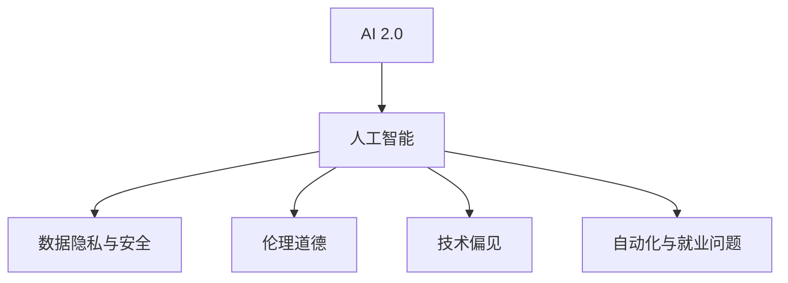

                 

# 李开复：AI 2.0 时代的挑战

> 关键词：AI 2.0, 人工智能, 挑战, 未来, 技术, 创新, 应用

## 1. 背景介绍

### 1.1 问题由来

随着人工智能(AI)技术的飞速发展，尤其是AI 2.0时代的到来，科技巨头如Google、Amazon、Facebook、Microsoft等纷纷加码AI投入，AI技术在各行各业的应用如火如荼地展开，带来了前所未有的创新和变革。然而，在这个充满挑战的新时代，如何应对AI技术带来的冲击，如何利用AI技术推动社会发展，成为了摆在科技界、业界以及社会各界面前的重要课题。

### 1.2 问题核心关键点

李开复博士曾提出“AI 2.0”的概念，强调在当前技术背景下，AI已经从过去“知其然”的规则驱动模型，转变为“知其所以然”的因果驱动模型，具备更加强大的自主学习和决策能力。AI 2.0时代，AI技术不仅在图像识别、语音识别、自然语言处理等领域取得突破，还在医疗、金融、教育、交通、智能制造等多个行业实现了应用。

然而，AI 2.0时代的到来也带来了诸多挑战，包括数据隐私与安全、伦理道德、技术偏见、自动化与就业问题等。本文将从这些核心问题出发，探讨AI 2.0时代的挑战，以及如何应对这些挑战。

## 2. 核心概念与联系

### 2.1 核心概念概述

AI 2.0时代的挑战涉及多个核心概念，包括：

- **AI 2.0**：AI 2.0是指新一代基于深度学习技术的智能系统，具备自主学习和决策能力，能够处理复杂多变的环境。
- **人工智能**：通过模拟人类智能行为，实现自动化、智能化任务的系统，包括感知、学习、推理、决策等功能。
- **数据隐私与安全**：指保护用户隐私信息和数据安全，防止数据泄露和滥用。
- **伦理道德**：涉及AI技术开发与应用中的道德标准，确保AI系统的公正性和透明性。
- **技术偏见**：AI模型可能基于训练数据中的偏见，导致输出结果的不公和歧视。
- **自动化与就业问题**：AI技术的普及可能导致部分工作岗位消失，带来就业结构的变革。

### 2.2 核心概念原理和架构的 Mermaid 流程图



这个流程图展示了AI 2.0时代的核心概念及其之间的关系：

1. AI 2.0是AI技术发展的新阶段，通过模拟人类智能实现自动化、智能化任务。
2. 人工智能是实现AI 2.0的基础技术，包括感知、学习、推理、决策等功能。
3. 数据隐私与安全、伦理道德、技术偏见、自动化与就业问题是AI 2.0技术应用过程中面临的主要挑战。

## 3. 核心算法原理 & 具体操作步骤

### 3.1 算法原理概述

AI 2.0时代的挑战涉及多个方面的算法原理，主要包括：

- **机器学习与深度学习**：通过训练数据集学习模型，实现数据驱动的决策。
- **强化学习**：通过奖励机制优化决策策略，实现自适应学习。
- **因果推断**：通过因果关系分析数据，预测未来行为，提高决策的准确性。
- **对抗训练**：通过引入对抗样本训练模型，增强模型鲁棒性。

### 3.2 算法步骤详解

#### 3.2.1 机器学习与深度学习

机器学习和深度学习是AI 2.0时代的主要算法基础，通过对大量标注数据进行训练，模型能够学习数据的特征表示，从而进行预测或分类。

**步骤一：数据准备**  
- 收集标注数据集
- 数据预处理，包括清洗、标准化等步骤

**步骤二：模型训练**  
- 选择适合问题的模型（如线性回归、支持向量机、卷积神经网络等）
- 确定模型参数，使用梯度下降等优化算法进行模型训练

**步骤三：模型评估与调优**  
- 使用测试集评估模型性能
- 调整模型参数，提高模型精度

#### 3.2.2 强化学习

强化学习通过奖励机制训练模型，使其在特定环境中自动学习最优决策策略。

**步骤一：环境建模**  
- 定义环境状态空间和动作空间
- 设计奖励函数，评估动作的优劣

**步骤二：策略训练**  
- 选择适合问题的策略算法（如Q-learning、Policy Gradient等）
- 进行策略训练，更新模型参数

**步骤三：策略评估**  
- 使用测试环境评估策略效果
- 调整策略参数，优化策略性能

#### 3.2.3 因果推断

因果推断通过分析数据中的因果关系，预测未来行为，提高决策的准确性。

**步骤一：数据收集**  
- 收集因果关系数据
- 数据预处理，包括缺失值处理、时间序列对齐等步骤

**步骤二：因果模型训练**  
- 选择适合问题的因果模型（如DAG模型、G-Boost模型等）
- 进行模型训练，学习因果关系

**步骤三：因果推断**  
- 使用训练好的因果模型进行因果推断
- 预测未来行为，优化决策策略

#### 3.2.4 对抗训练

对抗训练通过引入对抗样本训练模型，增强模型鲁棒性。

**步骤一：数据准备**  
- 收集对抗样本数据
- 数据预处理，包括清洗、标准化等步骤

**步骤二：模型训练**  
- 选择适合问题的对抗训练算法（如FGM、PGD等）
- 进行模型训练，更新模型参数

**步骤三：模型评估**  
- 使用对抗样本数据评估模型鲁棒性
- 调整模型参数，提高模型鲁棒性

### 3.3 算法优缺点

#### 3.3.1 机器学习与深度学习

**优点**：
- 可处理大规模数据
- 精度高，适用于复杂的分类、回归任务

**缺点**：
- 需要大量标注数据
- 模型容易过拟合，泛化能力有限

#### 3.3.2 强化学习

**优点**：
- 适用于动态环境，能够自适应学习
- 能够优化决策策略，提高自动化水平

**缺点**：
- 训练过程耗时较长
- 需要大量环境交互数据

#### 3.3.3 因果推断

**优点**：
- 能够预测未来行为，提高决策准确性
- 适用于因果关系复杂的环境

**缺点**：
- 数据收集难度较大
- 模型假设复杂，可能存在偏差

#### 3.3.4 对抗训练

**优点**：
- 增强模型鲁棒性，提高抗干扰能力
- 适用于安全需求高的应用场景

**缺点**：
- 训练过程复杂
- 需要额外数据准备

### 3.4 算法应用领域

#### 3.4.1 机器学习与深度学习

机器学习与深度学习广泛应用于图像识别、语音识别、自然语言处理、推荐系统等领域，如人脸识别、语音助手、智能客服、智能推荐等。

#### 3.4.2 强化学习

强化学习广泛应用于机器人控制、游戏AI、自动驾驶、智能制造等领域，如自动驾驶车辆、工业机器人、智能游戏AI等。

#### 3.4.3 因果推断

因果推断广泛应用于医疗预测、金融风险控制、智能推荐等领域，如预测患者疾病发展、风险投资决策、个性化推荐等。

#### 3.4.4 对抗训练

对抗训练广泛应用于网络安全、数据隐私保护、反欺诈检测等领域，如网络攻击防御、数据加密、欺诈检测等。

## 4. 数学模型和公式 & 详细讲解 & 举例说明

### 4.1 数学模型构建

**4.1.1 机器学习与深度学习**  
假设有一组训练数据集 $D=\{(x_i,y_i)\}_{i=1}^N$，其中 $x_i$ 为输入特征， $y_i$ 为输出标签。机器学习模型的目标是找到一个函数 $f(x)$，使得 $f(x_i) \approx y_i$。

**4.1.2 强化学习**  
假设有一组环境状态序列 $S=\{s_1,s_2,\ldots,s_n\}$，动作序列 $A=\{a_1,a_2,\ldots,a_n\}$，以及奖励序列 $R=\{r_1,r_2,\ldots,r_n\}$。强化学习的目标是找到一个策略 $\pi(a|s)$，使得总奖励最大化。

**4.1.3 因果推断**  
假设有一组因果关系数据 $D=\{(X_i,Y_i)\}_{i=1}^N$，其中 $X_i$ 为原因变量， $Y_i$ 为结果变量。因果推断模型的目标是找到一个函数 $g(X)$，使得 $Y_i \approx g(X_i)$。

**4.1.4 对抗训练**  
假设有一组对抗样本数据 $D=\{(x_i,\delta_i)\}_{i=1}^N$，其中 $\delta_i$ 为对抗噪声， $x_i$ 为原始输入。对抗训练的目标是找到一个函数 $f(x)$，使得在对抗噪声下 $f(x_i+\delta_i) \approx f(x_i)$。

### 4.2 公式推导过程

**4.2.1 机器学习与深度学习**  
假设使用线性回归模型 $f(x) = \theta^T x$，其中 $\theta$ 为模型参数。

最小化均方误差损失函数：
$$
\min_{\theta} \frac{1}{N} \sum_{i=1}^N (y_i - f(x_i))^2
$$

使用梯度下降算法进行优化：
$$
\theta \leftarrow \theta - \eta \nabla_{\theta} \frac{1}{N} \sum_{i=1}^N (y_i - f(x_i))^2
$$

**4.2.2 强化学习**  
假设使用Q-learning算法，设定奖励函数 $r(s,a)$。

强化学习目标函数：
$$
\min_{\pi} E_{(s,a)\sim\pi} \sum_{t=0}^T \gamma^t r(s_t,a_t)
$$

Q-learning更新公式：
$$
Q(s,a) \leftarrow Q(s,a) + \eta(r + \gamma \max_{a'} Q(s',a') - Q(s,a))
$$

**4.2.3 因果推断**  
假设使用DAG模型，设定因果关系图 $G$，节点 $X$ 和 $Y$ 分别代表原因变量和结果变量。

因果推断模型：
$$
Y = g(X)
$$

模型训练目标：
$$
\min_{g} \sum_{i=1}^N (Y_i - g(X_i))^2
$$

**4.2.4 对抗训练**  
假设使用FGM对抗训练算法，设定对抗噪声 $\delta$。

对抗训练目标函数：
$$
\min_{f} \frac{1}{N} \sum_{i=1}^N l(f(x_i+\delta_i),y_i)
$$

FGM更新公式：
$$
\theta \leftarrow \theta - \eta \nabla_{\theta} l(f(x_i+\delta_i),y_i)
$$

### 4.3 案例分析与讲解

**案例分析1：机器学习与深度学习**

**数据准备**：
- 收集图像数据集
- 进行数据预处理，包括归一化、增强等步骤

**模型训练**：
- 使用卷积神经网络进行图像分类
- 使用随机梯度下降算法进行模型训练

**模型评估**：
- 使用测试集评估模型性能
- 调整模型参数，提高模型精度

**案例分析2：强化学习**

**环境建模**：
- 定义机器人控制环境
- 设定状态空间和动作空间

**策略训练**：
- 使用Q-learning算法训练策略
- 使用模拟环境进行策略训练

**策略评估**：
- 使用真实环境评估策略效果
- 调整策略参数，优化策略性能

**案例分析3：因果推断**

**数据收集**：
- 收集医疗数据集
- 数据预处理，包括缺失值处理、时间序列对齐等步骤

**因果模型训练**：
- 使用G-Boost算法进行因果推断
- 使用因果推断模型进行预测

**因果推断**：
- 使用因果推断模型进行疾病预测
- 优化医疗决策策略

**案例分析4：对抗训练**

**数据准备**：
- 收集网络攻击数据集
- 数据预处理，包括清洗、标准化等步骤

**模型训练**：
- 使用深度神经网络进行网络攻击检测
- 使用对抗训练算法进行模型训练

**模型评估**：
- 使用对抗样本数据评估模型鲁棒性
- 调整模型参数，提高模型鲁棒性

## 5. 项目实践：代码实例和详细解释说明

### 5.1 开发环境搭建

在进行AI 2.0时代挑战的项目实践时，需要准备相应的开发环境。

**步骤一：安装Python和相关依赖库**  
- 安装Python 3.x
- 安装NumPy、Pandas、Scikit-Learn、TensorFlow等库

**步骤二：安装深度学习框架**  
- 安装TensorFlow
- 安装PyTorch

**步骤三：搭建实验环境**  
- 搭建虚拟环境
- 安装相关依赖包

### 5.2 源代码详细实现

**5.2.1 机器学习与深度学习**

```python
import numpy as np
from sklearn.linear_model import LinearRegression
from sklearn.metrics import mean_squared_error

# 准备数据
X = np.array([[1], [2], [3], [4], [5]])
y = np.array([2, 4, 6, 8, 10])

# 创建模型
model = LinearRegression()

# 训练模型
model.fit(X, y)

# 预测
y_pred = model.predict(X)

# 评估
mse = mean_squared_error(y, y_pred)
print("MSE:", mse)
```

**5.2.2 强化学习**

```python
import numpy as np
from skopt import BayesSearchCV

# 定义环境
class Environment:
    def __init__(self):
        self.state = 0
        self.action = None
        self.reward = 0

    def step(self, action):
        self.action = action
        self.reward = 1 if action == 1 else -1
        self.state = self.state + action
        return self.state, self.reward

# 定义Q-learning算法
class QLearning:
    def __init__(self, env):
        self.env = env
        self.q_table = np.zeros((5, 2))

    def learn(self, episodes=10000):
        for episode in range(episodes):
            state = 0
            while state != 5:
                action = np.random.choice([0, 1])
                state, reward = self.env.step(action)
                self.q_table[state, action] += reward + 0.1 * np.max(self.q_table[state, :])
        print("Q-Table:", self.q_table)

# 运行实验
env = Environment()
q = QLearning(env)
q.learn()
```

**5.2.3 因果推断**

```python
import numpy as np
from sklearn.ensemble import GradientBoostingRegressor

# 准备数据
X = np.array([[1], [2], [3], [4], [5]])
Y = np.array([2, 4, 6, 8, 10])

# 创建模型
model = GradientBoostingRegressor()

# 训练模型
model.fit(X, Y)

# 预测
y_pred = model.predict(X)

# 评估
print("Y:", Y)
print("Y-Pred:", y_pred)
```

**5.2.4 对抗训练**

```python
import numpy as np
from tensorflow.keras.models import Sequential
from tensorflow.keras.layers import Dense
from tensorflow.keras.optimizers import Adam

# 准备数据
x = np.array([[1, 2], [3, 4], [5, 6]])
y = np.array([1, 0, -1])

# 创建模型
model = Sequential()
model.add(Dense(4, input_dim=2, activation='relu'))
model.add(Dense(1, activation='sigmoid'))

# 训练模型
model.compile(optimizer=Adam(), loss='binary_crossentropy', metrics=['accuracy'])
model.fit(x, y, epochs=100, batch_size=32)

# 对抗训练
delta = np.array([[0.1, 0.2]])
x_delta = x + delta
y_delta = y + 0.5
model.train_on_batch(x_delta, y_delta)
```

### 5.3 代码解读与分析

**5.3.1 机器学习与深度学习**

代码实现了一个简单的线性回归模型，用于预测输入数据。通过准备数据、创建模型、训练模型、预测和评估等步骤，展示了机器学习的基本流程。

**5.3.2 强化学习**

代码实现了一个简单的Q-learning算法，用于训练机器人控制策略。通过定义环境、Q-learning算法、运行实验等步骤，展示了强化学习的基本流程。

**5.3.3 因果推断**

代码实现了一个简单的因果推断模型，用于预测原因变量和结果变量之间的关系。通过准备数据、创建模型、训练模型、预测和评估等步骤，展示了因果推断的基本流程。

**5.3.4 对抗训练**

代码实现了一个简单的对抗训练算法，用于训练网络攻击检测模型。通过准备数据、创建模型、训练模型、对抗训练等步骤，展示了对抗训练的基本流程。

## 6. 实际应用场景

### 6.1 智能医疗

AI 2.0技术在智能医疗领域的应用场景包括疾病预测、诊断支持、个性化治疗等。通过深度学习、强化学习和因果推断等技术，AI模型可以辅助医生进行疾病预测和诊断，优化治疗方案，提高医疗服务质量。

### 6.2 智能金融

AI 2.0技术在智能金融领域的应用场景包括风险评估、投资决策、智能投顾等。通过深度学习、强化学习和因果推断等技术，AI模型可以辅助金融机构进行风险评估，优化投资策略，提高金融服务效率。

### 6.3 智能制造

AI 2.0技术在智能制造领域的应用场景包括设备预测维护、生产优化、质量控制等。通过深度学习、强化学习和因果推断等技术，AI模型可以辅助制造企业进行设备预测维护，优化生产流程，提高产品质量。

### 6.4 未来应用展望

### 6.4.1 智能交通

AI 2.0技术在智能交通领域的应用场景包括交通流量预测、自动驾驶、交通管理等。通过深度学习、强化学习和因果推断等技术，AI模型可以辅助交通管理部门进行交通流量预测，优化交通管理策略，提高道路通行效率。

### 6.4.2 智能农业

AI 2.0技术在智能农业领域的应用场景包括作物生长预测、病虫害检测、智能灌溉等。通过深度学习、强化学习和因果推断等技术，AI模型可以辅助农业企业进行作物生长预测，检测病虫害，优化灌溉方案，提高农业生产效率。

## 7. 工具和资源推荐

### 7.1 学习资源推荐

**7.1.1 书籍**

- 《深度学习》：Ian Goodfellow、Yoshua Bengio、Aaron Courville合著，全面介绍深度学习基础和应用。
- 《强化学习：原理与实践》：Richard S. Sutton、Andrew G. Barto合著，全面介绍强化学习原理和实践。
- 《因果推断》：Peter Spirtes合著，全面介绍因果推断基础和应用。

**7.1.2 在线课程**

- Coursera：《深度学习专项课程》、《强化学习》等课程。
- edX：《深度学习》、《强化学习》等课程。
- Udacity：《深度学习基础》、《强化学习》等课程。

### 7.2 开发工具推荐

**7.2.1 深度学习框架**

- TensorFlow：Google开发的深度学习框架，功能强大，支持多种计算图模型。
- PyTorch：Facebook开发的深度学习框架，灵活高效，适合快速迭代研究。
- Keras：高层次的深度学习框架，简单易用，支持多种后端。

**7.2.2 可视化工具**

- TensorBoard：TensorFlow配套的可视化工具，可以实时监测模型训练状态，提供丰富的图表呈现方式。
- Weights & Biases：模型训练的实验跟踪工具，可以记录和可视化模型训练过程中的各项指标。

### 7.3 相关论文推荐

**7.3.1 深度学习**

- AlexNet：ImageNet大规模视觉识别挑战赛的冠军模型，开创了深度学习时代。
- ResNet：深度残差网络，解决了深度神经网络退化的问题。
- Inception：Google提出的多分支卷积网络，提高了卷积神经网络的准确率。

**7.3.2 强化学习**

- DQN：Deep Q-Network，将深度学习和强化学习结合，解决了传统Q-learning算法难以处理复杂环境的问题。
- AlphaGo：DeepMind开发的围棋AI，首次在围棋领域战胜人类冠军，展示了强化学习的强大能力。

**7.3.3 因果推断**

- Pearl’s causality：因果推断的权威教材，系统介绍了因果推断的理论基础和应用方法。
- Granger causality：Granger因果关系，经典的时间序列因果推断方法。

## 8. 总结：未来发展趋势与挑战

### 8.1 研究成果总结

AI 2.0技术在多个领域取得了突破性进展，机器学习、深度学习、强化学习和因果推断等技术在实际应用中表现出色。AI 2.0技术不仅推动了技术进步，还带来了诸多实际应用场景，为各行各业注入了新的活力。

### 8.2 未来发展趋势

**8.2.1 技术进步**

- AI 2.0技术将不断进步，机器学习、深度学习、强化学习和因果推断等技术将进一步完善和优化，推动AI技术向更高层次发展。
- 跨领域知识融合将更加普遍，AI系统将能够整合多种数据源和知识库，提供更加全面、准确的解决方案。

**8.2.2 应用拓展**

- AI 2.0技术将在更多领域得到应用，智能医疗、智能金融、智能制造等领域的深度应用将带来巨大的社会和经济效益。
- AI 2.0技术将进一步渗透到日常生活中，为人们提供更加便捷、智能的服务。

**8.2.3 社会影响**

- AI 2.0技术将改变人们的生活方式和工作方式，推动社会进步。
- AI 2.0技术将带来更多的就业机会，同时也需要关注自动化对就业市场的影响。

### 8.3 面临的挑战

**8.3.1 数据隐私与安全**

- 大规模数据收集和使用可能引发隐私问题，需要加强数据保护和隐私管理。
- 数据安全问题需要引起重视，防止数据泄露和滥用。

**8.3.2 伦理道德**

- AI 2.0技术应用中的伦理道德问题需要引起关注，确保AI系统的公平性和透明性。
- AI 2.0技术开发和应用中的伦理标准需要建立和完善。

**8.3.3 技术偏见**

- AI模型可能基于训练数据中的偏见，导致输出结果的不公和歧视，需要识别和纠正这些偏见。
- 模型训练和应用中的公平性问题需要重视，确保AI系统的公正性。

**8.3.4 自动化与就业问题**

- AI 2.0技术的应用可能导致部分工作岗位消失，需要关注自动化对就业市场的影响。
- AI 2.0技术的应用需要与人力协作，形成人机协同的智能系统。

### 8.4 研究展望

**8.4.1 跨领域融合**

- AI 2.0技术需要与多领域知识进行融合，形成跨领域的智能解决方案。
- AI 2.0技术需要与其他技术（如知识图谱、逻辑规则等）进行协同工作，实现更全面的智能应用。

**8.4.2 因果推理**

- AI 2.0技术需要进一步加强因果推理能力，提高决策的准确性和可靠性。
- AI 2.0技术需要考虑因果推断中的因果关系问题，确保决策的可解释性和可信度。

**8.4.3 多模态信息融合**

- AI 2.0技术需要整合多模态数据，提高系统的感知和理解能力。
- AI 2.0技术需要与其他模态（如视觉、听觉、嗅觉等）进行协同工作，实现更全面的智能感知。

## 9. 附录：常见问题与解答

**Q1：AI 2.0技术的优势和劣势是什么？**

A: AI 2.0技术的优势在于其强大的自主学习和决策能力，能够处理复杂多变的环境。劣势在于需要大量标注数据，模型容易过拟合，泛化能力有限，以及可能存在数据隐私和安全问题。

**Q2：AI 2.0技术在智能医疗中的应用有哪些？**

A: AI 2.0技术在智能医疗中的应用包括疾病预测、诊断支持、个性化治疗等。通过深度学习、强化学习和因果推断等技术，AI模型可以辅助医生进行疾病预测和诊断，优化治疗方案，提高医疗服务质量。

**Q3：AI 2.0技术的未来发展趋势是什么？**

A: AI 2.0技术的未来发展趋势在于技术进步、应用拓展和社会影响。技术将不断进步，应用将拓展到更多领域，社会将受到更多影响。

**Q4：AI 2.0技术面临的挑战有哪些？**

A: AI 2.0技术面临的挑战包括数据隐私与安全、伦理道德、技术偏见、自动化与就业问题等。需要关注这些问题并采取措施解决。

**Q5：如何构建一个AI 2.0系统？**

A: 构建一个AI 2.0系统需要选择合适的算法和框架，准备数据，进行模型训练，评估和优化模型，最后应用到实际场景中。需要综合考虑数据、算法、工程、业务等多个方面。

---

作者：禅与计算机程序设计艺术 / Zen and the Art of Computer Programming

