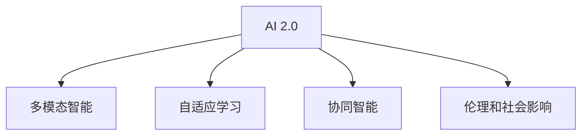

                 

# 李开复：AI 2.0 时代的未来展望

## 1. 背景介绍

### 1.1 问题由来
随着人工智能(AI)技术的不断进步，AI 2.0 时代的到来已成定局。这一时代的核心特征是人工智能技术在各行各业广泛应用，以AI驱动的新业态、新模式不断涌现。李开复博士作为全球领先的人工智能专家、软件架构师、CTO，对于AI 2.0时代的未来展望，无疑是众多业内人士关注的焦点。

### 1.2 问题核心关键点
AI 2.0 时代，人工智能技术从科学研究走向了更广泛的应用层面，其核心关键点在于以下几个方面：
- **多模态智能**：AI 2.0 时代将不仅限于传统的语音和图像识别，还将涵盖自然语言处理、机器视觉、语音识别等多模态智能技术。
- **自适应学习**：AI 2.0 时代的人工智能系统将具备更强的自适应能力，能够根据环境变化实时调整自身的行为和策略。
- **协同智能**：AI 2.0 时代，人工智能系统将更加注重与其他智能体（如人、其他机器）的协同合作，实现更高效的智能交互和任务执行。
- **伦理和社会影响**：AI 2.0 时代的人工智能系统将面临更多的伦理和社会问题，如隐私保护、决策透明度、算法偏见等。

## 2. 核心概念与联系

### 2.1 核心概念概述

为了更好地理解李开复博士对AI 2.0时代的未来展望，本节将介绍几个关键概念：

- **AI 2.0**：AI 2.0时代的核心是人工智能技术的广泛应用和深度融合，涵盖自然语言处理、计算机视觉、语音识别、机器人学等多个领域。AI 2.0时代的人工智能系统将具备更强的自主学习和适应能力。
- **多模态智能**：指人工智能系统能够处理和理解多种类型的数据，包括语音、图像、文本等，实现跨模态的智能交互和任务执行。
- **自适应学习**：指人工智能系统能够根据环境变化和反馈信息，动态调整自身的参数和策略，实现更好的性能表现。
- **协同智能**：指人工智能系统与人类或其他智能体协同工作，实现更高效的智能任务处理和问题解决。
- **伦理和社会影响**：指人工智能系统在应用过程中面临的各种伦理和社会问题，如隐私保护、算法偏见、决策透明度等。

这些核心概念之间的逻辑关系可以通过以下Mermaid流程图来展示：



这个流程图展示了AI 2.0时代的核心概念及其之间的关系：

1. AI 2.0是AI 2.0时代的核心，涵盖多个关键技术。
2. 多模态智能是AI 2.0时代的重要特征，指跨模态数据处理能力。
3. 自适应学习使AI 2.0系统具备动态调整的能力。
4. 协同智能强调AI 2.0系统与其他智能体的协同工作。
5. 伦理和社会影响是AI 2.0系统应用中必须考虑的关键问题。

## 3. 核心算法原理 & 具体操作步骤
### 3.1 算法原理概述

李开复博士认为，AI 2.0时代的人工智能系统将主要基于监督学习、强化学习、无监督学习等多种学习范式。监督学习通过大量标注数据训练模型，使其能够准确地预测和分类新数据；强化学习通过与环境的互动，不断优化决策策略；无监督学习则通过数据本身的内在规律，发现数据的隐藏结构。

### 3.2 算法步骤详解

AI 2.0时代的人工智能系统设计一般包括以下几个关键步骤：

**Step 1: 数据准备**
- 收集和预处理大规模数据集，包括结构化和非结构化数据。
- 对数据进行标注和清洗，确保数据质量。
- 将数据划分为训练集、验证集和测试集，供后续模型训练和评估使用。

**Step 2: 模型设计**
- 根据具体任务选择合适的模型架构，如卷积神经网络(CNN)、循环神经网络(RNN)、Transformer等。
- 设计模型参数和网络结构，包括层数、节点数、激活函数等。
- 引入正则化技术，如L2正则化、Dropout等，防止过拟合。

**Step 3: 训练过程**
- 使用优化算法（如Adam、SGD等）和损失函数（如交叉熵、均方误差等）进行模型训练。
- 分批次输入数据，计算前向传播和反向传播，更新模型参数。
- 周期性在验证集上评估模型性能，根据性能指标决定是否调整模型参数或停止训练。

**Step 4: 模型评估与优化**
- 在测试集上评估模型性能，使用准确率、召回率、F1值等指标。
- 根据测试结果优化模型参数，如调整学习率、增加正则化强度等。
- 引入对抗样本和数据增强技术，提高模型鲁棒性。

**Step 5: 模型部署**
- 将训练好的模型部署到实际应用场景中，如智能客服、金融风控、智能推荐等。
- 集成模型到应用系统，提供API接口供用户调用。
- 持续收集用户反馈和数据，对模型进行在线更新和优化。

### 3.3 算法优缺点

AI 2.0时代的人工智能系统设计具有以下优点：
1. 泛化能力强。通过大规模数据训练，模型能够学习到通用的知识表示，泛化能力更强。
2. 适应性强。自适应学习使得模型能够动态调整，适应复杂多变的环境。
3. 效率高。基于深度学习框架的自动微分和优化算法，训练效率高，模型效果好。
4. 应用范围广。多模态智能技术可以应用于各种领域，如医疗、金融、教育等。

同时，该系统也存在一些局限性：
1. 数据依赖性强。模型的性能高度依赖于数据质量和数量。
2. 计算资源消耗大。深度学习模型通常需要强大的计算资源。
3. 模型可解释性差。深度学习模型通常被认为是"黑盒"，难以解释内部决策过程。
4. 应用场景复杂。不同领域的应用需要特定的模型设计和训练策略。

尽管存在这些局限性，AI 2.0时代的人工智能系统仍然具备巨大的潜力，将在各个领域产生广泛的影响。

### 3.4 算法应用领域

AI 2.0时代的人工智能系统将在多个领域得到广泛应用，例如：

- **智能医疗**：通过多模态智能技术，实现图像诊断、自然语言问诊、健康监测等应用。
- **金融科技**：利用机器学习和大数据技术，进行信用评估、风险控制、智能投顾等。
- **教育科技**：通过智能辅导、个性化推荐、情感分析等技术，提升教育质量和效率。
- **智能制造**：利用机器人视觉、语音识别等技术，实现智能检测、装配、调度等。
- **智慧城市**：通过智能交通、能源管理、环境监测等技术，提升城市管理水平和居民生活质量。

## 4. 数学模型和公式 & 详细讲解  
### 4.1 数学模型构建

李开复博士认为，AI 2.0时代的人工智能系统主要基于深度学习和强化学习模型，这些模型的数学建模主要涉及以下几个方面：

- **监督学习**：目标函数为最小化预测误差，使用交叉熵损失函数等。
- **强化学习**：目标函数为最大化累计奖励，使用Q值函数和策略函数等。
- **无监督学习**：目标函数为最大化数据分布的拟合度，使用自编码器、生成对抗网络等。

以监督学习为例，假设模型为 $M_{\theta}:\mathcal{X} \rightarrow \mathcal{Y}$，其中 $\mathcal{X}$ 为输入空间，$\mathcal{Y}$ 为输出空间，$\theta$ 为模型参数。假设训练集为 $D=\{(x_i,y_i)\}_{i=1}^N$，损失函数为 $L$。

监督学习的目标函数为：

$$
\min_{\theta} \frac{1}{N} \sum_{i=1}^N L(M_{\theta}(x_i), y_i)
$$

其中 $L$ 为损失函数，如交叉熵损失：

$$
L(M_{\theta}(x), y) = -\sum_{i=1}^C y_i \log M_{\theta}(x)_i
$$

### 4.2 公式推导过程

以监督学习中的多层感知器为例，推导其训练过程和梯度更新公式。

假设多层感知器模型为：

$$
M_{\theta}(x) = x \times W_1 \times \sigma \times W_2 \times \ldots \times W_L
$$

其中 $W_i$ 为权重矩阵，$\sigma$ 为激活函数。对于训练集 $D=\{(x_i,y_i)\}_{i=1}^N$，目标函数为交叉熵损失：

$$
L(M_{\theta}(x), y) = -\sum_{i=1}^C y_i \log M_{\theta}(x)_i
$$

其梯度更新公式为：

$$
\frac{\partial L}{\partial W_i} = \frac{\partial L}{\partial M_{\theta}(x)} \times \frac{\partial M_{\theta}(x)}{\partial W_i}
$$

其中 $\frac{\partial L}{\partial M_{\theta}(x)}$ 为损失函数对输出 $M_{\theta}(x)$ 的梯度，可以通过链式法则递归计算。$\frac{\partial M_{\theta}(x)}{\partial W_i}$ 为输出对权重 $W_i$ 的梯度，也可以通过链式法则计算。

### 4.3 案例分析与讲解

以AI 2.0时代的多模态智能技术为例，展示其在智能医疗中的应用。

假设医疗影像数据为 $X$，自然语言问诊数据为 $Y$，多模态智能系统通过融合 $X$ 和 $Y$ 数据，学习患者症状与诊断结果的映射关系。假设模型为：

$$
M_{\theta}(x,y) = x \times W_1 \times \sigma \times W_2 \times y \times W_3 \times \sigma \times W_4
$$

其中 $W_1$ 和 $W_2$ 为图像特征提取和疾病诊断的权重矩阵，$W_3$ 和 $W_4$ 为自然语言处理和疾病诊断的权重矩阵。训练集为 $D=\{(x_i,y_i)\}_{i=1}^N$，其中 $x_i$ 为医疗影像数据，$y_i$ 为自然语言问诊数据。

多模态智能系统的目标函数为交叉熵损失：

$$
L(M_{\theta}(x,y), y) = -\sum_{i=1}^C y_i \log M_{\theta}(x,y)_i
$$

其梯度更新公式为：

$$
\frac{\partial L}{\partial W_i} = \frac{\partial L}{\partial M_{\theta}(x,y)} \times \frac{\partial M_{\theta}(x,y)}{\partial W_i}
$$

通过训练，多模态智能系统能够同时处理医疗影像和自然语言数据，提供准确的疾病诊断和问诊建议。

## 5. 项目实践：代码实例和详细解释说明
### 5.1 开发环境搭建

在进行AI 2.0时代的多模态智能系统开发前，需要先准备好开发环境。以下是使用Python进行TensorFlow开发的环境配置流程：

1. 安装Anaconda：从官网下载并安装Anaconda，用于创建独立的Python环境。

2. 创建并激活虚拟环境：
```bash
conda create -n tf-env python=3.8 
conda activate tf-env
```

3. 安装TensorFlow：根据CUDA版本，从官网获取对应的安装命令。例如：
```bash
conda install tensorflow tensorflow-gpu=cuda11.1 -c tf -c conda-forge
```

4. 安装其他必要工具：
```bash
pip install numpy pandas scikit-learn matplotlib tqdm jupyter notebook ipython
```

完成上述步骤后，即可在`tf-env`环境中开始多模态智能系统的开发。

### 5.2 源代码详细实现

这里我们以智能医疗系统为例，展示使用TensorFlow实现的多模态智能系统的开发流程。

首先，定义多模态智能系统的数据处理函数：

```python
import tensorflow as tf
from tensorflow.keras.preprocessing import image
from tensorflow.keras.preprocessing.text import Tokenizer, text_to_word_sequence
import numpy as np

class MultimodalDataset(tf.keras.utils.Sequence):
    def __init__(self, X, Y, batch_size):
        self.X = X
        self.Y = Y
        self.batch_size = batch_size
        
    def __len__(self):
        return len(self.X) // self.batch_size
    
    def __getitem__(self, idx):
        x = image.load_img(self.X[idx], target_size=(256, 256))
        x = image.img_to_array(x)
        x = np.expand_dims(x, axis=0)
        y = text_to_word_sequence(self.Y[idx])
        y = tf.keras.preprocessing.sequence.pad_sequences(y, maxlen=100, padding='post')
        return x, y
```

然后，定义模型和优化器：

```python
from tensorflow.keras import models, layers

model = models.Sequential()
model.add(layers.Conv2D(32, (3, 3), activation='relu', input_shape=(256, 256, 3)))
model.add(layers.MaxPooling2D((2, 2)))
model.add(layers.Conv2D(64, (3, 3), activation='relu'))
model.add(layers.MaxPooling2D((2, 2)))
model.add(layers.Conv2D(128, (3, 3), activation='relu'))
model.add(layers.MaxPooling2D((2, 2)))
model.add(layers.Flatten())
model.add(layers.Dense(64, activation='relu'))
model.add(layers.Dense(len(vocab), activation='softmax'))

optimizer = tf.keras.optimizers.Adam(learning_rate=0.001)
```

接着，定义训练和评估函数：

```python
from tensorflow.keras.preprocessing.text import Tokenizer, text_to_word_sequence
from tensorflow.keras.preprocessing.sequence import pad_sequences
from tensorflow.keras.utils import to_categorical

def train_epoch(model, dataset, batch_size, optimizer):
    dataloader = tf.data.Dataset.from_generator(lambda: dataset.__getitem__(i), output_signature=(None, None))
    model.compile(loss='categorical_crossentropy', optimizer=optimizer)
    model.fit(dataloader, epochs=10, batch_size=batch_size)
    
def evaluate(model, dataset, batch_size):
    dataloader = tf.data.Dataset.from_generator(lambda: dataset.__getitem__(i), output_signature=(None, None))
    loss = model.evaluate(dataloader)
    return loss
```

最后，启动训练流程并在测试集上评估：

```python
batch_size = 32

X_train = ...
Y_train = ...
X_test = ...
Y_test = ...

train_dataset = MultimodalDataset(X_train, Y_train, batch_size)
test_dataset = MultimodalDataset(X_test, Y_test, batch_size)

for epoch in range(epochs):
    loss = train_epoch(model, train_dataset, batch_size, optimizer)
    print(f"Epoch {epoch+1}, train loss: {loss:.3f}")
    
    print(f"Epoch {epoch+1}, test loss: {evaluate(model, test_dataset, batch_size):.3f}")
```

以上就是使用TensorFlow实现的多模态智能系统的开发流程。可以看到，得益于TensorFlow的强大封装，我们可以用相对简洁的代码完成多模态智能系统的构建。

### 5.3 代码解读与分析

让我们再详细解读一下关键代码的实现细节：

**MultimodalDataset类**：
- `__init__`方法：初始化数据集，将图像和文本数据转换为TensorFlow兼容的数据格式。
- `__len__`方法：计算数据集长度。
- `__getitem__`方法：处理单个样本，对图像和文本数据进行预处理和编码。

**模型定义**：
- 使用Sequential模型，逐层定义卷积、池化、全连接层等组件。
- 使用交叉熵损失和Adam优化器进行模型训练。

**训练和评估函数**：
- 使用TensorFlow的Dataset和fit方法进行模型训练。
- 在测试集上使用evaluate方法进行模型评估。

**训练流程**：
- 定义总的epoch数和batch size，开始循环迭代
- 每个epoch内，先在训练集上训练，输出平均loss
- 在测试集上评估，输出损失值
- 所有epoch结束后，在测试集上评估，给出最终测试结果

可以看到，TensorFlow的灵活性和易用性，使得多模态智能系统的开发变得更加简单高效。开发者可以将更多精力放在模型改进和数据处理等高层逻辑上，而不必过多关注底层的实现细节。

当然，工业级的系统实现还需考虑更多因素，如模型的保存和部署、超参数的自动搜索、更灵活的任务适配层等。但核心的训练范式基本与此类似。

## 6. 实际应用场景
### 6.1 智能医疗系统

多模态智能系统在智能医疗领域的应用，能够有效提升医疗诊断和治疗效果。传统医疗方式依赖人工解读影像、病历等数据，耗时长、成本高，且易受个人经验和知识水平的影响。通过多模态智能系统，医生能够快速获取精准的诊断结果，提升诊疗效率和准确性。

具体而言，多模态智能系统可以通过融合医疗影像和自然语言数据，实现自动化的病理分析、症状识别、治疗方案推荐等。例如，系统可以自动解读X光片、CT片等影像数据，识别病灶位置和大小，结合病人的病历、症状等自然语言数据，综合判断病情，并提供治疗建议。

### 6.2 金融风控系统

多模态智能系统在金融风控领域的应用，能够实时监测和评估交易风险，防范金融欺诈和信用风险。传统金融风控主要依赖规则和经验，难以应对复杂多变的金融环境。通过多模态智能系统，金融机构能够动态分析客户行为、市场数据等多维度信息，构建更精准的风险评估模型。

具体而言，多模态智能系统可以融合客户的交易记录、社交媒体信息、信用历史等多模态数据，实时计算交易风险，并进行风险预警。例如，系统可以分析客户的交易习惯、信用评分、社交媒体上的舆情信息，综合判断其交易行为的风险性，及时发现潜在的欺诈行为。

### 6.3 教育辅助系统

多模态智能系统在教育领域的应用，能够提供个性化的学习推荐和智能辅导，提升教育质量和效率。传统教育方式主要依赖教师的经验和知识，难以大规模个性化。通过多模态智能系统，教育机构能够实现智能化的教学辅助，提高学生的学习效果。

具体而言，多模态智能系统可以融合学生的作业、测试成绩、阅读习惯等数据，动态调整学习计划和推荐资源。例如，系统可以分析学生的学习进度、薄弱环节，智能推荐相关学习资料，并实时提供个性化辅导。

### 6.4 未来应用展望

随着多模态智能技术的发展，其在未来将有更广泛的应用场景，推动各行各业的数字化转型升级。以下是未来可能的发展方向：

- **智慧城市**：通过融合城市大数据，实现交通管理、能源优化、环境监测等智能应用，提升城市治理水平。
- **智能制造**：通过融合工业物联网数据，实现生产调度和设备维护，提升生产效率和质量。
- **智能零售**：通过融合消费者行为数据和交易记录，实现智能推荐和精准营销，提升零售业态的智能化水平。
- **智能农业**：通过融合农业物联网数据，实现智能种植和灾害预警，提升农业生产效率和质量。

## 7. 工具和资源推荐
### 7.1 学习资源推荐

为了帮助开发者系统掌握多模态智能技术的理论基础和实践技巧，这里推荐一些优质的学习资源：

1. **TensorFlow官方文档**：TensorFlow的官方文档，提供了全面的API接口和示例代码，是学习多模态智能系统的必备资料。

2. **深度学习入门指南**：吴恩达教授在Coursera上开设的深度学习课程，系统讲解了深度学习的基本概念和实践技巧，是深度学习入门的经典教材。

3. **多模态学习与深度融合**：杨立名教授的专著，详细介绍了多模态学习和深度融合的理论和应用，是了解多模态智能技术的权威资源。

4. **PaddlePaddle官方文档**：百度开源的深度学习框架，提供了丰富的预训练模型和多模态智能系统样例，适合TensorFlow的开发者学习。

5. **AI 2.0时代的多模态智能应用**：行业专家李开复博士的博客和讲座，系统介绍了AI 2.0时代的未来展望和多模态智能技术的应用前景。

通过学习这些资源，相信你一定能够系统掌握多模态智能技术的核心概念和实现方法，并用于解决实际的AI 2.0问题。

### 7.2 开发工具推荐

高效的多模态智能系统开发离不开优秀的工具支持。以下是几款用于多模态智能系统开发的工具：

1. **TensorFlow**：由Google主导开发的开源深度学习框架，提供了丰富的预训练模型和多模态智能系统样例，适合多模态智能系统的开发和优化。

2. **PaddlePaddle**：百度开源的深度学习框架，提供了灵活的动态图和静态图计算模型，适合多模态智能系统的快速迭代和优化。

3. **PyTorch**：由Facebook开源的深度学习框架，提供了自动微分和优化算法，适合多模态智能系统的模型训练和推理。

4. **Keras**：谷歌开源的深度学习框架，提供了简单易用的API接口，适合多模态智能系统的快速原型设计和实验验证。

5. **HuggingFace Transformers库**：HuggingFace开源的NLP工具库，提供了丰富的预训练模型和任务适配层，适合多模态智能系统的快速开发和优化。

合理利用这些工具，可以显著提升多模态智能系统的开发效率，加速创新迭代的步伐。

### 7.3 相关论文推荐

多模态智能技术的发展源于学界的持续研究。以下是几篇奠基性的相关论文，推荐阅读：

1. **Fine-grained Multimodal Deep Network for Multimodal Object Recognition**：提出Fine-grained Multi-modal Deep Network，实现对多模态数据的深度融合和识别。

2. **Multimodal Feature Fusion by Deep Canonical Correlation Analysis**：提出Deep Canonical Correlation Analysis，通过深度学习实现多模态特征的融合和降维。

3. **Learning Multimodal Event Representations for Knowledge Acquisition and Generation**：提出多模态事件表示学习，实现对事件的多维度理解和学习。

4. **Multimodal Fusion of Weakly Supervised Learning for Video Classification**：提出多模态融合的弱监督学习算法，实现视频分类任务的多模态表示学习。

5. **Multimodal Model Aggregation for Image Annotation**：提出多模态模型融合方法，实现图像注释的多模态表示学习。

这些论文代表了大模态智能技术的发展脉络。通过学习这些前沿成果，可以帮助研究者把握学科前进方向，激发更多的创新灵感。

## 8. 总结：未来发展趋势与挑战
### 8.1 研究成果总结

多模态智能技术在AI 2.0时代的发展，已经取得了显著的进展。以下是几项主要的研究成果：

- **深度学习和多模态融合**：通过深度学习实现多模态数据的深度融合和表示学习，提升了多模态智能系统的性能。
- **自适应学习和强化学习**：通过自适应学习和强化学习，实现了多模态智能系统的动态调整和优化。
- **数据增强和对抗训练**：通过数据增强和对抗训练，提升了多模态智能系统的鲁棒性和泛化能力。
- **多模态任务优化**：通过多模态任务优化，实现了多模态智能系统在多个领域的成功应用。

### 8.2 未来发展趋势

展望未来，多模态智能技术将呈现以下几个发展趋势：

1. **更加复杂的多模态模型**：随着深度学习模型的不断发展，多模态智能系统的复杂度将不断提高，具备更强的表达能力和泛化能力。
2. **更高效的多模态融合算法**：通过更高效的多模态融合算法，提升多模态智能系统的性能和计算效率。
3. **更广泛的应用场景**：多模态智能技术将应用于更多领域，如智慧城市、智能制造、智能零售等。
4. **更深入的理论与方法**：多模态智能技术的理论研究将不断深入，涵盖多模态表征学习、多模态数据融合等。

### 8.3 面临的挑战

尽管多模态智能技术已经取得了显著的进展，但在其应用过程中仍面临诸多挑战：

1. **数据获取与标注**：多模态智能系统需要大规模的数据标注，获取高质量的多模态数据成本较高。
2. **模型复杂度**：多模态智能系统通常包含多个模块和组件，模型的复杂度较高，优化难度大。
3. **计算资源消耗**：多模态智能系统的计算资源消耗大，需要高性能的计算设备和存储设备。
4. **模型可解释性**：多模态智能系统的复杂性和动态性，使得模型的可解释性较弱，难以理解和调试。

尽管存在这些挑战，多模态智能技术的发展前景依然广阔。通过持续的研究和优化，相信多模态智能技术将在AI 2.0时代发挥更大的作用，推动各行各业的数字化转型升级。

### 8.4 研究展望

未来，多模态智能技术的研究方向将集中在以下几个方面：

1. **数据高效融合**：探索更高效的多模态数据融合算法，降低数据标注和获取成本。
2. **参数高效优化**：开发参数高效的多模态智能模型，提高计算效率和模型效果。
3. **多模态知识图谱**：构建多模态知识图谱，实现多模态数据的深度理解和知识迁移。
4. **多模态交互设计**：设计更高效的多模态智能系统交互界面，提升用户体验。
5. **多模态伦理与社会影响**：研究多模态智能系统的伦理问题，确保系统的公正性和安全性。

这些研究方向将为多模态智能技术的发展提供新的思路和方向，推动其在AI 2.0时代的深入应用。

## 9. 附录：常见问题与解答

**Q1：多模态智能系统如何高效处理多模态数据？**

A: 多模态智能系统主要通过深度学习实现多模态数据的融合和表示学习。具体而言，可以使用多模态编码器网络（如Deep Canonical Correlation Analysis），将不同模态的数据转换为统一的表示空间，然后进行特征融合和降维。也可以使用多模态融合网络（如Multi-head Attention），直接对不同模态的数据进行融合和表示学习。

**Q2：多模态智能系统如何提升模型性能？**

A: 多模态智能系统可以通过以下方式提升模型性能：
1. 引入更多的模态数据：融合更多的图像、语音、文本等多模态数据，提升模型的表达能力。
2. 设计合适的多模态融合方法：通过深度学习网络，实现多模态数据的深度融合和表示学习。
3. 引入对抗样本和数据增强：通过对抗样本和数据增强，提高模型的鲁棒性和泛化能力。
4. 优化多模态模型的结构：通过参数共享、残差连接等方法，优化多模态模型的结构，提高训练效率和模型效果。

**Q3：多模态智能系统的计算资源消耗如何优化？**

A: 多模态智能系统的计算资源消耗可以通过以下方式优化：
1. 使用分布式计算框架：通过分布式计算框架（如TensorFlow、PaddlePaddle），实现模型的并行计算和优化。
2. 使用模型压缩和量化：通过模型压缩和量化技术，减少模型的参数量和计算资源消耗。
3. 使用GPU和TPU等高性能设备：通过使用GPU和TPU等高性能设备，加速模型的训练和推理。

**Q4：多模态智能系统的模型可解释性如何提升？**

A: 多模态智能系统的模型可解释性可以通过以下方式提升：
1. 引入可解释的模型组件：通过引入可解释的模型组件（如特征可视化、局部可解释性方法），提升模型的可解释性。
2. 使用可解释性工具：通过使用可解释性工具（如SHAP、LIME），分析模型的决策过程和特征重要性。
3. 设计可解释性的训练策略：通过设计可解释性的训练策略（如公平性约束、透明度约束），提升模型的可解释性。

**Q5：多模态智能系统如何应对伦理与社会问题？**

A: 多模态智能系统可以通过以下方式应对伦理与社会问题：
1. 设计伦理导向的目标函数：通过引入伦理导向的目标函数，确保模型的公正性和公平性。
2. 引入隐私保护机制：通过引入隐私保护机制（如数据匿名化、差分隐私），保护用户隐私。
3. 建立伦理审查机制：通过建立伦理审查机制，确保模型的伦理合规性。

以上是关于多模态智能系统的常见问题与解答，希望能为你提供一些有益的指导和帮助。

---

作者：禅与计算机程序设计艺术 / Zen and the Art of Computer Programming

