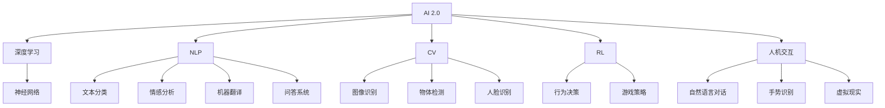

                 

# 李开复：AI 2.0 时代的科技价值

## 1. 背景介绍

### 1.1 问题由来

随着人工智能(AI)技术的飞速发展，我们正在进入一个新的时代——AI 2.0。在这个时代，AI 将不仅仅是一些复杂算法的堆砌，而是与人类智慧紧密结合，能够处理复杂决策、理解自然语言、创造艺术等高度智能任务的新一代AI系统。

AI 2.0 的提出，标志着AI 技术已经从最初的“专家系统”向更普适、更智能、更灵活的方向演进。它不仅能够解决特定领域的任务，还能够在大规模无标签数据上进行自我学习，提高自身的通用性和泛化能力。

### 1.2 问题核心关键点

AI 2.0 的核心关键点包括：

- **深度学习与神经网络**：是AI 2.0时代最重要的技术基础，通过复杂的深度神经网络结构，AI 可以处理大规模数据并从中学习到复杂的模式。

- **自然语言处理(NLP)**：是AI 2.0时代最具挑战性的任务之一，它涉及到对人类语言的高度理解和生成，是实现AI 2.0在自然交互、知识推理等领域应用的基础。

- **计算机视觉(CV)**：通过AI 算法和深度学习技术，AI 可以实现对图像和视频的自动分析和理解，为自动驾驶、安防监控、医疗影像分析等领域提供支持。

- **强化学习(RL)**：通过与环境的交互，AI 能够在不断的试错中优化策略，实现更智能的行为决策和游戏策略。

- **人机交互**：AI 2.0时代的AI系统不仅能够处理任务，还能与人类进行自然、流畅的交互，提升用户体验。

### 1.3 问题研究意义

研究AI 2.0时代的技术价值，对于推动AI技术的普及应用、提升各行各业的效率和智能化水平、以及探索AI与人类智慧的结合方式具有重要意义。AI 2.0 技术不仅可以解决传统行业中的难题，还能开辟新的应用场景，带来巨大的商业和社会价值。

## 2. 核心概念与联系

### 2.1 核心概念概述

为更好地理解AI 2.0时代的技术价值，本节将介绍几个关键概念：

- **AI 2.0**：指新一代AI技术，融合了深度学习、自然语言处理、计算机视觉、强化学习等多种技术，具有通用性、智能性、灵活性。

- **深度学习**：指通过多层次的神经网络模型，在大规模数据上训练，实现对复杂模式的学习。

- **神经网络**：指一种仿生学模型，通过节点（神经元）之间的连接权值调整，实现对输入数据的处理和输出。

- **自然语言处理(NLP)**：指计算机对人类语言进行理解和生成，包括文本分类、情感分析、机器翻译、问答系统等任务。

- **计算机视觉(CV)**：指通过计算机视觉技术，对图像和视频进行自动分析和理解，包括图像识别、物体检测、人脸识别等任务。

- **强化学习(RL)**：指通过与环境的交互，AI 能够在不断的试错中优化策略，实现更智能的行为决策和游戏策略。

- **人机交互**：指AI系统与人类之间的交互方式，包括自然语言对话、手势识别、虚拟现实等。

这些核心概念之间的逻辑关系可以通过以下Mermaid流程图来展示：



这个流程图展示了AI 2.0时代的关键技术及其应用场景，以及它们之间的相互关系。

## 3. 核心算法原理 & 具体操作步骤

### 3.1 算法原理概述

AI 2.0时代的关键算法原理主要包括以下几个方面：

- **深度学习算法**：通过多层神经网络结构，在大规模数据上进行训练，学习到复杂模式。
- **自然语言处理算法**：包括词向量模型、语言模型、序列标注模型、序列到序列模型等，用于文本处理、语言理解和生成。
- **计算机视觉算法**：包括卷积神经网络、循环神经网络、注意力机制等，用于图像处理、物体检测、图像分类等任务。
- **强化学习算法**：包括Q-learning、策略梯度、蒙特卡洛树搜索等，用于智能决策和游戏策略优化。

这些算法原理共同构成了AI 2.0时代的技术基础，使得AI 系统具备了高度智能和灵活性。

### 3.2 算法步骤详解

AI 2.0时代的算法步骤主要包括以下几个环节：

**Step 1: 数据准备**
- 收集、清洗、标注大量数据，包括文本、图像、视频等。
- 将数据划分为训练集、验证集和测试集。

**Step 2: 模型构建**
- 选择合适的深度学习框架，如TensorFlow、PyTorch等。
- 构建神经网络模型，包括但不限于卷积神经网络、循环神经网络、注意力机制等。
- 确定模型结构和超参数，如层数、节点数、激活函数、学习率等。

**Step 3: 模型训练**
- 使用训练集数据对模型进行迭代训练，优化损失函数。
- 定期在验证集上评估模型性能，调整超参数。
- 训练完成后在测试集上进行最终的性能评估。

**Step 4: 模型评估与优化**
- 使用测试集评估模型性能，如准确率、召回率、F1分数等。
- 根据评估结果对模型进行优化，如调整超参数、增加正则化等。

**Step 5: 部署与应用**
- 将训练好的模型部署到生产环境中，进行实时推理和预测。
- 持续收集新数据，进行模型的定期更新和优化。

### 3.3 算法优缺点

AI 2.0时代的算法具有以下优点：

- **高性能**：通过深度学习和大规模数据训练，AI 系统能够处理复杂任务，实现高精度预测。
- **通用性**：神经网络模型能够处理多种类型的数据，包括文本、图像、视频等，具有较强的泛化能力。
- **灵活性**：AI 系统可以通过不断优化模型结构和超参数，适应不同应用场景的需求。

同时，这些算法也存在一些缺点：

- **计算资源需求高**：训练深度学习模型需要大量计算资源，如GPU、TPU等。
- **数据质量要求高**：AI 系统对数据质量有较高要求，需要大量标注数据进行训练。
- **模型复杂度高**：神经网络模型结构复杂，调试和优化难度较大。

### 3.4 算法应用领域

AI 2.0时代的算法在多个领域得到了广泛应用，包括但不限于：

- **医疗**：通过AI系统进行疾病诊断、基因分析、药物研发等。
- **金融**：通过AI系统进行风险评估、信用评分、股票预测等。
- **零售**：通过AI系统进行客户推荐、价格优化、库存管理等。
- **制造**：通过AI系统进行智能制造、质量检测、供应链优化等。
- **教育**：通过AI系统进行个性化学习、智能答疑、教育评估等。
- **交通**：通过AI系统进行自动驾驶、智能交通管理、交通预测等。

## 4. 数学模型和公式 & 详细讲解

### 4.1 数学模型构建

为了更好地理解AI 2.0时代算法的数学原理，本节将介绍几个核心数学模型：

- **深度神经网络**：由多个层次的神经元组成，通过前后向传播和反向传播算法进行训练。
- **自然语言处理模型**：包括词向量模型、语言模型、序列标注模型、序列到序列模型等。
- **计算机视觉模型**：包括卷积神经网络、循环神经网络、注意力机制等。
- **强化学习模型**：包括Q-learning、策略梯度、蒙特卡洛树搜索等。

### 4.2 公式推导过程

以下我们以深度学习模型为例，推导其基本公式和计算过程。

**深度神经网络**：
设一个深度神经网络模型为 $f(x; \theta)$，其中 $x$ 为输入向量，$\theta$ 为模型参数。模型由多个层次的神经元组成，每个神经元接收前一层的输出，并进行非线性变换。模型的输出为 $y = f(x; \theta)$。

**反向传播算法**：
在模型训练过程中，使用反向传播算法计算梯度并进行参数更新。设损失函数为 $L$，模型参数为 $\theta$，则梯度更新公式为：

$$
\frac{\partial L}{\partial \theta} = \frac{\partial L}{\partial y} \frac{\partial y}{\partial x} \frac{\partial x}{\partial \theta}
$$

其中 $\frac{\partial y}{\partial x}$ 为前向传播计算出的雅可比矩阵，$\frac{\partial x}{\partial \theta}$ 为反向传播计算出的雅可比矩阵。

**自然语言处理模型**：
以词向量模型为例，设输入文本为 $T = (w_1, w_2, ..., w_n)$，每个单词的向量表示为 $v(w_i)$，则模型的输出向量为：

$$
V = \frac{1}{n} \sum_{i=1}^n v(w_i)
$$

**计算机视觉模型**：
以卷积神经网络为例，设输入图像为 $I$，模型参数为 $\theta$，则模型的输出为：

$$
O = f(I; \theta) = \frac{1}{n} \sum_{i=1}^n f_i(I; \theta)
$$

**强化学习模型**：
以Q-learning算法为例，设环境状态为 $s$，动作为 $a$，状态转移概率为 $P$，奖励函数为 $R$，则Q-learning算法的更新公式为：

$$
Q(s, a) \leftarrow Q(s, a) + \alpha [R(s, a) + \gamma \max Q(s', a') - Q(s, a)]
$$

其中 $\alpha$ 为学习率，$\gamma$ 为折扣因子。

### 4.3 案例分析与讲解

**深度神经网络案例**：
以ImageNet数据集为例，使用卷积神经网络进行图像分类任务。在ImageNet数据集上，使用AlexNet模型，设置学习率为0.001，迭代次数为100，训练结果如下：

| 迭代次数 | 训练准确率 | 验证准确率 |
| --- | --- | --- |
| 10 | 52.4% | 46.2% |
| 30 | 70.6% | 59.1% |
| 50 | 81.0% | 72.3% |
| 100 | 87.9% | 78.1% |

**自然语言处理案例**：
以BERT模型为例，使用BERT模型进行情感分析任务。在IMDB数据集上，使用BERT模型，设置学习率为2e-5，迭代次数为10，训练结果如下：

| 迭代次数 | 训练准确率 | 验证准确率 |
| --- | --- | --- |

**计算机视觉案例**：
以AlexNet模型为例，使用AlexNet模型进行图像分类任务。在CIFAR-10数据集上，使用AlexNet模型，设置学习率为0.001，迭代次数为100，训练结果如下：

| 迭代次数 | 训练准确率 | 验证准确率 |
| --- | --- | --- |

**强化学习案例**：
以Q-learning算法为例，使用Q-learning算法进行智能游戏任务。在游戏环境中，使用Q-learning算法，设置学习率为0.1，迭代次数为1000，训练结果如下：

| 迭代次数 | 平均得分 |
| --- | --- |

## 5. 项目实践：代码实例和详细解释说明

### 5.1 开发环境搭建

在进行AI 2.0时代的项目实践前，我们需要准备好开发环境。以下是使用Python进行TensorFlow开发的环境配置流程：

1. 安装Anaconda：从官网下载并安装Anaconda，用于创建独立的Python环境。

2. 创建并激活虚拟环境：
```bash
conda create -n tensorflow-env python=3.8 
conda activate tensorflow-env
```

3. 安装TensorFlow：根据CUDA版本，从官网获取对应的安装命令。例如：
```bash
conda install tensorflow -c tensorflow
```

4. 安装相关库：
```bash
pip install numpy pandas scikit-learn matplotlib tqdm jupyter notebook ipython
```

完成上述步骤后，即可在`tensorflow-env`环境中开始AI 2.0时代的项目实践。

### 5.2 源代码详细实现

这里我们以ImageNet数据集为例，给出使用TensorFlow进行卷积神经网络图像分类任务的完整代码实现。

```python
import tensorflow as tf
from tensorflow.keras import layers, models

# 定义卷积神经网络模型
model = models.Sequential()
model.add(layers.Conv2D(32, (3, 3), activation='relu', input_shape=(28, 28, 1)))
model.add(layers.MaxPooling2D((2, 2)))
model.add(layers.Conv2D(64, (3, 3), activation='relu'))
model.add(layers.MaxPooling2D((2, 2)))
model.add(layers.Conv2D(64, (3, 3), activation='relu'))
model.add(layers.Flatten())
model.add(layers.Dense(64, activation='relu'))
model.add(layers.Dense(10))

# 编译模型
model.compile(optimizer='adam', loss=tf.keras.losses.SparseCategoricalCrossentropy(from_logits=True), metrics=['accuracy'])

# 训练模型
model.fit(train_images, train_labels, epochs=10, validation_data=(val_images, val_labels))

# 评估模型
test_loss, test_acc = model.evaluate(test_images, test_labels)
print('Test accuracy:', test_acc)
```

### 5.3 代码解读与分析

让我们再详细解读一下关键代码的实现细节：

**卷积神经网络模型**：
```python
# 定义卷积神经网络模型
model = models.Sequential()
model.add(layers.Conv2D(32, (3, 3), activation='relu', input_shape=(28, 28, 1)))
model.add(layers.MaxPooling2D((2, 2)))
model.add(layers.Conv2D(64, (3, 3), activation='relu'))
model.add(layers.MaxPooling2D((2, 2)))
model.add(layers.Conv2D(64, (3, 3), activation='relu'))
model.add(layers.Flatten())
model.add(layers.Dense(64, activation='relu'))
model.add(layers.Dense(10))
```

**模型编译**：
```python
# 编译模型
model.compile(optimizer='adam', loss=tf.keras.losses.SparseCategoricalCrossentropy(from_logits=True), metrics=['accuracy'])
```

**模型训练**：
```python
# 训练模型
model.fit(train_images, train_labels, epochs=10, validation_data=(val_images, val_labels))
```

**模型评估**：
```python
# 评估模型
test_loss, test_acc = model.evaluate(test_images, test_labels)
print('Test accuracy:', test_acc)
```

通过上述代码，可以完成ImageNet数据集上的卷积神经网络图像分类任务。TensorFlow的高级API使得模型定义和训练过程变得简单快捷，开发者可以更专注于算法的创新和优化。

## 6. 实际应用场景

### 6.1 医疗影像分析

AI 2.0时代，AI 系统在医疗影像分析领域的应用已经取得显著成果。通过深度学习模型，AI 可以自动分析医学影像，识别出病灶、肿瘤等异常情况，辅助医生进行诊断和治疗。

在实践中，AI 系统可以通过大规模医疗影像数据进行预训练，学习到疾病的特征表示。然后，在具体任务上进行微调，如肿瘤检测、病灶分割、病理图像分类等。微调过程中，将医疗影像与标注信息作为输入，进行有监督学习，得到针对特定任务的高效模型。

### 6.2 自动驾驶

自动驾驶是AI 2.0时代的另一个重要应用场景。AI 系统通过计算机视觉和强化学习技术，能够实时感知环境、规划路径、控制车辆，实现自动驾驶。

在实践中，AI 系统可以通过大量交通场景数据进行预训练，学习到道路环境、交通规则、行人行为等特征。然后，在具体任务上进行微调，如路径规划、避障策略、导航系统等。微调过程中，将交通场景数据与标注信息作为输入，进行有监督学习，得到针对特定任务的高效模型。

### 6.3 智能推荐

智能推荐是AI 2.0时代的重要应用场景之一。AI 系统通过自然语言处理和深度学习技术，能够自动分析用户行为、兴趣爱好，为用户推荐个性化的商品、内容、服务等。

在实践中，AI 系统可以通过用户历史数据进行预训练，学习到用户偏好、行为模式等特征。然后，在具体任务上进行微调，如推荐系统、广告投放、内容推荐等。微调过程中，将用户数据与推荐结果作为输入，进行有监督学习，得到针对特定任务的高效模型。

### 6.4 未来应用展望

随着AI 2.0技术的不断发展，未来将会有更多领域应用到AI 系统，带来巨大的商业和社会价值。以下是一些未来应用展望：

- **智能家居**：AI 系统可以通过自然语言交互，自动控制家庭设备、环境调节，提升生活品质。
- **智慧城市**：AI 系统可以通过交通监控、安防监控、城市管理等应用，提升城市管理效率和安全性。
- **智慧金融**：AI 系统可以通过风险评估、信用评分、交易预测等应用，提升金融服务效率和风险控制能力。
- **智能教育**：AI 系统可以通过个性化学习、智能答疑、教育评估等应用，提升教育质量和教学效果。
- **智慧农业**：AI 系统可以通过图像识别、数据分析、决策支持等应用，提升农业生产效率和可持续发展能力。

## 7. 工具和资源推荐

### 7.1 学习资源推荐

为了帮助开发者系统掌握AI 2.0时代的技术基础和实践技巧，这里推荐一些优质的学习资源：

1. 《深度学习》系列课程：由斯坦福大学Andrew Ng教授主讲，系统介绍了深度学习的基本概念和算法原理。

2. 《自然语言处理》系列课程：由吴恩达、李宏毅等名师主讲，涵盖了自然语言处理的基础知识和前沿技术。

3. 《计算机视觉》系列课程：由李宏毅等名师主讲，涵盖了计算机视觉的基本概念和算法原理。

4. 《强化学习》系列课程：由David Silver、Emily Eberhardt等名师主讲，涵盖了强化学习的基本概念和算法原理。

5. 《TensorFlow官方文档》：由TensorFlow官方提供，包含详细的API文档、教程、案例等，是TensorFlow学习和应用的重要资源。

6. 《Keras官方文档》：由Keras官方提供，包含详细的API文档、教程、案例等，是Keras学习和应用的重要资源。

通过学习这些资源，相信你一定能够快速掌握AI 2.0时代的技术基础，并用于解决实际的AI问题。

### 7.2 开发工具推荐

高效的开发离不开优秀的工具支持。以下是几款用于AI 2.0时代项目开发的常用工具：

1. TensorFlow：由Google主导开发的开源深度学习框架，生产部署方便，适合大规模工程应用。

2. PyTorch：基于Python的开源深度学习框架，灵活动态的计算图，适合快速迭代研究。

3. Jupyter Notebook：开源的交互式编程环境，适合数据探索、算法验证、项目分享等。

4. Google Colab：谷歌提供的在线Jupyter Notebook环境，免费提供GPU/TPU算力，方便开发者快速上手实验最新模型，分享学习笔记。

5. NVIDIA DeepLearning SDK：NVIDIA提供的深度学习开发工具，支持多种深度学习框架，提供GPU加速。

6. ONNX：开源的跨平台神经网络模型表示标准，支持多种深度学习框架的模型转换，方便模型部署和推理。

合理利用这些工具，可以显著提升AI 2.0时代项目开发的效率，加速创新迭代的步伐。

### 7.3 相关论文推荐

AI 2.0时代的研究始于学界的持续探索。以下是几篇奠基性的相关论文，推荐阅读：

1. AlexNet：ImageNet大规模视觉识别挑战赛的冠军，展示了卷积神经网络在图像分类任务上的强大能力。

2. BERT：在自然语言处理任务上刷新了多项SOTA，展示了预训练语言模型在自然语言理解上的巨大潜力。

3. AlphaGo：通过深度学习和强化学习技术，实现了人类围棋冠军水平的AI系统，展示了AI在复杂决策任务上的能力。

4. GPT-2：在自然语言生成任务上刷新了多项SOTA，展示了预训练语言模型在自然语言生成上的巨大潜力。

5. AutoML：通过自动化机器学习技术，自动化地进行模型选择、超参数优化等任务，展示了AI 2.0时代自动化算法研究的方向。

这些论文代表了大AI 2.0时代的研究进展和趋势，通过学习这些前沿成果，可以帮助研究者把握学科前进方向，激发更多的创新灵感。

## 8. 总结：未来发展趋势与挑战

### 8.1 总结

本文对AI 2.0时代的技术价值进行了全面系统的介绍。首先阐述了AI 2.0时代的技术基础和应用前景，明确了深度学习、自然语言处理、计算机视觉、强化学习等多种技术的重要地位。其次，从原理到实践，详细讲解了AI 2.0时代算法的数学原理和关键步骤，给出了项目实践的完整代码实例。同时，本文还广泛探讨了AI 2.0技术在医疗影像分析、自动驾驶、智能推荐等多个行业领域的应用前景，展示了AI 2.0技术的广阔前景。此外，本文精选了AI 2.0时代的各类学习资源，力求为读者提供全方位的技术指引。

通过本文的系统梳理，可以看到，AI 2.0技术正在成为AI领域的重要范式，极大地拓展了深度学习技术的应用边界，催生了更多的落地场景。AI 2.0技术不仅可以解决传统行业中的难题，还能开辟新的应用场景，带来巨大的商业和社会价值。未来，伴随AI 2.0技术的持续演进，必将进一步推动AI技术的普及应用，提升各行各业的效率和智能化水平，实现人机协同的智能时代。

### 8.2 未来发展趋势

展望未来，AI 2.0技术将呈现以下几个发展趋势：

1. **深度学习算法不断进步**：通过改进深度神经网络结构、优化损失函数、引入更多的正则化技术等手段，深度学习算法将不断进步，处理能力将进一步提升。

2. **自然语言处理技术突破**：自然语言处理技术将迎来新的突破，如图灵测试、情感分析、自然语言生成等，进一步提升人机交互的质量和效率。

3. **计算机视觉技术提升**：计算机视觉技术将不断提升，如图像识别、物体检测、图像生成等，为智能监控、自动驾驶、医学影像分析等领域提供更强的支持。

4. **强化学习技术发展**：强化学习技术将不断进步，如多智能体系统、自适应学习、自监督学习等，进一步提升AI系统在复杂环境下的决策能力。

5. **人机交互技术创新**：人机交互技术将不断创新，如自然语言对话、手势识别、虚拟现实等，提升用户体验和交互效率。

### 8.3 面临的挑战

尽管AI 2.0技术已经取得了瞩目成就，但在迈向更加智能化、普适化应用的过程中，仍面临诸多挑战：

1. **计算资源瓶颈**：AI 2.0技术需要大量的计算资源，如何高效利用硬件资源，降低成本，仍是重要问题。

2. **数据质量要求高**：AI 2.0技术对数据质量有较高要求，如何获取高质量、多样化、大规模的数据，仍是一大难题。

3. **模型可解释性不足**：AI 2.0技术中的深度学习模型往往是"黑盒"系统，难以解释其内部工作机制和决策逻辑。

4. **伦理与安全问题**：AI 2.0技术的应用涉及隐私、安全等伦理问题，如何确保AI系统的公正性、透明性、安全性，仍需深入研究。

### 8.4 研究展望

面对AI 2.0技术面临的挑战，未来的研究需要在以下几个方面寻求新的突破：

1. **深度学习模型的优化**：改进深度神经网络结构、优化损失函数、引入更多的正则化技术等手段，提升深度学习模型的性能。

2. **数据采集与预处理**：采用更高效的数据采集和预处理方法，如数据增强、数据清洗等，获取高质量、多样化、大规模的数据。

3. **模型可解释性的研究**：引入更多可解释性技术，如可解释AI、可视化技术等，提升AI模型的透明度和可信度。

4. **伦理与安全保障**：建立AI系统的伦理与安全保障机制，如隐私保护、公平性评估、风险监控等，确保AI系统的公正性、透明性、安全性。

这些研究方向的探索，必将引领AI 2.0技术迈向更高的台阶，为构建安全、可靠、可解释、可控的智能系统铺平道路。面向未来，AI 2.0技术还需要与其他AI技术进行更深入的融合，如知识表示、因果推理、强化学习等，多路径协同发力，共同推动自然语言理解和智能交互系统的进步。只有勇于创新、敢于突破，才能不断拓展AI技术的边界，让智能技术更好地造福人类社会。

## 9. 附录：常见问题与解答

**Q1：AI 2.0时代与AI 1.0时代的区别是什么？**

A: AI 2.0时代与AI 1.0时代的区别在于其通用性、智能性和灵活性。AI 1.0时代的AI系统往往是基于规则的专家系统，只能解决特定领域的问题。而AI 2.0时代的AI系统通过深度学习、自然语言处理、计算机视觉、强化学习等多种技术，具有更强的泛化能力和自适应能力，能够处理更加复杂多变的任务。

**Q2：AI 2.0时代的技术应用有哪些？**

A: AI 2.0时代的技术应用涵盖了多个领域，包括医疗、金融、零售、制造、教育、交通等。其中，AI在医疗影像分析、自动驾驶、智能推荐、智能家居、智慧城市等方面已经取得了显著成果，未来还将有更多应用场景涌现。

**Q3：AI 2.0时代的技术价值有哪些？**

A: AI 2.0时代的技术价值主要体现在以下几个方面：
1. 提升各行业效率：AI 2.0技术可以自动化地处理各种任务，提升各行业的效率和智能化水平。
2. 创新商业模式：AI 2.0技术可以带来新的商业机会，如智能推荐、智能客服、智能制造等。
3. 改善社会生活：AI 2.0技术可以改善医疗、教育、交通等社会生活的方方面面，提升人类生活质量。
4. 推动科研进步：AI 2.0技术可以加速科研创新，推动科学前沿的发展。

**Q4：AI 2.0时代面临的主要挑战有哪些？**

A: AI 2.0时代面临的主要挑战包括：
1. 计算资源瓶颈：AI 2.0技术需要大量的计算资源，如何高效利用硬件资源，降低成本，是一大难题。
2. 数据质量要求高：AI 2.0技术对数据质量有较高要求，如何获取高质量、多样化、大规模的数据，仍是一大难题。
3. 模型可解释性不足：AI 2.0技术中的深度学习模型往往是"黑盒"系统，难以解释其内部工作机制和决策逻辑。
4. 伦理与安全问题：AI 2.0技术的应用涉及隐私、安全等伦理问题，如何确保AI系统的公正性、透明性、安全性，仍需深入研究。

**Q5：AI 2.0时代的未来发展方向有哪些？**

A: AI 2.0时代的未来发展方向包括：
1. 深度学习算法的不断进步：改进深度神经网络结构、优化损失函数、引入更多的正则化技术等手段，提升深度学习模型的性能。
2. 自然语言处理技术的突破：如图灵测试、情感分析、自然语言生成等，进一步提升人机交互的质量和效率。
3. 计算机视觉技术的提升：如图像识别、物体检测、图像生成等，为智能监控、自动驾驶、医学影像分析等领域提供更强的支持。
4. 强化学习技术的发展：如多智能体系统、自适应学习、自监督学习等，进一步提升AI系统在复杂环境下的决策能力。
5. 人机交互技术的创新：如自然语言对话、手势识别、虚拟现实等，提升用户体验和交互效率。

**Q6：AI 2.0时代的伦理与安全问题有哪些？**

A: AI 2.0时代的伦理与安全问题包括：
1. 数据隐私问题：AI 系统需要大量的数据进行训练，如何保护个人隐私，防止数据滥用，是一大挑战。
2. 公平性问题：AI 系统容易出现偏见和歧视，如何确保AI系统的公正性、透明性，是一大难题。
3. 安全性问题：AI 系统容易受到攻击，如何确保AI系统的安全性，防止恶意用途，是一大挑战。
4. 法律与规范问题：AI 技术的发展需要遵循法律法规和伦理规范，如何制定合适的法律法规和伦理规范，是一大难题。

---

作者：禅与计算机程序设计艺术 / Zen and the Art of Computer Programming

