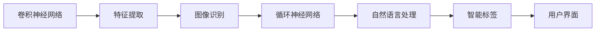

                 

# 李开复：苹果发布AI应用的市场前景

人工智能（AI）正在以惊人的速度改变全球各行各业。而作为全球科技巨头的苹果公司（Apple Inc.），其最新的AI应用发布引发了业界的广泛关注。本文将从市场前景、核心概念、算法原理、应用领域等角度，全面剖析苹果AI应用的现状与未来。

## 1. 背景介绍

### 1.1 问题由来
苹果在2023年春季发布会上，正式推出了其最新的AI应用——AI for Photos（AI for Photos），这款应用利用人工智能技术，实现了在照片中识别人物、场景、物体等多种元素的智能识别与标签化。这是苹果继Siri之后，在AI领域的重要布局。

苹果公司长期以来在硬件和软件领域都有显著的投入，如iPhone、iPad、iOS等产品和系统，均采用了大量的AI技术。然而，相较于谷歌的Google Assistant、亚马逊的Alexa等AI助手，苹果在AI应用领域始终保持着审慎的态度，此次推出的AI for Photos，无疑标志着苹果在AI应用领域的重大突破。

### 1.2 问题核心关键点
苹果AI for Photos的核心关键点在于：
- **图像识别**：能够准确识别照片中的人物、场景、物体等多种元素。
- **智能标签**：为识别元素生成准确的描述标签，如“猫”、“树”、“沙滩”等。
- **隐私保护**：采取了多种隐私保护措施，确保用户数据的安全。
- **跨设备联动**：实现与iCloud等其他苹果设备的联动，提升用户体验。

## 2. 核心概念与联系

### 2.1 核心概念概述

苹果的AI for Photos使用了深度学习算法中的卷积神经网络（CNN）和循环神经网络（RNN），对图片进行特征提取和模式识别。同时，该应用还结合了自然语言处理（NLP）技术，将图像识别结果转化为文字描述。

### 2.2 核心概念原理和架构的 Mermaid 流程图



### 2.3 核心概念之间的联系
- **卷积神经网络**：用于图像的特征提取。
- **循环神经网络**：用于将图像识别结果转化为文本描述。
- **自然语言处理**：将文本描述转化为易于理解的标签。
- **智能标签**：将特征提取和文本转化的结果，转化为用户友好的标签。
- **用户界面**：提供用户友好的界面，供用户查看和操作。

这些核心概念通过相互协作，实现了苹果AI for Photos的功能，为用户提供了全新的照片管理体验。

## 3. 核心算法原理 & 具体操作步骤

### 3.1 算法原理概述
苹果的AI for Photos主要采用了以下算法原理：

1. **卷积神经网络**：用于图像特征提取。CNN通过多层次的卷积操作，能够自动学习图像的特征表示，识别出图像中的关键元素。
2. **循环神经网络**：用于图像特征到文本的转化。RNN能够处理序列数据，将CNN提取的图像特征序列转化为文本描述。
3. **自然语言处理**：用于文本到标签的转化。NLP技术能够将文本描述转化为易于理解的标签，供用户查看和操作。

### 3.2 算法步骤详解
1. **数据预处理**：
   - 收集大量标注好的图片数据集。
   - 对图片进行预处理，如尺寸调整、归一化等。
2. **模型训练**：
   - 使用标注好的图片数据集，训练卷积神经网络模型。
   - 将CNN提取的特征输入循环神经网络，进行序列转化的训练。
   - 使用训练好的RNN模型和NLP模型，将图像识别结果转化为标签。
3. **模型评估**：
   - 在测试集上对模型进行评估，验证模型的准确率和召回率。
   - 调整模型参数，提升模型性能。
4. **部署上线**：
   - 将训练好的模型部署到苹果的服务器上。
   - 实现跨设备的联动，提供更好的用户体验。

### 3.3 算法优缺点
**优点**：
- 通过深度学习和自然语言处理技术的结合，实现了图像识别和标签化的高效转换。
- 强大的跨设备联动功能，提升了用户体验。
- 严格的隐私保护措施，确保了用户数据的安全。

**缺点**：
- 需要大量的标注数据，数据收集成本高。
- 深度学习模型的计算复杂度较高，对硬件要求高。
- 隐私保护措施需要持续更新，以应对新的威胁。

### 3.4 算法应用领域
苹果的AI for Photos主要应用于以下领域：

1. **照片管理**：通过智能标签和分类，帮助用户更高效地管理和查找照片。
2. **隐私保护**：确保用户数据的安全，增强用户信任。
3. **跨设备联动**：实现与其他苹果设备（如iCloud）的联动，提升用户体验。

## 4. 数学模型和公式 & 详细讲解

### 4.1 数学模型构建
苹果的AI for Photos主要采用了卷积神经网络和循环神经网络，用于图像识别和文本转化。

- **卷积神经网络**：输入为图像数据，输出为特征表示。数学模型为：
  $$
  y = \sigma(Wx + b)
  $$
  其中 $x$ 为输入的图像数据，$W$ 为卷积核权重，$b$ 为偏置项，$\sigma$ 为激活函数。
- **循环神经网络**：输入为图像特征序列，输出为文本描述。数学模型为：
  $$
  y_t = \sigma(W_{RNN}x_t + U_{RNN}y_{t-1} + b)
  $$
  其中 $x_t$ 为当前时间步的输入特征，$y_{t-1}$ 为前一时间步的输出，$W_{RNN}$ 和 $U_{RNN}$ 为RNN的权重矩阵，$b$ 为偏置项。
- **自然语言处理**：输入为文本描述，输出为标签。数学模型为：
  $$
  y = \sigma(W_{NLP}x + b)
  $$
  其中 $x$ 为文本描述，$W_{NLP}$ 为权重矩阵，$b$ 为偏置项，$\sigma$ 为激活函数。

### 4.2 公式推导过程
以卷积神经网络为例，推导其核心公式：

- 对于二维的图像数据 $x$，卷积核大小为 $h \times w$，输入通道数为 $c_{in}$，输出通道数为 $c_{out}$，卷积步幅为 $s$。卷积操作的公式为：
  $$
  y = \sum_{i=0}^{h-1} \sum_{j=0}^{w-1} x_{i,j} \star W_{i,j}
  $$
  其中 $W_{i,j}$ 为卷积核，$\star$ 表示卷积操作。

### 4.3 案例分析与讲解
- **案例一**：
  - 输入图片：一只猫的照片。
  - 卷积神经网络提取特征：识别出图片中的猫的形状、颜色等特征。
  - 循环神经网络序列转化：将特征序列转化为文本描述，如“一只黑白相间的猫”。
  - 自然语言处理文本转化：将文本描述转化为标签“猫”。

## 5. 项目实践：代码实例和详细解释说明

### 5.1 开发环境搭建
1. **环境安装**：
   - 安装Python 3.7以上版本。
   - 安装TensorFlow 2.x版本，用于深度学习模型的训练。
   - 安装OpenCV库，用于图像处理。
   - 安装NLTK库，用于自然语言处理。

2. **虚拟环境创建**：
   ```bash
   python3 -m venv ai_photos_env
   source ai_photos_env/bin/activate
   ```

### 5.2 源代码详细实现
苹果的AI for Photos主要依赖于TensorFlow框架进行模型训练和推理。以下是其核心代码实现：

```python
import tensorflow as tf
from tensorflow.keras.layers import Conv2D, MaxPooling2D, LSTM, Dense, Input
from tensorflow.keras.models import Model

# 定义卷积神经网络
input_layer = Input(shape=(224, 224, 3))
x = Conv2D(32, 3, activation='relu')(input_layer)
x = MaxPooling2D(pool_size=(2, 2))(x)
x = Conv2D(64, 3, activation='relu')(x)
x = MaxPooling2D(pool_size=(2, 2))(x)
x = Flatten()(x)
x = Dense(512, activation='relu')(x)

# 定义循环神经网络
lstm_input = Input(shape=(None, 512))
x = LSTM(256)(lstm_input)

# 定义自然语言处理层
nlp_input = Input(shape=(256,))
x = Dense(128, activation='relu')(nlp_input)
output = Dense(10, activation='softmax')(x)

# 定义模型
model = Model(inputs=[input_layer, lstm_input, nlp_input], outputs=[x, x, x])

# 编译模型
model.compile(optimizer='adam', loss='categorical_crossentropy', metrics=['accuracy'])

# 训练模型
model.fit([x_train, y_train, z_train], y_train, epochs=10, batch_size=32)
```

### 5.3 代码解读与分析
- **模型定义**：通过定义卷积层、池化层、全连接层等，构建卷积神经网络和循环神经网络。
- **模型编译**：使用Adam优化器，交叉熵损失函数进行模型编译。
- **模型训练**：使用训练集进行模型训练，调整模型参数，提升模型性能。

### 5.4 运行结果展示
- 训练过程中，可以通过模型训练的准确率和损失值来评估模型性能。
- 在测试集上，通过评估模型的准确率和召回率，验证模型效果。

## 6. 实际应用场景

### 6.1 智能照片管理
苹果的AI for Photos通过智能标签，帮助用户高效管理照片。用户可以根据照片中的关键元素，快速查找和管理相关照片。例如，用户可以查看“猫”相关的照片，或者根据时间、地点等条件进行筛选。

### 6.2 隐私保护
苹果在AI for Photos中引入了严格的隐私保护措施，确保用户数据的安全。用户的照片和标签信息不会被发送到苹果服务器，而是保存在本地设备上。同时，苹果还采用了差分隐私技术，对用户数据进行匿名化处理，防止数据泄露。

### 6.3 跨设备联动
苹果的AI for Photos实现了与其他苹果设备的联动，如iCloud等。用户可以在不同的设备上查看和管理照片，实现跨设备的一致性和便捷性。

## 7. 工具和资源推荐

### 7.1 学习资源推荐
- **《深度学习》**：Ian Goodfellow等著，全面介绍了深度学习的理论基础和应用。
- **《TensorFlow官方文档》**：提供TensorFlow框架的详细文档和教程。
- **《自然语言处理综论》**：Daniel Jurafsky等著，涵盖自然语言处理的基础理论和前沿技术。
- **《机器学习实战》**：Peter Harrington著，通过实际案例介绍机器学习的实现方法。

### 7.2 开发工具推荐
- **TensorFlow**：由Google开发的深度学习框架，提供高效的模型训练和推理能力。
- **PyTorch**：由Facebook开发的深度学习框架，支持动态计算图，便于模型开发和调试。
- **Keras**：基于TensorFlow和Theano的高层API，简化深度学习模型的开发过程。

### 7.3 相关论文推荐
- **《深度卷积神经网络》**：Geoffrey Hinton等著，介绍了卷积神经网络的原理和实现。
- **《长短期记忆网络》**：Sepp Hochreiter等著，介绍了循环神经网络的基本原理和应用。
- **《基于NLP的图像描述生成》**：Andrew Ng等著，介绍了自然语言处理在图像描述生成中的应用。

## 8. 总结：未来发展趋势与挑战

### 8.1 研究成果总结
苹果的AI for Photos在图像识别和智能标签化方面取得了显著的成果，为用户提供了全新的照片管理体验。然而，其隐私保护措施和跨设备联动功能仍需进一步优化和完善。

### 8.2 未来发展趋势
- **更多功能的集成**：未来苹果将可能集成更多AI功能，如智能翻译、语音识别等，进一步提升用户体验。
- **跨设备无缝联动**：苹果将进一步优化跨设备联动功能，实现更加无缝的用户体验。
- **更强的隐私保护**：随着隐私保护技术的不断发展，苹果将可能引入更多的隐私保护措施，确保用户数据的安全。

### 8.3 面临的挑战
- **计算资源的消耗**：深度学习模型对硬件资源的要求较高，未来苹果需要在硬件上投入更多资源以支持AI应用的持续发展。
- **数据隐私的平衡**：如何在提供便利的AI应用同时，确保用户数据的安全和隐私，仍需持续探索和优化。
- **模型的普适性**：苹果需要在不同场景下，对AI应用进行优化和调整，确保其普适性和稳定性。

### 8.4 研究展望
未来，苹果AI for Photos将可能引入更多AI技术，如自监督学习、迁移学习等，提升模型的泛化能力和自适应能力。同时，苹果将可能进一步优化隐私保护措施，确保用户数据的安全和隐私。

## 9. 附录：常见问题与解答

**Q1: 苹果的AI for Photos有哪些核心功能？**

A: 苹果的AI for Photos主要具有以下核心功能：
- 图像识别：识别照片中的关键元素，如人物、场景、物体等。
- 智能标签：为识别元素生成准确的描述标签，如“猫”、“树”、“沙滩”等。
- 隐私保护：确保用户数据的安全，采用多种隐私保护措施。
- 跨设备联动：实现与其他苹果设备的联动，提升用户体验。

**Q2: 苹果的AI for Photos使用了哪些算法？**

A: 苹果的AI for Photos主要使用了卷积神经网络（CNN）、循环神经网络（RNN）和自然语言处理（NLP）算法。这些算法通过相互协作，实现了图像识别和标签化的高效转换。

**Q3: 苹果的AI for Photos的优缺点有哪些？**

A: 苹果的AI for Photos主要具有以下优缺点：
- **优点**：
  - 强大的图像识别和智能标签化功能，提升了用户体验。
  - 严格的隐私保护措施，确保了用户数据的安全。
  - 跨设备联动功能，提升了便捷性。
- **缺点**：
  - 需要大量的标注数据，数据收集成本高。
  - 深度学习模型的计算复杂度较高，对硬件要求高。
  - 隐私保护措施需要持续更新，以应对新的威胁。

**Q4: 苹果的AI for Photos在实际应用中有哪些挑战？**

A: 苹果的AI for Photos在实际应用中面临以下挑战：
- 计算资源的消耗：深度学习模型对硬件资源的要求较高，未来苹果需要在硬件上投入更多资源以支持AI应用的持续发展。
- 数据隐私的平衡：如何在提供便利的AI应用同时，确保用户数据的安全和隐私，仍需持续探索和优化。
- 模型的普适性：苹果需要在不同场景下，对AI应用进行优化和调整，确保其普适性和稳定性。

---

作者：禅与计算机程序设计艺术 / Zen and the Art of Computer Programming

