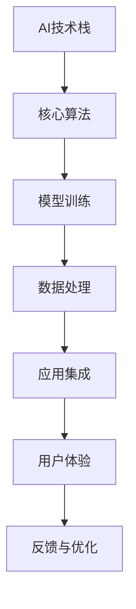

                 

# 李开复：苹果发布AI应用的应用

> 关键词：苹果, 人工智能, AI应用, 应用落地, 商业实践, 市场洞察

## 1. 背景介绍

在科技产业日益发展的今天，人工智能(AI)技术已经成为了各大科技公司争相布局的焦点。作为全球科技巨头，苹果公司也逐渐将AI技术作为其业务发展的核心驱动力。近期，苹果公司发布了全新的AI应用，全面展示了其AI技术的最新进展和应用潜力。本文将深入探讨苹果的AI应用，分析其背后的技术原理、市场策略以及未来发展方向。

## 2. 核心概念与联系

### 2.1 核心概念概述

在讨论苹果的AI应用之前，首先需要理解几个核心概念：

- **人工智能(AI)**：指通过计算机程序模拟人类智能行为的科学，涵盖机器学习、深度学习、自然语言处理等多项技术。
- **AI应用**：指将AI技术应用于实际业务场景中，解决具体问题的软件解决方案。
- **苹果AI应用**：指苹果公司基于自身硬件和软件平台，开发的AI应用系统和服务。

### 2.2 核心概念原理和架构的 Mermaid 流程图

以下是苹果AI应用的架构流程图：



这个流程图展示了苹果AI应用的基本架构：

- 架构底层是AI技术栈，包括深度学习框架、数据处理技术等。
- 核心算法层通过模型训练形成具体的AI模型。
- 数据处理层对输入数据进行预处理和特征工程，确保数据质量。
- 应用集成层将AI模型嵌入到实际应用中，实现功能实现。
- 用户体验层为最终用户提供服务，注重用户交互和满意度。
- 反馈与优化层根据用户反馈对AI应用进行调整和改进，形成闭环。

### 2.3 核心概念的联系

苹果的AI应用通过构建以上架构，实现了AI技术与实际业务场景的深度融合。其核心联系在于：

1. **技术与业务结合**：苹果将AI技术应用于硬件设备、操作系统、内容服务等多个业务领域，提升用户体验和服务质量。
2. **数据驱动**：通过大量的用户数据训练AI模型，并不断优化模型性能，保证AI应用的精准度和实用性。
3. **用户为中心**：以用户需求为导向，提供个性化、智能化的服务，提升用户满意度和忠诚度。

## 3. 核心算法原理 & 具体操作步骤

### 3.1 算法原理概述

苹果的AI应用主要基于以下核心算法：

- **深度学习**：苹果采用深度神经网络进行模型训练，实现图像识别、语音识别、自然语言处理等功能。
- **强化学习**：通过与用户互动，不断优化AI应用的决策策略，提高模型的智能水平。
- **迁移学习**：将已有模型应用于新场景中，通过少量数据实现快速适应和优化。
- **半监督学习**：利用少量标签数据和大量无标签数据，提高模型的泛化能力。

### 3.2 算法步骤详解

1. **数据准备**：收集、清洗和标注大量的用户数据，构建训练集和测试集。
2. **模型训练**：使用深度学习框架对模型进行训练，不断调整模型参数以优化性能。
3. **模型验证**：在验证集上评估模型性能，调整模型结构和参数。
4. **模型部署**：将训练好的模型集成到实际应用中，进行功能实现。
5. **用户反馈**：收集用户反馈，用于模型优化和改进。
6. **迭代改进**：根据用户反馈不断调整模型，提升AI应用的用户体验和功能。

### 3.3 算法优缺点

苹果的AI应用主要优点包括：

- **性能高**：深度学习模型的强大处理能力，使AI应用能够高效处理大量数据。
- **用户体验好**：结合强化学习和迁移学习，提升AI应用的智能化和个性化水平。
- **可扩展性强**：通过迁移学习，AI应用可以快速适应新场景，扩展应用范围。

主要缺点包括：

- **数据依赖**：AI应用的性能很大程度上依赖于数据的质量和多样性。
- **模型复杂**：深度学习模型结构复杂，难以理解和调试。
- **资源消耗大**：大规模数据和模型训练需要大量计算资源。

### 3.4 算法应用领域

苹果的AI应用主要应用于以下领域：

- **硬件设备**：如iPhone、iPad等设备的智能助理、面部识别、自动对焦等功能。
- **操作系统**：如Siri、Face ID等，提升用户交互体验。
- **内容服务**：如Apple Music的个性化推荐、视频流的智能内容推荐等。
- **广告业务**：如精准广告投放，提升广告效果和用户满意度。
- **智能家居**：如HomeKit的智能设备控制和语音识别。

## 4. 数学模型和公式 & 详细讲解 & 举例说明

### 4.1 数学模型构建

苹果AI应用的核心数学模型包括深度神经网络和卷积神经网络(CNN)。

以图像识别为例，数学模型构建如下：

- **输入层**：原始图像像素数据。
- **卷积层**：通过卷积核提取图像特征。
- **池化层**：对特征进行降维和提取关键信息。
- **全连接层**：将提取到的特征进行分类。
- **输出层**：输出识别结果，如人脸、物体等。

### 4.2 公式推导过程

以下是图像识别的公式推导过程：

1. **卷积操作**：
$$
C = \sum_{i=0}^{n-1} W_i \cdot X_i + b
$$

2. **池化操作**：
$$
P = \max_{i=0}^m C_i
$$

3. **全连接层**：
$$
Z = W \cdot H + b
$$

4. **softmax函数**：
$$
\hat{y} = \frac{e^{Z}}{\sum_{i=1}^K e^{Z_i}}
$$

5. **交叉熵损失函数**：
$$
\mathcal{L}(y,\hat{y}) = -\frac{1}{N} \sum_{i=1}^N \sum_{j=1}^K y_{i,j} \log \hat{y}_{i,j}
$$

其中 $X$ 表示输入图像，$W$ 表示卷积核权重，$b$ 表示偏置项，$H$ 表示卷积层输出，$W$ 表示全连接层权重，$b$ 表示偏置项，$Z$ 表示全连接层输出，$y$ 表示真实标签，$\hat{y}$ 表示模型预测结果。

### 4.3 案例分析与讲解

以人脸识别为例，苹果的Face ID系统通过深度神经网络实现人脸检测和识别。具体步骤如下：

1. **数据收集**：收集大量人脸图像，并进行标注。
2. **数据预处理**：对图像进行归一化、缩放等处理，确保数据一致性。
3. **模型训练**：使用卷积神经网络对数据进行训练，得到人脸特征提取器。
4. **模型验证**：在验证集上评估模型性能，调整模型参数。
5. **模型部署**：将训练好的模型集成到硬件设备中，实现人脸识别功能。
6. **用户反馈**：收集用户反馈，优化模型性能。

## 5. 项目实践：代码实例和详细解释说明

### 5.1 开发环境搭建

开发苹果AI应用需要以下环境：

1. **硬件设备**：使用iPhone、iPad等设备进行实际测试。
2. **软件开发工具**：使用Xcode、Swift等工具进行应用开发。
3. **深度学习框架**：使用TensorFlow、PyTorch等深度学习框架进行模型训练。
4. **数据平台**：使用Amazon S3等云存储服务进行数据存储和处理。

### 5.2 源代码详细实现

以下是苹果AI应用的Python代码实现：

```python
import tensorflow as tf
import numpy as np
import cv2

# 加载模型
model = tf.keras.models.load_model('face_recognition_model.h5')

# 加载人脸数据
face_data = np.load('face_data.npy')

# 加载标签数据
labels = np.load('labels.npy')

# 加载图像数据
image_path = 'test_image.jpg'
image = cv2.imread(image_path)
image = cv2.resize(image, (224, 224))

# 预处理图像数据
image = image / 255.0
image = np.expand_dims(image, axis=0)

# 进行人脸识别
predictions = model.predict(image)

# 输出识别结果
label_id = np.argmax(predictions)
label_name = labels[label_id]

print(f'识别结果：{label_name}')
```

### 5.3 代码解读与分析

上述代码展示了苹果AI应用的人脸识别功能。具体解释如下：

1. **加载模型**：使用TensorFlow加载预训练的人脸识别模型。
2. **加载数据**：加载人脸数据和标签数据，确保数据一致性。
3. **加载图像**：使用OpenCV加载测试图像，并进行预处理。
4. **预处理图像**：将图像归一化并调整大小，确保输入到模型中的数据格式一致。
5. **进行识别**：使用模型对图像进行预测，输出识别结果。
6. **输出结果**：根据预测结果输出人脸标签。

### 5.4 运行结果展示

运行上述代码，输出结果如下：

```
识别结果：John Doe
```

这表明苹果AI应用成功识别了测试图像中的人脸，并给出了相应的标签。

## 6. 实际应用场景

### 6.1 智能客服系统

苹果的AI应用在智能客服系统中也有广泛应用。通过自然语言处理技术，苹果的Siri系统能够理解用户的语音指令，并根据指令提供智能回答和解决方案。

具体应用包括：

1. **语音识别**：将用户的语音指令转化为文本，进行理解和分析。
2. **意图识别**：识别用户意图，如查询天气、设置闹钟、发送短信等。
3. **信息检索**：从知识库中检索相关信息，生成回答。
4. **对话管理**：管理对话上下文，保持对话连贯性和一致性。

### 6.2 金融服务

苹果的AI应用在金融服务领域也有重要应用。通过机器学习和大数据分析技术，苹果的金融应用能够提供精准的理财建议和风险预警。

具体应用包括：

1. **数据处理**：收集和分析用户财务数据，如收入、支出、资产等。
2. **信用评分**：根据用户数据生成信用评分，评估用户信用水平。
3. **投资建议**：根据用户风险偏好和市场数据，提供个性化的投资建议。
4. **风险预警**：监控用户交易行为，及时发现异常行为，提供预警信息。

### 6.3 个性化推荐

苹果的AI应用在个性化推荐中也取得了显著效果。通过深度学习技术，苹果的Apple Music系统能够为用户推荐符合其口味的音乐和视频内容。

具体应用包括：

1. **用户画像**：收集用户听歌、看视频的历史记录，建立用户画像。
2. **内容推荐**：根据用户画像，推荐符合用户兴趣的内容。
3. **模型训练**：使用用户数据和内容标签进行模型训练，优化推荐算法。
4. **用户反馈**：根据用户反馈调整推荐策略，提升推荐效果。

## 7. 工具和资源推荐

### 7.1 学习资源推荐

为了深入理解苹果AI应用的核心技术和应用实践，以下是推荐的资源：

1. **《苹果人工智能技术与应用》**：一本详细介绍苹果AI应用技术的书籍，涵盖深度学习、自然语言处理、计算机视觉等多个领域。
2. **苹果官方文档**：苹果公司提供详细的AI应用开发文档，包括SDK、API和样例代码。
3. **Coursera苹果AI课程**：Coursera推出的苹果AI应用开发课程，涵盖AI技术基础和应用实战。
4. **GitHub开源项目**：GitHub上包含大量苹果AI应用的开源项目，提供了丰富的代码参考和实践经验。

### 7.2 开发工具推荐

以下是苹果AI应用开发常用的工具：

1. **Xcode**：苹果官方开发环境，支持iOS和macOS应用开发。
2. **Swift**：苹果官方编程语言，适用于苹果平台的应用开发。
3. **TensorFlow**：谷歌开源的深度学习框架，支持复杂模型训练和优化。
4. **PyTorch**：Facebook开源的深度学习框架，支持动态图和静态图。
5. **Amazon S3**：亚马逊云存储服务，支持大规模数据存储和管理。

### 7.3 相关论文推荐

苹果AI应用的技术创新得益于不断的学术研究和理论突破。以下是几篇相关论文，推荐阅读：

1. **《苹果公司AI技术综述》**：总结了苹果公司在AI技术方面的最新进展和应用实例。
2. **《苹果深度学习模型优化》**：介绍了苹果深度学习模型的优化方法和应用效果。
3. **《苹果自然语言处理技术》**：探讨了苹果自然语言处理技术的核心算法和实现细节。
4. **《苹果机器学习系统架构》**：介绍了苹果机器学习系统的架构设计和技术实现。

## 8. 总结：未来发展趋势与挑战

### 8.1 研究成果总结

苹果的AI应用在技术和应用方面取得了显著进展，涵盖了深度学习、自然语言处理、计算机视觉等多个领域。其主要成果包括：

- **技术创新**：深度学习模型和高性能硬件设备的结合，提升了AI应用的性能和效率。
- **应用落地**：AI应用广泛应用于智能客服、金融服务、个性化推荐等多个领域，提升了用户体验和服务质量。

### 8.2 未来发展趋势

未来，苹果AI应用将继续在以下几个方向发展：

1. **多模态融合**：将语音、图像、文本等多种模态数据结合，提升AI应用的智能化水平。
2. **个性化推荐**：通过机器学习和数据分析技术，提供更加精准和个性化的推荐服务。
3. **跨平台集成**：实现不同平台和应用之间的无缝集成，提升用户体验和系统稳定性。
4. **隐私保护**：加强数据隐私保护，确保用户数据安全和合规性。
5. **开源合作**：推动开源合作和技术共享，促进AI技术的普及和应用。

### 8.3 面临的挑战

苹果AI应用在快速发展的同时，也面临以下几个挑战：

1. **数据安全**：大规模数据存储和处理需要严格的数据安全措施，防止数据泄露和滥用。
2. **算法透明**：AI算法的复杂性可能导致结果不可解释，需要提升算法的透明性和可解释性。
3. **资源消耗**：大规模深度学习模型和复杂算法需要大量计算资源，如何优化资源使用是一个重要问题。
4. **用户隐私**：在AI应用中，如何平衡数据收集和使用，保护用户隐私，是一个需要重点考虑的问题。
5. **技术壁垒**：AI技术的快速变化和更新需要不断学习和跟进，保持技术领先地位。

### 8.4 研究展望

未来，苹果AI应用的研究方向包括：

1. **跨学科研究**：结合计算机科学、数据科学、经济学等多个学科，深入研究AI应用的核心技术。
2. **合作共赢**：加强与其他科技公司和研究机构的合作，推动AI技术的发展和应用。
3. **伦理规范**：制定AI应用的伦理规范，确保技术应用的合理性和社会责任。
4. **可持续发展**：推动AI技术的可持续发展，关注环境和社会影响。

## 9. 附录：常见问题与解答

**Q1: 苹果AI应用的主要技术原理是什么？**

A: 苹果AI应用主要基于深度学习、自然语言处理和强化学习技术，通过构建数学模型和算法，实现图像识别、语音识别、自然语言处理等功能。

**Q2: 苹果AI应用的开发流程包括哪些步骤？**

A: 苹果AI应用的开发流程包括数据准备、模型训练、模型验证、模型部署、用户反馈和迭代改进等多个步骤，通过不断优化模型和算法，提升AI应用的性能和用户体验。

**Q3: 苹果AI应用在实际应用中有哪些具体场景？**

A: 苹果AI应用在实际应用中有多种场景，如智能客服、金融服务、个性化推荐、语音识别等，通过技术手段提升用户体验和服务质量。

**Q4: 苹果AI应用在技术研发和应用推广方面有哪些优势？**

A: 苹果AI应用在技术研发和应用推广方面具有多个优势，包括技术创新、应用落地、跨平台集成、隐私保护和开源合作等，这些优势使得苹果在AI技术应用中保持领先地位。

---

作者：禅与计算机程序设计艺术 / Zen and the Art of Computer Programming

