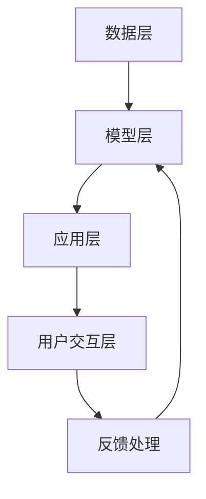

                 

# 李开复：苹果发布AI应用的意义

在快速发展的科技时代，人工智能(AI)已经不再是遥远的概念，而是越来越多地融入我们的日常生活和工作。其中，苹果公司作为全球知名的科技巨头，其对AI应用的探索和推广，无疑对整个行业产生了深远的影响。本文将探讨苹果在AI应用方面的最新动态，并分析其对AI技术发展的意义。

## 1. 背景介绍

### 1.1 苹果的AI战略

自2017年苹果公司宣布推出自己的人工智能应用以来，AI就成为了其技术研发的重要方向。苹果不仅在硬件产品中嵌入AI芯片，如iPhone的A系列芯片、M系列芯片，还在软件层面推出了Siri虚拟助手、Face ID人脸识别等AI功能，进一步巩固了其在智能设备领域的领导地位。

2021年，苹果发布了包括语音合成、图像识别、自然语言处理(NLP)在内的多款AI应用，标志着其AI战略进入了一个新阶段。这一系列动作不仅展示了苹果在AI领域的技术实力，也体现了其对未来市场和用户需求的深刻洞察。

### 1.2 人工智能的应用场景

AI技术已经广泛应用在医疗、教育、金融、零售等多个领域，并逐步渗透到我们的日常生活中的各个方面。例如，智能家居、无人驾驶、智能客服等，都是AI技术在实际应用中的典型代表。苹果作为AI领域的领头羊，其在这些领域的探索和应用，无疑将引领整个行业的发展方向。

## 2. 核心概念与联系

### 2.1 核心概念概述

苹果的AI应用主要涉及以下几个关键概念：

- **语音合成**：利用AI技术生成自然语言，模拟人类语音，常用于智能助手和语音输入等场景。
- **图像识别**：通过深度学习算法，分析图片内容，识别物体、人脸、场景等，常用于照片滤镜、图像搜索等应用。
- **自然语言处理(NLP)**：使计算机能够理解、分析和生成人类语言，常用于聊天机器人、翻译、情感分析等。
- **机器学习**：通过大量数据训练模型，使其具备预测和决策能力，常用于个性化推荐、广告投放等。

这些核心概念之间存在紧密联系，相互支持，共同构建了苹果的AI应用生态。

### 2.2 核心概念原理和架构

苹果的AI应用架构可以归纳为以下几个层次：

1. **数据层**：收集和处理海量数据，为AI模型提供数据支持。
2. **模型层**：设计并训练AI模型，如神经网络、决策树等，实现特定功能。
3. **应用层**：将模型封装为应用程序，提供给用户使用。
4. **用户交互层**：通过用户界面与用户进行互动，获取反馈，优化模型。

以下是一个简单的Mermaid流程图，展示了苹果AI应用的架构：



### 2.3 核心概念联系

苹果的AI应用通过数据驱动和模型驱动的方式，实现对用户需求的快速响应。数据层为模型提供了丰富的输入，模型层则通过学习和训练，提取出数据中的有用信息，应用层则将这些信息转化为具体的应用场景，而用户交互层则通过与用户的互动，不断优化模型和改进应用。这一环环相扣的机制，确保了苹果AI应用的稳定性和高效性。

## 3. 核心算法原理 & 具体操作步骤

### 3.1 算法原理概述

苹果的AI应用主要依赖于深度学习和机器学习算法。其中，卷积神经网络(CNN)、循环神经网络(RNN)、长短期记忆网络(LSTM)、变压器(Transformer)等，都是苹果常用的算法模型。这些模型通过反向传播、梯度下降等优化算法，不断调整权重，提高模型的预测准确性。

### 3.2 算法步骤详解

以下是苹果AI应用的核心算法步骤：

1. **数据预处理**：对原始数据进行清洗、归一化、特征提取等处理，为模型提供高质量的输入。
2. **模型设计**：根据应用需求，选择合适的算法模型，并设计网络结构。
3. **模型训练**：使用标注数据对模型进行训练，调整参数，提高模型性能。
4. **模型评估**：通过验证集对模型进行评估，确保模型在未知数据上也能表现良好。
5. **模型部署**：将训练好的模型封装为应用，部署到实际环境中。
6. **用户反馈**：收集用户反馈，优化模型，提高应用体验。

这些步骤体现了苹果AI应用的高效性和可扩展性，确保了其在实际应用中的稳定表现。

### 3.3 算法优缺点

苹果的AI应用具有以下优点：

- **技术领先**：苹果在深度学习、自然语言处理等领域具有强大的技术实力，能够快速开发并部署高性能的AI应用。
- **用户体验**：通过用户反馈和迭代优化，苹果的AI应用能够提供更好的用户体验。
- **安全性**：苹果高度重视用户数据隐私和安全，采用了多重加密和安全机制，保护用户数据。

同时，苹果的AI应用也存在一些缺点：

- **高昂成本**：AI应用的开发和部署需要大量的人力和物力投入，成本较高。
- **算法局限**：当前AI算法在面对复杂场景时，可能无法提供理想的解决方案。
- **数据隐私**：在收集和处理数据时，需要严格遵守数据隐私法律法规，避免侵犯用户权益。

### 3.4 算法应用领域

苹果的AI应用涵盖多个领域，包括但不限于：

- **智能助手**：如Siri，通过语音识别和自然语言处理技术，实现语音输入和智能回复。
- **图像识别**：如Face ID，通过人脸识别技术，实现面部解锁和安全认证。
- **个性化推荐**：如App Store，通过机器学习算法，推荐用户感兴趣的App和内容。
- **智能医疗**：通过AI技术，帮助医生进行疾病诊断和病人监护。

## 4. 数学模型和公式 & 详细讲解

### 4.1 数学模型构建

苹果的AI应用通常采用多层感知器(MLP)、卷积神经网络(CNN)、循环神经网络(RNN)等深度学习模型。以语音合成为例，其数学模型可以表示为：

$$
y = f(x; \theta)
$$

其中 $y$ 表示合成后的语音，$x$ 表示输入的文本，$\theta$ 表示模型参数。通过反向传播算法，不断调整参数 $\theta$，使得模型输出 $y$ 尽量接近真实的语音信号。

### 4.2 公式推导过程

语音合成的核心公式为：

$$
\begin{aligned}
\mathcal{L} &= \frac{1}{N}\sum_{i=1}^N \|y_i - f(x_i; \theta)\|^2 \\
&= \frac{1}{N}\sum_{i=1}^N (y_i - f(x_i; \theta))^2
\end{aligned}
$$

其中 $N$ 表示样本数量，$\|.\|$ 表示范数。目标是最小化损失函数 $\mathcal{L}$，即：

$$
\theta^* = \mathop{\arg\min}_{\theta} \mathcal{L}
$$

### 4.3 案例分析与讲解

以图像识别为例，其基本流程可以描述为：

1. **数据预处理**：对原始图像进行缩放、裁剪、归一化等预处理，得到标准尺寸的输入。
2. **特征提取**：使用卷积层提取图像的特征，得到高维特征向量。
3. **分类**：通过全连接层或softmax函数，将特征向量映射到类别概率分布上。
4. **模型训练**：使用标注数据训练模型，调整卷积核和全连接层的权重，提高分类准确性。
5. **模型评估**：在验证集上评估模型性能，计算准确率、召回率等指标。

以苹果的Face ID为例，其图像识别模型采用了多种神经网络结构，包括卷积神经网络和循环神经网络，能够准确识别用户面部特征，实现面部解锁和安全认证。

## 5. 项目实践：代码实例和详细解释说明

### 5.1 开发环境搭建

在进行AI应用开发前，需要先搭建好开发环境。以下是使用Python进行TensorFlow开发的环境配置流程：

1. 安装Anaconda：从官网下载并安装Anaconda，用于创建独立的Python环境。

2. 创建并激活虚拟环境：
```bash
conda create -n tf-env python=3.7 
conda activate tf-env
```

3. 安装TensorFlow：根据CUDA版本，从官网获取对应的安装命令。例如：
```bash
conda install tensorflow=2.7 -c tf
```

4. 安装各类工具包：
```bash
pip install numpy pandas scikit-learn matplotlib tqdm jupyter notebook ipython
```

完成上述步骤后，即可在`tf-env`环境中开始AI应用开发。

### 5.2 源代码详细实现

以下是一个简单的TensorFlow代码实现，用于图像识别：

```python
import tensorflow as tf
from tensorflow.keras import layers

# 定义模型结构
model = tf.keras.Sequential([
    layers.Conv2D(32, (3, 3), activation='relu', input_shape=(28, 28, 1)),
    layers.MaxPooling2D((2, 2)),
    layers.Flatten(),
    layers.Dense(10, activation='softmax')
])

# 编译模型
model.compile(optimizer='adam', loss='sparse_categorical_crossentropy', metrics=['accuracy'])

# 加载数据集
mnist = tf.keras.datasets.mnist
(x_train, y_train), (x_test, y_test) = mnist.load_data()

# 数据预处理
x_train = x_train.reshape(-1, 28, 28, 1) / 255.0
x_test = x_test.reshape(-1, 28, 28, 1) / 255.0

# 训练模型
model.fit(x_train, y_train, epochs=10, batch_size=32, validation_data=(x_test, y_test))

# 评估模型
model.evaluate(x_test, y_test)
```

### 5.3 代码解读与分析

以上代码实现了基于TensorFlow的图像识别模型，以下是对关键代码的详细解读：

**Sequential模型**：
- `Sequential` 模型表示按照顺序堆叠多个层，用于搭建简单的神经网络。

**卷积层和池化层**：
- `Conv2D` 层实现卷积操作，提取图像特征。
- `MaxPooling2D` 层实现池化操作，减小特征维度，提高计算效率。

**全连接层**：
- `Dense` 层实现全连接操作，将特征向量映射到类别概率分布上。

**编译模型**：
- `compile` 方法用于配置模型，设置优化器、损失函数和评估指标。

**数据预处理**：
- 将原始数据归一化到0-1之间，确保模型输入的稳定性。

**训练模型**：
- `fit` 方法用于训练模型，设定训练轮数和批量大小，使用验证集评估模型性能。

**评估模型**：
- `evaluate` 方法用于评估模型在测试集上的性能，输出准确率和损失。

通过以上代码，我们可以快速构建并训练一个简单的图像识别模型。需要注意的是，实际应用中，可能需要根据具体需求进行模型优化和调参，以达到更好的性能。

## 6. 实际应用场景

### 6.1 智能家居

苹果的AI应用在智能家居领域具有广泛的应用前景。通过智能语音助手和图像识别技术，用户可以实现语音控制家中的智能设备，如灯光、窗帘、空调等。例如，用户可以通过Siri助手，实现语音开灯、关灯、调节温度等功能。

### 6.2 智能医疗

苹果的AI技术在智能医疗领域也有重要的应用。通过图像识别和自然语言处理技术，可以实现疾病的早期诊断和预测。例如，利用苹果的AI模型，可以对医疗影像进行自动化分析，辅助医生进行诊断和治疗决策。

### 6.3 智能客服

苹果的智能客服系统基于AI技术，能够24小时不间断地为用户提供咨询服务。通过语音识别和自然语言处理技术，智能客服可以理解用户的意图，提供个性化的服务。例如，用户可以通过Siri助手，查询航班信息、预订酒店、购物等。

## 7. 工具和资源推荐

### 7.1 学习资源推荐

为了帮助开发者系统掌握AI技术，这里推荐一些优质的学习资源：

1. TensorFlow官方文档：提供了详细的API文档和教程，是学习TensorFlow的最佳资源。
2. Deep Learning Specialization课程：由Andrew Ng教授主讲，涵盖了深度学习的基础和高级内容。
3. PyTorch官方文档：提供了丰富的API文档和示例代码，是学习PyTorch的最佳资源。
4. Coursera《机器学习》课程：由吴恩达教授主讲，深入浅出地讲解了机器学习的基础理论和技术。

通过这些资源的学习实践，相信你一定能够快速掌握AI技术的精髓，并用于解决实际的NLP问题。

### 7.2 开发工具推荐

高效的开发离不开优秀的工具支持。以下是几款用于AI应用开发的常用工具：

1. TensorFlow：由Google主导开发的开源深度学习框架，生产部署方便，适合大规模工程应用。
2. PyTorch：基于Python的开源深度学习框架，灵活动态的计算图，适合快速迭代研究。
3. Keras：高级神经网络API，易于上手，适合快速搭建模型。
4. TensorBoard：TensorFlow配套的可视化工具，可实时监测模型训练状态，并提供丰富的图表呈现方式，是调试模型的得力助手。
5. Weights & Biases：模型训练的实验跟踪工具，可以记录和可视化模型训练过程中的各项指标，方便对比和调优。

合理利用这些工具，可以显著提升AI应用的开发效率，加快创新迭代的步伐。

### 7.3 相关论文推荐

苹果的AI技术发展离不开学界的持续研究。以下是几篇奠基性的相关论文，推荐阅读：

1. "Deep Residual Learning for Image Recognition"：提出ResNet模型，提高了深度神经网络的训练效率和性能。
2. "WaveNet: A Generative Model for Raw Audio"：提出WaveNet模型，通过卷积神经网络生成高质量音频。
3. "Attention Is All You Need"：提出Transformer模型，提高了自然语言处理任务的性能。
4. "BERT: Pre-training of Deep Bidirectional Transformers for Language Understanding"：提出BERT模型，通过掩码语言模型进行预训练，提高了语言理解能力。

这些论文代表了大规模语言模型和AI应用的发展脉络。通过学习这些前沿成果，可以帮助研究者把握学科前进方向，激发更多的创新灵感。

## 8. 总结：未来发展趋势与挑战

### 8.1 总结

本文对苹果在AI应用方面的最新动态进行了详细分析。从语音合成、图像识别、自然语言处理等多个角度，展示了苹果在AI技术上的卓越表现。苹果的AI应用不仅展示了其强大的技术实力，也为整个行业的发展树立了标杆。

通过本文的系统梳理，可以看到，苹果的AI应用不仅在技术上领先，更在用户体验和安全性方面做出了表率。未来，伴随AI技术的不断演进，苹果的AI应用有望进一步拓展应用场景，为智能家居、医疗、客服等各个领域带来革命性变化。

### 8.2 未来发展趋势

展望未来，苹果的AI应用将呈现以下几个发展趋势：

1. **深度融合**：苹果的AI应用将进一步与硬件和软件生态系统深度融合，实现更流畅的用户体验。例如，苹果的智能家居系统将通过AI技术实现更智能的自动化控制。
2. **跨领域应用**：苹果的AI技术将扩展到更多领域，如自动驾驶、智能制造等，为各个行业带来变革性影响。
3. **多模态融合**：苹果将探索将AI技术与视觉、语音、触觉等多种模态数据进行融合，提升智能系统的感知和决策能力。
4. **隐私保护**：苹果将进一步加强数据隐私保护，通过差分隐私等技术，确保用户数据的安全性。

这些趋势凸显了苹果在AI应用上的雄心壮志，未来的苹果必将继续引领AI技术的创新和发展。

### 8.3 面临的挑战

尽管苹果的AI应用已经取得了显著成就，但在迈向更加智能化、普适化应用的过程中，仍面临诸多挑战：

1. **技术瓶颈**：在处理复杂任务时，AI模型的性能仍有限。如何进一步提高模型的准确性和鲁棒性，仍然是一大挑战。
2. **数据隐私**：在数据收集和处理时，如何平衡用户体验和数据隐私保护，是一个复杂的问题。
3. **成本高昂**：AI应用的开发和部署需要大量的人力和物力投入，成本较高。如何降低成本，提高生产效率，是一个重要的研究方向。
4. **伦理问题**：在AI技术的推广过程中，如何避免算法偏见和伦理问题，确保技术公平性，是一个亟待解决的问题。

这些挑战需要苹果在技术、伦理、法律等多个方面进行深入探索和优化。只有不断克服这些挑战，才能让AI技术更好地服务于人类社会。

### 8.4 研究展望

未来，苹果需要在以下几个方面进行更深入的研究：

1. **算法优化**：开发更加高效、鲁棒的算法模型，提升AI应用的性能和稳定性。
2. **隐私保护**：研究差分隐私、联邦学习等技术，确保用户数据的安全性。
3. **跨领域应用**：将AI技术应用到更多领域，推动各个行业的数字化转型。
4. **伦理审查**：建立AI技术的伦理审查机制，确保技术应用的公平性和透明性。

只有勇于创新、敢于突破，才能不断拓展AI技术的边界，让智能技术更好地造福人类社会。面向未来，苹果的AI应用将引领整个行业，共同推动AI技术的进步和发展。

## 9. 附录：常见问题与解答

**Q1：苹果的AI应用如何保护用户隐私？**

A: 苹果高度重视用户数据隐私和安全，采用了多重加密和安全机制，保护用户数据。例如，Face ID使用面部识别技术，但不会将面部数据存储在云端，而是保存在本地设备中。同时，苹果通过差分隐私等技术，对用户数据进行处理，确保数据隐私保护。

**Q2：苹果的AI应用如何提升用户体验？**

A: 苹果的AI应用通过用户反馈和迭代优化，不断提升用户体验。例如，Siri助手通过不断学习用户的使用习惯，提供更加个性化和高效的语音服务。此外，苹果的AI技术还应用于智能家居、智能医疗等多个场景，通过自然语言处理和图像识别技术，实现更智能和便捷的用户体验。

**Q3：苹果的AI应用在医疗领域的应用前景是什么？**

A: 苹果的AI技术在医疗领域具有广阔的应用前景。通过图像识别和自然语言处理技术，苹果的AI模型可以辅助医生进行疾病诊断、病人监护等工作。例如，利用苹果的AI模型，可以对医疗影像进行自动化分析，提供早期诊断和治疗建议。

**Q4：苹果的AI应用在智能家居领域的应用前景是什么？**

A: 苹果的AI技术在智能家居领域具有广泛的应用前景。通过智能语音助手和图像识别技术，用户可以实现语音控制家中的智能设备，如灯光、窗帘、空调等。例如，用户可以通过Siri助手，实现语音开灯、关灯、调节温度等功能，提升家居生活的智能化和便捷性。

---

作者：禅与计算机程序设计艺术 / Zen and the Art of Computer Programming

