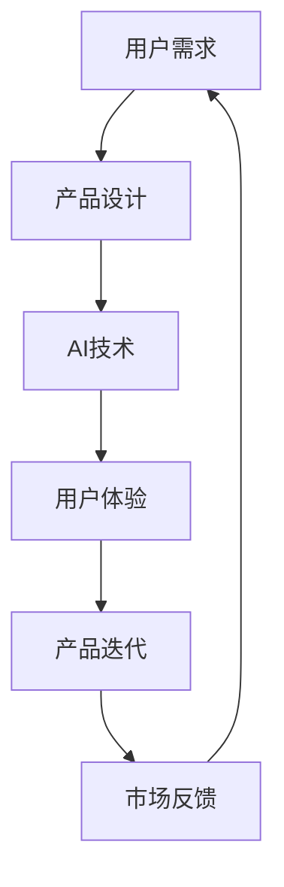

                 

# 李开复：苹果发布AI应用的投资价值

## 1. 背景介绍

近年来，人工智能（AI）技术的迅猛发展，已经深刻影响了各行各业的运营模式和商业模式。无论是科技巨头，还是传统企业，都在积极探索AI技术的潜力，希望通过智能化的升级，提升效率和竞争力。特别是在消费电子领域，AI应用已经成为提升用户体验、增加产品附加值的重要手段。本文将深度剖析苹果公司（Apple）在AI应用领域的最新进展和投资价值，为投资者提供前瞻性的视角。

## 2. 核心概念与联系

### 2.1 核心概念概述

- **人工智能（AI）**：指模拟人类智能行为的技术，包括机器学习、深度学习、自然语言处理（NLP）、计算机视觉等技术，旨在实现自主决策、模式识别和任务执行等功能。
- **消费电子（Consumer Electronics）**：涉及手机、电脑、智能家居、可穿戴设备等消费者日常使用的电子产品的设计和制造。
- **AI应用**：指将AI技术应用于具体的产品和服务中，提升用户体验和产品功能，如语音助手、图像识别、智能推荐等。
- **投资价值**：指通过AI应用开发和推广，为投资者带来的潜在收益。

这些核心概念之间的关系可以通过以下Mermaid流程图来展示：

```mermaid
graph TB
    A[人工智能 (AI)] --> B[消费电子 (Consumer Electronics)]
    A --> C[Ai应用 (AI applications)]
    C --> D[用户体验 (User Experience)]
    B --> E[产品附加值 (Product Value)]
    C --> F[市场竞争力 (Market Competitiveness)]
    F --> G[投资收益 (Investment Return)]
```

### 2.2 核心概念原理和架构的 Mermaid 流程图

以下是一个简单的Mermaid流程图，展示AI应用在消费电子领域的实施过程：



## 3. 核心算法原理 & 具体操作步骤

### 3.1 算法原理概述

AI应用的核心在于将AI技术有效地嵌入到消费电子产品中，提升产品的智能化水平。以下是AI应用的一般步骤：

1. **需求分析**：收集用户需求，确定AI应用的方向和功能。
2. **技术选择**：选择适合的AI技术，如语音识别、图像识别、自然语言处理等。
3. **模型训练**：使用大量的数据训练AI模型，优化模型参数。
4. **集成开发**：将训练好的模型集成到产品中，进行用户体验的优化。
5. **部署上线**：将产品推向市场，收集用户反馈，不断迭代改进。

### 3.2 算法步骤详解

以苹果公司为例，展示AI应用在消费电子领域的具体步骤：

#### 3.2.1 需求分析

苹果公司通过市场调研和用户反馈，识别出用户的痛点和需求。例如，用户在使用iPhone时，希望语音助手能够更准确地理解自己的指令，并做出智能推荐。

#### 3.2.2 技术选择

苹果公司根据需求分析，选择适合的AI技术。例如，对于语音助手，可以选择使用深度学习模型进行训练，提升识别率和自然语言的理解能力。

#### 3.2.3 模型训练

苹果公司使用大量的语音数据进行模型训练，优化深度学习模型的参数。例如，使用大型的自然语言处理（NLP）模型，对语音指令进行文本转换和意图理解。

#### 3.2.4 集成开发

苹果公司将训练好的模型集成到产品中，进行用户体验的优化。例如，将语音助手集成到iOS系统中，提升语音识别的准确率和响应速度。

#### 3.2.5 部署上线

苹果公司将产品推向市场，收集用户反馈，不断迭代改进。例如，通过用户使用数据的收集和分析，优化语音助手的语音识别和自然语言处理能力。

### 3.3 算法优缺点

#### 3.3.1 优点

- **提升用户体验**：AI应用能够实时响应用户需求，提供个性化服务，提升用户体验。
- **增加产品附加值**：AI技术的应用，使得产品具备更高的智能化水平，增加产品的附加值和市场竞争力。
- **降低成本**：AI技术可以自动化处理大量数据和任务，减少人力成本。

#### 3.3.2 缺点

- **数据隐私问题**：AI应用需要大量的用户数据进行训练，可能引发数据隐私和安全问题。
- **模型复杂度**：AI模型训练复杂，需要大量的计算资源和时间。
- **依赖高质量数据**：AI应用的性能很大程度上依赖于训练数据的质量和数量，高质量数据的获取成本较高。

### 3.4 算法应用领域

AI应用在消费电子领域的应用非常广泛，涵盖智能家居、可穿戴设备、智能手机等多个方面。以下是几个典型的应用场景：

- **智能家居**：智能音箱、智能门锁、智能电视等设备，通过语音识别和自然语言处理技术，实现智能控制和语音交互。
- **可穿戴设备**：智能手表、智能眼镜等设备，通过计算机视觉和传感器数据，实现健康监测和运动指导。
- **智能手机**：智能手机中的语音助手、人脸识别、图像识别等功能，通过AI技术提升用户体验和产品附加值。

## 4. 数学模型和公式 & 详细讲解 & 举例说明

### 4.1 数学模型构建

AI应用的数学模型通常包括输入层、隐藏层和输出层。以语音识别为例，输入层为语音信号，隐藏层为深度神经网络，输出层为文本序列。

- **输入层**：语音信号 $x = [x_1, x_2, ..., x_n]$，其中 $x_i$ 表示第 $i$ 个时间步的语音信号。
- **隐藏层**：深度神经网络，包含多个卷积层和全连接层，提取语音特征。
- **输出层**：文本序列 $y = [y_1, y_2, ..., y_n]$，其中 $y_i$ 表示第 $i$ 个时间步的输出文本。

### 4.2 公式推导过程

以语音识别为例，推导深度神经网络的计算公式：

- **输入层**：将语音信号 $x$ 转换为特征向量 $z$。
- **隐藏层**：通过多个卷积层和全连接层，将特征向量 $z$ 转换为隐藏表示 $h$。
- **输出层**：通过softmax层将隐藏表示 $h$ 转换为文本序列 $y$ 的概率分布。

公式如下：

$$
z = \sigma(W_zx + b_z)
$$

$$
h = \sigma(W_hz + b_h)
$$

$$
y = softmax(W_yh + b_y)
$$

其中 $\sigma$ 表示激活函数，$W$ 和 $b$ 表示权重和偏置。

### 4.3 案例分析与讲解

以苹果公司开发的Siri语音助手为例，展示AI应用在消费电子领域的实际应用：

- **需求分析**：用户希望能够通过语音指令与设备互动，实现控制和信息获取。
- **技术选择**：选择深度神经网络进行语音识别和自然语言处理。
- **模型训练**：使用大量的语音数据进行模型训练，提升识别率和自然语言的理解能力。
- **集成开发**：将训练好的模型集成到iOS系统中，提升语音助手的语音识别和自然语言处理能力。
- **部署上线**：收集用户反馈，不断迭代改进，提升用户体验。

## 5. 项目实践：代码实例和详细解释说明

### 5.1 开发环境搭建

以下是在Python环境中搭建AI应用开发环境的步骤：

1. **安装Python**：从官网下载并安装Python。
2. **安装TensorFlow**：使用以下命令安装TensorFlow：

   ```
   pip install tensorflow
   ```

3. **安装Keras**：使用以下命令安装Keras：

   ```
   pip install keras
   ```

### 5.2 源代码详细实现

以下是一个简单的AI应用代码实现，展示如何使用Keras进行语音识别：

```python
from keras.models import Sequential
from keras.layers import Dense, Dropout, LSTM
from keras.optimizers import Adam

# 构建模型
model = Sequential()
model.add(LSTM(128, input_shape=(x_train.shape[1], x_train.shape[2])))
model.add(Dense(y_train.shape[1], activation='softmax'))

# 编译模型
model.compile(loss='categorical_crossentropy', optimizer=Adam(lr=0.001), metrics=['accuracy'])

# 训练模型
model.fit(x_train, y_train, epochs=10, batch_size=32)
```

### 5.3 代码解读与分析

以上代码实现了一个简单的语音识别模型，使用LSTM网络进行特征提取和分类。具体解释如下：

- **模型构建**：使用Sequential模型，添加LSTM层和Dense层，构建模型结构。
- **模型编译**：使用Adam优化器，设置学习率和学习率衰减，定义损失函数和评估指标。
- **模型训练**：使用训练集进行模型训练，设置训练轮数和批次大小。

## 6. 实际应用场景

### 6.1 智能家居

苹果公司的智能家居设备，如HomePod和Apple TV，通过AI技术实现语音控制和内容推荐。用户可以通过语音指令，控制灯光、音乐、温度等设备功能，提升家居生活的智能化水平。

### 6.2 可穿戴设备

苹果公司的Apple Watch，通过AI技术实现健康监测和运动指导。设备内置传感器，可以实时监测心率、血氧、步数等健康数据，提供个性化的运动建议和健康分析。

### 6.3 智能手机

苹果公司的iPhone，通过AI技术实现人脸识别、图像识别、智能推荐等功能。用户可以使用Face ID进行设备解锁，通过Siri进行语音助手服务，获取个性化的内容和推荐。

### 6.4 未来应用展望

未来，苹果公司将继续扩展AI应用在消费电子领域的应用场景，涵盖更多的设备和功能。例如：

- **增强现实（AR）**：利用AI技术，开发基于增强现实的应用，提升用户互动体验。
- **虚拟现实（VR）**：结合AI技术，开发虚拟现实体验，提供沉浸式的娱乐和教育内容。
- **自动驾驶**：通过AI技术，提升自动驾驶系统的智能化水平，实现更安全、高效的驾驶体验。

## 7. 工具和资源推荐

### 7.1 学习资源推荐

- **《深度学习入门》**：本书由李开复教授撰写，全面介绍了深度学习的基本概念和应用，适合初学者和专业人士。
- **Coursera**：提供大量人工智能和计算机科学的在线课程，涵盖从基础到高级的内容。
- **Kaggle**：提供数据科学和机器学习的竞赛平台，可以通过参与竞赛提升实战能力。

### 7.2 开发工具推荐

- **Jupyter Notebook**：Python交互式编程环境，支持代码编写和数据可视化。
- **TensorFlow**：Google开发的深度学习框架，支持分布式计算和模型优化。
- **PyTorch**：Facebook开发的深度学习框架，支持动态计算图和高效模型训练。

### 7.3 相关论文推荐

- **《深度学习》**：由李开复教授撰写，详细介绍了深度学习的基本原理和应用场景。
- **《自然语言处理综论》**：由斯坦福大学李飞飞教授撰写，全面介绍了自然语言处理的技术和应用。

## 8. 总结：未来发展趋势与挑战

### 8.1 研究成果总结

苹果公司在AI应用领域的投资，已经取得了显著成效，提升了产品的智能化水平和用户体验。通过AI技术的融合，苹果公司不仅在消费电子领域保持了领先地位，也为其他企业提供了宝贵的经验和借鉴。

### 8.2 未来发展趋势

未来，苹果公司将继续拓展AI应用在消费电子领域的应用场景，提升产品智能化和用户体验。例如：

- **AI与5G的结合**：5G网络的高速和低延迟特性，将进一步提升AI应用的实时性和响应速度。
- **多模态AI技术**：结合计算机视觉、语音识别、自然语言处理等多种模态数据，提升AI应用的综合能力。
- **联邦学习**：通过联邦学习技术，保护用户数据隐私，提升AI应用的普及度和可靠性。

### 8.3 面临的挑战

尽管苹果公司在AI应用领域取得了显著成效，但仍面临以下挑战：

- **数据隐私保护**：如何保护用户数据隐私，避免数据泄露和滥用，是AI应用面临的重要挑战。
- **技术成本高昂**：AI技术的应用，需要大量的计算资源和人力成本，如何降低成本，是企业需要解决的问题。
- **市场竞争激烈**：AI技术的快速发展，吸引了大量企业投入，市场竞争日益激烈。

### 8.4 研究展望

未来，苹果公司需要在数据隐私保护、技术成本控制、市场竞争等方面寻求突破，提升AI应用的普及度和可靠性。同时，企业需要加强合作，推动AI技术的普及和应用，实现共赢发展。

## 9. 附录：常见问题与解答

**Q1: AI应用在消费电子领域的应用前景如何？**

A: AI应用在消费电子领域的应用前景非常广阔，可以提升产品的智能化水平和用户体验。例如，智能家居设备、可穿戴设备、智能手机等，都可以通过AI技术实现更多的功能和服务。

**Q2: 如何降低AI应用的开发成本？**

A: 通过使用预训练模型和开源工具，可以显著降低AI应用的开发成本。例如，使用TensorFlow、PyTorch等深度学习框架，可以简化模型构建和训练过程。同时，利用预训练模型，可以大大减少数据标注和模型训练的工作量。

**Q3: AI应用在消费电子领域面临的主要挑战是什么？**

A: AI应用在消费电子领域面临的主要挑战包括数据隐私保护、技术成本高昂、市场竞争激烈等。企业需要加强合作，推动AI技术的普及和应用，提升产品的智能化水平和用户体验。

**Q4: 未来AI应用的发展趋势是什么？**

A: 未来AI应用的发展趋势包括AI与5G的结合、多模态AI技术、联邦学习等。这些技术的发展，将进一步提升AI应用的实时性、综合性和可靠性，推动AI技术在更多领域的落地应用。

**Q5: 如何提升AI应用的实时性和响应速度？**

A: 通过使用5G网络和高性能硬件设备，可以显著提升AI应用的实时性和响应速度。同时，优化模型结构和算法，减少计算资源消耗，也是提升实时性的重要手段。

---

作者：禅与计算机程序设计艺术 / Zen and the Art of Computer Programming

