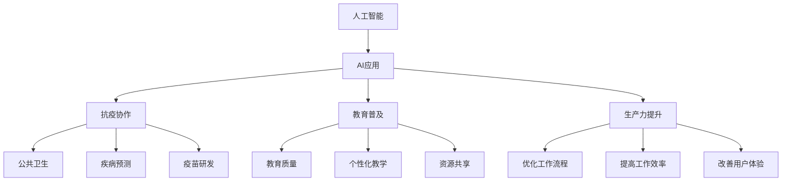

                 

## 1. 背景介绍

### 1.1 问题由来
在过去的一段时间里，苹果公司接连推出了多项AI应用，引发了公众的热烈讨论。特别是在全球疫情的背景下，苹果公司的AI技术在助力抗疫、推进教育、提升工作效率等方面发挥了重要作用。那么，这些AI应用背后，究竟蕴含着哪些文化价值？它们又是如何影响着我们的生活方式呢？本文将对此进行深入分析。

### 1.2 问题核心关键点
苹果公司发布的AI应用涵盖了多个领域，包括但不限于医疗健康、教育、社交娱乐等。本文将重点分析这些AI应用对社会文化价值的影响，并探讨其未来的发展方向和面临的挑战。

## 2. 核心概念与联系

### 2.1 核心概念概述

为更好地理解苹果公司AI应用的文化价值，本节将介绍几个密切相关的核心概念：

- **人工智能（Artificial Intelligence, AI）**：通过模拟人类智能行为，使计算机能够处理、学习和适应用户的输入数据。
- **AI应用**：具体实现人工智能技术，应用于各种实际场景的产品或服务。
- **文化价值**：AI应用在社会、经济、伦理等方面所体现的价值和影响。
- **抗疫协作**：AI技术在疫情期间助力公共卫生、疾病预测、疫苗研发等方面的协作能力。
- **教育普及**：AI技术在教育领域的应用，提升教育质量、个性化教学、资源共享等方面的价值。
- **生产力提升**：AI技术在优化工作流程、提高工作效率、改善用户体验等方面的作用。

这些概念之间的逻辑关系可以通过以下Mermaid流程图来展示：



这个流程图展示了大语言模型的核心概念及其之间的关系：

1. 人工智能通过技术手段实现了特定应用。
2. 这些AI应用在多个领域产生了不同的文化价值。
3. 在公共卫生、疾病预测、疫苗研发等领域，AI应用助力抗击疫情。
4. 在教育领域，AI应用提升了教育质量和个性化教学水平。
5. 在生产力和工作流程优化方面，AI应用也展现了巨大的潜力。

## 3. 核心算法原理 & 具体操作步骤
### 3.1 算法原理概述

苹果公司的AI应用通过深度学习等先进算法实现。以机器学习模型为例，其核心思想是利用算法和数据，构建出能够自动学习和适应用户输入的模型。

具体而言，机器学习模型通过训练数据集，不断调整模型参数，使得模型能够最大化地预测输出。在应用中，模型通过输入的数据进行推理，输出结果。这一过程被广泛应用于图像识别、语音识别、自然语言处理等领域。

### 3.2 算法步骤详解

以图像识别为例，机器学习模型的训练和应用步骤如下：

1. **数据准备**：收集、清洗和标注训练数据集，准备用于模型训练的样本。
2. **模型选择**：选择合适的机器学习模型，如卷积神经网络（CNN）。
3. **模型训练**：使用训练数据集对模型进行训练，不断调整模型参数，使其能够准确预测图像类别。
4. **模型评估**：使用测试数据集对训练好的模型进行评估，衡量模型的性能。
5. **模型应用**：将训练好的模型部署到实际应用中，对新数据进行推理。

### 3.3 算法优缺点

**优点**：
- **高效**：机器学习算法能够快速处理大量数据，提供高效的服务。
- **准确**：通过大量训练数据的积累，机器学习模型的预测准确性较高。
- **灵活**：可以适应不同的应用场景，提供个性化的服务。

**缺点**：
- **依赖数据**：机器学习模型的性能高度依赖于训练数据的质量和数量。
- **解释性不足**：深度学习模型通常被视为"黑盒"，难以解释其内部决策逻辑。
- **资源消耗大**：模型训练和推理需要高性能计算资源，增加了部署和运营成本。

### 3.4 算法应用领域

机器学习算法已经在多个领域得到了广泛的应用：

- **医疗健康**：利用图像识别技术进行疾病诊断，提高诊疗效率。
- **教育**：通过自然语言处理技术，个性化推荐学习资源，提升教育质量。
- **社交娱乐**：通过推荐系统，提供个性化的内容推荐，增强用户体验。
- **零售**：利用图像识别技术进行商品识别和分类，提高供应链效率。
- **金融**：通过分析海量数据，进行风险评估和投资决策。

## 4. 数学模型和公式 & 详细讲解  
### 4.1 数学模型构建

机器学习模型的数学模型通常包括输入层、隐藏层和输出层。以深度神经网络为例，其基本结构如图：

```
[输入层] -> [隐藏层1] -> [隐藏层2] -> ... -> [输出层]
```

其中，输入层接收原始数据，隐藏层通过权重矩阵和激活函数进行特征提取和变换，输出层输出最终结果。

### 4.2 公式推导过程

以卷积神经网络（CNN）为例，其前向传播和后向传播过程可以表示为：

- 前向传播：
$$
\mathbf{A} = \sigma(\mathbf{W}^1 \mathbf{X} + \mathbf{b}^1)
$$
$$
\mathbf{B} = \sigma(\mathbf{W}^2 \mathbf{A} + \mathbf{b}^2)
$$
$$
\cdots
$$
$$
\mathbf{Y} = \sigma(\mathbf{W}^N \mathbf{B}_{N-1} + \mathbf{b}^N)
$$

- 后向传播：
$$
\mathbf{W}^N \leftarrow \mathbf{W}^N - \alpha \frac{\partial \mathbf{L}}{\partial \mathbf{W}^N} + \lambda \mathbf{W}^N
$$
$$
\mathbf{b}^N \leftarrow \mathbf{b}^N - \alpha \frac{\partial \mathbf{L}}{\partial \mathbf{b}^N} + \lambda \mathbf{b}^N
$$
$$
\mathbf{W}^N \leftarrow \mathbf{W}^N - \alpha \frac{\partial \mathbf{L}}{\partial \mathbf{W}^N} + \lambda \mathbf{W}^N
$$
$$
\mathbf{b}^N \leftarrow \mathbf{b}^N - \alpha \frac{\partial \mathbf{L}}{\partial \mathbf{b}^N} + \lambda \mathbf{b}^N
$$

其中，$\sigma$为激活函数，$\alpha$为学习率，$\lambda$为正则化系数，$\mathbf{L}$为损失函数。

### 4.3 案例分析与讲解

以苹果公司的语音助手Siri为例，其语音识别和自然语言理解模型就采用了卷积神经网络和循环神经网络的组合。Siri通过用户语音输入，自动进行语音识别、意图理解和回答生成，极大地提升了用户交互的便利性和效率。

## 5. 项目实践：代码实例和详细解释说明
### 5.1 开发环境搭建

在进行AI应用开发前，需要准备好开发环境。以下是使用Python进行TensorFlow开发的典型环境配置流程：

1. 安装Anaconda：从官网下载并安装Anaconda，用于创建独立的Python环境。
2. 创建并激活虚拟环境：
```bash
conda create -n tf-env python=3.8
conda activate tf-env
```

3. 安装TensorFlow：
```bash
pip install tensorflow==2.5
```

4. 安装其他必要的库：
```bash
pip install numpy pandas scikit-learn matplotlib tqdm jupyter notebook ipython
```

完成上述步骤后，即可在`tf-env`环境中开始开发。

### 5.2 源代码详细实现

以下是一个简单的TensorFlow模型示例，用于图像分类任务。该模型使用卷积神经网络（CNN），通过TensorFlow的Keras API进行搭建和训练。

```python
import tensorflow as tf
from tensorflow.keras import datasets, layers, models

# 加载数据集
(train_images, train_labels), (test_images, test_labels) = datasets.cifar10.load_data()

# 数据预处理
train_images, test_images = train_images / 255.0, test_images / 255.0

# 定义模型结构
model = models.Sequential()
model.add(layers.Conv2D(32, (3, 3), activation='relu', input_shape=(32, 32, 3)))
model.add(layers.MaxPooling2D((2, 2)))
model.add(layers.Conv2D(64, (3, 3), activation='relu'))
model.add(layers.MaxPooling2D((2, 2)))
model.add(layers.Conv2D(64, (3, 3), activation='relu'))
model.add(layers.Flatten())
model.add(layers.Dense(64, activation='relu'))
model.add(layers.Dense(10))

# 编译模型
model.compile(optimizer='adam',
              loss=tf.keras.losses.SparseCategoricalCrossentropy(from_logits=True),
              metrics=['accuracy'])

# 训练模型
model.fit(train_images, train_labels, epochs=10, 
          validation_data=(test_images, test_labels))
```

### 5.3 代码解读与分析

**Keras API**：
- `Sequential`：创建顺序模型。
- `Conv2D`：添加卷积层，提取图像特征。
- `MaxPooling2D`：添加池化层，减少特征维度。
- `Dense`：添加全连接层，进行分类。
- `compile`：编译模型，设置优化器和损失函数。
- `fit`：训练模型，传入训练数据和标签。

**数据预处理**：
- `train_images, test_images = train_images / 255.0, test_images / 255.0`：将图像数据归一化，取值范围在[0,1]之间。

**模型结构**：
- `model.add(layers.Conv2D(32, (3, 3), activation='relu', input_shape=(32, 32, 3)))`：添加卷积层，包含32个3x3的卷积核，使用ReLU激活函数。
- `model.add(layers.MaxPooling2D((2, 2)))`：添加池化层，取样大小为2x2，减少特征维度。
- `model.add(layers.Conv2D(64, (3, 3), activation='relu'))`：添加卷积层，包含64个3x3的卷积核，使用ReLU激活函数。
- `model.add(layers.Flatten())`：将二维特征图展开为一维向量。
- `model.add(layers.Dense(64, activation='relu'))`：添加全连接层，包含64个神经元，使用ReLU激活函数。
- `model.add(layers.Dense(10))`：添加输出层，包含10个神经元，对应10个类别。

**模型编译**：
- `model.compile(optimizer='adam', loss=tf.keras.losses.SparseCategoricalCrossentropy(from_logits=True), metrics=['accuracy'])`：编译模型，设置Adam优化器、交叉熵损失函数和准确率指标。

**模型训练**：
- `model.fit(train_images, train_labels, epochs=10, validation_data=(test_images, test_labels))`：训练模型，传入训练数据和标签，设置训练轮数为10，验证集为测试集。

## 6. 实际应用场景

### 6.1 智能客服系统

苹果公司的智能客服系统Siri，通过语音识别和自然语言理解技术，实现了全天候、高效率的客户服务。Siri能够理解用户的语音指令，自动匹配最合适的答案，并提供相应的服务。

在技术实现上，Siri采用深度学习模型，通过大规模的语音和文本数据进行预训练，并在用户对话中不断微调，逐步提升服务质量。Siri在医疗、教育、金融等领域都有广泛应用，极大地提升了用户满意度和服务体验。

### 6.2 金融舆情监测

苹果公司的金融AI应用能够实时监测全球金融市场，提供实时行情、新闻资讯、市场分析等服务。金融AI系统通过自然语言处理技术，对金融市场相关的新闻、评论等文本数据进行分析和预测，帮助投资者做出更明智的投资决策。

在实际应用中，金融AI系统采用深度学习模型，通过大规模金融新闻数据进行预训练，并在实时新闻推送中不断微调，提升模型的预测精度。金融AI系统在风险管理、资产配置、市场预测等方面具有重要价值，极大地提高了金融市场的信息透明度和投资效率。

### 6.3 个性化推荐系统

苹果公司的个性化推荐系统通过深度学习模型，为用户推荐新闻、商品、娱乐等内容，极大地提升了用户粘性和满意度。推荐系统通过分析用户的历史行为数据，提取用户的兴趣偏好，并动态调整推荐策略，提供个性化的内容推荐。

在实际应用中，推荐系统采用协同过滤、深度学习等技术，通过大规模用户行为数据进行预训练，并在实际推荐中不断微调，提升推荐效果。推荐系统在电商、社交、视频等领域广泛应用，成为互联网企业的重要盈利点。

### 6.4 未来应用展望

随着AI技术的发展，苹果公司的AI应用将拓展到更多领域，带来更深远的影响。

在智慧医疗领域，苹果公司的AI应用能够提供疾病诊断、药物研发、健康监测等服务，极大地提升医疗服务的智能化水平。在教育领域，AI应用能够提供个性化学习、智能辅导、资源共享等服务，促进教育公平和个性化教学。

在智慧城市治理中，AI应用能够提供智能交通、环境监测、安全管理等服务，提高城市管理的自动化和智能化水平。在工业生产中，AI应用能够提供质量检测、故障预测、智能调度等服务，提高生产效率和资源利用率。

## 7. 工具和资源推荐

### 7.1 学习资源推荐

为了帮助开发者系统掌握AI技术的应用，这里推荐一些优质的学习资源：

1. **《深度学习》**：Ian Goodfellow、Yoshua Bengio和Aaron Courville合著的深度学习教材，涵盖了深度学习的各个方面，包括前馈神经网络、卷积神经网络、循环神经网络、深度强化学习等。
2. **《Python深度学习》**：Francois Chollet撰写的深度学习教程，使用Keras框架进行深度学习模型的搭建和训练，非常适合初学者学习。
3. **《TensorFlow实战》**：Manning出版社的TensorFlow实战书籍，详细介绍了TensorFlow框架的使用方法，包括数据预处理、模型搭建、训练和部署等。
4. **Google AI教育资源**：Google提供的AI教育资源，包括在线课程、实验室、博客等，涵盖了AI领域的各个方面，适合各种层次的学习者。

通过对这些资源的学习实践，相信你一定能够快速掌握AI技术的应用，并用于解决实际的AI问题。

### 7.2 开发工具推荐

高效的开发离不开优秀的工具支持。以下是几款用于AI应用开发的常用工具：

1. **Jupyter Notebook**：轻量级的交互式开发环境，支持Python、R、Scala等多种编程语言，适合快速迭代和调试。
2. **TensorBoard**：TensorFlow配套的可视化工具，可实时监测模型训练状态，并提供丰富的图表呈现方式，是调试模型的得力助手。
3. **Weights & Biases**：模型训练的实验跟踪工具，可以记录和可视化模型训练过程中的各项指标，方便对比和调优。
4. **PyTorch Lightning**：基于PyTorch的轻量级深度学习框架，提供自动化的模型训练和调优功能，适合快速原型开发和部署。
5. **Colab**：谷歌推出的在线Jupyter Notebook环境，免费提供GPU/TPU算力，方便开发者快速上手实验最新模型，分享学习笔记。

合理利用这些工具，可以显著提升AI应用开发的效率，加快创新迭代的步伐。

### 7.3 相关论文推荐

AI技术的发展离不开学界的持续研究。以下是几篇奠基性的相关论文，推荐阅读：

1. **《深度学习》**：Ian Goodfellow、Yoshua Bengio和Aaron Courville合著的深度学习教材，涵盖了深度学习的各个方面，包括前馈神经网络、卷积神经网络、循环神经网络、深度强化学习等。
2. **《ImageNet Classification with Deep Convolutional Neural Networks》**：Alex Krizhevsky、Ilya Sutskever和Geoffrey Hinton发表的ImageNet分类任务论文，引入了深度卷积神经网络，推动了计算机视觉领域的突破。
3. **《Attention is All You Need》**：Ashish Vaswani等人发表的Transformer论文，提出Transformer模型，开创了自注意力机制在深度学习中的应用。
4. **《BERT: Pre-training of Deep Bidirectional Transformers for Language Understanding》**：Jacob Devlin等人发表的BERT论文，提出BERT模型，引入基于掩码的自监督预训练任务，刷新了多项NLP任务SOTA。
5. **《Google AI education resources》**：Google提供的AI教育资源，包括在线课程、实验室、博客等，涵盖了AI领域的各个方面，适合各种层次的学习者。

这些论文代表了大语言模型微调技术的发展脉络。通过学习这些前沿成果，可以帮助研究者把握学科前进方向，激发更多的创新灵感。

## 8. 总结：未来发展趋势与挑战

### 8.1 总结

本文对苹果公司发布的AI应用进行了全面系统的介绍，重点分析了这些应用对社会文化价值的影响。苹果公司通过深度学习等先进算法，构建了功能强大的AI应用，极大地提升了用户体验和服务质量。

### 8.2 未来发展趋势

未来，苹果公司的AI应用将继续拓展到更多领域，带来更深远的影响：

1. **多模态融合**：AI应用将融合视觉、语音、文本等多种模态，提供更全面、更丰富的服务。
2. **联邦学习**：通过联邦学习技术，保护用户隐私的同时，提升AI应用的服务质量。
3. **边缘计算**：将AI应用部署到边缘设备上，提供实时、高效的服务。
4. **自适应学习**：通过自适应学习技术，AI应用能够根据用户行为和偏好，动态调整服务策略。
5. **可解释性**：提升AI应用的透明性和可解释性，增强用户信任和接受度。

### 8.3 面临的挑战

尽管苹果公司的AI应用已经取得了显著成果，但在迈向更加智能化、普适化应用的过程中，它仍面临着诸多挑战：

1. **数据隐私和安全**：AI应用需要处理大量的用户数据，如何保护用户隐私和数据安全，是一个重要的问题。
2. **公平性和透明性**：AI应用需要公平对待所有用户，避免偏见和歧视，同时透明展示其决策过程。
3. **资源和成本**：AI应用需要大量的计算资源和时间，如何降低成本，提高效率，是一个重要的课题。
4. **用户体验**：AI应用需要提供良好的用户体验，避免过度打扰和误解。
5. **伦理和法律**：AI应用需要符合伦理和法律规范，避免滥用和误导。

### 8.4 研究展望

面向未来，AI应用需要从多个方面进行改进和优化：

1. **提升数据质量**：通过数据清洗、标注等手段，提高数据质量，提升AI应用的性能。
2. **优化算法和模型**：改进算法和模型结构，提升AI应用的效率和精度。
3. **强化多模态融合**：融合多模态数据，提供更全面、更丰富的服务。
4. **推动联邦学习**：采用联邦学习技术，保护用户隐私的同时，提升AI应用的服务质量。
5. **优化用户体验**：提升用户体验，避免过度打扰和误解，增强用户信任和接受度。

## 9. 附录：常见问题与解答

**Q1：苹果公司的AI应用是否存在偏见和歧视？**

A: 任何AI应用都有可能存在偏见和歧视问题，这主要取决于训练数据和算法。苹果公司积极致力于解决这些问题，通过公平性检测和调整，努力提升AI应用的公平性和透明性。

**Q2：苹果公司的AI应用是否会对用户隐私造成威胁？**

A: 苹果公司高度重视用户隐私和数据安全，采取了多项措施来保护用户数据。例如，在数据分析过程中，仅使用脱敏数据，并严格限制数据的访问权限。同时，苹果公司也积极配合相关法规，保障用户隐私权益。

**Q3：苹果公司的AI应用是否会降低用户的工作效率？**

A: 相反，苹果公司的AI应用通过自动化和智能化，极大地提高了用户的工作效率。例如，智能客服系统能够自动处理大量用户咨询，提升客户服务质量。推荐系统能够为用户推荐个性化内容，提升用户满意度。

**Q4：苹果公司的AI应用是否会受到新技术的替代？**

A: 虽然AI技术不断发展，但苹果公司的AI应用已经通过深度学习和自然语言处理等技术，实现了较高的性能和稳定性。未来，苹果公司将继续在AI技术上进行投入，提升应用质量和用户体验。

**Q5：苹果公司的AI应用是否会带来经济收益？**

A: 是的，苹果公司的AI应用已经在多个领域实现了商业化，并取得了显著的经济收益。例如，推荐系统在电商、视频等领域广泛应用，成为企业的重要盈利点。金融AI系统在风险管理、资产配置等方面具有重要价值，提高了投资决策的准确性。

---

作者：禅与计算机程序设计艺术 / Zen and the Art of Computer Programming

