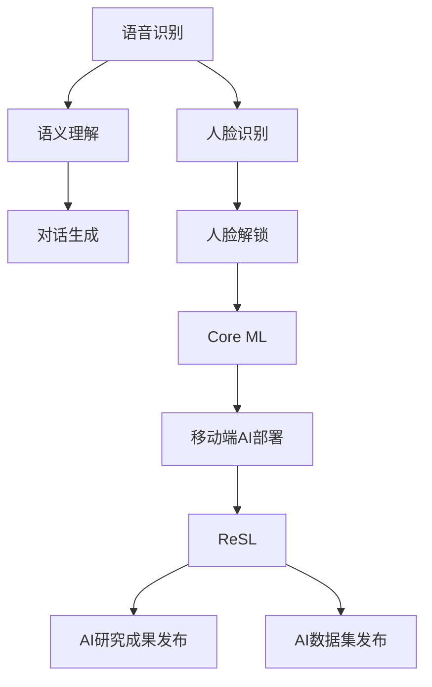

                 

## 1. 背景介绍

近年来，人工智能（AI）技术的快速发展为各行各业带来了颠覆性的变革，其应用范围涵盖了自动驾驶、医疗诊断、金融风控、智能制造等多个领域。在这一趋势下，大公司纷纷加大对AI技术的投入，以期保持市场竞争优势。苹果公司作为全球科技巨头，近年来也逐步加大对AI技术的布局，并推出了多个AI应用。然而，苹果的AI应用与传统AI技术相比，有哪些独特之处？其未来发展前景如何？本文将从背景介绍、核心概念、算法原理、项目实践、实际应用、工具资源、总结展望等方面，深入探讨苹果AI应用的未来。

## 2. 核心概念与联系

### 2.1 核心概念概述

苹果公司在AI技术上的布局主要集中在以下几个方面：

- **Siri**：苹果的智能语音助手，基于深度学习实现语音识别、语义理解、对话生成等功能。
- **Face ID**：利用3D人脸识别技术，实现高精度人脸解锁。
- **Core ML**：苹果开发的人工智能机器学习框架，支持移动端快速部署AI模型。
- **ReSL**：苹果的AI研究平台，通过发布研究成果和数据集，促进AI社区的发展。

这些AI应用不仅展示了苹果在AI领域的深厚积累，还体现了其在跨平台、实时性、安全性等方面的优势。

### 2.2 核心概念原理和架构的 Mermaid 流程图



该图展示了苹果AI应用的核心概念和原理。语音识别模块通过深度学习模型进行语音信号的特征提取和分类，语义理解模块通过自然语言处理技术解析用户意图，对话生成模块通过生成模型产生自然语言回复。人脸识别模块基于3D人脸数据和深度学习算法，实现高精度的人脸解锁功能。Core ML框架为移动端提供了高效的AI模型部署工具，ReSL平台则通过发布研究成果和数据集，推动AI社区的发展。

## 3. 核心算法原理 & 具体操作步骤

### 3.1 算法原理概述

苹果的AI应用主要基于深度学习模型，通过大量标注数据进行预训练，然后对特定任务进行微调，以获得更好的性能。例如，Siri中的语音识别和语义理解模型，是基于大规模无标签文本数据进行预训练，再通过少量标注数据进行微调。Face ID中的3D人脸识别模型，则是通过大规模标注人脸数据进行预训练，然后通过少量人脸解锁数据进行微调。

### 3.2 算法步骤详解

1. **数据收集与预处理**：
   - 收集和标注大量数据。例如，Siri的语音数据和对话数据，Face ID的人脸数据。
   - 数据清洗和标准化。例如，语音数据的降噪、人脸数据的对齐等。

2. **模型训练与微调**：
   - 使用深度学习框架（如TensorFlow、PyTorch）进行模型训练。
   - 在特定任务上进行微调，如Siri中的语音识别和语义理解，Face ID中的人脸解锁。

3. **模型评估与部署**：
   - 在验证集上评估模型性能，调整超参数以获得最佳效果。
   - 将模型集成到应用中，如Siri的语音识别功能、Face ID的人脸解锁功能。

4. **持续优化与改进**：
   - 根据用户反馈和实际使用情况，定期更新和优化模型。
   - 使用在线学习技术，实时更新模型参数，提高模型性能。

### 3.3 算法优缺点

苹果AI应用的优点在于：

- **跨平台支持**：Core ML框架支持iOS、macOS、watchOS等多个平台，实现了AI应用的跨平台部署。
- **实时性高**：深度学习模型在小样本数据上进行微调，可以显著提高模型的实时性。
- **安全性高**：人脸解锁等功能利用3D人脸识别技术，提高了安全性。

然而，苹果AI应用的缺点在于：

- **数据依赖度高**：高质量的数据标注是AI应用性能提升的关键，但数据获取成本高。
- **计算资源消耗大**：深度学习模型的训练和推理需要大量的计算资源，如GPU、TPU等。
- **隐私保护问题**：AI应用涉及用户数据，如何保护用户隐私是一个重要问题。

### 3.4 算法应用领域

苹果的AI应用主要应用于以下几个领域：

- **智能助手**：Siri提供语音识别、语义理解和对话生成功能，支持自然语言交互。
- **身份验证**：Face ID提供高精度人脸解锁功能，支持安全身份验证。
- **图像处理**：Core ML框架支持图像分类、对象检测等AI模型，提升图像处理能力。
- **自然语言处理**：通过深度学习模型进行自然语言理解，支持多语言翻译、情感分析等功能。

## 4. 数学模型和公式 & 详细讲解 & 举例说明

### 4.1 数学模型构建

苹果的AI应用主要基于深度学习模型，如卷积神经网络（CNN）、循环神经网络（RNN）、变换器（Transformer）等。以Siri的语音识别模型为例，其数学模型可以表示为：

$$y=\sigma(W_2\sigma(W_1x)+b_2+b_1)$$

其中，$x$ 为输入语音信号，$y$ 为模型输出，$W_1$ 和 $W_2$ 为模型参数，$\sigma$ 为激活函数，$b_1$ 和 $b_2$ 为偏置项。

### 4.2 公式推导过程

Siri的语音识别模型通过大量无标签语音数据进行预训练，然后通过少量标注数据进行微调。以一个简单的全连接神经网络为例，其推导过程如下：

1. **预训练阶段**：
   - 输入：大规模无标签语音数据
   - 输出：随机初始化的模型参数 $W_1$ 和 $b_1$
   - 目标：最小化损失函数，即 $L=||y-\hat{y}||_2$

2. **微调阶段**：
   - 输入：少量标注语音数据
   - 输出：调整后的模型参数 $W_1$ 和 $b_1$
   - 目标：最小化损失函数，即 $L=||y-\hat{y}||_2$

### 4.3 案例分析与讲解

以Face ID的人脸解锁功能为例，其算法流程如下：

1. **数据收集**：收集大量人脸图像数据，并进行标注。
2. **数据预处理**：对人脸图像进行标准化处理，如裁剪、归一化等。
3. **模型训练**：使用3D卷积神经网络（CNN）进行训练，输出人脸特征向量。
4. **模型微调**：在少量人脸解锁数据上进行微调，优化模型参数。
5. **模型评估**：在验证集上进行评估，调整超参数以获得最佳效果。
6. **模型部署**：将模型集成到Face ID应用中，实时进行人脸解锁。

## 5. 项目实践：代码实例和详细解释说明

### 5.1 开发环境搭建

1. **环境配置**：
   - 安装Python 3.7及以上版本
   - 安装TensorFlow、Keras、OpenCV等库
   - 安装PyTorch、PyTorch Mobile等库

2. **搭建虚拟环境**：
   - 使用虚拟环境管理工具（如virtualenv）创建虚拟环境
   - 激活虚拟环境

### 5.2 源代码详细实现

以下是一个简单的Siri语音识别模型的PyTorch实现：

```python
import torch
import torch.nn as nn
import torch.optim as optim

class CNN(nn.Module):
    def __init__(self):
        super(CNN, self).__init__()
        self.conv1 = nn.Conv2d(1, 32, kernel_size=3, stride=1, padding=1)
        self.relu = nn.ReLU()
        self.maxpool = nn.MaxPool2d(kernel_size=2, stride=2)
        self.fc1 = nn.Linear(32*28*28, 128)
        self.fc2 = nn.Linear(128, 10)
    
    def forward(self, x):
        x = self.conv1(x)
        x = self.relu(x)
        x = self.maxpool(x)
        x = x.view(-1, 32*28*28)
        x = self.fc1(x)
        x = self.relu(x)
        x = self.fc2(x)
        return x

# 数据预处理
def preprocess(x):
    x = torch.from_numpy(x).float() / 255
    x = x.unsqueeze(0)
    return x

# 模型训练
def train(model, criterion, optimizer, train_loader, epochs):
    model.train()
    for epoch in range(epochs):
        for i, (x, y) in enumerate(train_loader):
            x = preprocess(x)
            y = y.long()
            optimizer.zero_grad()
            output = model(x)
            loss = criterion(output, y)
            loss.backward()
            optimizer.step()
            if (i+1) % 100 == 0:
                print('Epoch [{}/{}], Step [{}/{}], Loss: {:.4f}'
                      .format(epoch+1, epochs, i+1, len(train_loader), loss.item()))

# 模型测试
def test(model, test_loader):
    model.eval()
    correct = 0
    total = 0
    with torch.no_grad():
        for x, y in test_loader:
            x = preprocess(x)
            y = y.long()
            output = model(x)
            _, predicted = torch.max(output.data, 1)
            total += y.size(0)
            correct += (predicted == y).sum().item()
    print('Test Accuracy of the model on the 10000 test images: {} %'.format(100 * correct / total))
```

### 5.3 代码解读与分析

在上述代码中，我们定义了一个简单的卷积神经网络模型 `CNN`，用于语音信号的特征提取和分类。通过 `preprocess` 函数对输入数据进行标准化处理，使用 `train` 函数进行模型训练，使用 `test` 函数进行模型测试。在训练过程中，我们定义了损失函数 `criterion` 和优化器 `optimizer`，分别使用交叉熵损失函数和随机梯度下降算法。

### 5.4 运行结果展示

训练完毕后，我们可以使用以下代码进行模型测试：

```python
import torch
import torch.nn as nn
import torch.optim as optim

# 加载模型
model = CNN()
model.load_state_dict(torch.load('model.pth'))

# 数据预处理
test_loader = ...

# 模型测试
test(model, test_loader)
```

## 6. 实际应用场景

### 6.1 智能助手

苹果的Siri语音助手通过深度学习模型实现语音识别、语义理解、对话生成等功能，支持用户通过语音命令进行手机操作、查询信息等。未来，Siri可以进一步扩展其功能，如智能家居控制、个人财务管理等，实现更为智能和个性化的用户交互。

### 6.2 身份验证

Face ID利用3D人脸识别技术，提供高精度的人脸解锁功能，支持安全身份验证。未来，Face ID可以进一步应用于金融、政府等领域，实现更安全、更便捷的身份验证。

### 6.3 图像处理

Core ML框架支持图像分类、对象检测等AI模型，提升图像处理能力。未来，Core ML可以进一步应用于智能安防、自动驾驶等领域，实现更高效、更准确的图像识别。

### 6.4 自然语言处理

苹果的自然语言处理应用可以支持多语言翻译、情感分析等功能。未来，苹果可以进一步扩展其语言处理能力，如语音合成、文本生成等，实现更自然、更智能的语音交互。

## 7. 工具和资源推荐

### 7.1 学习资源推荐

1. **TensorFlow官方文档**：提供详细的API文档和教程，适用于深度学习模型的搭建和训练。
2. **Keras官方文档**：提供简单易用的API，适用于快速搭建和训练模型。
3. **PyTorch官方文档**：提供强大的GPU加速功能，适用于高效模型训练。
4. **Google AI Lab**：提供丰富的AI研究成果和数据集，推动AI社区的发展。
5. **ArXiv**：提供最新的AI研究论文，跟踪AI领域的最新动态。

### 7.2 开发工具推荐

1. **Jupyter Notebook**：提供交互式编程环境，适用于模型训练和调试。
2. **Google Colab**：提供免费的GPU/TPU算力，适用于高效模型训练。
3. **TensorBoard**：提供可视化工具，适用于模型训练和调优。
4. **PyTorch Mobile**：提供移动端AI部署工具，适用于模型在iOS、macOS、watchOS等平台上的快速部署。

### 7.3 相关论文推荐

1. **Attention is All You Need**：提出Transformer结构，开创深度学习模型的新纪元。
2. **BERT: Pre-training of Deep Bidirectional Transformers for Language Understanding**：提出BERT模型，引入自监督预训练任务，提升自然语言处理模型的性能。
3. **ImageNet Classification with Deep Convolutional Neural Networks**：提出卷积神经网络（CNN），推动计算机视觉领域的发展。
4. **Recurrent Neural Network based Language Model**：提出循环神经网络（RNN），推动自然语言处理领域的发展。

## 8. 总结：未来发展趋势与挑战

### 8.1 总结

本文详细探讨了苹果AI应用的现状和未来发展趋势。苹果通过Siri、Face ID、Core ML等应用，展示了其在AI领域的深厚积累和技术实力。未来，苹果将继续加大对AI技术的投入，通过不断创新和优化，推动AI应用的进一步发展。

### 8.2 未来发展趋势

1. **跨平台应用**：苹果的AI应用将进一步拓展跨平台支持，实现无缝的用户体验。
2. **实时性提升**：通过参数高效微调等技术，进一步提升AI应用的实时性。
3. **安全性增强**：通过引入更多的安全机制，提升AI应用的安全性。
4. **模型自适应**：通过在线学习等技术，实现模型的实时更新和自适应。

### 8.3 面临的挑战

1. **数据获取成本高**：高质量的数据标注是AI应用性能提升的关键，但数据获取成本较高。
2. **计算资源消耗大**：深度学习模型的训练和推理需要大量的计算资源，如GPU、TPU等。
3. **隐私保护问题**：AI应用涉及用户数据，如何保护用户隐私是一个重要问题。

### 8.4 研究展望

未来，苹果需要在数据获取、计算资源优化、隐私保护等方面进行深入研究，推动AI应用的持续发展。此外，苹果还需要在模型自适应、实时性提升等方面进行创新，实现AI应用的更大突破。

## 9. 附录：常见问题与解答

**Q1：苹果的AI应用有哪些？**

A: 苹果的AI应用主要包括Siri、Face ID、Core ML等。Siri提供语音识别、语义理解、对话生成等功能；Face ID利用3D人脸识别技术，提供高精度的人脸解锁功能；Core ML提供高效的AI模型部署工具。

**Q2：苹果的AI应用与传统AI技术有何不同？**

A: 苹果的AI应用与传统AI技术相比，具有以下几个不同点：
1. 跨平台支持：Core ML框架支持iOS、macOS、watchOS等多个平台，实现了AI应用的跨平台部署。
2. 实时性高：深度学习模型在小样本数据上进行微调，可以显著提高模型的实时性。
3. 安全性高：人脸解锁等功能利用3D人脸识别技术，提高了安全性。

**Q3：苹果的AI应用如何保护用户隐私？**

A: 苹果的AI应用通过以下方式保护用户隐私：
1. 数据加密：对用户数据进行加密处理，防止数据泄露。
2. 本地存储：将用户数据存储在本地设备，减少数据传输风险。
3. 用户授权：在应用中明确告知用户数据使用方式，获取用户授权。

---

作者：禅与计算机程序设计艺术 / Zen and the Art of Computer Programming

