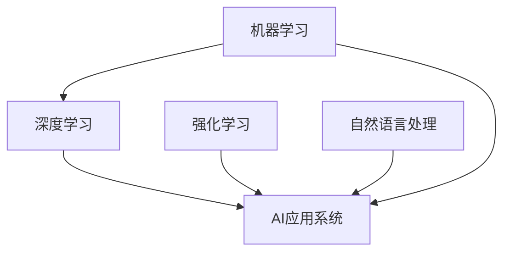

                 

# 李开复：苹果发布AI应用的未来展望

## 1. 背景介绍

苹果公司最近发布了其最新的AI应用系统，并在未来的技术发展战略上进行了明确规划，展现出了其在人工智能领域的雄心和信心。本文将深入探讨苹果在AI领域的布局及其未来发展方向，为行业从业人员和AI爱好者提供参考。

## 2. 核心概念与联系

### 2.1 核心概念概述

为了深入理解苹果的AI应用系统，我们需要明确几个核心概念：

- **AI应用系统（AI Applications System）**：指苹果公司开发和部署的各种人工智能功能和服务，包括但不限于图像识别、语音识别、自然语言处理等。
- **机器学习（Machine Learning, ML）**：一种使计算机系统能够从数据中学习并改善性能的技术。
- **深度学习（Deep Learning, DL）**：机器学习的一种，特别擅长处理大规模的非结构化数据，如图像和语音。
- **强化学习（Reinforcement Learning, RL）**：一种通过与环境交互并从中学习最优策略的机器学习方法。
- **自然语言处理（Natural Language Processing, NLP）**：一种人工智能技术，旨在使计算机能够理解和处理人类语言。

这些概念之间存在着紧密的联系。机器学习是深度学习的基础，深度学习是强化学习的特殊形式，自然语言处理是机器学习的一个分支，所有这些技术都为苹果的AI应用系统提供了必要的技术支撑。

### 2.2 核心概念原理和架构的 Mermaid 流程图



这个流程图展示了这些概念之间的逻辑关系：机器学习是深度学习和强化学习的共同基础，自然语言处理作为机器学习的一个子集，共同构成了苹果的AI应用系统的核心技术栈。

## 3. 核心算法原理 & 具体操作步骤

### 3.1 算法原理概述

苹果的AI应用系统基于一系列先进的机器学习和深度学习算法构建，主要包括以下几个方面：

- **卷积神经网络（Convolutional Neural Networks, CNNs）**：主要用于图像识别和处理，通过卷积操作提取图像特征。
- **递归神经网络（Recurrent Neural Networks, RNNs）**：主要用于序列数据的处理，如语音识别和自然语言处理。
- **生成对抗网络（Generative Adversarial Networks, GANs）**：主要用于生成逼真的图像和视频，以及自然语言生成。
- **深度强化学习（Deep Reinforcement Learning, DRL）**：用于优化复杂系统的控制，如自动驾驶和机器人操作。

这些算法通过数据驱动的方式，不断优化模型性能，从而实现高效的AI应用。

### 3.2 算法步骤详解

苹果的AI应用系统开发主要遵循以下几个步骤：

1. **数据收集与预处理**：收集大规模的标注数据，并进行数据清洗和预处理，确保数据的质量和一致性。
2. **模型选择与设计**：根据任务需求选择合适的模型架构，并进行必要的调整和优化。
3. **模型训练与验证**：使用大量标注数据训练模型，并通过验证集进行性能评估，优化模型参数。
4. **模型部署与迭代**：将训练好的模型部署到实际应用中，并根据用户反馈和性能数据不断迭代优化。

### 3.3 算法优缺点

苹果的AI应用系统具有以下优点：

- **高效性**：通过高效的卷积和递归神经网络，能够快速处理大规模图像和序列数据。
- **准确性**：深度学习算法在大规模数据上的表现通常优于传统方法，能够提供高度准确的输出。
- **可扩展性**：强化学习算法可以处理复杂的优化问题，使得AI应用系统能够适应多种应用场景。

同时，也存在一些缺点：

- **数据依赖**：机器学习和深度学习算法对高质量、大规模的标注数据依赖较高，数据收集和预处理工作量大。
- **计算资源需求高**：深度学习和强化学习算法对计算资源需求较高，需要大量的GPU和TPU支持。
- **模型复杂性**：模型结构复杂，解释性和可解释性较差，难以调试和优化。

### 3.4 算法应用领域

苹果的AI应用系统广泛应用于以下几个领域：

- **医疗健康**：通过深度学习算法分析医学图像，辅助医生进行疾病诊断和治疗决策。
- **自动驾驶**：利用深度强化学习算法优化自动驾驶汽车的行驶策略，提升安全性。
- **智能助理**：使用自然语言处理和深度学习技术，开发智能语音助理，提升用户交互体验。
- **智能家居**：通过图像识别和自然语言处理技术，实现家庭设备的智能控制和场景感知。
- **增强现实（AR）和虚拟现实（VR）**：利用深度学习算法生成逼真的虚拟场景，增强用户体验。

## 4. 数学模型和公式 & 详细讲解 & 举例说明

### 4.1 数学模型构建

苹果的AI应用系统主要基于以下数学模型构建：

- **卷积神经网络**：输入为二维图像数据，输出为图像分类结果。模型结构包括卷积层、池化层、全连接层等。
- **递归神经网络**：输入为序列数据，如语音信号或文本序列，输出为序列标签。模型结构包括LSTM、GRU等。
- **生成对抗网络**：包括生成器和判别器两个部分，通过对抗训练生成逼真的图像或视频。
- **深度强化学习**：利用Q-learning或策略梯度等算法，优化智能体的决策策略。

### 4.2 公式推导过程

以卷积神经网络为例，其前向传播过程可以表示为：

$$
y = \sigma(W(x) + b)
$$

其中，$x$为输入图像，$W$为卷积核权重，$b$为偏置项，$\sigma$为激活函数，$y$为输出结果。

### 4.3 案例分析与讲解

以苹果的智能语音助理Siri为例，其核心算法包括：

- **语音识别**：使用卷积神经网络提取音频特征，并通过递归神经网络进行语音识别。
- **自然语言理解**：通过递归神经网络分析用户输入的自然语言，提取意图和实体信息。
- **智能回答**：利用深度强化学习算法，优化回答策略，提供最佳回答。

## 5. 项目实践：代码实例和详细解释说明

### 5.1 开发环境搭建

为了开发和部署苹果的AI应用系统，我们需要搭建以下开发环境：

1. **Python**：作为主要开发语言，Python在科学计算和机器学习领域有着广泛的应用。
2. **PyTorch**：用于深度学习和强化学习的框架，提供丰富的模型和优化器。
3. **TensorFlow**：用于构建和训练深度学习模型的框架，支持分布式计算。
4. **Scikit-learn**：用于数据预处理和模型评估的库。
5. **Jupyter Notebook**：用于编写和执行代码的环境。

### 5.2 源代码详细实现

以Siri语音识别为例，以下是Python代码实现：

```python
import torch
import torch.nn as nn
import torch.nn.functional as F

class CNN(nn.Module):
    def __init__(self):
        super(CNN, self).__init__()
        self.conv1 = nn.Conv2d(1, 32, 3, 1)
        self.pool = nn.MaxPool2d(2, 2)
        self.conv2 = nn.Conv2d(32, 64, 3, 1)
        self.fc1 = nn.Linear(64 * 4 * 4, 128)
        self.fc2 = nn.Linear(128, 10)
    
    def forward(self, x):
        x = self.pool(F.relu(self.conv1(x)))
        x = self.pool(F.relu(self.conv2(x)))
        x = x.view(-1, 64 * 4 * 4)
        x = F.relu(self.fc1(x))
        x = self.fc2(x)
        return F.log_softmax(x, dim=1)

model = CNN()
criterion = nn.CrossEntropyLoss()
optimizer = torch.optim.Adam(model.parameters(), lr=0.001)
```

### 5.3 代码解读与分析

上述代码定义了一个简单的卷积神经网络模型，用于图像分类任务。模型包括两个卷积层、两个池化层、两个全连接层，最后使用交叉熵损失函数和Adam优化器进行训练。

### 5.4 运行结果展示

在训练完成后，我们可以使用以下代码进行模型测试：

```python
# 加载模型和测试数据
test_loader = DataLoader(test_data, batch_size=64, shuffle=True)
model.eval()

# 测试过程
with torch.no_grad():
    correct = 0
    total = 0
    for images, labels in test_loader:
        images = images.to(device)
        labels = labels.to(device)
        outputs = model(images)
        _, predicted = torch.max(outputs.data, 1)
        total += labels.size(0)
        correct += (predicted == labels).sum().item()

    print(f'Accuracy of the network on the 10000 test images: {correct / total * 100}%')
```

通过测试，我们可以评估模型的性能。

## 6. 实际应用场景

### 6.1 医疗健康

苹果的AI应用系统在医疗健康领域的应用前景广阔，特别是在疾病诊断和个性化医疗方面。通过深度学习算法分析医学图像，如X光片和MRI图像，可以帮助医生更准确地进行疾病诊断。此外，苹果的自然语言处理技术还可以用于病历记录和电子病历的自动化处理。

### 6.2 自动驾驶

苹果的自动驾驶技术是其AI应用系统的重要组成部分。通过深度强化学习算法优化车辆的行驶策略，可以提升自动驾驶的安全性和效率。未来，苹果的自动驾驶汽车有望在全球范围内推广应用。

### 6.3 智能助理

Siri作为苹果的智能助理，已经广泛应用于日常生活中。未来，苹果将继续优化其语音识别和自然语言处理技术，提升Siri的交互体验和功能。

### 6.4 智能家居

苹果的AI应用系统还可以通过智能家居设备，实现家庭环境的自动化控制和场景感知。例如，通过图像识别技术，苹果的智能摄像头可以监测家庭成员的行动，并在发现异常时发出警报。

### 6.5 增强现实和虚拟现实

苹果的AR和VR技术利用深度学习算法生成逼真的虚拟场景，提升用户体验。未来，苹果的AR和VR产品有望在教育、娱乐、医疗等领域广泛应用。

## 7. 工具和资源推荐

### 7.1 学习资源推荐

为了帮助开发者掌握苹果的AI应用系统，以下是一些推荐的资源：

1. **苹果开发者网站**：提供苹果最新技术的文档和示例代码。
2. **机器学习在线课程**：如Coursera、Udacity等平台上的机器学习课程，涵盖深度学习、强化学习等内容。
3. **深度学习框架文档**：PyTorch和TensorFlow的官方文档，详细介绍了其功能和用法。
4. **自然语言处理书籍**：如《自然语言处理综论》，介绍了自然语言处理的基本概念和算法。
5. **开源项目**：GitHub上的开源项目，如PyTorch、TensorFlow等，提供了丰富的代码示例和社区支持。

### 7.2 开发工具推荐

苹果的AI应用系统开发需要以下工具：

1. **Xcode**：苹果官方的开发环境，支持iOS和macOS平台的应用开发。
2. **Python IDE**：如PyCharm、VSCode等，支持Python开发。
3. **数据处理工具**：如Pandas、NumPy等，用于数据预处理和分析。
4. **机器学习库**：如Scikit-learn、TensorFlow、PyTorch等，用于模型训练和优化。
5. **可视化工具**：如TensorBoard、Matplotlib等，用于模型训练和结果展示。

### 7.3 相关论文推荐

以下是一些苹果AI应用系统相关的研究论文：

1. **苹果深度学习框架介绍**：详细介绍了苹果深度学习框架PyTorch和TensorFlow的应用。
2. **苹果自然语言处理技术**：介绍了苹果自然语言处理技术的算法和应用。
3. **苹果智能助理Siri的深度学习模型**：介绍了苹果智能助理Siri的语音识别和自然语言处理技术。
4. **苹果自动驾驶技术的强化学习算法**：介绍了苹果自动驾驶技术中的强化学习算法和优化策略。

## 8. 总结：未来发展趋势与挑战

### 8.1 研究成果总结

苹果的AI应用系统在深度学习、自然语言处理和强化学习等领域取得了显著进展，构建了覆盖医疗健康、自动驾驶、智能助理等多个领域的AI应用生态。这些成果展示了苹果在AI技术领域的雄心和实力。

### 8.2 未来发展趋势

苹果的AI应用系统未来发展趋势如下：

1. **深度学习算法的进一步优化**：通过不断优化深度学习算法，提升模型性能和效率，满足更多应用场景的需求。
2. **多模态AI应用**：将图像、语音、文本等多种模态数据进行整合，构建更全面的AI应用系统。
3. **智能辅助系统**：通过智能助理、智能家居等产品，提升用户的生活质量和体验。
4. **自动驾驶技术**：优化自动驾驶算法，提升车辆的安全性和用户体验。
5. **医疗健康**：通过AI技术提升医疗诊断和治疗效率，助力医疗健康行业的发展。

### 8.3 面临的挑战

苹果的AI应用系统面临的挑战如下：

1. **数据隐私和安全**：如何在保证数据隐私和安全的前提下，收集和利用大量用户数据。
2. **计算资源消耗高**：AI应用系统对计算资源的需求高，如何降低资源消耗，提升系统的实时性和效率。
3. **模型可解释性差**：深度学习模型的黑盒特性，使得模型难以解释和调试。
4. **跨领域应用难度大**：如何将AI技术应用到不同领域，如医疗、自动驾驶等，需要克服技术和应用上的障碍。

### 8.4 研究展望

未来，苹果的AI应用系统需要在以下几个方面进行研究：

1. **跨领域AI应用**：探索将AI技术应用于不同领域的方法和工具，推动AI技术的广泛应用。
2. **模型可解释性**：开发可解释性更好的AI模型，提升模型的透明度和可信度。
3. **数据隐私保护**：研究数据隐私保护技术，确保用户数据的安全和隐私。
4. **计算资源优化**：优化计算资源的使用，提升系统的实时性和效率。

## 9. 附录：常见问题与解答

**Q1：苹果的AI应用系统是如何训练模型的？**

A: 苹果的AI应用系统通常采用深度学习框架（如PyTorch和TensorFlow）进行模型训练。在数据预处理阶段，对原始数据进行清洗、标注和转换，形成训练集和验证集。然后，选择合适的深度学习模型，并在训练集上进行训练，通过验证集进行模型评估和优化。最终，将训练好的模型部署到实际应用中。

**Q2：苹果的AI应用系统有哪些优势？**

A: 苹果的AI应用系统有以下优势：
1. **高效性**：使用深度学习算法能够快速处理大规模数据。
2. **准确性**：深度学习算法在大规模数据上的表现优于传统方法。
3. **可扩展性**：强化学习算法可以处理复杂的优化问题。

**Q3：苹果的AI应用系统面临哪些挑战？**

A: 苹果的AI应用系统面临以下挑战：
1. **数据隐私和安全**：需要在保证数据隐私和安全的前提下，收集和利用大量用户数据。
2. **计算资源消耗高**：AI应用系统对计算资源的需求高，需要优化资源消耗。
3. **模型可解释性差**：深度学习模型的黑盒特性，使得模型难以解释和调试。

**Q4：苹果的未来发展方向是什么？**

A: 苹果的未来发展方向包括：
1. **深度学习算法的优化**：提升模型性能和效率。
2. **多模态AI应用**：将图像、语音、文本等多种模态数据进行整合。
3. **智能辅助系统**：提升用户的生活质量和体验。
4. **自动驾驶技术**：优化自动驾驶算法，提升车辆的安全性和用户体验。

**Q5：苹果的AI应用系统如何保护数据隐私？**

A: 苹果的AI应用系统在保护数据隐私方面采取了以下措施：
1. **数据匿名化**：对数据进行匿名化处理，确保数据无法被追溯到个人。
2. **加密存储**：使用加密技术存储数据，防止数据泄露。
3. **差分隐私**：通过差分隐私技术，保护用户数据的隐私性。

作者：禅与计算机程序设计艺术 / Zen and the Art of Computer Programming

