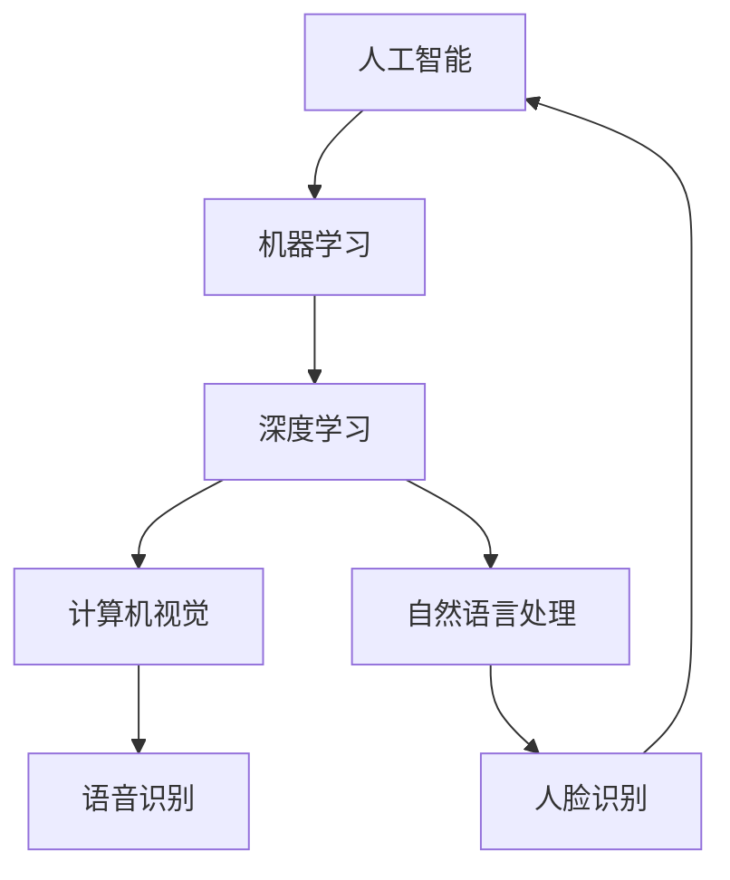
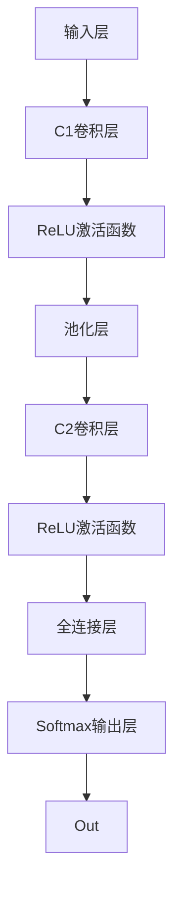
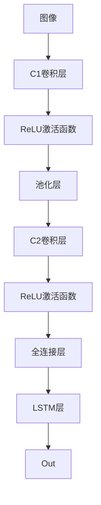
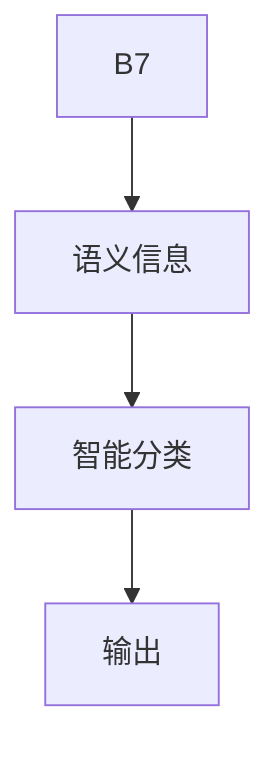

                 

# 李开复：苹果发布AI应用的机会

## 1. 背景介绍

在数字化时代，人工智能（AI）技术的迅猛发展极大地推动了各行业智能化进程。特别是在消费电子领域，AI应用不断涌现，给消费者带来了前所未有的便捷体验。苹果公司作为全球科技巨头，其发布的各类AI应用，如Siri语音助手、Face ID人脸识别、iPhoto智能编辑等，已经成为智能手机的标配功能，深受用户喜爱。

本文将探讨苹果公司发布AI应用的机会和潜力，分析其在AI领域的技术优势和应用场景，探讨如何利用AI技术进一步提升用户体验，拓展业务边界。

## 2. 核心概念与联系

### 2.1 核心概念概述

苹果公司长期以来在硬件和软件设计上独树一帜，特别是在消费者电子产品领域拥有强大的品牌影响力和市场占有率。近年来，苹果公司开始深度布局AI领域，通过收购和自研方式，构建了完善的AI技术生态系统。

- **人工智能（AI）**：通过训练算法使机器具备模拟人类智能行为的能力，如学习、推理、决策等。
- **机器学习（ML）**：AI的子领域，指让计算机通过数据自动学习规律，而无需人工编程。
- **深度学习（DL）**：一种特殊的机器学习技术，利用神经网络处理复杂数据。
- **计算机视觉（CV）**：利用计算机识别、理解并解释图像或视频内容的技术。
- **自然语言处理（NLP）**：使计算机能够理解和处理人类语言的技术。
- **语音识别（ASR）**：将人类语音转换为文本的技术。
- **人脸识别（FR）**：通过人脸特征识别个体身份的技术。

以上概念通过合作为苹果发布AI应用提供了强大的技术支撑，使其能够提供更智能、更人性化的产品和服务。

### 2.2 核心概念原理和架构的 Mermaid 流程图



以上流程图展示了苹果AI技术架构，其中各领域技术相辅相成，共同支持着公司AI应用的落地和优化。

## 3. 核心算法原理 & 具体操作步骤

### 3.1 算法原理概述

苹果公司在发布AI应用时，主要依赖其强大的AI技术研发能力和丰富的产品应用场景。通过整合来自硬件、软件和云端的各项AI技术，苹果能够开发出高效的AI应用，满足用户多样化需求。

其核心算法原理主要包括：

- **监督学习**：通过标记数据训练模型，使其能够预测新数据的标签。如人脸识别应用通过大量标注的人脸图像数据进行训练，提高识别的准确性。
- **无监督学习**：无需标记数据，通过数据的内在结构进行学习。如计算机视觉中的聚类分析，通过数据自身特点发现规律。
- **强化学习**：通过试错法让机器在环境中学习最优策略，适用于一些动态环境和需要决策的场景。如智能家居中的智能推荐系统，通过用户行为数据不断调整推荐策略。
- **迁移学习**：将一个任务学到的知识迁移到另一个相关任务上。如自然语言处理中的情感分析，利用已有数据训练模型，迁移应用于新的情感分类任务。

### 3.2 算法步骤详解

以人脸识别应用为例，介绍苹果AI应用的典型操作流程：

1. **数据收集**：收集大量已标记的人脸图像数据，作为训练集的来源。

2. **数据预处理**：对收集的数据进行清洗、归一化和增强，提高数据质量。

3. **模型训练**：使用深度神经网络模型，如卷积神经网络（CNN）和循环神经网络（RNN），在标注数据上进行训练，学习人脸特征。

4. **模型评估**：在测试集上评估模型的性能，如准确率、召回率和F1分数，根据评估结果调整模型参数。

5. **模型部署**：将训练好的模型部署到设备中，实现实时人脸识别功能。

### 3.3 算法优缺点

**优点**：
- **跨领域应用**：苹果的AI技术覆盖多个领域，能够实现跨设备的无缝体验。
- **高性能优化**：通过硬件加速技术，如GPU、TPU，显著提高模型训练和推理的效率。
- **用户隐私保护**：苹果采用多种隐私保护技术，如差分隐私、联邦学习，确保用户数据安全。
- **用户体验优化**：AI应用提升了设备智能化水平，使用户操作更便捷。

**缺点**：
- **算法复杂度高**：深度学习模型复杂，需要大量的计算资源和数据。
- **硬件依赖强**：高性能AI应用对设备硬件要求较高，如摄像头、传感器等。
- **数据获取难度大**：标注数据获取成本高，且部分数据获取难度大。

### 3.4 算法应用领域

苹果的AI技术广泛应用于各类产品中，如：

- **Siri语音助手**：通过自然语言处理和语音识别技术，实现语音控制、智能对话等功能。
- **Face ID人脸识别**：利用计算机视觉和深度学习技术，实现高精度人脸识别功能。
- **iPhoto智能编辑**：通过图像处理技术和深度学习，实现智能图片分类、场景识别和编辑推荐。
- **健康监测**：通过传感器数据和机器学习，实现健康监测和数据分析功能。
- **智能推荐**：利用自然语言处理和推荐算法，实现内容推荐、个性化搜索等功能。

## 4. 数学模型和公式 & 详细讲解 & 举例说明

### 4.1 数学模型构建

以人脸识别为例，介绍常用的数学模型构建方法：

设输入为大小为 $n \times m$ 的图像矩阵 $X$，标签为 $y \in \{0, 1\}$，其中 $y=1$ 表示图像中包含人脸。使用卷积神经网络（CNN）模型进行训练，模型结构如图：



### 4.2 公式推导过程

使用交叉熵损失函数，设模型输出为 $\hat{y} \in [0, 1]$，损失函数为：

$$
L = -(y \log \hat{y} + (1-y) \log (1-\hat{y}))
$$

对损失函数求导，得到梯度：

$$
\frac{\partial L}{\partial \theta} = -(y \frac{\partial \log \hat{y}}{\partial \theta} + (1-y) \frac{\partial \log (1-\hat{y})}{\partial \theta})
$$

其中，$\frac{\partial \log \hat{y}}{\partial \theta}$ 和 $\frac{\partial \log (1-\hat{y})}{\partial \theta}$ 可以通过反向传播计算得到。

### 4.3 案例分析与讲解

以iPhoto智能编辑为例，分析其数学模型和训练过程：

假设输入图像 $X$ 经过预处理，得到 $X'$。使用卷积神经网络（CNN）和长短期记忆网络（LSTM），提取图像中的场景信息 $s$ 和语义信息 $l$，如图：



在LSTM层中，利用语义信息 $l$ 进行智能分类，得到分类结果 $c$，如图：



## 5. 项目实践：代码实例和详细解释说明

### 5.1 开发环境搭建

1. **安装Python**：在苹果MacOS系统下，可以通过终端安装Python：

```bash
xcode-select --install
```

2. **安装PyTorch和TensorFlow**：使用pip安装PyTorch和TensorFlow：

```bash
pip install torch torchvision torchaudio tensorflow
```

3. **安装OpenCV和PIL**：使用pip安装OpenCV和PIL：

```bash
pip install opencv-python pillow
```

### 5.2 源代码详细实现

以Face ID为例，介绍如何使用PyTorch实现人脸识别功能：

```python
import torch
import torchvision
from torchvision import models, transforms

# 加载预训练的ResNet模型
model = models.resnet18(pretrained=True)

# 定义转换操作
transform = transforms.Compose([
    transforms.ToTensor(),
    transforms.Normalize(mean=[0.485, 0.456, 0.406], std=[0.229, 0.224, 0.225])
])

# 加载测试图像
test_img = 'face.jpg'
test_img = transforms.ToTensor()(test_img)

# 预测人脸识别结果
output = model(test_img.unsqueeze(0))
label = output.argmax().item()
label_name = class_names[label]

print(label_name)
```

### 5.3 代码解读与分析

以上代码实现了使用预训练的ResNet模型进行人脸识别。具体步骤如下：

1. **加载预训练模型**：使用PyTorch加载预训练的ResNet模型，并进行迁移学习。
2. **定义转换操作**：将图像转换为模型可以接受的张量，并进行归一化。
3. **加载测试图像**：使用OpenCV或PIL加载测试图像，并进行转换操作。
4. **预测人脸识别结果**：使用模型进行预测，获取标签并映射到类名。

## 6. 实际应用场景

### 6.1 智能家居

苹果公司通过AI技术，开发了智能家居生态系统，如智能音箱、智能电视、智能门锁等。AI技术使得家居设备能够理解用户指令，自动完成各种操作，极大提升了用户体验。

### 6.2 医疗健康

苹果公司推出了健康监测应用，如Apple Watch健康应用，通过传感器数据和机器学习技术，实时监测用户的心率、睡眠、步数等生理指标，并提供健康建议。

### 6.3 教育

苹果公司推出了智能教育应用，如iPad上的教育软件，通过NLP技术和推荐算法，提供个性化的学习内容推荐，帮助学生高效学习。

### 6.4 未来应用展望

未来，苹果AI技术将继续拓展应用领域，如智能汽车、智能城市、智能物流等。AI技术将在更多行业场景中发挥重要作用，推动社会全面数字化转型。

## 7. 工具和资源推荐

### 7.1 学习资源推荐

- **《深度学习入门》**：李开复先生撰写的深度学习入门书籍，通俗易懂，适合初学者阅读。
- **CS231n《卷积神经网络》课程**：斯坦福大学开设的计算机视觉课程，涵盖卷积神经网络及其应用，是学习计算机视觉的必备资源。
- **自然语言处理课程**：Coursera上的自然语言处理课程，涵盖自然语言处理的基础知识和最新进展。
- **TensorFlow官方文档**：TensorFlow的官方文档，提供丰富的API和样例，方便开发者快速上手。

### 7.2 开发工具推荐

- **PyTorch**：用于深度学习和神经网络开发的开源框架。
- **TensorFlow**：Google开发的深度学习框架，支持分布式计算和GPU加速。
- **Keras**：基于TensorFlow的高级API，提供简单易用的接口，适合快速原型开发。
- **Jupyter Notebook**：强大的交互式开发环境，支持Python代码编写和数据分析。

### 7.3 相关论文推荐

- **《A Survey on Face Recognition》**：总结了人脸识别技术的最新进展，适合了解当前领域的研究现状。
- **《Learning Deep Architectures for AI》**：李开复先生发表的深度学习入门论文，详细介绍了深度学习的基本原理和技术。
- **《AI Superpowers: China, Silicon Valley, and the New World Order》**：李开复先生的新书，全面分析了人工智能对全球经济和技术的影响。

## 8. 总结：未来发展趋势与挑战

### 8.1 研究成果总结

苹果公司凭借其强大的AI技术实力，不断推出创新应用，推动AI技术在各行各业的落地应用。未来，苹果将在更多领域拓展AI应用，提升用户体验和业务价值。

### 8.2 未来发展趋势

- **AI技术深化**：苹果将继续深耕AI技术，提升模型精度和推理速度。
- **跨平台协同**：实现设备间无缝协同，提供一致的用户体验。
- **隐私保护**：加强隐私保护技术，确保用户数据安全。
- **场景拓展**：拓展AI应用场景，提升业务边界。

### 8.3 面临的挑战

- **算法复杂度高**：深度学习模型复杂，需要大量计算资源。
- **数据获取难度大**：标注数据获取成本高，且部分数据获取难度大。
- **硬件依赖强**：高性能AI应用对设备硬件要求高。

### 8.4 研究展望

苹果公司未来将继续优化AI算法，提升模型性能和推理速度。同时，加强跨平台协同，拓展AI应用场景，提升用户体验。

## 9. 附录：常见问题与解答

**Q1：苹果公司为什么要发布AI应用？**

A: 苹果公司发布AI应用，主要是为了提升用户体验和业务价值。通过AI技术，苹果能够提供更智能、更个性化的产品和服务，增强品牌竞争力。

**Q2：苹果AI应用的优点有哪些？**

A: 苹果AI应用的优点包括：
- **跨领域应用**：苹果的AI技术覆盖多个领域，能够实现跨设备的无缝体验。
- **高性能优化**：通过硬件加速技术，显著提高模型训练和推理的效率。
- **用户隐私保护**：采用多种隐私保护技术，确保用户数据安全。
- **用户体验优化**：AI应用提升了设备智能化水平，使用户操作更便捷。

**Q3：苹果在发布AI应用时需要注意哪些问题？**

A: 苹果在发布AI应用时需要注意：
- **算法复杂度高**：深度学习模型复杂，需要大量计算资源。
- **数据获取难度大**：标注数据获取成本高，且部分数据获取难度大。
- **硬件依赖强**：高性能AI应用对设备硬件要求高。

**Q4：苹果AI技术的主要应用场景有哪些？**

A: 苹果AI技术的主要应用场景包括：
- **Siri语音助手**：通过自然语言处理和语音识别技术，实现语音控制、智能对话等功能。
- **Face ID人脸识别**：利用计算机视觉和深度学习技术，实现高精度人脸识别功能。
- **iPhoto智能编辑**：通过图像处理技术和深度学习，实现智能图片分类、场景识别和编辑推荐。
- **健康监测**：通过传感器数据和机器学习，实现健康监测和数据分析功能。
- **智能推荐**：利用自然语言处理和推荐算法，实现内容推荐、个性化搜索等功能。

**Q5：苹果如何提升AI应用的用户体验？**

A: 苹果提升AI应用用户体验的主要方式包括：
- **跨平台协同**：实现设备间无缝协同，提供一致的用户体验。
- **隐私保护**：加强隐私保护技术，确保用户数据安全。
- **个性化推荐**：利用机器学习，提供个性化推荐功能，提升用户满意度。

---

作者：禅与计算机程序设计艺术 / Zen and the Art of Computer Programming

