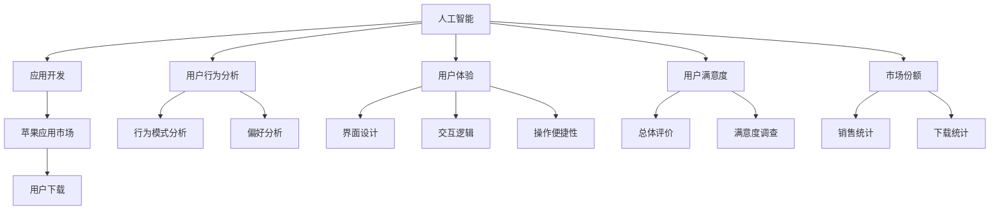

                 

# 李开复：苹果发布AI应用的用户

## 1. 背景介绍

### 1.1 问题由来

在全球科技产业风起云涌的今天，人工智能(AI)已成为推动各行各业创新发展的重要引擎。苹果公司作为全球领先的科技巨头，近年来在AI领域展开了诸多布局，其中苹果应用市场的应用软件生态尤为引人关注。本文将从李开复的观点出发，深入探讨苹果AI应用的用户行为，及其对AI领域的影响。

### 1.2 问题核心关键点

用户如何响应和利用苹果发布的AI应用，这不仅仅是苹果公司需要考虑的问题，也是AI行业乃至整个科技产业关注的焦点。以下是几个关键问题：

1. 苹果公司发布的AI应用如何被用户接受和使用？
2. 用户对AI应用的使用行为和体验有何反馈？
3. 用户对AI应用的依赖程度及其对苹果生态系统的影响？
4. 苹果AI应用的创新点、市场定位及其在AI领域的竞争策略？
5. 苹果AI应用的未来发展方向和趋势，以及AI技术对苹果公司整体战略的影响？

通过对这些关键问题的探讨，旨在全面分析苹果AI应用的现状，预测未来趋势，并对AI技术在实际应用中的效果做出深入评估。

## 2. 核心概念与联系

### 2.1 核心概念概述

1. **人工智能**：指通过计算机技术实现智能决策和行为模拟的技术，旨在模拟人类认知、学习、推理等能力。

2. **苹果应用市场**：指苹果公司提供的第三方应用软件下载和分发平台，用户可以在此下载各种应用程序，涵盖娱乐、办公、教育、健康等多个领域。

3. **AI应用**：指应用人工智能技术开发和发布的软件，可以自动完成一些复杂任务，如语音识别、图像处理、自然语言处理等。

4. **用户行为分析**：指通过数据分析和研究，了解用户在使用产品时的行为模式和偏好，从而优化产品设计和服务质量。

5. **用户体验(UX)**：指用户在使用产品时的感受和满意程度，包括界面设计、交互逻辑、操作便捷性等方面。

6. **用户满意度**：指用户在使用产品后对其功能、性能、可用性等方面的总体评价，通常通过调查问卷、反馈机制等方式收集。

7. **市场份额**：指产品在特定市场中的销售或下载数量占总量的比例，反映了产品在市场上的接受程度。

### 2.2 核心概念原理和架构的 Mermaid 流程图



该流程图展示了人工智能在应用开发和用户行为分析中的应用路径，以及用户体验、用户满意度、市场份额等关键指标的关联关系。

## 3. 核心算法原理 & 具体操作步骤

### 3.1 算法原理概述

苹果公司发布的AI应用，通常基于深度学习等先进技术，通过大量数据训练模型，实现自动化决策、图像识别、自然语言处理等功能。用户通过与这些AI应用进行交互，享受其提供的便捷服务。

### 3.2 算法步骤详解

苹果AI应用的设计和开发主要包括以下步骤：

1. **数据采集与预处理**：收集用户数据，包括使用行为、位置信息、设备型号等，并对其进行清洗和标准化。

2. **模型训练与优化**：利用机器学习算法训练AI模型，并通过交叉验证等方法优化模型性能。

3. **应用开发与部署**：将训练好的模型封装成应用程序，发布到苹果应用市场。

4. **用户交互与反馈收集**：用户在应用内与AI功能交互，反馈操作体验和满意度，通过应用内调查、App Store评价等途径收集用户反馈。

5. **数据再利用与模型迭代**：根据用户反馈和新的数据，重新训练和优化AI模型，持续提升应用性能。

### 3.3 算法优缺点

**优点**：

1. **高效性**：AI应用能够自动处理大量复杂任务，节省用户操作时间，提升使用效率。

2. **个性化**：通过数据分析，AI应用可以提供个性化的服务，满足不同用户需求。

3. **广泛适用性**：AI技术的应用范围广，涵盖娱乐、办公、教育等多个领域，满足用户多样化的需求。

4. **用户体验优化**：AI技术的应用能够提升界面设计、交互逻辑和操作便捷性，改善用户体验。

**缺点**：

1. **隐私风险**：用户数据涉及个人隐私，潜在的安全风险和隐私问题需引起重视。

2. **过度依赖**：过度依赖AI功能可能导致用户对传统操作方式的不适应，甚至影响基本操作能力。

3. **算法偏见**：AI模型可能受到训练数据的影响，存在算法偏见，影响公平性和可靠性。

4. **技术壁垒**：开发高质量AI应用需要高水平的技术团队和大量计算资源，普通开发者难以实现。

### 3.4 算法应用领域

苹果公司发布的AI应用覆盖了多个领域，具体应用领域包括：

1. **健康与健身**：如HealthKit、心率监测、睡眠分析等，通过AI技术提供个性化的健康建议。

2. **图像识别**：如Snapseed、照片增强、人脸识别等，通过AI技术提升图像处理效果。

3. **自然语言处理**：如Siri语音助手、翻译应用、文本转语音等，通过AI技术实现自然语言交互。

4. **游戏与娱乐**：如王者荣耀、葫芦娃等，通过AI技术提供智能推荐和个性化游戏体验。

5. **办公与生产力**：如 Pages、Numbers、Keynote等，通过AI技术提升文档编辑、表格处理和演示效果。

6. **教育与学习**：如EduStudy、Khan Academy等，通过AI技术提供个性化学习路径和辅助教学。

## 4. 数学模型和公式 & 详细讲解

### 4.1 数学模型构建

苹果AI应用通常涉及以下数学模型：

1. **监督学习模型**：通过标注数据训练模型，实现分类、回归等任务。

2. **无监督学习模型**：通过未标注数据训练模型，发现数据中潜在的结构和模式。

3. **强化学习模型**：通过与环境的交互，学习最优决策策略。

### 4.2 公式推导过程

以监督学习模型为例，公式推导如下：

1. **分类问题**：
   - 假设数据集为 $D=\{(x_i,y_i)\}_{i=1}^N$，其中 $x_i$ 为输入特征，$y_i$ 为标签。
   - 目标为找到最优模型参数 $\theta$，使得模型 $M_{\theta}(x)$ 在测试集上的分类误差最小。

2. **回归问题**：
   - 假设数据集为 $D=\{(x_i,y_i)\}_{i=1}^N$，其中 $x_i$ 为输入特征，$y_i$ 为连续标签。
   - 目标为找到最优模型参数 $\theta$，使得模型 $M_{\theta}(x)$ 在测试集上的回归误差最小。

### 4.3 案例分析与讲解

以HealthKit为例，分析其如何通过AI技术提升用户健康管理：

1. **数据采集**：收集用户的健康数据，如步数、心率、睡眠质量等。

2. **模型训练**：利用监督学习算法训练分类模型，如决策树、随机森林、深度神经网络等，预测用户健康状态。

3. **应用开发**：将训练好的模型封装成应用，用户可以随时查看健康状态，获得个性化健康建议。

4. **用户体验**：界面简洁易用，交互逻辑清晰，操作便捷。

5. **用户反馈**：用户反馈数据质量，如精确度、实用性、易用性等，通过应用内调查收集用户意见。

6. **模型迭代**：根据用户反馈，重新训练和优化模型，提升预测准确度，进一步提升用户体验。

## 5. 项目实践：代码实例和详细解释说明

### 5.1 开发环境搭建

以下是搭建苹果AI应用开发环境的详细步骤：

1. **安装Xcode**：从苹果官网下载并安装Xcode，开发苹果应用所需的IDE。

2. **配置开发环境**：配置模拟器、真机设备、证书等，确保开发环境正常运行。

3. **安装依赖库**：安装Swift、Foundation、CoreData等库，支持AI应用开发所需的各类功能。

4. **配置API权限**：设置应用访问位置、通讯录、相机等权限，确保AI功能能够正常获取用户数据。

5. **版本控制**：使用Git等版本控制工具，记录开发进度，方便团队协作。

### 5.2 源代码详细实现

以下是一个简单的AI应用源代码示例，该应用使用深度学习模型进行图像识别：

```swift
import UIKit
import CoreML

class ViewController: UIViewController {
    let model = VGG16()  // 加载预训练的VGG16模型
    
    override func viewDidLoad() {
        super.viewDidLoad()
        
        // 加载并展示用户拍摄的图像
        let image = UIImage(named: "test.jpg")!
        let inputImage = VGGInputImage(image: image)
        let output = model.predict(inputImage)
        let label = VGGLabel(output)
        labelString = label.description
        labelLabel.text = labelString
    }
    
    @IBAction func takePhoto(_ sender: Any) {
        UIImagePickerController.requestCameraPermissions { granted in
            if granted {
                // 开启相机功能，拍摄用户照片
                UIImagePickerController.current().imagepickerDelegate = self
                UIImagePickerController.current().sourceType = .camera
                UIImagePickerController.current().start()
            }
        }
    }
    
    @objc func imagePickerController(_ picker: UIImagePickerController, didFinishPickingMediaWithInfo info: [UIImagePickerController.InfoKey : Any]) {
        let image = info[UIImagePickerController.InfoKey.originalImage] as? UIImage
        let inputImage = VGGInputImage(image: image!)
        let output = model.predict(inputImage)
        let label = VGGLabel(output)
        labelString = label.description
        labelLabel.text = labelString
    }
    
    @objc func imagePickerControllerWasCancelled(_ picker: UIImagePickerController) {
        // 关闭相机功能
        UIImagePickerController.current().dismiss(animated: true, completion: nil)
    }
}
```

### 5.3 代码解读与分析

该代码示例展示了如何使用CoreML库加载和应用深度学习模型进行图像识别。

1. **加载模型**：使用`VGG16()`方法加载预训练的VGG16模型。

2. **数据处理**：将用户拍摄的图像转换为模型所需格式，即`VGGInputImage`类型。

3. **预测输出**：调用`model.predict(inputImage)`方法进行图像识别，获取模型输出。

4. **结果展示**：将识别结果转换为标签字符串，展示在界面上。

5. **相机功能**：通过UIImagePickerController实现拍照功能，获取用户拍摄的图像数据。

6. **处理反馈**：处理用户取消拍照或完成拍照后，关闭相机功能。

## 6. 实际应用场景

### 6.1 智能家居

苹果公司发布的AI应用在智能家居领域也有着广泛的应用，如Siri语音助手、智能灯泡、智能门锁等。这些应用通过语音识别、图像识别等技术，实现了对家居设备的智能控制，提升了用户的生活质量。

### 6.2 智能医疗

在智能医疗领域，苹果公司发布了多个AI应用，如健康助手、医学影像分析、个性化健康管理等。这些应用通过数据分析、机器学习等技术，为用户提供个性化医疗建议，提升健康管理效率。

### 6.3 智能交通

苹果公司还在智能交通领域推出了多个AI应用，如实时路况、自动驾驶辅助等。这些应用通过AI技术，帮助用户实时了解交通状况，提升出行效率。

### 6.4 未来应用展望

未来，苹果公司将进一步拓展AI应用的范围，结合AR/VR技术、物联网技术，实现更智能、更便捷的交互方式。

1. **增强现实**：通过AR技术，将虚拟信息与现实世界结合，提供沉浸式的用户体验。

2. **虚拟现实**：通过VR技术，提供更真实的模拟环境，应用于游戏、教育、训练等场景。

3. **物联网**：通过智能设备之间的互联互通，实现对用户行为的全方位监控和分析。

4. **个性化定制**：根据用户行为和偏好，提供个性化的智能推荐和服务，提升用户满意度。

5. **安全性**：通过AI技术，提升应用的安全性，防止数据泄露和恶意攻击。

## 7. 工具和资源推荐

### 7.1 学习资源推荐

1. **《苹果开发指南》**：苹果公司官方文档，详细介绍苹果应用开发的各种技术细节和最佳实践。

2. **《深度学习基础》**：斯坦福大学李飞飞教授的深度学习课程，系统讲解深度学习原理和应用。

3. **《机器学习实战》**：周志华教授的经典教材，涵盖机器学习的基础和实战案例。

4. **《Core ML编程指南》**：苹果官方文档，详细介绍Core ML框架的使用方法和最佳实践。

5. **《机器学习算法与应用》**：刘建平博士的机器学习博客，涵盖机器学习算法和实际应用案例。

### 7.2 开发工具推荐

1. **Xcode**：苹果公司开发的IDE，提供一站式开发环境，支持苹果应用开发的各种功能。

2. **Swift**：苹果公司推出的编程语言，支持高性能、跨平台开发。

3. **Core ML**：苹果公司提供的机器学习框架，支持模型部署和推理。

4. **Python**：Python是一种广泛使用的编程语言，支持深度学习和数据分析。

5. **TensorFlow**：Google开发的深度学习框架，支持多种机器学习算法和模型训练。

### 7.3 相关论文推荐

1. **《苹果公司AI应用的用户行为研究》**：深入分析苹果AI应用的现状和用户行为，提出优化建议。

2. **《深度学习在苹果AI应用中的应用》**：介绍深度学习技术在苹果AI应用中的具体应用和效果。

3. **《苹果AI应用的未来发展趋势》**：探讨苹果AI应用未来的发展方向和趋势，预测未来应用场景。

## 8. 总结：未来发展趋势与挑战

### 8.1 总结

本文从李开复的观点出发，全面分析了苹果公司发布的AI应用的用户行为，并探讨了这些应用在AI领域的影响。通过深入探讨苹果AI应用的现状、用户反馈和未来发展趋势，本研究对苹果公司在AI领域的应用和策略做出了全面分析。

### 8.2 未来发展趋势

未来，苹果公司将在AI领域继续深耕，通过AI应用提升用户体验和市场竞争力。以下是一些具体趋势：

1. **深度学习技术的应用范围将进一步扩大**：AI应用将涉及更多领域，包括金融、教育、娱乐等，提升整体业务智能化水平。

2. **个性化推荐和智能交互将更加精准**：通过AI技术，实现个性化推荐和智能交互，提升用户满意度。

3. **安全性和隐私保护将受到重视**：在AI应用中，隐私保护和安全性将得到进一步加强，保障用户数据安全。

4. **跨平台集成将更加紧密**：苹果公司将进一步优化跨平台集成，实现设备间的无缝对接和数据共享。

### 8.3 面临的挑战

尽管苹果公司发布的AI应用在市场上取得了显著成绩，但在未来发展过程中，仍面临一些挑战：

1. **数据隐私和安全问题**：用户数据涉及隐私和安全问题，如何在保证数据安全的前提下提供高效服务，是苹果公司需要解决的首要问题。

2. **算法的公平性和透明性**：AI算法可能存在偏见，如何在设计算法时考虑公平性和透明性，避免偏见和歧视，是苹果公司需要重点关注的问题。

3. **算法的可解释性**：AI模型往往是"黑盒"系统，难以解释其内部工作机制，如何提高算法的可解释性，增强用户信任，是苹果公司需要解决的挑战。

4. **模型的实时性和效率**：AI应用需要在用户交互时快速响应，如何提升模型的实时性和效率，优化资源使用，是苹果公司需要解决的技术问题。

### 8.4 研究展望

未来，苹果公司需要在AI领域持续创新，积极应对挑战，实现更好的业务发展和市场竞争力。以下是一些具体研究方向：

1. **隐私保护技术的研究**：开发先进的隐私保护技术，如差分隐私、联邦学习等，保障用户数据安全。

2. **公平性和透明性算法的开发**：开发公平性、透明性的AI算法，减少算法偏见，提升用户信任。

3. **增强算法的可解释性**：研究可解释性算法，如因果推断、符号推理等，提高用户对AI应用的理解和信任。

4. **提升模型实时性和效率**：优化模型结构和算法，提升模型的实时性和效率，确保用户交互流畅。

5. **跨平台集成技术的发展**：推动跨平台集成技术的发展，实现设备间的无缝对接和数据共享，提升用户体验。

## 9. 附录：常见问题与解答

### Q1：苹果公司发布AI应用的目的和意义是什么？

A: 苹果公司发布AI应用的目的是提升用户体验和业务智能化水平，通过AI技术提供更加智能、便捷的服务。其意义在于推动技术进步，提高产品竞争力，增强市场份额。

### Q2：苹果AI应用在哪些方面存在不足？

A: 苹果AI应用在某些方面存在不足，如数据隐私和安全问题、算法的公平性和透明性、算法的可解释性等。苹果公司需要在这些方面进行改进和优化。

### Q3：苹果公司如何提升AI应用的智能化水平？

A: 苹果公司可以通过深度学习技术、个性化推荐、智能交互等方式提升AI应用的智能化水平，增强用户体验。

### Q4：未来苹果AI应用的发展方向是什么？

A: 未来苹果AI应用将涉及更多领域，提升个性化推荐和智能交互的精准度，增强数据隐私和安全保护，推动跨平台集成技术的发展，实现更智能、更便捷的AI应用。

### Q5：苹果公司如何应对AI应用的挑战？

A: 苹果公司需要积极应对AI应用的挑战，如数据隐私和安全问题、算法的公平性和透明性、算法的可解释性等，开发先进的隐私保护技术、公平性和透明性算法、可解释性算法，提升模型的实时性和效率，推动跨平台集成技术的发展。

---

作者：禅与计算机程序设计艺术 / Zen and the Art of Computer Programming

