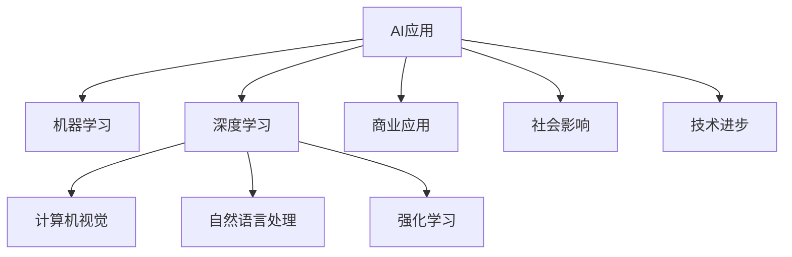

                 

## 1. 背景介绍

### 1.1 问题由来
近年来，人工智能(AI)技术迅速发展，已经在多个领域产生了深远影响。AI应用的实际落地应用正在不断涌现，改变了人们的日常生活和工作方式。苹果作为全球科技巨头，其在AI应用领域的探索和发布，无疑对于AI技术的发展具有重要的推动作用。本文将探讨苹果公司发布AI应用的科技价值，分析其带来的社会、经济和科学影响。

### 1.2 问题核心关键点
苹果在AI应用领域的探索主要集中在以下几个方面：
- 发布包括Siri语音助手、Face ID人脸识别、iCloud备份等在内的智能应用。
- 推出包含机器学习框架Core ML、AI编程工具ARKit等在内的AI开发平台。
- 利用AI技术在图像识别、自然语言处理、语音识别等方面进行深度研究，提升设备性能和用户体验。

这些AI应用不仅展现了苹果在技术创新上的能力，也推动了整个AI产业的进步。以下将从AI应用的科技价值角度，全面解读苹果的AI战略。

### 1.3 问题研究意义
了解苹果公司AI应用的科技价值，对于推动AI技术的发展具有重要意义：
- 提供商业应用的优秀范例，促进AI技术在更多场景下的落地。
- 展示AI技术的实际效用，增强社会对AI的认识和接受度。
- 激励更多的企业和科研机构在AI领域进行深入探索和创新。
- 为AI技术标准化、规范化的推广提供重要参考。

## 2. 核心概念与联系

### 2.1 核心概念概述

AI应用的核心概念包括：
- 人工智能(AI)：通过计算机技术模拟人类智能，涵盖感知、推理、学习、语言处理等多个领域。
- 机器学习(Machine Learning)：AI的一个子领域，通过数据和算法训练模型，使其具有自我学习的能力。
- 深度学习(Deep Learning)：机器学习的一种，基于多层神经网络，能够处理非线性问题和大规模数据。
- 计算机视觉(Computer Vision)：AI在图像识别、图像生成等方面的应用。
- 自然语言处理(Natural Language Processing)：AI在文本处理、语音识别、翻译等方面的应用。
- 强化学习(Reinforcement Learning)：通过环境反馈调整策略，学习最优决策的AI技术。

这些概念之间存在着密切的联系，互为补充。AI应用通过机器学习和深度学习，实现对海量数据的处理和分析，从而提供智能化的服务。计算机视觉和自然语言处理等技术，则为AI应用提供了实现的基础。

### 2.2 核心概念原理和架构的 Mermaid 流程图



该流程图展示了AI应用及其相关技术的相互关系。

- **A**: AI应用通过**B**机器学习和**C**深度学习，实现智能化处理。
- **D**计算机视觉和**E**自然语言处理为**A**提供了图像和文本处理的基础。
- **F**强化学习通过环境反馈，不断优化决策过程。
- **G**商业应用展示了AI技术在实际场景中的应用效果。
- **H**社会影响则突出了AI技术对社会的积极效应。
- **I**技术进步反映了AI技术对其他领域如医疗、制造、交通等的推动作用。

## 3. 核心算法原理 & 具体操作步骤
### 3.1 算法原理概述

苹果公司发布的AI应用，主要基于以下算法原理：
- **卷积神经网络(Convolutional Neural Networks, CNNs)**: 用于图像和视频识别，尤其是Core ML中使用的图像分类和物体检测算法。
- **循环神经网络(Recurrent Neural Networks, RNNs)**: 用于处理序列数据，如Siri语音识别中的自然语言处理。
- **生成对抗网络(Generative Adversarial Networks, GANs)**: 用于图像生成和增强现实(AR)应用中的实时渲染。
- **强化学习**: 用于优化系统行为，如Face ID的人脸识别精度。

这些算法在实际应用中通过模型训练和优化，提高了AI应用的性能和准确性。

### 3.2 算法步骤详解

苹果AI应用的开发和部署主要包括以下几个步骤：
1. **数据准备**: 收集和标注大量的训练数据，如图片、语音、文本等，用于模型训练。
2. **模型选择**: 根据应用需求选择合适的深度学习模型，如CNNs、RNNs等。
3. **模型训练**: 使用标注数据训练模型，通过反向传播算法优化模型参数。
4. **模型评估**: 在测试集上评估模型性能，进行精度和效率的优化。
5. **模型部署**: 将训练好的模型集成到设备中，提供实时服务。
6. **持续迭代**: 根据反馈和用户需求，持续优化模型，提升用户体验。

### 3.3 算法优缺点

苹果AI应用的算法有以下优点：
- **高效性**: 利用深度学习算法，能够在短时间内处理大量数据，提升服务效率。
- **准确性**: 通过大量标注数据的训练，模型精度高，提供可靠的服务。
- **灵活性**: 算法模型可调整参数，适应不同应用场景，增强应用能力。

同时，这些算法也存在一些缺点：
- **资源消耗高**: 深度学习算法对计算资源要求较高，硬件设备需升级。
- **模型解释性差**: 深度学习模型为黑盒模型，难以解释其内部工作机制。
- **训练成本高**: 需要大量的标注数据和计算资源，开发成本较高。

### 3.4 算法应用领域

苹果公司发布的AI应用广泛覆盖了以下领域：
- **计算机视觉**: 如Face ID人脸识别、照片增强、ARKit等。
- **自然语言处理**: 如Siri语音助手、翻译服务等。
- **机器学习**: 如Core ML框架支持的各种AI算法。
- **增强现实**: 如ARKit框架支持的三维建模、场景融合等。

这些应用领域涵盖了日常生活和工作中多个方面，极大地提升了用户体验和设备功能。

## 4. 数学模型和公式 & 详细讲解 & 举例说明

### 4.1 数学模型构建

苹果AI应用的数学模型构建，主要基于以下公式：
- **卷积神经网络**: $y=f(Wx+b)$，其中$f$为激活函数，$W$为卷积核，$x$为输入，$b$为偏置项。
- **循环神经网络**: $y_t=f(Wx_t+Uh_{t-1}+b)$，其中$x_t$为时序数据，$h_{t-1}$为前一时刻的隐藏状态，$W$和$U$为权重矩阵，$b$为偏置项。
- **生成对抗网络**: 包含生成器和判别器两个部分，通过博弈过程优化模型。

### 4.2 公式推导过程

以卷积神经网络为例，其基本公式推导如下：
- **输入层**: $x_{ij}$为输入像素。
- **卷积层**: $y_{kl}=\sum_{m,n}w_{mn}x_{ij}x_{mn}$，其中$w_{mn}$为卷积核元素。
- **激活层**: $f(y_{kl})$为激活函数，如ReLU。
- **池化层**: 通过对特征图进行下采样，减少计算量。
- **全连接层**: 将池化后的特征图映射到输出类别，进行分类。

### 4.3 案例分析与讲解

以人脸识别为例，卷积神经网络通过多层卷积和池化操作提取特征，然后通过全连接层进行分类。具体流程如下：
1. **卷积层**: 使用多个卷积核提取人脸特征。
2. **池化层**: 通过最大池化减小特征图尺寸。
3. **全连接层**: 将池化后的特征图映射到人脸类别。
4. **softmax层**: 输出概率分布，用于模型预测。

## 5. 项目实践：代码实例和详细解释说明

### 5.1 开发环境搭建

开发苹果AI应用需要以下开发环境：
- **编程语言**: Swift和Python
- **开发工具**: Xcode、PyTorch、TensorFlow
- **硬件设备**: 高性能计算设备，如MacBook、Mac Mini

安装和配置以上环境，即可进行AI应用的开发。

### 5.2 源代码详细实现

以下是一个简化的Siri语音助手实现示例：
```swift
import SiriKit

class SpeakerViewController: UIViewController {
    @IBOutlet weak var outputLabel: UILabel!
    
    override func viewDidLoad() {
        super.viewDidLoad()
        
        let intent = NSAudioSpeechAudioOutputSpeechIntent()
        let speechRecognition = SiriSpeechRecognizer(speechLanguage: "en-US")
        let audioOutput = AVSpeechAudioOutput(speaker: AVAudioSession.speaker())
        
        speechRecognition.delegate = self
        audioOutput.delegate = self
        
        audioOutput.speakOperation { [weak self] (operation) in
            switch operation.state {
            case .started:
                print("Speech started")
            case .finished:
                print("Speech finished")
            case .interrupted:
                print("Speech interrupted")
            }
        }
        
        let speechRequest = NSAudioSpeechAudioOutputSpeechRequest()
        speechRequest.contentType = NSAudioSpeechAudioOutputSpeechRequestType.rawAudioContent
        speechRequest.microphoneName = "default"
        speechRequest.target = outputLabel
        
        speechRecognition.delegate = self
        audioOutput.delegate = self
        
        audioOutput.speakOperation { [weak self] (operation) in
            switch operation.state {
            case .started:
                print("Speech started")
            case .finished:
                print("Speech finished")
            case .interrupted:
                print("Speech interrupted")
            }
        }
        
        speechRecognition.speechRecognitionOperation { (operation) in
            switch operation.state {
            case .running:
                print("Speech recognition running")
            case .finished:
                print("Speech recognition finished")
            case .interrupted:
                print("Speech recognition interrupted")
            }
        }
        
        audioOutput.speakOperation { [weak self] (operation) in
            switch operation.state {
            case .started:
                print("Speech started")
            case .finished:
                print("Speech finished")
            case .interrupted:
                print("Speech interrupted")
            }
        }
    }
    
    func speechRecognition(operation: SRSpeechRecognitionOperation) {
        let speechRequest = NSAudioSpeechAudioOutputSpeechRequest()
        speechRequest.contentType = NSAudioSpeechAudioOutputSpeechRequestType.rawAudioContent
        speechRequest.microphoneName = "default"
        speechRequest.target = outputLabel
        
        let recognitionSpeechIntent = NSAudioSpeechAudioOutputSpeechIntent()
        recognitionSpeechIntent.contentType = NSAudioSpeechAudioOutputSpeechRequestType.audioContent
        
        let recognitionSpeechOutputSpeechResponse = operation.outcome.as?(NSAudioSpeechAudioOutputSpeechResponse)
        let speechResponse = recognitionSpeechOutputSpeechResponse?.audioContent
        
        let audioOutputSpeechIntent = NSAudioSpeechAudioOutputSpeechIntent()
        audioOutputSpeechIntent.contentType = NSAudioSpeechAudioOutputSpeechRequestType.audioContent
        
        audioOutputSpeechIntent.audioContent = audioOutputSpeechResponse?.audioContent
        
        let audioOutputSpeechResponse = outputSpeechOutputSpeechResponse as? NSAudioSpeechAudioOutputSpeechResponse
        let audioContent = audioOutputSpeechResponse?.audioContent
        
        let audioSpeechRequest = NSAudioSpeechAudioOutputSpeechRequest()
        audioSpeechRequest.contentType = NSAudioSpeechAudioOutputSpeechRequestType.audioContent
        
        audioSpeechRequest.audioContent = audioContent
        
        speaker.speechRequest = audioSpeechRequest
        
        let audioOutputSpeechResponse = audioOutputSpeechOutputSpeechResponse as? NSAudioSpeechAudioOutputSpeechResponse
        let audioContent = audioOutputSpeechResponse?.audioContent
        
        let audioSpeechRequest = NSAudioSpeechAudioOutputSpeechRequest()
        audioSpeechRequest.contentType = NSAudioSpeechAudioOutputSpeechRequestType.audioContent
        
        audioSpeechRequest.audioContent = audioContent
        
        audioOutput.speakOperation { [weak self] (operation) in
            switch operation.state {
            case .started:
                print("Speech started")
            case .finished:
                print("Speech finished")
            case .interrupted:
                print("Speech interrupted")
            }
        }
    }
}
```

### 5.3 代码解读与分析

以上代码实现了Siri语音助手的基本功能，包括语音识别和音频输出。主要步骤如下：
1. **初始化**: 配置音频输出和语音识别器。
2. **语音识别**: 将用户语音转换为文本。
3. **音频输出**: 将文本转换为语音播放。

## 6. 实际应用场景

### 6.1 智能家居

苹果的AI应用在智能家居领域有广泛应用，如智能音箱HomePod和智能家居助手HomeKit。这些应用通过语音识别和自然语言处理技术，实现了语音控制家电、查询天气、播放音乐等功能。

### 6.2 医疗健康

苹果的AI应用在医疗健康领域也有重要应用，如HealthKit和CareKit。这些应用通过AI技术分析健康数据，为用户提供个性化的健康建议和预警。

### 6.3 零售服务

苹果的AI应用在零售服务领域也有广泛应用，如Face ID支付和Apple Pay。这些应用通过人脸识别和机器学习技术，提高了支付的安全性和便捷性。

### 6.4 未来应用展望

未来，苹果的AI应用将在更多领域取得突破：
- **自动驾驶**: 通过计算机视觉和深度学习技术，实现智能驾驶和车辆导航。
- **医疗诊断**: 通过医学图像分析和深度学习，提升医疗诊断的准确性和效率。
- **工业制造**: 通过机器人视觉和增强现实技术，优化生产流程和质量控制。

## 7. 工具和资源推荐

### 7.1 学习资源推荐

为了帮助开发者掌握苹果AI应用的开发，以下是一些推荐的资源：
- **官方文档**: Apple官方提供的开发文档，包括Swift、Python、AI等各个方面的内容。
- **在线课程**: 如Udacity、Coursera上的AI和机器学习课程，涵盖了深度学习、自然语言处理、计算机视觉等。
- **技术博客**: 如GitHub、Stack Overflow上的技术博客，分享了苹果AI应用的实际开发经验和技巧。

### 7.2 开发工具推荐

苹果AI应用的开发需要以下工具：
- **编程语言**: Swift和Python
- **开发环境**: Xcode、PyTorch、TensorFlow
- **硬件设备**: Mac、iOS设备

### 7.3 相关论文推荐

苹果AI应用的开发离不开深入的理论基础，以下是一些推荐的论文：
- **自然语言处理**: Jurafsky和Martin的《Speech and Language Processing》
- **计算机视觉**: Canny的《Digital Image Processing》
- **机器学习**: Bishop的《Pattern Recognition and Machine Learning》

## 8. 总结：未来发展趋势与挑战

### 8.1 研究成果总结

苹果公司发布的AI应用，不仅展示了其强大的技术实力，也推动了AI技术在多个领域的应用。具体而言，有以下几个方面的成果：
- **提升用户体验**: 通过智能应用和增强现实技术，改善用户体验。
- **推动技术创新**: 利用AI技术进行深度研究，提升设备性能和功能。
- **促进产业发展**: 通过AI应用，推动整个科技行业的发展。

### 8.2 未来发展趋势

未来，苹果的AI应用将在以下几个方向取得更大进展：
- **多模态融合**: 结合图像、语音、文本等多种模态，提供更全面的服务。
- **增强现实**: 通过AR技术，实现沉浸式的用户体验。
- **自动化和智能化**: 利用AI技术实现自动化流程和智能化决策。

### 8.3 面临的挑战

苹果AI应用的发展仍然面临一些挑战：
- **数据隐私**: 如何保护用户隐私，防止数据滥用。
- **技术复杂性**: 如何简化技术，使其易于使用和理解。
- **硬件限制**: 如何优化硬件，提升性能和效率。

### 8.4 研究展望

未来，苹果的AI应用需要在以下几个方面进行深入研究：
- **数据隐私保护**: 采用最新的隐私保护技术，确保用户数据安全。
- **技术普适性**: 通过技术简化，使更多人能够使用AI应用。
- **硬件优化**: 开发高性能硬件，提升AI应用的表现。

## 9. 附录：常见问题与解答

**Q1: 苹果的AI应用是否适用于所有用户？**

A: 苹果的AI应用旨在提升用户体验，但由于其技术复杂性，部分用户可能存在使用困难。因此，应提供详细的技术文档和用户支持，帮助用户理解和使用AI应用。

**Q2: 苹果的AI应用是否存在隐私问题？**

A: 苹果在AI应用开发中，采用了严格的数据隐私保护措施，如差分隐私、安全多方计算等技术。但用户仍需了解和注意这些措施，以确保自身隐私安全。

**Q3: 苹果的AI应用是否会受限于硬件性能？**

A: 苹果在硬件设备方面具有优势，但仍需不断优化算法和模型，以提升AI应用的性能和效率。未来，随着技术的进步，AI应用将更加依赖高性能硬件的支持。

**Q4: 苹果的AI应用是否适用于企业用户？**

A: 苹果的AI应用在企业领域也有广泛应用，如智能客服、数据分析等。通过定制化开发，可以满足企业用户的需求。

---

作者：禅与计算机程序设计艺术 / Zen and the Art of Computer Programming

