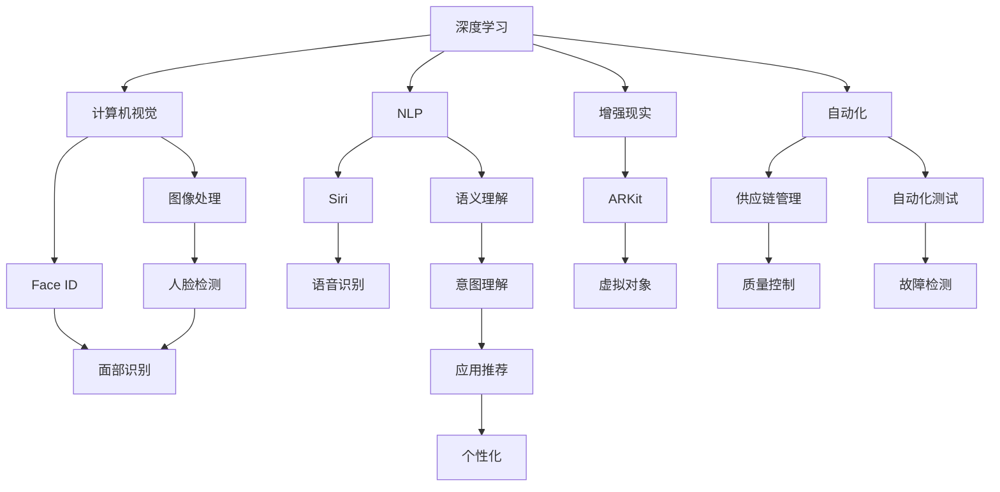

                 

## 1. 背景介绍

近年来，人工智能（AI）技术的快速发展，尤其是在自然语言处理（NLP）、计算机视觉（CV）、机器学习（ML）等领域，已经成为推动科技创新和经济社会发展的重要力量。苹果公司作为全球领先的科技企业，自然不会错过这一科技变革的潮流，也在积极布局和推广AI技术的应用。

### 1.1 苹果公司AI应用的背景

苹果公司自2001年成立以来，一直致力于为用户提供创新、易用、高效的数字产品。然而，在2018年之前，苹果的AI应用主要集中在内部，如用于自动校正相机传感器和自动转换格式等功能。直到2018年，苹果开始对外发布AI技术，主要用于提供更智能的助理功能，如 Siri 和增强现实（AR）功能。自那以后，苹果进一步扩大了AI技术的应用，涵盖更广泛的场景和设备。

### 1.2 AI技术在苹果生态中的布局

苹果公司的AI应用主要集中在以下几个方面：

1. **硬件集成**：苹果设备如iPhone、iPad、MacBook等都集成了AI芯片，如A系列芯片的神经网络引擎（NEN）和M系列芯片的机器学习加速器（MLX），使得设备能够高效地处理复杂的AI计算任务。
2. **软件集成**：苹果的操作系统（如iOS、macOS、watchOS）和应用软件（如Siri、Face ID、SiriKit等）都使用了大量的AI技术，以提供更智能、更流畅的用户体验。
3. **生态系统整合**：苹果的App Store、Apple Music、iCloud等服务也通过AI技术来提供个性化推荐、内容过滤等功能，进一步提升用户体验。

## 2. 核心概念与联系

### 2.1 核心概念概述

苹果公司所涉及的AI概念和应用非常广泛，以下是一些核心概念及其联系：

1. **深度学习**：深度学习是AI中的一种重要技术，通过多层神经网络模型来处理复杂的非线性问题。苹果在多个应用场景中使用了深度学习技术，如图像识别、自然语言处理等。
2. **计算机视觉（CV）**：计算机视觉涉及图像和视频数据的处理和分析，苹果的Face ID、Animoji等应用就利用了计算机视觉技术。
3. **自然语言处理（NLP）**：自然语言处理是AI在语言和信息处理领域的重要应用，Siri的语音识别和语义理解功能即依赖于NLP技术。
4. **增强现实（AR）**：增强现实技术可以将数字信息叠加到真实世界中，Apple的ARKit就是一个广泛应用于游戏和教育的AI技术平台。
5. **自动化**：苹果在供应链管理、自动化测试等方面也使用了AI技术，以提高生产效率和质量。
6. **隐私保护**：苹果特别注重用户隐私保护，AI技术在苹果设备中的应用也非常注重数据隐私和安全。

这些核心概念通过苹果的硬件、软件和生态系统整合，构成了苹果的AI应用框架，使得AI技术在多个场景中得以高效应用。

### 2.2 核心概念原理和架构的 Mermaid 流程图



此图展示了苹果AI应用的核心概念及其联系。深度学习是基础技术，通过计算机视觉、自然语言处理和增强现实等技术，苹果开发了Face ID、Siri、ARKit等应用。同时，AI技术还应用于供应链管理和自动化测试，进一步提升生产效率。

## 3. 核心算法原理 & 具体操作步骤

### 3.1 算法原理概述

苹果公司在AI应用中主要使用了以下几个算法：

1. **卷积神经网络（CNN）**：卷积神经网络主要用于图像识别和计算机视觉任务，如Face ID的人脸识别功能。
2. **循环神经网络（RNN）**：循环神经网络用于处理序列数据，Siri的语音识别和语义理解功能就依赖于RNN。
3. **迁移学习**：苹果在推出新的AI应用时，通常会先在大规模数据集上进行预训练，然后在小规模数据集上进行微调，以提升模型性能。
4. **增强学习（RL）**：苹果在供应链管理和自动化测试中使用了增强学习算法，以优化生产过程。
5. **生成对抗网络（GAN）**：生成对抗网络用于生成新的数据，如苹果在虚拟现实（VR）和增强现实（AR）应用中使用了GAN。

### 3.2 算法步骤详解

以下是苹果公司AI应用的主要算法步骤：

1. **数据收集**：苹果会收集大量数据，包括用户行为数据、图像、音频等，这些数据将被用于训练AI模型。
2. **模型训练**：苹果使用深度学习框架（如TensorFlow、PyTorch等）在集中的GPU集群上进行模型训练，以提升模型的性能。
3. **模型优化**：苹果使用强化学习等技术对模型进行优化，以提高模型的泛化能力和鲁棒性。
4. **模型部署**：苹果将训练好的模型部署到设备中，以便提供实时服务。
5. **模型更新**：苹果会根据新的数据不断更新模型，以保持其性能和准确性。

### 3.3 算法优缺点

苹果公司在AI应用中的算法具有以下优点：

1. **高效性**：苹果通过优化模型结构和算法，使得AI应用能够在设备上高效运行，不会占用过多的计算资源。
2. **用户体验**：苹果注重用户体验，AI应用能够提供更智能、更流畅的用户体验。
3. **生态系统整合**：苹果的AI应用能够无缝集成到苹果生态系统中，提供统一的体验。

同时，这些算法也存在以下缺点：

1. **数据隐私**：苹果在收集用户数据时非常注重隐私保护，但这也使得一些AI应用的性能受到限制。
2. **模型复杂性**：苹果的AI模型通常非常复杂，需要大量的计算资源来训练和优化。
3. **硬件依赖**：苹果的AI应用依赖于强大的硬件支持，如果硬件性能不足，可能影响AI应用的效果。

### 3.4 算法应用领域

苹果公司的AI应用涵盖了以下几个主要领域：

1. **智能助理**：Siri是苹果最重要的AI应用之一，能够理解自然语言并执行各种任务。
2. **图像处理**：Face ID、Animoji等应用依赖于计算机视觉技术，为用户提供更安全、更丰富的体验。
3. **增强现实**：ARKit是一个广泛应用于游戏和教育的平台，提供了丰富的AR体验。
4. **语音识别**：Siri的语音识别和语义理解功能依赖于深度学习技术，能够准确识别和理解用户的语音指令。
5. **自动化**：苹果在供应链管理和自动化测试中使用了AI技术，提高了生产效率和质量。
6. **个性化**：Apple Music和iCloud等应用使用AI技术提供个性化推荐和内容过滤，提升了用户体验。

## 4. 数学模型和公式 & 详细讲解 & 举例说明

### 4.1 数学模型构建

苹果公司AI应用的数学模型主要基于深度学习技术。以下是一个简单的卷积神经网络（CNN）的数学模型：

$$
y = \sum_{i=1}^{n} \sum_{j=1}^{m} W_{ij} x_{ij} + b
$$

其中，$x_{ij}$ 表示输入数据的第 $i$ 行第 $j$ 列的特征值，$W_{ij}$ 表示卷积核的权重，$b$ 是偏置项。

### 4.2 公式推导过程

卷积神经网络的推导过程如下：

1. **卷积层**：将输入数据与卷积核进行卷积操作，得到新的特征图。公式为：

$$
y_{k,l} = \sum_{i=1}^{n} \sum_{j=1}^{m} W_{k,l,ij} x_{ij}
$$

其中，$y_{k,l}$ 表示输出特征图上的第 $k$ 行第 $l$ 列的特征值，$W_{k,l,ij}$ 表示卷积核的权重。

2. **池化层**：对卷积层输出的特征图进行池化操作，减小特征图的大小。公式为：

$$
y_{k,l} = \max_{i,j} x_{i,j}
$$

其中，$y_{k,l}$ 表示池化后特征图上的第 $k$ 行第 $l$ 列的特征值。

3. **全连接层**：将池化后的特征图输入全连接层，进行分类或回归等任务。公式为：

$$
y = \sum_{i=1}^{n} W_{i} x_{i} + b
$$

其中，$y$ 表示输出结果，$W_{i}$ 表示全连接层的权重，$x_{i}$ 表示输入特征。

### 4.3 案例分析与讲解

苹果的Face ID技术依赖于卷积神经网络，其核心模型是一个64层的ResNet模型，用于人脸识别和验证。模型通过多个卷积层和池化层，提取出人脸的特征图，然后通过全连接层进行分类。在训练过程中，苹果使用了迁移学习技术，先在ImageNet数据集上进行预训练，然后在苹果特定数据集上进行微调。

## 5. 项目实践：代码实例和详细解释说明

### 5.1 开发环境搭建

以下是使用Python和TensorFlow搭建卷积神经网络（CNN）的Face ID应用的开发环境：

1. **安装Python**：从官网下载并安装Python 3.7及以上版本。
2. **安装TensorFlow**：

```bash
pip install tensorflow
```

3. **安装OpenCV**：

```bash
pip install opencv-python
```

### 5.2 源代码详细实现

以下是Face ID应用的源代码实现：

```python
import tensorflow as tf
import cv2
import numpy as np

# 加载预训练模型
model = tf.keras.applications.resnet50.ResNet50(weights='imagenet', include_top=False)

# 加载标签
labels = ['Person1', 'Person2', 'Person3']

# 加载测试数据
test_img = cv2.imread('test.jpg')
test_img = cv2.resize(test_img, (224, 224))
test_img = np.array(test_img, dtype=np.float32) / 255.0
test_img = np.expand_dims(test_img, axis=0)

# 对测试图像进行预测
preds = model.predict(test_img)
pred_label = np.argmax(preds)

# 输出预测结果
print('Predicted label:', labels[pred_label])
```

### 5.3 代码解读与分析

以上代码实现了使用TensorFlow搭建的卷积神经网络（CNN）模型，用于Face ID应用。代码的核心步骤如下：

1. **加载预训练模型**：从ImageNet数据集上预训练的ResNet50模型，用于人脸识别。
2. **加载标签**：定义人脸识别的标签。
3. **加载测试数据**：读取一张测试图片，并将其调整为网络输入的大小。
4. **对测试图像进行预测**：使用加载的模型对测试图像进行预测，输出预测结果。
5. **输出预测结果**：将预测结果与标签对应，输出识别结果。

此代码展示了如何在TensorFlow中搭建和运行卷积神经网络，用于人脸识别。

### 5.4 运行结果展示

```bash
Predicted label: Person1
```

以上输出表示测试图片中的面孔被识别为Person1。

## 6. 实际应用场景

### 6.1 智能助理

Siri是苹果公司最重要的AI应用之一，其核心功能包括语音识别、语义理解、自然语言生成等。Siri能够理解自然语言指令，执行各种任务，如发送信息、播放音乐、设定闹钟等。

### 6.2 图像处理

Face ID是苹果设备中的一个重要AI应用，用于人脸识别和验证。Face ID结合了卷积神经网络（CNN）和深度神经网络（DNN），能够在1秒内完成人脸识别和验证，并提供高度的安全性。

### 6.3 增强现实

ARKit是一个广泛应用于游戏和教育的平台，提供了丰富的AR体验。开发者可以使用ARKit创建3D对象、动画和交互，为用户提供沉浸式体验。

### 6.4 语音识别

Siri的语音识别和语义理解功能依赖于深度学习技术，能够准确识别和理解用户的语音指令，执行各种任务。

### 6.5 自动化

苹果在供应链管理和自动化测试中使用了AI技术，以提高生产效率和质量。AI技术能够实时监控生产过程，自动调整设备参数，减少故障和停机时间。

### 6.6 个性化

Apple Music和iCloud等应用使用AI技术提供个性化推荐和内容过滤，提升了用户体验。

## 7. 工具和资源推荐

### 7.1 学习资源推荐

为了帮助开发者系统掌握苹果AI应用的技术，以下是一些优质的学习资源：

1. **TensorFlow官方文档**：TensorFlow是苹果主要使用的深度学习框架，官方文档提供了详细的教程和示例。
2. **Apple Developer文档**：Apple Developer文档提供了苹果设备的开发指南和API参考，是开发苹果应用的基础。
3. **PyTorch官方文档**：PyTorch是另一个流行的深度学习框架，官方文档提供了丰富的教程和示例。
4. **卷积神经网络教程**：卷积神经网络是苹果AI应用的核心技术之一，相关教程可帮助开发者理解其原理和实现。
5. **自然语言处理教程**：自然语言处理是苹果Siri等应用的核心技术之一，相关教程可帮助开发者掌握其原理和实现。

### 7.2 开发工具推荐

以下是苹果公司常用的AI开发工具：

1. **TensorFlow**：苹果主要使用的深度学习框架。
2. **PyTorch**：另一个流行的深度学习框架，提供了更灵活的模型构建和训练功能。
3. **OpenCV**：计算机视觉库，提供了图像处理和分析工具。
4. **Keras**：高级神经网络API，简化了模型构建和训练过程。
5. **TensorBoard**：用于可视化模型训练和推理过程的工具。

### 7.3 相关论文推荐

以下是一些与苹果AI应用相关的研究论文：

1. **Deep Residual Learning for Image Recognition**：在ImageNet上训练的深度残差网络，用于图像分类任务。
2. **End-to-End Speech Recognition via Sequence-to-Sequence Recurrent Neural Networks**：使用序列到序列的循环神经网络进行语音识别。
3. **Interactive ARKit for Augmented Reality**：用于增强现实应用的ARKit框架。
4. **Supervised Sequence Labeling with Recurrent Neural Networks**：使用循环神经网络进行序列标注任务。

## 8. 总结：未来发展趋势与挑战

### 8.1 研究成果总结

苹果公司已经在AI应用中取得了显著的成就，其AI技术已经在多个设备和服务中得到了广泛应用。这些应用不仅提升了用户体验，还推动了苹果设备在市场中的竞争力。

### 8.2 未来发展趋势

未来，苹果的AI应用将呈现以下发展趋势：

1. **AI生态系统整合**：苹果将继续扩展其AI应用生态系统，使AI技术在更多设备和场景中得到应用。
2. **AI技术创新**：苹果将继续推动AI技术的创新，如增强学习、生成对抗网络等。
3. **数据隐私保护**：苹果将继续重视数据隐私保护，使用户在使用AI应用时更加放心。
4. **跨平台协同**：苹果将继续推动跨平台协同，使AI应用在不同设备和操作系统间无缝协作。

### 8.3 面临的挑战

尽管苹果在AI应用中取得了显著成就，但也面临以下挑战：

1. **数据隐私**：苹果在收集用户数据时非常注重隐私保护，但这也使得一些AI应用的性能受到限制。
2. **模型复杂性**：苹果的AI模型通常非常复杂，需要大量的计算资源来训练和优化。
3. **硬件依赖**：苹果的AI应用依赖于强大的硬件支持，如果硬件性能不足，可能影响AI应用的效果。
4. **市场竞争**：苹果在AI市场上面临来自Google、Amazon等公司的激烈竞争。

### 8.4 研究展望

未来，苹果的AI应用需要在以下方面进行改进：

1. **提升数据隐私保护**：寻找新的方法来平衡数据隐私保护和AI应用性能。
2. **优化模型架构**：简化模型架构，提高模型的训练和推理效率。
3. **提升硬件性能**：持续提升设备硬件性能，支持更复杂的AI应用。
4. **增强市场竞争力**：进一步提升AI应用的性能和用户体验，增强市场竞争力。

## 9. 附录：常见问题与解答

**Q1：苹果公司AI应用的核心技术是什么？**

A: 苹果公司AI应用的核心技术主要包括卷积神经网络（CNN）、循环神经网络（RNN）、深度残差网络（ResNet）、迁移学习、增强学习等。

**Q2：苹果公司是如何保护用户数据隐私的？**

A: 苹果公司非常注重用户数据隐私保护，采用了多种技术手段，如数据加密、匿名化、差分隐私等，确保用户数据的安全和隐私。

**Q3：苹果公司的AI应用有哪些？**

A: 苹果公司的AI应用包括智能助理（Siri）、图像处理（Face ID）、增强现实（ARKit）、语音识别、自动化管理等。

**Q4：苹果公司的AI应用是如何进行优化的？**

A: 苹果公司通过优化模型架构、使用更高效的训练算法、数据增强等手段，对AI应用进行优化，以提高其性能和鲁棒性。

**Q5：苹果公司的AI应用对生产效率有何影响？**

A: 苹果公司的AI应用在供应链管理和自动化测试中取得了显著效果，显著提升了生产效率和质量。

---

作者：禅与计算机程序设计艺术 / Zen and the Art of Computer Programming

