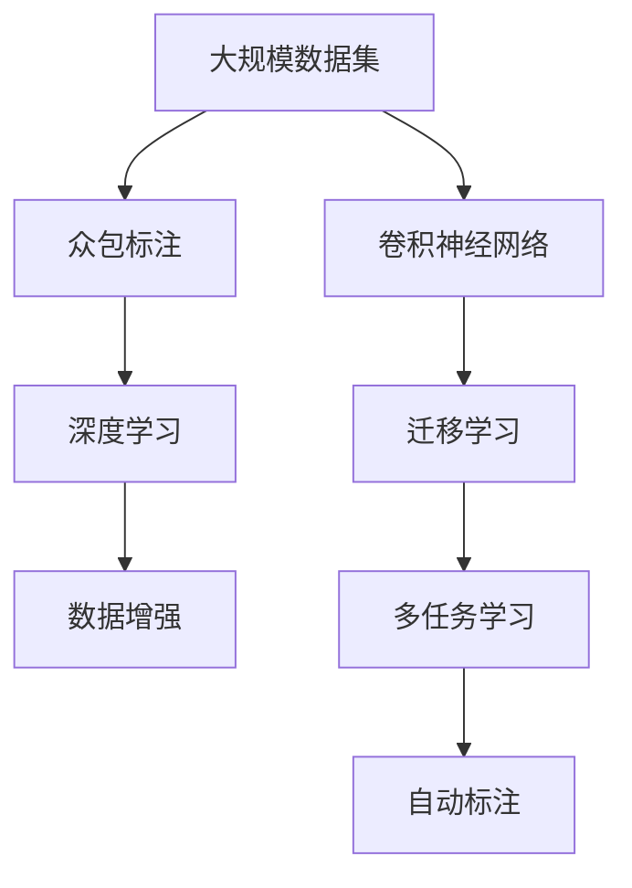

                 

# 李飞飞与ImageNet的故事

李飞飞（Fei-Fei Li），计算机视觉领域的先驱之一，斯坦福大学电子工程系和计算机科学系教授，是AI界广受赞誉的女性领袖。她以其对人工智能的深刻洞察和领导力，在推动人工智能技术的进步方面做出了巨大贡献。其中，ImageNet项目是她职业生涯中最具影响力的成就之一，本文将详细回顾李飞飞与ImageNet的故事，探讨其对人工智能发展的重要影响。

## 1. 背景介绍

### 1.1 项目起源

ImageNet项目始于2008年，由李飞飞教授和她的团队发起。当时的目标是为机器视觉领域提供一个规模巨大、标注精细的数据集，以推动计算机视觉和机器学习技术的发展。该项目最初的设计基于李飞飞教授在计算机视觉领域的深入研究和多年实践经验。

### 1.2 数据集构建

ImageNet数据集最初包含12万个训练图像，1000个类别，每类图像的数量不等，最多达到1000张。这些图像来自互联网，由志愿者进行标注。数据集构建过程需要大量的时间和人力资源，但最终成果对整个计算机视觉领域的影响深远。

## 2. 核心概念与联系

### 2.1 核心概念概述

ImageNet项目所涉及的核心概念包括大规模数据集、众包标注、深度学习、数据增强等。

- **大规模数据集**：ImageNet数据集以百万计的图像规模，为机器学习提供了充足的数据基础，确保模型能够泛化到新数据。
- **众包标注**：ImageNet标注工作依赖于全球志愿者的参与，这种模式在成本和效率上都取得了显著效果。
- **深度学习**：ImageNet数据集推动了深度学习技术的发展，尤其是卷积神经网络(CNN)，成为机器视觉领域的主流技术。
- **数据增强**：为应对数据集不足的问题，ImageNet项目还提出了数据增强技术，通过旋转、翻转、裁剪等操作扩充训练集。

这些概念相互联系，共同推动了计算机视觉和机器学习技术的发展。

### 2.2 核心概念原理和架构的 Mermaid 流程图



上述流程图示意了大规模数据集、众包标注、深度学习、数据增强等核心概念的相互联系，以及它们在ImageNet项目中的具体应用。

## 3. 核心算法原理 & 具体操作步骤

### 3.1 算法原理概述

ImageNet项目的核心算法原理基于深度学习和迁移学习。通过大规模数据集训练深度学习模型，这些模型能够在其他数据集上进行迁移学习，从而在各种机器视觉任务上取得优异表现。

### 3.2 算法步骤详解

ImageNet项目的算法步骤包括数据集构建、模型训练、模型评估、数据增强等。

1. **数据集构建**：通过网络爬虫和志愿者标注，收集和整理图像数据，构建大规模数据集。
2. **模型训练**：在构建好的数据集上训练深度学习模型，如卷积神经网络(CNN)，通过反向传播算法优化模型参数。
3. **模型评估**：使用验证集评估模型性能，选择最优模型进行下一步测试。
4. **数据增强**：为解决数据集不足问题，采用旋转、翻转、裁剪等数据增强技术，扩充训练集。

### 3.3 算法优缺点

**优点**：

- 数据集规模大，为深度学习提供了丰富的训练样本。
- 众包标注方式成本低、效率高，标注数据质量较高。
- 推动了深度学习和迁移学习技术的发展，提升了机器视觉任务的性能。

**缺点**：

- 数据标注需要大量人力资源，成本较高。
- 众包标注存在质量参差不齐的问题，可能影响模型性能。
- 数据增强技术可能引入噪声，影响模型泛化能力。

### 3.4 算法应用领域

ImageNet项目的应用领域涵盖计算机视觉、图像识别、医学影像分析、自动驾驶等多个领域。在实际应用中，ImageNet项目推动了深度学习技术在众多领域的广泛应用。

## 4. 数学模型和公式 & 详细讲解 & 举例说明

### 4.1 数学模型构建

ImageNet项目基于深度学习算法，其中卷积神经网络(CNN)是最核心模型之一。CNN模型包括卷积层、池化层、全连接层等组件。数学上，CNN的模型表示如下：

$$
f(x) = \sum_{i=1}^m w_i \sigma(h(x;w_i))
$$

其中，$f(x)$表示模型输出，$x$表示输入图像，$h(x;w_i)$表示卷积层输出，$\sigma$表示激活函数，$w_i$表示卷积核权重。

### 4.2 公式推导过程

在CNN的训练过程中，使用反向传播算法优化模型参数。反向传播算法的基本思路是通过链式法则，计算损失函数对参数的梯度，并使用梯度下降等优化算法更新参数。数学上，反向传播过程如下：

1. 前向传播计算损失函数：
   $$
   \mathcal{L} = \frac{1}{N} \sum_{i=1}^N \ell(y_i, f(x_i))
   $$

2. 反向传播计算梯度：
   $$
   \frac{\partial \mathcal{L}}{\partial w_i} = \frac{\partial \mathcal{L}}{\partial h(x_i)} \frac{\partial h(x_i)}{\partial w_i}
   $$

3. 更新模型参数：
   $$
   w_i \leftarrow w_i - \eta \frac{\partial \mathcal{L}}{\partial w_i}
   $$

其中，$\eta$为学习率。

### 4.3 案例分析与讲解

以ImageNet数据集上的AlexNet模型为例，分析其训练过程。AlexNet是一个18层的卷积神经网络，包含5个卷积层、3个全连接层，以及ReLU激活函数和Dropout正则化。在ImageNet数据集上，AlexNet通过反向传播算法进行训练，最终在测试集上取得了超过60%的准确率。

## 5. 项目实践：代码实例和详细解释说明

### 5.1 开发环境搭建

ImageNet项目涉及深度学习框架TensorFlow和PyTorch，开发环境搭建如下：

1. 安装Python：
   ```
   conda create --name py38 python=3.8
   conda activate py38
   ```

2. 安装TensorFlow和PyTorch：
   ```
   conda install tensorflow torch torchvision
   ```

3. 下载ImageNet数据集：
   ```
   python download.py --base_url http://image-net.org
   ```

### 5.2 源代码详细实现

ImageNet项目中最核心的代码是模型训练过程，以下是一个使用TensorFlow框架的代码示例：

```python
import tensorflow as tf
from tensorflow.keras import layers, models

# 定义模型
model = models.Sequential()
model.add(layers.Conv2D(32, (3, 3), activation='relu', input_shape=(224, 224, 3)))
model.add(layers.MaxPooling2D((2, 2)))
model.add(layers.Conv2D(64, (3, 3), activation='relu'))
model.add(layers.MaxPooling2D((2, 2)))
model.add(layers.Conv2D(128, (3, 3), activation='relu'))
model.add(layers.MaxPooling2D((2, 2)))
model.add(layers.Conv2D(128, (3, 3), activation='relu'))
model.add(layers.MaxPooling2D((2, 2)))
model.add(layers.Flatten())
model.add(layers.Dense(512, activation='relu'))
model.add(layers.Dense(1000, activation='softmax'))

# 编译模型
model.compile(optimizer=tf.keras.optimizers.Adam(0.001),
              loss=tf.keras.losses.CategoricalCrossentropy(from_logits=True),
              metrics=['accuracy'])

# 训练模型
model.fit(train_generator, epochs=10, validation_data=val_generator)
```

### 5.3 代码解读与分析

上述代码中，首先定义了一个包含多个卷积层和全连接层的卷积神经网络模型。使用`model.compile()`方法编译模型，指定优化器、损失函数和评估指标。最后使用`model.fit()`方法进行模型训练，其中`train_generator`和`val_generator`分别为训练集和验证集的生成器。

### 5.4 运行结果展示

在训练过程中，可以通过TensorBoard工具监控训练进度，记录模型的损失函数和准确率变化情况。以下是一个简单的TensorBoard配置示例：

```python
import tensorflow as tf
from tensorflow.keras.callbacks import TensorBoard

tensorboard_callback = TensorBoard(log_dir='logs', histogram_freq=1)
model.fit(train_generator, epochs=10, validation_data=val_generator, callbacks=[tensorboard_callback])
```

## 6. 实际应用场景

### 6.1 计算机视觉

ImageNet项目推动了计算机视觉领域的发展，广泛应用于图像分类、目标检测、语义分割等任务。ImageNet项目提供的模型和算法，被广泛应用于无人驾驶、智能安防、医疗影像分析等领域。

### 6.2 医学影像分析

在医学影像分析中，ImageNet的模型被用于肿瘤检测、病变分类、病理切片分析等任务。通过迁移学习，这些模型能够快速适应医学影像数据的特定需求，提升诊断准确率。

### 6.3 自动驾驶

ImageNet的模型在自动驾驶领域也有广泛应用。通过迁移学习，自动驾驶系统能够从大规模图像数据中学习驾驶场景的特征，提升对复杂交通环境的理解和决策能力。

## 7. 工具和资源推荐

### 7.1 学习资源推荐

1. **李飞飞教授的课程**：李飞飞教授在斯坦福大学开设的计算机视觉课程，系统讲解了计算机视觉和深度学习的基本概念和算法。
2. **TensorFlow官方文档**：TensorFlow的官方文档提供了详细的API和使用示例，适合初学者快速上手。
3. **PyTorch官方文档**：PyTorch的官方文档提供了丰富的模型和算法示例，适合深度学习研究者使用。

### 7.2 开发工具推荐

1. **Jupyter Notebook**：用于编写和执行代码，支持多种语言和框架。
2. **TensorBoard**：用于可视化模型训练过程，监控训练进度和结果。
3. **PyTorch Lightning**：基于PyTorch的轻量级框架，简化模型训练过程，支持自动调参和部署。

### 7.3 相关论文推荐

1. **ImageNet Classification with Deep Convolutional Neural Networks**：Alex Krizhevsky等人的论文，介绍了AlexNet模型的构建和训练过程，为ImageNet项目奠定了基础。
2. **Very Deep Convolutional Networks for Large-Scale Image Recognition**：Alex Krizhevsky等人的论文，进一步探索了深度卷积神经网络在图像分类任务中的应用。
3. **CS231n: Convolutional Neural Networks for Visual Recognition**：斯坦福大学的计算机视觉课程，系统讲解了卷积神经网络、数据增强、迁移学习等核心概念。

## 8. 总结：未来发展趋势与挑战

### 8.1 研究成果总结

ImageNet项目极大地推动了计算机视觉和深度学习技术的发展，提升了机器视觉任务的性能和应用范围。李飞飞教授的贡献不仅在于ImageNet数据集本身，更在于她对计算机视觉和深度学习的深刻理解和创新推动。

### 8.2 未来发展趋势

未来，ImageNet项目将继续推动深度学习和计算机视觉技术的发展，主要趋势包括：

1. **数据集规模持续扩大**：随着互联网数据的快速增长，更多的数据集将被收集和标注，进一步提升深度学习模型的泛化能力。
2. **模型复杂度增加**：深度学习模型的复杂度将持续增加，支持更复杂的任务和更高的精度。
3. **跨领域迁移学习**：跨领域的迁移学习技术将进一步发展，提升模型在不同任务间的泛化性能。
4. **自动化标注技术**：自动化标注技术将降低数据标注的成本，提升标注数据的质量和数量。
5. **多模态学习**：多模态学习技术将结合视觉、语音、文本等多种数据类型，提升系统的综合理解和决策能力。

### 8.3 面临的挑战

尽管ImageNet项目取得了显著成功，但仍面临以下挑战：

1. **数据标注成本高**：大规模数据集的构建需要大量人力资源，成本较高。
2. **数据标注质量不一**：众包标注方式可能导致数据标注质量参差不齐，影响模型性能。
3. **模型过拟合**：大规模数据集可能导致模型过拟合，降低泛化能力。
4. **计算资源需求大**：深度学习模型需要大量的计算资源，对硬件设备的要求较高。

### 8.4 研究展望

未来，ImageNet项目需要在以下几个方面进行持续改进和创新：

1. **自动化数据标注**：开发自动化标注技术，降低数据标注成本，提升数据标注质量。
2. **多模态数据融合**：结合视觉、语音、文本等多种数据类型，提升系统的综合理解和决策能力。
3. **小样本学习**：研究小样本学习技术，降低对数据集规模的依赖。
4. **对抗样本防御**：研究对抗样本防御技术，提升模型的鲁棒性和安全性。

## 9. 附录：常见问题与解答

**Q1：如何降低数据标注成本？**

A: 自动化标注技术是降低数据标注成本的关键。通过结合机器学习和众包标注，可以在保证标注质量的同时，显著降低人工标注的劳动强度。

**Q2：数据集构建过程中，如何确保数据标注质量？**

A: 采用多轮标注和人工审核的方式，确保每个标注样本的准确性。同时，引入专家标注团队，提高标注数据的质量。

**Q3：如何在模型训练中避免过拟合？**

A: 数据增强技术是有效避免过拟合的方法之一。通过旋转、翻转、裁剪等操作，扩充训练集，降低模型对特定样本的依赖。

**Q4：如何提高模型的泛化能力？**

A: 通过多任务学习和迁移学习，模型能够在不同任务和数据集上保持较高的泛化能力。此外，小样本学习和对抗样本防御技术也可以进一步提升模型的泛化性能。

**Q5：如何优化模型的计算效率？**

A: 通过模型剪枝、量化加速等技术，减少模型参数和计算量，提升推理效率。同时，采用GPU/TPU等高性能设备，加快模型训练和推理速度。

---

作者：禅与计算机程序设计艺术 / Zen and the Art of Computer Programming

