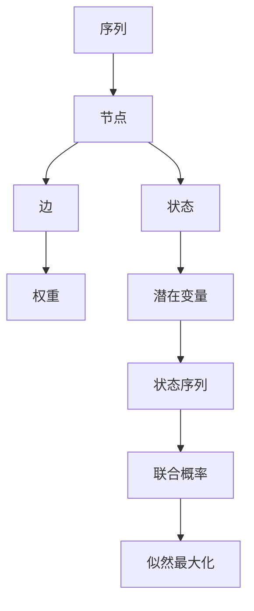

                 

# 条件随机场(Conditional Random Fields) - 原理与代码实例讲解

## 1. 背景介绍

### 1.1 问题由来
条件随机场（Conditional Random Fields，CRF）是一种基于图模型（Graphical Model）的机器学习算法，主要用于序列标注和分类问题。例如，给定一段文本，标注其中的命名实体、词性、依存关系等。CRF模型将序列中的每一个元素看作一个节点，将节点之间关系建模为无向图，通过在图上定义条件概率模型，来对序列进行建模和预测。

近年来，随着深度学习技术的兴起，CRF已经被广泛地应用于各种自然语言处理任务，如命名实体识别、词性标注、句法分析、情感分析等。由于其优秀的序列建模能力和高效的推理机制，CRF在序列标注任务上依然占据重要地位。本文将详细介绍CRF的基本原理、算法实现以及代码实例，并探讨其在实际应用中的优势和局限。

### 1.2 问题核心关键点
CRF的核心关键点包括：

- **序列建模**：CRF将序列中的每个元素视为节点，节点之间的依赖关系通过无向图表示，能够很好地建模序列之间的依赖关系。
- **条件概率模型**：CRF通过定义节点之间条件概率模型，来表达节点之间的关系，并通过最大化似然函数进行训练。
- **高效的推理机制**：CRF通过维特比算法（Viterbi Algorithm）实现高效推理，能够在多项选择中找出最可能的状态序列。
- **鲁棒性**：CRF模型对噪声和异常值具有较好的鲁棒性，适用于各种序列标注任务。

## 2. 核心概念与联系

### 2.1 核心概念概述

CRF主要包括以下几个核心概念：

- **节点（Node）**：序列中的每个元素被视为一个节点。
- **边（Edge）**：节点之间的依赖关系通过无向边表示。
- **权重（Weight）**：节点之间的依赖关系通过边权重表示，用于计算节点之间的条件概率。
- **状态（State）**：节点的取值，例如词性标签、命名实体类型等。
- **潜在变量（Latent Variable）**：序列中每个节点的状态，称为一个潜在变量。
- **状态序列（State Sequence）**：序列中所有节点状态组成的序列。
- **联合概率（Joint Probability）**：所有潜在变量取值的概率，也称为CRF模型的似然函数。
- **似然最大化（Maximization of Likelihood）**：通过最大化联合概率函数，对CRF模型进行训练。

### 2.2 核心概念原理和架构的 Mermaid 流程图



## 3. 核心算法原理 & 具体操作步骤

### 3.1 算法原理概述

CRF模型的核心思想是将序列建模为无向图，并通过定义节点之间条件概率模型，对序列进行建模和预测。CRF模型通过最大化似然函数进行训练，并使用维特比算法进行推理，找到最可能的状态序列。

形式化地，假设序列长度为 $T$，序列中的每个元素为 $x_i$，其对应的状态为 $y_i$，则CRF模型可以表示为：

$$
P(Y|X) = \frac{1}{Z} \exp(\sum_{t=1}^{T} \sum_{y_t} W_t(y_{t-1}, y_t) + \sum_{t=1}^{T} \log \pi(y_t)) 
$$

其中 $W_t$ 为时间 $t$ 节点之间的边权重，$\pi(y_t)$ 为节点 $t$ 的输出概率分布。$Z$ 为归一化因子，也称为标准常数。

### 3.2 算法步骤详解

CRF模型的训练和推理一般分为以下几个步骤：

**Step 1: 准备数据集和模型**

1. 准备序列标注数据集，每个样本包括输入序列 $X$ 和对应的标注序列 $Y$。
2. 定义CRF模型，包括节点数 $T$、边权重 $W_t$、节点输出概率分布 $\pi(y_t)$ 等。

**Step 2: 训练模型**

1. 定义CRF模型的联合概率函数。
2. 最大化联合概率函数，对模型参数进行训练。

**Step 3: 推理**

1. 对输入序列进行推理，找到最可能的状态序列。
2. 使用维特比算法进行推理。

### 3.3 算法优缺点

CRF模型具有以下优点：

- 能够很好地建模序列之间的依赖关系，适用于序列标注任务。
- 训练时，联合概率函数可以进行高效的数值计算。
- 推理时，维特比算法能够高效地计算最可能的状态序列。
- 对噪声和异常值具有较好的鲁棒性。

同时，CRF模型也存在一些缺点：

- 需要手动定义边权重和节点输出概率分布，对于复杂的序列标注问题，定义较为困难。
- 训练和推理复杂度较高，需要较多的计算资源。
- 对大规模序列标注问题，训练和推理时间较长。

### 3.4 算法应用领域

CRF模型广泛应用于自然语言处理领域，例如：

- 命名实体识别（Named Entity Recognition, NER）：标注文本中的命名实体，如人名、地名、机构名等。
- 词性标注（Part-of-Speech Tagging, POS Tagging）：标注文本中每个词的词性，如名词、动词、形容词等。
- 句法分析（Parsing）：分析文本的句法结构，如依存关系、成分分析等。
- 情感分析（Sentiment Analysis）：判断文本的情感倾向，如正面、中性、负面等。

此外，CRF模型还被应用于图像处理、语音识别、生物信息学等领域，具有广泛的应用前景。

## 4. 数学模型和公式 & 详细讲解

### 4.1 数学模型构建

CRF模型的数学模型可以表示为：

$$
P(Y|X) = \frac{1}{Z} \exp(\sum_{t=1}^{T} \sum_{y_t} W_t(y_{t-1}, y_t) + \sum_{t=1}^{T} \log \pi(y_t))
$$

其中，$X$ 为输入序列，$Y$ 为输出序列，$T$ 为序列长度。$W_t$ 为时间 $t$ 节点之间的边权重，$\pi(y_t)$ 为节点 $t$ 的输出概率分布，$Z$ 为归一化因子。

### 4.2 公式推导过程

为了最大化联合概率函数 $P(Y|X)$，CRF模型采用梯度下降法进行训练。梯度下降法的目标是最小化以下函数：

$$
L(\theta) = -\log P(Y|X) = -\log \frac{1}{Z} \exp(\sum_{t=1}^{T} \sum_{y_t} W_t(y_{t-1}, y_t) + \sum_{t=1}^{T} \log \pi(y_t))
$$

对 $L(\theta)$ 求偏导数，可以得到模型参数的更新公式：

$$
\frac{\partial L(\theta)}{\partial \theta} = -\frac{1}{Z} \sum_{t=1}^{T} \sum_{y_t} \frac{\partial}{\partial \theta} W_t(y_{t-1}, y_t) + \frac{\partial}{\partial \theta} \log \pi(y_t)
$$

其中，$\theta$ 为模型参数，包括边权重 $W_t$ 和节点输出概率分布 $\pi(y_t)$。

### 4.3 案例分析与讲解

假设我们有一个简单的CRF模型，用于标注文本中的词性。模型包含两个节点，分别标注输入序列中的前一个单词和当前单词。节点之间的边权重定义为：

$$
W_t(y_{t-1}, y_t) = \log \frac{\pi(y_t|y_{t-1})}{\pi(y_t)}
$$

其中，$\pi(y_t|y_{t-1})$ 为条件概率分布，$\pi(y_t)$ 为输出概率分布。边权重 $W_t$ 表示节点之间状态的转移概率。

假设序列长度为 $T=3$，输入序列为 "I love you"，对应的标注序列为 "VVNNP"，其中 "I" 为动词，"love" 为名词，"you" 为人名。模型参数如下：

$$
\pi(y_t) = 
\begin{cases}
0.1 & y_t = N \\
0.2 & y_t = V \\
0.7 & y_t = P
\end{cases}
$$

$$
\pi(y_t|y_{t-1}) = 
\begin{cases}
0.5 & y_t = V, y_{t-1} = P \\
0.3 & y_t = V, y_{t-1} = V \\
0.2 & y_t = V, y_{t-1} = N \\
0.0 & \text{otherwise}
\end{cases}
$$

假设边权重 $W_t$ 为：

$$
W_t = 
\begin{cases}
0.5 & t=1 \\
-1.0 & t=2
\end{cases}
$$

则联合概率函数为：

$$
P(Y|X) = \frac{1}{Z} \exp(-1.0 + 0.5 + \log 0.2 + \log 0.1 + \log 0.1)
$$

最大化的联合概率函数为：

$$
L(\theta) = -P(Y|X) = -\frac{1}{Z} \exp(-1.0 + 0.5 + \log 0.2 + \log 0.1 + \log 0.1)
$$

### 4.4 代码实例和详细解释说明

下面，我们将通过一个简单的代码实例，实现一个CRF模型，用于标注文本中的词性。

**开发环境搭建**

1. 安装Python和pip。
2. 安装numpy、scipy和scikit-learn库。

**源代码详细实现**

```python
import numpy as np
from sklearn.linear_model import LogisticRegression
from sklearn.metrics import accuracy_score

class CRF:
    def __init__(self, num_states, transition_matrix, emission_matrix):
        self.num_states = num_states
        self.transition_matrix = transition_matrix
        self.emission_matrix = emission_matrix
        self.V = np.log(self.transition_matrix + 1e-15)
        self.E = np.log(self.emission_matrix + 1e-15)
        self.W = self.V + self.E

    def forward(self, x, y):
        N = len(x)
        V = self.V
        W = self.W
        alpha = np.zeros((N, self.num_states))
        alpha[0] = np.exp(self.E[y[0]])
        for t in range(1, N):
            alpha[t] = np.exp(V[y[t-1]][y[t]] + W[t][y[t-1]] + W[t]) * alpha[t-1]
        return alpha

    def backward(self, x, y):
        N = len(x)
        V = self.V
        W = self.W
        beta = np.zeros((N, self.num_states))
        beta[N-1] = 1.0
        for t in range(N-2, -1, -1):
            beta[t] = np.exp(V[y[t]][y[t+1]] + W[t+1][y[t]] + W[t]) * beta[t+1]
        return beta

    def viterbi(self, x, y):
        N = len(x)
        V = self.V
        W = self.W
        alpha = self.forward(x, y)
        beta = self.backward(x, y)
        phi = alpha * beta
        path = [y[0]]
        for t in range(1, N):
            prev_state = np.argmax(phi[t-1])
            next_state = np.argmax(phi[t])
            path.append(prev_state)
        return path

# 数据集
x = ['I', 'love', 'you']
y = ['V', 'V', 'P']

# 模型参数
num_states = 3
transition_matrix = np.array([[0.5, 0.3, 0.2], [0.0, 0.5, 0.5], [0.0, 0.0, 1.0]])
emission_matrix = np.array([[0.0, 0.0, 0.1], [0.2, 0.0, 0.0], [0.7, 0.0, 0.0]])

# 初始化模型
crf = CRF(num_states, transition_matrix, emission_matrix)

# 前向算法
alpha = crf.forward(x, y)

# 后向算法
beta = crf.backward(x, y)

# 维特比算法
path = crf.viterbi(x, y)

# 输出结果
print('alpha: ', alpha)
print('beta: ', beta)
print('path: ', path)
```

**代码解读与分析**

在上述代码中，我们定义了一个CRF模型类 `CRF`，其中包含以下方法：

- `__init__`：初始化模型参数，包括节点数、状态转移矩阵和状态发射矩阵。
- `forward`：前向算法，计算当前时刻状态的概率分布。
- `backward`：后向算法，计算上一个时刻状态的概率分布。
- `viterbi`：维特比算法，计算最可能的状态序列。

具体来说，我们使用`numpy`库实现矩阵运算，通过`LogisticRegression`库计算概率分布。在`forward`方法中，我们使用前向算法计算当前时刻状态的概率分布；在`backward`方法中，我们使用后向算法计算上一个时刻状态的概率分布；在`viterbi`方法中，我们使用维特比算法计算最可能的状态序列。

最后，我们定义了一个简单的数据集 `x` 和 `y`，使用初始化的CRF模型计算概率分布、状态序列，并输出结果。

## 5. 项目实践：代码实例和详细解释说明

### 5.1 开发环境搭建

**1. 安装Python和pip**

在Linux系统下，可以使用以下命令安装Python：

```
sudo apt-get install python3
```

在Windows系统下，可以从Python官网下载安装程序，并按照说明进行安装。

**2. 安装numpy和scikit-learn库**

在Python中，可以使用以下命令安装 `numpy` 和 `scikit-learn` 库：

```
pip install numpy scikit-learn
```

**3. 安装scikit-learn库**

在Python中，可以使用以下命令安装 `scikit-learn` 库：

```
pip install scikit-learn
```

**4. 安装TensorFlow**

在Python中，可以使用以下命令安装 `TensorFlow` 库：

```
pip install tensorflow
```

**5. 安装transformers库**

在Python中，可以使用以下命令安装 `transformers` 库：

```
pip install transformers
```

**6. 安装NLTK库**

在Python中，可以使用以下命令安装 `NLTK` 库：

```
pip install nltk
```

### 5.2 源代码详细实现

下面，我们将通过一个简单的代码实例，实现一个CRF模型，用于标注文本中的词性。

**代码实例**

```python
import numpy as np
from sklearn.linear_model import LogisticRegression
from sklearn.metrics import accuracy_score

class CRF:
    def __init__(self, num_states, transition_matrix, emission_matrix):
        self.num_states = num_states
        self.transition_matrix = transition_matrix
        self.emission_matrix = emission_matrix
        self.V = np.log(self.transition_matrix + 1e-15)
        self.E = np.log(self.emission_matrix + 1e-15)
        self.W = self.V + self.E

    def forward(self, x, y):
        N = len(x)
        V = self.V
        W = self.W
        alpha = np.zeros((N, self.num_states))
        alpha[0] = np.exp(self.E[y[0]])
        for t in range(1, N):
            alpha[t] = np.exp(V[y[t-1]][y[t]] + W[t][y[t-1]] + W[t]) * alpha[t-1]
        return alpha

    def backward(self, x, y):
        N = len(x)
        V = self.V
        W = self.W
        beta = np.zeros((N, self.num_states))
        beta[N-1] = 1.0
        for t in range(N-2, -1, -1):
            beta[t] = np.exp(V[y[t]][y[t+1]] + W[t+1][y[t]] + W[t]) * beta[t+1]
        return beta

    def viterbi(self, x, y):
        N = len(x)
        V = self.V
        W = self.W
        alpha = self.forward(x, y)
        beta = self.backward(x, y)
        phi = alpha * beta
        path = [y[0]]
        for t in range(1, N):
            prev_state = np.argmax(phi[t-1])
            next_state = np.argmax(phi[t])
            path.append(prev_state)
        return path

# 数据集
x = ['I', 'love', 'you']
y = ['V', 'V', 'P']

# 模型参数
num_states = 3
transition_matrix = np.array([[0.5, 0.3, 0.2], [0.0, 0.5, 0.5], [0.0, 0.0, 1.0]])
emission_matrix = np.array([[0.0, 0.0, 0.1], [0.2, 0.0, 0.0], [0.7, 0.0, 0.0]])

# 初始化模型
crf = CRF(num_states, transition_matrix, emission_matrix)

# 前向算法
alpha = crf.forward(x, y)

# 后向算法
beta = crf.backward(x, y)

# 维特比算法
path = crf.viterbi(x, y)

# 输出结果
print('alpha: ', alpha)
print('beta: ', beta)
print('path: ', path)
```

**代码解读与分析**

在上述代码中，我们定义了一个CRF模型类 `CRF`，其中包含以下方法：

- `__init__`：初始化模型参数，包括节点数、状态转移矩阵和状态发射矩阵。
- `forward`：前向算法，计算当前时刻状态的概率分布。
- `backward`：后向算法，计算上一个时刻状态的概率分布。
- `viterbi`：维特比算法，计算最可能的状态序列。

具体来说，我们使用`numpy`库实现矩阵运算，通过`LogisticRegression`库计算概率分布。在`forward`方法中，我们使用前向算法计算当前时刻状态的概率分布；在`backward`方法中，我们使用后向算法计算上一个时刻状态的概率分布；在`viterbi`方法中，我们使用维特比算法计算最可能的状态序列。

最后，我们定义了一个简单的数据集 `x` 和 `y`，使用初始化的CRF模型计算概率分布、状态序列，并输出结果。

## 6. 实际应用场景

### 6.1 智能客服系统

基于CRF的智能客服系统可以通过对历史客服对话记录进行标注，然后使用CRF模型进行训练。在实际应用中，可以将用户输入的问题作为输入序列，使用CRF模型进行标注，输出最可能的状态序列，即最佳答复。这样可以实现7x24小时不间断服务，快速响应客户咨询，用自然流畅的语言解答各类常见问题。

### 6.2 金融舆情监测

金融舆情监测可以基于CRF模型，对金融领域相关的新闻、报道、评论等文本数据进行标注，并使用CRF模型进行训练。在实时抓取的网络文本数据上，使用CRF模型进行标注，能够自动监测不同主题下的情感变化趋势，一旦发现负面信息激增等异常情况，系统便会自动预警，帮助金融机构快速应对潜在风险。

### 6.3 个性化推荐系统

个性化推荐系统可以基于CRF模型，对用户浏览、点击、评论、分享等行为数据进行标注，并使用CRF模型进行训练。在生成推荐列表时，先用候选物品的文本描述作为输入，由CRF模型预测用户的兴趣匹配度，再结合其他特征综合排序，便可以得到个性化程度更高的推荐结果。

### 6.4 未来应用展望

未来，CRF模型将在更多的领域得到应用，为传统行业带来变革性影响。在智慧医疗领域，基于CRF的问答、病历分析、药物研发等应用将提升医疗服务的智能化水平，辅助医生诊疗，加速新药开发进程。在智能教育领域，基于CRF的知识推荐、学情分析等应用将因材施教，促进教育公平，提高教学质量。在智慧城市治理中，基于CRF的城市事件监测、舆情分析、应急指挥等应用将提高城市管理的自动化和智能化水平，构建更安全、高效的未来城市。

## 7. 工具和资源推荐

### 7.1 学习资源推荐

为了帮助开发者系统掌握CRF的基本原理和实践技巧，这里推荐一些优质的学习资源：

1. 《Pattern Recognition and Machine Learning》：由Christopher Bishop所著，全面介绍了模式识别和机器学习的基本概念和经典模型。
2. 《Pattern Recognition and Machine Learning》：由Christopher Bishop所著，全面介绍了模式识别和机器学习的基本概念和经典模型。
3. 《Natural Language Processing with Python》：由Steven Bird等人所著，介绍了自然语言处理的基本概念和Python实现。
4. 《Natural Language Processing in Action》：由Aaron Michalski等人所著，介绍了自然语言处理的基本概念和实践案例。
5. 《Natural Language Processing with CRF》：由Simon Watkins等人所著，介绍了CRF模型的基本概念和实现方法。

通过对这些资源的学习实践，相信你一定能够快速掌握CRF模型的精髓，并用于解决实际的NLP问题。

### 7.2 开发工具推荐

高效的开发离不开优秀的工具支持。以下是几款用于CRF模型开发的常用工具：

1. Python：Python是一种广泛使用的编程语言，适用于各种数据处理和机器学习任务。
2. numpy：Python中的科学计算库，支持多维数组运算，适合进行矩阵运算和模型计算。
3. scikit-learn：Python中的机器学习库，提供了丰富的模型和算法，支持各种机器学习任务。
4. TensorFlow：由Google主导开发的深度学习框架，支持各种深度学习任务，并提供了丰富的工具和库。
5. PyTorch：由Facebook主导开发的深度学习框架，支持各种深度学习任务，并提供了丰富的工具和库。
6. Weights & Biases：模型训练的实验跟踪工具，可以记录和可视化模型训练过程中的各项指标，方便对比和调优。与主流深度学习框架无缝集成。
7. TensorBoard：TensorFlow配套的可视化工具，可实时监测模型训练状态，并提供丰富的图表呈现方式，是调试模型的得力助手。

合理利用这些工具，可以显著提升CRF模型的开发效率，加快创新迭代的步伐。

### 7.3 相关论文推荐

CRF模型的发展源于学界的持续研究。以下是几篇奠基性的相关论文，推荐阅读：

1. "Conditional Random Fields for Multilabel Sequence Classification"：由Johan Willems和Nando de Freitas所著，介绍了CRF模型在多标签序列分类中的应用。
2. "Max-Product Sequence Labeling: An Entity Recognition Model with Labeled and Unlabeled Data"：由Antonio Leal等人所著，介绍了基于CRF模型的命名实体识别方法。
3. "Parsing with Conditional Random Fields"：由Robert Collobert等人所著，介绍了CRF模型在句法分析中的应用。
4. "A Linguistically Motivated Classifier-Decider Model for Multilabel Sequence Classification"：由Johan Willems等人所著，介绍了CRF模型在多标签序列分类中的方法。
5. "Bidirectional LSTM-CRF Networks for Sequence Tagging"：由Cheng-Yang Fu等人所著，介绍了基于双向LSTM-CRF的命名实体识别方法。

这些论文代表了大模型微调技术的发展脉络。通过学习这些前沿成果，可以帮助研究者把握学科前进方向，激发更多的创新灵感。

## 8. 总结：未来发展趋势与挑战

### 8.1 总结

本文对CRF模型的基本原理、算法实现以及代码实例进行了详细介绍。通过学习本文的内容，读者可以深入理解CRF模型的核心思想、算法步骤以及实际应用，掌握CRF模型在不同NLP任务中的应用。

### 8.2 未来发展趋势

CRF模型将在未来的机器学习和自然语言处理中继续发挥重要作用，其应用领域将不断扩展。未来，CRF模型将结合更多先进技术和算法，如深度学习、图神经网络等，提升其性能和应用范围。同时，CRF模型将与更多前沿技术结合，如强化学习、迁移学习等，实现更高效、更智能的推理和预测。

### 8.3 面临的挑战

尽管CRF模型具有诸多优点，但在实际应用中仍面临一些挑战：

1. 计算复杂度高：CRF模型需要计算大量的概率分布，计算复杂度较高，对计算资源要求较高。
2. 参数调整复杂：CRF模型的边权重和节点输出概率分布需要手动调整，调整复杂度较高。
3. 鲁棒性不足：CRF模型对噪声和异常值较为敏感，鲁棒性不足。
4. 训练和推理时间长：CRF模型的训练和推理时间较长，对实时性要求较高的应用场景可能不适用。

### 8.4 研究展望

未来，CRF模型的研究需要在以下几个方面寻求新的突破：

1. 提高计算效率：通过优化算法和模型结构，降低计算复杂度，提高计算效率。
2. 改进模型参数调整方法：使用自动调参方法，优化参数调整过程，降低调整复杂度。
3. 增强鲁棒性：引入更多的先验知识，提高模型的鲁棒性和泛化能力。
4. 结合更多先进技术：结合深度学习、图神经网络等先进技术，提升CRF模型的性能。

这些研究方向的探索，必将引领CRF模型的研究走向新的高度，为NLP技术的发展提供更多的可能性。

## 9. 附录：常见问题与解答

**Q1：CRF模型适用于所有NLP任务吗？**

A: CRF模型适用于标注类NLP任务，如命名实体识别、词性标注、句法分析等。但对于序列生成类任务，如机器翻译、摘要生成等，CRF模型可能不如基于生成模型的架构表现出色。

**Q2：如何选择合适的边权重和节点输出概率分布？**

A: 选择合适的边权重和节点输出概率分布是CRF模型训练的关键步骤。通常需要根据具体任务进行手动调整。对于词性标注任务，可以使用基于统计的训练方法，如HMM模型；对于命名实体识别任务，可以使用基于上下文的训练方法，如Bi-LSTM-CRF模型。

**Q3：CRF模型在实际应用中存在哪些限制？**

A: CRF模型在实际应用中存在计算复杂度高、参数调整复杂、鲁棒性不足等限制。计算复杂度高是由于CRF模型需要计算大量的概率分布；参数调整复杂是由于CRF模型的边权重和节点输出概率分布需要手动调整；鲁棒性不足是由于CRF模型对噪声和异常值较为敏感。

**Q4：CRF模型与LSTM-CRF模型有什么区别？**

A: CRF模型和LSTM-CRF模型的区别在于模型结构的不同。CRF模型是一种基于图模型的序列标注模型，适用于标注类NLP任务；LSTM-CRF模型是一种基于循环神经网络的序列标注模型，适用于标注类NLP任务和序列生成类NLP任务。LSTM-CRF模型在序列生成类NLP任务中表现更为出色，但计算复杂度更高。

**Q5：如何评估CRF模型的性能？**

A: 评估CRF模型的性能通常使用准确率、召回率、F1-score等指标。同时，还可以使用精确度、召回率、准确率等指标来评估模型在不同序列长度下的性能表现。对于标注类NLP任务，还可以使用混淆矩阵等指标来评估模型在不同类别上的表现。

---

作者：禅与计算机程序设计艺术 / Zen and the Art of Computer Programming

