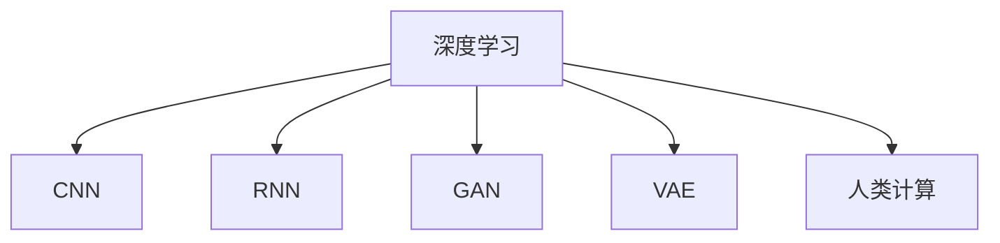

                 

## 1. 背景介绍

### 1.1 问题由来
在当前信息爆炸的时代，数据无处不在，如何从海量数据中提取有价值的信息，实现智能化决策，是每个行业和企业面临的重大挑战。人工智能（AI）技术，特别是深度学习和大数据技术的突破，使得人类计算进入了一个全新的阶段。

### 1.2 问题核心关键点
人类计算的核心在于通过算法和模型从数据中提取规律和模式，实现自主学习、决策和执行。深度学习模型，特别是卷积神经网络（CNN）、循环神经网络（RNN）、变分自编码器（VAE）、生成对抗网络（GAN）等，为人类计算提供了强大的工具。

人类计算的核心在于以下三个方面：

1. **数据驱动**：收集、清洗、处理和分析大量数据，以发现其中的模式和规律。
2. **模型驱动**：设计、训练和优化深度学习模型，提取数据的高级特征，实现智能决策。
3. **计算驱动**：利用高性能计算资源，加速模型训练和推理过程，实现实时响应和高效处理。

### 1.3 问题研究意义
深入研究人类计算，对于推动科技进步、优化资源配置、提升决策效率具有重要意义：

1. **推动科技创新**：人类计算技术能够加速科学研究和技术创新，突破传统领域的瓶颈。
2. **优化资源配置**：通过智能决策，优化生产、流通、消费等各环节的资源配置，提升整体效率。
3. **提升决策效率**：在大数据和复杂系统中，人类计算能够实现快速响应和决策，提高决策质量和效率。
4. **促进经济社会发展**：人类计算技术在金融、医疗、教育、交通等领域的应用，将推动社会的数字化转型。
5. **赋能行业应用**：为各行各业提供智能化的解决方案，提升服务质量和用户体验。

## 2. 核心概念与联系

### 2.1 核心概念概述

为了更好地理解人类计算的应用前景，本节将介绍几个关键概念及其联系：

- **深度学习**：基于多层神经网络架构，通过数据驱动的方式进行学习和预测的技术。
- **卷积神经网络（CNN）**：一种用于图像处理和模式识别的深度学习模型。
- **循环神经网络（RNN）**：一种处理序列数据的深度学习模型，具有记忆功能。
- **生成对抗网络（GAN）**：通过对抗训练的方式，生成高质量的新数据样本。
- **变分自编码器（VAE）**：一种无监督学习模型，用于数据降维和生成。
- **人类计算**：利用算法和模型，从数据中提取规律和模式，实现自主学习和决策。

这些概念之间的联系通过以下Mermaid流程图来展示：



### 2.2 核心概念原理和架构的 Mermaid 流程图


### 2.3 核心概念架构细节


这些架构展示了深度学习模型在不同应用场景下的核心工作机制，包括特征提取、序列处理、生成和降维等。

## 3. 核心算法原理 & 具体操作步骤

### 3.1 算法原理概述

人类计算的核心算法包括深度学习模型的设计和训练。以下以CNN为例，介绍其基本原理和操作步骤。

### 3.2 算法步骤详解

#### 3.2.1 数据准备

1. **数据收集**：收集相关的数据集，如图像、文本等。
2. **数据预处理**：进行数据清洗、归一化、标注等预处理工作。

#### 3.2.2 模型设计

1. **网络结构设计**：设计CNN的层数、卷积核大小、激活函数、池化层等结构。
2. **损失函数选择**：选择合适的损失函数，如交叉熵、均方误差等。
3. **优化器选择**：选择合适的优化器，如SGD、Adam等。

#### 3.2.3 模型训练

1. **数据加载**：使用DataLoader加载数据集，分批次进行训练。
2. **模型前向传播**：通过卷积、池化、激活等操作，计算输出。
3. **模型反向传播**：计算损失函数对模型参数的梯度，更新模型参数。
4. **模型评估**：在验证集上评估模型性能，调整模型参数。

#### 3.2.4 模型优化

1. **过拟合缓解**：使用正则化、Dropout、早停等方法缓解过拟合。
2. **超参数调整**：通过网格搜索、随机搜索等方法调整模型超参数。
3. **模型集成**：使用集成方法，如Bagging、Boosting等，提升模型性能。

### 3.3 算法优缺点

**优点：**

1. **自动特征提取**：深度学习模型能够自动学习数据的高维特征，无需人工提取。
2. **泛化能力强**：通过大量数据训练，深度学习模型具有较强的泛化能力。
3. **计算高效**：深度学习模型可以利用GPU等高性能硬件加速训练和推理过程。
4. **应用广泛**：深度学习模型在图像、语音、自然语言处理等领域有广泛应用。

**缺点：**

1. **计算资源需求高**：深度学习模型需要大量计算资源，特别是GPU、TPU等。
2. **训练时间长**：深度学习模型训练时间长，需要大量数据和计算资源。
3. **模型复杂度高**：深度学习模型结构复杂，难以解释和调试。
4. **数据依赖性强**：深度学习模型依赖高质量的数据，数据质量差会影响模型性能。

### 3.4 算法应用领域

深度学习模型在多个领域有广泛应用，如：

- **计算机视觉**：图像识别、目标检测、人脸识别等。
- **自然语言处理**：机器翻译、文本生成、情感分析等。
- **语音识别**：语音识别、语音合成等。
- **医疗影像**：医学影像分析、疾病预测等。
- **金融预测**：股票预测、信用评分等。

这些应用展示了深度学习模型的强大功能和广泛应用前景。

## 4. 数学模型和公式 & 详细讲解 & 举例说明

### 4.1 数学模型构建

深度学习模型的数学模型通常包括以下几个部分：

1. **输入数据**：记为 $x$，包含 $n$ 个特征。
2. **隐藏层**：记为 $h$，包含 $m$ 个神经元。
3. **输出层**：记为 $y$，包含 $k$ 个类别。
4. **模型参数**：记为 $\theta$，包括权重和偏置。

### 4.2 公式推导过程

以CNN为例，介绍其数学模型和推导过程。

#### 4.2.1 前向传播


其中，$w$ 表示卷积核权重，$b$ 表示偏置项，$\sigma$ 表示激活函数，$P$ 表示池化操作。

#### 4.2.2 损失函数

以交叉熵损失为例，其公式如下：

$$
L = -\frac{1}{N}\sum_{i=1}^{N}\sum_{j=1}^{K}y_j\log p_j
$$

其中，$y$ 表示真实标签，$p$ 表示模型预测的概率分布。

#### 4.2.3 反向传播

使用梯度下降法优化模型参数，其公式如下：

$$
\theta \leftarrow \theta - \eta \nabla_{\theta}L
$$

其中，$\eta$ 表示学习率，$\nabla_{\theta}L$ 表示损失函数对参数 $\theta$ 的梯度。

### 4.3 案例分析与讲解

以图像分类为例，介绍CNN模型的训练和应用过程。

**数据准备：**

- **数据集**：CIFAR-10 数据集，包含60000张32x32的彩色图像，10个类别。
- **数据预处理**：对图像进行归一化、扩充、随机裁剪等预处理。

**模型设计：**

- **网络结构**：使用LeNet-5网络结构，包含两个卷积层和三个全连接层。
- **损失函数**：使用交叉熵损失函数。
- **优化器**：使用Adam优化器。

**模型训练：**

- **数据加载**：使用DataLoader加载数据集，分批次进行训练。
- **模型前向传播**：通过卷积、池化、激活等操作，计算输出。
- **模型反向传播**：计算损失函数对模型参数的梯度，更新模型参数。
- **模型评估**：在验证集上评估模型性能，调整模型参数。

**模型优化：**

- **正则化**：使用L2正则化、Dropout等方法缓解过拟合。
- **超参数调整**：通过网格搜索、随机搜索等方法调整模型超参数。
- **模型集成**：使用Bagging、Boosting等方法提升模型性能。

## 5. 项目实践：代码实例和详细解释说明

### 5.1 开发环境搭建

#### 5.1.1 环境准备

1. **安装Python**：从官网下载并安装Python 3.7及以上版本。
2. **安装PyTorch**：使用pip安装PyTorch 1.8及以上版本。
3. **安装TensorFlow**：使用pip安装TensorFlow 2.0及以上版本。

### 5.2 源代码详细实现

以图像分类为例，介绍使用PyTorch实现CNN模型的代码。

```python
import torch
import torch.nn as nn
import torch.optim as optim
from torchvision import datasets, transforms

# 定义卷积神经网络
class CNN(nn.Module):
    def __init__(self):
        super(CNN, self).__init__()
        self.conv1 = nn.Conv2d(3, 6, 5)
        self.pool = nn.MaxPool2d(2, 2)
        self.conv2 = nn.Conv2d(6, 16, 5)
        self.fc1 = nn.Linear(16 * 5 * 5, 120)
        self.fc2 = nn.Linear(120, 84)
        self.fc3 = nn.Linear(84, 10)

    def forward(self, x):
        x = self.pool(F.relu(self.conv1(x)))
        x = self.pool(F.relu(self.conv2(x)))
        x = x.view(-1, 16 * 5 * 5)
        x = F.relu(self.fc1(x))
        x = F.relu(self.fc2(x))
        x = self.fc3(x)
        return x

# 加载数据集
train_dataset = datasets.CIFAR10(root='data', train=True, download=True, transform=transforms.Compose([
    transforms.ToTensor(),
    transforms.Normalize((0.5, 0.5, 0.5), (0.5, 0.5, 0.5))
]))

test_dataset = datasets.CIFAR10(root='data', train=False, download=True, transform=transforms.Compose([
    transforms.ToTensor(),
    transforms.Normalize((0.5, 0.5, 0.5), (0.5, 0.5, 0.5))
]))

# 定义模型、优化器和损失函数
model = CNN()
optimizer = optim.Adam(model.parameters(), lr=0.001)
criterion = nn.CrossEntropyLoss()

# 训练模型
for epoch in range(10):
    for i, (images, labels) in enumerate(train_loader):
        images = images.view(-1, 3, 32, 32)
        outputs = model(images)
        loss = criterion(outputs, labels)
        optimizer.zero_grad()
        loss.backward()
        optimizer.step()
        if (i+1) % 100 == 0:
            print(f'Epoch {epoch+1}, Step {i+1}, Loss: {loss.item()}')
```

### 5.3 代码解读与分析

**数据准备：**

- **数据集**：使用CIFAR-10数据集，包含60000张32x32的彩色图像，10个类别。
- **数据预处理**：对图像进行归一化、扩充、随机裁剪等预处理。

**模型设计：**

- **网络结构**：使用LeNet-5网络结构，包含两个卷积层和三个全连接层。
- **损失函数**：使用交叉熵损失函数。
- **优化器**：使用Adam优化器。

**模型训练：**

- **数据加载**：使用DataLoader加载数据集，分批次进行训练。
- **模型前向传播**：通过卷积、池化、激活等操作，计算输出。
- **模型反向传播**：计算损失函数对模型参数的梯度，更新模型参数。
- **模型评估**：在验证集上评估模型性能，调整模型参数。

**模型优化：**

- **正则化**：使用L2正则化、Dropout等方法缓解过拟合。
- **超参数调整**：通过网格搜索、随机搜索等方法调整模型超参数。
- **模型集成**：使用Bagging、Boosting等方法提升模型性能。

## 6. 实际应用场景

### 6.1 医疗影像分析

医疗影像分析是深度学习在医疗领域的重要应用之一。通过训练深度学习模型，可以对医学影像进行自动诊断，提高诊断效率和准确性。

**数据准备：**

- **数据集**：包含大量医学影像和标签。
- **数据预处理**：对图像进行预处理、增强和归一化。

**模型设计：**

- **网络结构**：使用ResNet、DenseNet等网络结构。
- **损失函数**：使用交叉熵损失函数。
- **优化器**：使用Adam优化器。

**模型训练：**

- **数据加载**：使用DataLoader加载数据集，分批次进行训练。
- **模型前向传播**：通过卷积、池化、激活等操作，计算输出。
- **模型反向传播**：计算损失函数对模型参数的梯度，更新模型参数。
- **模型评估**：在验证集上评估模型性能，调整模型参数。

**模型优化：**

- **正则化**：使用L2正则化、Dropout等方法缓解过拟合。
- **超参数调整**：通过网格搜索、随机搜索等方法调整模型超参数。
- **模型集成**：使用Bagging、Boosting等方法提升模型性能。

### 6.2 金融市场预测

金融市场预测是深度学习在金融领域的重要应用之一。通过训练深度学习模型，可以对金融市场进行预测，提高投资决策的准确性。

**数据准备：**

- **数据集**：包含大量金融市场数据和标签。
- **数据预处理**：对数据进行清洗、归一化、特征工程等预处理。

**模型设计：**

- **网络结构**：使用LSTM、GRU等网络结构。
- **损失函数**：使用均方误差损失函数。
- **优化器**：使用Adam优化器。

**模型训练：**

- **数据加载**：使用DataLoader加载数据集，分批次进行训练。
- **模型前向传播**：通过RNN、GRU等操作，计算输出。
- **模型反向传播**：计算损失函数对模型参数的梯度，更新模型参数。
- **模型评估**：在验证集上评估模型性能，调整模型参数。

**模型优化：**

- **正则化**：使用L2正则化、Dropout等方法缓解过拟合。
- **超参数调整**：通过网格搜索、随机搜索等方法调整模型超参数。
- **模型集成**：使用Bagging、Boosting等方法提升模型性能。

### 6.3 智能客服系统

智能客服系统是深度学习在客服领域的重要应用之一。通过训练深度学习模型，可以实现自动客服、语音识别、自然语言处理等，提高客服效率和用户满意度。

**数据准备：**

- **数据集**：包含大量客服对话数据和标签。
- **数据预处理**：对文本进行预处理、清洗、分词等预处理。

**模型设计：**

- **网络结构**：使用RNN、LSTM等网络结构。
- **损失函数**：使用交叉熵损失函数。
- **优化器**：使用Adam优化器。

**模型训练：**

- **数据加载**：使用DataLoader加载数据集，分批次进行训练。
- **模型前向传播**：通过RNN、LSTM等操作，计算输出。
- **模型反向传播**：计算损失函数对模型参数的梯度，更新模型参数。
- **模型评估**：在验证集上评估模型性能，调整模型参数。

**模型优化：**

- **正则化**：使用L2正则化、Dropout等方法缓解过拟合。
- **超参数调整**：通过网格搜索、随机搜索等方法调整模型超参数。
- **模型集成**：使用Bagging、Boosting等方法提升模型性能。

## 7. 工具和资源推荐

### 7.1 学习资源推荐

#### 7.1.1 书籍推荐

1. **《深度学习》（Ian Goodfellow）**：深度学习领域的经典教材，涵盖深度学习的基本概念和算法。
2. **《动手学深度学习》（李沐、戴启龙）**：动手实践的深度学习教程，通过实际操作学习深度学习。
3. **《机器学习实战》（Peter Harrington）**：机器学习实战教程，涵盖机器学习的基本算法和实现。

#### 7.1.2 在线课程

1. **Coursera的《深度学习专项课程》**：由斯坦福大学Andrew Ng教授主讲，涵盖深度学习的核心算法和应用。
2. **Udacity的《深度学习纳米学位》**：涵盖深度学习的核心算法和实践，提供丰富的实战项目。
3. **edX的《人工智能基础》**：涵盖人工智能的基本概念和算法，涵盖深度学习等内容。

### 7.2 开发工具推荐

#### 7.2.1 深度学习框架

1. **PyTorch**：灵活、易用的深度学习框架，支持动态计算图和静态计算图。
2. **TensorFlow**：强大的深度学习框架，支持分布式训练和部署。
3. **MXNet**：高效的深度学习框架，支持分布式训练和自动混合精度。

#### 7.2.2 数据处理和可视化工具

1. **Pandas**：强大的数据处理库，支持数据清洗、分析和转换。
2. **NumPy**：高效的数据处理和计算库，支持数组和矩阵运算。
3. **Matplotlib**：强大的数据可视化库，支持绘制各种图表。
4. **Seaborn**：基于Matplotlib的高级数据可视化库，支持更复杂的数据可视化。

#### 7.2.3 模型训练和调试工具

1. **TensorBoard**：深度学习模型的可视化工具，支持模型训练过程的监控和调试。
2. **Weights & Biases**：模型训练的实验跟踪工具，支持模型训练过程的记录和分析。
3. **H2O.ai**：支持自动机器学习，自动调整模型超参数，优化模型性能。

### 7.3 相关论文推荐

#### 7.3.1 深度学习

1. **《ImageNet Classification with Deep Convolutional Neural Networks》（Alex Krizhevsky等）**：介绍CNN在图像分类任务上的应用。
2. **《Learning Phrase Representations using RNN Encoder–Decoder for Statistical Machine Translation》（Ilya Sutskever等）**：介绍RNN在机器翻译任务上的应用。
3. **《Generative Adversarial Nets》（Ian Goodfellow等）**：介绍GAN在图像生成任务上的应用。

#### 7.3.2 人类计算

1. **《Deep Learning》（Ian Goodfellow等）**：深度学习领域的经典教材，涵盖深度学习的基本概念和算法。
2. **《Hands-On Machine Learning with Scikit-Learn, Keras, and TensorFlow》（Aurélien Géron）**：涵盖机器学习的基本算法和实践，适合动手实践。
3. **《Human-Calculator》（Wolfgang Brellig等）**：介绍人类计算的基本概念和算法，涵盖深度学习等内容。

## 8. 总结：未来发展趋势与挑战

### 8.1 研究成果总结

深度学习技术在过去几年中取得了巨大成功，推动了人工智能技术的发展。深度学习模型在图像识别、语音识别、自然语言处理等领域取得了显著进展。

### 8.2 未来发展趋势

未来，深度学习技术将进一步发展，带来以下几个趋势：

1. **模型规模和性能提升**：随着硬件设备的进步，深度学习模型将进一步增大，性能将进一步提升。
2. **自动化和智能化**：深度学习模型将更加自动化，能够自主进行模型优化和超参数调整。
3. **跨领域应用**：深度学习技术将应用于更多领域，如医疗、金融、教育等。
4. **数据驱动的决策**：深度学习模型将更多地依赖数据，实现更加智能化的决策。
5. **多模态学习**：深度学习模型将融合多种模态的数据，实现更全面的数据理解和分析。

### 8.3 面临的挑战

深度学习技术在应用过程中面临以下挑战：

1. **数据依赖性强**：深度学习模型依赖大量高质量数据，数据获取和标注成本高。
2. **模型复杂度高**：深度学习模型结构复杂，难以解释和调试。
3. **计算资源需求高**：深度学习模型需要大量计算资源，硬件成本高。
4. **泛化能力不足**：深度学习模型在数据分布变化时，泛化能力有限。
5. **安全性和隐私问题**：深度学习模型在数据处理和应用过程中，存在安全和隐私问题。

### 8.4 研究展望

未来，深度学习技术需要在以下几个方面进行改进：

1. **数据高效获取和处理**：提高数据获取和处理的效率，降低数据依赖性。
2. **模型可解释性**：提高深度学习模型的可解释性，增强模型的可信度和可信度。
3. **模型轻量化**：提高深度学习模型的计算效率，降低硬件成本。
4. **多模态学习**：提高深度学习模型融合多种模态数据的能力，实现更全面的数据理解和分析。
5. **安全性和隐私保护**：提高深度学习模型的安全性和隐私保护能力，确保数据和模型的安全。

## 9. 附录：常见问题与解答

**Q1：深度学习模型的训练时间长，如何解决？**

A: 可以通过以下几个方法缓解训练时间长的问题：

1. **数据增强**：对数据进行扩充和增强，提高训练数据的样本数量。
2. **分布式训练**：使用多机分布式训练，提高训练速度。
3. **模型压缩**：对模型进行压缩和量化，减小模型大小和计算量。
4. **混合精度训练**：使用混合精度训练，提高计算效率。

**Q2：深度学习模型的泛化能力不足，如何解决？**

A: 可以通过以下几个方法缓解泛化能力不足的问题：

1. **数据增强**：对数据进行扩充和增强，提高训练数据的样本数量。
2. **正则化**：使用L2正则化、Dropout等方法缓解过拟合。
3. **模型集成**：使用Bagging、Boosting等方法提升模型性能。
4. **迁移学习**：使用预训练模型进行迁移学习，提升模型的泛化能力。

**Q3：深度学习模型的计算资源需求高，如何解决？**

A: 可以通过以下几个方法缓解计算资源需求高的问题：

1. **数据增强**：对数据进行扩充和增强，提高训练数据的样本数量。
2. **分布式训练**：使用多机分布式训练，提高训练速度。
3. **模型压缩**：对模型进行压缩和量化，减小模型大小和计算量。
4. **混合精度训练**：使用混合精度训练，提高计算效率。

**Q4：深度学习模型的可解释性不足，如何解决？**

A: 可以通过以下几个方法缓解可解释性不足的问题：

1. **可解释性模型**：使用可解释性模型，如LIME、SHAP等，生成模型的解释信息。
2. **可视化技术**：使用可视化技术，如热力图、注意力图等，展示模型的内部结构和决策过程。
3. **特征解释**：使用特征解释技术，如LIME、SHAP等，生成特征的重要性排序。

**Q5：深度学习模型的安全和隐私问题，如何解决？**

A: 可以通过以下几个方法缓解安全和隐私问题：

1. **数据匿名化**：对数据进行匿名化处理，保护用户的隐私。
2. **模型加密**：对模型进行加密处理，防止模型被篡改和攻击。
3. **安全算法**：使用安全算法，如差分隐私、联邦学习等，保护数据的安全。

以上是深度学习模型的常见问题及其解答。通过解决这些挑战，深度学习技术将更加成熟和可靠，推动人类计算进入更广阔的应用领域。

---

作者：禅与计算机程序设计艺术 / Zen and the Art of Computer Programming

