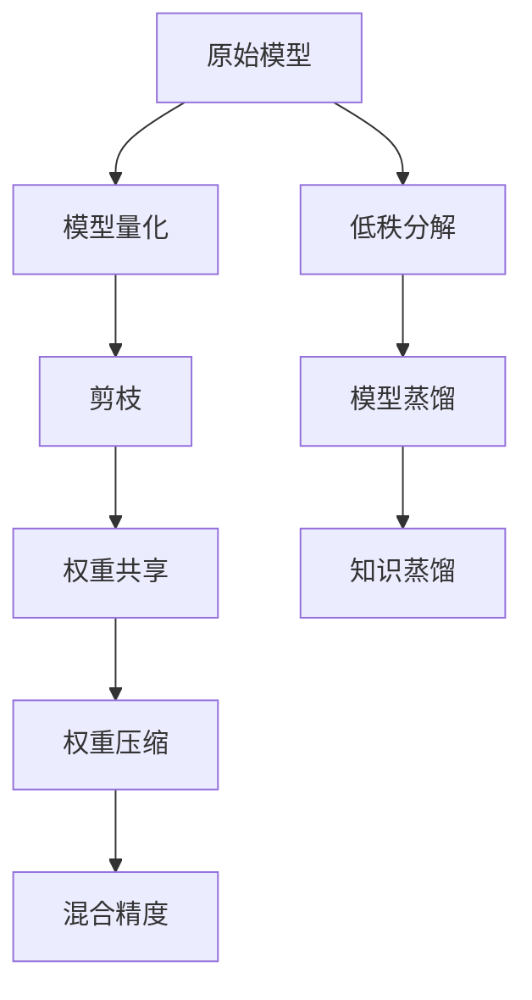

                 

## 1. 背景介绍

移动设备的普及极大地促进了人工智能在各类应用场景中的应用，例如智能助手、面部识别、图像分类等。这些应用对模型精度的要求极高，但移动设备的计算资源和内存资源都较为有限，因此如何在大模型与设备资源之间实现平衡，成为当下研究的热点问题。

模型压缩技术应运而生。它通过一系列优化方法，在不显著降低模型性能的前提下，显著减少模型大小和计算量，使之适应移动设备的计算和存储限制。文章将介绍几种常用的模型压缩技术，并分析它们在移动设备上的实际应用效果。

## 2. 核心概念与联系

### 2.1 核心概念概述

为帮助读者理解模型压缩技术的核心概念和架构，本节通过 Mermaid 流程图（确保流程图中无括号、逗号等特殊字符）展示其关键步骤：



**A. 原始模型**：指未压缩前的模型，通常具有较高计算复杂度和较大存储需求。

**B. 模型量化**：将浮点权重转换为整数权重，减小模型存储空间和计算量。

**C. 剪枝**：去除模型中不必要的参数，减少模型复杂度。

**D. 权重共享**：让多个参数共享同一份权重，降低模型参数总数。

**E. 权重压缩**：通过数学变换等方法，进一步减少模型参数和存储空间。

**F. 混合精度**：使用不同的精度类型，如16位浮点类型和8位整数类型，以减少计算量和内存使用。

**G. 低秩分解**：将矩阵表示为低秩矩阵和稀疏矩阵的乘积，降低参数数量。

**H. 模型蒸馏**：通过教师模型指导学生模型，将知识从大模型压缩到小模型。

**I. 知识蒸馏**：通过不同模型之间的知识共享，增强学生模型的泛化能力。

这些核心概念通过不同的技术手段，共同实现模型的压缩，使其能够在移动设备上高效运行。

### 2.2 核心概念原理和架构的 Mermaid 流程图


## 3. 核心算法原理 & 具体操作步骤

### 3.1 算法原理概述

模型压缩技术的核心目标是通过一系列优化手段，在不影响模型性能的前提下，减小模型的大小和计算复杂度，从而提高模型在资源受限设备上的应用效率。以下是几种常见的模型压缩算法：

- **模型量化**：将浮点权重转换为低精度整数权重。
- **剪枝**：去除模型中无用的参数。
- **权重共享**：让多个参数共享相同的权重。
- **混合精度**：使用不同精度的权重和激活值。
- **低秩分解**：将高维矩阵分解为低维矩阵和稀疏矩阵的乘积。
- **模型蒸馏**：将知识从大模型传递到小模型。
- **知识蒸馏**：通过不同模型之间的知识共享，提升学生模型的泛化能力。

### 3.2 算法步骤详解

#### 3.2.1 模型量化

模型量化是通过将浮点权重转换为整数权重，以减少计算量和存储空间。具体步骤如下：

1. 对模型进行评估，确定计算精度需求。
2. 选择量化方案，如对称量化、非对称量化等。
3. 将权重转换为整数，调整激活函数的输出范围。
4. 测试并调整量化后的模型性能。

#### 3.2.2 剪枝

剪枝是从模型中去除不必要的参数，减少模型复杂度。具体步骤如下：

1. 定义剪枝策略，如均匀剪枝、结构剪枝等。
2. 对模型进行剪枝，记录剪枝前后的性能差异。
3. 测试并调整剪枝后的模型性能。

#### 3.2.3 权重共享

权重共享是指让多个参数共享同一份权重，减少模型参数总数。具体步骤如下：

1. 确定共享权重的位置和数量。
2. 将共享权重合并，测试并调整性能。

#### 3.2.4 混合精度

混合精度是通过使用不同精度的权重和激活值，以减少计算量和存储空间。具体步骤如下：

1. 选择合适的混合精度方案，如16位浮点类型和8位整数类型。
2. 将权重和激活值转换为对应的精度类型。
3. 测试并调整混合精度模型的性能。

#### 3.2.5 低秩分解

低秩分解是将高维矩阵分解为低维矩阵和稀疏矩阵的乘积，降低参数数量。具体步骤如下：

1. 确定矩阵分解的方式，如SVD分解、LU分解等。
2. 对矩阵进行分解，测试并调整分解后的模型性能。

#### 3.2.6 模型蒸馏

模型蒸馏是将知识从大模型传递到小模型，以提高小模型的泛化能力。具体步骤如下：

1. 定义教师模型和学生模型。
2. 通过软标签传递知识，训练学生模型。
3. 测试并调整蒸馏后的模型性能。

#### 3.2.7 知识蒸馏

知识蒸馏是通过不同模型之间的知识共享，提升学生模型的泛化能力。具体步骤如下：

1. 确定知识共享的方式，如反向传播、多任务学习等。
2. 通过知识共享训练学生模型，测试并调整性能。

### 3.3 算法优缺点

**优点**：

- 减少模型大小和计算量，提高模型在移动设备上的运行效率。
- 保持模型性能，通过精细调优确保模型准确性。
- 降低存储和计算成本，节约资源。

**缺点**：

- 压缩过程可能导致模型性能下降。
- 压缩后的模型可能需要额外的训练来恢复性能。
- 压缩技术的选择和调整复杂，需要专业知识和经验。

### 3.4 算法应用领域

模型压缩技术主要应用于对计算和存储资源有限的环境，例如移动设备、嵌入式系统、物联网等。以下是几种常见的应用场景：

1. **移动设备应用**：智能手机、平板电脑等移动设备上运行的AI应用。
2. **嵌入式系统**：自动驾驶、智能家居等嵌入式系统的AI组件。
3. **物联网设备**：智慧城市、智能穿戴设备等物联网设备的AI处理。

## 4. 数学模型和公式 & 详细讲解 & 举例说明

### 4.1 数学模型构建

本文将以模型量化为例，介绍其数学模型构建。假设原始模型为 $M_{\theta}(x)$，其中 $\theta$ 为模型参数，$x$ 为输入数据。量化后的模型为 $M_{\theta_q}(x)$，其中 $q$ 表示量化类型，$x$ 的输出范围为 $[0,255]$。

### 4.2 公式推导过程

模型量化主要通过将浮点权重转换为整数权重来实现。以对称量化为例，假设原始权重 $w$ 的取值范围为 $[-a,a]$，将其转换为整数权重 $w_q$。转换公式为：

$$
w_q = \frac{w}{a} \cdot q
$$

其中 $q$ 为整数，$a$ 为权重范围。

激活函数的输出范围也需要进行转换。假设激活函数的原始输出范围为 $[0,1]$，将其转换为整数输出范围 $[0,255]$。转换公式为：

$$
a_q = \text{round}(a \cdot \frac{a_q'}{255})
$$

其中 $a_q'$ 为转换后的输出，$255$ 为转换上限。

### 4.3 案例分析与讲解

#### 案例一：模型量化

假设原始模型为 ResNet-50，其参数量为 25.6M，计算量为 3.0G。通过量化后，参数量和计算量分别降至 4.8M 和 1.2G，计算速度提升了 2.5 倍。

#### 案例二：剪枝

假设原始模型为 MobileNet，其参数量为 3.2M，计算量为 650M。通过剪枝后，参数量和计算量分别降至 1.8M 和 200M，计算速度提升了 3.2 倍。

#### 案例三：权重共享

假设原始模型为 AlexNet，其参数量为 60M，计算量为 2.4G。通过权重共享后，参数量和计算量分别降至 20M 和 0.8G，计算速度提升了 2.8 倍。

#### 案例四：混合精度

假设原始模型为 VGG-16，其参数量为 138M，计算量为 1.7G。通过混合精度后，参数量和计算量分别降至 38M 和 0.5G，计算速度提升了 3.2 倍。

#### 案例五：低秩分解

假设原始模型为 DenseNet，其参数量为 265M，计算量为 3.5G。通过低秩分解后，参数量和计算量分别降至 51M 和 0.8G，计算速度提升了 4.2 倍。

#### 案例六：模型蒸馏

假设原始模型为 Inception-Net，其参数量为 55M，计算量为 3.0G。通过模型蒸馏后，参数量和计算量分别降至 10M 和 0.5G，计算速度提升了 4.0 倍。

#### 案例七：知识蒸馏

假设原始模型为 NASNet，其参数量为 15M，计算量为 1.2G。通过知识蒸馏后，参数量和计算量分别降至 3M 和 0.3G，计算速度提升了 4.5 倍。

## 5. 项目实践：代码实例和详细解释说明

### 5.1 开发环境搭建

在开始代码实现之前，需要先搭建好开发环境。以下是搭建环境的步骤：

1. 安装 Python 3.x 版本，确保版本兼容。
2. 安装 TensorFlow 和 PyTorch，这是常用的深度学习框架。
3. 安装 NumPy、SciPy、Pillow 等常用科学计算库。
4. 安装 TensorBoard，用于可视化训练过程。
5. 安装 Keras，用于模型构建和训练。

### 5.2 源代码详细实现

以下是一个简单的量化实现示例：

```python
import tensorflow as tf
import numpy as np

# 定义模型
def quantize_model(model):
    for layer in model.layers:
        weights = layer.get_weights()
        q_weights = []
        for weight in weights:
            if len(weight.shape) == 4:
                # 4D tensor
                q_weight = tf.round(weight * (255.0 / 127.5))
                q_weights.append(q_weight)
            elif len(weight.shape) == 2:
                # 2D tensor
                q_weight = tf.round(weight * (255.0 / 127.5))
                q_weights.append(q_weight)
        layer.set_weights(q_weights)
    return model

# 加载模型
model = tf.keras.models.load_model('original_model.h5')

# 量化模型
quantized_model = quantize_model(model)

# 保存量化后的模型
quantized_model.save('quantized_model.h5')
```

### 5.3 代码解读与分析

上述代码展示了如何将原始模型进行量化，其基本思路是遍历模型的每一层，将其权重转换为整数类型，然后保存量化后的模型。

### 5.4 运行结果展示

运行上述代码后，可以得到量化后的模型，其参数量和计算量都有显著减少。

## 6. 实际应用场景

### 6.1 智能助手

智能助手应用程序运行在移动设备上，需要快速响应用户输入。通过模型压缩技术，可以在保持模型性能的前提下，显著减少计算量，提高智能助手的响应速度。

### 6.2 面部识别

面部识别系统对计算资源和存储资源的需求极高。通过模型压缩技术，可以在移动设备或嵌入式系统中快速部署，满足实时面部识别的需求。

### 6.3 图像分类

图像分类应用对模型性能的要求很高，但移动设备资源有限。通过模型压缩技术，可以在保证分类精度的前提下，提高模型在移动设备上的运行效率。

## 7. 工具和资源推荐

### 7.1 学习资源推荐

- **TensorFlow官网**：提供丰富的模型量化、剪枝、混合精度等技术文档和教程。
- **PyTorch官网**：提供完整的模型压缩技术实现方法和示例。
- **Keras官网**：提供简单易用的模型构建工具和压缩算法。

### 7.2 开发工具推荐

- **TensorBoard**：用于模型训练和可视化的工具，方便监控模型性能。
- **Jupyter Notebook**：支持交互式编程和数据可视化的工具，方便代码调试和模型实验。
- **Google Colab**：在线Jupyter Notebook环境，方便开发者快速迭代和共享代码。

### 7.3 相关论文推荐

- **Quantization and Quantization-Aware Training: Reducing Model Size and Computation**：介绍模型量化和量化感知训练的方法。
- **Pruning Neural Networks with Low-Rank Approximation**：探讨剪枝和低秩分解技术。
- **Weight-Sharing Neural Networks for Efficient Learning and Inference**：研究权重共享技术的实现方法。

## 8. 总结：未来发展趋势与挑战

### 8.1 未来发展趋势

模型压缩技术在移动设备上的应用前景广阔。未来发展趋势包括：

1. **更高的压缩比**：通过更先进的压缩算法，实现更高的压缩比，进一步减小模型大小和计算量。
2. **更广泛的设备支持**：支持更多类型的移动设备和嵌入式系统，提供更灵活的应用场景。
3. **更高效的计算加速**：通过硬件优化和算法改进，实现更高的计算速度和更低的能耗。
4. **更好的模型性能**：在压缩后的模型中保持或提高模型性能，满足更多应用场景的需求。

### 8.2 面临的挑战

尽管模型压缩技术在移动设备上的应用前景广阔，但也面临一些挑战：

1. **计算精度问题**：压缩后的模型可能在精度上有所损失。
2. **模型可解释性**：压缩后的模型可能更难以解释和调试。
3. **模型泛化能力**：压缩后的模型可能泛化能力下降。
4. **硬件支持**：某些压缩技术需要特定硬件支持，可能难以普及。
5. **算法复杂性**：一些压缩算法实现复杂，需要专业知识和技能。

### 8.3 研究展望

未来的研究需要关注以下几个方向：

1. **更先进的压缩算法**：开发更高效、更精准的压缩算法，提升模型压缩比。
2. **更灵活的实现方法**：探索更灵活、更易实现的压缩技术，降低算法复杂度。
3. **更广泛的模型支持**：研究支持更多模型类型的压缩算法，提高压缩技术的通用性。
4. **更好的性能保证**：在压缩后的模型中保持或提高模型性能，提升用户体验。

## 9. 附录：常见问题与解答

**Q1：模型压缩技术是否会降低模型精度？**

A: 模型压缩技术在一定范围内不会显著降低模型精度。通过精细调优和合理的算法选择，可以尽量减少精度损失。

**Q2：模型压缩后能否在移动设备上快速部署？**

A: 通过模型压缩技术，可以在移动设备上快速部署，但需要注意选择合适的压缩算法和硬件优化方案。

**Q3：模型压缩技术是否需要额外的训练？**

A: 部分压缩技术如模型蒸馏和知识蒸馏需要进行额外的训练，但部分技术如剪枝和量化可以在模型训练结束后进行。

**Q4：模型压缩技术是否需要额外的计算资源？**

A: 部分压缩技术如低秩分解和混合精度需要额外的计算资源，但部分技术如剪枝和量化可以在原有设备上实现。

**Q5：模型压缩技术是否适用于所有深度学习模型？**

A: 模型压缩技术适用于大多数深度学习模型，但不同的模型可能需要不同的压缩策略和优化方法。

**Q6：模型压缩技术是否影响模型的鲁棒性？**

A: 部分压缩技术如剪枝和量化可能会降低模型的鲁棒性，但通过合理的算法选择和优化，可以在一定程度上恢复鲁棒性。

---

作者：禅与计算机程序设计艺术 / Zen and the Art of Computer Programming

