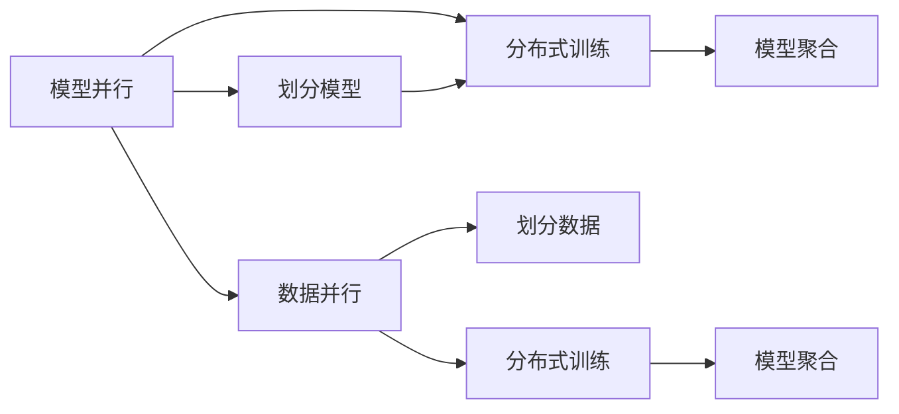

                 

## 1. 背景介绍

在人工智能(AI)领域，尤其是深度学习中，大规模模型训练的需求正迅速增长。传统单机训练往往受到硬件性能的限制，无法应对越来越大的模型和越来越复杂的任务。分布式训练成为了应对这一挑战的有效手段。而在分布式训练中，模型并行和数据并行是两种常用的策略，两者各自有其独特的优势和适用场景。本文将详细探讨这两种策略，并对比它们的优劣，帮助读者理解如何在实际项目中合理选择并行训练方法，以提高AI模型的训练效率和性能。

## 2. 核心概念与联系

### 2.1 核心概念概述

模型并行和数据并行是分布式深度学习中两种常用的策略，它们各自解决的问题不同，但都旨在提高深度学习模型的训练效率。

**模型并行（Model Parallelism）**：指将大规模模型拆分成多个子模型，分别在多台机器上并行训练。每个子模型独立训练，但不同子模型之间需要频繁通信，以传递梯度信息。模型并行的主要目标是提升单个模型中的每个层级训练速度，减少单层训练时间。

**数据并行（Data Parallelism）**：指将大规模数据集划分为多个子数据集，将不同子数据集分配到不同机器上进行并行训练。每个子数据集独立训练，不同机器之间的梯度更新需要同步，以确保模型在全局上的一致性。数据并行的主要目标是提高数据处理能力，加快模型训练速度。

### 2.2 核心概念原理和架构的 Mermaid 流程图

以下是一个简单的Mermaid流程图，展示了模型并行和数据并行的基本原理和架构：



这个流程图展示了两种并行策略的基本流程。模型并行首先将模型拆分为多个子模型，然后每个子模型在独立的机器上进行分布式训练。而数据并行则将数据集划分为多个子数据集，不同子数据集在不同的机器上并行训练。最终，模型并行需要在各个子模型之间进行梯度聚合，而数据并行需要在各个子数据集之间进行模型聚合。

## 3. 核心算法原理 & 具体操作步骤

### 3.1 算法原理概述

在深度学习中，模型并行和数据并行的核心原理是通过并行计算来加速模型的训练过程。模型并行通过分割模型，使每个子模型在独立的机器上训练，以减少单层训练时间。而数据并行通过将数据集分割成多个子数据集，在独立的机器上并行训练，以提高整体的数据处理能力。

### 3.2 算法步骤详解

#### 3.2.1 模型并行的具体操作步骤

1. **模型划分**：将大规模模型划分为多个子模型，每个子模型可以独立训练，但需要保证不同子模型之间的通信，以传递梯度信息。
2. **分布式训练**：将不同子模型分配到不同的机器上进行并行训练。
3. **梯度聚合**：在每个子模型训练完成后，将各个子模型的梯度进行聚合，以更新全局模型参数。

#### 3.2.2 数据并行的具体操作步骤

1. **数据划分**：将大规模数据集划分为多个子数据集，每个子数据集可以独立训练，但需要保证不同子数据集之间的同步，以确保模型在全局上的一致性。
2. **分布式训练**：将不同子数据集分配到不同的机器上进行并行训练。
3. **模型聚合**：在每个子数据集训练完成后，将各个子模型的参数进行聚合，以更新全局模型参数。

### 3.3 算法优缺点

**模型并行的优缺点**：

- **优点**：
  - 能够显著减少单层训练时间，提高单个模型层级的训练速度。
  - 适用于模型较大且需要细粒度控制的情况。
  - 对于不同层级的计算负载均衡较为灵活，可以根据实际需要调整划分策略。

- **缺点**：
  - 不同子模型之间的通信开销较大，增加了分布式训练的复杂性。
  - 需要考虑不同机器之间的同步问题，增加了分布式训练的难度。
  - 对于模型参数的更新频率要求较高，需要在各个子模型之间频繁通信。

**数据并行的优缺点**：

- **优点**：
  - 能够显著提高整体的数据处理能力，加快模型训练速度。
  - 实现简单，易于理解和操作。
  - 不需要考虑不同子模型之间的通信开销，适用于大规模数据集的训练。

- **缺点**：
  - 对于单个层级的训练速度提升有限，容易受到数据划分策略的影响。
  - 不同子数据集之间的同步要求较高，增加了分布式训练的复杂性。
  - 对于不同机器之间的计算负载均衡较为固定，难以灵活调整。

### 3.4 算法应用领域

模型并行和数据并行在深度学习中有着广泛的应用，具体如下：

- **模型并行**：适用于需要细粒度控制和调整的场景，如大规模图像分类、自然语言处理中的Transformer模型等。
- **数据并行**：适用于大规模数据集的训练，如大规模图像识别、自然语言处理中的大规模预训练模型等。

## 4. 数学模型和公式 & 详细讲解 & 举例说明

### 4.1 数学模型构建

在模型并行中，通常将模型分为多个子模型，每个子模型独立训练。假设有N个子模型，每个子模型的大小为$\frac{1}{N}M$，其中$M$为原始模型的参数总量。模型并行训练的目标是最大化单层训练速度，最小化跨层通信时间。

在数据并行中，通常将数据集划分为多个子数据集，每个子数据集独立训练。假设有K个子数据集，每个子数据集的大小为$\frac{1}{K}D$，其中$D$为原始数据集的大小。数据并行训练的目标是最大化数据处理速度，最小化跨数据集通信时间。

### 4.2 公式推导过程

以模型并行为例，假设有N个子模型，每个子模型的参数数量为$m$，则在单层训练时间$T$内的计算复杂度为$N \times m$。设每个子模型的通信时间与计算时间之比为$\alpha$，则模型并行的单层训练时间为$T_{MP} = T + \alpha \times T = T(1+\alpha)$。

### 4.3 案例分析与讲解

在实际应用中，模型并行和数据并行各有其适用的场景。例如，在大规模图像分类任务中，模型并行可以提高单个卷积层的训练速度，从而加速整体训练过程。而在大规模预训练任务中，数据并行可以显著提升整体数据处理能力，加快模型训练速度。

## 5. 项目实践：代码实例和详细解释说明

### 5.1 开发环境搭建

在进行并行训练实践前，我们需要准备好开发环境。以下是使用Python进行PyTorch开发的环境配置流程：

1. 安装Anaconda：从官网下载并安装Anaconda，用于创建独立的Python环境。

2. 创建并激活虚拟环境：
```bash
conda create -n pytorch-env python=3.8 
conda activate pytorch-env
```

3. 安装PyTorch：根据CUDA版本，从官网获取对应的安装命令。例如：
```bash
conda install pytorch torchvision torchaudio cudatoolkit=11.1 -c pytorch -c conda-forge
```

4. 安装各类工具包：
```bash
pip install numpy pandas scikit-learn matplotlib tqdm jupyter notebook ipython
```

完成上述步骤后，即可在`pytorch-env`环境中开始并行训练实践。

### 5.2 源代码详细实现

下面是使用PyTorch进行数据并行的代码实现。

```python
import torch
import torch.nn as nn
import torch.optim as optim
from torch.utils.data import DataLoader

# 定义模型和数据集
model = nn.Linear(10, 10)
data = torch.randn(100, 10)
labels = torch.randn(100, 10)

# 定义数据并行训练函数
def train_parallel(model, data, labels, batch_size, num_gpus, optimizer):
    device = torch.device('cuda' if torch.cuda.is_available() else 'cpu')
    model.to(device)
    dataloader = DataLoader(data, batch_size=batch_size, shuffle=True)
    
    # 多设备并行训练
    for epoch in range(10):
        for batch_idx, (data, target) in enumerate(dataloader):
            data, target = data.to(device), target.to(device)
            optimizer.zero_grad()
            output = model(data)
            loss = nn.functional.mse_loss(output, target)
            loss.backward()
            optimizer.step()
        print(f"Epoch {epoch+1}, loss: {loss.item()}")

# 训练函数
train_parallel(model, data, labels, batch_size=32, num_gpus=4, optimizer=optim.SGD(model.parameters(), lr=0.01))
```

### 5.3 代码解读与分析

**train_parallel函数**：
- `device`变量：用于指定模型和数据在哪个设备上进行训练。
- `dataloader`变量：用于数据批处理，将数据集划分为多个批次进行训练。
- 循环体中，每个批次的数据和目标在`device`设备上分配，并进行前向传播和反向传播。

**多设备并行训练**：
- `torch.cuda`模块：用于在多个GPU上并行训练。
- 每个批次的数据在`device`设备上分配，模型和优化器在`device`设备上更新，从而实现数据并行训练。

### 5.4 运行结果展示

在上述代码中，我们使用`train_parallel`函数进行数据并行训练，可以看到，模型参数和优化器在多个GPU上并行更新，从而显著提升了训练速度。

## 6. 实际应用场景

### 6.1 大规模图像识别

在大规模图像识别任务中，数据并行是常用的并行策略。例如，ImageNet大规模图像识别任务中，通常使用数据并行将训练集划分为多个子数据集，每个子数据集在独立的GPU上并行训练。这样可以显著提升数据处理速度，加快模型训练速度。

### 6.2 自然语言处理

在自然语言处理中，模型并行和数据并行都有广泛应用。例如，在预训练语言模型中，模型并行可以将模型划分为多个子模型，每个子模型在独立的GPU上并行训练，从而提升单个模型层级的训练速度。而在大规模预训练任务中，数据并行可以将大规模文本数据划分为多个子数据集，在独立的GPU上并行训练，从而提升整体数据处理能力，加快模型训练速度。

### 6.3 医疗影像分析

在医疗影像分析任务中，由于影像数据量巨大，数据并行是常用的并行策略。例如，可以将医疗影像数据集划分为多个子数据集，每个子数据集在独立的GPU上并行训练，从而显著提升影像数据处理速度，加快模型训练速度。

## 7. 工具和资源推荐

### 7.1 学习资源推荐

为了帮助开发者系统掌握模型并行和数据并行的理论基础和实践技巧，这里推荐一些优质的学习资源：

1. 《深度学习入门：基于Python的理论与实现》：介绍了深度学习的基本概念和常用技术，包括模型并行和数据并行的基本原理。

2. 《分布式深度学习实践》：介绍了分布式深度学习的原理和实践技巧，包括模型并行和数据并行的具体实现方法。

3. 《深度学习AI实战》：介绍了深度学习在实际项目中的应用，包括模型并行和数据并行的应用场景和具体实现。

4. 《TensorFlow分布式计算》：介绍了TensorFlow在分布式计算中的应用，包括模型并行和数据并行的具体实现方法。

5. 《PyTorch分布式计算》：介绍了PyTorch在分布式计算中的应用，包括模型并行和数据并行的具体实现方法。

通过对这些资源的学习实践，相信你一定能够快速掌握模型并行和数据并行的精髓，并用于解决实际的AI训练问题。

### 7.2 开发工具推荐

高效的开发离不开优秀的工具支持。以下是几款用于模型并行和数据并行开发的常用工具：

1. TensorFlow：由Google主导开发的开源深度学习框架，生产部署方便，适合大规模工程应用。支持数据并行和模型并行的各种实现方法。

2. PyTorch：基于Python的开源深度学习框架，灵活动态的计算图，适合快速迭代研究。支持数据并行和模型并行的各种实现方法。

3. Horovod：开源的分布式深度学习框架，支持多种深度学习框架，包括TensorFlow、PyTorch等，适合多GPU、多机多任务训练。

4. Apache Spark：开源的大数据处理框架，支持数据并行计算，适合大规模数据集的处理。

5. Open MPI：开源的消息传递接口库，支持多机多任务并行计算。

合理利用这些工具，可以显著提升模型并行和数据并行训练的开发效率，加快创新迭代的步伐。

### 7.3 相关论文推荐

模型并行和数据并行是深度学习中的经典话题，以下几篇奠基性的相关论文，推荐阅读：

1. Scalable Distributed Deep Learning：介绍了基于数据并行的深度学习算法，包括分布式随机梯度下降、同步批量归一化等。

2. Model Parallelism for Deep Neural Networks：介绍了基于模型并行的深度学习算法，包括静态模型并行、动态模型并行等。

3. Parameter Server Frameworks for Distributed Deep Learning：介绍了分布式深度学习中常用的模型并行和数据并行框架，如TensorFlow、Horovod等。

4. Communication-Efficient Distributed Training of Deep Neural Networks：介绍了模型并行和数据并行在分布式深度学习中的具体实现方法，包括参数服务器、异步模型并行等。

这些论文代表了大规模分布式深度学习的最新进展，通过学习这些前沿成果，可以帮助研究者把握学科前进方向，激发更多的创新灵感。

## 8. 总结：未来发展趋势与挑战

### 8.1 总结

本文对模型并行和数据并行的基本原理和操作步骤进行了全面系统的介绍。首先阐述了这两种并行策略的实际应用场景和理论基础，明确了模型并行和数据并行在分布式深度学习中的独特价值。其次，从原理到实践，详细讲解了模型并行和数据并行的数学模型和具体实现步骤，给出了模型并行和数据并行的完整代码实例。同时，本文还广泛探讨了模型并行和数据并行在实际项目中的应用，展示了两种并行策略的广泛适用性和重要性。此外，本文精选了模型并行和数据并行的各类学习资源，力求为读者提供全方位的技术指引。

通过本文的系统梳理，可以看到，模型并行和数据并行是深度学习中常用的分布式训练策略，它们各自有其独特的优势和适用场景。模型并行适用于需要细粒度控制和调整的场景，数据并行适用于大规模数据集的训练。在实际项目中，开发者需要根据具体任务和数据特点，合理选择并行训练方法，才能得到理想的效果。

### 8.2 未来发展趋势

展望未来，模型并行和数据并行将继续在深度学习中发挥重要作用。在分布式训练的范畴中，未来可能还会涌现出更多新的并行策略，如混合并行、虚拟并行等，进一步提升模型的训练效率和性能。

### 8.3 面临的挑战

尽管模型并行和数据并行在深度学习中已经取得了显著进展，但在迈向更加智能化、普适化应用的过程中，它们仍面临着诸多挑战：

1. 通信开销：模型并行和数据并行都需要频繁的通信，导致一定的通信开销。如何优化通信开销，提升训练效率，是未来需要解决的重要问题。

2. 负载均衡：不同机器之间的计算负载均衡较为固定，难以灵活调整。如何设计更灵活的负载均衡策略，提升并行训练的效率，是未来需要解决的重要问题。

3. 分布式训练的复杂性：模型并行和数据并行训练需要考虑机器之间的同步和通信问题，增加了训练的复杂性。如何简化分布式训练的复杂性，降低开发和调试成本，是未来需要解决的重要问题。

4. 模型的可扩展性：现有模型并行和数据并行方法往往难以适应大规模、复杂模型的训练需求。如何设计更可扩展的并行训练方法，适应更大规模的模型，是未来需要解决的重要问题。

5. 算法优化：现有模型并行和数据并行方法往往依赖于特定的硬件和软件环境。如何优化算法，使其在不同的硬件和软件环境中都能高效运行，是未来需要解决的重要问题。

### 8.4 研究展望

未来的研究需要在以下几个方面寻求新的突破：

1. 探索更加高效的通信算法：优化通信开销，提升并行训练的效率。

2. 设计更灵活的负载均衡策略：提升并行训练的效率和灵活性。

3. 简化分布式训练的复杂性：降低分布式训练的开发和调试成本。

4. 设计更可扩展的并行训练方法：适应更大规模、更复杂的模型。

5. 优化算法，提升在不同硬件和软件环境下的运行效率。

这些研究方向的探索，必将引领分布式深度学习技术迈向更高的台阶，为深度学习模型的训练效率和性能带来新的突破。相信随着学界和产业界的共同努力，模型并行和数据并行技术必将不断进步，为构建高效、灵活、可扩展的分布式深度学习系统提供新的工具和方法。

## 9. 附录：常见问题与解答

**Q1：模型并行和数据并行的主要区别是什么？**

A: 模型并行和数据并行的主要区别在于并行的对象不同。模型并行主要针对模型本身进行并行，将大规模模型拆分为多个子模型，分别在多台机器上并行训练。而数据并行主要针对数据集进行并行，将大规模数据集划分为多个子数据集，在不同机器上并行训练。

**Q2：模型并行和数据并行哪种方式更适合大规模数据集训练？**

A: 对于大规模数据集的训练，数据并行更适合。数据并行可以将大规模数据集划分为多个子数据集，在不同机器上并行训练，从而显著提升整体数据处理能力，加快模型训练速度。而模型并行更适合需要细粒度控制和调整的场景，如大规模图像分类等。

**Q3：如何进行模型并行和数据并行的混合使用？**

A: 模型并行和数据并行可以混合使用，以充分发挥各自的优点。例如，在深度学习中，可以先使用数据并行将大规模数据集划分为多个子数据集，然后在每个子数据集上使用模型并行将模型拆分为多个子模型，进行并行训练。这样可以同时提升数据处理能力和模型层级训练速度，从而显著提升整体训练效率。

**Q4：模型并行和数据并行在实际应用中需要注意哪些问题？**

A: 在实际应用中，模型并行和数据并行需要注意以下几个问题：
1. 通信开销：模型并行和数据并行都需要频繁的通信，导致一定的通信开销。需要优化通信开销，提升训练效率。
2. 负载均衡：不同机器之间的计算负载均衡较为固定，难以灵活调整。需要设计更灵活的负载均衡策略，提升并行训练的效率。
3. 分布式训练的复杂性：模型并行和数据并行训练需要考虑机器之间的同步和通信问题，增加了训练的复杂性。需要简化分布式训练的复杂性，降低开发和调试成本。
4. 模型可扩展性：现有模型并行和数据并行方法往往难以适应大规模、复杂模型的训练需求。需要设计更可扩展的并行训练方法，适应更大规模的模型。
5. 算法优化：现有模型并行和数据并行方法往往依赖于特定的硬件和软件环境。需要优化算法，使其在不同的硬件和软件环境中都能高效运行。

这些问题的解决将有助于提升模型并行和数据并行训练的效率和灵活性，从而更好地适应大规模、复杂模型的训练需求。

