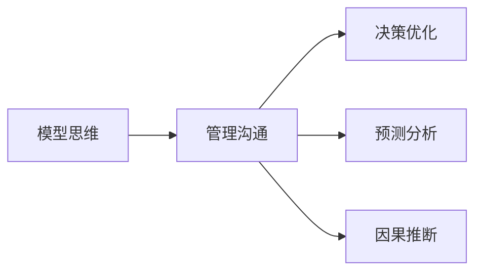

                 

# 模型思维在管理沟通中的运用

> 关键词：模型思维, 管理沟通, 决策优化, 预测分析, 因果推断, 机器学习, 模型选择, 数据驱动, 模型部署

## 1. 背景介绍

在现代企业管理中，沟通与协作不可或缺。传统上，企业依赖于会议、邮件、报告等方式进行信息传递。然而，这些手段效率低下、信息传递不及时、难以量化，难以满足日益复杂化的决策需求。模型思维作为数据驱动的决策方式，近年来逐渐被引入管理沟通中，帮助企业构建以数据为基础的沟通框架，实现信息的精准传递和高效决策。

模型思维，是指通过建立数学模型或机器学习模型，对现实问题进行建模、分析和预测的过程。其核心在于利用数据挖掘和统计分析，提取隐含的规律和趋势，辅助企业进行科学决策。模型思维不仅适用于技术研发和创新，在管理沟通中同样具有广泛的应用前景。

## 2. 核心概念与联系

### 2.1 核心概念概述

本节将介绍几个核心概念及其相互关系：

- 模型思维：通过建立数学模型或机器学习模型，对现实问题进行建模、分析和预测的过程。核心在于利用数据挖掘和统计分析，提取隐含的规律和趋势，辅助决策。

- 管理沟通：指在企业管理中，通过各种方式将信息传递给决策者和执行者，确保信息准确、及时、完整地传达，促进企业内部的协调和合作。

- 决策优化：通过模型思维辅助管理沟通，实现信息的高效传递，支撑企业决策的科学化和精细化。

- 预测分析：利用历史数据建立模型，预测未来趋势，辅助企业对市场变化、产品需求等进行前瞻性决策。

- 因果推断：通过因果关系建模，深入分析事件因果链条，避免信息传递中的假象和偏差。

这些核心概念共同构成了模型思维在管理沟通中的应用框架，帮助企业在数据驱动下，实现信息的精准传递和高效决策。

### 2.2 核心概念原理和架构的 Mermaid 流程图



以上流程图展示了模型思维在管理沟通中的核心应用流程。企业通过模型思维，利用数据分析和建模，辅助决策优化和预测分析，确保信息的高效传递和精确表达。

## 3. 核心算法原理 & 具体操作步骤

### 3.1 算法原理概述

模型思维在管理沟通中的应用，基于以下基本原理：

- **数据驱动决策**：利用数据分析和模型计算，辅助决策者进行科学、准确的判断。

- **信息精准传递**：通过数学模型和机器学习模型，将复杂问题分解为可计算的量化指标，实现信息的精准传递。

- **预测与优化**：利用历史数据和模型预测未来趋势，进行事前预防和事后调整，实现决策的精细化管理。

- **因果推断与误差纠正**：通过因果关系建模，识别影响决策的关键因素，进行误差校正和优化。

### 3.2 算法步骤详解

基于模型思维的管理沟通，主要包括以下几个关键步骤：

**Step 1: 数据收集与预处理**

- 收集相关业务数据，包括销售数据、市场调研、员工绩效等。
- 对数据进行清洗、去重、归一化等预处理，确保数据的质量和一致性。

**Step 2: 数据建模与分析**

- 选择合适的模型（如回归模型、分类模型、聚类模型等），对数据进行建模。
- 利用统计分析、特征工程等手段，提取关键指标和特征，构建决策支持模型。

**Step 3: 模型验证与优化**

- 对模型进行交叉验证、网格搜索等手段，评估模型性能。
- 根据评估结果，优化模型参数，提升模型预测准确性和泛化能力。

**Step 4: 模型部署与应用**

- 将优化后的模型集成到业务系统中，实现自动化预测和决策支持。
- 定期评估模型效果，根据业务变化进行模型更新和迭代。

### 3.3 算法优缺点

基于模型思维的管理沟通，具有以下优点：

1. **决策科学化**：模型驱动的决策过程，降低了主观偏见，提升了决策的科学性和可重复性。
2. **信息高效传递**：模型计算和量化，确保信息传递的精确和及时。
3. **预测与优化**：模型可以提前预测市场趋势和业务变化，辅助企业进行事前预防和事后调整。
4. **因果推断**：通过模型推断事件间的因果关系，避免信息传递中的假象和偏差。

同时，该方法也存在一定的局限性：

1. **数据依赖**：模型依赖于数据的质量和完整性，数据偏差可能导致模型预测失效。
2. **模型复杂性**：复杂模型计算量大，训练和部署成本较高。
3. **模型更新**：模型需要定期更新和迭代，才能保持其预测和决策的有效性。

尽管存在这些局限性，但就目前而言，基于模型思维的管理沟通方法仍是大数据时代的重要手段。未来相关研究的重点在于如何进一步降低模型对数据的要求，提高模型的泛化能力，同时兼顾可解释性和实用性等因素。

### 3.4 算法应用领域

基于模型思维的管理沟通方法，已经在多个领域得到了广泛应用，如：

- **市场营销**：通过销售数据分析，预测市场趋势，优化营销策略，提升销售业绩。
- **供应链管理**：通过库存和物流数据分析，预测供应链需求，优化库存和配送，降低运营成本。
- **人力资源管理**：通过员工绩效和员工满意度数据分析，预测人才流失风险，优化招聘和培训策略。
- **财务管理**：通过财务数据建模，预测财务指标变化，辅助财务决策，优化资金分配。
- **产品开发**：通过客户反馈数据分析，预测产品需求，优化产品设计和生产，提升客户满意度。

除了上述这些经典应用外，模型思维还将在更多场景中得到应用，如风险管理、质量控制、客户关系管理等，为企业管理带来新的视角和工具。

## 4. 数学模型和公式 & 详细讲解 & 举例说明

### 4.1 数学模型构建

模型思维在管理沟通中，通常涉及以下几类数学模型：

- 回归模型：用于预测连续型变量的数值，如销售预测、成本分析等。
- 分类模型：用于预测离散型变量的分类结果，如市场细分、客户满意度等。
- 聚类模型：用于发现数据中的群体结构，如员工分组、产品分类等。

以销售预测为例，构建回归模型的基本步骤如下：

1. 收集历史销售数据。
2. 对数据进行预处理，去除异常值、填补缺失值等。
3. 利用历史数据训练回归模型，如线性回归、多项式回归、神经网络回归等。
4. 对模型进行评估和优化，确保预测精度。

### 4.2 公式推导过程

以线性回归模型为例，推导其公式。假设自变量为 $x$，因变量为 $y$，线性回归模型表示为：

$$
y = \beta_0 + \beta_1 x_1 + \beta_2 x_2 + \cdots + \beta_k x_k + \epsilon
$$

其中，$\beta_0$ 为截距，$\beta_1,\beta_2,\cdots,\beta_k$ 为回归系数，$\epsilon$ 为误差项。利用最小二乘法求解 $\beta_0,\beta_1,\cdots,\beta_k$，使得 $\epsilon$ 的平方和最小。

$$
\hat{y} = \beta_0 + \beta_1 x_1 + \beta_2 x_2 + \cdots + \beta_k x_k
$$

利用Python和Scikit-learn库，可以进行线性回归模型的实现。具体代码如下：

```python
from sklearn.linear_model import LinearRegression

# 假设数据为x和y，x为自变量，y为因变量
x = [[1], [2], [3], [4], [5]]
y = [2, 4, 6, 8, 10]

# 创建线性回归模型
model = LinearRegression()

# 训练模型
model.fit(x, y)

# 预测新样本
x_new = [[6]]
y_new = model.predict(x_new)
print(y_new)
```

### 4.3 案例分析与讲解

假设某电商公司希望预测未来一个月的销售额。利用历史销售数据，构建线性回归模型进行预测。

1. 数据收集：收集过去12个月的历史销售数据，包括日期、销售额、促销活动、节假日等。
2. 数据预处理：去除异常值、填补缺失值、归一化数据等。
3. 模型构建：利用历史数据训练线性回归模型，预测未来一个月的销售额。
4. 模型评估：在验证集上评估模型预测精度，调整模型参数。
5. 模型应用：将优化后的模型集成到销售系统中，实现自动销售预测。

通过模型预测，电商公司可以提前调整库存、优化促销策略，提升销售额和客户满意度。

## 5. 项目实践：代码实例和详细解释说明

### 5.1 开发环境搭建

在进行模型思维的实践前，我们需要准备好开发环境。以下是使用Python进行Scikit-learn开发的Python环境配置流程：

1. 安装Anaconda：从官网下载并安装Anaconda，用于创建独立的Python环境。

2. 创建并激活虚拟环境：
```bash
conda create -n sklearn-env python=3.8 
conda activate sklearn-env
```

3. 安装Scikit-learn：
```bash
pip install scikit-learn
```

4. 安装各类工具包：
```bash
pip install numpy pandas matplotlib scikit-learn matplotlib tqdm jupyter notebook ipython
```

完成上述步骤后，即可在`sklearn-env`环境中开始模型思维的实践。

### 5.2 源代码详细实现

下面我们以销售预测任务为例，给出使用Scikit-learn进行线性回归的PyTorch代码实现。

首先，定义销售预测任务的数据处理函数：

```python
import numpy as np
from sklearn.linear_model import LinearRegression
from sklearn.metrics import mean_squared_error

def load_data(file_path):
    with open(file_path, 'r') as f:
        lines = f.readlines()
    data = np.array([line.strip().split(',') for line in lines])
    X = data[:, :-1].astype(float)
    y = data[:, -1].astype(float)
    return X, y

# 加载数据
X, y = load_data('sales_data.csv')

# 将数据划分为训练集和测试集
train_size = int(0.8 * len(X))
X_train, y_train = X[:train_size], y[:train_size]
X_test, y_test = X[train_size:], y[train_size:]
```

然后，定义模型和优化器：

```python
from sklearn.linear_model import LinearRegression

model = LinearRegression()

# 训练模型
model.fit(X_train, y_train)

# 预测新数据
y_pred = model.predict(X_test)
```

最后，评估模型性能：

```python
# 评估模型
mse = mean_squared_error(y_test, y_pred)
print(f'Mean Squared Error: {mse:.2f}')
```

以上就是使用Scikit-learn对销售数据进行线性回归的完整代码实现。可以看到，利用Scikit-learn，我们可以用相对简洁的代码完成线性回归模型的训练和评估。

### 5.3 代码解读与分析

让我们再详细解读一下关键代码的实现细节：

**load_data函数**：
- 定义了数据加载函数，将CSV格式的数据文件读入，并转化为numpy数组。

**模型训练**：
- 使用Scikit-learn的LinearRegression类创建线性回归模型。
- 利用训练集数据训练模型，生成模型参数。
- 利用测试集数据评估模型预测效果。

**模型评估**：
- 使用均方误差(MSE)作为评估指标，评估模型预测的准确性。
- 打印输出评估结果，方便后续分析。

通过上述代码，我们实现了基于线性回归的销售预测模型。在实际应用中，我们可以进一步利用特征选择、模型调参等技术，优化模型性能，提升预测精度。

## 6. 实际应用场景

### 6.1 市场营销

在市场营销中，模型思维通过数据驱动决策，优化营销策略。例如，某公司可以通过历史销售数据和市场调研数据，建立预测模型，预测不同广告投放渠道的ROI，优化广告投放策略。通过模型预测，公司可以精准定位目标客户，提升广告效果和投资回报率。

### 6.2 供应链管理

在供应链管理中，模型思维通过数据分析，优化库存和配送。例如，某电商公司可以利用历史销售数据和物流数据，建立需求预测模型，预测未来商品库存水平，优化库存管理。通过模型预测，公司可以合理调整库存量，减少缺货和积压，降低运营成本。

### 6.3 人力资源管理

在人力资源管理中，模型思维通过数据分析，优化招聘和培训。例如，某公司可以通过员工绩效和满意度数据，建立预测模型，预测员工流失风险，优化招聘和培训策略。通过模型预测，公司可以及时发现潜在员工流失问题，采取有效措施，提升员工满意度和留任率。

### 6.4 财务管理

在财务管理中，模型思维通过数据分析，优化财务决策。例如，某公司可以通过历史财务数据，建立预测模型，预测未来财务指标变化，优化资金分配。通过模型预测，公司可以合理规划资金使用，提升资金利用效率，降低财务风险。

### 6.5 产品开发

在产品开发中，模型思维通过数据分析，优化产品设计和生产。例如，某公司可以通过客户反馈数据，建立预测模型，预测产品需求，优化产品设计和生产。通过模型预测，公司可以精准定位市场需求，提升产品竞争力和市场份额。

### 6.6 未来应用展望

随着模型思维的不断进步，其在管理沟通中的应用前景将更加广阔。未来，基于模型思维的管理沟通将具备以下特点：

1. **数据驱动**：模型思维将更多地依赖数据驱动决策，提升决策的科学性和可重复性。
2. **实时分析**：通过实时数据分析，企业可以快速响应市场变化，实现动态调整。
3. **多模态融合**：模型思维将融合多模态数据，提升信息传递的准确性和全面性。
4. **因果推断**：通过因果关系建模，企业可以深入分析事件因果链条，避免信息传递中的假象和偏差。
5. **自动化决策**：模型思维将通过自动化决策系统，实现信息的高效传递和决策的自动化。

## 7. 工具和资源推荐

### 7.1 学习资源推荐

为了帮助开发者系统掌握模型思维的理论基础和实践技巧，这里推荐一些优质的学习资源：

1. 《机器学习实战》系列书籍：由大数据和机器学习专家撰写，详细介绍了机器学习的基本概念和实现方法。

2. CS229《机器学习》课程：斯坦福大学开设的经典机器学习课程，系统讲解了机器学习的基本理论和算法。

3. 《Python数据科学手册》书籍：深入介绍了Python在数据分析和机器学习中的应用，适合动手实践。

4. Kaggle竞赛平台：Kaggle提供了大量的数据集和竞赛任务，是学习和实践模型思维的好地方。

5. Coursera、edX等在线学习平台：提供了丰富的机器学习和数据科学课程，适合系统学习。

通过对这些资源的学习实践，相信你一定能够快速掌握模型思维在管理沟通中的应用，并用于解决实际的商业问题。

### 7.2 开发工具推荐

高效的开发离不开优秀的工具支持。以下是几款用于模型思维开发的常用工具：

1. Jupyter Notebook：免费、开源的交互式编程环境，支持Python、R等多种语言，适合动手实践和数据可视化。

2. PyCharm：功能强大的Python IDE，集成了丰富的开发工具和插件，适合快速迭代研究。

3. Anaconda：开源的Python环境管理工具，支持虚拟环境、包管理、版本控制等，适合大规模数据处理和模型开发。

4. TensorFlow、PyTorch：开源的深度学习框架，支持多GPU训练和分布式计算，适合大规模模型训练。

5. Weights & Biases：模型训练的实验跟踪工具，可以记录和可视化模型训练过程中的各项指标，方便对比和调优。

6. Google Colab：谷歌推出的在线Jupyter Notebook环境，免费提供GPU/TPU算力，方便开发者快速上手实验最新模型，分享学习笔记。

合理利用这些工具，可以显著提升模型思维的开发效率，加快创新迭代的步伐。

### 7.3 相关论文推荐

模型思维作为数据驱动的决策方式，近年来在各个领域得到了广泛应用。以下是几篇奠基性的相关论文，推荐阅读：

1. 《机器学习：原理、算法与应用》：通俗易懂地介绍了机器学习的基本概念和实现方法，适合入门读者。

2. 《数据挖掘与统计学习基础》：深入讲解了数据挖掘和统计学习的基本原理和应用，适合进阶读者。

3. 《因果推断方法学》：系统介绍了因果推断的基本原理和应用，适合研究者深入学习。

4. 《强化学习：原理与算法》：介绍了强化学习的基本原理和应用，适合对智能决策感兴趣的读者。

5. 《深度学习》：全面介绍了深度学习的基本原理和应用，适合对人工智能技术感兴趣的读者。

这些论文代表了大数据时代下的技术发展脉络，通过学习这些前沿成果，可以帮助研究者把握学科前进方向，激发更多的创新灵感。

## 8. 总结：未来发展趋势与挑战

### 8.1 研究成果总结

本文对模型思维在管理沟通中的应用进行了全面系统的介绍。首先阐述了模型思维在数据驱动决策中的重要性和应用前景，明确了模型思维在企业管理沟通中的独特价值。其次，从原理到实践，详细讲解了模型思维的基本流程和关键步骤，给出了模型思维任务开发的完整代码实例。同时，本文还广泛探讨了模型思维在市场营销、供应链管理、人力资源管理等诸多领域的应用前景，展示了模型思维范式的巨大潜力。

### 8.2 未来发展趋势

展望未来，模型思维在管理沟通中的应用将呈现以下几个发展趋势：

1. **数据质量提升**：随着大数据技术的发展，数据的获取和处理将更加高效，数据质量将得到提升，为模型驱动的决策提供更可靠的基础。
2. **实时分析能力增强**：模型思维将越来越多地应用于实时数据分析，提升企业对市场变化的快速响应能力。
3. **多模态融合**：模型思维将融合多模态数据，提升信息传递的准确性和全面性。
4. **因果推断深化**：因果推断方法将在企业决策中得到更广泛的应用，帮助企业深入分析事件因果链条，避免信息传递中的假象和偏差。
5. **自动化决策系统普及**：通过自动化决策系统，企业可以实现信息的高效传递和决策的自动化。

以上趋势凸显了模型思维在企业管理沟通中的广阔前景。这些方向的探索发展，必将进一步提升企业管理决策的科学性和可控性，推动企业的数字化转型和智能化升级。

### 8.3 面临的挑战

尽管模型思维在管理沟通中已经取得了不少成功，但在迈向更加智能化、普适化应用的过程中，它仍面临着诸多挑战：

1. **数据依赖**：模型思维依赖于高质量的数据，数据偏差可能导致模型预测失效。
2. **模型复杂性**：复杂模型计算量大，训练和部署成本较高。
3. **模型更新**：模型需要定期更新和迭代，才能保持其预测和决策的有效性。
4. **可解释性不足**：模型输出往往缺乏可解释性，难以理解和调试。
5. **安全性问题**：模型预测可能存在偏见和误差，影响决策公正性和安全性。

尽管存在这些挑战，但就目前而言，模型思维在管理沟通中仍是大数据时代的重要手段。未来相关研究的重点在于如何进一步降低模型对数据的要求，提高模型的泛化能力，同时兼顾可解释性和安全性等因素。

### 8.4 研究展望

面对模型思维所面临的种种挑战，未来的研究需要在以下几个方面寻求新的突破：

1. **无监督学习**：探索无监督学习范式，降低模型对标注数据的需求，提升模型泛化能力。
2. **模型压缩**：开发模型压缩技术，降低模型计算量和存储空间，提升模型部署效率。
3. **因果推断**：深入研究因果推断方法，提升模型预测的准确性和公正性。
4. **可解释性**：提升模型输出的可解释性，增强模型决策的透明性和可控性。
5. **安全性**：研究模型安全性问题，确保模型预测的公正性和安全性。

这些研究方向的探索，必将引领模型思维在管理沟通中的应用走向更高的台阶，为构建智能化的企业管理沟通系统铺平道路。只有勇于创新、敢于突破，才能不断拓展模型思维的边界，让智能技术更好地造福人类社会。

## 9. 附录：常见问题与解答

**Q1：模型思维在管理沟通中是否适用于所有企业？**

A: 模型思维在企业管理沟通中的应用，需要企业具备一定的数据基础和技术能力。数据质量和计算资源的充足是模型思维应用的前提。但对于具有强大数据积累和技术实力的企业，模型思维可以显著提升其决策水平和运营效率。

**Q2：模型思维的预测精度如何保证？**

A: 模型思维的预测精度依赖于高质量的数据和合适的模型选择。在实践中，可以通过以下手段提升模型预测精度：
1. 数据清洗和预处理：去除异常值、填补缺失值、归一化数据等。
2. 特征工程：提取关键指标和特征，构建决策支持模型。
3. 模型选择和调参：选择合适的模型，进行网格搜索和交叉验证，优化模型参数。
4. 模型评估和迭代：利用测试集数据评估模型预测精度，根据业务变化进行模型更新和迭代。

**Q3：模型思维在实时分析中的应用有哪些？**

A: 模型思维在实时分析中的应用，可以涵盖以下几方面：
1. 实时预测：通过实时数据分析，企业可以快速响应市场变化，实现动态调整。
2. 实时监控：通过实时监控系统，企业可以实时跟踪业务指标，及时发现问题并采取措施。
3. 实时推荐：通过实时推荐系统，企业可以动态调整推荐策略，提升用户体验。

**Q4：模型思维在因果推断中的应用有哪些？**

A: 模型思维在因果推断中的应用，可以涵盖以下几方面：
1. 因果关系建模：通过因果关系建模，企业可以深入分析事件因果链条，避免信息传递中的假象和偏差。
2. 误差校正：通过因果推断，企业可以识别和校正模型预测中的误差，提升决策准确性。
3. 政策评估：通过因果推断，企业可以评估政策效果，优化决策方案。

**Q5：模型思维在决策中的应用有哪些？**

A: 模型思维在决策中的应用，可以涵盖以下几方面：
1. 决策支持：通过模型驱动的决策支持系统，企业可以提升决策的科学性和可重复性。
2. 风险管理：通过模型预测和评估，企业可以识别和应对潜在风险，优化决策方案。
3. 优化资源分配：通过模型预测和分析，企业可以优化资源分配，提升资源利用效率。

通过本文的系统梳理，可以看到，模型思维在管理沟通中的应用前景广阔，能够显著提升企业决策的科学性和可控性。然而，在实践中，还需要不断优化数据质量、模型选择和部署策略，方能充分发挥模型思维的优势。总之，模型思维将为企业管理带来全新的视角和工具，助力企业在数据驱动下实现智能化转型和升级。

