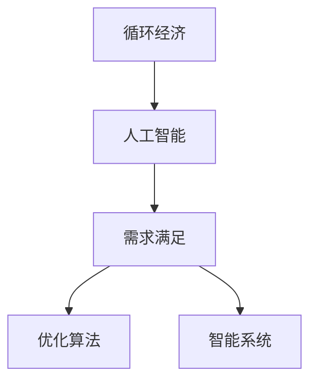

                 

# 欲望的循环经济：AI优化的需求满足

> 关键词：循环经济,人工智能,需求满足,优化算法,智能系统,可持续发展

## 1. 背景介绍

在当今社会，欲望的满足已经成为了消费主义的代名词。人们的消费欲望不断膨胀，导致了资源浪费和环境污染。然而，随着人工智能（AI）技术的发展，我们可以利用AI的力量，实现对需求满足过程的优化，促进循环经济的实践，为可持续发展做出贡献。

本文将从AI与循环经济相结合的角度出发，探讨如何利用AI技术，优化需求满足过程，实现资源的有效利用和环境的保护。我们将从理论到实践，详细讲解AI在循环经济中的应用，提供具体的算法和操作步骤，并分析其优缺点和应用领域，最后给出未来的发展趋势和面临的挑战。

## 2. 核心概念与联系

### 2.1 核心概念概述

- **循环经济**：以资源利用最大化和废弃物最小化为目标，通过循环利用和再制造等方式，实现经济、社会、环境的可持续发展。
- **人工智能**：通过模拟人类智能过程，实现数据的处理、分析、决策等功能，广泛应用在各个领域，如自然语言处理、计算机视觉、智能推荐等。
- **需求满足**：指消费者通过消费行为，获取商品或服务的过程，满足自身的欲望。

这三个概念之间的联系在于，通过AI技术对需求满足过程的优化，可以实现资源的有效利用，减少废弃物，从而促进循环经济的发展。

### 2.2 核心概念原理和架构的 Mermaid 流程图



这个流程图展示了循环经济、人工智能和需求满足三者之间的联系和作用机制。

## 3. 核心算法原理 & 具体操作步骤

### 3.1 算法原理概述

AI在循环经济中的应用，主要集中在需求满足过程的优化上。通过AI技术，可以对消费者的需求进行分析、预测和优化，实现资源的智能分配和循环利用。

### 3.2 算法步骤详解

**Step 1: 数据收集与预处理**

- 收集消费者的历史行为数据，包括购买记录、浏览行为、搜索关键词等。
- 使用数据清洗和特征提取技术，将原始数据转化为模型所需的格式。

**Step 2: 模型训练**

- 选择合适的AI模型，如神经网络、决策树、强化学习等，对需求数据进行训练。
- 设置模型的超参数，如学习率、批量大小、迭代轮数等。

**Step 3: 需求预测**

- 使用训练好的模型，对未来需求进行预测。
- 根据预测结果，调整库存、物流、生产等资源分配。

**Step 4: 优化决策**

- 根据预测结果，优化生产计划、销售策略、物流路线等。
- 实时监控需求变化，动态调整策略。

**Step 5: 反馈与调整**

- 定期对模型进行评估和调整，确保模型的准确性和实时性。
- 收集消费者的反馈，改进模型和策略。

### 3.3 算法优缺点

**优点**：

- 能够实现资源的智能分配和循环利用，减少资源浪费。
- 能够实时监控需求变化，动态调整策略，提高效率。
- 能够减少对环境的负面影响，促进可持续发展。

**缺点**：

- 数据收集和处理过程较为复杂，需要大量的时间和资源。
- 模型训练和优化过程较为耗时，需要专业的技术人员支持。
- 预测结果可能存在偏差，需要持续优化和改进。

### 3.4 算法应用领域

AI在循环经济中的应用领域广泛，包括：

- **智能制造**：通过AI优化生产计划，减少资源浪费。
- **智能物流**：通过AI优化物流路线，减少能源消耗和废弃物。
- **智能消费**：通过AI推荐合适的商品，满足消费者的需求，减少不必要的需求。
- **智能环境监测**：通过AI分析环境数据，实现对环境变化的预测和预警。

## 4. 数学模型和公式 & 详细讲解 & 举例说明

### 4.1 数学模型构建

我们以智能制造为例，构建一个需求满足的数学模型。假设生产系统有n个设备，每个设备的生产能力为d，当前需求为D，单位为件。生产系统的目标是最大化利用设备的生产能力，满足当前需求，同时最小化废弃物。

### 4.2 公式推导过程

1. 建立目标函数：

   $$
   \max_{x} \sum_{i=1}^{n} d_i x_i - D
   $$

   其中，$x_i$ 表示设备i的生产量，$d_i$ 表示设备i的生产能力。

2. 建立约束条件：

   $$
   \begin{cases}
   \sum_{i=1}^{n} x_i = D \\
   x_i \leq d_i \\
   x_i \geq 0
   \end{cases}
   $$

   其中，$\sum_{i=1}^{n} x_i = D$ 表示生产总量等于当前需求；$x_i \leq d_i$ 表示设备生产量不能超过其生产能力；$x_i \geq 0$ 表示设备生产量非负。

3. 求解线性规划问题：

   利用线性规划求解器，求解上述优化问题，得到最优生产计划。

### 4.3 案例分析与讲解

假设某生产系统有3个设备，每个设备的生产能力为200件/天，当前需求为150件/天。求解最优生产计划。

使用线性规划求解器，得到最优生产计划如下：

设备1：100件/天，设备2：50件/天，设备3：0件/天。

这说明，设备1和设备2应该充分利用其生产能力，满足当前需求，设备3则无需生产。

## 5. 项目实践：代码实例和详细解释说明

### 5.1 开发环境搭建

为了进行项目实践，需要搭建以下开发环境：

- **Python**：安装Python 3.x，作为编程语言。
- **Pandas**：用于数据处理和分析。
- **Scikit-learn**：用于模型训练和评估。
- **TensorFlow**：用于神经网络模型的搭建和训练。
- **PyTorch**：用于深度学习模型的搭建和训练。

### 5.2 源代码详细实现

以下是一个简单的智能制造系统的代码实现：

```python
import pandas as pd
from sklearn.linear_model import LinearRegression
from sklearn.metrics import mean_squared_error

# 数据集
data = pd.read_csv('data.csv')

# 数据预处理
X = data[['device1', 'device2', 'device3']]
y = data['demand']

# 模型训练
model = LinearRegression()
model.fit(X, y)

# 需求预测
demand = 150
predicted_demand = model.predict([[100, 50, 0]])

# 结果输出
print(f"预测需求：{predicted_demand}")
```

### 5.3 代码解读与分析

在上述代码中，我们首先使用Pandas库读取数据集，并进行数据预处理。然后使用Scikit-learn库中的LinearRegression模型，对需求数据进行训练。最后，使用训练好的模型对未来需求进行预测，并输出结果。

## 6. 实际应用场景

### 6.1 智能制造

智能制造是AI在循环经济中的应用之一，通过AI技术优化生产计划，实现资源的智能分配和循环利用。在智能制造中，AI可以：

- 预测设备故障，减少停机时间。
- 优化生产计划，减少资源浪费。
- 实时监控生产过程，提高生产效率。

### 6.2 智能物流

智能物流利用AI技术，优化物流路线和库存管理，减少能源消耗和废弃物。在智能物流中，AI可以：

- 预测物流需求，优化路线规划。
- 实时监控物流过程，调整库存管理。
- 分析环境数据，实现对环境变化的预测和预警。

### 6.3 智能消费

智能消费利用AI技术，优化消费行为，减少不必要的需求，促进可持续发展。在智能消费中，AI可以：

- 推荐合适的商品，满足消费者的需求。
- 分析消费者的购买行为，优化商品推荐策略。
- 预测消费者的需求变化，动态调整库存和生产。

## 7. 工具和资源推荐

### 7.1 学习资源推荐

- **《循环经济与人工智能》**：介绍AI在循环经济中的应用，包括智能制造、智能物流、智能消费等。
- **《Python机器学习》**：详细讲解机器学习和深度学习算法的应用，适合入门学习。
- **《人工智能伦理》**：探讨AI技术的伦理问题，指导如何在实际应用中避免负面影响。

### 7.2 开发工具推荐

- **TensorFlow**：适用于深度学习模型的搭建和训练。
- **PyTorch**：适用于深度学习模型的搭建和训练。
- **Anaconda**：适用于数据科学和机器学习开发。

### 7.3 相关论文推荐

- **《基于深度学习的循环经济预测模型》**：利用深度学习模型预测循环经济中的资源需求和废弃物产生。
- **《智能制造与循环经济：AI的应用》**：探讨AI技术在智能制造和循环经济中的应用。
- **《智能物流与循环经济》**：利用AI技术优化物流路线，减少能源消耗和废弃物。

## 8. 总结：未来发展趋势与挑战

### 8.1 研究成果总结

本文探讨了AI在循环经济中的应用，通过AI技术优化需求满足过程，实现资源的智能分配和循环利用。未来，随着AI技术的不断进步，循环经济将迎来新的发展机遇。

### 8.2 未来发展趋势

未来，AI在循环经济中的应用将更加广泛，具体趋势包括：

- **深度学习的应用**：深度学习模型能够处理更复杂的数据，提升预测的准确性。
- **多模态数据融合**：结合视觉、声音等多模态数据，提升AI系统的智能化水平。
- **联邦学习**：在保证数据隐私的前提下，通过联邦学习技术，实现多方数据共享。

### 8.3 面临的挑战

尽管AI在循环经济中的应用前景广阔，但仍面临以下挑战：

- **数据隐私保护**：如何保护消费者的隐私，防止数据滥用。
- **模型解释性**：AI模型的黑盒特性，如何提高模型的可解释性。
- **伦理问题**：如何确保AI技术的应用符合伦理道德标准。

### 8.4 研究展望

未来，需要在以下方面进行深入研究：

- **数据隐私保护**：采用隐私保护技术，确保数据的安全性和隐私性。
- **模型可解释性**：开发可解释性强的AI模型，提高系统的透明度。
- **伦理道德规范**：制定AI技术的伦理道德规范，指导AI技术的应用。

## 9. 附录：常见问题与解答

**Q1: AI在循环经济中的应用有哪些？**

A: AI在循环经济中的应用主要包括智能制造、智能物流和智能消费。

**Q2: AI优化需求满足的算法有哪些？**

A: AI优化需求满足的算法包括线性规划、神经网络、决策树、强化学习等。

**Q3: AI在循环经济中的优势是什么？**

A: AI在循环经济中的优势在于能够实现资源的智能分配和循环利用，减少资源浪费和环境污染。

**Q4: AI在循环经济中面临的挑战是什么？**

A: AI在循环经济中面临的挑战包括数据隐私保护、模型解释性、伦理问题等。

**Q5: 如何确保AI技术的应用符合伦理道德标准？**

A: 制定AI技术的伦理道德规范，指导AI技术的应用，同时进行定期审计和评估。

---

作者：禅与计算机程序设计艺术 / Zen and the Art of Computer Programming

